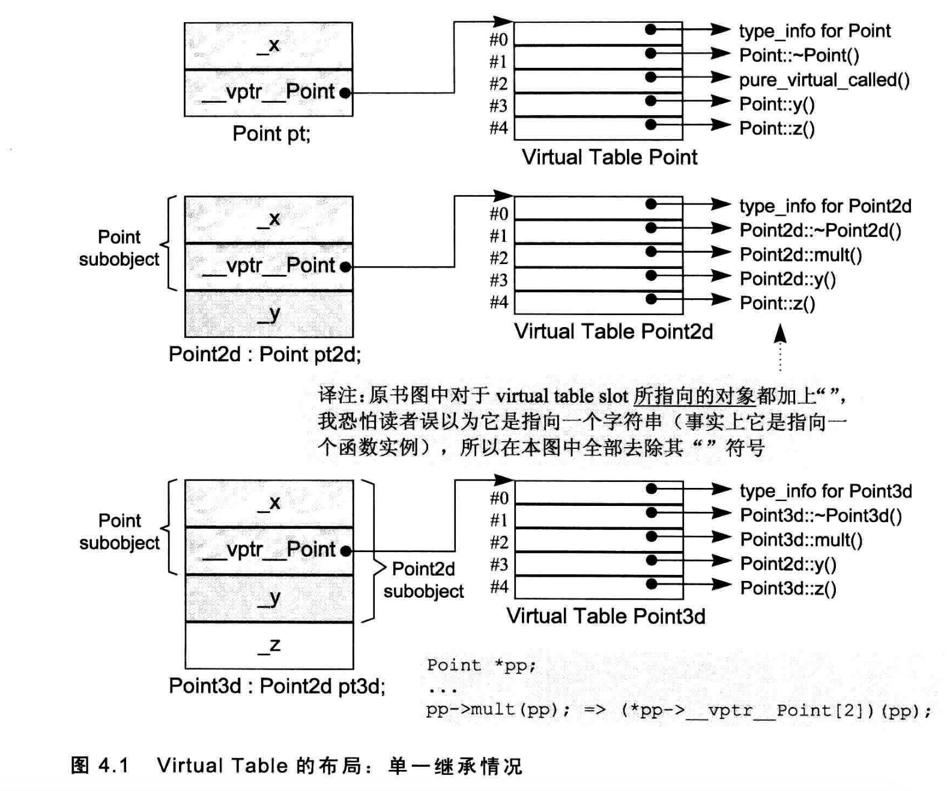
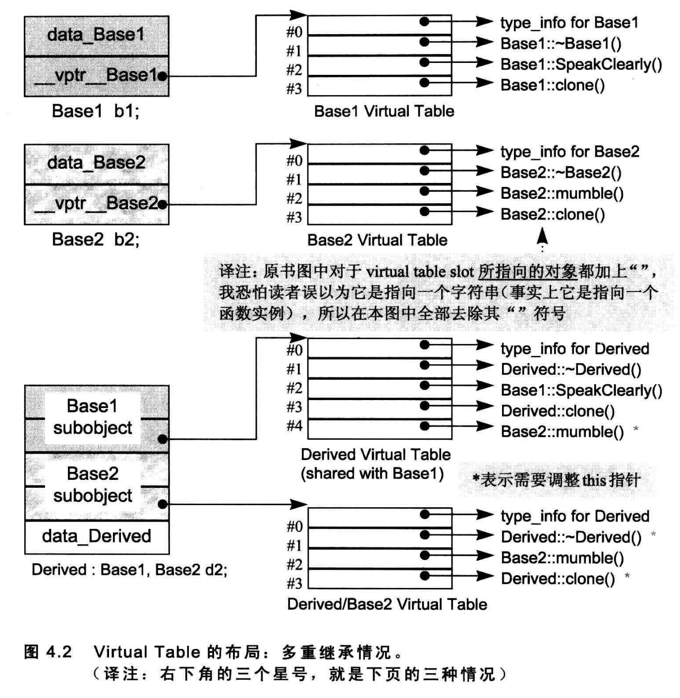
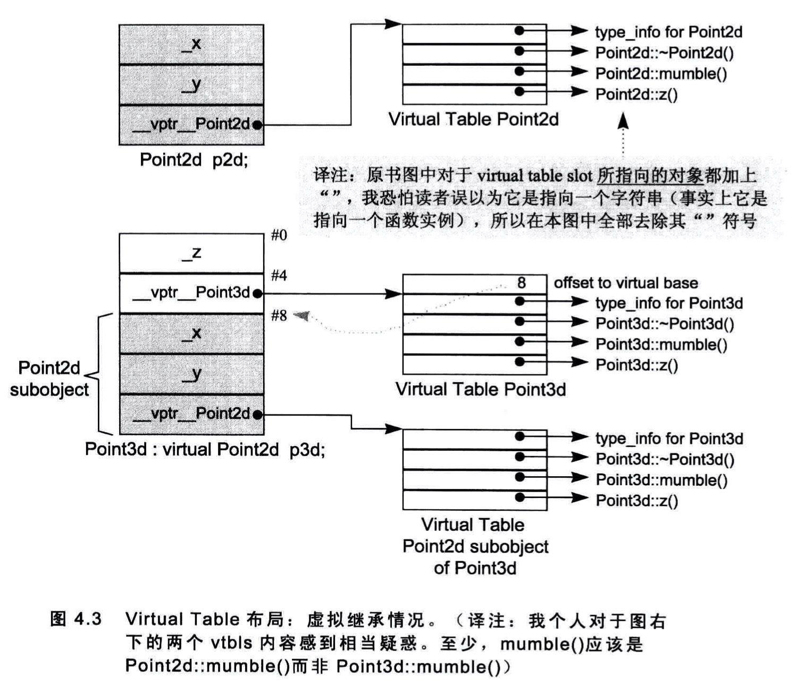

# 成员的各种调用方式

## 非静态成员函数

nonstatic member function 和一般的nonmember function有相同的效率。

```cpp
float magnitude3d(const Point3d* this) {...}//nonmember function
float Point3d::magnitude3d() const {...}//nonstatic member function
```

nonstatic member function在内部会转为nonmember function：

1.  改写函数原型，增加一个额外参数用来传递this指针。
2.  对非静态成员变量的存取改为通过this来完成。
3.  将成员函数名称进行混淆。

**名称混淆**

一般处理方法是方法名称+类+参数类型。不同编译器混淆的方式不同。

编译器可以混淆名称，也可以反混淆名称。

## 虚拟成员函数

如果normalize()是一个virtual member function，那么

```cpp
ptr->normalize();
```

将会被内部转化为：

```cpp
(*ptr->vptr[1])(ptr);
```

其中：

-   vptr表示由编译器产生的指针，指向virtual table。它被安插在每一个声明有(或继承自)一个或多个virtual functions的class object中。（其名称也会被混淆，因为在一个复杂的class派生体系中，可能存在多个vptrs）。
-   1是virtual table slot的索引值，关联到normalize()函数。
-   第二个ptr表示this指针。

>   normalize是一个函数，内部会调用magnitude()

magnitude()调用类似。

如果用类作用运算符调用虚函数，其决议方式和非静态成员函数一样。

编译器的一种优化方式：如果是通过对象（不是指针和引用）调用虚函数，编译器可以决议成非静态成员函数。

## 静态成员函数

对静态函数调用，则会转为对非成员函数的调用。

非静态成员函数内部传递了一个this指针，而静态成员函数没有传递this指针，所以静态成员函数不能调用非静态成员变量。

静态成员函数的特性：

-   不能够直接存取其class中的nonstatic members。
-   不能够被声明为const、volatile或virtual。
-   不需要经由class object才被调用。

如果取一个static member function的地址，获得的将是其在内存中的位置，也就是其地址。由于static member function没有this指针，所以其地址的类型并不是一个“指向class member function的指针”，而是一个“nonmember函数指针”。

```cpp
namespace function {
    class Function{
    public:
        static int fun(double);
        float fun2(char);
    };
};
```

```cpp
void function::test1() {
    int (*psf)(double);
    psf = &function::Function::fun;

    float (function::Function::*pf)(char);
    pf = &function::Function::fun2;
}
```

# 虚函数

为了支持virtual function机制，必须首先能够对于多态对象有某种形式的“执行期类型判断法(runtime type resolution)”。

一种实现方式是这样的：

1.  它所参考到的对象的地址(也就是目前它所持有的东西)
2.  对象类型的某种编码，或是某个结构(内含某些信息，用以正确决议出函数实例)的地址。

这个方法带来两个问题：第一，它明显增加了空间负担，即使程序并不使用多态(polymorphism)；第二，它打断了与C程序间的链接兼容性。

>   所以这个方案没有采用。

如何正确调用虚函数：

-   ptr所指对象的真实类型。这可选择正确的z()实例;
-   z()实例的位置，以便能够调用它。

一种布局：



在单一继承下，会有这3种情况：

1.  它可以继承base class所声明的virtual functions的函数实例。正确地说是，该函数实例的地址会被拷贝到derived class的virtual table的相对应slot之中。
2.  它可以使用自己的函数实例。这表示它自己的函数实例地址必须放在对应的slot之中。
3.  它可以加入一个新的virtual function。 这时候virtual table的尺寸会增大一个slot，而新的函数实例地址会被放进该slot之中。

## 多重继承下的虚函数

在多重继承中支持virtual functions，其复杂度围绕在第二个及后继的baseclasses身上，以及“必须在执行期调整this指针”这一点。

```cpp
class Base1 {
public:
    Base1();
    virtual ~Base1();
    virtual void speakClearly();
    virtual Base1 *clone() const;
protected :
    float data_Base1;
};

class Base2 {
public:
    Base2();
    virtual ~Base2();
    void mumble();
    virtual Base2 *clone() const;
protected:
    float data_Base2;
};

class Derived : public Base1, public Base2 {
public:
    Derived();
    virtual ~Derived();
    virtual Derived *clone() const;
protected:
    float data_Derived;
};
```

"Derived支持virtual functions"的困难度，统统落在Base2 subobject 身上。有三个问题需要解决，以此例而言分别是(1) virtual destructor， (2)被继承下来的Base2:mumble()，(3)一组clone() 函数实例。

经由指向“第二或后继之base class” 的指针(或reference)来调用derived class virtual function。

一种做法是这样的：

将virtual table加大，使它容纳此处所需的this指针，调整相关事物。每一个virtual table slot，不再只是一个指针，而是一个集合体，内含可能的offset以及地址。于是virtual function的调用操作由：

```cpp
(*pbase2->vptr[1]) ( pbase2 ) ;
```

改变为:

```cpp
( *pbase2->vptr[1].faddr )
( pbase2 + pbase2->vptr[1].offset ) ;
```

其中fddr内含virtual function地址，offset内含this指针调整值。

这个做法的缺点是，它相当于连坐“处罚”了所有的virtual function调用操作，不管它们是否需要offset 的调整。我所谓的“处罚”，包括offset的额外存取及其加法，以及每一个virtual table slot的大小改变。

比较有效率的解决方法是利用所谓的thunk。

所谓thunk是一小段assembly代码，用来(1)以适当的offset值调整this指针，(2)跳到virtual function去。
例如，经由一个Base2指针调用Derived destructor，其相关的thunk可能看起来是这个样子：

```cpp
//虚拟C++代码
pbase2_dtor_thunk：
	this += sizeof ( basel );
	Derived::~Derived ( this );
```

Thunk 技术允许 virtual table slot继续内含一个简单的指针，因此多重继承不需要任何空间上的额外负担。Slots中的地址可以直接指向 virtual function，也可以指向一个相关的 thunk (如果需要调整 this指针的话)。于是，对于那些不需要调整this 指针的 virtual function而言，也就不需承载效率上的额外负担。

调整 this 指针的第二个额外负担就是，由于两种不同的可能：(1)经由 derived class(或第一个 base class)调用，(2)经由第二个(或其后继) base class 调用，同一函数在virtual table中可能需要多笔对应的slots。例如：

```cpp
Basel *pbase1 = new Derived;
Base2 *pbase2 = new Derived;
...
delete pbase1;
delete pbase2;
```


虽然两个delete操作导致相同的 Derived destructor，但它们需要两个不同的virtual table slots：

1. pbase1不需要调整 this 指针(因为Base1是最左端 base class 之故，它已经指向Derived对象的起始处)。其 virtual table slot 需放置真正的 destructor地址。
2. pbase2 需要调整 this 指针。其virtual table slot 需要相关的thunk 地址。

在多重继承之下，一个 derived class内含n-1个额外的virtual tables，n表示其上一层 base classes 的个数(因此,单一继承将不会有额外的virtual tables)。对于本例的Derived而言，会有两个 virtual tables被编译器产生出来：

1.  一个主要实例,与Basel(最左端base class)共享。
2.  一个次要实例,与Base2 (第二个base class)有关。

针对每一个 virtual tables，Derived 对象中有对应的vptr。



于是当你将一个 Derived 对象地址指定给一个Basel 指针或 Derived 指针时，被处理的virtual table是主要表格vtbl_Derived.而当你将一个Derived 对象地址指定给一个 Base2 指针时，被处理的 virtual table是次要表格vtbl_Base2_Derived。

第二种情况是第一种情况的变化,通过一个“指向derived class”的指针，调用第二个 base class中一个继承而来的virtual function。在此情况下, derived class指针必须再次调整，以指向第二个 base subobject。例如：

```cpp
Derived *pder = new Derived;
// 调用 Base2::mumble()
// pder 必须被向前调整sizeof ( Basel )个bytes
pder->mumble ();
```

第三种情况发生于一个语言扩充性质之下：允许一个 virtual function的返回值类型有所变化，可能是base type，也可能是publicly derived type。这一点可以经由Derived::clone函数实例来说明。clone 函数的Derived 版本传回一个 Derived class
指针，默默地改写了它的两个base class 函数实例。当我们通过“指向第二个baseclass”的指针来调用 clone()时，this 指针的offset 问题于是诞生了：

```cpp
Base2 *pbl = new Derived;
// Derived* Derived::clone()
// 返回值必须被调整，以指向Base2 subobject
Base2 *pb2 = pbl->clone();
```

## 虚拟继承下的虚函数



不要在一个 virtual base class 中声明 nonstatic data members。如果这么做，你会距离复杂的深渊愈来愈近，终不可拔。

# 指向 Member Function 的指针

```cpp
class Function {
public:
    static int fun(double);
    float fun2(char);
};

void function::test1() {
    int (*psf)(double);
    psf = &function::Function::fun;

    float (function::Function::*pf)(char);
    pf = &function::Function::fun2;
}
```

指向 member function的指针的声明语法，以及指向“member selection 运算符”的指针，其作用是作为this 指针的空间保留者。这也就是为什么 static member functions(没有t his 指针)的类型是“函数指针”，而不是“指向 member function的指针”之故。

## 指向虚函数的指针

考虑下面的程序片段：

```cpp
float (Point::*pmf) () = &Point::z;
Point *ptr = new Point3d;
```

pmf，一个指向 member function 的指针，被设值为Point::z()(一个 virtual function)的地址。ptr则被指定以一个 Point3d对象。如果我们直接经由ptr调用z()：

```cpp
ptr->z();
```

被调用的是Point3d::z()。但如果我们从 pmf间接调用z()呢?

```cpp
( ptr->*pmf ) ();
```

这种情况下仍然是Point3d::z()。


在前一小节中,我们看到了,对一个 nonstatic member function 取其地址,将
获得该函数在内存中的地址。然而面对一个 virtual function,其地址在编译时期是
未知的,所能知道的仅是virtual function在其相关之 virtual table中的索引值。也就
是说,对一个virtual member function 取其地址,所能获得的只是一个索引值。
176


Page 210
第4章 Function 语意学
例如,假设我们有以下的Point声明:
class Point
{
public:
virtual ~Point ();
float x ();
float y () ;
virtual float z ();
//
...
};
然后取 destructor 的地址:
&Point::~Point;
得到的结果是1。取x0或y0的地址:
&Point::x () ;
&Point::y () ;
得到的则是函数在内存中的地址,因为它们不是virtual.取z0的地址:
&Point::z () ;
得到的结果是2。通过 pmf来调用 z0,会被内部转化为一个编译时期的式子,一般
形式如下:
ptr->vptr[ (int)pmf ]) ( ptr );
对一个“指向member function的指针”评估求值(evaluated),会因为该值
有两种意义而复杂化:其调用操作也将有别于常规调用操作。pmf的内部定义,也
就是:
float (Point::*pmf) ();
必须允许此函数能够寻址出nonvirtual x)和virtual z0两个member functions,而那
两个函数有着相同的原型:
177


Page 211
深度探索C++对象模型(Inside The C++ Object Model)
1/ 二者都可以被指定给 pmf
float Point::x() { return _x; }
float Point::z ()
{ return 0; }
只不过其中一个代表内存地址(一长串),另一个代表virtual table中的索引值(一
小段)。因此,编译器必须定义 pmf,使它能够(1)持有两种数值,(2)更重要
的是其数值可以被区别代表内存地址还是 Virtual table 中的索引值。你有什么好点
子吗?
在cfront 2.0 非正式版中,这两个值被内含在一个普通的指针内。cfront 如何识
别该值是内存地址还是 virtual table 索引呢?它用了以下技巧:
((( int ) pmf ) & -127 )
?
// non-virtual invocation
( *pmf ) ( ptr )
// virtual invocation
ptr->vptr[ (int) pmf ]( ptr ) );
一如 Stroustrup 在[LIPP88]中所说:
当然啦,这种实现技巧必须假设继承体系中最多只有128个virtual functions.
这并不是我们所希望的,但却证明是可行的。然而,多重继承的引入,导致需要更
一般化的实现模式,并趁机除去对 virtual functions 的个数限制。
在多重继承之下,指向Member Functions 的指针
为了让指向 member functions 的指针也能够支持多重继承和虚拟继承,
Stroustrup 设计了下面一个结构体([LIPP88]中有其原始内容):
1/ 一般结构,用以支持
// 在多重继承之下指向 member functions的指针
struct
_mptr {
int delta;
int index;
union {
ptrtofunc
faddr;
int
v_offset;
};
};
178


Page 212
第4章 Function 语意学
它们要表现什么呢? index 和faddr 分别(不同时)持有virtual table 索引和
nonvirtual member function 地址(为了方便,当 index不指向virtual table 时,会被
设为-1)。在此模型之下,像这样的调用操作:
( ptr->*pmf ) ();
会变成:
( pmf.index < 0 )
? // non-virtual invocation
( *pmf.faddr ) ( ptr )
: // virtual invocation
( * ptr->vptr[ pmf.index] (ptr) ) ;
此法所受到的批评是,每一个调用操作都得付出上述成本,检查其是否为
virtual 或nonvirtual。 Microsoft 把这项检查拿掉,导入一个它所谓的vcall thunk。
在此策略之下,faddr被指定的要不就是真正的member function 地址(如果函数是
nonvirtual 的话),要不就是vcall thunk 的地址。于是 virtual或nonvirtual 函数的调
用操作透明化,vcall thunk会选出并调用相关virtual table中的适当 slot.
这个结构体的另一个副作用就是,当传递一个不变值的指针给 member function
时,它需要产生一个临时性对象。举个例子,如果你这么做:
extern Point3d foo ( const Point3d&, Point3d (Point3d: :*) () );
void bar ( const Point3d& p ) {
Point3d pt =
foo (p, &Point3d::normal );
//
..
一
其中&Point3d::normal 的值类似这样:
{ 0, -1, 10727417 }
将需要产生一个临时性对象,有明确的初值:
179


Page 213
深度探索 C++对象模型(Inside The C++ Object Model)
// 虚拟 C++ 码
mptr temp
{ 0, -1, 10727417 }
foo ( p, temp );
再回到本节一开始的那个结构体。delta字段表示 this 指针的offiset值,而
v_ofset字段放的是一个 virtual (或多重继承中的第二或后继的)base class 的vptr
位置。如果 vptr 被编译器放在class 对象的起头处,这个字段就没有必要了,代价
则是C对象兼容性降低(请回顾3.4 节)。这些字段只在多重继承或虚拟继承的情
况下才有其必要性,有许多编译器在自身内部根据不同的 classes 特性提供多种指
向 member functions 的指针形式,例如Microsoft 就供应了三种风味:
1.一个单一继承实例(其中持有 vcall thunk 地址或是函数地址);
2.一个多重继承实例(其中持有 faddr和delia 两个 members);
3.一个虚拟继承实例(其中持有4个members)。
“指向Member Functions之指针”的效率
99
在下面一组测试中, cross_product)函数经由以下方式调用:
1.一个指向 nonmember function 的指针;
2. --1 class member function t ;
3. -1Á virtual member function t :
4. 31* F nonvirtual & virtual member function call;
5. A F nonvirtual & virtual member function call.
第一个测试(指向 nonmember function 的指针)是以下列方式进行的:
main () {
Point3d pA ( 1.725, 0.875, 0.478 );
Point3d pB( 0.315, 0.317, 0.838 ) ;
Point3d* ( *pf ) ( const Point3d&, const Point3d& )
cross_product;
=
180


Page 214
第4章 Function 语意学
for ( int iters
= 0; iters < 10000000; iters++ )
( *pf ) ( pA, pB );
return 0;
一
第二个测试,“指向 member function 之指针”的声明和调用操作如下:
Point3d* ( Point3d: : *pmf ) ( const Point3d& ) const =
1/ 译注:加不加&,效果一样。
&Point3d::cross_product;
for ( int iters =
0; iters < 10000000; iters++ )
( pA. *pmf )( pB );
不论在CC 中还是在NCC中,都会把上述操作转化为以下的内部形式。于是
以下的函数调用:
( pA. *pmf ) ( pB );
1/ 译注:原书为(*pA.pmf )( pB ); 恐为笔误
会被转化为这样的判断:
pmf.index < 0
?(*pmf.faddr)(&pA + pmf.delta, pB) // 译注:原书少写了最后的 pB
(*pA.
vptr
(&pA + pA.
:
Point3d[pmf.index].faddr)
vptr
Point3d [pmf.index].delta, pB);
还记得吗,一个“指向 member function 的指针”,是一个结构构,内含三个字
段:index、faddr和delta. index若不是内含一个相关virtual table 的索引值,就是
以-1 表示函数是 nonvirtual。faddr持有nonvirtual member function 的地址。delta
持有一个可能的 this 指针调整值。表 4.2显示了测试的结果。
181


Page 215
深度探索 C++对象模型(Inside The C++ Object Model)
表 4.2
函数指针的效率
未优化
A Nonmember Function t (void (*p) (...))
优化
4.30
6.12
Á Member Function I a a a ToM) : Non-Virtual
CC
4.30
6.38
NCC
4.89
7.65
PTOM:多重继承:Nonvirtual
CC
4.30
6.32
NCC
5.25
8.00
PTOM:虚拟继承:Nonvirtual
СС
4.70
6.84
NCC
5.31
8.07
Á Member Function I e a a oM) : Virtual
CC
4.70
7.39
NCC
5.64
8.40
PTOM:多重继承:Virtual
(注意:CC产生出不良的代码,导致 Segment Faulted)
NCC
5.90
8.72
PTOM:虚拟继承:Virtual
(注意:CC 产生出不良的代码,导致 Segment Faulted)
NCC
5.84
8.80
4.5
Inline Functions
下面是Point class的一个加法运算符的可能实现内容:
class Point {
friend Point
182


Page 216
第4章 Function 语意学
operator+( const Point&, const Point& );
一
Point
operator+( const Point &lhs, const Point &rhs)
{
Point new_pt;
1hs. x + rhs. x;
new_pt._x
new_pt. _y = 1hs. y + rhs. y;
return new_pt;
一
理论上,一个比较“干净”的做法是使用 inline函数来完成 set 和 get 函数:
// void Point::x( float new_X
// float Point::x() { return
{
new x; }
%3D
x; }
new_pt.x( lhs.x() + rhs.x () ) ;
由于我们受限只能在上述两个函数中对_x直接存取,因此也就将稍后可能发
生的 data members 的改变(例如在继承体系中上移或下移)所带来的冲击最小化了。
如果把这些存取函数声明为 inline,我们就可以继续保持直接存取members 的那种
高效率一一虽然我们亦兼顾了函数的封装性。此外,加法运算符不再需要被声明为
Point 的一个friend。
然而,实际上我们并不能够强迫将任何函数都变成 inline-
一虽然 cfront客户
一度曾经发出一封极高权限的修改需求,要求我们加上一个 must_inline关键词。
* Inline ( class declaration + member function friend function ÁÍÈ
义)只是一项请求。如果这项请求被接受,编译器就必须认为它可以用一个表达式
(expression)合理地将这个函数扩展开来。
当我说“编译器相信它可以合理地扩展一个 inline 函数”时,我的意思是在某
个层次上,其执行成本比一般的函数调用及返回机制所带来的负荷低。cfrot有一
183


Page 217
深度探索 C++对象模型(Inside The C++ Object Model)
ET R, * assignments, function calls, virtual function calls
等操作的次数。每个表达式(expression)种类有一个权值,而 inline 函数的复杂度
就以这些操作的总和来决定。
一般而言,处理一个 inline 函数,有两个阶段:
1.分析函数定义,以决定函数的“intrinsic inline ability" (本质的 inline
能力)。“intrinsic” (本质的、固有的)一词在这里意指“与编译器
相关”。
如果函数因其复杂度,或因其建构问题,被判断不可成为inline,它会被转为
一个 static 函数,并在“被编译模块”内产生对应的函数定义。在一个支持“模块
个别编译”的环境中,编译器几乎没有什么权宜之计。理想情况下,链接器会将被
产生出来的重复东西清理掉。然而一般来说,目前市面上的链接器并不会将“随此
调用而被产生出来的重复调试信息”清理掉。UNIX 环境中的 strip 命令可以达到这
个目的。
2.真正的 inline 函数扩展操作是在调用的那一点上。这会带来参数的求值
操作(evaluation)以及临时性对象的管理。
同样是在扩展点上,编译器将决定这一调用是否“不可为 inline”。在 cfront
中,inline 函数如果只有一个表达式(expression),则其第二或后继的调用操
作:
new_pt.x( lhs.x() + rhs.x () );
就不会被扩展开来。这是因为在cfront 中它被变成:
// 虚拟 C++ 码。建议的in1ine扩展形式
new pt.x = 1hs. x + x
5PointFV ( &rhs );
这就完全没有带来效率上的改善!对此,我们唯一能够做的就是重写其内
容:
184


Page 218
第4章 Function 语意学
1/真恶心:修正 inline support
new_pt.x( lhs. x + rhs. x );
其中的注释,是要让未来读这份代码的人知道,我们曾考虑使用public inline
interface,但却必须走回头路。
其他编译器在处理 inline 的扩展时,有像 cfront 这样的束缚吗?不!然而,很
不幸的是,大部分编译器厂商(UNIX 和PC都有)似乎认为不值得在 inline支持
技术上做详细的讨论。通常你必须进入汇编器(assembler)中才能看到是否真的实
现了 inline。
形式参数(Formal Arguments)
在inline 扩展期间,到底真正发生了什么事情?喚,是的,每一个形式参数都
会被对应的实际参数取代。如果说有什么副作用,那就是不可以只是简单地一一封
塞程序中出现的每一个形式参数,因为这将导致对于实际参数的多次求值操作
(evaluations)。一般而言,面对“会带来副作用的实际参数”,通常都需要引入
临时性对象。换句话说,如果实际参数是一个常量表达式(constant expression),
我们可以在替换之前先完成其求值操作(evaluations);后继的 inline替换,就可
以把常量直接“绑”上去。如果既不是个常量表达式,也不是个带有副作用的表达
式,那么就直接代换之。
举个例子,假设我们有以下的简单 inline 函数:
inline int
min ( int i, int j)
{
return i <j? i :
j;
185


Page 219
深度探索 C++对象模型(Inside The C++ Object Model)
下面是三个调用操作:
inline int
bar ()
{
int minval;
int vall
= 1024;
int val2 =
2048;
min ( vall, val2 );
min ( 1024, 2048 );
minval = min ( foo (), bar () +1 );
/* (1) */
minval
/* (2)
*/ minval =
/* (3) */
return minval;
}
标示为(1)的那一行会被扩展为:
/(1) 参数直接代换
minval = vall < val2 ? vall : val2;
标示为(2)的那一行直接拥抱常量:
// (2)代换之后,直接拥抱常量
minval
= 1024;
标示为(3)的那一行则引发参数的副作用。它需要导入一个临时性对象,,以
AIT* (multiple evaluations) :
// (3)有副作用,所以导入临时性对象
int t1;
int t2;
minval =
( t1 = foo () ),
( t2 = bar ()
+ 1),
t1 < t2 ? t1 : t2;
局部变量(Local Variables)
如果我们轻微地改变定义,在inline定义中加入一个局部变量,会怎样?
inline int
186


Page 220
第4章 Function 语意学
min ( int i, int j)
{
int minval
i <j ? i: j;
return minval;
}
这个局部变量需要什么额外的支持或处理吗?如果我们有以下的调用操作:
{
int local_var;
int minval;
//
...
minval = min ( vall, val2 );
一
inline 被扩展开来后,为了维护其局部变量,可能会成为这个样子(理论上这个例
子中的局部变量可以被优化,其值可以直接在mimval 中计算):
一
int local var;
int minval;
// 将 inline 函数的局部变量处以“mang1ing”操作
int min_ lv_minval;
minval =
(_min_lv_minval
vall < val2 ? vall : val2 ),
%3D
min_lv_minval;
}
一般而言,inline 函数中的每一个局部变量都必须被放在函数调用的一个封闭
区段中,拥有一个独一无二的名称。如果 inline函数以单一表达式(expression)扩
展多次,则每次扩展都需要自己的一组局部变量。如果 inline 函数以分离的多个式
子(discrete statements)被扩展多次,那么只需一组局部变量,就可以重复使用(译
注:因为它们被放在一个封闭区段中,有自己的scope)。
187


Page 221
深度探索 C++对象模型(Inside The C++ Object Model)
inline 函数中的局部变量,再加上有副作用的参数,可能会导致大量临时性对
象的产生。特别是如果它以单一表达式(expression)被扩展多次的话。例如,下
面的调用操作:
minval = min ( vall, val2 ) + min ( foo (), foo () +1 );
可能被扩展为:
1/ 为局部变量产生临时变量
_min_lv_minval_00;
min lv_minval_01;
int
int
1/ 为放置副作用值而产生临时变量
int t1;
int t2;
minval
%3D
min lv minval
vall < val2 ? vall : val2 ),
min lv minval
00
00)
min lv minval
01
( t1
foo () ),
%3D
%3D
foo () + 1),
t1 < t2 ? t1 : t2 ),
01 );
( t2 =
min lv_minval
Inline 函数对于封装提供了一种必要的支持,可以有效存取封装于class 中的
nonpublic 数据。它同时也是 C程序中大量使用的#define (前置处理宏)的一个安
全代替品一特别是如果宏中的参数有副作用的话。然而一个 inline 函数如果被调
用太多次的话,会产生大量的扩展码,使程序大小暴涨。
一如我所描述过的,参数带有副作用,或是以一个单一表达式做多重调用,或
是在 inline函数中有多个局部变量,都会产生临时性对象,编译器也许(或也许不)
能够把它们移除。此外,inline中再有 inline,可能会使一个表面上看起来平凡的
inline 却因其连锁复杂度而没办法扩展开来。这种情况可能发生于复杂 class 体系下
188


Page 222
第4章 Function 语意学
的 constructors,或是object体系中一些表面上并不正确的 inline 调用所组成的串
链一它们每一个都会执行一小组运算,然后对另一个对象发出请求。对于既要安
全又要效率的程序,inline 函数提供了一个强而有力的工具。然而,与 non-inline
函数比起来,它们需要更加小心地处理。
189


Page 223


Page 224
第5章 构造、析构、拷贝语意学
第5章
构造、析构、拷贝
语意学
(Semantics of Construction,
Destruction, and Copy)
考虑下面这个abstract base class 声明:
class Abstract base {
public:
virtual ~Abstract base () = 0;
virtual void interface () const = 0;
virtual const char*
mumble () const { return
mumble; }
protected:
char * mumble;
};
你看出了什么问题没有?虽然这个 class被设计为一个抽象的base class (其中有
pure virtual function,使得Abstract_base不可能拥有实例),但它仍然需要一个显
式的构造函数以初始化其data membermumble。如果没有这个初始化操作,其
191


Page 225
深度探索C++对象模型(Inside The C++ Object Model)
derived class 的局部性对象,mumble 将无法决定初值,例如:
class Concrete derived public Abstract_ base {
public:
Concrete derived ();
// ...
};
void foo ()
一
// Abstract_base:: mumble ** Ale
Concrete derived trouble;
//...
一
你可能会争辩说,也许Abstract_base 的设计者意图让其每一个derived class 提
供_mumble 的初值。然而如果是这样, derived class 的唯一要求就是Abstract_base
必须提供一个带有唯一参数的protected constructor:
Abstract base::
Abstract_base ( char *mumble_value = 0 )
mumble ( mumble_value)
{ }
:
一般而言,class 的 data member 应该被初始化,并且只在constructor 中或是在
class 的其他 member functions中指定初值。其他任何操作都将破坏封装性质,使
class 的维护和修改更加困难。
当然,你也可能争辩说设计者的错误并不在于未提供一个 explicit constructor,
而是他不应该在抽象的base class中声明 data members。这是比较强而有力的论点
(把 interface 和implementation分离),但它并不是行遍天下皆有理,因为将“被
共享的数据”抽取出来放在base class中,毕竟是一种正当的设计。
192


Page 226
第5章 构造、析构、拷贝语意学
EA BE (Presence of a Pure Virtual Function)
C++新手常常很惊讶地发现,一个人竟然可以定义和调用(invoke)一个 pure
virtual function;不过它只能被静态地调用(invoked statically),不能经由虚拟机
制调用。例如,你可以合法地写下这段代码:
// ok : EX pure virtual function
//
但只可能被静态地调用(invoked statically)
inline void
1/ 译注:原书缺少 const,应为笔误
//译注:请注意,先前曾声明这是一个pure virtual const
Abstract base::interface () const
{
function
//
...
一
inline void
Concrete_derived: :interface () const // #È: a const, M
{
// ok : a (static invocation)
Abstract base::interface ();
// 译注:请注意,我们竟然能够调用一个pure virtual function
//...
}
要不要这样做,全由 class 设计者决定。唯一的例外就是 pure virtual destructor:
class 设计者一定得定义它。为什么?因为每一个 derived class destructor会被编译
器加以扩张,以静态调用的方式调用其“每一个virtual base class”以及“上一层
base class”的destructor。因此,只要缺乏任何一个 base class destructors 的定义,
就会导致链接失败。
译注:以 VCS 而言,如果我们没有定义 Abstract_base class 的pure virtual
destructor,虽然可以通过编译,但链接时会出现以下错误:
error LNK2001: unresolved external symbol "public: virtual
thiscall
Abstract_base::~Abstract_base (void)" (??1Abstract_base@@UAE@XZ)
193


Page 227
深度探索 C++对象模型(Inside The C++ Object Model)
你可能会争辩说,难道对一个pure virtual destructor的调用操作,不应该在“编
译器扩张 derived class 的destructor”时压抑下来吗?不! class 设计者可能已经真
的定义了一个pure virtual destructor (就像上一个例子中定义了 Abstract-base::
interface)那样)。这样的设计是以C++语言的一个保证为前提:继承体系中每一
个 class object 的 destructors 都会被调用。所以编译器不能够压抑这一调用操作。
你也可能争辩说,难道编译器不应该有足够的知识“合成”(如果 class 设计
者忘记定义或不知道要定义)一个 pure virtual destructor 的函数定义吗?不!编译
器的确没有足够知识,因为编译器对一个可执行文件采取“分离编译模型”之故。
是的,开发环境可以提供一个设备,在链接时找出 pure virtual destructor不存在的
事实,然后重新激活编译器,赋予一一个特殊指令(directive),以合成一个必要的
函数实例;但是我不知道目前是否有任何编译器这么做。
一个比较好的替代方案就是,不要把 virtual destructor声明为pure。
EAA BE (Presence of a Virtual Specification)
如果你决定把Abstract_base::mumble()设计为一个virtual function,那将是一个
糟糕的选择,因为其函数定义内容并不与类型有关,因而几乎不会被后继的 derived
class 改写。此外,由于它的non-virtual 函数实例是个inline 函数,如果常常被调用
的话,效率上的报应不可谓不轻。
然而,编译器难道不能够经由分析,知道该函数只有一个实例存在于 class 层
次结构之中吗?果真如此的话,难道它不能够把调用操作转换为一个静态调用操作
(static invocation ),以允许该调用操作的 inline expansion 吗?如果 class层次结构
陆续被加入新的classes,内有该函数的新实例,又当如何?是的,新的 class会破
坏优化!此函数现在必须被重新编译(或是产生第二个一也就是多态一实例,
编译器将通过流程分析决定哪一个实例要被调用)。不过,函数可以二进制形式存
在于一个 library 中。欲挖掘出这样的相依性,有可能需要某种形式的 persistent
194


Page 228
第5章 构造、析构、拷贝语意学
program database E library manager.
一般而言,把所有的成员函数都声明为virtual function,然后再靠编译器的优
化操作把非必要的 virtual invocation去除,并不是好的设计理念。
虚拟规格中const 的存在
决定一个 virtual function是否需要 const,似乎是件琐碎的事情。但当你真正面
对一个 abstract base class 时,却不容易做决定。做这件事情,意味着得预期 subclass
实例可能被无穷次数地使用。不把函数声明为const,意味着此函数不能够获得一
个 const reference 或const pointer。比较令人头大的是,声明一个函数为const,然
后才发现实际上其 derived instance 必须修改某一个 data member。我不知道有没有
一致的解决办法,我的想法很简单,不再用const就是了。
重新考虑 class 的声明
由前面的讨论可知,重新定义Abstract_base 如下,才是比较适当的一种设计:
class Abstract base {
public:
virtual Abstract base ();
// È: T £ pure virtual
1/ 译注:不再是const
virtual void interface ()
0;
const char* mumble () const { return
mumble; }
1/ 译注:不再是 virtual
protected:
Abstract base ( char *pc
0 );
//新增一个带有唯一参数的 constructor
char * mumble;
};
195


Page 229
深度探索C++对象模型(Inside The C++ Object Model)
5.1 “无继承”情况下的对象构造
考虑下面这个程序片段:
(1)
Point global;
(2)
(3)
Point foobar ()
(4)
{
(5)
Point local;
(6)
Point *heap
new Point;
(7)
*heap
= local;
(8)
//
stuff ...
...
(9)
delete heap;
(10)
return local;
(11)
}
L1、LS、L6 表现出三种不同的对象产生方式:global 内存配置、local 内存配置和
heap 内存配置。L7把一个 class object指定给另一个,L10 设定返回值,L9 则显式
地以 delete 运算符删除 heap object。
一个 object 的生命,是该object 的一个执行期属性。local object 的生命从LS
的定义开始,到L10 为止。global object 的生命和整个程序的生命相同。heap object
的生命从它被new 运算符配置出来开始,到它被delete运算符推毁为止。
下面是Point 的第一次声明,可以写成C程序。C++ Standard 说这是一种所谓
的Plain Ol' Data声明形式:
typedef struct
{
float x, y, z;
} Point;
如果我们以C++来编译这段代码,会发生什么事?观念上,编译器会为 Point
A - trivial default constructor, -* trivial destructor, - trivial copy
constructor,以及一个 trivial copy assignment operator。但实际上,编译器会分析这
196


Page 230
第5章 构造、析构、拷贝语意学
个声明,并为它贴上 Plain Ol Data 标签。
当编译器遇到这样的定义:
(1)
Point global;
观念上 Point 的 trivial constructor和destructor都会被产生并被调用,constructor在
程序起始(startup)处被调用而destructor在程序的exit0处被调用(exit)是由系统
产生的,放在main)结束之前)。然而,事实上那些 trivial members 要不是没被定
义,就是没被调用,程序的行为一如它在C中的表现一样。
唔,只有一个小小的例外。在C中, global 被视为一个“临时性的定义”,因
为它没有显式的初始化操作。一个“临时性的定义”可以在程序中发生多次。那些
实例会被链接器折叠起来,只留下单独一个实例,被放在程序 data segment 中一个
“特别保留给未初始化之 global objects 使用”的空间。由于历史的缘故,这块空间
被称为BSS,这是Block Started by Symbol的缩写,是IBM 704 assembler 的一个
pseudo-op.
C++并不支持“临时性的定义”,这是因为 class 构造行为的隐式应用之故。
虽然大家公认这个语言可以判断一个class objects 或是一个 Plain O' Data,但似乎
没有必要搞得那么复杂。因此,global 在C++中被视为完全定义(它会阻止第二个
或更多个定义)。C和C++的一个差异就在于,BSS data segment在C+中相对地
不重要。C++的所有全局对象都被以“初始化过的数据”来对待。
foobarO函数中的LS,有一个Point object local,同样也是既没有被构造也没有
被析构。当然啦, Point object local 如果没有先经过初始化,可能会成为一个潜在
的程序“臭虫”一万一第一次使用它就需要其初值的话(像L7)。至于 heap object
在L6的初始化操作:
(6)
Point *heap =
new Point;
会被转换为对new 运算符(由library提供)的调用:
Point *heap
new ( sizeof ( Point ) );
197


Page 231
深度探索C++对象模型(Inside The C++ Object Model)
再一次强调一下,并没有default constructor 施行于 new 运算符所传回的Point
object身上。L7对此 object有个指派(赋值,assign)操作,如果local 曾被适当地
初始化过,一切就没有问题:
(7)
*heap
= local;
事实上这一行会产生编译警告如下:
warning, line 7 : local is used before being initialized.
观念上,这样的指定操作会触发trivial copy assignment operator 做拷贝搬运操
作。然而实际上该 object 是一个Plain O' Data,所以赋值操作(assignment)将只
是像C那样的纯粹位搬移操作。L9 执行一个delete 操作:
(9)
delete heap;
会被转换为对delete 运算符(由library 提供)的调用:
delete ( heap );
观念上,这样的操作会触发Point的trivial destructor。但一如我们所见,
destructor要不是没有被产生就是没有被调用。最后,函数以传值(by value)的方
式将 local 当做返回值传回,这在观念上会触发 trivial copy constructor,不过实际上
return 操作只是一个简单的位拷贝操作,因为对象是个 Plain O Data。
抽象数据类型(Abstract Data Type)
以下是 Point 的第二次声明,在public 接ロ之下多了private数据,提供完整的
封装性,但没有提供任何virtual function:
class Point {
public:
Point ( float x = 0.0, float y = 0.0, float z = 0.0 )
:_x( x),_y( y),一2(z){}
198


Page 232
第5章 构造、析构、拷贝语意学
// no copy constructor, copy operator
// or destructor defined
// ...
private:
float _x, _y, _Z;
} ;
这个经过封装的 Point class,其大小并没有改变,还是三个连续的float。是的,
不论 private或public 存取层,或是 member function 的声明,都不会占用额外的对
象空间。
我们并没有为Point定义一个 copy constructor或copy operator,因为默认的位
语意(default bitwise semantics。译注:请看第2章,第51页)已经足够。我们也
不需要提供一个 destructor,因为程序默认的内存管理方法也已足够。
对于一个global 实例:
Point global; // E Point::Point ( 0.0, 0.0, 0.0 );
现在有了 default constructor 作用于其上。由于global 被定义在全局范畴中,其初始
化操作将延迟到程序启动(startup)时才开始(6.1 节对此有详细讨论)。
如果要将 class 中的所有成员都设定常量初值,那么给予ー个 explicit
initialization list会比较有效率些(比起意义相同的constructor 的 inline expansion 而
言)。甚至在local scope中也是如此(不过在local scope中这可能稍微有些不够直
观。你可以在5.4节看到一些讨论)。举个例子,考虑下面这个程序片段:
void mumble ()
{
1/ 译注:原书为 Point1,应为笔误
1/ 译注:原书为 Point2,应为笔误
Point locall =
{ 1.0, 1.0, 1.0 };
Point local2;
1/ 相当于一个 inline expansion
// explicit initialization -
local2. x = 1.0
local2. y = 1.0
199


Page 233
深度探索 C++对象模型(Inside The C++ Object Model)
local2. z = 1.0
}
locall 的初始化操作会比 local2 的有效率些。这是因为当函数的 activation record
被放进程序堆栈时,上述initialization list中的常量就可以被放进 locall 内存中了。
Explicit initialization list #* :
1.只有当class members 都是 public,此法才奏效。
2.只能指定常量,因为它们在编译时期就可以被评估求值(evaluated)。
3.由于编译器并没有自动施行之,所以初始化行为的失败可能性会高一些。
那么,explicit initialization list 所带来的效率优点,能够补偿其软件工程上的缺
点吗?一般而言,答案是 no。然而在某些特殊情况下又不一样。例如,或许你以
手工打造了一些巨大的数据结构如调色盘(color palette),或是你正要把一堆常量
数据(像是以Alias 或 SoftImage 软件产生出来的复杂几何模型中的控制点和节点)
倾倒给程序,那么 explicit initialization list 的效率会比 inline constructor好得多,特
别是对全局对象(global object)而言。
在编译器层面,会有一个优化机制用来识别 inline constructors,后者简单地提
供一个 member-by-member 的常量指定操作。然后编译器会抽取出那些值,并且对
待它们就好像是 explicit initialization list所供应的一样,而不会把constructor 扩展
成为一系列的assignment 指令。
于是,local Point object 的定义:
{
Point local;
//
200


Page 234
第5章 构造、析构、拷贝语意学
FNE default Point constructor J inline expansion:
{
// inline expansion of default constructor
Point local;
local. x = 0.0; local. y =
0.0; local. z = 0.0;
// ..
}
L6 CIH-N heap Point object:
(6)
Point *heap
= new Point;
现在则被附加一个“对default Point constructor 的有条件调用操作”;
7/ C++ 伪码
Point *heap
new ( sizeof ( Point ) );
if (heap ! = 0)
heap->Point::Point ();
然后才又被编译泽器进行 inline expansion 操作。至于把 heap 指针指向 local object:
(7)
*heap = 1local;
则保持着简单的位拷贝操作。以传值方式传回 local object,情况也是一样:
(10)
return local;
L9 删除 heap所指的对象:
(9)
delete heap;
该操作并不会导致 destructor被调用,因为我们并没有显式地提供一个 destructor
函数实例。
观念上,我们的Point class有一个相关的default copy constructor、 copy operator、
和 destructor。然而它们都是无关痛痒的(trivial),而且编译器实际上根本没有产
生它们。
201


Page 235
深度探索 C++对象模型(Inside The C++ Object Model)
为继承做准备
我们的第三个 Point 声明,将为“继承性质”以及某些操作的动态决议(dynamic
resolution)做准备。目前我们限制对z成员做存取操作:
class Point {
public:
Point ( float x 0.0, float y = 0.0 )
: _x( x ), _y( y){ }
// no destructor, copy constructor, or
// copy operator defined
virtual float z ();
// ...
protected:
float _x, _yi
};
再一次强调一下,我并没有定义一个 copy constructor、copy operator、destructor。
我们的所有members都以数值来存储,因此在程序层面的默认语意之下,行为良
好。某些人可能会争辩说,virtual functions的导入应该总是附带着一个 virtual
destructor的声明。但是,那么做在这个例子中对我们并无好处。
virtual functions EE e-↑ Point object H- virtual table pointer.
这个指针给我们提供 virtual 接口的弹性,其成本是:每一个 object需要额外的一个
word 空间。有什么重大影响吗?视应用情况而定!在3D 模型应用领域中,如果你
要表现一个复杂的几何形状,有着 60个NURB表面,每个表面有512个控制点,
那么每个 object多负担4个bytes 将导致大约 200 000个bytes 的额外负担。这可能
有意义,也可能没有意义,必须视它对多态(polymorphism)设计所带来的实际效
益的比例而定。只有在实现完成之后,你才能评估要不要避免之。
除了每一个 class object多负担一个 vptr 之外,virtual function 的导入也引发编
译器对于我们的 Point class产生膨胀作用:
202


Page 236
第5章 构造、析构、拷贝语意学
■ 我们所定义的constructor被附加了一些代码,以便将vptr 初始化。这些
代码必须被附加在任何base class constructors 的调用之后,但必须在任何
由使用者(程序员)供应的代码之前。例如,下面就是可能的附加结果
(以Point 为例):
1/ C++ 伪码:内部膨胀
Point*
Point::Point ( Point *this,
float x, float y )
: _x (x), _y (y)
{
// object virtual table pointer (vptr)
this->_vptr_Point =
vtbl
Point;
// F member initialization list
this->_x x;
this-> y = y;
// 传回 this对象
return this;
I A - copy constructor FA-↑ copy assignment operator, īū
不再是trivial(但 implicit destructor仍然是 trivial)。如果一个Point object
被初始化或以一个 derived class object 赋值,那么以位为基础(bitwise)
的操作可能对 vptr 带来非法设定。
// C++
// copy constructor JA e
inline Point*
Point::Point ( Point *this, const Point &rhs )
{
// E object i virtual table pointer (vptr)
this->__vptr_Point
vtbl
Point;
1/ 将 rhs 坐标中的连续位拷贝到 this对象,
1/ 或是经由member assignment提供一个 member.…
return this;
203


Page 237
深度探索 C++对象模型(Inside The C++ Object Model)
编译器在优化状态下可能会把 obiject 的连续内容拷贝到另一个 obiject身上,而
不会实现一个精确地“以成员为基础(memberwise。译注:请参考第2章,第 49
页)”的赋值操作。C++ Standard要求编译器尽量延迟 nontrivial members 的实际
合成操作,直到真正遇到其使用场合为止。
为了方便,我把foobar)再次列于此:
(1)
Point global;
(2)
(3)
Point foobar ()
(4)
{
(5)
Point local;
(6)
Point *heap
new Point;
(7)
*heap
local;
(8)
// ...
stuff ...
(9)
delete heap;
(10)
return local;
(11)
一
LI的global初始化操作、L6的hea 初始化操作以及L9 的heap 删除操作,
都还是和稍早的 Point 版本相同,然而L7的memberwise 赋值操作:
*heap
local;
%3D
很有可能触发 copy assignment operator的合成,及其调用操作的一个 inline
expansion(行内扩张):以this 取代heap,而以 rhs 取代 local。
最戏剧性的冲击发生在以传值方式传回 local 的那一行(L10)。由于 copy
constructor 的出现,foobar()很有可能被转化为下面这样(2.3节曾有过详细的讨
论):
// C++ 伪码: foobar ()的转化,
// E copy constructor
Point foobar( Point &
result )
{
Point local;
local.Point::Point ( 0.0, 0.0 );
204


Page 238
第5章 构造、析构、拷贝语意学
// heap 的部分与前相同……
7/ copy constructor
result. Point::Point( local );
// local 对象的 destructor 将在这里执行。
// Point X destructor:
// local. Point::~Point ();
return;
}
如果支持 named return value (NRV)优化,这个函数会进一步被转化为:
7/ C++ 伪码:foobar ()的转化,
// UE named return value (NRV) AL
Point foobar ( Point &
result )
{
result. Point::Point ( 0.0, 0.0 );
// heap 的部分与前相同……
return;
}
一般而言,如果你的设计之中,有许多函数都需要以传值方式(by value)传
回一个local class object,例如像这样形式的一个算术运算:
T operator+( const T&, const T& )
{
T result;
// ......
…真正的工作在此
return result;
一
那么提供一个copy constructor 就比较合理一一甚至即使 default memberwise 语意已
经足够。它的出现会触发 NRV 优化。然而,就像我在前一个例子中所展现的那样,
NRV 优化后将不再需要调用copy constructor,因为运算结果已经被直接计算于“将
被传回的 object”体内了。
205


Page 239
深度探索C++对象模型(Inside The C++ Object Model)
5.2 继承体系下的对象构造
当我们定义一个object 如下:
T object;
实际上会发生什么事情?如果T有一个 constructor (不论是由 user 提供或是由编译
器合成的),它会被调用。这很明显,比较不明显的是,constructor 的调用真正伴
随了什么?
Constructor 可能内含大量的隐藏码,因为编译器会扩充每一个constructor,扩
充程度视class T 的继承体系而定。一般而言编译器所做的扩充操作大约如下:
1. 记录在 member initialization list 中的data members初始化操作会被放进
constructor 的函数本体,并以members 的声明顺序为顺序。
2.如果有一个 member 并没有出现在member initialization list之中,但它有
-* default constructor, 4 default constructor A .
3.在那之前,如果 class object有virtual table pointer(s),它(们)必须被设
定初值,指向适当的virtual table(s)。
4.在那之前,所有上一层的 base class constructors必须被调用,以base class
的声明顺序为顺序(与member initialization list中的顺序没关联):
> 如果 base class被列于member initialization list中,那么任何显式指定
> 的参数都应该传递过去。
> 如果 base class没有被列于 member initialization list中,而它有
> default constructor ( default memberwise copy constructor) , 4
> 就调用之。
> 如果 base class是多重继承下的第二或后继的base class,那么this 指
> 针必须有所调整。
> 5.在那之前,所有virtual base class constructors 必须被调用,从左到右,
> 从最深到最浅:
> 206


Page 240
第5章 构造、析构、拷贝语意学
> 如果 class 被列于 member initialization list中,那么如果有任何显式指
> 定的参数,都应该传递过去。若没有列于 list之中,而 class有一个
> default constructor, FM .
> 此外,class中的每一个virtual base class subobject 的偏移位置(offset)
> 必须在执行期可被存取。
> 如果 class object是最底层(most-derived)的class,其 constructors
> 可能被调用;某些用以支持这一行为的机制必须被放进来。
> 在这一节中,我要从“C++语言对 classes所保证的语意”这个角度,探讨
> constructors 扩充的必要性。我再次以 Point为例,并为它增加一个 copy constructor、
> -* copy operator, - virtual destructor, t FT:
> class Point {
> public:
> = 0.0 );
> // : copy constructor
> // #: copy assignment operator
> Point ( float x = 0.0, float y
> Point ( const Point& );
> Point& operator= ( const Point& );
> virtual ~Point ();
> // : virtual destructor
> virtual float z ()
> { return 0.0; }
> //
> ...
> protected:
> float_x, yi
> } ;
> 在我开始介绍并一步步走过以 Poin 为根源的继承体系之前,我要带你很快地
> 看看 Line class 的声明和扩充结果,它由_begin 和-end两个点构成:
> class Line {
> Point begin,
> end;
> public:
> Line ( float=0.0, float=0.0, float=0.0, float=0.0 );
> Line ( const Point&, const Point& );
> draw ();
> // ...
> } ;
> 207


Page 241
深度探索C++对象模型(Inside The C++ Object Model)
每一个 explicit constructor都会被扩充以调用其两个 member class objects 的
constructors。如果我们定义constructor 如下:
Line::Line ( const Point &begin, const Point &end )
: end ( end ),_begin ( begin )
{ }
它会被编译器扩充并转换为:
// C++ 伪码:Line constructor 的扩充
Line*
Line::Line ( Line *this,
const Point &begin, const Point &end )
{
this->_begin. Point::Point ( begin );
this-> end. Point::Point ( end );
return this;
}
HF Point 7- copy constructor, -- copy operator, DR- destructor
( virtual) , PTU Line class implicit copy constructor, copy operator !
destructor 都将有具体效用(nontrivial)。
当程序员写下:
Line a;
时,implicit Line destructor会被合成出来(如果 Line 派生自Point,那么合成出来
的destructor 将会是 virtual。然而由于Line只是内含Point objects 而非继承自Point,
所以被合成出来的 destructor只是 nontrivial 而已)。其中,它的member class objects
的 destructors会被调用(以其构造的相反顺序):
// C++ 伪码:合成出来的Line destructor
inline void
Line::-Line ( Line *this )
{
this->_end. Point::-Point ();
this-> begin. Point::~Point ();
}
208


Page 242
第5章 构造、析构、拷贝语意学
当然,如果Point destructor是 inline 函数,则每一个调用操作会在调用地点被扩
展开来。请注意,虽然 Point destructor是virtual,,但其调用操作(在containing class
destructor之中)会被静态地决议出来(resolved statically)。
类似的道理,当一个程序员写下:
Line b = a;
t, implicit Line copy constructor 2 -*inline public member.
最后,当程序员写下:
a = b;
At, implicit copy assignment operator AA *, -* inline public member.
最近当我改写cfront 时,我注意到在产生 copy operator 的时候,并没有以如下
的条件句过滤之:
if ( this == &rhs ) return *this;
于是cfront会做多余的拷贝操作,像这样:
Line *p1
&a;
Line *p2
&a;
*p1
*p2;
我发现并不是只有cfrontオ如此。Borland 也缺少这项过滤,而我怀疑大部分
编译器也都如此。在一个由编译器合成而来的copy operator中,上述的重复操作虽
然安全却累赞,因为并没有伴随任何的资源释放行动。在一个由程序员供应的 copy
operator 中忘记检查自我指派(赋值)操作是否失败,是新手极易陷入的一项错误,
例如:
209


Page 243
深度探索 C++对象模型(Inside The C++ Object Model)
// E atana copy assignment operator
// 忘记提供一个自我拷贝时的过滤
String&
String: :operator=( const String &rhs )
{
1/ 这里需要过滤(在释放资源之前)
delete [] str;
str =
new char[ strlen ( rhs.str ) + 1] ;
}
有许多次我想为cfront 加上一个警告消息,说“在一个 copy operator之中,
面对自我拷贝缺乏一个过滤操作;但却有一个delete operator 对应某个 member
操作”。这项意图并没有实现,但我仍然认为像这样的一个警告消息对程序员是
有帮助的。
虚拟继承(Virtual Inheritance)
考虑下面这个虚拟继承(继承自我们的 Point):
class Point3d : public virtual Point {
public:
Point3d ( float x =
0.0, float y = 0.0, float z = 0.0 )
: Point ( x, y ), z(z ){ }
Point3d ( const Point3d& rhs )
: Point ( rhs ),
-Point3d ();
Point3d& operator= ( const Point3d& );
z( rhs._z ){ }
virtual float z () { return
z; }
//.
..
protected:
float
z;
} ;
传统的“constructor扩充现象”并没有用,这是因为 virtual base class的“共享
性”之故:
1/ C++ 伪码:
1/ 不合法的 constructor扩充内容
210


Page 244
第5章 构造、析构、拷贝语意学
Point3d*
Point3d: :Point3d ( Point3d *this,
float x, float y, float z )
{
this->Point::Point( x, y );
this->
vptr_Point3d
vtbl_Point3d;
this->
vptr_Point3d
Point =
vtbl Point3d
Point;
this-> z = rhs. z;
return this;
}
你看得出上面的 Point3d constructor 扩充内容有什么错误吗?
试着想想以下三种类的派生情况:
Point
: virtual public Point { ...
class Vertex3d : public Point3d, public Vertex { ...
class Vertex
} ;
virtual virtual
} ;
: public Vertex3d { ... };
Point3d
Vertex
class PVertex
public
public
Vertex 的constructor必须也调用 Point 的 constructor。然而,当 Point3d 和 Vertex
Vertex3d
同为 Vertex3d 的 subobjects 时,它们对Point constructor 的调用操作一定不可以发
public
生;取而代之的是,作为一个最底层的class, Vertex3d 有责任将 Point 初始化。而
PVertex
更往后(往下)的继承,则由PVertex (不再是 Vertex3d)来负责完成“被共享之
Point subobject" jt.
传统的策略如果要支持“好,现在将virtual base class 初始化……啊,现在不
要……”,会导致 constructor 中有更多的扩充内容,用以指示 virtual base class
constructors 应不应该被调用。constructor 的函数本体因而必须条件式地测试传进来
的参数,然后决定调用或不调用相关的virtual base class constructors。下面就是
Point3d KJ constructor :
7/ C++ 伪码:
// Æ virtual base class F constructor H
Point3d*
Point3d:: Point3d ( Point3d *this, bool
most_derived,
float x,
float y, float z )
211


Page 245
AI C+ inside The C++ Object Model)
most derived != false )
if (
this->Point: :Point (x, y );
this->
vptr_Point3d
vtbl Point3d;
%3D
this->
vptr_Point3d
Point =
vtbl Point3d
Point;
this->_z
= rhs. z;
return this;
}
在更深层的继承情况下,例如 Vertex3d,调用 Point3d 和Vertex 的constructor
时,总是会把_most_derived参数设为 false,于是就压制了两个 constructors中对
Point constructor 的调用操作。
7/ C++ 伪码:
// E virtual base class AFR constructor
Vertex3d*
Vertex3d: :Vertex3d ( Vertex3d *this, bool
most derived,
float x, float y, float z )
{
if (
most derived != false )
this->Point::Point( x, y );
1/ 调用上一层 base classes
1/ 设定
most derived false
this->Point3d::Point3d( false, x, y, z );
this->Vertex::Vertex( false, x, y );
1/ 设定 vptrs
// K user code
return this;
这样的策略得以保持语意的正确无误。举个例子,当我们定义:
Point3d origin;
Et, Point3d constructor FJUEA a Point virtual base class subobject. Tu
们定义:
212


Page 246
第5章 构造、析构、拷贝语意学
Vertex3d cv;
F, Vertex3d constructor E Point constructor. Point3d Vertex
constructors会做每一件该做的事情一对Point 的调用操作除外。如果这个行为是
正确的,那么什么是错误的呢?
我想许多人已经注意到了某种状态。在此状态中,“virtual base class constructors
的被调用”有着明确的定义:只有当一个完整的class object 被定义出来(例如
origin)时,它才会被调用;如果 object 只是某个完整 object 的subobject,它就不
会被调用。
以此为杠杆,我们可以产生更有效率的 constructors。某些新进的编译器把每
一个 constructor分裂为二,一个针对完整的 object,另一个针对 subobject。“完整
66
object”版无条件地调用 virtual base constructors,设定所有的vptrs等。“subobject”
版则不调用virtual base constructors,也可能不设定 vptrs等。我将在下一节讨论对
vptr 的设定。constructor 的分裂可带来程序速度的提升,不幸的是我并没有真正用
过这一类编译器,所以没有测试数据可以提供给各位。然而在Foundation 项目中,
Rob Murray完成了cfront 的Coutput优化,可省略掉非必要的条件测试并设定 vptr。
并且他记录到一份颇为可观的速度提升结果。
vptr I81Ł (The Semantics of the vptr Initialization)
当我们定义一个 PVertex object 时, constructors 的调用顺序是:
Point ( х, у );
Point3d ( x, y, z );
Vertex ( x, y, z );
Vertex3d ( x, y, z );
PVertex ( x, y, z );
假设这个继承体系中的每一一个class 都定义了一个 virtual function size),此函
数负责传回 class 的大小。如果我们写:
213


Page 247
深度探索 C++对象模型(Inside The C++ Object Model)
PVertex pv;
Point3d p3d;
Point *pt
= &pv;
那么这个调用操作:
pt->size ();
将传回 PVertex的大小,而:
pt =
&p3d;
pt->size ();
将传回 Point3d的大小。
更进一步,我们假设这个继承体系中的每一个constructors 内含一个调用操作,
6.
像这样:
Point3d::Point3d ( float x, float y, float z)
: _x( x ), _y ( y ),
z( z )
{
if ( spyOn )
cerr << "Within Point3d: : Point3d () "
<< "size:
" << size () << endl;
一
当我们定义PVertex object 时,前述的5个constructors会如何?每一次size)
调用会被决议为PVertex::size0吗(毕竟那是我们正在构造的东西)?或者每次调
用会被决议为“目前正在执行之constructor所对应之class”的size()函数实例?
C++语言规则告诉我们,在Point3d constructor中调用的size)函数,必须被决
议为 Point3d:size0而不是 PVertex::size)。更一般性地说,在一个class (本例为
Point3d)的constructor(和destructor)中,经由构造中的对象(本例为PVertex 对
象)来调用一个 virtual function,其函数实例应该是在此class (本例为Point3d)中
有作用的那个。由于各个
nstructors 的调用顺序,上述情况是必要的。Constructors
的调用顺序是:由根源而末端(bottom up)、由内而外(inside out)。当base class
214


Page 248
第5章 构造、析构、拷贝语意学
constructor执行时,derived实例还没有被构造起来。在PVertex constructor执行完
毕之前,PVertex 并不是一个完整的对象;Point3d constructor 执行之后,只有
Point3d subobject .
意思是,当每一个 PVertex base class constructors 被调用时,编译系统必须保证
有适当的size)函数实例被调用。怎样才能办到这一点?
如果调用操作限制必须在 constructor (或 destructor)中直接调用,那么答案十
分明显:将每一个调用操作以静态方式决议之,千万不要用到虛拟机制。如果是在
Point3d constructor , t A Point3d::size().
然而如果 size0之中又调用一个virtual function,会发生什么事情?这种情况
下,这个调用也必须决议为 Point3d的函数实例。而在其他情况下,这个调用是纯
正的 virtual,必须经由虚拟机制来决定其归向。也就是说,虚拟机制本身必须知道
是否这个调用源自于一个constructor之中。
另一个我们可以采取的方法是,在constructor (或 destructor)内设立一个标志,
说“嗨,不,这次清以静态方式来决议”。然后我们就可以用标志值作为判断依据,
产生条件式的调用操作。
这的确可行,虽然感觉起来有点不够优雅和有效率。就算是一种“hack”行为
吧!我们甚至可以写一个注释来为自己开脱:
// yuck!!! fix the language semantics!
这个解决方法感觉起来比较像是我们的第一个设计策略失败后的一个对策,而
不是釜底抽薪的办法。根本的解决之道是,在执行一个constructor 时,必须限制一
组 virtual functions候选名单。
想一想,什么是决定一个class的virtual functions名单的关键?答案是virtual
table。 Virtual table 如何被处理?答案是通过vptr。 所以为了控制一个 class 中有所
215


Page 249
深度探索 C++对象模型(Inside The C++ Object Model)
作用的函数,编译系统只要简单地控制住 vptr 的初始化和设定操作即可。当然,
设定 vptr 是编译器的责任,任何程序员都不必操心此事。
vptr 初始化操作应该如何处理?本质而言,这得视vptr 在constructor之中“应
该在何时被初始化”而定。我们有三种选择:
1.在任何操作之前。
2.在base class constructors 调用操作之后,但是在程序员供应的代码或是
member initialization list +T FJ members I " ŻÍ.
3.在每一件事情发生之后。
答案是2。另两种选择没什么价值。如果你不相信,请在1或3策略下试试看。
策略2解决了“在 class中限制一组 virtual functions名单”的问题。如果每一个
constructor 都一直等待到其 base class constructors执行完毕之后才设定其对象的
vptr,那么每次它都能够调用正确的 virtual function实例。
令每一个 base class constructor 设定其对象的vptr,使它指向相关的 virtual table
之后,构造中的对象就可以严格而正确地变成“构造过程中所幻化出来的每一个
class”的对象。也就是说,一个PVertex 对象会先形成一个Point对象、一个 Point3d
对象、一个Vertex 对象、一个Vertex3d 对象,然后才成为一个PVertex 对象。在
每一个 base class constructor 中,对象可以与constructor's class的完整对象做比较。
对于对象而言,“个体发生学”概括了“系统发生学”。constructor 的执行算法
通常如下:
1. E derived class constructor , "T virtual base classes" & “E-
base class" constructors .
2. 上述完成之后,对象的vptr(s)被初始化,指向相关的 virtual table(s)。
3.如果有member initialization list 的话,将在constructor体内扩展开来。这必
须在 vptr 被设定之后才做,以免有一个virtual member function 被调用。
216


Page 250
第5章 构造、析构、拷贝语意学
4. 最后,执行程序员所提供的代码。
例如,已知下面这个由程序员定义的 PVertex constructor:
PVertex::PVertex ( float x, float y, float z )
: next ( 0), Vertex3d ( x, y, z ),
Point ( х, у )
{
if ( spyOn )
1/ 译注:原书为 Point3d::Point3d(),
应为笔误。
cerr << "Within PVertex::PVertex () "
<< "size:
" << size () << endl;
//
}
它很可能被扩展为:
// C++ 伪码:
// PVertex constructor R
PVertex*
PVertex: :PVertex ( PVertex* this,
bool
derived,
float x, float y, float z )
most
{
// 4t virtual base constructor
if (
this->Point::Point ( x, y );
most
derived ! = false )
// 无条件地调用上一层 base
this->Vertex3d::Vertex3d( x, y, z );
1/ 将相关的vptr 初始化
this->
vptr_PVertex
vtbl_PVertex;
%3D
this->
vptr_Point
PVertex =
vtbl Point
PVertex;
1/程序员所写的代码
if ( spyOn )
1/ 译注:原书为Point3d::Point3d(),
应为笔误
cerr << "Within PVertex::PVertex () "
<< "size:
%3D
//
1/ 经由虚拟机制调用
<< (*this->__vptr
PVertex[ 3 ].faddr) (this)
<< endl;
1/传回被构造的对象
return this;
}
217


Page 251
深度探索C++对象模型(Inside The C++ Object Model)
这就完美地解决了我们所说的有关限制虚拟机制的问题。但是,这真是一个完
美的解答吗?假设我们的Point constructor定义为:
Point:Point ( float x, float y)
: _x( x ), _y( y) { }
我们的Point3d constructor定义为:
Point3d: Point3d ( float x, float y, float z )
: Point ( x, y ), _z (z){}
更进一步假设我们的 Vertex和Vertex3d constructors有类似的定义。你是否能够看
出我们的解决方法并不完美(即使我们完美地解决了我们的问题)?
下面是 vptr必须被设定的两种情况:
1. 当一个完整的对象被构造起来时。如果我们声明一个Point对象,则Point
constructor 必须设定其vptr。
2. 当一个 subobject constructor 调用了一个virtual function (不论是直接调
用或间接调用)时。
如果我们声明一个 PVertex 对象,然后由于我们对其 base class constructors的
最新定义,其vptr 将不再需要在每一个 base class constructor中被设定。解决之道
是把 constructor分裂为一个完整的 object 实例和一个 subobject实例。在subobject
实例中,vptr 的设定可以省略(如果可能的话)。
知道了这些之后,你应该能够回答下面的问题了吧:在class 的constructor 的
member initialization list 中调用该class 的一个虚拟函数,安全吗?就实际而言,将
此函数施行于其 class's data member 的初始化行动中,总是安全的。这是因为,正
如我们所见,vptr保证能够在member initialization list 被扩展之前,由编译器正确
设定好。但是在语意上这可能是不安全的,因为函数本身可能还得依赖未被设立
初值的 members。所以我并不推荐这种做法。然而,从 vptr 的整体角度来看,这
218


Page 252
第5章 构造、析构、拷贝语意学
是安全的。
何时需要供应参数给一个 base class constructor ?这种情况下在“class的
constructor 的member initialization list 中”调用该 class 的虚拟函数,仍然安全吗?
不!此时 vptr 若不是尚未被设定好,就是被设定指向错误的class。更进一步地说,
该函数所存取的任何class's data members一定还没有被初始化。
5.3 对象复制语意学(Object Copy Semantics)
当我们设计一个 class,并以一个 class object 指定给另一个 class object 时,我
们有三种选择:
1. 什么都不做,因此得以实施默认行为。
2. -* explicit copy assignment operator.
3.显式地拒绝把一个 class object 指定给另一个 class object。
如果要选择第3点,不准将一个 class object 指定给另一个 class object,那么只
要将 copy assignment operator 声明为 private,并且不提供其定义即可。把它设为
private,我们就不再允许于任何地点(除了在member functions 以及该 class 的friends
之中)做赋值(assign)操作。不提供其函数定义,则一旦某个member function或
friend 企图影响一份拷贝,程序在链接时就会失败。一般认为这和链接器的性质有
关(也就是说并不属于语言本身的性质),所以不是很令人满意。
在这一节,我要验证 copy assignment operator 的语意,以及它们如何被模塑出
来。再一次,我利用 Point class来帮助讨论:
class Point {
public:
Point ( float x = 0.0, float y = 0.0 );
// ... ( virtual function)
protected:
float_x, _yi
};
219


Page 253
深度探索 C++对象模型(Inside The C++ Object Model)
没有什么理由需要禁止拷贝一个Point object。因此问题就变成了:默认行为
是否足够?如果我们要支持的只是一个简单的拷贝操作,那么默认行为不但足够而
且有效率,我们们没有理由再自己提供一个 copy assignment operator。
只有在默认行为所导致的语意不安全或不正确时,我们才需要设计一个 copy
assignment operator (关于memberwise copy及其潜在陷阱,[LIPP91C]有完整的讨
论)。好,默认的memberwisecopy行为对于我们的Point object不安全吗?不正
确吗?不,由于坐标都内含数值,所以不会发生“别名化(aliasing)”或“内存
PE (memory leak) "
如果我们自己提供一个 copy assignment operator,程序反
倒会执行得比较慢。
如果我们不对Point供应一个 copy assignment operator,而光是仰赖默认的
memberwise copy,编译器会产生出一个实例吗?这个答案和copy constructor 的情
况一样:实际上不会!由于此class 已经有了bitwise copy 语意,所以 implicit copy
assignment operator 被视为毫无用处,也根本不会被合成出来。
一个 class 对于默认的 copy assignment operator,在以下情况,不会表现出 bitwise
copy 语意:
1. class A -↑ member object, class -↑ copy assignment operator
时。
2. 4- class base class #- copy assignment operator f.
3. 当一个 class 声明了任何virtual functions(我们一定不要拷贝右端 class
object 的vptr 地址,因为它可能是一个derived class object)时。
4.当 class 继承自一个virtual base class(不论此base class有没有 copy
operator)时。
C++ Standard ER copy assignment operators # bitwise copy semantics
nontrivial。实际上,只有nontrivial instancesオ会被合成出来。
220


Page 254
第5章 构造、析构、拷贝语意学
于是,对于我们的 Point class,这样的赋值(assign)操作:
Point a, b;
a
= b;
# bitwise copy , E Point b # NA Point a, #* copy assignment operator
被调用。从语意上或从效率上考虑,这都是我们所需要的。注意,我们还是可能提
供一个 copy constructor, 为的是把 name return value (NRV)优化打开。copy
constructor 的出现不应该让我们以为也一定要提供一个 copy assignment operator。
现在我要导入一个 copy assignment operator,用以说明该operator在继承之下
的行为:
inline
Point&
Point::operator= ( const Point &p )
{
x = p._X;
_y = p._y;
// 译注:原卡书有误,这里缺少 return *this;
}
现在派生一个Point3d class (请注意是虚拟继承):
class Point3d : virtual public Point {
public:
Point3d ( float x = 0.0, float y
//
0.0, float z = 0.0 );
protected:
float
z;
};
如果我们没有为 Point3d定义一个 copy assignment operator,编译器就必须合
成一个(因为前述的第二项和第四项理由)。合成而得的东西可能看起来像这样:
// C++ Dy: copy assignment operator
inline Point3d&
221


Page 255
深度探索 C++对象模型(Inside The C++ Object Model)
Point3d::operator3( Point3d* const this, const Point3d &p )
{
1/ 调用 base class 的函数实例
this->Point::operator=( p );
// memberwise copy the derived class members
z = p._z;
return *this;
}
copy assignment operator -1EIE (nonorthogonal aspect, e
理想、不够严谨的情况),就是它缺乏一个 member assignment list (也就是平行于
member initialization list 的东西)。因此我们不能够写:
// C++ 伪码。以下性质并不支持。
inline Point3d&
Point3d::operator= ( const Point3d &p3d )
: Point ( p3d ), z( p3d._z )
{ }
我们必须写成以下两种形式,才能调用 base class 的copy assignment operator:
Point::operator= ( p3d );
或
( * (Point*) this ) =
p3d;
缺少 copy assignment list,看来或许只是一件小事,但如果没有它,编译器一
般而言就没有办法压抑上一层base class 的copy operators被调用。例如,下面是个
Vertex copy operator,其中Vertex 也是虚拟继承自Point:
// class Vertex : virtual public Point
inline Vertex&
Vertex::0perator=( const Vertex &v )
{
this->Point::operator=( v );
next = v. next;
return *this;
222


Page 256
第5章 构造、析构、拷贝语意学
现在让我们从Point3d和Vertex 中派生出Vertex3d。下面是Vertex3d 的copy
assignment operator:
inline Vertex3d&
Vertex3d::operator=( const Vertex3d &v )
{
this->Point::operator=( v );
this->Point3d::operator= ( v ) ;
this->Vertex::operator=( v );
一
编译器如何能够在Point3d 和Vertex 的copy assignment operators中压抑 Point
的 copy assignment operators 呢?编译器不能够重复传统的constructor解决方案(附
加上额外的参数)。这是因为,和constructor 以及 destructor不同的是,“取copy
assignment operator 地址”的操作是合法的。因此下面这个例子是毫无瑕疵的合法
程序代码(虽然它也毫无瑕疵地推翻了我们希望把 copy assignment operator做得更
灵巧的企图):
typedef Point3d& (Point3d:: *pmfPoint3d) (const Point3d&);
pmfPoint3d pmf
&Point3d: : operator=;
( x.*pmf) ( x );
然而我们无法支持它,我们仍然需要根据其独特的继承体系,安插任何可能个
数的参数给 copy assignment operator。这一点在我们支持由 class objects (内含
virtual base classes)所组成的数组的配置操作时,也被证明是非常有问题的(请看
6.2 节的讨论)。
另一个方法是,编译器可能为copy assignment operator产生分化函数(split
functions),以支持这个class成为most-derived class或成为中间的base class。如
果copy assignment operator被编译器产生的话,那么“split function 解决方案”可
说是定义明确。但如果它是被 class 设计者所完成的,那就不能算是定义明确。例
如,一个人如何分化像下面这样的函数呢(特别当init_bases0是 virtual 时):
223


Page 257
A a a h t a a aanside The C++ Object Model)
inline Vertex3d&
Vertex3d::operator=( const Vertex3d &v )
{
init bases ( v );
}
事实上,copy assignment operator在虚拟继承情况下行为不佳,需要小心地设
计和说明。许多编译器甚至并不尝试取得正确的语意,它们在每一个中间(调停用)
EKI copy assignment operator base class instance, FE virtual base
class copy assignment operator KE1E i . a a Cfront, Edison Design
Group 的前端处理器、Borland C++ 4.5 以及 Symantec 最新版 C++编译器都这么做。
我猜想你的编译器也是如此。C++ Standard 是怎么说这件事的呢?
我们并没有规定那些代表virtual base class 的subobjects是否该被“隐式定义
(implicitly defined) I copy assignment operator" # VE (, assign) A
DE (C++ Standard, Section 12.8)
如果使用一个以语言为基础的解决办法,那么应该为 copy assignment operator
提供一个附加的“member copy list”。简单地说,任何解决方案如果是以程序操作
为基础,就将导致较高的复杂度和较大的错误倾向。一般公认,这是语言的一个弱
点,也是一个人应该总是小心检验其程序代码的地方(当他使用vi
ual base classes
时)。
有一种方法可以保证 most-derived class会引发(完成)virtual base class
subobject j copy 1T, P#tAÆ derived class J copy assignment operator RI
的最后,显式调用那个 operator,像这样:
inline Vertex3d&
Vertex3d: :operator= ( const Vertex3d &v )
{
this->Point3d::operator=( v );
this->Vertex::operator=( v );
// must place this last if your compiler does
224


Page 258
第5章 构造、析构、拷贝语意学
// not suppress intermediate class invocations
this->Point::operator=( v );
}
这并不能够省略subobjects 的多重拷贝,但却可以保证语意正确。另一个解决
方案要求把 virtual subobject拷贝到一个分离的函数中,并根据 call path,条件化地
调用它。
我建议尽可能不要允许一个virtual base class 的拷贝操作。我甚至提供一个比
较奇怪的建议:不要在任何virtual base class 中声明数据。
5.4
对象的效能(Object Efficiency)
在以下的效率测试中,对象构造和拷贝所需的成本是以 Point3d class 声明为基
准的,从简单形式逐渐到复杂形式,包括Plain Ol Data、抽象数据类型(Abstract
Data Type, ADT)、单一继承、多重继承、虚拟继承。以下函数是测试的主角:
Point3d lots_of_copies (Point3d a, Point3d b )
{
Point3d pC
a;
%3D
// (1)
// (2)
pC
= b;
b = a;
return pC;
一
它内含4个memberwise 初始化操作,包括两个参数、一个传回值以及一个局
部对象pC。它也内含两个 memberwise 拷贝操作,分别是标示为(1)和(2) 那两
行的pC和b。main)函数如下:
main ()
{
Point3d pA ( 1.725, 0.875, 0.478
Point3d pB ( 0.315, 0.317, 0.838 );
Point3d pC;
225


Page 259
深度探索 C++对象模型(Inside The C++ Object Model)
for ( int iters
0; iters < 10000000; iters++ )
pC
lots_of_copies ( pA, pB );
return 0;
一
在最初的两个程序中,数据类型是一个 struct,和一个拥有public 数据的class:
float x, y, z; };
Point3d { public: float x, y, z; };
struct Point3d
class
对pA 和pB 的初始化操作是通过explicit initialization list 进行的:
Point3d pA
{ 1.725, 0.875, 0.478 };
{ 0.315, 0.317, 0.838 };
Point3d pB
这两个操作表现出 bitwise copy 语意,所以你应该会预期它们的执行有最好的
效率。结果如下:
“memberwise" PIALAE#AE (Initialization and Copy) :
Public Data Members
Bitwise Copy Semantics
优化
未优化
СС
5.05
6.39
NCC
5.84
7.22
CC的效率比较好,是因为NCC 循环中多产生了6个额外的汇编语言指令。
这个额外负担并不会反映出任何特定的 C++语意,这两个编译器的“中间C输出”
大致是相等的。
下一个测试,唯一的改变是数据的封装以及 inline 函数的使用,以及一个 inline
constructor,用以初始化每一个 object。 class 仍然展现出 bitwise copy语意,所以常
识告诉我们,执行期的效率应该相同。事实上则有一些距离:
226


Page 260
第5章 构造、析构、拷贝语意学
"memberwise" I I AE (Initialization and Copy) :
Private Data Members :
Inline Access and Inline Construction
Bitwise Copy Semantics
优化
未优化
СС
5.18
6.52
NCC
6.00
7.33
我曾经想过,效率上的差异并不是因为 lots_of_copies(),而是因为main)函数
中的 class object 初始化操作。所以我修改struct 的初始化操作如下,并复制 inline
class constructor的扩展部分:
main () {
Point3d pA;
pA.x = 1.725;
pA.y = 0. 875;
pA.z = 0. 478;
Point3d pB;
pB.x
0.315;
pB.y =
0.317;
pB.z = 0.838%3B
%3D
1/……其余相同
它们现在成为一种封装后的class 表现方式。我发现两次执行时间都增加了:
"memberwise" JtalkE AYE (Initialization and Copy):
Public Data Members :
Individual Member Initialization
Bitwise Copy Semantics
优化
未优化
CC
5.18
6.52
NCC
5.99
7.33
经由 constructor 的 inline expansion,坐标成员的初始化操作带来以下两个指令
的汇编语言码:一个指令把常量值加载到寄存器中,另一个指令做真正的存储操作:
227


Page 261
深度探索 C++对象模型(Inside The C++ Object Model)
# 20 pt3d pA( 1.725, 0.875, .478 );
li.s
$f4, 1.7250000238418579e+00
S.S.
$f4, 76 ($sp)
# etc.
坐标成员若经由 explicit initialization list来做初始化操作,会得到单一指令,
因为常量值被预先加载好了:
$$7:
.float 1.7250000238418579e+00
# etc.
封装和未封装过的两种 Point3d 声明之间,另一个差异是关于下一行的语意:
Point3d pC;
如果使用 ADT 表示法,pC会以其 default constructor 的 inline expansion自动进
行初始化一一甚至虽然在此例而言,没有初始化也很安全。从某一个角度来说,虽
然这些差异实在小,但它们扮演警告的角色,警告说“封装加上 inline支持,完全
相当于C程序中的直接数据存取”。从另一个角度来说,这些差异并不具有什么
意义,因此也就没有理由放弃“封装”特性在软件工程上的利益。它们是一些你得
记在心中以备特殊情况下能够派上用场的东西。
下一个测试,我把 Point3d 的表现法切割为三个层次的单一继承:
// _x
class Point2d : public Pointld { };
class Point3d : public Point2d { };
class Point1d { };
//
我没有使用任何virtual functions。由于Point3d仍然展现出bitwise copy 的语意,
所以额外的单一继承不应该影响“ memberwise对象初始化或拷贝操作”的成本。
这可以由测试结果显示出来:
228


Page 262
第5章 构造、析构、拷贝语意学
“memberwise”初始化操作和拷贝操作(Initialization and Copy):
单一继承:
Protected Members : Inline Access
Bitwise Copy Semantics
优化
未优化
СС
5.18
6.52
NCC
6.26
7.33
下面的多重继承,一般公认是比较高明的设计。由于其 member 的分布,它完
成了任务(至少给我们提供了一个测试实例。):
class Point1d { };
//
class Point2d { };
7/ _y
class Point3d
: public Pointld, public Point2d { };
// _z
由于 Point3d class仍然显现出bitwise copy 语意,所以额外的多重继承关系不
应该在 memberwise 的对象初始化操作或拷贝操作上增加成本。除了CC 优化情况
之外(它的效率稍微高一些),执行结果的确验证了我的想法:
“memberwise" aa a atE NE (Initialization and Copy):
多重继承:
tected Members :
Access
Bitwise Copy Semantics
优化
未优化
CC
5.06
6.52
NCC
6.26
7.33
截至目前的所有测试,所有版本的差异都是以“初始化三个 local objects”为
中心,而不是以“memberwise initialization和copy 的耗损”为中心。这些操作的完
成都是一成不变的,因为到目前为止的所有那些陈述都支持“bitwise copy”语意。
然而一旦导入虚拟继承语意,情况就改变了。下面这样的单层虚拟继承:
229


Page 263
深度探索 C++对象模型(Inside The C++ Object Model)
class Pointld {
... } ;
class Point2d : public virtual Pointld {
class Point3d : public Point2d{ ... };
};
..
不再允许 class 拥有 bitwise copy 语意(第一层虚拟继承不允许之,第二层继承则更
加复杂)。合成型的 inline copy constructor 和copy assignment operator 于是被产生
出来,并被派上用场,这导致效率成本上的一个重大增加:
“memberwise" PIAILEE N (Initialization and Copy):
虚拟继承(一层):
WA nline Copy Constructor
n line Copy Operator
优化
未优化
СС
15.59
26.45
NCC
17.29
23.93
为了更实在地了解这些数据,让我回到先前的陈述:有着封装味道并加上一个
virtual function 的 class 声明。回忆一下,这种情况并不允许 bitwise copy语意存在。
合成型的 inline copy constructor和copy assignment operator于是被产生出来,并且
被派上用场。效率成本的增加虽不如预期,但比起bitwise copy却也有大约
40%~50%。如果这个函数是程序员供应的一个non-inline 函数,成本仍然较高:
"memberwise" E (Initialization and Copy) :
抽象数据类型:虚拟函数:
A nline Copy Constructor
被合成的 Inline Copy Operator
优化
未优化
СС
8.34
9.94
NCC
7.67
13.05
下面的测试是采用其他有着bitwise copy 语意的表现方式,取代inline 合成型
230


Page 264
第5章 构造、析构、拷贝语意学
memberwise copy constructor l copy assignment operator. i-AE KI e
构造和拷贝的成本增加,原因是继承体系的复杂度增加了。
'memberwise" Ja a a (Initialization and Copy) :
*A Inline Copy Constructor
被合成的 Inline Copy Operator
优化
未优化
单一继承
СС
12.69
17.47
NCC
10.35
17.74
多重继承
СС
14.91
21.51
NCC
12.39
20.39
虚拟继承
СС
19.90
29.73
NCC
19.31
26.80
5.5
*FAE Ë (Semantics of Destruction)
如果 class 没有定义 destructor,那么只有在 class 内含的 member object (抑或
class 自己的base class)拥有destructor 的情况下,编译器才会自动合成出一个来。
否则, destructor 被视为不需要,也就不需被合成(当然更不需需要被调用)。例如,
我们的Point,默认情况下并没有被编译器合成出一个 destructor
-甚至虽然它拥
A-* virtual function:
class Point {
public:
Point ( float x = 0.0, float y = 0.0 );
Point ( const Point&);
virtual float z ();
231


Page 265
深度探索 C++对象模型(Inside The C++ Object Model)
//
private:
float_x, _yi
};
类似的道理,如果我们把两个Point 对象组合成一个 Line class:
class Line {
public:
Line ( const Point&, const Point& );
// .
...
virtual draw ();
//
protected:
Point _begin, _end;
};
Line 也不会拥有一个被合成出来的 destructor, 因为Point并没有 destructor。
当我们从Point派生出 Point3d (即使是一种虚拟派生关系)时,如果我们没有
声明一个 destructor,编译器就没有必要合成一个 destructor。
不论 Point还是 Point3d,都不需要 destructor,为它们提供一个 destructor反而
是低效率的。你应该拒绝那种被我称为“对称策略”的奇怪想法:“你已经定义了
一个 constructor,所以你以为提供一个 destructor也是天经地义的事”。事实上,
你应该因为“需要”而非“感觉”来提供 destructor,更不要因为你不确定是否需
要一个 destructor,于是就提供它。
为了决定 class 是否需要一个程序层面的destructor (或是 constructor),请你
想想一个 class object的生命在哪里结束(或开始)?需要什么操作才能保证对象
的完整?这是你写程序时比较需要了解的(或是你的 class使用者比较需要了解
的)。这也是constructor和destructor什么时候起作用的关键。举个例子,已知:
232


Page 266
第5章 构造、析构、拷贝语意学
{
Point pt;
Point *p =
new Point3d;
foo( &pt, p);
delete p;
}
我们看到,
1, pt和p在作为 foo0函数的参数之前,都必须先初始化为某些坐标值。
这时候需要一个constructor,否则使用者必须显式地提供坐标值。一般而言,class
的使用者没有办法检验一个 local变量或 heap 变量以知道它们是否被初始化。把
constructor 想象为程序的一个额外负担是错误的,因为它们的工作有其必要性。如
果没有它们,抽象化(abstraction)的使用就会有错误的倾向。
当我们显式地delete 掉p,会如何?有任何程序上必须处理的吗?是否需要在
delete之前这么做:
p->x ( 0 );
p->y( 0 );
不,当然不需要。没有任何理由说在 delete一个对象之前先得将其内容清除干净。
你也不需要归还任何资源。在结束pt 和p的生命之前,没有任何“class使用者层
面”的程序操作是绝对必要的,因此,也就不一定需要一个 destructor。
然而请考虑我们的 Vertex class, 它维护了一个由紧邻的“顶点”所形成的链表,
并且当一个顶点的生命结束时,在链表上来回移动以完成删除操作。如果这(或其
他语意)正是程序员所需要的,那么这就是Vertex destructor 的工作。
当我们从 Point3d 和Vertex派生出Vertex3d 时,如果我们不供应一个 explicit
Vertex3d destructor,那么我们还是希望Vertex destructor被调用,以结東一个
Vertex3d object。因此编译器必须合成一个Vertex3d destructor,其唯一任务就是调
用 Vertex destructor.如果我们提供一个Vertex3d destructor,编译器会扩展它,使
它调用 Vertex destructor (在我们所供应的程序代码之后)。一个由程序员定义的
destructor 被扩展的方式类似costructors 被扩展的方式,但顺序相反:
233


Page 267
深度探索 C++对象模型(Inside The C++ Object Model)
1.如果 object内含一个vptr,那么首先重设(reset)相关的 virtual table。
2. destructor 的函数本体现在被执行,也就是说vptr会在程序员的代码执行
前被重设(reset)。
3. 如果 class 拥有 member class objects,而后者拥有destructors,那么它们
会以其声明顺序的相反顺序被调用。
4.如果有任何直接的(上一层) nonvirtual base classes 拥有destructor,它
们会以其声明顺序的相反顺序被调用。
5.如果有任何 virtual base classes拥有destructor,而目前讨论的这个class
是最尾端(most-derived)的class,那么它们会以其原来的构造顺序的相
反顺序被调用。
译注:这个顺序似乎有点问题,请参考下页说明。
就像 constructor 一样,目前对于 destructor 的一种最佳实现策略就是维护两份
destructor :
1.一个 complete object实例,总是设定好vptr(s),并调用virtual base class
destructors .
2.一个 base class subobject实例;除非在destructor 函数中调用一个virtual
function, NIET virtual base class destructors # E vptr.
一个 object 的生命结束于其 destructor开始执行之时。由于每一个 base class
destructor 都轮番被调用,所以derived object实际上变成了一个完整的 object.例
如一个 PVertex 对象归还其内存空间之前,会依次变成一个 Vertex3d 对象、一个
Vertex 对象,一个 Point3d 对象,最后成为一个 Point 对象。当我们在destructor中
调用 member functions 时,对象的蜕变会因为vptr 的重新设定(在每一个 destructor
中,在程序员所供应的代码执行之前)而受到影响。在程序中施行destructors 的真
正语意将在第6章中详述。
234


Page 268
第5章 构造、析构、拷贝语意学
译注:上页的destructor扩展形式,似乎应为2、3、1、4、5,才符合 constructor
的相反顺序。重新整理于下:
1. destructor 的函数本体首先被执行。
2.如果 class拥有member class objects,而后者拥有destructors,那么它们
会以其声明顺序的相反顺序被调用。
3.如果 object内含一个 vptr,现在被重新设定,指向适当之base class 的virtual
table.
4.
…同稍早所述。
.....
5.
…同稍早所述。


Page 269


Page 270
第6章 执行期语意学
第6章
执行期语意学
(Runtime Semantics)
想象一下我们有下面这个简单的式子:
if ( yy
== xx.getValue () )
其中xx 和yy定义为:
х ;
Y Yy:
class Y定义为:
class Y {
public:
Y ();
-Y ();
bool operator== ( const Y& )
const;
//...
} ;
class X定义为:


Page 271
深度探索 C++对象模型(Inside The C++ Object Model)
class X {
public:
X ();
-X ();
operator Y() const;
// 译注:conversion运算符
X getValue ();
// ..
} ;
真的简单,不是吗?好,让我们看看本章一开始的那个表达式该如何处理。
首先,让我们决定 equality (等号)运算符所参考到的真正实例。在这个例子
中,它将被决议(resolves)为“被 overloaded 的Y成员实例”。下面是该式子的
第一次转换:
// resolution of intended operator
if ( yy.operator==( xx.getValue () ))
Y的equality (等号)运算符需要一个类型为Y的参数,然而 getValue()传回的
却是一个类型为X的 object。若非有什么方法可以把一个 X object转换为一个 Y
object,那么这个式子就算错!本例中X提供一个conversion 运算符,把一个Xobject
转换为一个Yobject。它必须施行于 getValue(的返回值身上。下面是该式子的第二
次转换:
// conversion of getValue () 's return value
if ( yy.operator== ( xx.getValue ().operator Y() ))
到目前为止所发生的一切都是编译器根据 class 的隐含语意,对我们的程序代
码所做的增胖操作。如果我们需要,我们也可以明确地写出那样的式子。不,我并
没有建议你那么做。不过如果你那么做,会使编译速度稍微快一些。
虽然程序的语意是正确的,其教育性却尚不能说是正确的。接下来我们必须产
生一个临时对象,用来放置函数调用所传回的值:
产生一个临时的 class X object,放置 getValue()的返回值:
X templ = xx.getValue );


Page 272
第6章 执行期语意学
■ 产生一个临时的 class Y object,放置operator YO的返回值:
Y temp2
templ.operator Y();
产生一个临时的 int object,放置 equality (等号)运算符的返回值:
int temp3
= yy.operator== ( temp2 );
最后,适当的destructor 将被施行于每一个临时性的class object身上。这导致
我们的式子被转换为以下形式:
// C++ 伪码
1/ 以下是条件句 if (yy
== xx.getValue () ) 的转换
{
X templ
Y temp2
int temp3
xx.getValue ();
%3D
templ.operator Y();
= yy.operator== ( temp2 );
if ( temp3 ) ...
temp2.Y::~Y()%;
templ.X: :~X()%3;
一
唔,似乎不少呢!这是C++的一件困难事情:不太容易从程序源码看出表达式
的复杂度。本章之中,我要带领各位看看执行期所发生的一些转换。我会在 6.3 节
回到“临时性生成物”这个主题上。
239


Page 273
深度探索 C++对象模型(Inside The C++ Object Model)
6.1
对象的构造和析构 (Object Construction and Destruction)
一般而言,constructor和destructor 的安插都如你所预期的那样:
1/ C++ 伪码
{
Point point;
1/ point.Point:: Point ()一般而言会被安插在这里
..
// point.Point::~Point ()一般而言会被安插在这里
一
如果一个区段(译注:以{}括起来的区域)或函数中有一个以上的离开点,
情况会稍微混乱一些。Destructor必须被放在每一个离开点(当时object还存活)
之前,例如:
{
Point point;
// constructor Eij
switch ( int ( point.x () ) ){
case -1 :
// mumble;
// destructor在这里行动
return;
case 0:
// mumble;
// destructor Ei a
return;
case 1 :
// mumble;
// destructor E
return;
default :
// mumble;
// destructor在这里行动
return;
}
// destructor在这里行动
240


Page 274
第6章 执行期语意学
在这个例子中,point 的destructor 必须在 switch 指令4个出口的return 操作前
被生成出来。另外也很有可能在这个区段的结束符号(右大括号)之前被生成出
来一一即使程序分析的结果发现绝不会进行到那里。
同样的道理,goto 指令也可能需要许多个 destructor 调用操作。例如下面的程
序片段:
{
if ( cache )
1/ 检查cache:如果吻合就传回 1
return 1;
1/ 译注:原书少了这一行,应为作者笔误。
Point xx;
1/ xx 的constructor 在这里行动
while ( cvs.iter ( xx ) )
if ( xx == value)
goto found;
7/ xx 的 destructor 在这里行动
return 0;
found:
// cache item
// xx 的destructor 在这里行动
return 1;
}
Destructor 调用操作必须被放在最后两个return 指令之前,但是却不必被放在
最初的return之前,那当然是因为那时 object 尚未被定义出来!
一般而言我们会把 object尽可能放置在使用它的那个程序区段附近,这么做可
以节省非必要的对象产生操作和推毁操作。以本例而言,如果我们在检查cache之
前就定义了 Point object,那就不够理想。这个道理似乎非常明显,但许多 Pascal
或C程序员使用C++的时候,仍然又习惯把所有的objects放在函数或某个区段的起
始处。
241


Page 275
深度探索 C++对象模型(Inside The C++ Object Model)
全局对象(Global Objects)
如果我们有以下程序片段:
Matrix identity;
main()
{
1/ identity 必须在此处被初始化
Matrix m1 =
identity;
...
return 0;
C++保证,一定会在 main)函数中第一次用到 identity 之前,把identity 构造出来,
而在main)函数结束之前把 identity 摧毀掉。像 identity 这样的所谓global object 如
果有constructor 和destructor 的话,我们说它需要静态的初始化操作和内存释放操
作。
C++程序中所有的global objects 都被放置在程序的data segment中。如果显式
指定给它一个值,此object 将以该值为初值。否则 object所配置到的内存内容为0。
因此在下面这段代码中:
int v1 = 1024;
int v2;
v1和v2都被配置于程序的data segment, vl值为1024, v2值为0(这和C略有不
同,C并不自动设定初值)。在C语言中一个global object 只能够被一个常量表达
式(可在编译时期求其值的那种)设定初值。当然,constructor并不是常量表达式。
虽然 class object在编译时期可以被放置于 data segment中并且内容为 0,但
constructor一直要到程序启动(startup)时才会实施。必须对一个“放置于 program
data segment 中的 object 的初始化表达式”做评估(evaluate),这正是为什么一个
object 需要静态初始化的原因。
242


Page 276
第6章 执行期语意学
当cfront还是唯一的C++编译器,而且跨平台移植性比效率的考虑更重要的时
候,有一个可移植但成本颇高的静态初始化(以及内存释放)方法,我把它称为
munch。 cfront 的束缚是,它的解决方案必须在每一个 UNIX 平台上一从Cray到
VAX,再从Sun到UNIX PC (AT&T 曾短暂地推过这项产品)一都有效。因此
不论是相关的linker或object-file format,都不能预先做任何假设。由于这样的限制,
下面这些 munch 策略就浮现出来了:
1.为每一个需要静态初始化的文件产生一个_stiO函数,内含必要的
constructor调用操作或 inline expansions.例如前面所说的 identity 对象会
在 matrix.c 中产生出下面的_sti)函数(译注:我想 sti 就是 static
initialization 的缩写):
sti
matrix_c
identity () {
// C++ 伪码
identity.Matrix::Matrix (); // #E: static initialization
其中 matrix_c 是文件名编码,_identity表示文件中所定义的第一个 static
object (译注:原书写的是nonstatic object,不过我想应该是 static object)。在
sti之后附加上这两个名称,可以为可执行文件提供一个独一无二的标识符号
(Andy Koenig 和 Bjarne 两人努力设计出这种编码体制,以解决Jim Coplien 所
提出的名称冲突的困扰)。
2. 类似情况,在每一个需要静态的内存释放操作(static deallocation)的文
件中,产生一个_std)函数(译注:我想 std 就是 static deallocation 的缩
写),内含必要的 destructor 调用操作,或是其 inline expansions。在我
们的例子中会有一个_stdO函数被产生出来,针对 identity 对象调用Matrix
destructor.
3.提供一组 runtime library "munch”函数:一个_main0函数(用以调用可
执行文件中的所有_stiO函数),以及一个 exit)函数(以类似方式调用所
有的_std)函数)。
243


Page 277
深度探索 C++对象模型(Inside The C++ Object Model)
译注:我把上面的意思整理于下:
{
sti xxx ();
sti xxx ();
sti xxx ();
}
int main ()
对所有的global objects 做
static initialization E.
main ();-
exit ();
std xxx ();
std xxx () ;
对所有的global objects 做
static deallocation .
std xxx (0;
cfront 在你的程序中安插一个_main0函数调用操作,作为main)函数的第一个
指令。这里的exit0和C library 的exit0不同,为了链接前者,在cfront的CC命令
中必须先指定C++ standard library。一般而言这样就可以了,但对于不同平台上的
cfront,仍然可能有些变化,例如HP 工作站上的编译系统最初就拒绝拉拔出 munch
exitO函数,所持理由如今我已经忘记了(谢天谢地),不过我记得当初是令人十
分绝望的。这样的绝望来自于使用者发现他或她的 static destructors并没有被调用。
最后一个需要解决的问题是,如何收集一个程序中各个 object files 的-sti0函
数和_std0函数。还记得吗,它必须是可移植的一一虽然移植性限制在 UNIX 平台。
花一点时间想想,你如何解决这个问题。这不算是个技术上的挑战,但在当时, cfront
(也就代表C++)若要成功地传播于各平台,必须靠它。
我们的解决方法是使用 nm 命令。nm会倾印(dump)出object file 的符号表格
项目(symbol table entries)。一个可执行文件是由.o 文件产生出来的, nm将施行
于可执行文件身上。其输出被导入(“piped into”)munch程序中(我印象中是
Rob Murray写出了 munch程序,其他有贡献的人士我就记不得了)。munch程序
244


Page 278
第6章 执行期语意学
会“用力咀嚼”符号表格中的名称,搜寻以_sti 或_std 开头的名称(是的,值得
安慰的是那些目标是以_sti或_std 开头的,例如_sti_hafooled_you),然后把函
数名称加到一个 stiO函数和std)函数的跳离表格(jump table)中。接下来它把这
个表格写到一个小的 program text 文件中,然后,听起来或许诡异,CC命令被重
新激活,将这个内含表格的文件加以编译。整个可执行文件然后被重新链接。_main)
和exit0于是在各个表格上走访一遍,轮流调用每一个项目(代表一个函数地址)。
这个做法可以解决问题,但似乎离正统的计算机科学远了一些。在System V
1.0 版的时代,其修补版(patch)中有一个比较快速的变种办法(我记得是 Jerry
Schwarz i ).B patch ) a aystem V COFF (Common Object
File Format)格式,于是它检验可执行文件并找出那些“有着一link nodes”并“内
含一个指针,指向_sti0函数和_std)函数”的文件,将它们统统串链在一起。接
下来它把链表的根源设为一个全局性的一head object (定义于新的 patch runtime
library 中)。这个patch library 内含另一种不同的_main0函数和exit)函数,将以_head
为起始的链表走访一遍。最后,针对Sun、BSD以及 ELF 的其他 patch libraries终
于也由各个使用者团体捐赠出来,用以和各式各样的cfront 版本搭配。
当特定平台上的C++编译器开始出现,更有效率的方法也就有可能随之出现,
因为各平台上有可能扩充链接器和目的文件格式(object file format),以求直接支
持静态初始化和内存释放操作。例如,System V的Executable and Linking Format
(ELF)被扩充以增加支持.init 和.fini 两个 sections (译注),这两个sections 内含
对象所需要的信息,分别对应于静态初始化和释放操作。编译器特定
(Implementation-specific)的startup函数(通常名为 crt0.o)会完成平台特定
(platform-specific)的支持(分别针对静态初始化和释放操作的支持)。
245


Page 279
深度探索 C++对象模型(Inside The C++ Object Model)
译注:所谓 section 就是16位时代所说的 segment,例如code segment 或 data
segment 等。System V的COFF格式把不同目的的 sections (放置不同的信息)给
予不同的命名,例如.text section、.idata section、.edata section、.src等等。每一个
section 名称都以字符“,”开头。不过有时候我们仍然沿用过去的习惯用语,如data
segment (本章稍早曾出现过)或code segment。
cfront 2.0 版之前并不支持 nonclass object 的静态初始化操作;也就是说 C语
言的限制仍然残留着。所以,像下面这样的例子,每一个初始化操作都被标示为
不合法:
extern int i;
// 全部都要求静态初始化(static initialization)
// 在2.0 版之前的C和C++ 中,这些都是不合法的。
int j
i;
int *pi
new int ( i);
double sal =
compute_sal ( get_employee ( i) );
支持“nonclass objects 的静态初始化”,在某种程度上,是支持virtual base
classes 的一个副产品。virtual base classes怎么会扯进这个主题呢?哦,以一个
derived class j pointer E reference * virtual base class subobject, -
nonconstant expression,必须在执行期才能加以评估求值。例如,尽管下列程序片
段在编译器时期可知:
Point
// constant expression
yirtual public
Vertex3d *pv
new PVertex;
Point3d
Vertex
Point3d *p3d
= pv;
1/ 译注:此处所使用的class 继承体系采用第5 章第211页的描述
public
public
Vertex3d
其virtual base class Point的subobject在每一个derived class 中的位置却可能会变动,
public
PVertex
因此不能够在编译时期设定下来。下面的初始化操作:
// Point Point3d -↑ virtual base class
1/ pt 的初始化操作需要
1/ 某种形式的执行期评估(runtime evaluation)
Point *pt =
246


Page 280
第6章 执行期语意学
需要编译器提供内部扩充,以支持 class object 的静态初始化(至少涵盖 class objects
的指针和 references)。例如:
// Initial support of virtual base class conversion
// requires non-constant initialization support
Point *pt = p3d->vbcPoint;
提供必要的支持以涵盖所有的nonclass objects,并不需要走太远的路。
使用被静态初始化的 objects,有一些缺点。例如,如果 exception handling 被
支持,那些 objects 将不能够被放置于 try区段之内。这对于被静态调用的 constructors
可能是特别无法接受的,因为任何的 throw 操作将必然触发 exception handling
library 默认的 terminate)函数。另一个缺点是为了控制“需要跨越模块做静态初始
化”之 objects 的相依顺序,而扯出来的复杂度(请参考[SCHWARZ89],其中有对
此问题的第一次讨论,以及如今被称为Schwarz counters 的东西。如果你需要更广
泛地讨论文献,请参考[CARROLL95])。我建议你根本就不要用那些需要静态初
始化的global objects (虽然这项建议几乎普遍地不为C程序员所接受)。
局部静态对象(Local Static Objects)
假设我们有以下程序片段:
const Matrix&
identity () {
static Matrix mat_identity;
//
...
return mat_identity;
一
Local static class object保证了什么样的语意?
| mat_identity 的constructor 必须只能施行一次,虽然上述函数可能会被调用
多次。
247


Page 281
深度探索C++对象模型(Inside The C++ Object Model)
■ mat_identity的 destructor 必须只能施行一次,虽然上述函数可能会被调
用多次。
编译器的策略之一就是,无条件地在程序起始(startup)时构造出对象来。然
而这会导致所有的 local static class objects 都在程序起始时被初始化,即使它们所在
的那个函数从不曾被调用过。因此,只在 identity()被调用时才把 mat_identity 构
造起来,是比较好的做法(现在的C++ Standard 已经强制要求这一点)。我们应该
怎么做呢?
以下就是我在cfront之中的做法。首先,我导入一个临时性对象以保护
mat_identity的初始化操作。第一次处理 identityO时,这个临时对象被评估为false,
于是 constructor会被调用,然后临时对象被改为true。这样就解决了构造的问题。
而在相反的那一端, destructor 也需要有条件地施行于 mat_identity身上,但只有
在mat_identity 已经被构造起来才算数。要判断mat_identity 是否被构造起来,很
简单,如果那个临时对象为true,就表示构造好了。困难的是,由于 cfront 产生C
码,mat_identity 对函数而言仍然是 local,因此我没办法在静态的内存释放函数
(static deallocation function)中存取它。喚,伤脑筋!解决方法有点诡异,结构化
语言避之唯恐不及:我取出local object 的地址。(当然啦,由于object是 static,
其地址在 downstream component 中将会被转换到程序用来放置global object 的data
segment 中)。下面是cfront 的输出(经过轻微的修润):
1/ 被产生出来的临时对象,作为戒护之用
static struct Matrix *
F3 = 0;
// C++ 的reference在c中是以pointer 来代替的
1/ identity ()的名称会被 mangled
struct Matrix*
identity_Fv ()
{
1 反映出语汇层面的设计,
1/ 使得 C++ 得以支持这样的代码:
// int val;
// int f() { int val;
//
248


Page 282
第6章 执行期语意学
return val + ::val; }
1/ 最后一行会变成:
//...
return
1val + val;
static struct Matrix
1mat_identity;
1/ 如果临时性的保护对象已被设立,那就什么也别做。否则
// (a) constructor:
1/ (b)设定保护对象,使它指向目标对象
ct
6MatrixFv
F3
? 0
:( ct
6MatrixFv ( &
1mat identity )
F3 =
( &
1mat_identity )));
}
最后,destructor必须在“与text program file (也就是本例中的stat_0.c)有关
联的静态内存释放函数(static deallocation function)”中被有条件地调用:
char
std
stat_0_c_j ()
{
F3
dt
6MatrixFv (
0_F3, 2 )
}
请记住,指针的使用是 cfront所特有的;然而条件式析构则是所有编译器都需
要的。在我下笔之际,C++标准委员会似乎正配酿要改变 destructor对于local class
objects 的语意。新的规则要求编译单位中的static local class objects必须被推毁一
以构造的相反顺序摧毁。由于这些 objects 是在需要时才被构造(例如每一个含有
static local class objects 的函数第一次被进入时),所以编译时期无法预期其集合以
及顺序。为了支持新的规则,可能需要对被产生出来的static class objects保持一个
执行期链表。
249


Page 283
深度探索 C++对象模型(Inside The C++ Object Model)
对象数组(Array of Objects )
假设我们有下列的数组定义:
Point knots[ 10 ];
什么东西需要完成?如果Point 既没有定义一个 constructor 也没有定义一个
destructor,那么我们的工作不会比建立一个“内建(build-in)类型所组成的数组”
更多,也就是说我们只要配置足够内存以存储10 个连续的Point元素即可。
然而 Point 的确定义了一个default destructor, 所以这个destructor必须轮流施
行于每一个元素之上。一般而言这是经由一个或多个 runtime library 函数达成的。
在cfront中,我们使用一个被命名为 vec_newO的函数,产生出以 class objects 构造
而成的数组。比较新近的编译器,包括Borland、Microsoft 和Sun,则是提供两个
函数,一个用来处理“没有virtual base class”的class,另一个用来处理“内含virtual
base class”的class。后一个函数通常被称为vec_vnew0。函数类型通常如下(当然
在各平台上可能会有些许差异):
void*
vec new (
void *array,
1/数组起始地址
size_t elem_size,
int elem_count,
// -* class object i*
1/ 数组中的元素个数
void (*constructor) ( void* ),
void (*destructor) ( void*, char )
#+ constructor l destructor E - class Z default constructor fl default
destructor 的函数指针。参数 array 持有的若不是具名数组(本例为 knots)的地址,
就是 0。如果是0,那么数组将经由应用程序的new运算符,被动态配置于 heap
中。Sun 把“由 class objects 所组成的具名数组”和“动态配置而来的数组”的处
理操作分为两个 library 函数:vector_new2和_vector_con,它们各自拥有一个virtual
base class 函数实例。
250


Page 284
第6章 执行期语意学
参数 elem_size 表示数组中的元素个数(我将在6.2节讨论 new 和 delete 时再
回到这个主题来)。在 vec_new)中, constructor 施行于 elem_count个元素之上。
对于支持 exception handling 的编译器而言,destructor 的提供是必要的。下面是编
译器可能针对我们的10个Point元素所做的vec_new0调用操作:
Point knots[ 10 ];
vec_new ( &knots, sizeof ( Point ), 10, &Point::Point, 0 );
如果 Point 也定义了一个destructor,当knots 的生命结束时,该 destructor 也必
须施行于那10个 Point元素身上。我想你不会惊讶,这是经由一个类似的 vec_delete)
(或是一个 vec_vdelete()一如果classes 拥有virtual base classes 的话)的runtime
library函数完成(Sun 对于“具名数组”和“动态配置而来的数组”,处理方式不
同)的,其函数类型如下:
void*
vec delete(
1/数组起始地址
/ 每一个class object 的大小
1/ 数组中的元素个数
void *array,
size t elem_size,
int elem_count,
void (*destructor) ( void*, char )
有些编译器会另外增加一些参数,用以传递其他数值,以便能够有条件地导
引 vec_delete()的逻辑。在vec_delete()中, destructor被施行于 elem_count个元素
身上。
如果程序员提供一个或多个明显初值给一个由class objects组成的数组,像下
面这样,会如何:
Point knots[ 10 ] = {
Point (),
Point ( 1.0, 1.0, 0.5 ),
-1.0
};
对于那些明显获得初值的元素,vec_new0不再有必要。对于那些尚未被初始
251


Page 285
深度探索 C++对象模型(Inside The C++ Object Model)
化的元素,vec_newO的施行方式就像面对“由class elements 组成的数组,而该数
组没有explicit initialization list"一样。因此上一个定义很可能被转换为:
Point knots[ 10 ];
1/ C++ 伪码
1/ 显式地初始化前3个元素
Point::Point( &knots[0] );
Point::Point ( &knots [1], 1.0, 1.0, 0.5 );
Point::Point (&knots [2], -1.0, 0.0, 0.0 );
1/ 以 vec_new初始化后的7个元素
vec new ( &knots+3, sizeof ( Point ), 7, &Point:: Point, 0 );
Default Constructors F0
如果你想要在程序中取出一个constructor 的地址,是不可以的。当然啦,这是
编译器在支持 vec_new0时该做的事情。然而,经由一个指针来启动constructor,
*E (T S#) #default argument values. This has always resulted in less than
first class handling of the initialization of an array of class objects (: k,
未能充分明了这句话的意思)。
举个例子,在cfront 2.0 之前,声明一个由 class objects所组成的数组,意味着
这个 class 必须没有声明 constructors或一个 default constructor(没有参数那种)。
一个 constructor不可以取一个或一个以上的默认参数值。这是违反直觉的,会导致
以下的大错。下面是在 cfront 1.0中对于复数函数库(complex library)的声明,你
能够看出其中的错误吗?
class complex {
complex (double=0.0, double=0.0);
一
在当时的语言规则下,此复数函数库的使用者没办法声明一个由complex class
objects 组成的数组。显然我们在语言的一个陷阱上被伴倒了。在1.1版,我们修改
252


Page 286
第6章 执行期语意学
的是 class library;然而在2.0 版,我们修改了语言本身。
再一次,让我们花点时间想想,如何支持以下句子:
complex::complex (double=D0.0, double=0.0);
当程序员写出:
complex c_array[ 10 ];
时,而编译器最终需要调用:
vec_new ( &c_array, sizeof ( complex ), 10,
&complex::complex, 0 );
默认的参数如何能够对 vec_new(而言有用?
很明显,有数种可能的实现方法。cfront 所采用的方法是产生一个内部的 stub
constructor,没有参数。在其函数内调用由程序员提供的 constructor,并将default
参数值显式地指定过去(由于constructor 的地址已被取得,所以它不能够成为一个
inline) :
// A E# stub constructor
1/ 用以支持数组的构造
complex::complex ()
{
complex ( 0.0, 0.0 );
编译器自己又一次违反了一个明显的语言规则:class如今支持了两个没有带
参数的 constructors。当然,只有当class objects 数组真正被产生出来时,stub实例
オ会被产生以及被使用。
253


Page 287
AE C+ a aside The C++ Object Model)
6.2
new 和 delete 运算符
运算符 new 的使用,看起来似乎是个单一运算,像这样:
int *pi
= new int ( 5 );
但事实上它是由两个步骤完成的:
1.通过适当的new 运算符函数实例,配置所需的内存:
1/ 调用函数库中的 new运算符
int *pi =
new ( sizeof ( int ) );
2. 将配置得来的对象设立初值:
*pi
= 5;
更进一步地说,初始化操作应该在内存配置成功(经由 new运算符)后才
执行:
1/ new 运算符的两个分离步骤
// given: int *pi =
new int ( 5 );
1/ 重写声明
int *pi;
if ( pi
new ( sizeof ( int ) ) )
// 译注:成功了才初始化
*pi
5;
%3D
delete 运算符的情况类似。当程序员写下:
delete pi;
时,如果pi 的值是0, C++语言会要求 delete 运算符不要有操作。因此编译器必须
为此调用构造一层保护膜:
if ( pi != 0 )
delete ( pi );
请注意pi 并不会因此被自动清除为 0,因此像这样的后继行为:
254


Page 288
第6章 执行期语意学
1/ 喔欧:没有良好的定义,但是合法
if ( pi && *pi == 5)...
虽然没有良好的定义,但是可能(也可能不)被评估为真。这是因为对于 pi 所指
向之内存的变更或再使用,可能(也可能不)会发生。
pi 所指对象的生命会因 delete 而结束。所以后继任何对 pi 的参考操作就不再
保证有良好的行为,并因此被视为是一种不好的程序风格。然而,把 pi 继续当做
一个指针来用,仍然是可以的(虽然其使用受到限制),例如:
1/ ok : pi 仍然指向合法空间
1/甚至即使存储于其中的object 已经不再合法
if ( pi
== sentinel )
...
在这里,使用指针 pi,和使用pi 所指的对象,其差别在于哪一个的生命已经
结束了。虽然该地址上的对象不再合法,地址本身却仍然代表一个合法的程序空间。
因此pi 能够继续被使用,但只能在受限制的情况下,很像一个 void*指针的情况。
以 constructor来配置一个class object,情况类似。例如:
Point3d *origin
new Point3d;
被转换为:
Point3d *origin;
// C++ 伪码
if ( origin
new ( sizeof ( Point3d ) ) )
Point3d: :Point3d ( origin );
%3D
origin
如果实现出 exception handling,那么转换结果可能会更复杂些:
1/ C++ 伪码
if ( origin
new ( sizeof ( Point3d ) ) ) {
try {
origin
= Point3d: :Point3d ( origin );
}
catch ( ..
) {
255


Page 289
深度探索 C++对象模型(Inside The C++ Object Model)
// W delete library function l
1/ 释放因 new而配置的内存
delete ( origin );
1/ 将原来的 exception 上传
throw;
}
在这里,如果以 new 运算符配置object,而其 constructor 抛出一个 exception,
配置得来的内存就会被释放掉。然后 exception 再被抛出去(上传)。
Destructor 的应用极为类似。下面的式子:
delete origin;
会变成:
if ( origin != 0 ) {
1/ C++ 伪码
Point3d::-Point3d ( origin );
delete ( origin );
一
如果在 exception handling 的情况下, destructor 应该被放在一个 try 区段中。
exception handler会调用 delete 运算符,然后再一次抛出该 exception。
一般的 library 对于 new 运算符的实现操作都很直截了当,但有两个精巧之处
值得斟酌(请注意,以下版本并未考虑 exception handling):
extern void*
operator new ( size_t size )
{
if ( size == 0 )
size = 1;
void *last alloc;
ile ( ! (last alloc = malloc ( size ) ) )
{
if (
new handler )
256


Page 290
第6章 执行期语意学
new handler ) ();
else
return 0;
一
return last_alloc;
}
虽然这样写是合法的:
new T[ 0 );
但语言要求每一次对 new 的调用都必须传回一个独一无二的指针。解决此问题的传
统方法是传回一个指针,指向一个默认为 1-byte 的内存区块(这就是为什么程序代、
码中的size 被设为1的原因)。这个实现技术的另一个有趣之处是,它允许使用者
提供一个属于自己的_new_handler)函数。这正是为什么每一次循环都调用
_new_handler()Z.
new 运算符实际上总是以标准的Cmalloc0完成,虽然并没有规定一定得这么
做不可。相同情况, delete 运算符也总是以标准的Cfree0完成:
extern void
operator delete ( void *ptr )
{
if ( ptr )
free ( (char*)ptr );
针对数组的new语意
当我们这么写:
int *p_array
new int[ 5 ];
时, vec_new0不会真正被调用,因为它的主要功能是把 default constructor 施行于
class objects 所组成的数组的每一个元素身上。倒是 new运算符函数会被调用:
int *p array =
(int*)
new ( 5 * sizeof ( int ));
257


Page 291
深度探索 C++对象模型(Inside The C++ Object Model)
相同情况,如果我们写:
// struct simple_aggr { float f1, f2; };
new simple_aggr[ 5 ];
simple_aggr *p_aggr =
vec_new0也不会被调用。为什么? simple_aggr并没有定义一个constructor或
destructor,所以配置数组以及清除P_aggr数组的操作,只是单纯地获得内存和释
放内存而已。这些操作由 new和delete 运算符来完成就绰绰有余了。
然而如果 class定义了一个default constructor, 某些版本的vec_new0就会被调
用,配置并构造 class objects所组成的数组。例如这个算式:
Point3d *p_array = new Point3d [ 10 ];
通常会被编译为:
Point3d *p_array;
p_array = vec_new ( 0, sizeof( Point3d ), 10,
&Point3d::Point3d,
&Point3d: :-Point3d );
还记得吗,在个别的数组元素构造过程中,如果发生 exception, destructor 就
会被传递给 vec_new0。只有已经构造妥当的元素才需要 destructor 的施行,因为它
们的内存已经被配置出来了,vec_new0有责任在 exception发生的时机把那些内存
释放掉。
在C+ 2.0 版之前,将数组的真正大小提供给程序的 delete 运算符,是程序员
的责任。因此如果我们原先写下:
int array_ size
Point3d *p_array = new Point3d[ array_size ];
= 10;
那么我们就必须对应地写下:
delete [ array_size ] p_array;
258


Page 292
第6章 执行期语意学
在2.1版中,这个语言有了一些修改,程序员不再需要在 delete 时指定数组元
素的个数,因此我们现在可以这样写:
delete [] P_array;
然而为了回溯兼容,两种形式都可以接受。支持此种新形式的第一个编译器当
然就是 cfront, 由 Jonathan Shopiro完成任务。这项技术支持需要知道的首先是指
针所指的内存空间,然后是其中的元素个数。
寻找数组维度,对于 delete 运算符的效率带来极大的冲击,所以才导致这样的
妥协:只有在中括号出现时,编译器才寻找数组的维度,否则它便假设只有单独一
个 objects 要被删除。如果程序员没有提供必须的中括号,像这样:
delete p_array;
1/ 喔欧
那么就只有第一个元素会被析构。其他的元素仍然存在一虽然其相关的内存已经
被要求归还了。
各家编译器之间存在一个有趣的差异,那就是元素个数如果被显式指定,是否
会被拿去利用。在Jonathan 的原始版本中,他优先采用使用者(程序员)显式指定
的值。下面是他所写的原始码的虚拟版本(pseudo-version),附带注释:
1/ 首先检查是否最后一个被配置的项目
1/ 是目前要被 delete 的项目。
cache_key)
//
1/ 如果是,就不需要做搜寻操作了
// 如果不是,就寻找元素个数。
int elem_count
? ((_cache_key
:// 取出元素个数
cache_key
pointer
%3D
==
cache_cout)
1/ num elem:元素个数,将传递给 vec_new ()。
// 对于配置于heap 中的数组,只有面对以下形式,才会设定一个值:
// delete [10] ptr;
// 否则 cfront会传-1 以表示取出。
if ( num elem == -1 )
// prefer explicit user size if choice!
num elem= ans;
259


Page 293
深度探索 C++对象模型(Inside The C++ Object Model)
然而几乎新近所有的C++编译器都不考虑程序员的显式指定(如果有的话):
x.c", line 3: warning (467)
delete array size expression ignored (anachronism)
foo () { delete [ 12] pi; }
为什么 Jonathan 优先采用程序员所指定的值,而新近的编译器却不这么做呢?
因为此一性质刚被导入的时候,没有任何程序代码会不“显式指定数组大小”。时
代演化到 cfront 4.0 的今天,我们已经把此习惯贴上“落伍”的标记,并且产生一
个类似的警告消息。
应该如何记录元素个数?一个明显的方法就是为 vec_newO所传回的每一个内
存区块配置一个额外的word,然后把元素个数包藏在那个 word之中。通常这种被
包藏的数值称为所谓的cookie (小甜饼)。然而,Jonathan 和Sun 编译器决定维护
一个“联合数组(associative array)”,放置指针及大小。Sun 也把 destructor的地
址维护于此数组之中,请看[CLAM93]。
cookie 策略有一个普遍引起忧虑的话题就是,如果一个坏指针应该被交给
delete_vec),取出来的 cookie 自然是不合法的。一个不合法的元素个数和一个坏
的起始地址,会导致 destructor 以非预期的次数被施行于一段非预期的区域。然
而在“联合数组”的政策之下,坏指针的可能结果就只是取出错误的元素个数而
己。
在原始编译器中,有两个主要函数用来存储和取出所谓的 cookie:
7/ array_key 是新数组的地址
// mustn't either be 0 or already entered
// elem count is the count; it may be 0
typedef void *PV;
extern int
insert_new_array ( PV array key, int elem count );
1/从表格中取出(并去除)array_key
260


Page 294
第6章 执行期语意学
// 若不是传回 elem_count,就是传回-1
extern int
remove_old_array( PV array_key );
下面是 cfront中的 vec_new0原始内容经过修润后的一份呈现,并附加注释:
PV
vec new ( PV ptr_array, int elem_count,
int size, PV construct )
{
7/ 如果 ptr_array是0,从 heap之中配置数组。
1/ 如果 ptr_array不是0,表示程序员写的是:
//
T array[ count ]
// E
//
new ( ptr_array ) T[ 10 ];
int alloc
= 0;
// 我们要在vec_new 中配置吗?
int array_sz
elem_count * size;
if ( alloc
1/ 全局运算符 new
ptr_array
0 )
%3!
ptr_array = PV ( new char[ array_sz ] );
// E exception handling ZF,
// * exception bad_alloc
if ( ptr_array
==
return 0;
1/ 把数组元素个数放到cache 中
int status
insert_new_array ( ptr_array, elem_count );
%3D
if ( status == -1) {
// É exception handling F% exception
// * exception bad_alloc
if ( alloc )
delete ptr_array;
return 0;
if (construct) {
register char* elem =
(char*)ptr_array;
register char* lim
elem + array_sz;
%3D
1/ PF 是一个typedef,代表一个函数指针
PF (constructor);
register PF fp
I3!
while (elem < lim) {
// 通过 fp调用constructor作用于
1/ 'this'元素上(由elem指出)
261


Page 295
深度探索 C++对象模型(Inside The C++ Object Model)
(*fp) ((void*)elem);
1/ 前进到下一个元素
elem += size;
一
return PV (ptr_array);
一
vec_deleteO的操作差不多,但其行为并不总是C++程序员所预期或需求的。例
如,已知下面两个 class 声明:
class Point {
public:
Point ();
virtual -Point ();
//
} ;
class Point3d : public Point {
public:
Point3d ();
virtual ~Point3d ();
//
} ;
如果我们配置一个数组,内含10个 Point3d objects,我们会预期 Point和Point3d
的constructor 被调用各 10次,每次作用于数组中的一个元素:
// 完全不是个好主意
Point *ptr = new Point3d[ 10 );
而当我们 delete “由ptr所指向的 10个Point3d元素”时,会发生什么事情?
很明显,我们需要虚拟机制的帮助,以获得预期的 Point destructor和Point3d
destructor各10 次的调用(每一次作用于数组中的一个元素):
// 喔欧:这并不是我们所要的
//只有 Point::~Point被调用…
delete [] ptr;
262


Page 296
第6章 执行期语意学
施行于数组上的 destructor,如我们所见,是根据交给 vec_delete)函数的“被
删除之指针类型的 destructor”一本例中正是Point destructor。这很明显并非我们
所希望。此外,每一个元素的大小也一并被传递过去。这就是 vec_delete()如何迭
代走过每一个数组元素的方式。本例中被传递过去的是 Point class object 的大小而
不是Point3d class object 的大小。整个运作过程非常不幸地失败了,不只是因为执
行了错误的destructor,而且自从第一个元素之后,该 destructor 即被施行于不正确
的内存区块中(译注:因为元素的大小不对)。
程序员应该怎么做才好?最好就是避免以一个base class指针指向一个
derived class objects T t derived class object E base A
(译注:通常如此)。如果你真的一定得这样写程序,解决之道在于程序员层面,
而非语言层面:
for ( int ix
0; ix < elem_count; ++ix)
%3D
{
Point3d *p
= & ( (Point3d*) ptr) [ ix ];
1/译注:原书为 Point *p =
delete p;
//
恐为笔误
}
基本上,程序员必须迭代走过整个数组,把 delete 运算符实施于每一个元素身
上。以此方式,调用操作将是virtual,因此,Point3d 和Point 的destructor 都会施
行于数组中的每一个 objects 身上。
Placement Operator new 89
有一个预先定义好的重载的(overloaded) new 运算符,称为placement operator
new。它需要第二个参数,类型为 void*。调用方式如下:
Point2w *ptw
new ( arena ) Point2w;
其中 arena 指向内存中的一个区块,用以放置新产生出来的Point2w object。
这个预先定义好的 placement operator new 的实现方法简直是出乎意料的平凡。
它只要将“获得的指针(译注:上例的arena)”所指的地址传回即可:
263


Page 297
深度探索 C++对象模型(Inside The C++ Object Model)
void*
operator new( size_t, void* p)
{
return p;
如果它的作用只是传回其第二个参数,那么它有什么价值呢?也就是说,为什
么不简单地这么写算了(这不就是实际所发生的操作吗):
Point2w *ptw
( Point2w* ) arena;
%3D
唔,事实上这只是所发生的操作的一半而已。另外一半无法由程序员产生出来。
想想这些问题:
1.什么是使 placement new operator 能够有效运行的另一半扩充(而且是
'arena 的显式指定操作(explicit assignment)”所没有提供的)?
2.什么是 arena 指针的真正类型?该类型型暗示了什么?
Placement new operator 所扩充的另一半是将 Point2w constructor自动实施于
arena 所指的地址上:
7/ C++ 伪码
Point2w *ptw
( Point2w* ) arena;
%3D
if ( ptw != 0 )
ptw->Point2w::Point2w () ;
这正是使 placement operator new威力如此强大的原因。这一份代码决定
objects 被放置在哪里;编译系统保证 object 的constructor会施行于其上。
然而却有一个轻微的不良行为。你看得出来吗?下面是一个有问题的程序片
段:
// 让 arena 成为全局性定义
void fooBar () {
Point2w *p2w
= new ( arena ) Point2w;
//
do it ...
..
//
now manipulate a new object
p2w
new
( arena ) Point2w;
264


Page 298
第6章 执行期语意学
如果 placement operator在原已存在的一个 object上构造新的object,而该既存
的 object 有个destructor,这个 destructor并不会被调用。调用该 destructor 的方法
之一是将那个指针 delete 掉。不过在此例中如果你像下面这样做,绝对是个错误:
1/以下并不是实施 destructor 的正确方法
delete p2w;
p2w
= new ( arena ) Point2w;
是的,delete 运算符会发生作用,这的确是我们所期待的。但是它也会释放由
p2w所指的内存,这却不是我们所希望的,因为下一个指令就要用到p2w 了。因此,
我们应该显式地调用 destructor 并保留存储空间以便再使用1:
1/ 施行 destructor 的正确方法
p2w->~Point2w;
p2w
= new ( arena ) Point2w;
剩下的唯一问题是一个设计上的问题:在我们的例子中对 placement operator
的第一次调用,会将新object 构造于原已存在的object之上吗?还是会构造于全新
地址上?也就是说,如果我们这样写:
Point2w *p2w
new ( arena ) Point2w;
我们如何知道 arena 所指的这块区域是否需要先析构?这个问题在语言层面上
并没有解答。一个合理的习俗是令执行 new 的这一端也要负起执行 destructor 的
责任。
另一个问题关系到 arena 所表现的真正指针类型。C++ Standard 说它必须指向
相同类型的 class,要不就是一块“新鲜”内存,足够容纳该类型型的 obiject。注意,
1
Standard C++以一个placement operator delete 矫正了这个错误,它会对object实施 destructor,
但不释放内存。所以就不必再直接调用 destructor了。
265


Page 299
深度探索 C++对象模型(Inside The C++ Object Model)
derived class 很明显并不在被支持之列。对于一个 derived class,或是其他没有关联
的类型,其行为虽然并非不合法,却也未经定义。
“新鲜”的存储空间可以这样配置而来:
char *arena
= new char[ sizeof( Point2w ) 1;
相同类型的 object 则可以这样获得:
Point2w *arena =
new Point2w;
不论哪一种情况,新的Point2w 的存储空间的确是覆盖了 arena 的位置,而此
行为已在良好控制之下。然而,一般而言,placement new operator并不支持多态
(polymorphism)。被交给 new 的指针,应该适当地指向一块预先配置好的内存。
tu derived class EL base class *, BI:
Point2w *p2w
= new ( arena ) Point3w;
Point3w 的constructor将会导致严重的破坏。
Placement new operator 被引入C++ 2.0时,最晦涩隐暗的问题就是下面这个由
Jonathan Shopiro提出的问题:
struct Base { int j; virtual void f(); };
struct Derived :
Base { void f(); };
void fooBar() {
Base b;
b.f();
// Base::f ()被调用
b.-Base ();
new ( &b ) Derived; // 1
b.f();
// 哪一个 f ()被调用?
由于上述两个classes有相同的大小,把derived object 放在为base class 而配置
的内存中是安全的。然而,欲支持这一点,或许必须放弃对于“经由 objects 静态
调用所有virtual functions (像是 b.f0)”通常都会有的优化处理。结果,placement
266


Page 300
第6章 执行期语意学
new operator 的这种使用方式在Standard C++中未能获得支持(请看 C++ Standard
3.8 节)。于是上述程序的行为没有明确定义:我们不能够斩钉截铁地说哪一个f0
函数实例会被调用。尽管大部分使用者可能以为调用的是 Derived: f0,但大部分编
译器调用的却是 Base:f0。
6.3
临时性对象(Temporary Objects)
如果我们有一个函数,形式式如下:
T operator+( const T&, const T& );
以及两个Tobjects, a和b,那么:
a + b;
可能会导致一个临时性对象,以放置传回的对象。是否会导致一个临时性对象,视
编译器的进取性(aggressiveness)以及上述操作发生时的程序语境(program context)
而定。例如下面这个片段:
та, b;
T C = a + b;
编译器会产生一个临时性对象,放置a+b的结果,然后再使用T的 copy constructor,
把该临时性对象当做c的初始值。然而比较更可能的转换是直接以拷贝构造的方
式,将atb的值放到c中(2.3 节对于加法运算符的转换曾有讨论),于是就不需
要临时性对象,以及对其constructor和destructor 的调用了。
此外,视operator+()的定义而定,named returm value (NRV)优化(请看2.3
节)也可能实施起来。这将导致直接在上述c对象中求表达式结果,避免执行copy
constructor F (named object) destructor.
三种方式所获得的c对象,结果都一样。其间的差异在于初始化的成本。一个
编译器可能给我们任何保证吗? 严格地说是没有。C++ Standard 允许编译器对于临
267


Page 301
深度探索 C++对象模型(Inside The C++ Object Model)
时性对象的产生有完全的自由度:
在某些环境下,由 processor 产生临时性对象是有必要的,或是比较方便的。
如此的临时性对象由编译器来定义(C++ Standard, 12.2节)。
理论上,C++ Standard允许编译器厂商有完全的自由度。但实际上,由于市场
的竞争,几乎保证任何表达式(expression)如果有这种形式:
T C = a + b;
而其中的加法运算符被定义为:
T operator+( const T&, const T& );
或
T T::operator+( const T& );
那么实现时根本不产生一个临时性对象。
然而请你注意,意义相当的assignment 叙述句(statement):
C = a + b;
不能够忽略临时性对象。反而,它会导致下面的结果:
1/ C++ 伪码
// T temp = a + b;
T temp;
temp.operator+ ( a, b ); // (1) : a.operator+ (temp,b); !
// c = temp
c.operator=( temp );
// (2)
temp.T: : T ();
标示为(1)的那一行,未构造的临时对象被赋值给 operator+()。这意思是不是
“表达式的结果被 copy constructed至临时对象中”,就是“以临时对象取代 NRV”。
在后者中,原本要施行于 NRV 的constructor,现在将施行于此临时对象。
268


Page 302
第6章 执行期语意学
不管是哪一种情况,直接传递c(上例赋值操作的目标对象)到运算符函数中
都是有问题的。由于运算符函数并不为其外加参数调用一个destructor(它期望一
块“新鲜的”内存),所以必须在此调用之前先调用 destructor。然而,“转换”
语意将被用来将下面的 assignment 操作:
c = a + b; // c.operator=( a + b );
取代为其copy assignment 运算符的隐式调用操作,以及一系列的destructor和copy
construction:
// C++ 伪码
c.T::~T ();
c.T::T( a + b );
copy constructor, destructor DX copy assignment operator JA a a a a as
所以不能够保证上述两个操作会导致相同的语意。因此以一连串的destruction和
copy construction 来取代 assignment一般而言是不安全的,而且会产生临时对象。
所以这样的初始化操作:
T C = a + b;
总是比下面的操作更有效率地被编译器转换:
C = a + b;
第三种运算形式是,没有出现目标对象:
a + b;
// no target
这时候有必要产生一个临时对象以放置运算后的结果。虽然看起来有点怪异,
但这种情况实际上在子表达式(subexpressions)中十分普遍,例如,如果我们这样
写:
String s( " hello" ), t( "world" ), u( "!" );
那么不论:
269


Page 303
深度探索C++对象模型(Inside The C++ Object Model)
String v;
v = s +t +u;
或
printf ( "%s\n", s + t );
都会导致产生一个临时对象,与s十1相关联。
最后一个表达式带来一些秘教式的论题,那就是“临时对象的生命期”。这个
论题颇值得深入探讨。在Standard C++之前,临时对象的生命(也就是说它的
destructor何时实施)并没有显式指定,而是由编译厂商自行决定。换句话说,上
述的 printf0并不保证安全,因为它的正确性和s+t何时被摧毁有关。
(本例的一个可能性是,String class 定义了一个cor
ersion 运算符如下:
String::operator const char* () { return
str; }
** str - private member addressing storage, E String object I,
在其destructor 中被释放。)
因此如果临时对象在调用printf0之前就被摧毀了,经由 convertion 运算符交给
它的地址就是不合法的。真正的结果视底部的delete 运算符在释放内存时的进取性
而定。某些编译器可能会把这块内存标示为free,不以任何方式改变其内容。在这
块内存被其他地方宣称“主权”之前,只要它还没有被 deleted掉,它就可以被使
用。虽然对于软件工程而言这不足以作为模范,但像这样,在内存被释放之后又再
被使用,并非罕见。事实上malloc(的许多编译器会提供一个特殊的调用操作:
malloc (0);
它正是用来保证上述行为的。
例如,下面是对于该算式的一个可能的 pre-Standard 转换。虽然在pre-Standard
语言定义中是合法的,却可能造成重大灾难:
270


Page 304
第6章 执行期语意学
1/ C++ 伪码: pre-standard 的合法转换
// 临时性对象被摧毀得太快(太早)了。
String temp1 = operator+ ( s, t );
const char *temp2 =
templ.operator const char* ();
1/ 喔欧:合法但是有欠考虑,太过轻率。
templ.~String ();
1/这时候并未定义 temp2指向何方
printf ( "%s\n", temp2 );
另一种(比较被喜欢的)转换方式是在调用 printf0之后实施 String destructor。
在C++ Standard之下,这正是该表达式的必须转换方式。标准规格上这么说:
临时性对象的被推毁,应该是对完整表达式(full-expression)求值过程中的最
后一个步骤。该完整表达式造成临时对象的产生(Section 12.2)
什么是一个完整表达式(full-expression)?非正式地说,它是被涵括的表达式
中最外围的那个。下面这个式子:
// tertiary full expression with 5 sub-expressions
(( objA > 1024 )
? objA + objB : foo ( objA, objB );
& & (objB > 1024 ))
一共有五个子算式(subexpressions),内含在一个“?:完整表达式”中。任何一个
子表达式所产生的任何一个临时对象,都应该在完整表达式被求值完成后,才可以
毁去。
当临时性对象是根据程序的执行期语意,有条件地被产生出来时,临时性对象
的生命规则就显得有些复杂了。举个例子,像这样的表达式:
if ( s + t || u + v)
其中的 utv子算式只有在stt 被评估为false 时,才会开始被评估。与第二个子算
271


Page 305
深度探索 C++对象模型型(Inside The C++ Object Model)
式有关的临时性对象必须被摧毁,但是,很明显地,不可以被无条件地摧毁。也就
是说,我们希望只有在临时性对象被产生出来的情况下,才去摧毁它。
在讨论临时对象的生命规则之前,标准编译器将临时对象的构造和析构附着于
第二个子算式的评估程序。例如,对于以下的class 声明:
class X {
public:
X ();
-X();
operator int ();
X foo ();
private:
int val;
} ;
以及对于 class X的两个objects 的条件测试:
main () {
X xX;
X yy;
if ( xx.foo () || yy.foo () )
return 0;
}
cfront 对于 main)产生出以下的转换结果(已经过轻微的修润和注释):
int main (void)
一
struct X
1xx;
struct X
_lyy:
int
0 result;
// name mangled default constructor :
// X:X( X *this )
1xFv ( &
1XFV ( &
ct
1xx );
ct
1yy );
{
272


Page 306
第6章 执行期语意学
1/ 被产生出来的临时性对象
0_Q1;
Q2B
struct X
struct X
int
0 Q3B
/* 每一端变成一个附逗点的表达式,
有着下列顺序:
* tempQ1
= xx.foo ();
* tempQ3
tempQ1.operator int ();
* tempQ1.X::~X ();
* tempQ3;
* /
opi
if ((((
//
1xFv ==> X::operator int ()
Q3
opi
1XFV ( ( (
%3D
Q1 =
foo
1xFv ( &
Q1 )))),
1xx )), ( &0
Q3 )
dt
1xFv ( & 0
Q1, 2 )),
|| (((
Q3
opi
1xFv ( ( (
1yy )), (&
Q2, 2 )), _0__Q3 ))
Q2
foo
1xFv ( &
Q2 )))),
dt
1XFV ( &
{
0 result = 0;
1yу, 2 );
1хх, 2 );
dt 1xFv ( &
dt 1xFv ( &
}
return
0 result;
}
}
把临时性对象的destructor 放在每一个子算式的求值过程中,可以免除“努力
追踪第二个子算式是否真的需要被评估”。然而在C++ Standard 的临时对象生命规
则中,这样的策略不再被允许。临时性对象在完整表达式尚未评估完全之前,不得
被摧毁。也就是说某些形式的条件测试现在必须被安插进来,以决定是否要摧毀和
第二算式有关的临时对象。
临时性对象的生命规则有两个例外。第一个例外发生在表达式被用来初始化一
个object 时。例如:
273


Page 307
深度探索 C++对象模型(Inside The C++ Object Model)
bool verbose;
String progNameVersion
%3D
!verbose
? 0
: progName + progVersion;
其中 progName和 prog Version 都是 String objects。这时候会生出一个临时对象,
放置加法运算符的运算结果:
String operator+ ( const String&, const String&);
临时对象必须根据对 verbose 的测试结果,有条件地析构。在临时对象的生命
规则之下,它应该在完整的“?:表达式”结束评估之后尽快被摧毁。然而,如果
progNameVersion 的初始化需要调用一个 copy constructor:
1/ C++ 伪码
progNameVersion. String::String ( temp );
那么临时性对象的析构(在“?:完整表达式”之后)当然就不是我们所期望的。
C++ Standard 要求说:
……凡持有表达式执行结果的临时性对象,应该存留到object的初始化操作完
...
成为止。
甚至即使每一个人都坚守C++ Standard 中的临时对象生命规则,程序员还是
有可能让一个临时对象在他们的控制中被摧毁。其间的主要差异在于这时候的行为
有明确的定义。例如,在新的临时对象生命规则中,下面这个初始化操作保证失败:
1/ 喔欧:不是个好主意
const char *progNameVersion
%3D
progName + progVersion;
其中 progName 和progVersion 都是 String objects。产生出来的程序代码看起来
像这样:
274


Page 308
第6章 执行期语意学
// C++ pseudo Code
String temp;
operator+ ( temp, progName, progVersion );
progNameVersion =
temp.String::operator char* ();
temp.String::-String ();
此刻progNameVersion 指向未定义的 heap 内存!
临时性对象的生命规则的第二个例外是“当一个临时性对象被一个 reference
绑定”时,例如:
const String &space
%3D
";
产生出像这样的程序代码:
// C++ pseudo Code
String temp;
temp.String::String (
const String &space = temp;
%3D
" );
很明显,如果临时性对象现在被推毁,那个 reference 也就差不多没什么用了。
所以规则上说:
如果一个临时性对象被绑定于一个 reference,对象将残留,直到被初始化之
reference 的生命结束,或直到临时对象的生命范畴(scope)结束一一视哪一种情
况先到达而定。
临时性对象的迷思(神话、传说)
有一种说法是,由于目前的C++编译器会产生临时性对象,导致程序的执行比
较低效,因此在工程界或科学界,C++只能成为FORTRAN以外可怜的第二选择。
更有人认为,这种效率上的不彰足以掩盖 C++在“抽象化”上的贡献(例如
[BUDGE92]。相反的论点则请参考[NACK94])。发表于 The Journal of C Language
上的[BUDGE94]对此有过一份有趣的研究。
275


Page 309
深度探索C++对象模型(Inside The C++ Object Model)
在FORTRAN-77和C++的一场比较之中,Kent Budge 和其助手分别以两种语
言写了一个复数测试程序(在FORTRAN 中复数是内建类型;在C++中它是一个
具体类,有两个 members,一个代表实数,一个代表虚数。Standard C+已经把复
数类放在标准链接库中)。C++程序实现 inline 运算符如下:
friend complex operator+ ( complex, complex );
请注意,被传递的 class objects (内含有constructors和destructors)是以 by value
而非 by reference 的方式传递,像这样:
friend complex operator+ ( const complex&, const complex& );
一般而言并非是一种好的C++程序风格。除了“copy by value possibly large class
objects”这个主题之外,每一个正式参数的局部实例都被 copy constructed和
destructed,并且可能导致临时对象的诞生。在这个测试实例中,作者声称把正式
参数转换为 const reference并不会明显改变效率。这只是因为每一个函数是 inline
之故。
测试程序看起来像这样:
void func ( complex *a, const complex *b,
const complex *c, int N )
{
for ( int i = 0; i < N; i++ )
a[i]
b[i]+c[i]
b[i]*c[i];
%3D
}
其中对于复数的加法、减法、乘法和 assignment 运算符,都是 inline 函数。C++
代码产生出五个临时对象:
1.一个临时对象,用来放置 b[i]+c[i]。
2.一个临时对象,用来放置 b[i]*c[i]。
3.一个临时对象,用来放置上述两个临时对象的相减结果。
4. 两个临时对象,分别用来放置上述第一个临时对象和第二个临时对象,
276


Page 310
第6章 执行期语意学
为的是完成第三个临时对象。
测试结果发现,FORTRAN-77 的代码果然快达两倍。他们的第一个假设是把
责任归咎于临时对象。为了验证,他们以手工方式,把cfront 中介输出码中的所有
临时对象一一消除。一如预期,效率增加了两倍,几乎和FORTRAN-77 相当。
测试并没有就此停下来,Budge 和其助手以另一个方法来实验。这一次他们采
用反聚合(disaggregated)手法。也就是说他们把那些临时对象拆开为一对一对的
临时性 double变量。结果发现,这种做法对于效率的提升,和先前“消除所有临
时对象”一样。于是他们写下这样的心得:
我们所测试的编译系统很明显能够消除内建(build-in)类型的局部变量,但
对于 class 类型的局部变量就行不通。这是C++ back-ends (而不是C++ front-end)
的限制。这似乎是很普遍的情况,因为在Sun CC、GNU g++以及HP CC等编译器
中都会发生。[BUDGE94]
这篇文章分析了被产生出来的 assembly代码,并表示效率降低的原因是由于
程序中大量的堆栈存取操作(以读写个别的 class members)。经过反聚合
(disaggregated),并将个别的members 放到寄存器中,就能够达到几乎两倍的效
率。这使他们写下这样的结论:
加上适度的努力,反聚合(disaggregation)大有可为。但是一般的C++编译器
并没有把它视为一个重要的优化关键。
这份研究对于良好的优化提供了一个具有说服力的证明。目前存在有一些优化
工具,的确把临时对象的一些成分放进了寄存器中。当编译器厂商把他们的焦点从
语言特性的支持(与Standard C++比较)移转到实现技术的优劣上时,如反聚合
(disaggregation)这般的优化操作就会更普遍了。
277


Page 311


Page 312
第7章 站在对象模型的尖端
第7章
站在对象模型的尖端
(On the Cusp of the Object Model)
译注:本章大量沿用两个原文词汇: instantiate (动词)和instantiation (名词)。
你不容易在一般的字典上查到这两个词。《牛津计算机词典》上对于 instantiation
的解释是:
1. The creation of a particular instance of an object class, generic unit, or template.
2. The application of a parameterized abstract data type to a particular set of
parameters.
在本章中应采用第一个解释。有些时候我会把 instantiation 译为“实例化”或
实现:“具体实现出一个实例(instance)”的意思。
这一章我要讨论三个著名的C++语言扩充性质,它们都会影响 C++对象。它们
HA template, exception handling (EH) #l runtime type identification (RTTI) .
EH (以及RTTI-一可想象成是EH 的一个副作用) 对于这本书所谈到的其他语言性
质而言,算是一个特例,因为我没有机会真正实现它。我的讨论,是以[CHASE94]、
[LAJOIE94a]、[LAJOIE945]、[LENKOV92]以及[SUN94a]为基础的。
279


Page 313
深度探索C++对象模型(Inside The C++ Object Model)
7.1
Template
C++程序设计的风格及习惯,自从1991年的cfront 3.0引入 templates之后就深
深地改变了。原本 template 被视为是对 container classes 如Lists和Arrays 的一项支
持,但现在它已经成为标准模板库(也就是Standard Template Library, STL)的基
础。它也被用于属性混合(如内存配置策略,[BOOCH93])或互斥(mutual exclusion)
机制(使用于线程同步化控制)的参数化技术之中。它甚至被使用于一项所谓的
template metaprograms *: class expression templates *E a a a ae
评估(evaluated),因而带来重大的效率提升(请参考[VELD95])。
然而,如果我说, template是最令程序员挫败的一个主题,恐怕也是真的。错
误消息可能远在真正问题的十万八千里处就产生了,编译时间提高了不少,而程序
员开始极端害怕修改一个内有多重相依关系的.H文件,特别是如果他正在和“臭
虫”奋战的时候。程序大小像气球一样地膨胀也是常有的事。而且template 的所有
行为都超越了一般程序人员的理解能力,那些人但求能够完成手上的工作就好。如
果上述问题持续存在,他们可能会认为 template 是一个障碍而不是一个助力。你很
容易看到一个被称为 template专家的人,被一群项目成员团团围住,要求解决问题
并将产生出来的 template 优化。
这一节的焦点放在 template 的语意上面,我们将讨论 templates在编译系统中
“何时”、“为什么”以及“如何”发挥其功能。下面是有关 template 的三个主要
讨论方向:
1. template 的声明。基本来说就是当你声明一个 template class、 template class
member function等等时,会发生什么事情。
(instantiates)
class object, inline nonmember R member
template functions。这些是“每一个编译单位都会拥有一份实例”的东西。
280


Page 314
第7章 站在对象模型的尖端
3.如何“实例化(instantiates)
nonmember, member template functions
以及 static template class members。这些都是“每一个可执行文件中只需
要一份实例”的东西。这也就是一般而言 template 所带来的问题。
我使用“实例化”(instantiation)这个字眼来表示“进程(process)将真正的
类型和表达式绑定到 template 相关形式参数(formal parameters)上头”的操作。
举个例子,下面是一个 template function:
template <class Type>
Туре
min ( const Type &t1, const Type &t2 ) {
... }
用法如下:
min ( 1.0, 2.0 );
于是进程就把Type 绑定为 double并产生 min)的一个程序文字实例(并适
当施以“mangling”手术,给它一个独一无二的名称),其中11和12的类型都
是double。
Template BJ “Ht" f5J (Template Instantiation)
考虑下面的template Point class:
template <class Type>
class Point
{
public:
enum Status { unallocated, normalized };
Point ( Type x =0.0, Type y = 0.0, Type z =
-Point ();
0.0);
void* operator new ( size_t );
void operator delete ( void*, size_t );
281


Page 315
深度探索 C++对象模型(Inside The C++ Object Model)
// ...
private:
static Point< Type > *freeList;
static int chunkSize;
Туре _х, _у, _z;
};
首先,当编译器看到 template class 声明时,它会做出什么反应?在实际程序
中,什么反应也没有!也就是说,上述的static data members 并不可用。nested enum
或其 enumerators也一样。
虽然 enum Status的真正类型在所有的Point instantiations中都一样,其
enumerators 也是,但它们每一个都只能够通过 template Point class 的某个实例来存
取或操作。因此我们可以这样写:
// ok :
Point< float >::Status s;
但不能这样写:
// error :
Point::Status s;
即使两种类型抽象地来说是一样的(而且,最理想的情况下,我们希望这个
enum 只有一个实例被产生出来。如果不是这样,我们可能会想要把这个 enum抽
出到一个 nontemplate base class 中,以避免多份拷贝)。
同样道理,freeList 和chunkSize 对程序而言也还不可用。我们不能够写:
// error :
Point::freeList;
我们必须显式地指定类型,才能使用freeList:
// ok :
Point< float
::freeList;
282


Page 316
第7章站在对象模型的尖端
像上面这样使用static member,会使其一份实例与 Point class的float
instantiation在程序中产生关联。如果我们写:
1/ ok :另一个实例(instance)
Point< double >::freeList;
就会出现第二个freeList实例,与 Point class 的double instantiation产生关联。
如果我们定义一个指针,指向特定的实例,像这样:
Point< float > *ptr = 0;
再一次,程序中什么也没有发生。为什么呢?因为一个指向 class object 的指针,
本身并不是一个 class object,编译器不需要知道与该 class 有关的任何 members 的
数据或 object 布局数据。所以将“Point 的一个float实例”实例化也就没有必要了。
在C++ Standard 完成之前,“声明一个指针指向某个 template class”这件事情并未
被强制定义,编译器可以自行决定要或不要将 template“实例化”。cfront 就是这
么做的(这使得某些程序员大感困窘)!如今C++ Standard 已经禁止编译器这么做。
如果不是pointer 而是 reference, 又如何?假设:
const Point< float > &ref = 0;
是的,它真的会实例化一个“Point 的 float 实例”。这个定义的真正语意会被扩展
为:
// 内部扩展
Point< float > temporary ( float (0) );
const Point< float > &ref
temporary;
%3D
为什么?因为reference 并不是无物 (no object)的代名词。0被视为整数,必
须被转换为以下类型的一个对象:
Point< float >
283


Page 317
深度探索 C++对象模型(Inside The C++ Object Model)
如果没有转换的可能,这个定义就是错误的,会在编译时被挑出来。
所以,一个 class object 的定义,不论是由编译器暗中地做(像稍早程序代码
中出现过的temporary),或是由程序员像下面这样显式地做:
const Point< float > origin;
都会导致 template class 的“实例化”,也就是说,float instantiation 的真正对象布
局会被产生出来。回顾先前的 template声明,我们看到 Point有三个 nonstatic
members,每一个的类型型都是7ype。 Type 现在被绑定为float,所以 origin的配置空
间必须足够容纳三个 float成员。
然而,member functions(至少对于那些未被使用过的)不应该被“实例化”。
只有在 member functions 被使用的时候,C++ Standardオ要求它们被“实例化”。
目前的编译器并不精确遵循这项要求。之所以由使用者来主导“实例化”
(instantiation)规则,有两个主要原因:
1.空间和时间效率的考。如果 class中有 100个member functions,但你
的程序只针对某个类型使用其中两个,针对另一个类型使用其中五个,
那么将其他193个函数都“实例化”将会花费大量的时间和空间。
2. 尚未实现的机能。并不是一个 template实例化的所有类型就一定能够完
:符。如果只“实例化”
那些真正用到的 member functions, template就能够支持那些原本可能会
整支持一组 member functions 所需要的所有
造成编译时期错误的类型型(types)。
举个例子,origin 的定义需要调用 Point 的default constructor和destructor,那
么只有这两个函数需要被“实例化”。类似的道理,当程序员写:
Point< float > *p
new Point< float >;
时,只有(1)Point template 的float实例、(2) new 运算符、(3) default constructor
需要被“实例化”。有趣的是,虽然 new 运算符是这个 class 的一个implicitly static
member,以至于它不能够直接处理其任何一个 nonstatic members,但它还是依赖真
284


Page 318
第7章 站在对象模型的尖端
正的 template参数类型,因为它的第一参数 size_t代表class 的大小。
这些函数在什么时候“实例化”?目前流行两种策略:
| 在编译的时候。那么函数将“实例化”于 origin 和p存在的那个文件中。
| 在链接的时候。那么编译器会被一些辅助工具重新激活。template函数实
例可能被放在这一文件中、别的文件中或一个分离的存储位置。
稍后的小节将对函数的“实例化”做更详细的讨论。
[CARGILL95]曾经提到有趣的一点,在“int 和long一致”(或“double和long
double一致”)的架构之中,两个类型实例化操作:
Point < int > pi;
Point < long > pl;
应该产生一个还是两个实例呢?目前我知道的所有编译器都产生两个实例(可能有
两组完整的member functions)
C++ Standard 并未对此有什么强制规定。
Template BJ Rs (Error Reporting within a Template)
考虑下面的template 声明:
(1)
template <class T>
(2)
class Mumble
(3)
{
(4)
public$:
(5)
Mumble ( T t = 1024)
(6)
: t( t)
(7)
{
(8)
if ( tt != t)
(9)
throw ex ex;
(10)
}
(11) private:
(12)
T tt;
(13)
}
这个Mumble template class 的声明内含一些既露骨又潜沉的错误:
285


Page 319
深度探索 C++对象模型(Inside The C++ Object Model)
1. L4:使用$字符是不对的。这项错误有两方面。第一,%$并不是一个可以
合法用于标识符的字符;第二,class 声明中只允许有 public、protected、
private 三个标签(labels),$的出现使 public$不成为 public。第一点是
语汇(lexical)上的错误,第二点则是造句/解析(syntactic/parsing )上
的错误。
2. L5:t被初始化为整数常量 1024,或许可以,也或许不可以,视T的真
实类型而定。一般而言,只有 template 的各个实例才诊断得出来。
3. L6:1并不是哪一个member的名称,t才是。这种错误一般会在“类型
检验”这个阶段被找出来。是的,每一个名称必须绑定于一个定义身上,
要不就会产生错误。
4. L8:!=运算符可能已定义好,但也可能还没有,视T的真正类型而定。
和第二点一样,只有template 的各个实例才诊断得出来。
5. L9:我们意外地键入ex 两次。这个错误会在编译时期的解析(parsing)
阶段被发现。C++语言中一个合法的句子不允许一个标识符紧跟在另一
个标识符之后。
6. L13:我们忘记以一个分号作为 class 声明的结束。这项错误也会在编译
时期的语句分析(parsing)阶段被发现。
在一个 nontemplate class 声明中,这6个既露骨又潜沉的错误会被编译器挑出
来。但 template class 却不同。举个例子,所有与类型有关的检验,如果牵涉到
template参数,都必须延迟到真正的实例化操作(instantiation)发生,オ得为之。也
就是说,LS 和L8的潜在错误(上述 2、4两项)会在每个实例化操作(instantiation)
发生时被检查出来并记录之,其结果将因不同的实际类型而不同。于是如果:
Mumble< int > mi;
则LS 和L8 是正确的,而如果:
Mumble< int* > pmi;
286


Page 320
第7章 站在对象模型的尖端
那么L8 正确而LS错误,因为你不能够将一个整数常量(除了 0)指定给一个指针。
面对这样的声明:
class SmallInt
public:
SmallInt ( int );
// ...
一
由于其!=运算符并未定义,所以下面的句子:
Mumble< SmallInt > smi;
会造成 L8 错误,而LS 正确。当然,下面的例子:
Mumble< SmallInt* > psmi;
又造成L8 正确而 LS 错误。
那么,什么样的错误会在编译器处理 template 声明时被标示出来?这有一部分
和template 的处理策略有关。cfront 对 template 的处理是完全解析(parse)但不做
类型检验;只有在每一个实例化操作(instantiation)发生时才做类型检验。所以在
一个 parsing策略之下,所有语汇(lexing)错误和解析 (parsing)错误都会在处理
template声明的过程中被标示出来。
语汇分析器(lexical analyzer)会在 L4 捕捉到一个不合法的字符,解析器
(parser)会这样标示它:
public$: // caught
表示这是一个不合法的标签(label)。解析器(parser)不会把“对一个未命名的
member 做出参考操作”视为错误:
_t(t ) // not caught
287


Page 321
深度探索 C++对象模型(Inside The C++ Object Model)
但它会抓出L9 “ex 出现两次”以及 L13“缺少一个分号”这两种错误。
在一个十分普遍的替代策略中(例如[BALL92a]中所记录), template 的声明
被收集成为一系列的“lexical tokens”,而parsing操作延迟直到真正有实例化操作
(instantiation)发生时才开始。每当看到一个 instantiation发生,这组 token 就被推
往 parser,然后调用类型检验,等等。面对先前出现的那个 template 声明,“lexical
tokenizing”会指出什么错误吗?事实上很少,只有L4所使用的不合法字符会被指
出。其余的template声明都被解析为合法的 tokens并被收集起来。
目前的编译器,面对一个 template 声明,在它被一组实际参数实例化之前,只
能施行以有限的错误检查。template 中那些与语法无关的错误,程序员可能认为十
分明显,编译器却让它通过了,只有在特定实例被定义之后,才会发出抱怨。这是
目前实现技术上的一个大问题。
Nonmember Fl member template functions #511ŁI (instantiation) EŻ
前也一样没有做到完全的类型型检验。这导致某些十分露骨的template 错误声明竟然
得以通过编译。例如下面的template声明:
template <class type>
class Foo
{
public:
Foo ();
type val ();
void val ( type v );
private:
type
val;
};
不论是cfront或 Sun 编译器,还是Borland编译器,都不会对以下程序代码产生怨
言:
288


Page 322
第7章 站在对象模型的尖端
1/目前各家编译器都不会显示出以下定义的语句合法而语意错误:
(a) bogus member TE class - member function
(b) dbx 不是 class 的一个 data member
//
//
template <class type>
double Foo< type >: :bogus_member () { return this->dbx; }
再说一次,这是编译器设计者自己的决定。Template facility并没有说不允许对
template声明的类型部分有更严酷的检验。当然,像这样的错误是可以被发现并标
示出来的,只不过是没有人去做罢了。
Template 8JZ a (Name Resolution within a Template)
你必须能够区分以下两种意义。一种是C++ Standard所谓的“scope of the
template definition”,也就是“定义出 template"的程序端。另一种是 C++ Standard
所谓的“scope of the template instantiation",也就是“实例化 template”的程序
端。第一种情况举例如下:
// scope of the template definition
extern double foo ( double );
template < class type >
class ScopeRules
{
public:
void invariant () {
member = foo (
val );
}
type type_dependent () {
return foo (
member );
}
//
private:
int
val;
type _member;
};
第二种情况举例如下:
// scope of the template instantiation
289


Page 323
深度探索 C++对象模型(Inside The C++ Object Model)
extern int foo ( int );
// ...
ScopeRules< int > sr0;
E ScopeRules template foo0 . E “scope of template definition"
中,只有一个foo0函数声明位于scope之内。然而在“scope of template instantiation"
中,两个foo0函数声明都位于 scope之内。如果我们有一个函数调用操作:
// scope of the template instantiation
sr0.invariant();
那么,在invariant0中调用的究竟是哪一个foo0函数实例呢?
1/ 调用的是哪一个 foo ()函数实例?
member = foo (
val );
在调用操作的那一点上,程序中的两个函数实例是:
// scope of the template declaration
extern double foo ( double );
// scope of the template instantiation
extern int foo ( int );
而_val 的类型是 int。那么你认为选中的是哪一个呢? (提示:除了瞎猜之外,唯
一能够正确回答的办法,就是知道正确答案@)。结果,被选中的是直觉以外的那
一个:
// scope of the template declaration
extern double foo ( double );
Template之中,对于一个nonmember name 的决议结果,是根据这个 name 的
使用是否与“用以实例化该 template的参数类型型”有关而决定的。如果其使用互不
相关,那么就以“scope of the template declaration”来决定name。如果其使用互有
关联,那么就以“scope of the template instantiation”来决定 name。在第一个例子
290


Page 324
第7章站在对象模型的尖端
中,foo0与用以实例化ScopeRules 的参数类型无关:
// the resolution of foo () is not
// dependent on the template argument
member
foo (
val );
%3D
这是因为_val 的类型是 int;_val 是一个“类型不会变动”的 template class
member。也就是说,被用来实例化这个 template 的真正类型,对于_val的类型并
没有影响。此外,函数的决议结果只和函数的原型(signature)有关,和函数的返
回值没有关系。因此_member 的类型并不会影响哪一个foo0实例被选中。foo0的
调用与 template参数毫无关系!所以调用操作必须根据“scope of the template
declaration”来决议。在此scope中,只有一个foo0候选者(注意,这种行为不能
够以一个简单的宏扩展一一像是使用一个#define宏一重现之)。
让我们另外看看“与类型相关”(type-dependent)的用法:
sr0.type_dependent () ;
这个函数的内容如下:
return foo (
member ) ;
它究竟会调用哪一个foo0呢?
这个例子很清楚地与template参数有关,因为该参数将决定_member 的真正类
型。所以这一次foo0必须在“scope of the template instantiation”中决议,本例中这
个 scope 有两个foo0函数声明。由于_member 的类型在本例中为 int, 所以应该是
int 版的foo0出线。如果ScopeRules 以double类型实例化,那么就应该是double
版的foo0出线。如果 ScopeRules 是以 unsigned int 或long类型实例化化,那么foo0
调用操作就暖味不明。最后,如果ScopeRules 以某一个class 类型实例化,而该 class
没有针对int 或 double实现出 convertion运算符,那么foo0调用操作会被标示为错
291


Page 325
深度探索C++对象模型(Inside The C++ Object Model)
误。不管如何演变,都是由“scope of the template instantiation”来决定,而不是由
"scope of the template declaration" AE.
这意味着一个编译器必须保持两个 scope contexts:
1. “scope of the template declaration", #D template class.
2.
" scope of the template instantiation"
用以专注于特定的实例。
编译器的决议(resolution)算法必须决定哪一个才是适当的scope,然后在其
中搜寻适当的 name。
Member Function BIT 15)ŁIJ Member Function Instantiation)
对于 template 的支持,最因难的莫过于 template function的实例化
(instantiation)。目前的编译器提供了两个策略:一个是编译时期策略,程序代码
必须在 program text file中备妥可用;另一个是链接时期策略,有一些
meta-compilation 工具可以导引编译器的实例化行为(instantiation)。
下面是编译器设计者必须回答的三个主要问题:
1.编译器如何找出函数的定义?
答案之一是包含 template program text file,就好像它是一个 header文件一样。
Borland 编译器就遵循这个策略。另一种方法是要求一个文件命名规则,例如,我
们可以要求,在Point.h 文件中发现的函数声明,其template program text一定要放
置于文件 Point.C或 Point.cpp中,依此类推。cfront 就遵循这个策略。Edison Design
Group 编译器对这两种策略都支持。
2.编译器如何能够只实例化程序中用到的member functions?
解决办法之一就是,根本忽略这项要求,把一个已经实例化的class 的所有
member functions 都产生出来。Borland 就是这么做的一一虽然它也提供#pragmas
292


Page 326
第7章 站在对象模型的尖端
让你压制(或实例化)特定实例。另一种策略就是模拟链接操作,检测看看哪一个
函数真正需要,然后只为它(们) 产生实例。cfront就是这么做的。Edison Design
Group 编译器对这两种策略都支持。
3.编译器如何阻止 member definitions在多个.o文件中都被实例化呢?
解决办法之一就是产生多个实例,然后从链接器中提供支持,只留下其中一个
实例,其余都忽略。另一个办法就是由使用者来导引“模拟链接阶段”的实例化策
略,决定哪些实例(instances)才是所需求的。
目前,不论是编译时期还是链接时期的实例化(instantiation)策略,均存在以
下弱点:当template实例被产生出来时,有时候会大量增加编译时间。很显然,这
将是 template functions 第一次实例化时的必要条件。然而当那些函数被非必要地再
次实例化,或是当“决定那些函数是否需要再实例化”所花的代价太大时,编译器
的表现令人失望!
C++支持 template的原始意图可以想见是一个由使用者导引的自动实例化机制
(use-directed automatic instantiation mechanism), E a aa, E
要相同文件有多次的实例化行为。但是这已被证明是非常难以达成的任务,比任何
人此刻所能想象的还要难(请参考[STROUP94])。ptlink,随着cfront 3.0 版所附
的原始实例化工具,提供了一个由使用者驱动的自动实例化机制 (use-driven
automatic instantiation mechanism),但它实在太复杂了,即使是久经世故的人也没
法一下子了解。
Edison Design Group开发出一套第二代的directed-instantiation 机制,非常接近
于(我所知的)template facility原始含义。它主要运作如下:
1.一个程序的原始码被编译时,最初并不会产生任何“template 实例化”。
然而,相关信息已经被产生于 object files之中。
2.当object files 被链接在一块儿时,会有一个prelinker 程序被执行起来。
它会检查 object files,寻找 template实例的相互参考以及对应的定义。
293


Page 327
深度探索 C++对象模型(Inside The C++ Object Model)
3. 对于每一个“参考到 template 实例”而“该实例却没有定义”的情况,
prelinker 将该文件视为与另一个实例化(在其中,实例已经实例化)等
同。以这种方法,就可以将必要的程序实例化操作指定给特定的文件。
这些都会注册在 prelinker所产生的.i 文件中(放在磁盘目录 ii_file)。
4. prelinker重新执行编译器,重新编译每一个“.ii 文件曾被改变过”的文
件。这个过程不断重复,直到所有必要的实例化操作都已完成。
5.所有的 object files 被链接成一个可执行文件。
这种 directed-instantiation体制的主要成本在于,程序第一次被编译时的.ii文件
设定时间。次要成本则是必须针对每一个“compile afterwards”执行 prelinker,以
确保所有被参考到的 templates 都存在着定义。在最初的设定以及成功地第一次链
接之后,重新编译操作包含以下程序:
1. 对于每一个将被重新编译的 program text file,编译器检查其对应的.ii 文
件。
2.如果对应的.ii文件列出一组要被实例化(instantiated)的 templates,那
些 templates (而且也只有那些 templates)会在此次编译时被实例化。
3. prelinker必须执行起来,确保所有被参考到的 templates 已经被定义妥当。
以我的观点,出现某种形式的automated template机制,是“对程序员友善的
C++编译系统”的一个必要组件。虽然大家也公认,目前没有任何一个系统是完美
的。作为一个程序开发者,我不会使用(也不会推荐)一个没有此种机制的编译系
统。
不幸的是,没有任何一个机制是没有 bugs 的。Edison Design Group 的编译器
使用了一个由 cfront 2.0引入的算法[KOENIG90a],针对程序中的每一个 class 自动
产生 virtual table的单一实例(在大部分情况下)。例如下面的class 声明:
294


Page 328
第7章 站在对象模型的尖端
class PrimitiveObject : public Geometry
一
public:
virtual -PrimitiveObject();
virtual void draw ();
};
如果它被含入于 15个或 45个程序源码中,编译器如何能够确保只有一个
virtual table实例被产生出来呢?产生15 份或 45 份实例倒还容易些!
Andy Koenig 以下面的方法解决这个问题:每一个virtual function 的地址都被
放置于 active classes 的virtual table 中1。如果取得函数地址,表示 virtual function
的定义必定出现在程序的某个地点:否则程序就无法链接成功。此外,此函数只能
有一个实例,否则也是链接不成功。那么,就把virtual table 放在定义了该 class之
第一个 non-inline、nonpure virtual function 的文件中吧。以我们的例子而言,编译
器会将 virtual table产生在存储着virtual destructor 的文件之中。
不幸的是,在template 之中,这种单一定义并不一定为真。在template 所支持
的“将模块中的每一样东西都编译”的模型下,不只是多个定义可能被产生,而且
链接器也放任让多个定义同时出现,它只要选择其中一个而将其余都忽略,也就是
了。
好吧,真是有趣,但Edison Design Group 的automatic instantiation机制做什么
事呢?考虑下面这个 library 函数:
void foo ( const Point< float > *ptr )
{
ptr->virtual func () ;
virtual function call 被转换为类似这样的东西:
1
C++ Standard 已经放松了对这一点的要求。
295


Page 329
深度探索 C++对象模型(Inside The C++ Object Model)
7/ C++ 伪码
// ptr->virtual func ();
( *ptr->
vtbl
Point< float >[ 2 ] )( ptr );
于是导致实例化(instantiated) Point class 的一个float实例及其virtualfunc()。
由于每一个 virtual function 的地址被放置于 table 之中,如果virtual table 被产生出
来,每一个 virtual function 也都必须被实例化(instantiated)。这就是为什么C++
Standard有下面的文字说明的缘故:
如果一个 virtual function 被实例化(instantiated),其实例化点紧跟在其 class
的实例化点之后。
然而,如果编译器遵循cfront 的 virtual table实现体制,那么在“Point 的float
实例有一个 virtual destructor 定义被实例化”之前,这个 table不会被产生。除非,
在这一点上,并没有显式使用virtual destructor 以担保其实例化行为(instantiation)。
Edison Design Group 的automatic template 机制并不明白它自己的编译器对于
第一个 non-inline、 nonpure virtual function 的隐式使用,所以并没有把它标示于.ii
文件中。结果,链接器反而回头抱怨下面这个符号没有出现:
vtbl
Point< float >
并拒绝产生一个可执行文件。噢,真是麻烦!Automatic instantiation在此失效!程
序员必须显式地强迫将 destructor实例化。目前的编译系统以#pragma指令来支
持此需求。然而C+ Standard 也已经扩充了对 template 的支持,允许程序员显式地
要求在一个文件中将整个 class template实例化:
template class Point3d< float >;
或是针对一个template class 的个别 member function:
template float Point3d<float>::X() const;
296


Page 330
第7章 站在对象模型的尖端
或是针对一个个别 template function:
template Point3d<float> operator+ (
const Point3d<float>&, const Point3d<float>& );
实际上, template instantiation 似乎拒绝全面自动化。甚至虽然每一件工作都做
对了,产生出来的 object files 的重新编译成本仍然可能太高一一如果程序十分巨大
的话!以手动方式先在个别的 object module 中完成预先实例化操作
(pre-instantiation),虽然沉问,却是唯一有效率的方法。
7.2
异常处理(Exception Handling )
欲支持exception handling,编译器的主要工作就是找出 catch子句,以处理
被抛出来的 exception。这多少需要追踪程序堆栈中的每一个函数的目前作用区域
(包括追踪函数中 local class objects当时的情况)。同时,编译器必须提供某种查
询exception objects的方法,以知道其实际类型(这直接导致某种形式的执行期类
型识别,也就是RTTI)。最后,还需要某种机制用以管理被抛出的object,包括
它的产生、存储、可能的析构(如果有相关的destructor)、清理(clean up)以及
一般存取。也可能有一个以上的objects同时起作用。一般而言,exception handling
机制需要与编译器所产生的数据结构以及执行期的一个exception library 紧密合作。
在程序大小和执行速度之间,编译器必须有所块择:
| 为了维护执行速度,编译器可以在编译时期建立起用于支持的数据结构。
这会使程序的大小发生膨服,但编译器可以几乎忽略这些结构,直到有
个 exception 被抛出来。
■ 为了维护程序大小,编译器可以在执行期建立起用于支持的数据结构。
这会影响程序的执行速度,但意味着编译器只有在必要的时候才建立那些
数据结构(并且可以抛弃之)。
根据[CHASE94]所言,Modula-3 Report竟然将一个原本为了维护执行速度而
偏好的做法变成了一个制度,它赞成“在exceptional case 上花费 10 000个指令,
297


Page 331
深度探索 C++对象模型(Inside The C++ Object Model)
以节省正常情况中的一个指令”。但这样的交易并非永远畅行无碍。最近在Tel Aviv
的一场研讨会中,我与Shay Bushinsky交谈,他是“Junior”项目的开发者。“Junior”
是一个国际象棋程序,在1994年冬季的全球计算机国际象棋程序大赛中与IBM 的
深蓝(Deep Blue)得分相同,并列第三。令人惊讶的是,这个程序在一部Pentium
个人计算机上运行(Deep Blue 则使用了256 颗 CPU)。他告诉我当他们在并有
exception handling 的Borland 编译器上重新编译“Junior”之后,程序虽然没有任
何改变,内存却不够用了。结果,他们只好回头找一套旧版的 Borland编译器。
对于“Junior”而言,它并不需要一个体积庞大但是没有增加多少攻击能力的新
版本。
过去还有一种错误的看法,认为由于 exception handling 的出现才导致 cfront
的灭绝,因为不可能提供一个既可接受而又强固的exception handling机制,却没
有支持程序代码产生器(和链接器)。UNIX Software Laboratory (USL)当初搁置
IE HP #H*i exception handling C-generating implementation *#¬EZA
(请看[LENKOV92])。USL 最后终于一致赞成取消掉 cfront 4.0 (及任何更高版本)
的开发计划。
Exception Handling 快速检阅
C++的 exception handling 由三个主要的语汇组件构成:
1.一个throw 子句。它在程序某处发出一个 exception。被抛出去的
exception 可以是内建类型型,也可以是使用者自定类型。
2.一个或多个 catch子句。每一个catch子句都是一个 exception handler.
它用来表示说,这个子句准备处理某种类型的exception,并且在封闭的
大括号区段中提供实际的处理程序。
3.一个 try 区段。它被围绕以一系列的叙述句(statements),这些叙述句
可能会引发 catch子句起作用。
当一个 exception被抛出去时,控制权会从函数调用中被释放出来,并寻找一
298


Page 332
第7章 站在对象模型的尖端
个吻合的catch 子句。如果都没有吻合者,那么默认的处理例程 terminate0会被调
用。当控制权被放弃后,堆栈中的每一个函数调用也就被推离(popped up)。这
个程序称为 unwinding the stack.在每一个函数被推离堆栈之前,函数的
local class objects destructor Aa .
Exception handling 中比较不那么直觉的就是它对于那些似乎没什么事做的函
数所带来的冲击。例如下面这个函数:
#0001
Point*
#0002
mumble ()
#0003
{
#0004
Point *pt1, *pt2;
#0005
ptl = foo () ;
if ( !pt1 )
#0006
#0007
return 0;
#0008
#0009
Point p;
#0010
#0011
pt2
= foo ();
#0012
if ( !pt2 )
#0013
return pt1;
#0014
#0015
#0016
如果有一个exception 在第一次调用 foo0 (LS)时被抛出,那么这个 mumble()
函数会被推出程序堆栈。由于调用foo0的操作并不在一个 try 区段之内,也就不需
要尝试和一个catch 子句吻合。这里也没有任何 local class objects需要析构。然而
如果有一个exception 在第二次调用 foo0 (L11)时被抛出, exception handling 机制
就必须在“从程序堆栈中“unwinding”这个函数”之前,先调用p的destructor。
在exception handling之下,L4~L8 和L9~L16 被视为两块语意不同的区域,因
为当 exception被抛出来时,这两块区域有不同的执行期语意。而且,欲支持
exception handling,需要额外的一些“簿记”操作与数据。编译器的做法有两种:
299


Page 333
深度探索 C++对象模型(Inside The C++ Object Model)
一种是把两块区域以个别的“将被摧毁之 local objects”链表(已在编译时期设妥)
联合起来;另一种做法是让两块区域共享同一个链表,该链表会在执行期扩大或
缩小。
在程序员层面,exception handling 也改变了函数在资源管理上的语意。例如,
下面的函数中含有对一块共享内存的 locking 和unlocking操作,虽然看起来和
exceptions 没有什么关系,但在exception handling之下并不保证能够正确运行:
void
mumble ( void *arena)
{
Point *p = new Point;
smLock ( arena );
// function call
// 如果有一个 exception在此发生,问题就来了
//...
smUnLock ( arena);
// function call
delete p;
一
本例之中,exception handling 机制把整个函数视为单一区域,不需要操心“将
函数从程序堆栈中‘unwinding"
的事情。然而从语意上来说,在函数被推出堆
栈之前,我们需要 unlock共享内存,并delete p。让函数成为“exception proof"的
最明确(但不是最有效率)方法就是安插一个default catch子句,像这样:
void
mumble ( void *arena )
{
Point *p;
p = new Point;
try {
smLock ( arena );
// ...
一
) {
smUnLock ( arena );
catch (
..
delete p;
throw;
300


Page 334
第7章 站在对象模型的尖端
smUnLock ( arena );
delete p;
一
这个函数现在有了两个区域:
1. try block 以外的区域,在那里, exception handling 机制除了“pop”程序
堆栈之外,没有其他事情要做。
2. try block以内的区域(以及它所联合的default catch子句)。
请注意,new 运算符的调用并非在 try区段内。这是我的错误吗?如果 new 运
算符或是Point constructor在配置内存之后发生一个 exception,那么内存既不会被
unlocking, p也不会被 delete (这两个操作都在catch区段内)。这是正确的语意吗?
是的,它是。如果 new 运算符抛出一个 exception,那么就不需要配置 heap中
的内存,Point constructor 也不需要被调用。所以也就没有理由调用 delete 运算符。
然而如果是在Point constructor 中发生 exception,此时内存已配置完成,那么Point
之中任何建构好的合成物或子对象(subobject,也就是一个member class object 或
base class object)都将自动被析构掉,然后heap 内存也会被释放掉。不论哪种情况,
都不需要调用delete 运算符。
类似的道理,如果一个 exception是在 new 运算符执行过程中被抛出的, arena
пew
所指向的内存就绝不会被locked,因此,也没有必要 unlock之。
处理这些资源管理问题,我的一个建议办法就是,将资源需求封装于一个 class
object 体内,并由 destructor来释放资源(然而如果资源必须被索求、被释放、再
被索求、再被释放……许多次的时候,这种风格会变得有点累赞):
301


Page 335
深度探索 C++对象模型(Inside The C++ Object Model)
void
mumble ( void *arena )
{
auto_ptr<Point> ph ( new Point );
SMLock sm ( arena );
// 如果这里抛出一个 exception,现在就没有问题了
// ...
1/ 不需要显式地unlock和 delete
// local destructors Ei a
// sm. SMLock::~SMLock ();
// ph.auto_ptr<Point>::~auto_ptr<Point> ()
一
从exception handling 的角度看,这个函数现在有三个区段:
1. 第一区段是 auto_ptr被定义之处。
2. 第二区段是SMLOC 被定义之处。
3. 上述两个定义之后的整个函数。
如果exception是在auto_ptr constructor中被抛出的,那么就没有active local
objects需要被 EH 机制摧毁。然而如果 SMLock constructor 中抛出一个 exception,
auto_ptr object 必须在“unwinding”之前先被摧毁。至于在第三个区段中,两个local
objects当然都必须被摧毁。
*# EH, AR member class subobjects base class subobjects (#H
它们也都有constructors)的classes 的constructor更复杂。一个 class 如果被部分构
造,其destructor必须只施行于那些已被构造的 subobjects和(或) member objects
身上。例如,假设 class X有member objects A, B和C,都各有一对 constructor 和
destructor,如果A的constructor抛出一个 exception,不论A、B或C都不需要调
用其 destructor。如果B的constructor抛出一个 exception, A 的 destructor必须被调
用,但C不用。处理所有这些意外事故,是编译器的责任。
302


Page 336
第7章 站在对象模型的尖端
同样的道理,如果程序员写下:
// class Point3d : public Point2d {...
} ;
Point3d *cvs =
new Point3d[ 512 ];
会发生两件事:
1. 从 heap 中配置足以给512个 Point3d objects所用的内存。
2.如果成功,先是Point2d constructor,然后是Point3d constructor,会施行
于每一个元素身上。
如果#27元素的Point3d constructor抛出一个 exception,会怎样?对于#27元素,
只有 Point2d destructor需要调用执行。对于前 26个元素, Point3d destructor和
Point2d destructor都需要调用执行。然后内存必须被释放回去。
对 Exception Handling 的支持
当一个 exception 发生时,编译系统必须完成以下事情:
1.检验发生hrow 操作的函数。
2.决定 throw 操作是否发生在 try 区段中。
3. 若是,编译系统必须把 exception type拿来和每一个 catch子句进行比较。
4.如果比较后吻合,流程控制应该交到 catch子句手中。
5.如果 throw 的发生并不在try 区段中,或没有一个 catch子句吻合,那么系
统必须(a)摧毁所有 active local objects, (b)从堆栈中将目前的函数
“unwind”掉,(c)进行到程序堆栈的下一个函数中去,然后重复上述
步骤 2~5。
决定 throw是否发生在一个 try区段中
还记得吗,一个函数可以被想象为好几个区域:
■ try 区段以外的区域,而且没有active local objects。
303


Page 337
深度探索 C++对象模型(Inside The C++ Object Model)
| try区段以外的区域,但有一个(或以上)的 active local objects需要析构。
| try区段以内的区域。
编译器必须标示出以上各区域,并使它们对执行期的 exception handling系统
有所作用。一个很棒的策略就是构造出 program counter-range表格。
回忆一下,program counter (译注:在Intel CPU 中为EIP 寄存器)内含下一
个即将执行的程序指令。好,为了在一个内含 ry 区段的函数中标示出某个区域,可
以把 program counter 的起始值和结束值(或是起始值和范围)存储在一个表格中。
当 throw 操作发生时,目前的program counter 值被拿来与对应的“范围表格”
进行比对,以决定目前作用中的区域是否在一个try区段中。如果是,就需要找出
相关的 catch 子句(稍后我们再来看这一部分)。如果这个 exception无法被处理(或
者它被再次抛出),目前的这个函数会从程序堆栈中被推出(popped),而 program
counter会被设定为调用端地址,然后这样的循环再重新开始。
将 exception 的类型和每一个 catch子句的类型做比较
对于每一个被抛出来的 exception,编译器必须产生一个类型描述器,对
exception 的类型进行编码。如果那是一个 derived type,编码内容必须包括其所有
base class 的类型信息。只编进public base class 的类型是不够的,因为这个exception
可能被一个member function 捕捉,而在一个member function 的范围(scope)之中,
derived class l nonpublic base class Z a .
类型描述器(type descriptor)是必要的,因为真正的 exception是在执行期被
处理的,其object 必须有自己的类型信息。RTTI 正是因为支持EH 而获得的副产
品。我将在7.3节讨论RTTI。
编译器还必须为每一个 catch子句产生一个类型描述器。执行期的 exception
handler会将“被抛出之 object 的类型描述器”和“每一个 cause子句的类型描述器”
304


Page 338
第7章 站在对象模型的尖端
进行比较,直到找到吻合的一个,或是直到堆栈已经被“unwound”而terminate()
已被调用。
每一个函数会产生出一个 exception表格,它描述与函数相关的各区域、任何
必要的善后处理代码(cleanup code,被local class object destructors 调用)以及catch
子句的位置(如果某个区域是在try区段之中的话)。
当一个实际对象在程序执行时被抛出,会发生什么事?
当一个 exception被抛出时,exception object会被产生出来并通常放置在相同
形式的 exception数据堆栈中。从 throw 端传给 catch 子句的,是 exception object
的地址、类型描述器(或是一个函数指针,该函数会传回与该 exception type有关
的类型描述器对象)以及可能会有的exception object 描述器(如果有人定义它的
话)。
考虑一个 catch子句如下:
catch ( exPoint p )
{
// do something
throw;
以及一个 exception object,类型为 exVertex,派生自 exPoint。这两种类型都吻合,
于是catch 子句会作用起来。那么p会发生什么事?
■ p将以 exception object作为初值,就像是一个函数参数一样。这意味着
如果定义有(或由编译器合成出)一个copy constructor 和一个 destructor
的话,它们都会实施于 local
сору
身上。
■ 由于p是一个 object 而不是一个 reference,当其内容被拷贝的时候,这
个exception object的non-exPoint 部分会被切掉(sliced off)。此外,如
果为了exception 的继承而提供 virtual functions,那么p的vptr会被设为exPoint
Éi virtual table; exception object J vptr 7
305


Page 339
深度探索 C++对象模型(Inside The C++ Object Model)
当这个 exception 被再抛出一次时,会发生什么事情? p现在是繁殖出来的
object?还是从throw 端产生的原始 exception object? p是一个 local object,在catch
子句的末端将被推毁。抛出p需得产生另一个临时对象,并意味着丧失原来的
exception 的exVertex 部分。原来的 exception object 被再一次抛出;任何对p的修
改都会被抛弃。
像下面这样的一个 catch子句:
catch ( exPoint &rp)
一
// do something
throw;
一
则是参考到真正的 exception object。任何虚拟调用都会被决议(resolved)为 instances
active for exVertex,也就是exception object 的真正类型。任何对此 object的改变都
会被繁殖到下一个 catch子句。
最后,这里提出一个有趣的谜题。如果我们有下面的 throw 操作:
exVertex errVer;
//...
mumble ()
一
//...
if (mumble cond )
{
errVer.fileName ( "mumble () " );
throw errVer;
一
究竟是真正的exception errVer 被繁殖,还是 errVer 的一个复制品被构造于
exception stack之中并被繁殖?答案是一个复制品被构造出来,全局性的 errVer并
没有被繁殖。这意味着在一个 catch 子句中对于 exception object 的任何改变都是局
部性的,不会影响 errVer。只有在一个catch子句评估完毕并且知道它不会再抛出
306


Page 340
第7章 站在对象模型的尖端
exception 之后,真正的 exception objectオ会被摧毁。
在某一次对PC C++编译器的评论当中(请参考[HORST95]), Cay Horstmann
测量了 EH所带来的效率和大小的额外负担。Cay编译并执行一个测试程序,产生
并摧毁大量的1ocal objects-它们有自己的constructors和destructors。两个程序
都不发生实际的 exceptions,它们之间的差异只在于其中一个的main(0内有个
catch(..)子句。下面是他测试了Microsoft、Borland、 Symantec编译器后的结果。
首先,程序大小有异(参见表7.1):
表7.1
对象大小(两种情况:有或没有 exception handling)
没有EH
有EH
百分比
Borland
86 822
89 510
3号
Microsoft
60 146
67 071
13%
Symantec
69 786
74 826
其次,执行速度也有异(参见表7.2) :
表7.2 执行速度(两种情况:有或没有exception handling)
没有 EH
有EH
百分比
78 秒
83 秒
94 秒
83 秒
87 秒
96 秒
Borland
6%
Microsoft
5%
Symantec
4号
与其他语言特性进行比较,C++编译泽器支持 EH机制所付出的代价最大。某种
程度上是由于其执行期的天性以及对底层硬件的依赖,以及UNIX 和PCc 两种平台
对于执行速度和程序大小有着不同的取舍优先状态之故。
307
H 00


Page 341
深度探索 C++对象模型(Inside The C++ Object Model)
7.3
执行期类型识别(Runtime Type ldentification, RTTI)
在cfront中,用以表现出一个程序的所谓“内部类型体系”,看起来像这样:
1/ 程序层次结构的根类(root class)
class node {
... };
// root of the 'type' subtree: basic types,
//
'derived' types: pointers, arrays,
//
functions, classes, enums
..
class type : public node {
};
..
// two representations for functions
class fct : public type {
class gen : public type {
};
...
};
其中gen 是generic 的简写,用来表现一个 overloaded function。
于是只要你有一个变量,或是类型为 ope*的成员(并知道它代表一个函数),
你就必须决定其特定的derived type 是否为fct或是 gen。在2.0之前,除了 destructor
之外唯一不能够被 overloaded 的函数就是 conversion 运算符,例如:
class String {
public:
operator char* () ;
// ...
};
在2.0导入const member functions 之前,conversion 运算符不能够被 overloaded,
因为它们不使用参数。直到引进了 const member functions,情况オ有所变化。现在,
像下面这样的声明就有可能了:
class String {
public:
// ok with Release 2.0
operator char* ();
operator char* () const;
//
..
};
308


Page 342
第7章 站在对象模型的尖端
也就是说,在2.0版之前,以一个explicit cast 来存取derived object总是安全
(而且比较快速)的,像下面这样:
typedef type *ptype;
typedef fct *pfct;
simplify_conv_op( ptype pt )
{
// ok : conversion operators can only be fcts
pfct pf
pfct ( pt ) ;
//
..
一
在const member functions引入之前,这份代码是正确的。请注意其中甚至有
一个注释,说明这样的转换的安全性。但是在const member functions引进之后,
不论程序注释还是程序代码就都不对了。程序代码之所以失败,非常不幸是因为
String class 声明的改变。因为char* conversion 运算符现在被内部视为一个gen 而
不是一个fet。
下面这样的转换形式:
pfct pf =
pfct ( pt );
被称为 downcast (向下转换),因为它有效地把一个 base class 转换至继承架构的
末端,变成其 derived classes中的某一个。Downcast有潜在性的危险,因为它過制
了类型系统的作用,不正确的使用可能会带来错误的解释(如果它是一个 read 操
作)或腐蚀掉程序内存(如果它是一个 write 操作)。在我们的例子中,一个指向
gen object 的指针被不正确地转换为一个指向fct object的指针 pf。所有后续对 pf
的使用都是不正确的(除非只是检查它是否为0,或只是把它拿来和其他指针进行
比较)。
309


Page 343
深度探索 C++对象模型(Inside The C++ Object Model)
Type-Safe Downcast (保证安全的向下转换操作)
C++被吹毛求疵的一点就是,它缺乏一个保证安全的 downcast (向下转换操
作)。只有在“类型真的可以被适当转换”的情况下,你才能够执行downcast (请
看[BUDD91])。一个 type-safe downcast 必须在执行期对指针有所查询,看看它是
否指向它所展现(表达)之object 的真正类型。因此,欲支持type-safe downcast,
在object空间和执行时间上都需要一些额外负担:
需要额外的空间以存储类型信息(type information),通常是一个指针,
指向某个类型信息节点。
■ 需要额外的时间以决定执行期的类型(runtime type),因为,正如其名
所示,这需要在执行期才能决定。
这样的机制面对下面这样平常的C 结构,会如何影响其大小、效率以及链接
兼容性呢?
char *winnie_tbl[ ]
= { "rumbly in my tummy", "oh, bother" };
很明显,它所导致的空间和效率上的不良后果甚为可观。
冲突发生在两组使用者之间:
1. 程序员大量使用多态(polymorphism),并因而需要正统而合法的大量
downcast E.
2. 程序员使用内建数据类型以及非多态设备,因而不受各种额外负担所带
来的不良后果。
理想的解决方案是,为两派使用者提供正统而合法的需要一一虽然或许得牺牲
一些设计上的纯度与优雅性。你知道要怎么做吗?
C++的RTTI机制提供了一个安全的 downcast 设备,但只对那些展现“多态(也
就是使用继承和动态绑定)”的类型有效。我们如何分辨这些?编译器能否光看
310


Page 344
第7章 站在对象模型的尖端
class 的定义就决定这个 class 用以表现一个独立的ADT 还是一个支持多态的可继
承子类型(subtype) ?当然,策略之一就是导入一个新的关键词,优点是可以清
楚地识别出支持新特质的类型,缺点则是必须翻新旧程序。
另一个策略是通过声明一个或多个 virtual functions来区别 class声明。其优点
是透明化地将旧有程序转换过来,只要重新编译就好。缺点则是可能会将一个其实
并非必要的virtual function强迫导入继承体系的 base class身上。毫无疑问你还可
以想出更多策略,不过,目前所说的这一个正是RTTI 机制所支持的策略。在C++
中,一个具备多态性质的class (所谓的 polymorphic class),正是内含着继承而来
(或直接声明)的virtual functions。
从编译器的角度来看,这个策略还有其他优点,就是大量降低额外负担。所有
polymorphic classes i objects - at (vptr), virtual function table.
只要我们把与该 class 相关的RTTI object 地址放进 virtual table 中(通常放在第一
个slot),那么额外负担就降低为:每一个 class object只多花费一个指针。这一指
针只需被设定一次,它是被编译器静态设定的,而非在执行期由 class constructor
设定(vptr オ是这么设定的)。
Type-Safe Dynamic Cast (保证安全的动态转换)
dynamic_cast运算符可以在执行期决定真正的类型。如果 downcast是安全
的(也就是说,如果 base type pointer 指向一个derived class object),这个运算符
会传回被适当转换过的指针。如果 downcast不是安全的,这个运算符会传回 0。下
面就是我们如何重写我们原本的cfront downcast (当然啦,现在的pt实际类型可
能是fct,也可能是gen。比较受欢迎的程序方法是使用 virtual function。在此法
中,参数的真正类型被封装起来。程序比较清晰,也比较容易扩充,得以处理更
多类型):
311


Page 345
深度探索C++对象模型(Inside The C++ Object Model)
typedef type *ptype;
typedef fct *pfct;
simplify_conv_op( ptype pt )
{
if ( pfct pf
dynamic_cast< pfct > ( pt )) {
// ...
process pf
一
else { ...
什么是dymamic_cast 的真正成本呢? pfet 的一个类型描述器会被编译器产生出
来。由pt所指向的 class object类型描述器必须在执行期通过vptr 取得。下面就是
可能的转换:
// 取得 pt 的类型描述器
( (type_info*) (pt->vptr[0->_type_descriptor;
りpe_info 是C++ Standard 所定义的类型描述器的 class 名称,该class中放置着
待索求的类型信息。virtual table 的第一个slot 内含ype_info object 的地址;此
りpe_info object 与pt 所指的class type有关(请看1.1 节的图1.3)。这两个类型型描
述器被交给一个runtime library 函数,比较之后告诉我们是否吻合。很显然这比 static
cast 昂贵得多,但却安全得多(如果我们把一个 fet 类型“downcast”为一个 gen
类型的话)。
最初对 runtime cast 的支持提议中,并未引进任何关键词或额外的语法。下面
这样的转换操作:
1/ 最初对 runtime cast 的提议语法
pfct pf
pfct ( pt ) ;
究竟是 static 还是dynamic,必须视pt是否指向一个多态 class object 而定。贝尔实
验室中的我们这一伙认为这样很棒,但是C++标准委员会想的却是另一套。他们的
评论,就我所知,认为这么一来一个代价昂贵的runtime 操作与一个简单的static cast
太相像了。也就是说,当我们看到这个 cast 操作时,无法知道pt 是否指向多态对
312


Page 346
第7章 站在对象模型的尖端
象(polymorphic object),也就无法知道这个 cast 操作是执行于编译时期,还是执
行期。这当然是事实,然而,virtual function call不也同样吗?或许 C++标准委员
也应该引进一种新语法和关键词,以便区分:
pt->foobar ();
是一个静态决议的 function call,还是一个通过虚拟机制的调用操作!
References #T2 Pointers
程序执行中对一个 class 指针类型施以dynamic_cast运算符,会获得 true或
false:
| 如果传回真正的地址,则表示这一 object 的动态类型被确认了,一些与
类型有关的操作现在可以施行于其上。
■ 如果传回 0,则表示没有指向任何 object,意味着应该以另一种逻辑施行
于这个动态类型未确定的object身上。
dynamic_cast运算符也适用于reference身上。然而对于一个 non-type-safe cast,
其结果不会与施行于指针的情况相同。为什么?一个reference不可以像指针那样
“把自己设为0便代表了‘no object'”;若将一个reference 设为0,会引起一个
临时性对象(拥有被参考到的类型)被产生出来,该临时对象的初值为0,这个
reference 然后被设定成为该临时对象的一个别名(alias)。因此当 dynamic_cast运
算符施行于一个reference 时,不能够提供对等于指针情况下的那一组 true/false。
取而代之的是,会发生下列事情:
■ 如果 reference 真正参考到适当的 derived class (包括下一层或下下一层,
或下下下一层或……),downcast会被执行而程序可以继续进行。
■ 如果 reference并不真正是某一种 derived class,那么,由于不能够传回 0,
因此抛出一个bad_cast exception。
下面是重新实现后的 simplify_comvop 函数,参数改为一个 reference:
313


Page 347
深度探索 C++对象模型(Inside The C++ Object Model)
simplify_conv_op ( const type &rt)
{
try {
fct &rf =
dynamic_cast< fct& >( rt );
//
}
catch ( bad_cast )
{
// ... mumble
}
}
其中执行的操作十分理想地表现出某种 exception failure,而不只是简单(一如
从前)的控制流程。
Typeid 运算符
使用りpeid 运算符,就有可能以一个 reference 达到相同的执行期替代路线
(runtime “alternative pathway" ) :
66
simplify_conv_op ( const type &rt )
{
if ( typeid ( rt )
typeid ( fct ) )
{
fct &rf =
static_cast< fct& >( rt );
//
}
else {
..
}
虽然显而易见,但我也必须要说,在这里,一个明显的较好实现策略是在gen
F1 fctelasses # virtual function.
ypeid运算符传回一个 const reference,类型为ype_info。在先前测试中出现的
equality(等号)运算符,其实是一个被 overloaded的函数:
bool
type_info: :
operator==( const type_info& ) const;
314


Page 348
第7章 站在对象模型的尖端
如果两个ype_info objects 相等,这个 equality 运算符就传回 true。
type_info object Htt4 C++ Standard (Section 18.5.1) type_info )
定义如下(译注:你可以在Visual C++的typeinfo.h 中找到类似的定义):
class type_info {
public:
virtual -type_info ();
bool operator== ( const type_info& ) const;
bool operator!=( const type_ info& ) const;
bool before ( const type_info& ) const;
const char* name () const;
// 译注:传回 class原始名称
private:
// prevent memberwise init and copy
type_info( const type info& );
type_info& operator= (const type_info& );
// data members
} ;
编译器必须提供的最小量信息是class 的真实名称和在ope_info objects之间的
某些排序算法(这就是 before)函数的目的),以及某些形式的描述器,用来表现
explicit class type和这一class 的任何subtypes。在描述 exception handling 的原始文
章([KOENIG906])中,曾建议实现出一种描述器:编码后的字符串(译注)。其
他策略请见[SUN94a]和[LENKOV92]。
译注:Microsoft的Visual C++就是采用编码后的字符串作为描述器。所以
Visual C++的typeinfo.h中对于がype_info的定义,就比上述的C++ Standard所定义
的还多一个 member:
class type info {
public:
// 传回 class 原始名称
1/传回 class名称的编码字符串
const char* name () const;
const char* raw name () const;
} ;
315


Page 349
A a h t t a hanside The C++ Object Model)
下面是以Visual C++完成的一个小范例,用以检验编码后的class名称:
// building:
cl -GR typeid.cpp
#include <iostream.h>
#include <typeinfo.h>
class B {
} ;
...
class D
: public B{...
} ;
void main ()
{
B *pb
= new B;
D *pd
new D;
%3D
" << typeid (pb).name () << endl;
<< typeid (pd).name () << endl;
" << typeid (pb).raw name () << endl;
" << typeid (pd).raw name () << endl;
cout << "pb's type name
cout << "pd's type name
cout << "pb's type rawname
%3D
cout << "pd's type rawname =
}
执行结果为:
(class B 的原始名称)
(class D 的原始名称)
(class B 的编码名称)
(class D 的编码名称)
pb's type name
= class B
pd's type name
class D
%3D
pb's type rawname =
. PAVB@@
pd's type rawname
PAVD@@
虽然RTTI 提供的りpe_info 对于exception handling的支持来说是必要的,但对
于 exception handling 的完整支持而言,还不够。如果再加上额外的一些bype_info
derived classes,就可以在exception发生时提供关于指针、函数、类等等的更详细
信息。例如Meta Ware 就定义了以下的额外类:
class Pointer_type_info: public type_info {
class Member_pointer_info: public type_info{ ...
class Modified_type_info: public type_info {
} ;
} ;
};
..
};
};
class Array_type_info: public type_info
class Func_type_info: public type_info {
class Class_type_info: public type_info {
..
..
} ;
并允许使用者取用它们。不幸的是,那些derived classes 的大小以及命名习惯都没
316


Page 350
第7章 站在对象模型的尖端
有一个标准,各家编译器差异较大。
虽然我早说过RTTI 只适用于多态类(polymorphic classes),事实上りpe_info
objects 也适用于内建类型,以及非多态的使用者自定类型。这对于 exception
handling 的支持是有必要的。例如:
int ex errno;
throw ex errno;
其中 int 类型也有它自己的ype_info object。下面就是使用方法:
int *ptr;
...
if ( typeid ( ptr )
typeid ( int* ) )
=%=
在程序中使用かpeid(expression), 像这样:
int ival;
typeid ( ival )
...;
或是使用peid(type),像这样:
typeid ( double )...;
会传回一个 const type_info&。这与先前使用多态类型(polymorphic types)的差异
在于,这时候的かpe_info object是静态取得,而非执行期取得。一般的实现策略是
在需要时才产生 bpe_info object, 而非程序一开头就产生之。
317


Page 351
深度探索 C++对象模型(Inside The C++ Object Model)
7.4 效率有了,弹性呢?
传统的C++对象模型提供有效率的执行期支持。这份效率,再加上与C之间
的兼容性,造成了 C++的广泛被接受度。然而,在某些领域方面,像是动态共享函
数库(dynamically shared libraries)、共享内存(shared memory)以及分布式对象
(distributed object)方面,这个对象模型的弹性还是不够。
a Dynamic Shared Libraries)
理想中,一个动态链接的shared library 应该像“突然造访”一样。也就是说,
当应用程序下一次再执行时,会透明化地取用新的 library 版本。新的 library 问世
不应该对旧的应用程序产生侵略性,应用程序不应该需要为此重新建造(building)
一次。然而,在目前的C++对象模型中,如果新版 library 中的class object 布局有
所变更,上述的“library无侵略性”说法便有待商榷了。这是因为 class 的大小及
其每一个直接(或继承而来)的 members 的偏移位置(offset)都在编译时期就已
经固定(虚拟继承的 members 除外)。这虽然带来了效率,却在二进制层面(binary
level)阻碍了弹性。如果 object布局改变,应用程序就必须重新编译。[GOLD94]
和[PALAY92]两篇文章描述了前人的许多有趣的努力,希望把C++对象模型推至更
具有“突然造访”的能力。当然,这会丧失部分的执行期速度优势和大小优势。
共享内存(Shared Memory)
当一个 shared library被加载时,它在内存中的位置由 runtime linker 决定,
般而言与执行中的进程(process)无关。然而,在C++对象模型中,当一个动态的
shared library #-↑ class object, irtual functions( t E shared
memory
中)时,上述说法便不正确。问题并不在于“将此 object 放置于 shared memory 中”
的那个进程,而在于“想要经由这个 shared object附着并调用一个 virtual function”
的第二个或更后继的进程。除非dynamic shared library 被放置于完全相同的内存位
318


Page 352
第7章 站在对象模型的尖端
置上,就像当初加载这个 shared object 的进程一样,否则 virtual function会死得很
难看,可能的错误包括 segment fault或bus error。病灶在于每一个 virtual function
在virtual table中的位置已经被写死了。目前的解决方法属于程序层面,程序员必
须保证让跨越进程的 shared libraries有相同的坐落地址(在SGI中,使用者可以根
据所谓的so-location文件,指定每一个 shared library 的精确位置)。至于编译系统
层面上的解决方法,势必得牺性原本的 virtual table实现模型所带来的高效率。
Common Object Request Broker Architecture (CORBA) , Component Object
Model (COM)以及 System Object Model (SOM)都企图定义出分布式、二进制层
面的对象模型,并且与任何程序语言无关(请见[MOWBRAY95]对CORBA 的详细
讨论,以及对SOM 和COM 的次要讨论。至于C++导向的讨论,请见[HAM95]的
SOM、[BOX95]的COM,以及[VINOS93]和[VINOS94]的CORBA)。这些努力有
可能在未来将C++对象模型推往更高的弹性(经由更多的间接性),但我们也知道
那需要赔上更多的执行期速度与效率。
当我们的计算环境的需求更加进化(试想想 Web programming、Java applets)
时,传统的C++对象模型,带着它那“高效率”和“与C兼容”的特性,可能会
不断累加束缚。然而,到了那个时候,对象模型(Object Model)将证明 C++的全
面适用性,不论在各式各样的操作系统、各式各样的硬件驱动程序、基因工程上,
还是在我自己目前专注的3D计算机绘图和动画上。
319


Page 353
深度探索 C++对象模型(Inside The C++ Object Model)
译注:如果您对于Component Object Model (COM)感兴趣,我推荐两本理想
5. -* Essential COM(Don Box / Addison Wesley / 1998).A- Inside
COM (Dale Rogerson / Microsoft Press / 1996) . Essential COM 1, 2 E☆
件组件(components)的本质、问题所在以及COM的解决之道解释得非常好,带
着读者以一般的、纯粹的C++语言(不借助任何工具)完成一个COM 程序架构:
第3章以后的内容略嫌艰涩,可辅以Inside COM。 Inside COM 全书清爽简易,但
最好必须先读过 Essential COM 的前两章,您才会有扎实深厚的基础去接受它。
320

