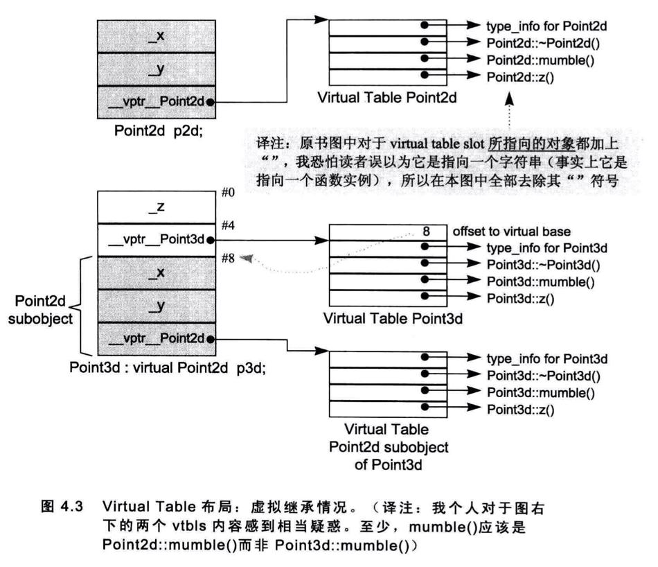

# 成员的各种调用方式

## 非静态成员函数

nonstatic member function 和一般的nonmember function有相同的效率。

```cpp
float magnitude3d(const Point3d* this) {...}//nonmember function
float Point3d::magnitude3d() const {...}//nonstatic member function
```

nonstatic member function在内部会转为nonmember function：

1.  改写函数原型，增加一个额外参数用来传递this指针。
2.  对非静态成员变量的存取改为通过this来完成。
3.  将成员函数名称进行混淆（mangling）。

额外参数类型为：`Point *const this`。

如果函数是const的，那么额外参数为：`const Point *const this`。

**名称混淆**

一般处理方法是方法名称+类+参数类型。不同编译器混淆的方式不同。

编译器可以混淆名称，也可以反混淆名称（demangling）。

如果声明extern "C" 会压抑mangling的效果。

## 虚拟成员函数

如果normalize()是一个virtual member function，那么

```cpp
ptr->normalize();
```

将会被内部转化为：

```cpp
(*ptr->vptr[1])(ptr);
```

其中：

-   vptr表示由编译器产生的指针，指向virtual table。它被安插在每一个声明有(或继承自)一个或多个virtual functions的class object中。（其名称也会被混淆，因为在一个复杂的class派生体系中，可能存在多个vptrs）。
-   1是virtual table slot的索引值，关联到normalize()函数。
-   第二个ptr表示this指针。

**虚函数调用的优化**

如果用类作用域运算符（:）调用虚函数：

```
a.A::fun();
```

那么虚函数的决议方式会和非静态函数一样。

另外一点，对象没有多态，所以通过对象调用虚函数可以优化，决议成和非静态函数一样。

这项优化工程的另一利益是，虚函数的一个inline函数实例可以被扩展开来，因而提供极大的效率利益。

TODO 虚函数的inline

## 静态成员函数

对静态函数调用，则会转为对非成员函数的调用。

因为不需要传递this指针，所以静态成员函数具有这些特性：

-   不能够直接存取其class中的nonstatic members。
-   不能够被声明为const、volatile或virtual。
-   不需要经由class object才被调用。

如果取一个static member function的地址，获得的将是其在内存中的位置，也就是其地址。由于static member function没有this指针，所以其地址的类型并不是一个“指向class member function的指针”，而是一个“nonmember函数指针”。

```cpp
namespace function {
    class Function{
    public:
        static int fun(double);
        float fun2(char);
    };
};
```

```cpp
void function::test1() {
    int (*psf)(double);
    psf = &function::Function::fun;

    float (function::Function::*pf)(char);
    pf = &function::Function::fun2;
}
```

# 虚函数

C++是通过虚函数指针来实现虚函数的，虚函数指针指向一个表格，表格中的virtual functions地址在编译时期获知。此外，这一组地址是固定不变的，执行期不可能新增或替换之。由于程序执行时，表格的大小和内容都不会改变，所以其建构和存取皆可以由编译器完全掌控，不需要执行期的任何介入。

执行期如何找到虚函数地址：

1.  为了找到表格，每一个class object被安插了一个由编译器内部产生的指针，指向该表格。
2.  为了找到函数地址，每一个virtual function被指派一个表格索引值。

单一继承下的布局：


在单一继承下，会有这3种情况：

1.  它可以继承base class所声明的virtual functions的函数实例。正确地说是，该函数实例的地址会被拷贝到derived class的virtual table的相对应slot之中。
2.  它可以使用自己的函数实例。这表示它自己的函数实例地址必须放在对应的slot之中。
3.  它可以加入一个新的virtual function。 这时候virtual table的尺寸会增大一个slot，而新的函数实例地址会被放进该slot之中。

## 多重继承下的虚函数

在多重继承中支持virtual functions，其复杂度围绕在第二个及后继的baseclasses身上，以及“必须在执行期调整this指针”这一点。

```cpp
class Base1 {
public:
    Base1();
    virtual ~Base1();
    virtual void speakClearly();
    virtual Base1 *clone() const;
protected :
    float data_Base1;
};

class Base2 {
public:
    Base2();
    virtual ~Base2();
    void mumble();
    virtual Base2 *clone() const;
protected:
    float data_Base2;
};

class Derived : public Base1, public Base2 {
public:
    Derived();
    virtual ~Derived();
    virtual Derived *clone() const;
protected:
    float data_Derived;
};
```

上面这个demo有三个问题需要解决，分别是：

1.  virtual destructor（表示重写的虚函数）
2.  被继承下来的Base2:mumble()（未重写的虚函数）
3.  一组clone()函数实例（返回值变化的虚函数）

### 问题1

通过Base1和Derived的指针或引用调用虚函数难度不大，因为指针地址都在开头，主要难度在于经由指向第二或后继基类的指针或引用来调用虚函数。

```cpp
Base2 *p = new Derived;
delete p;
```

一种做法是这样的：

将virtual table加大，使它容纳此处所需的this指针，调整相关事物。每一个virtual table slot，不再只是一个指针，而是一个集合体，内含可能的offset以及地址。于是virtual function的调用操作由：

```cpp
(*pbase2->vptr[1]) ( pbase2 ) ;
```

改变为:

```cpp
( *pbase2->vptr[1].faddr )
( pbase2 + pbase2->vptr[1].offset ) ;
```

其中fddr内含virtual function地址，offset内含this指针调整值。

这个做法的缺点是，所有的virtual function调用操作都需要执行偏移，不管它们是否真的需要。而且要求额外空间。

>   书中介绍说是利用所谓的thunk技术，看得一脸懵逼。

**另一种做法是这样的。**（通过多个虚函数指针）

在多重继承之下，一个 derived class内含n-1个额外的virtual tables，n表示其上一层 base classes 的个数(因此，单一继承将不会有额外的virtual tables)。

针对Derived/Base1的指针或者引用，用的是第一个虚函数指针。针对Base2的指针或者引用，用的是第二个虚函数指针。如图：


### 问题2

上图的布局也解决了这个问题。

>   书中又提到了调整指针的位置，不是很理解。

### 问题3

上图的布局也解决了这个问题。

>   书中又提到了调整指针的位置，不是很理解。

问题123通过上图的布局其实可以一次性解决，不是很明白书中还要讨论指针偏移。有可能是这样的，虚函数会被转化，开头参数为Derived指针this，而此时this的类型为Base2，所以需要一个指针偏移。

## 虚拟继承下的虚函数



图示和成员变量中的虚继承布局是通过在虚函数表里添加一个offset来实现的。（有2种方法，一种是这种，另一种就是额外添加一个指向虚基对象的指针）。

>   C++语法不允许虚基类指针转为派生类指针。

# 指向 Member Function 的指针

```cpp
class Function {
public:
    static int fun(double);
    float fun2(char);
};

void function::test1() {
    int (*psf)(double);
    psf = &function::Function::fun;

    float (function::Function::*pf)(char);
    pf = &function::Function::fun2;
}
```

static没有this指针，所以static函数的函数指针类型是函数指针，而成员函数含有this指针，所以函数指针类型是指向成员函数的指针。

## 指向虚函数的指针

```cpp
/**
 * 测试虚函数指针的调用
 */
class A {
public:
    int a;
    virtual void fun();
};

class B : public A{
public:
    int b;
    virtual void fun();
};
```

```cpp
void function::test2() {
    void (A::*pf)() = &A::fun;
    printf("ptr = %p\n",pf);
    printf("ptr = %p\n",&A::fun);
    B *b = new B;
    (b->*pf)();
    delete b;
}

void function::A::fun() {
    a++;
    my_log("A::fun");
    if (a == 2) {
        return;
    }
    fun();
}

void function::B::fun() {
    b++;
    my_log("B::fun");
    if (b == 2) {
        return;
    }
    fun();
}
```

```
ptr = 0x1
ptr = 0x1
B::fun
B::fun
```

用派生类对象调用基类的虚函数指针，调用的还是派生类的虚函数，并且如果此虚函数内部调用了虚函数，这个内部被调用的虚函数也是派生类的。

对一个nonstatic member function取其地址，将获得该函数在内存中的地址。然而面对一个virtual function，其地址在编译时期是未知的，所能知道的仅是virtual function在其相关之virtual table中的索引值。
即对一个virtual member function取其地址，所能获得的只是一个索引值。

>   个人理解，那么运行期的调用就是这样的：`(b -> vptr[ptr] )(b);`
>
>   运行期虚函数的地址已经确定了，所以通过索引值能够找到实际的虚函数指针，后面括号里的b是表示this指针。


上面代码，如果不是虚函数，是普通的函数，那么结果是A的函数调用。

## 多重继承下的成员函数指针

上文和此文讨论的都是成员函数指针的形式，如果是非虚函数就是地址，如果是虚函数就是索引值。这里讨论多重继承下的函数指针形式。

```cpp
struct _mptr {
    int delta;//this指针的offset值
    int index;//非虚函数时为-1，否则为索引值
    union {
        ptrtofunc faddr;//函数地址
        int v_offset;//v_ofset字段放的是一个virtual（或多重继承中的第二或后继的）base class的vptr位置。
    };
};
```

函数指针为此模型。在此模型之下，像这样的调用操作：

```
( ptr->*pmf ) ();
```

会变成：

```
( pmf.index < 0 )
? // non-virtual invocation
( *pmf.faddr ) ( ptr )
: // virtual invocation
( *ptr->vptr[ pmf.index] (ptr) ) ;
```

此模型会导致每个调用操作都付出成本，所以许多编译器在自身内部根据不同的classes特性提供多种指向member functions的指针形式

# 内联函数

```cpp
inline int min1(int x, int y) {
    return x < y ? x : y;
}

extern "C" int min2(int x, int y);

int main() {
    int i = 1;
    int j = 3;
    int x = min1(i, j);
    x = min2(i, j);
    return 0;
}

int min2(int x, int y) {
    return x < y ? x : y;
}
```

汇编代码：

```
0000000100003ef0 _main:
100003ef0: 55                          	pushq	%rbp
100003ef1: 48 89 e5                    	movq	%rsp, %rbp
100003ef4: 48 83 ec 10                 	subq	$16, %rsp
100003ef8: c7 45 fc 00 00 00 00        	movl	$0, -4(%rbp)
100003eff: c7 45 f8 01 00 00 00        	movl	$1, -8(%rbp)
100003f06: c7 45 f4 03 00 00 00        	movl	$3, -12(%rbp)
100003f0d: 8b 7d f8                    	movl	-8(%rbp), %edi
100003f10: 8b 75 f4                    	movl	-12(%rbp), %esi
100003f13: e8 84 00 00 00              	callq	132 <dyld_stub_binder+0x100003f9c>
100003f18: 89 45 f0                    	movl	%eax, -16(%rbp)
100003f1b: 8b 7d f8                    	movl	-8(%rbp), %edi
100003f1e: 8b 75 f4                    	movl	-12(%rbp), %esi
100003f21: e8 4a 00 00 00              	callq	74 <_min2>
100003f26: 31 c9                       	xorl	%ecx, %ecx
100003f28: 89 45 f0                    	movl	%eax, -16(%rbp)
100003f2b: 89 c8                       	movl	%ecx, %eax
100003f2d: 48 83 c4 10                 	addq	$16, %rsp
100003f31: 5d                          	popq	%rbp
100003f32: c3                          	retq
100003f33: 66 2e 0f 1f 84 00 00 00 00 00       	nopw	%cs:(%rax,%rax)
100003f3d: 0f 1f 00                    	nopl	(%rax)

0000000100003f40 __Z4min1ii:
100003f40: 55                          	pushq	%rbp
100003f41: 48 89 e5                    	movq	%rsp, %rbp
100003f44: 89 7d fc                    	movl	%edi, -4(%rbp)
100003f47: 89 75 f8                    	movl	%esi, -8(%rbp)
100003f4a: 8b 45 fc                    	movl	-4(%rbp), %eax
100003f4d: 3b 45 f8                    	cmpl	-8(%rbp), %eax
100003f50: 0f 8d 0b 00 00 00           	jge	11 <__Z4min1ii+0x21>
100003f56: 8b 45 fc                    	movl	-4(%rbp), %eax
100003f59: 89 45 f4                    	movl	%eax, -12(%rbp)
100003f5c: e9 06 00 00 00              	jmp	6 <__Z4min1ii+0x27>
100003f61: 8b 45 f8                    	movl	-8(%rbp), %eax
100003f64: 89 45 f4                    	movl	%eax, -12(%rbp)
100003f67: 8b 45 f4                    	movl	-12(%rbp), %eax
100003f6a: 5d                          	popq	%rbp
100003f6b: c3                          	retq
100003f6c: 0f 1f 40 00                 	nopl	(%rax)

0000000100003f70 _min2:
100003f70: 55                          	pushq	%rbp
100003f71: 48 89 e5                    	movq	%rsp, %rbp
100003f74: 89 7d fc                    	movl	%edi, -4(%rbp)
100003f77: 89 75 f8                    	movl	%esi, -8(%rbp)
100003f7a: 8b 45 fc                    	movl	-4(%rbp), %eax
100003f7d: 3b 45 f8                    	cmpl	-8(%rbp), %eax
100003f80: 0f 8d 0b 00 00 00           	jge	11 <_min2+0x21>
100003f86: 8b 45 fc                    	movl	-4(%rbp), %eax
100003f89: 89 45 f4                    	movl	%eax, -12(%rbp)
100003f8c: e9 06 00 00 00              	jmp	6 <_min2+0x27>
100003f91: 8b 45 f8                    	movl	-8(%rbp), %eax
100003f94: 89 45 f4                    	movl	%eax, -12(%rbp)
100003f97: 8b 45 f4                    	movl	-12(%rbp), %eax
100003f9a: 5d                          	popq	%rbp
100003f9b: c3                          	retq
```

处理inline函数有2部：
1. 分析函数定义。如果函数因其复杂度被判断不可成为inline，它会被转为一个static函数，并在“被编译模块”内产生对应的函数定义。
2. 调用inline函数时会做扩展操作。