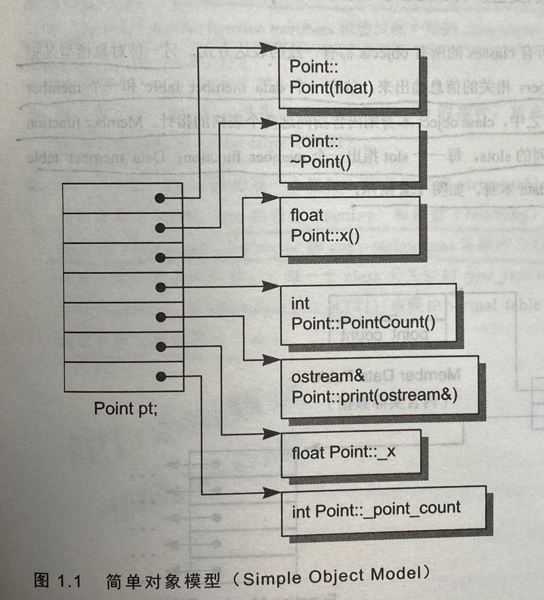
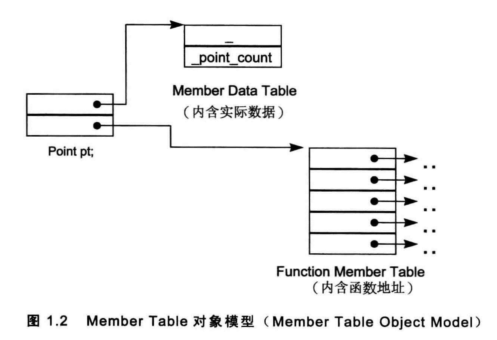
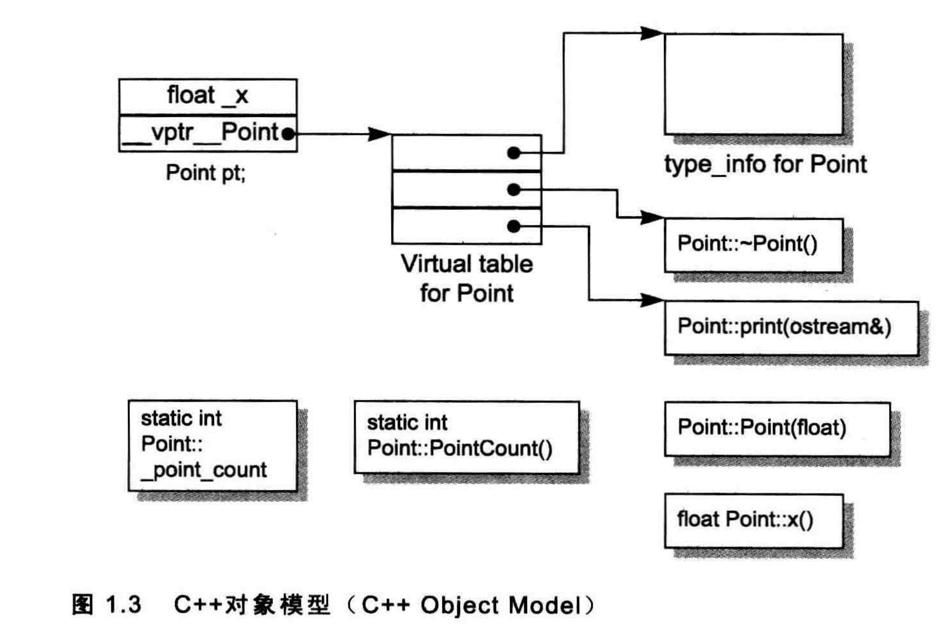
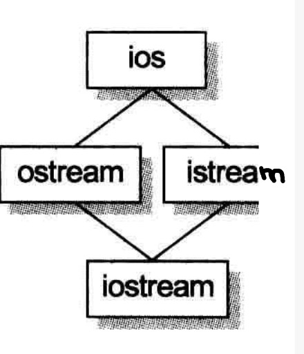
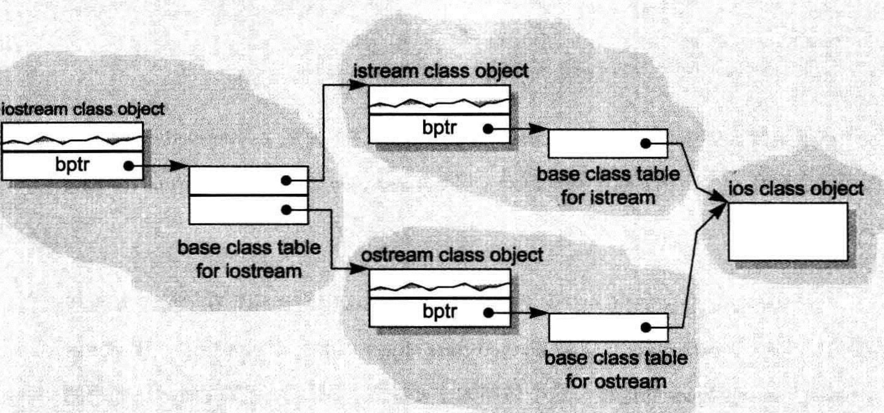
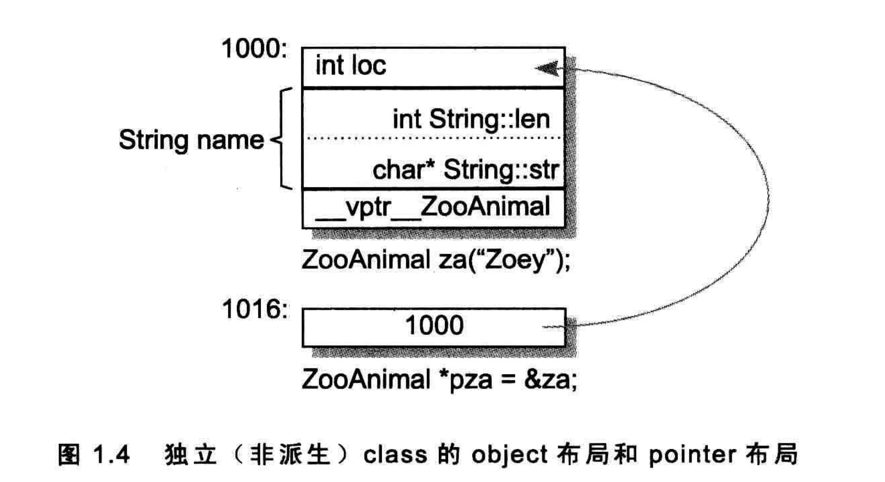
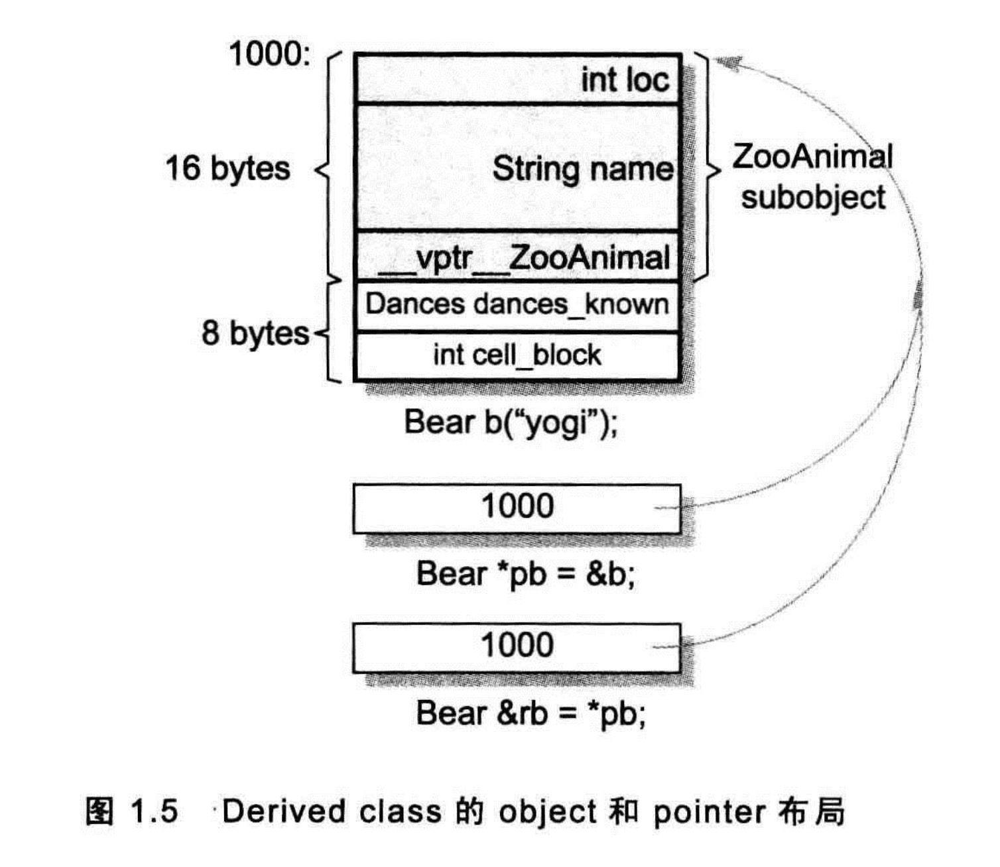

# C++对象模型

在C++中，有两种成员变量：静态的（static）和非静态的。还有三种成员方法：静态函数（static）、虚函数（virtual）和普通函数。

示例类Point。

```cpp
class Point {
public:
    Point(float xval);
    virtual ~Point();
    float x();
    static int PointCount();
protected:
    virtual ostream &print(ostream &os) const;
    float _x;
    static int _point_count;
};
```

## 简单对象模型

-   优点：设计简单。
-   缺点：空间和时间复杂度高。

一个obj是一系列的slots，每一个slot指向一个成员（变量和函数），如图：

>   slots为书中的说法，中文翻译为槽，但个人理解，翻译成表更好一点，所以保留了原文的说法。



成员本身不放在对象中，slot存放的是指向成员的指针。这样每个slot的大小是固定的（即指针的大小），而不是根据成员大小而定。

这个模型没有用于实际产品上，但是slot个数的概念被应用于“指向成员的指针”中。

## 表格驱动对象模型

表格驱动对象模型是将成员分为成员变量表和成员函数表。对象内含这2个表指针，而成员函数表是一系列slots；而成员变量表则直接直接持有变量本身。如图：



这个模型也没有应用于C++中，但是成员函数表的概念成为虚函数的一个实现方案。

## C++对象模型

在此模型中，普通成员变量放在每一个obj之中，静态成员变量放在obj之外。静态和普通成员函数也放在obj之外。

虚函数是这样做的：

1.  每一个类产生出一堆指向虚函数的指针，放在表格之中。这个表格被称为虚函数表（ virtual table (vtbl)）。
2.  每一个obj被安插一个指针，指向相关的virtual table。通常这个指针被称为vptr。vptr的设定和重置都由每一个类的构造函数、析构函数和copy assignment运算符（目前不清楚是=还是拷贝函数）自动完成。每一个class所关联的类型信息对象（type_info object）（用以支持runtime type identification， RTTI，在Java中的一个应用是反射）也经由virtual table被指出来，通常放在表格的第一个slot。

-   优点：空间和时间复杂度较低。
-   缺点：如果应用程序代码本身未曾改变，但用到的普通成员变量有所修改，那么那些应用程序代码同样得重新编译。



## 加上继承的模型

C++可以单继承，也可以多继承，甚至可以虚继承（共享同一个基类实例）。

**简单对象模型**

在简单对象模型中，每一个基类可以被派生类对象内的一个slot指出，该slot内含基类对象的地址。

-   缺点是，因为间接性而导致的空间和存取时间上的额外负担。
-   优点则是类对象的大小不会因其基类的改变而受到影响。

**base table模型**

和虚函数表相似，base class table被产生出来时，表格中的每一个slot内含一个相关的base class地址。每一个对象内含一个bptr指针，它会被初始化，指向其base class table。

-   缺点是由于间接性而导致的空间和存取时间上的额外负担
-   优点则是在每一个对象中对于继承都有一致的表现方式：每一个对象都应该在某个固定位置上安放一个base table指针，与基类的大小或个数无关。第二个优点是，无须改变对象本身就可以更改base class table。

如图：





## 对象模型如何影响程序

不同的对象模型，会导致“现有的程序代码必须修改”以及“必须加入新的程序代码”两个结果。

# 对象的差异

需要多少内存才能够表现一个对象？一般而言要有：

-   其普通成员变量的总和大小。
-   字节对齐。
-   加上为了支持virtual而由内部产生的任何额外负担。

## 指针的类型

```cpp
class ZooAnimal {
public:
    ZooAnimal();
    virtual ~ ZooAnimal();
    virtual void rotate();
protected:
    int loc;
    String name;
};
```

```
ZooAnimal *px;
int *pi;
Array< String > *pta;
```

以内存需求的观点来说，这三个指针没有什么不同。它们三个都需要有足够的内存来放置一个机器地址。

“指向不同类型之各指针”间的差异，既不在其指针表示法不同，也不在其内容(一个地址)不同，而是在其所寻址出来的对象类型不同。也就是说，“指针类型”会教导编译器如何解释某个特定地址中的内存内容及其大小：

1.  一个指向地址1000的整数指针，在32位机器上，将涵盖地址空间1000~1003（32位机器）
2.  如果String是传统的8-bytes（包括一个4-bytes的字符指针和一个用来表示字符串长度的整数），那么一个ZooAnimal指针将横跨地址空间1000~1015 （4+8+4）



类型转换(cast)其实是一种编译器指令。大部分情况下它并不改变一个指针所含的真正地址，它只影响“被指出之内存的大小和其内容”的解释方式。

## 加上多态

```cpp
class Bear : public ZooAnimal {
public:
    Bear();
    ~Bear();
    void rotate();
    virtual void dance();
protected:
    enum Dances {...};
    Dances dances_known;
    int cell_block;
};
```

内存布局：



```cpp
Bear b;
ZooAnimal *pz = &b;
Bear *pb = &b;
```

除了ZooAnimal中出现的成员，不能够使用pz来直接处理Bear的任何members。唯一例外是通过virtual机制，即调用虚函数rotate()，调用的是Bear的rotate函数。

pz在编译期间只能调用ZooAnimal的public成员。

在每一个执行点，pz 所指的对象具体类型可以决定rotate()所调用的实例。类型信息的封装并不是维护于pz之中，而是维护于link之中，此link存在于“object的vptr”和“vptr 所指的virtual table”之间。

另外一种情况：

```cpp
Bear b;
ZooAnimal za = b;

//调用的是ZooAnimal的rotate函数
za.rotate();
```

问题：

1.  为什么rotate所调用的是ZooAnimal实例而不是Bear实例？
2.  如果初始化函数（上面的赋值操作）将一个对象内容完整拷贝到另一个对象去，为什么za的vptr不指向Bear的virtual table？

第二个问题的答案是，编译器在初始化及赋值操作(将一个classobject指定给另一个classobject)之间做出了仲裁。编译器必须确保如果某个object含有一个或一个以上的vptrs，那些vptrs的内容不会被基类对象初始化或改变。

>   也就是说，编译器构造和赋值操作并不会改变虚函数表指针的内容。

第一个问题的答案是：za并不是一个Bear，它是一个ZooAnimal。多态所造成的“一个以上的类型”的潜在力量，并不能够实际发挥在“直接存取objects"这件事情上。有一个似是而非的观念：程序设计并不支持对object的直接处理。

指针和引用之所以支持多态，是因为它们并不引发内存中任何与类型有关的内存委托操作。会受到改变
的，只有它们所指向的内存的“大小和内容解释方式”而已。

>   也就是说，直接赋值，是创建了新的对象，并不适用于多态。而指针和引用的赋值是改变内存的指向，所以具有多态。
>

当一个基类对象被直接初始化为(或是被指定为)一个派生类对象时，派生类对象就会被切割以塞入较小的基类内存中，派生类型将没有留下任何蛛丝马迹，多态于是不再呈现。

# 总结

**个人总结**

C++的对象模型描述了C++对象在内存中的布局。C++的多态原理可以从内存布局入手。

总结的问题：

1.  **C++的多态是怎么实现的？**
    **派生类引用赋值给基类指针，为什么调用基类指针的虚函数，可以执行派生类对于的虚函数？**
    因为在C++的内存布局中，有一块用来描述虚函数表和类型信息，而指针和引用的赋值操作并不改变内存，所以当调用基类指针的虚函数时，调用的还是派生类的虚函数。
2.  **为什么直接赋值没有多态的效果？**
    直接赋值是创建了一个新的对象，不具有多态效果。


