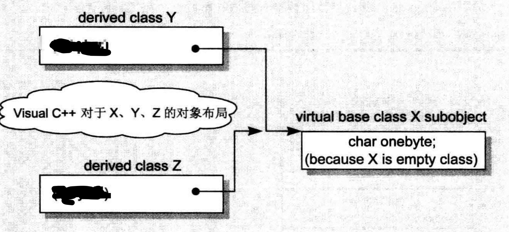

```cpp
class X {};
class Y: public virtual X {};
class Z: public virtual X {};
class A: public Y, public Z {};

void test() {
    my_log(sizeof(X));
    my_log(sizeof(Y));
    my_log(sizeof(Z));
    my_log(sizeof(A));
    my_log(sizeof(int *));
}

1
8
8
16
8
```

从结果中看，指针的大小为8字节。

**X的大小**

X代码是空的，但事实上并不是空的，它有一个隐藏的1byte大小，那是被编译器安插进去的一个char。这使得这一class的两个objects得以在内存中配置独一无二的地址。

```cpp
class X {
};

class X2{
    char c;
    char c2;
};

//sizeof
1
2
```

**Y和Z的大小**

它们受三个因素影响：

1.  **语言本身所造成的额外负担**
    当语言支持virtuawl base classes时，就会导致一些额外负担。如：派生类会存有一份指向虚基类的指针。
2.  **编译器对于特殊情况所提供的优化处理**

3. **字节对齐**

Y和Z在代码上是空的，和X一样，编译器应该会安插一个char，那么就是1（char）+8（虚基类指针）+7（字节对齐）=16，但是结果是8。

这是因为一些编译器进行了优化。一个empty virtual base class被视为derived class object最开头的一部分，也就是说它并没有花费任何的额外空间。（因为既然有了members，就不需要原本为了empty class
而安插的一个char）。



```cpp
class Y : public virtual X {
};

class Z : public virtual X {
    char c;
};

//sizeof
8
16
```

**A的大小**

暂略。

# 成员变量的绑定

```cpp
extern float x;

class Point3D {
public:
    Point3D(float x, float y, float z);

    float X() const { return x; }

    void X(float new_x) { x = new_x; }

private:
    float x, y, z;
};
```

当调用X()函数时，回调的是class中的x。

早期的编译器不是这样，后来编译器这样更改：对member functions本体的分析，会直到整个class的声明都出现了才开始。因此在一个inline member function躯体之内的一个data member绑定操作，会在整个class声明完成之后才发生。

也就是说，X()函数虽然在class内部，但是对X函数的分析延迟到class声明的右大括号出现才开始，这时候成员变量x已经被绑定。

但是成员函数的参数列表没有用此规则，参数列表是在首次出现就被处理，如例子：

```cpp
typedef char length;

class Point3D {
public:
    void fun(length len) {
        cout << "方法参数：" << sizeof(len) << endl;
        cout << "成员变量：" << sizeof(l) << endl;
    }

private:
    typedef int length;
    length l;
};

void test() {
    Point3D p;
    p.fun(1);
}

方法参数：1
成员变量：4
```

函数体的分析延迟到声明结束，所以成员变量是int类型的，但是参数列表的分析没有延迟，所以是char类型的。

# 成员变量的布局

静态成员变量存放在程序的data segment中，和class对象无关。

C++ Standard要求，在同一个access section（也就是private、public、protected等区段）中，members的排列只需符合较晚出现的members在class object中有较高的地址这一条件即可。也就是说，各个members并不一定得连续排列。什么东西可能会介于被声明的members之间呢？members之间的字节填充。

# 成员变量的存取

## 静态成员变量的存取

每一个static data member只有一个实例，存放在程序的data segment之中。每次程序取用static member时，就会被内部转化为对该唯一extern实例的直接参考操作。如：

```cpp
x.staticVal = 100;
X::staticVal = 100;

xptr->staticVal = 100;
X::staticVal = 100;

x().staticVal = 100;
x();
X::staticVal = 100;
```

如果有2个class声明相同名称的静态成员变量，因为静态成员变量会放在程序的data segment中，这时会导致名称冲突。解决办法是编译器对静态成员变量进行编码，同时还能够解码。

## 非静态成员变量的存取

Nonstatic data members直接存放在每一个class object之中。除非经由显式的或隐式的class object，否则没有办法直接存取它们。

在class中存取成员变量，虽然没有显式的出现对象，但实际上用到了this指针。

欲对一个nonstast data member进行存取操作，编译器需要把class object的起始地址加上data member的偏移位置(offset) 。

每一个nonstatic data member的偏移位置(offset)在编译时期即可获知，甚至如果member属于一个base class subobject（派生自单一或多重继承串链）也是一样的。因此，存取一个nonstatic data member，其效率和存取一个C struct member或一个nonderived class的member是一样的。

从对象存取和从指针存取有什么区别？
答案是当类是一个derived class，而其继承结构中有一个virtual base class，并且被存取的member是一个从该virtual base class继承而来的member时，就会有重大的差异。
因为不能确定指针指向哪一种class type（不知道编译时期这个member真正的offset位置），所以这个存取操作必须延迟至运行期，经由一个额外的间接导引，才能够解决。但如果使用对象，就不会有这些问题，其类型一定是对应的类，而即使它继承自virtual base class，members的offset位置也在编译时期就固定了。


