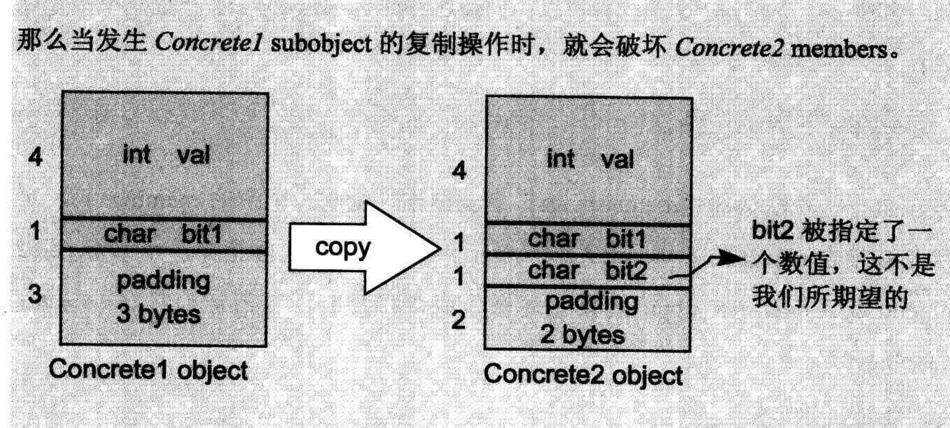

# 对象的大小

```cpp
class X {};
class Y: public virtual X {};
class Z: public virtual X {};
class A: public Y, public Z {};

void test() {
    my_log(sizeof(X));
    my_log(sizeof(Y));
    my_log(sizeof(Z));
    my_log(sizeof(A));
    my_log(sizeof(int *));
}

1
8
8
16
8
```

从结果中看，指针的大小为8字节。

**X的大小**

X代码是空的，但事实上并不是空的，它有一个隐藏的1byte大小，那是被编译器安插进去的一个char。这使得这一class的两个objects得以在内存中配置独一无二的地址。

>   因为对象需要分配内存，如果没有什么内容就无法在内存上分配内存，所以需要一个额外的char。
>

```cpp
class X {
};

class X2{
    char c;
    char c2;
};

//sizeof
1
2
```

**Y和Z的大小**

它们受三个因素影响：

1.  **语言本身所造成的额外负担**
    当语言支持virtuawl base classes时，就会导致一些额外负担。如：派生类会存有一份指向虚基类的指针。
2.  **编译器对于特殊情况所提供的优化处理**

3. **字节对齐**

Y和Z在代码上是空的，和X一样，编译器应该会安插一个char，那么就是1（char）+8（虚基类指针）+7（字节对齐）=16，但是结果是8。

这是因为一些编译器进行了优化。一个empty virtual base class被视为derived class object最开头的一部分，也就是说它并没有花费任何的额外空间。（因为既然有了members，就不需要原本为了empty class
而安插的一个char）。


```cpp
class Y : public virtual X {
};

class Z : public virtual X {
    char c;
};

//sizeof
8
16
```

**A的大小**

暂略。

## 小结

对象的大小受编译器影响，过度分析没有意义。不过可以肯定的是，空对象的大小是1byte。

# 成员变量的绑定

```cpp
extern float x;

class Point3D {
public:
    Point3D(float x, float y, float z);

    float X() const { return x; }

    void X(float new_x) { x = new_x; }

private:
    float x, y, z;
};
```

当调用X()函数时，回调的是class中的x。

早期的编译器不是这样，后来编译器这样更改：对member functions本体的分析，会直到整个class的声明都出现了才开始。因此在一个inline member function躯体之内的一个data member绑定操作，会在整个class声明完成之后才发生。

也就是说，X()函数虽然在class内部，但是对X函数的分析延迟到class声明的右大括号出现才开始，这时候成员变量x已经被绑定。

但是成员函数的参数列表没有用此规则，参数列表是在首次出现就被处理，如例子：

```cpp
typedef char length;

class Point3D {
public:
    void fun(length len) {
        cout << "方法参数：" << sizeof(len) << endl;
        cout << "成员变量：" << sizeof(l) << endl;
    }

private:
    typedef int length;
    length l;
};

void test() {
    Point3D p;
    p.fun(1);
}

方法参数：1
成员变量：4
```

函数体的分析延迟到声明结束，所以成员变量是int类型的，但是参数列表的分析没有延迟，所以是char类型的。

# 成员变量的布局

静态成员变量存放在程序的data segment中，和class对象无关。

非静态成员变量一般按照access section（也就是private、public、protected等区段）排列，先声明的变量的地址较低。

# 成员变量的存取

## 静态成员变量的存取

每一个static data member只有一个实例，存放在程序的data segment之中。每次程序取用static member时，就会被内部转化为对该唯一extern实例的直接参考操作。如：

```cpp
x.staticVal = 100;
X::staticVal = 100;

xptr->staticVal = 100;
X::staticVal = 100;

x().staticVal = 100;
x();
X::staticVal = 100;
```

如果有2个class声明相同名称的静态成员变量，因为静态成员变量会放在程序的data segment中，这时会导致名称冲突。解决办法是编译器对静态成员变量进行混淆，同时还能够解混淆。

## 非静态成员变量的存取

Nonstatic data members直接存放在每一个class object之中。除非通过显式或隐式class object，否则没有办法直接存取它们。在class中存取成员变量，虽然没有显式的出现对象，但实际上用到了this指针。

欲对一个nonstatic data member进行存取操作，编译器需要把class object的起始地址加上data member的偏移位置(offset) 。

>   书中提到了offset会-1，但经测试并没有发现-1。

每一个nonstatic data member的偏移位置(offset)在编译时期即可获知，甚至如果member属于一个base class subobject（派生自单一或多重继承串链）也是一样的。因此，存取一个nonstatic data member，其效率和存取一个C struct member或一个nonderived class的member是一样的。

**从对象存取和从指针存取有什么区别？**
答案是当类是一个derived class，而其继承结构中有一个virtual base class，并且被存取的member是一个从该virtual base class继承而来的member时，就会有重大的差异。
因为不能确定指针指向哪一种class type（不知道编译时期这个member真正的offset位置），所以这个存取操作必须延迟至运行期，经由一个额外的间接导引，才能够解决。
但如果使用对象，就不会有这些问题，其类型一定是对应的类，而即使它继承自virtual base class，members的offset位置也在编译时期就固定了。

>   对象在编译期就固定了，而指针要到运行期才能固定。

# 继承与成员变量

在C++继承模型中，一个derived class object所表现出来的东西，是其自己的members加上base class(es) members的总和。

## 只要继承不要多态

书中介绍说，经过三层继承，类的大小变为16字节，但是经测试：

```cpp
class A {
    int val;
    char c1;
};

class B : public A {
    char c2;
};

class C : public B {
    char c3;
};


void test() {
    my_log(sizeof(A));
    my_log(sizeof(B));
    my_log(sizeof(C));
}

8
8
8
```

这种对象大小的排列方式可能是B和C直接在A的padding里放置成员变量了，书中介绍说可能会导致一些问题：



C2对象复制给C1，如果用位逐次拷贝的方式，就会在C1的padding处赋上bit2的值。

>   个人理解：虽然会附上bit2的值，但是只能派生对象复制基类对象，反过来不行，而且基类对象也不能访问bit2，所以这种不符合预期，但也不会有什么问题。

## 加上多态

多态指的是虚函数，和前面介绍的一样，虚函数的实现方式是添加一个虚函数指针。虚函数指针存放的位置视编译器决定，有些放在类的开头，有些放在类的末尾。

几种放置虚函数指针的情况：


## 多重继承

```cpp
Point3d p3d;
Point2d *p = &p3d;
```

单一继承体系下，把一个derived class object指定给base class（不管继承深度有多深）的指针或reference。这个操作并不需要编译器去调停或修改地址。它很自然地可以发生，而且提供了最佳执行效率。

>   即，不管是基类还是派生类，它们地址都是对象的最低位地址。

如果把vptr放在class object的起始处并且如果base class没有virtual function而derived class有，那么单一继承的自然多态就会被打破。这种情况下，把一个derived object转换为其base类型，就需要编译器的介入，用以调整地址。

在既是多重继承又是虚拟继承的情况下，编译器的介入更有必要。

对一个多重派生对象，将其地址指定给最左端（也就是第一个）base class的指针，情况将和单一继承时相同，因为二者都指向相同的起始地址。需付出的成本只有地址的指定操作而已。至于第二个或后继的base class的地址指定操作，则需要将地址修改过：加上（减去）介于中间的base class subobject(s)大小。


如果是取成员变量，不管是哪个class，不需要付出额外成本，因为成员变量的位置在编译期就固定了。

```cpp
/**
 * 多继承下的虚函数指针
 */
class D {
    int val;
public:
    virtual void fun();
};

class E : public D {
    char c2;
};

class F {
public:
    virtual void fun2();
};

class G : public E, public F {
    char c3;
};
```

```cpp
void data::test2() {
    G *g = new G;
    D *d = g;
    E *e = g;
    F *f = g;
    cout << "d = " << d << endl;
    cout << "e = " << e << endl;
    cout << "f = " << f << endl;
    cout << "g = " << g << endl;
    delete g;
}
```

```
d = 0x7f999b405910
e = 0x7f999b405910
f = 0x7f999b405920
g = 0x7f999b405910
```

从demo中可以看出，f指针（第二个基类）发生了指针的修改。

## 虚拟继承

虚拟继承的几种实现方法如下所述。


cfront编译器会在每一个derived class object中安插一些指针，每个指针指向一个virtual base class。要存取继承得来的virtual base class members，可以通过相关指针间接完成。

这样的实现模型有两个主要的缺点：

1.  每一个对象必须针对其每一个virtual base class背负一个额外的指针。然而理想上我们却希望class object 有固定的负担，不因为其virtual base classes的个数而有所变化。想想看这该如何解决？
2.  由于虚拟继承串链的加长，导致间接存取层次的增加。这里的意思是，如果我有三层虚拟派生，我就需要三次间接存取(经由三个virtual base class指针)。然而理想上我们却希望有固定的存取时间，不因为虚拟派生的深度而改变。

第二个问题的解决方式是将所有的虚基类指针放在派生类对象中，这解决了“固定存取时间”的问题，但是付出了空间代价。


>   图中的基类被放在了下面（高地址），这里看到只能将派生类转为基类，反过来不行，然后我看了一下语法，C++不允许虚基类指针转为派生类指针。

```cpp
/**
 * 测试单一继承下的指针位置
 */
 class M{
 public:
     int m;
 };

 class N: public M{
 public:
     int n;
 };

class O{
public:
    int o;
};

class P: virtual public O{
public:
    int p;
};
```

```cpp
void data::test6() {
    N obj;
    M *m = &obj;
    N *n = &obj;
    printf("ptr = %p\n", m);
    printf("ptr = %p\n", n);

    P pp;
    O *o = &pp;
    P *p = &pp;
    printf("ptr = %p\n", o);
    printf("ptr = %p\n", p);
}
```

```
ptr = 0x7ffee89959c8
ptr = 0x7ffee89959c8
ptr = 0x7ffee89959b4//基类的地址高
ptr = 0x7ffee89959a8
```

至于第一个问题，一般而言有两个解决方法。

第一种是用virtual base class table。每一个class object如果有一个或多个virtual base classes，就会由编译器安插一个指针，指向virtual base class table。至于真正的virtual base class指针，当然是被放在该表格中。

第二个解决方法，是在virtual function table中放置virtual base class的offset (而不是地址)，负方向为offset，正方向为虚函数地址。图3.5b显示这种base class offset实现模型。


# 指向成员变量的指针

**demo1**

```cpp
/**
 * 测试成员变量指针
 */
class H{
public:
    float i;
    int j;
};
```

```cpp
void data::test3() {
    float data::H::*p1 = &H::i;
    int data::H::*p2 = &H::j;
    float data::H::*p3 = 0;
    printf("ptr = %p\n", p1);
    printf("ptr = %p\n", p2);
    printf("isEqual = %d\n", p1 == p3);
    H h;
    H *hptr = &h;
    float *hi = &h.i;
    int *hj = &h.j;
    printf("ptr = %p\n", hptr);
    printf("ptr = %p\n", hi);
    printf("ptr = %p\n", hj);
}
```

```
ptr = 0x0
ptr = 0x4
isEqual = 0
ptr = 0x7ffee17179b0
ptr = 0x7ffee17179b0
ptr = 0x7ffee17179b4
```

CLion运行的结果是这样的，p1是0，而p3也是0，但是两者不相等，可能是CLion内部有什么特殊处理。

**demo2**

```cpp
/**
 * 测试含有虚函数的类的成员变量
 */
 class I{
 public:
     int i;
     virtual void fun();
 };
```

```cpp
void data::test4() {
    int data::I::*p1 = &I::i;
    printf("ptr = %p\n", p1);

    I i;
    I *iptr = &i;
    int *ii = &i.i;
    printf("ptr = %p\n", iptr);
    printf("ptr = %p\n", ii);
}
```

```
ptr = 0x8
ptr = 0x7ffee61a29b8
ptr = 0x7ffee61a29c0
```

可以看到，第一个成员变量的偏移地址不为0且是8（指针大小），说明CLion把虚函数指针放在了对象的开头。

**demo3**

```cpp
/**
 * 测试多继承下的成员变量
 */
class J{
public:
    int j;
};

class K{
public:
    int k;
};

class L : public J, public K{

};

void fun(int L::*p);
```

```cpp
void data::fun(int L::*p) {
    printf("ptr = %p\n", p);
}

void data::test5() {
    int J::*p1 = &J::j;
    int K::*p2 = &K::k;
    printf("ptr = %p\n", p1);
    printf("ptr = %p\n", p2);
    fun(p1);
    fun(p2);
}
```

```
ptr = 0x0
ptr = 0x0
ptr = 0x0
ptr = 0x4
```

可以看到，在多继承的体系下，第二个基类的成员变量指针在派生类中发生了变化，编译器可能是这样做的：

```cpp
fun( p2 ? p2 + sizeof(J) : 0);//防止p2为0（nullptr）
```

## 小结

`&H::i`表示i在H对象中的偏移位置，而`&h.i`表示h中的i在内存中的位置。

在c++中表示指针或者地址，最好用`printf("ptr = %p\n", p);`而不是cout。