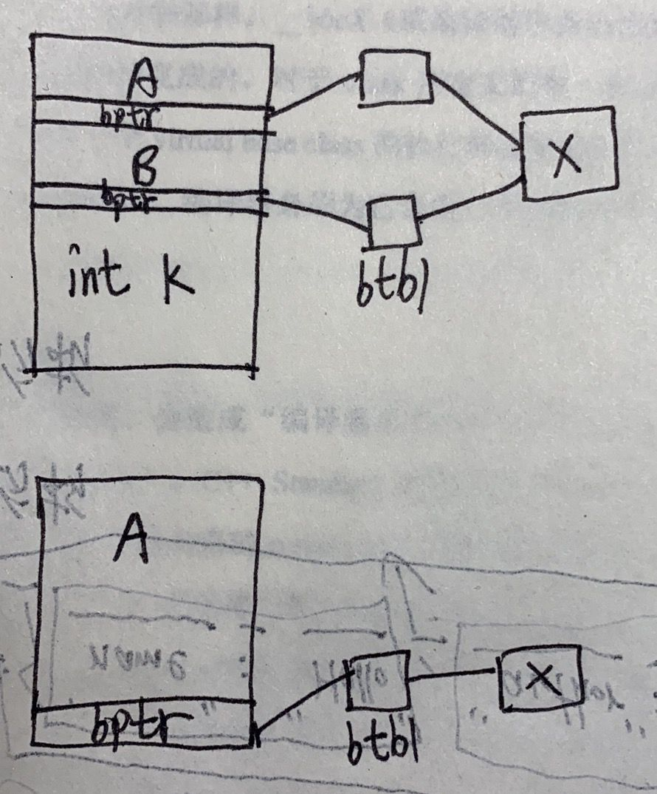

# 默认构造函数的构造操作

注意，有一点和平常的认知有区别：

一个类没有显式构造函数的时候，编译器会生成一个默认构造函数，这个默认构造函数什么都不做，如果这个类中存在成员变量，也不会初始化这个值。（C++ Primer Plus中也有这种说法）

```cpp
class A{
public:
    int a;
};

int main() {
    A a;
    cout<<a.a;
    return 0;
}

//454414373
```

这种默认构造函数是无用的，下面介绍四种编译器生成的有效的默认构造函数：

## 成员变量带有默认构造函数

```cpp
class A {
public:
    A() {
        cout << "default constructor A" << endl;
    }
    int a;
};

class B {
public:
    int b;
    A a;
};

int main() {
    B b;
    cout << b.b << endl;
    return 0;
}

default constructor A
-303576472
```

如果类中有一个成员变量含有默认构造函数，那么编译器会生成一个默认构造函数，这个构造函数会用成员变量的默认构造函数去初始化成员变量。

如果B中存在显式的默认构造函数，如：

```cpp
class B {
public:
    B() {
        b = 123;
    }
    int b;
    A a;
};

default constructor A
123
```

编译器会扩张已存在的默认构造函数，在其中安插一些代码，使得用户代码被执行之前，先调用必要的默认构造函数。

如果有多个成员变量，该如何处理？

```cpp
class A {
public:
    A() { cout << "default constructor A" << endl; }
    A(int a) : a(a) {}
    int a;
};

class B {
public:
    B() { cout << "default constructor B" << endl; }
    B(int b) : b(b) {}
    int b;
};

class C {
public:
    C() { cout << "default constructor C" << endl; }
    C(int c) : c(c) {}
    int c;
};

class Demo {
public:
    A a;
    B b;
    C c;
    Demo() : b(123) { cout << "default constructor Demo" << endl; }
};

int main() {
    Demo demo;
    cout << demo.b.b << endl;
    return 0;
}

default constructor A
default constructor C
default constructor Demo
123
```

编译器会保证以成员变量在类中的声明顺序来调用各个构造函数。

它为每一个构造函数安插程序代码，以成员变量声明顺序调用每一个成员变量所关联的构造函数。 这些代码将被安插在用户代码之前。

## 带有默认构造函数的基类

```cpp
class A {
public:
    A() { cout << "default constructor A" << endl; }
    A(int a) : a(a) {}
    int a;
};

class B : public A {
public:
    int b;
};

int main() {
    B b;
    return 0;
}

//default constructor A
```

类似的，如果一个没有任何构造函数的类派生自一个带有默认构造函数的基类，那么编译器会生成额外的代码。它将调用基类的默认构造函数。对一个后继派生的class而言，这个合成的构造函数和一个被显式提供的默认构造函数没有什么差异。

如果派生类提供多个构造函数，但其中都没有默认构造函数呢？编译器不会生成新的默认构造函数，而是在每个构造函数生成调用基类默认构造函数的代码。

## 带有虚函数的类

```cpp
class Widget {
public:
    virtual void flip() = 0;
};

void flip(Widget &widget) { 
    widget.flip(); 
}

//假设Bell和Whistle都派生自Widget
void foo() {
    Bell b;
    Whistle w;
    flip(b);
    flip(w);
}
```

下面两个扩张行动会在编译期间发生：

1.  编译器会创建一个虚函数表（vtbl），用来放置类的虚函数地址。
2.  编译器会在对象中生成一个额外的成员变量（一个指针：vptr），指向vtbl的地址。

此外，widget.flip()的虚拟调用操作（virtual invocation）会被重新改写，以使用widget的vptr和vtbl中的flip()条目：

```cpp
widget.flip();
//转变为虚拟调用操作
( *widget.vptr[1] ) ( &widget )
```

其中：

-   1 表示flip在虚函数表中的固定索引
-   &widget代表要交给“被调用的某个flip函数实例”的this指针。（就是具体对象）

为了让这个机制发挥功效，编译器必须为每一个Widget(或其派生类的)object的vptr设定初值，放置适当的虚函数地址。

如果存在构造函数，那么编译器会安插相应的代码，如果没有，那么就生成默认构造函数，并安插相应的代码。

## 带有虚基类的类

虚基类的实现法在不同的编译器之间有极大的差异。然而，每一种实现法的共同点在于必须使虚基类在其每一个派生类中的位置，能够于执行期准备妥当。例如在下面这段程序代码中：


```cpp
class X {
public:
    int i;
};

class A : public virtual X {
public:
    int j;
};

class B : public virtual X {
public:
    double d;
};

class C : public A, public B {
public:
    int k;
};

void foo(A *pa) {
    pa->i = 1024;
}

int main() {
    foo(new A);
    foo(new C);
    return 0;
}
```

```cpp
void foo(A *pa) {
    pa->i = 1024;
}
```

>   书中原话：编译器无法固定住foo()之中“经由pa而存取的X::i”的实际偏移位置，因为pa的真正类型可以改变。

这句话有点难以理解，下面这句话是个人理解：

图是根据内存模型画的，上为类C的内存模型，下为A的内存模型。无法获取`X::i`的实际位置可能是说，由于有一层间接性（btbl），导致无法直接获取`X::i`。



编译器必须改变“执行存取操作”的那些代码，使`X::i`可以延迟至执行期才决定下来。

原先cfront的做法是在派生类对象的每一个虚积累中安插一个指针完成。所有通过引用或者指针来操作虚基类都可以通过相关指针完成。比如，上述代码编译期可能这样转换：

```cpp
void foo( const A* pa ) { 
	pa->vbcX->i = 1024;//_vbcX表示编译器所产生的指针，指向虚基类X。
}
```

和虚函数相似，如果存在构造函数，那么会生成相应的代码，如果没有构造函数，那么会生成一个默认构造函数，如何生成相应的代码。

## 总结

只有上述四种情况才会生成默认构造函数，至于没有存在那4种情况而又没有声明任何构造函数的类，默认构造函数实际上并不会被合成出来。

在生成的默认构造函数中，只有基类对象和成员对象会初始化。所有其他的nonstatic data member（如整数、整数指针、整数数组等等）都不会被初始化。这些初始化操作应该是程序员实现而不是编译器。

C++新手一般有两个常见的误解，下面都是错的：

1.  任何 class 如果没有定义 default constructor，就会被合成出一个来。
2.  编译器合成出来的 default constructor会显式设定“class 内每一个data member 的默认值”。
    

>   上述说法1与认知相差有点大，需要记忆。说法2在上文的代码示例中演示了。

