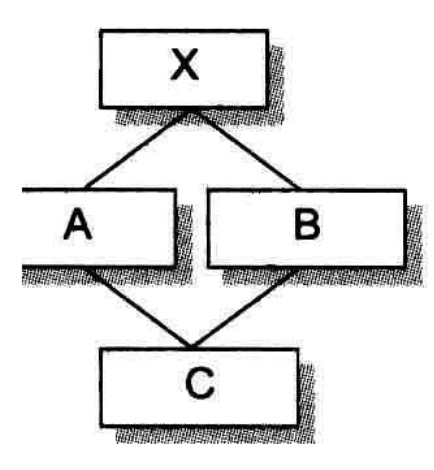
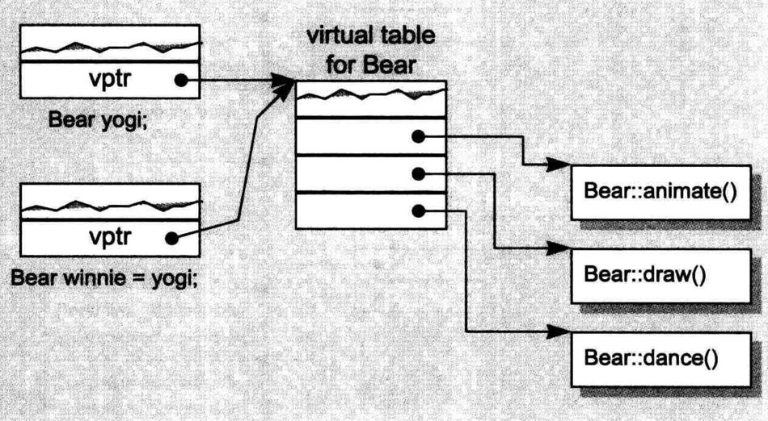
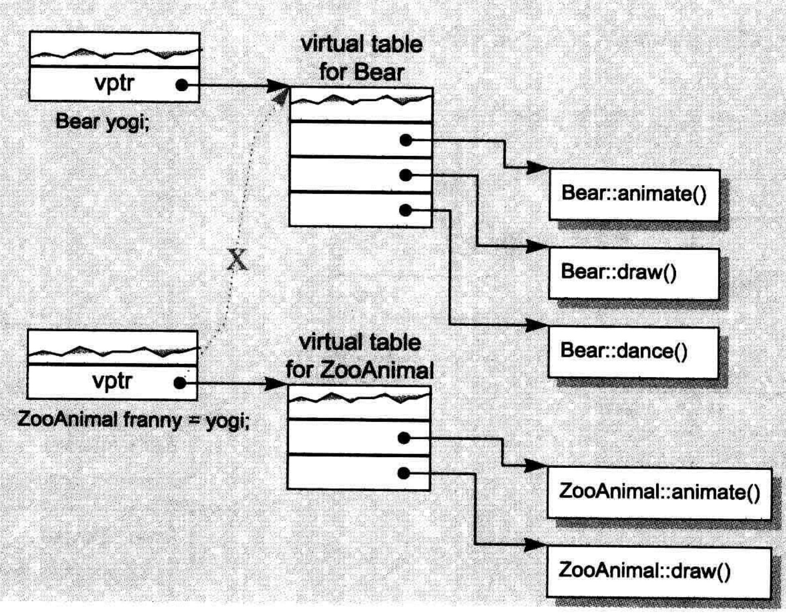
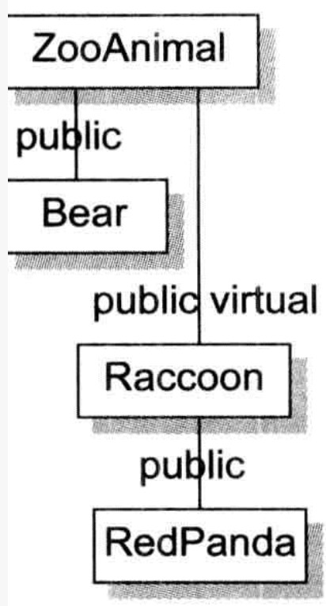

# 默认构造函数的构造操作

一个类没有显式构造函数的时候，编译器会生成一个默认构造函数，这个默认构造函数什么都不做，如果这个类中存在成员变量，也不会初始化这个值。

```cpp
class A{
public:
    int a;
};

int main() {
    A a;
    cout<<a.a;
    return 0;
}

//454414373
```

这种默认构造函数是无用的，下面介绍四种编译器生成的有效的默认构造函数：

通过objdump反编译main。

```
main:	file format Mach-O 64-bit x86-64


Disassembly of section __TEXT,__text:

0000000100003fa0 _main:
100003fa0: 55                          	pushq	%rbp
100003fa1: 48 89 e5                    	movq	%rsp, %rbp
100003fa4: 31 c0                       	xorl	%eax, %eax
100003fa6: c7 45 fc 00 00 00 00        	movl	$0, -4(%rbp)
100003fad: 5d                          	popq	%rbp
100003fae: c3                          	retq
```

给A添加一个什么都不干的构造函数：

```
main:	file format Mach-O 64-bit x86-64


Disassembly of section __TEXT,__text:

0000000100003f60 __ZN1AC2Ev:
100003f60: 55                          	pushq	%rbp
100003f61: 48 89 e5                    	movq	%rsp, %rbp
100003f64: 48 89 7d f8                 	movq	%rdi, -8(%rbp)
100003f68: 5d                          	popq	%rbp
100003f69: c3                          	retq
100003f6a: 66 0f 1f 44 00 00           	nopw	(%rax,%rax)

0000000100003f70 __ZN1AC1Ev:
100003f70: 55                          	pushq	%rbp
100003f71: 48 89 e5                    	movq	%rsp, %rbp
100003f74: 48 83 ec 10                 	subq	$16, %rsp
100003f78: 48 89 7d f8                 	movq	%rdi, -8(%rbp)
100003f7c: 48 8b 7d f8                 	movq	-8(%rbp), %rdi
100003f80: e8 db ff ff ff              	callq	-37 <__ZN1AC2Ev>
100003f85: 48 83 c4 10                 	addq	$16, %rsp
100003f89: 5d                          	popq	%rbp
100003f8a: c3                          	retq
100003f8b: 0f 1f 44 00 00              	nopl	(%rax,%rax)

0000000100003f90 _main:
100003f90: 55                          	pushq	%rbp
100003f91: 48 89 e5                    	movq	%rsp, %rbp
100003f94: 48 83 ec 10                 	subq	$16, %rsp
100003f98: c7 45 fc 00 00 00 00        	movl	$0, -4(%rbp)
100003f9f: 48 8d 7d f8                 	leaq	-8(%rbp), %rdi
100003fa3: e8 c8 ff ff ff              	callq	-56 <__ZN1AC1Ev>
100003fa8: 31 c0                       	xorl	%eax, %eax
100003faa: 48 83 c4 10                 	addq	$16, %rsp
100003fae: 5d                          	popq	%rbp
100003faf: c3                          	retq
```

虽然看不懂，看可以看到，反编译出来的内容多了一些。

## 成员变量带有默认构造函数

```cpp
class A {
public:
    A() {
        cout << "default constructor A" << endl;
    }
    int a;
};

class B {
public:
    int b;
    A a;
};

int main() {
    B b;
    cout << b.b << endl;
    return 0;
}

default constructor A
-303576472
```

如果类中有一个成员变量含有默认构造函数，那么编译器会生成一个默认构造函数，这个构造函数会用成员变量的默认构造函数去初始化成员变量。

那么有个问题，在C++各个不同的编译模块中（不同的编译模块意指不同的文件），编译器如何避免合成出多个default constructor（比如说一个是为A.C文件合成，另一个是为B.C文件合成）呢？
解决方法是把合成的函数都以inline方式完成。一个inline函数有静态链接(static linkage) ，不会被文件以外者看到。如果函数太复杂，不适合做成inline，就会合成出一个explicit non-inline static实例。

如果B中存在显式的默认构造函数，如：

```cpp
class B {
public:
    B() {
        b = 123;
    }
    int b;
    A a;
};

default constructor A
123
```

编译器会扩张已存在的默认构造函数，在其中安插一些代码，使得用户代码被执行之前，先调用必要的默认构造函数。

如果有多个成员变量，该如何处理？

```cpp
class A {
public:
    A() { cout << "default constructor A" << endl; }
    A(int a) : a(a) {}
    int a;
};

class B {
public:
    B() { cout << "default constructor B" << endl; }
    B(int b) : b(b) {}
    int b;
};

class C {
public:
    C() { cout << "default constructor C" << endl; }
    C(int c) : c(c) {}
    int c;
};

class Demo {
public:
    A a;
    B b;
    C c;
    Demo() : b(123) { cout << "default constructor Demo" << endl; }
};

int main() {
    Demo demo;
    cout << demo.b.b << endl;
    return 0;
}

default constructor A
default constructor C
default constructor Demo
123
```

编译器会保证以成员变量在类中的声明顺序来调用各个构造函数。

它为每一个构造函数安插程序代码，以成员变量声明顺序调用每一个成员变量所关联的构造函数。 这些代码将被安插在用户代码之前。

## 带有默认构造函数的基类

```cpp
class A {
public:
    A() { cout << "default constructor A" << endl; }
    A(int a) : a(a) {}
    int a;
};

class B : public A {
public:
    int b;
};

int main() {
    B b;
    return 0;
}

//default constructor A
```

类似的，如果一个没有任何构造函数的类派生自一个带有默认构造函数的基类，那么编译器会生成额外的代码。它将调用基类的默认构造函数。

如果派生类提供多个构造函数，但其中都没有默认构造函数呢？编译器不会生成新的默认构造函数，而是在每个构造函数生成调用基类默认构造函数的代码。

## 带有虚函数的类

```cpp
class Widget {
public:
    virtual void flip() = 0;
};

void flip(Widget &widget) { 
    widget.flip(); 
}

//假设Bell和Whistle都派生自Widget
void foo() {
    Bell b;
    Whistle w;
    flip(b);
    flip(w);
}
```

下面两个扩张行动会在编译期间发生：

1.  编译器会创建一个虚函数表（vtbl），用来放置类的虚函数地址。
2.  编译器会在对象中生成一个额外的成员变量（一个指针：vptr），指向vtbl的地址。

此外，widget.flip()的虚拟调用操作（virtual invocation）会被重新改写，以使用widget的vptr和vtbl中的flip()条目：

```cpp
widget.flip();
//转变为虚拟调用操作
( *widget.vptr[1] ) ( &widget )
```

其中：

-   1 表示flip在虚函数表中的固定索引
-   &widget代表要交给“被调用的某个flip函数实例”的this指针。（就是具体对象）

为了让这个机制发挥功效，编译器必须为每一个Widget(或其派生类的)object的vptr设定初值，放置适当的虚函数地址。

如果存在构造函数，那么编译器会安插相应的代码，如果没有，那么就生成默认构造函数，并安插相应的代码。

## 带有虚基类的类

虚基类的实现法在不同的编译器之间有极大的差异。然而，每一种实现法的共同点在于必须使虚基类在其每一个派生类中的位置，能够于执行期准备妥当。例如在下面这段程序代码中：



```cpp
class X {
public:
    int i;
};

class A : public virtual X {
public:
    int j;
};

class B : public virtual X {
public:
    double d;
};

class C : public A, public B {
public:
    int k;
};

void foo(A *pa) {
    pa->i = 1024;
}

int main() {
    foo(new A);
    foo(new C);
    return 0;
}
```

```cpp
void foo(A *pa) {
    pa->i = 1024;
}
```

>   书中原话：编译器无法固定住foo()之中“经由pa而存取的X::i”的实际偏移位置，因为pa的真正类型可以改变。

因为虚基类的存在，使得X::i相对于对象指针起始位置的偏移量难以固定，所以编译器必须改变“执行存取操作”的那些代码，使`X::i`可以延迟至执行期才决定下来。

//TODO 从后面的章节可以看出，貌似虚基类的实现并没有通过这种指针来完成，这部分内容后续更新

原先cfront的做法是在派生类对象的每一个虚积累中安插一个指针完成。所有通过引用或者指针来操作虚基类都可以通过相关指针完成。比如，上述代码编译期可能这样转换：

```cpp
void foo( const A* pa ) { 
	pa->vbcX->i = 1024;//_vbcX表示编译器所产生的指针，指向虚基类X。
}
```

和虚函数相似，如果存在构造函数，那么会生成相应的代码，如果没有构造函数，那么会生成一个默认构造函数，如何生成相应的代码。

## 总结

只有上述四种情况才会生成默认构造函数，至于没有存在那4种情况而又没有声明任何构造函数的类，默认构造函数实际上并不会被合成出来。

在生成的默认构造函数中，只有基类对象和成员对象会初始化。所有其他的nonstatic data member（如整数、整数指针、整数数组等等）都不会被初始化。这些初始化操作应该是程序员实现而不是编译器。

C++新手一般有两个常见的误解，下面都是错的：

1.  任何 class 如果没有定义 default constructor，就会被合成出一个来。
2.  编译器合成出来的 default constructor会显式设定“class 内每一个data member 的默认值”。
    

>   上述说法1与认知相差有点大，需要记忆。说法2在上文的代码示例中演示了。

# 复制构造函数的构造操作

有三种情况会调用复制构造函数：

```cpp
class X {};
```

显式地以一个对象的内容作为另一个对象的初值：

```cpp
X x;
X xx = x;
```

当作参数传递时：

```cpp
void foo(X х) {}

void bar() {
    X xx;
    //以xx作为foo() 第一个参数的初值(隐式的初始化操作)
    foo(XX);
}
```

当返回一个对象时：

```cpp
X foo_bar() {
    X xx;
	return xx;
}
```

## 默认的对象初始化

如果类没有提供一个复制构造函数，那么当复制构造发生时，其内部是把每一个内建的或派生的成员变量（ 例如一个指针或一个数组）的值，从某个对象拷贝一份到另一个对象身上。对于对象类型的成员变量，是以递归的方式执行复制构造函数。

和默认构造函数相似，如果没有提供一个复制构造函数，那么只有当复制构造函数是有用的，编译器才会生成一个复制构造函数。如何决定复制构造函数是有用的，取决于类是否展现出位逐次拷贝（如果是，那么是无用的）。

## 位逐次拷贝（Bitwise Copy Semantics）

```cpp
class A {
public:
    int *ptr;
};
```

```cpp
void constructor::test1() {
    int num = 1;
    A a;
    a.ptr = &num;

    A aa = a;
    *(aa.ptr) = 2;

    cout << "num = " << num << endl;
    cout << "a.ptr = " << *(a.ptr) << endl;
    cout << "aa.ptr = " << *(aa.ptr) << endl;
}

num = 2
a.ptr = 2
aa.ptr = 2
```

当一个类没有对象类型的成员变量时，复制构造函数就会位逐次拷贝，这时编译器不会生成一个复制构造函数。

不要位逐次拷贝的四种情况：

1.  当类内含一个对象成员变量，而这个对象成员变量的类声明有一个复制构造函数时（显式或者是编译器生成的）。
2.  当class继承自一个base class而后者存在一个copy constructor时（显式或者是编译器生成的）。
3.  当class声明了一个或多个virtual functions时。
4.  当class派生自一个继承串链，其中有一个或多个virtual base classes时。

1和2和默认构造函数类似，略。

## 类存在虚函数的情况

```cpp
class ZooAnimal {
public:
    ZooAnimal();
    virtual ~ ZooAnimal();
    virtual void animate();
    virtual void draw();
};

class Bear : public ZooAnimal {
public:
    Bear();
    virtual ~Bear();
    virtual void animate();
    virtual void draw();
    virtual void dance();
};
```

如果以上述代码，从一个ZooAnimal对象复制一个ZooAnimal对象，或者从Bear对象生成一个Bear对象，只需要位逐次拷贝就行，即不会生成一个复制构造函数。



如果从派生类对象复制一个基类对象，如果这时候进行的是位逐次拷贝，那么虚函数指针也会被复制，这时候，调用基类对象的虚函数，执行的就是派生类的虚函数，这是不安全的。



所以编译器需要生成含有设定虚函数指针的复制构造函数。

## 类存在虚基类的情况



同样的，如果同类复制同类，一般位逐次拷贝就行。

如果是从RedPanda复制一个Raccoon，和虚函数的情况相似，编译器需要合成一个copy constructor，安插一些代码以设定virtual base class pointer/offset的初值，对其中的成员进行初始化。

```cpp
class X {
public:
    X() { cout << "X" << endl; }

    X(const X &x) { cout << "X copy" << endl; }

    int x;
};

class A : public virtual X {
public:
    int a;
};

class B : public A {
public:
    int b;
};

int main() {
    B b;
    cout << "-------" << endl;
    A a = b;
    return 0;
}

X
-------
X copy
```

# 程序转化语意学

## 显式的初始化操作

```cpp
X x0;
void fun() {
    X x1(x0);
    X x2 = x0;
    X x3 = X(x0);
}
```

这三种意义是一样，都是复制一个对象。

编译器会进行程序转化，先是去除初始化操作，然后安插复制构造函数，伪代码：

```cpp
X x0;
void fun() {
    X x1;//初始化操作被去除
    X x2;
    X x3;
    
    x1.X::X(x0);
    x2.X::X(x0);
    x3.X::X(x0);
}
```

## 参数的初始化

传递参数会执行复制构造函数。

>   经测试，传递参数会触发复制构造函数

```cpp
void fun(X x0);
```

```cpp
X xx;
fun(xx);
```

有2种实现方式：

一种是先通过复制构造函数创建一个临时对象，然后以位逐次拷贝的方式拷贝到x0这个局部参数中，而fun函数的声明也需要被转化，x0变为引用而不是对象，最后在fun函数调用完需要调用析构函数，析构临时对象，伪代码：

```cpp
void fun(X& x0);

X xx;//初始化操作被去除
xx.X::X();

X temp;
temp.X::X(xx);
fun(temp);
temp.X::~X();
```

另一种实现方法是以拷贝构造的方式把实际参数直接构造在其应该的位置上，此位置视函数活动范围的不同，记录于程序堆栈中。在函数返回之前，局部对象的destructor（如果有定义的话）会被执行。

## 返回值的初始化

```cpp
#include "iostream"

using namespace std;

class X {
public:
    X();

    X(const X &x);

    ~X();

    const X &operator=(const X &x);
};

X::X(const X &x) {
    cout << "X(const X &x)" << endl;
}

X::X() {
    cout << "X()" << endl;
}

X::~X() {
    cout << "~X()" << endl;
}

const X &X::operator=(const X &x) {
    cout << "operator=(const X &x)" << endl;
    return x;
}

X returnX() {
    X xx;
    return xx;
}

int main() {
    X xx = returnX();
    cout << &xx << endl;
    return 0;
}

X()
0x7ffee79e58f8
~X()
```

>   经测试并没有调用复制构造函数，书和C++ primer都有介绍说会调用。
>
>   之前的demo没有打印xx的地址，导致输出日志只有构造函数和析构函数，这让我以为构造函数和析构函数都是在returnX()中的。
>
>   没有调用复制构造函数的原因是g++进行了返回值优化，省略了两次复制构造函数的调用。g++编译时加参数 `-fno-elide-constructors`会关闭返回值优化，就能看到拷贝构造函数的调用。
>
>   经测试，加了上述参数后，会调用2次复制构造函数。至于为什么，需要看看汇编：TODO
>
>   ```
>   0000000100003e00 _returnX:
>   100003e00: 55                          	pushq	%rbp
>   100003e01: 48 89 e5                    	movq	%rsp, %rbp
>   100003e04: 48 83 ec 40                 	subq	$64, %rsp
>   100003e08: 48 89 f8                    	movq	%rdi, %rax
>   100003e0b: 48 89 7d f8                 	movq	%rdi, -8(%rbp)
>   100003e0f: 48 8d 4d f0                 	leaq	-16(%rbp), %rcx
>   100003e13: 48 89 7d d8                 	movq	%rdi, -40(%rbp)
>   100003e17: 48 89 cf                    	movq	%rcx, %rdi
>   100003e1a: 48 89 45 d0                 	movq	%rax, -48(%rbp)
>   100003e1e: 48 89 4d c8                 	movq	%rcx, -56(%rbp)
>   100003e22: e8 69 ff ff ff              	callq	-151 <__ZN1XC1Ev>//应该是默认构造函数
>   100003e27: 48 8b 7d d8                 	movq	-40(%rbp), %rdi
>   100003e2b: 48 8b 75 c8                 	movq	-56(%rbp), %rsi
>   100003e2f: e8 1c ff ff ff              	callq	-228 <__ZN1XC1ERKS_>
>   100003e34: e9 00 00 00 00              	jmp	0 <_returnX+0x39>
>   100003e39: 48 8d 7d f0                 	leaq	-16(%rbp), %rdi
>   100003e3d: e8 7e ff ff ff              	callq	-130 <__ZN1XD1Ev>
>   100003e42: 48 8b 45 d0                 	movq	-48(%rbp), %rax
>   100003e46: 48 83 c4 40                 	addq	$64, %rsp
>   100003e4a: 5d                          	popq	%rbp
>   100003e4b: c3                          	retq
>   100003e4c: 48 89 45 e8                 	movq	%rax, -24(%rbp)
>   100003e50: 89 55 e4                    	movl	%edx, -28(%rbp)
>   100003e53: 48 8d 7d f0                 	leaq	-16(%rbp), %rdi
>   100003e57: e8 64 ff ff ff              	callq	-156 <__ZN1XD1Ev>
>   100003e5c: e9 00 00 00 00              	jmp	0 <_returnX+0x61>
>   100003e61: e9 00 00 00 00              	jmp	0 <_returnX+0x66>
>   100003e66: 48 8b 7d e8                 	movq	-24(%rbp), %rdi
>   100003e6a: e8 a5 00 00 00              	callq	165 <dyld_stub_binder+0x100003f14>
>   100003e6f: 0f 0b                       	ud2
>   100003e71: 48 89 c7                    	movq	%rax, %rdi
>   100003e74: 48 89 55 c0                 	movq	%rdx, -64(%rbp)
>   100003e78: e8 03 00 00 00              	callq	3 <___clang_call_terminate>
>   100003e7d: 0f 1f 00                    	nopl	(%rax)
>   ```
>
>   

```cpp
X fun() {
	X xx;
	return xx;
}
```

转化方法：

1.  首先函数加上一个额外参数，类型是class object的一个reference。这个参数用来放置返回值。
2.  在return指令之前安插一个copy constructor调用操作，将需要return的内容复制到(1)中的reference里。

转化的伪代码：

```cpp
//初始化操作被去除
void fun(X& res) {
	X xx;
    xx.X::X();
    
    res.X::X(xx);
	return;
}

void use() {
    X xx;
    fun(xx);
}
```

如果是直接使用返回值，如cpp代码：

```cpp
void use() {
	fun().xFun();
}
```

转化为：

```cpp
//初始化操作被去除
void use() {
    X temp;
    fun(temp);
	temp.xFun();
}
```

如果是函数指针：

```cpp
X (*pf) ();
pf = fun;
```

会被转化为：

```cpp
void (*pf) (X&);
pf = fun;
```

## 在编译器层面做优化

```cpp
X fun() {
	X xx;
	return xx;
}
```

在一个像fun()这样的函数中，所有的return指令传回相同的具名数值（xx），因此编译器有可能自己做优化，方法是以result参数取代named return value。伪代码：

```cpp
void fun(X &res) {
    res.X::X();
	return;
}
```

这样的编译器优化操作，有时候被称为Named Return Value (NRV)优化。

以下是自己的Demo：

```cpp
class X {
public:
    X() { cout << "X()" << endl; }
    X(const X &x) { cout << "X(const X &x)" << endl; }
    X(int a, int b) {
        cout << "X(int a, int b)" << endl;
        x = a + b;
    }
    int x = 0;
};

X fun1(int a, int b) {
    X xx;
    xx.x = a + b;
    return xx;
}

X fun2(int a, int b) {
    return X(a, b);
}

int main() {
    X x1 = fun1(1, 2);
    cout << "x = " << x1.x << endl;
    cout << "------" << endl;
    X x2 = fun2(3, 4);
    cout << "x = " << x2.x << endl;
    return 0;
}
```

```
X()
x = 3
------
X(int a, int b)
x = 7
```

并没有执行复制构造函数。按照返回值和使用层优化的讨论，应该会调用复制构造函数，这里应该是进行了NRV。

**一般而言，面对“以一个class object 作为另一个class object的初值”的情形，语言允许编译器有大量的自由发挥空间。其利益当然是导致机器码产生时有明显的效率提升。缺点则是你不能够安全地规划你的copy constructor 的副作用，必须视其执行而定。**

## 是否需要复制构造函数

```cpp
class X {
public:
    X(int x);
    int x;
};
```

默认情况下，X的初始化操作时位逐次拷贝，效率高且安全，所以不需要显式提供一个复制拷贝函数。

但是当X存在虚函数或者虚基类时，memcpy会直接复制编译器生成的指针成员变量，导致不安全。

>   书中还提到了大量初始化操作时需要提供复制拷贝函数。

## 总结

因为存在编译器优化，复制构造函数何时调用无法确定。

当类是以位逐次拷贝的形式复制的话，那么就不需要提供，反之需要。

从自己的IDE（Clion）的实验结果看，可以确定会调复制构造函数的时机：

1.  类似`X x1 = x0;`，直接赋值。
2.  函数传参，`fun(x0);`。

# 成员初始化队伍

在下列情况下必须使用member initialization list：

1.  当初始化一个reference member时
2.  当初始化一个const member时
3.  当调用一个base class的constructor，而它拥有一组参数时
4.  当调用一个member class的constructor，而它拥有一组参数时

>   测试了一下，还真的是。

```cpp
/**
 * 测试成员初始化队伍
 */
class D {
public:
    D(int i) {}
};

class E {
public:
    E(int i) {}
};

class C : public D {
    string &str;
    const int CONST_INT;
    E e;

    //要求显式初始化e，因为e没有默认构造函数
    C() : D(1), CONST_INT(1), e(2), str((string &) "123") {
        //CONST_INT=1;语法错误
        //e = E(2);语法错误
        //str = new string("a");语法错误
    }
};
```

>   在书中例子中说到，在构造函数中赋值对象成员变量，先是会创建临时变量，然后用复制构造函数拷贝到成员变量中。经测试，并没有，直接调用对应的构造函数。

```cpp
class X {
public:
    X() {

    }

    X(int a) {
        log("X(int a)");
    }

    X(X &x) {
        log("X(X &x)");
    }
};

class A {
    X x;

public:
    A() {
        x = 1;
    }
};

void test() {
    A a;
}

output:
X(int a)
```

一个良好的习惯是在member initialization list中初始化成员变量。

member initialization list原理是，编译器会在用户代码之前生成对应的初始化操作。

另外一点，**初始化顺序是按照成员变量声明顺序而不是初始化列表中的顺序**，所以如果声明顺序为i、j，而初始化列表顺序为`j(1),i(j)`，在初始化i的时候j还没初始化，所以这么赋值会导致问题。

>   经测试，这么做不会报错，但是CLion会报个警告。

在初始化成员变量之前，this指针已经初始化好了，所以可以调用成员函数来为成员变量赋值。

TODO，基类和虚基类的成员初始化列表

## 总结

编译器会对initialization list一一处理并可能重新排序，以反映出members的声明顺序。它会安插一些代码到construct体内，并且放在用户代码之前。


