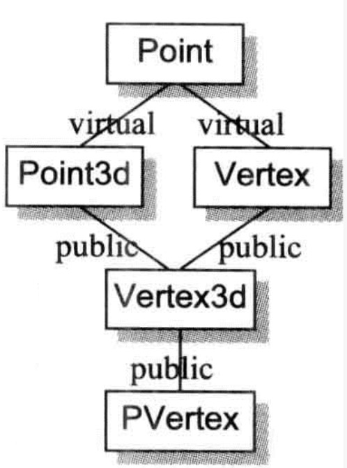

# 前言

```cpp
class Abstract_base {
public:
    virtual ~Abstract_base() = 0;
    virtual void interface() const = 0;
};

class Derived_class : public Abstract_base {
    void interface() const override;
    ~Derived_class() override;
};
```

```cpp
ob_chapter5::Abstract_base::~Abstract_base() {
    my_log("Abstract_base::~Abstract_base");
}

void ob_chapter5::Derived_class::interface() const {
//    Abstract_base::interface();
    my_log("Derived_class::interface");
}

ob_chapter5::Derived_class::~Derived_class() {
    my_log("Derived_class::~Derived_class");
}
```

把上面的注释打开，会编译不通过，所以不能通过类作用域的方式调用虚函数，这点和书不太一样。

# 无继承情况下的对象构造

```cpp
class Point {
public:
    Point() {}

    Point(int x, int y) : _x(x), _y(y) {};
    int _x;
    int _y;
};
```

```cpp
Point global;

Point test() 
{
    Point local;
    Point *heap = new Point;
    *heap = local;

    delete heap;
    return local;
}
```

这是一个纯数据的类，所以编译器不会为其生成构造函数、析构函数、复制构造函数。

对于`Point global;`：

在C中，global被视为一个“临时性的定义”，因为它没有显式的初始化操作。一个“临时性的定义”可以在程序中发生多次。

C支持临时性的定义，而C++并不支持"临时性的定义”，这是因为class构造行为的隐式应用之故（声明一个对象相当于调用了默认构造函数）。因此，global在C++中被视为完全定义（它会阻止第二个或更多个定义）。C++的所有全局对象都被以“初始化过的数据”来对待。

`Point *heap = new Point;`的操作：

会转为new运算符的调用：

```cpp
Point *heap = _new( sizeof(Point) );
```

`*heap = local;`的操作：

会调用赋值运算符，对于目前的Point来说，这个操作是位逐次拷贝。

`delete heap;`的操作：

会转为delete运算符的调用：

```cpp
_delete(heap);
```

>   TODO 为什么全局对象的成员变量可以被初始化，但是局部对象的成员变量不能？

## 抽象数据类型

```cpp
class Point {
public:
    Point(int x = 0, int y = 0) : _x(x), _y(y) {};
    int _x;
    int _y;
};

Point global;

Point test() {
    Point local;
    Point *heap = new Point;
    *heap = local;

    delete heap;
    return local;
}
```

如果要将class中的所有成员都设定常量初值，那么给予一个explicit initialization list会比较有效率些。

```cpp
int test2() {
    Point p1 = {1, 2};
    Point p2;
    p2._x = 3;
    p2._y = 4;
    return 0;
}
```

p1的初始化操作会比p2的有效率些。这是因为当函数的activation record被放进程序堆栈时，上述initialization list中的常量就可以被放进p1内存中了。

下面是test2的汇编：

```
0000000100003ea0 __Z5test2v:
100003ea0: 55                          	pushq	%rbp
100003ea1: 48 89 e5                    	movq	%rsp, %rbp
100003ea4: 48 83 ec 10                 	subq	$16, %rsp
100003ea8: 48 8d 7d f8                 	leaq	-8(%rbp), %rdi
100003eac: be 01 00 00 00              	movl	$1, %esi
100003eb1: ba 02 00 00 00              	movl	$2, %edx
100003eb6: e8 15 ff ff ff              	callq	-235 <__ZN5PointC1Eii>
100003ebb: 31 c0                       	xorl	%eax, %eax
100003ebd: 48 8d 7d f0                 	leaq	-16(%rbp), %rdi
100003ec1: 89 c6                       	movl	%eax, %esi
100003ec3: 89 c2                       	movl	%eax, %edx
100003ec5: e8 06 ff ff ff              	callq	-250 <__ZN5PointC1Eii>
100003eca: 31 c0                       	xorl	%eax, %eax
100003ecc: c7 45 f0 03 00 00 00        	movl	$3, -16(%rbp)
100003ed3: c7 45 f4 04 00 00 00        	movl	$4, -12(%rbp)
100003eda: 48 83 c4 10                 	addq	$16, %rsp
100003ede: 5d                          	popq	%rbp
100003edf: c3                          	retq
```

>   汇编看不懂，个人是这样理解，p1的初始化操作只需要放入常量1和2，而p2的初始化操作，显示放入0和0（参数默认值），然后再赋值3和4，所以p1更有效率。

显式初始化列表带来3个缺点：

1.  只有当class members都是public，此法才奏效。
2.  只能指定常量，因为它们在编译时期就可以被评估求值（evaluated）（此条存疑，经测试，非常量，如一个x，用cin赋值，也可以传递）。
3.  由于编译器并没有自动施行之，所以初始化行为的失败可能性会高一些。

## 为继承做准备

Point更改：

```cpp
class Point {
public:
    Point(int x = 0, int y = 0) : _x(x), _y(y) {};
    int _x;
    int _y;
    virtual int z();
};
```

Point增加了一个虚函数，在对象内部增加了一个虚函数指针。除此之外，virtual function 的导入也引发编译器对于 Point class产生膨胀作用：

-   定义的constructor被附加了一些代码，以便将vptr初始化。
    这些代码必须被附加在任何base class constructors的调用之后，但必须在程序员的代码之前。
-   合成一个有效的copy constructor和copy assignment operator。因为如果一个Point object被初始化或以一个derived class object赋值，那么位逐次拷贝的操作可能对vptr带来非法设定。

```cpp
Point global;

Point test() 
{
    Point local;
    Point *heap = new Point;
    *heap = local;

    delete heap;
    return local;
}
```

global初始化操作、heap的初始化操作以及heap删除操作，都还是和上面的相同，然而L7的memberwise赋值操作：

```
*heap = local;
```

很有可能触发copy assignment operator的合成，及其调用操作的一个inline expansion(行内扩张)：以this取代heap，而以 rhs取代local。

在L10，return的那一行，可能会导致复制构造函数，具体见构造函数章节。

# 继承体系下的对象构造

当定义一个object如下：

```
T object;
```


会调用一个构造函数。Constructor可能内含大量的隐藏码，因为编译器会扩充每一个constructor，扩充程度视class T的继承体系而定。一般的扩充约定：

1. 记录在member initialization list中的data members初始化操作会被放进constructor的函数本体，并以members的声明顺序为顺序。

2. 如果有一个 member 并没有出现在member initialization list之中，但它有一个default constructor，那么该default constructor必须被调用。

3. 在那之前，如果class object有virtual table pointer(s)，它(们)必须被设定初值，指向适当的virtual table(s)。

4. 在那之前，所有上一层的base class constructors必须被调用，以base class的声明顺序为顺序(与member initialization list中的顺序没关联)：

    -   如果base class被列于member initialization list中，那么任何显式指定的参数都应该传递过去。

    -   如果base class没有被列于member initialization list中，而它有default constructor（default memberwise copy constructor)）, 那么就调用之。

    -   如果base class是多重继承下的第二或后继的base class，那么this指针必须有所调整。

5. 在那之前，所有virtual base class constructors必须被调用，从左到右，从最深到最浅：
    -   如果 class 被列于 member initialization list中，那么如果有任何显式指定的参数，都应该传递过去。若没有列于list之中，而class有一个default constructor，亦应该调用之。
    -   此外，class中的每一个virtual base class subobject 的偏移位置(offset) 必须在执行期可被存取。
    -   如果class object是最底层(most-derived)的class，其 constructors可能被调用；某些用以支持这一行为的机制必须被放进来。

Point再次更改：

```cpp
class Point {
public:
    Point(int x = 0, int y = 0);
    Point(const Point&);
    Point& operator=(Point&);
    virtual ~Point();
    virtual int z();
    int _x;
    int _y;
};
```

书中介绍是有个Line类组合了Point，因为Point含有显式的构造函数、复制构造函数、重载赋值运算符，所以Line也会生成对应的构造函数，这部分在构造函数章节已经介绍了，略。

## 虚拟继承

```cpp
class Point3d : public virtual Point {
public:
    Point3d(int x = 0, int y = 0, int z = 0) : Point(x, y), z(z) {}
    Point3d(const Point3d &rhs) : Point(rhs), _z(rhs._z);
    ~Point3d();
    Point3d &operator=(const Point3d &);
    virtual float z() { return _z; }
    int _z;
};
```

在虚继承下，一般的构造函数扩充方法没有用，因为虚继承只有一个基类对象。

一种做法是根据有一个标记来判断虚基类是否构造完成，如果完成就跳过，否则构造虚基类对象。

C++伪码：

```cpp
Point3d* Point3d::Point3d(Point3d *this, bool most_derived,
        int x, int y, int z ) {
    
    if(most_derived != false ) {
        this->Point::Point(x, y); 
    }

    this->_vtbl_Point3d = _vtbl_Point3d;
    this->_vptr_Point3d_Point =_vptr_Point3d_Point;
    this->_z= rhs._z;
    
    return this;
}
```

## 虚函数指针语意学



```cpp
/**
 * 测试虚继承和非虚继承下的虚函数在构造函数中的调用情况
 */
class A {
public:
    A() { hello(); };
    virtual void hello();
};

class B :  public A {
public:
    B() { hello(); };
    virtual void hello();
};

class C :  public A {
public:
    C() { hello(); };
    virtual void hello();
};

class D : public B, public C {
public:
    D() { hello(); };
    virtual void hello();
};
```

构造一个D对象的日志：

```
A
B
A
C
D
```

把B和C改为虚继承A：

```
A
B
C
D
```

>   这里和Java的不太一样。这是因为派生类的虚函数指针还没被设定。

**在一个class的constructor（和destructor）中，经由构造中的对象来调用一个virtual function，其函数实例应该是在此class中有作用的那个。**


constructor的执行算法通常如下：

1.  在derived class constructor中，“所有virtual base classes” 及“上一层base class”的constructors会被调用。
2.  上述完成之后，对象的vptr(s)被初始化，指向相关的virtual table(s)。
3.  如果有member initialization list的话，将在constructor体内扩展开来。这必须在vptr被设定之后才做，以免有一个virtual member function被调用。
4.  最后，执行程序员所提供的代码。

TODO 按照这个说法，如果在调用基类构造函数时，传递参数用的是虚函数，那么会有问题，但是经测试，结果没有异常：

```cpp
class E {
public:
    int _x;

    E(int x) : _x(x) {
        cout << "return1 in E" << endl;
        return1();
    }

    virtual int return1();
};

class F : public E {
public:
    F() : E(return1()) {
        cout << "return1 in F" << endl;
        return1();
    }

    virtual int return1() override;
};


void ob_chapter5::test2() {
    F f;
    my_log(f._x);
}

int ob_chapter5::F::return1() {
    my_log("F return1")
    return 2;
}

int ob_chapter5::E::return1() {
    my_log("E return1")
    return 1;
}
```

```
F return1
return1 in E
E return1
return1 in F
F return1
2
```

# 对象赋值语意学

赋值运算符的调用时机：

```cpp
/**
 * 测试复制构造函数和赋值运算法的调用时机
 */
class G {
public:
    int g;
    G(){};
    G(const G& g);
    G& operator=(const G&g);
};
```

```cpp
ob_chapter5::G::G(const ob_chapter5::G &g) {
    my_log("拷贝构造函数");
    this->g = g.g;
}

ob_chapter5::G &ob_chapter5::G::operator=(const ob_chapter5::G &g) {
    my_log("赋值运算符");
    if (this == &g) {
        return *this;
    }
    this->g = g.g;
    return *this;
}

void ob_chapter5::test3() {
    G g1;
    G g2 = g1;
    G g3;
    g3 = g1;
}
```

```
拷贝构造函数
赋值运算符
```

当设计一个 class，并以一个class object指定给另一个 class object 时，有三种选择：

1. 什么都不做，因此得以实施默认行为。
2. 提供一个explicit copy assignment operator。
3. 显式地拒绝把一个 class object 指定给另一个 class object。

如果要选择第3点，那么只要将 copy assignment operator 声明为 private，并且不提供其定义即可。
把它设为private，就不再允许于任何地点(除了在member functions 以及该 class 的friends之中)做赋值(assign)操作。
不提供其函数定义，则一旦某个member function或 friend 企图影响一份拷贝，程序在链接时就会失败。

```cpp
class Point {
public:
    Point(int x = 0, int y = 0);
    int _x;
    int _y;
};
```

此时的Point不需要提供一个复制构造函数，位逐次拷贝够用了。

在以下情况，类不会表现出 bitwise copy 语意：

1.  当class内含一个member object，而其class有一个copy assignment operator时。
2.  当一个class的base class有一个copy assignment operator时。
3.  当一个class声明了任何virtual functions时。
4.  当class继承自一个virtual base class时。

```cpp
/**
 * 虚继承下的赋值运算符调用链
 */
class G {
public:
    int g;
    G &operator=(const G &g);
};

class H : virtual public G {
public:
    int h;
};

class I : virtual public G {
public:
    int i;
};

class J : public H, public I {
public:
    int j;
};

void test4();
```

```cpp
ob_chapter5::G &ob_chapter5::G::operator=(const ob_chapter5::G &g) {
    my_log("赋值运算符");
    if (this == &g) {
        return *this;
    }
    this->g = g.g;
    return *this;
}

void ob_chapter5::test4() {
    H h1;
    H h2;
    h2 = h1;
    my_log("====");
    J j1;
    J j2;
    j2 = j1;
}
```

```
赋值运算符
====
赋值运算符
赋值运算符
```

从测试Demo中可以推断，H部分：编译器生成的赋值运算符会调用基类的（因为基类存在显式的赋值运算符）。J部分：G的赋值运算符调用了2次，这是因为H和I生成的赋值运算符都调用了G的，虽然是虚继承，但是还是调用了2次。

这是因为，编译器没有办法压抑上一层base class的copy operators被调用。
构造函数可以，这是因为编译器可以在构造函数添加额外参数，如虚基类就添加了一个bool值来判断虚基类对象有没有初始化。
赋值运算符不行，这是因为赋值运算符可以通过函数指针的方式调用，如果添加了额外参数，会导致函数指针调用错误。

# 析构语意学

如果 class 没有定义 destructor，那么只有在 class 内含的 member object （亦或 class 自己的base class）拥有destructor 的情况下，编译器才会自动合成出一个来。否则， destructor 被视为不需要，也就不需被合成（当然更不需需要被调用）。

一个由程序员定义的 destructor 被扩展的方式类似costructors 被扩展的方式，但顺序相反：

1.  destructor 的函数本体首先被执行。
2.  如果class拥有member class objects，而后者拥有destructors，那么它们会以其声明顺序的相反顺序被调用。
3.  如果object内含一个 vptr，现在被重新设定，指向适当之base class 的virtual table。（虚函数指针改为指向基类的虚函数表）
4.  如果有任何直接的(上一层) nonvirtual base classes 拥有destructor，它们会以其声明顺序的相反顺序被调用。
5.  如果有任何virtual base classes拥有destructor，而目前讨论的这个class是最尾端(most-derived)的class，那么它们会以其原来的构造顺序的相反顺序被调用。

