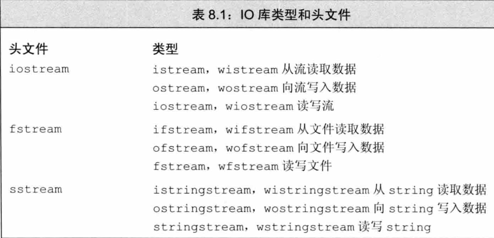
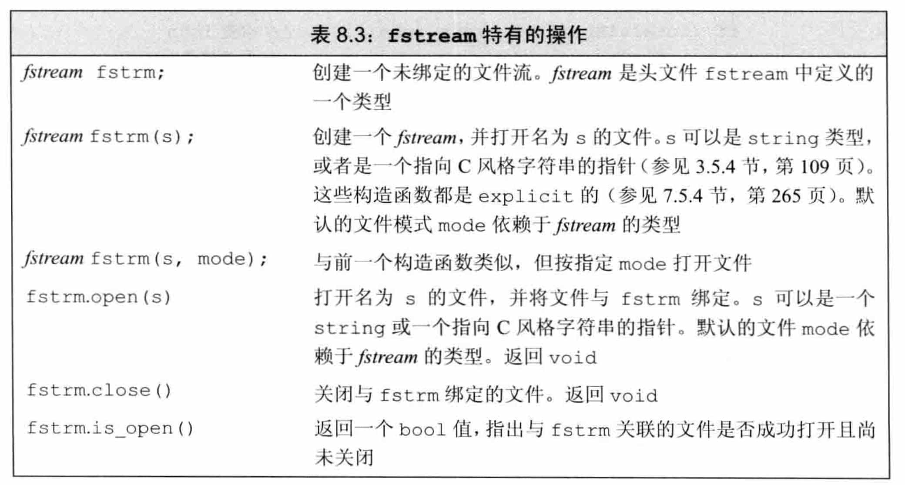
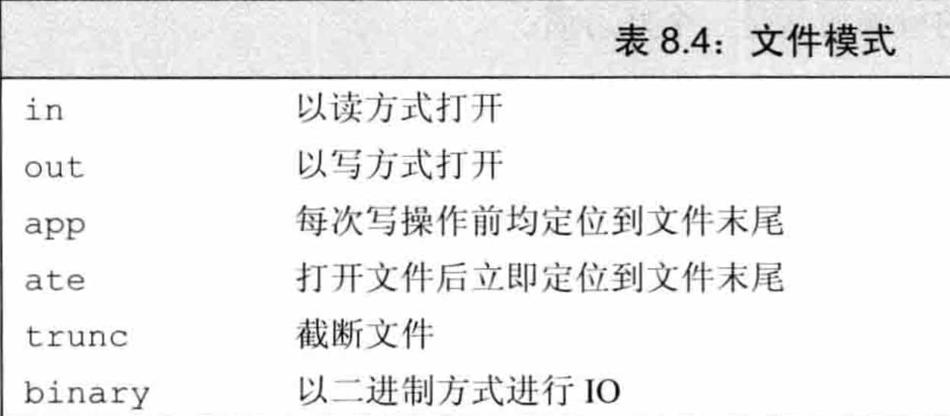

# cin

cin在输入会忽略空格和换行符，发送给cin的输入会被缓冲。

`cin >> str;`，这种输入方式不会读取空格、换行符等。

## 面向行的输入

### cin.getline(str,size)

getline是面向行的输入。

```cpp
void chapter_4_demo_input() {
    //面向行的输入：getline
    char str[5];
    cin.getline(str, 5);//input:abcdef
    cout << str << endl;//output:abcd
}
```

注意，读取的字符串长度是size-1，因为会在结尾加空字符`\0`。

getline通过换行符来确定行尾，但不保存换行符，它用空字符串来替换换行符。

### cin.get(str,size)

get也是面向行的输入

```cpp
void chapter_4_demo_input() {
    //面向行的输入：get
    char str[5];
    char str2[5];
    cin.get(str, 5);
    cin.get(str2, 5);
    cout << str << endl;
    cout << str2 << endl;
}
```

get不读取并丢弃换行符，而是将其留在输入队列中。

像上面的例子中，如果输入abcd，那么会直接执行cout。

因为第一次调用后，换行符留在输入队列中，第二次调用时看到的第一个字符是换行符，因此get()认为已到达行尾，而没有发现任何可读取的内容。

```cpp
cin.get(str, 5);
cin.get();
cin.get(str2, 5);
```

可以通过添加`cin.get();`的方式来解决，因为cin.get()可以读取换行符（只能读取一个字符），为下一行读取作准备。

### 两者区别

1.  getline使用简单，不用处理结尾的换行符，但是不能判断是换行还是字符串填满。
    get需要处理结尾的换行符，可以判断是换行还是字符串填满。

## cin.get(ch)

`cin.get(ch);`可以输入空格、换行符等，需要手动退出输入，这里只能传char类型，退出判断可以通过判断EOF，Mac键盘输入EOF的快捷键是command+D（注：在CLion run的框中这个快捷键是退出，可以在终端直接运行可执行文件）。

```cpp
while (!cin.eof()&&!cin.fail()) {
    //...
}
```

检测到EOF后，cin将两位(eofbit和failbit)都设置为1。eof()来查看eofbit是否被设置；如果检测到EOF，则cin.eof()将返回bool值true，否则返回false。fail同理。

更通用的版本是

```cpp
while (cin.get(ch)) {
    //...
}
```

因为istream类提供了一个可以将istream对象(如cin)转换为bool值的函数，这更加通用，因为可以检测其他原因，如：磁盘故障。

```cpp
char ch;
ch = cin.get();
cin.get(ch);
```

`ch = cin.get();`和`cin.get(ch);`效果相同，只是前者返回编码，后者返回istream对象。

# getline(cin,str)

string的面向行的输入

# IO类

## 头文件



## IO对象无拷贝或赋值

不能拷贝或对IO对象赋值：

```
ofstream out1, out2;
out1 = out2;				// 错误：不能对流对象赋值
ofstream print(ofstream);	// 错误：不能初始化ofstream参数
out2 = print(out2);			// 错误：不能拷贝流对象
```

由于不能拷贝IO对象，因此我们也不能将形参或返回类型设置为流类型。进行IO操作的函数通常以引用方式传递和返回流。读写一个IO对象会改变其状态，因此传递和返回的引用不能是const的。

## 条件状态

IO库定义了一个与机器无关的iostate类型，它提供了表达流状态的完整功能。

-   badbit
    表示系统级错误，如不可恢复的读写错误。通常情况下，一旦badbit被置位，流就无法再使用了。
-   failbit
    在发生可恢复错误后，failbit被置位，如期望读取数值却读出一个字符等错误。这种问题通常是可以修正的，流还可以继续使用。
-   eofbit
    如果到达文件结束位置，eofbit和failbit都会被置位。
-   goodbit
    goodbit的值为0，表示流未发生错误。

如果badbit、failbit和eofbit任一个被置位，则检测流状态的条件会失败。

## 管理输出缓冲

### 刷新输出缓冲区

```
cout <<"hi!" <<endl;	//输出hi和一个换行，然后刷新缓冲区
cout <<"hi!" <<flush;	//输出hi，然后刷新缓冲区，不附加任何额外字符
cout <<"hi!" <<ends;	//输出hi和一个空字符，然后刷新缓冲区
```

### unitbuf操纵符

如果想在每次输出操作后都刷新缓冲区，我们可以使用unitbuf操纵符。它告诉流在接下来的每次写操作之后都进行一次flush操作。而nounitbuf操纵符则重置流，使其恢复使用正常的系统管理的缓冲区刷新机制：

```
//所有输出操作后都会立即刷新缓冲区
cout<<unitbuf;
//任何输出都立即刷新，无缓冲
cout<<nounitbuf;
//回到正常的缓冲方式
```

## 文件输入输出



### 自动构造和析构

当一个fstream对象被销毁时，close会自动被调用。

### 文件模式



用一个文件名初始化流来隐式打开文件时也可以。指定文件模式有如下限制：

-   只可以对ofstream或fstream对象设定out模式。
-   只可以对ifstream或fstream对象设定in模式。
-   只有当out也被设定时才可设定trunc模式。
-   只要trunc没被设定，就可以设定app模式。在app模式下，即使没有显式指定out模式，文件也总是以输出方式被打开。
-   默认情况下，即使我们没有指定trunc，以out模式打开的文件也会被截断。为了保留以out模式打开的文件的内容，我们必须同时指定app模式，这样只会将数据追加写到文件末尾；或者同时指定in模式，即打开文件同时进行读写操作。
-   ate和binary模式可用于任何类型的文件流对象，且可以与其他任何文件模式组
    合使用。

## string流

sstream头文件定义了三个类型来支持内存IO，这些类型可以向string写入数据，从string读取数据，就像string是一个IO流一样。