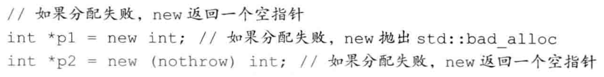
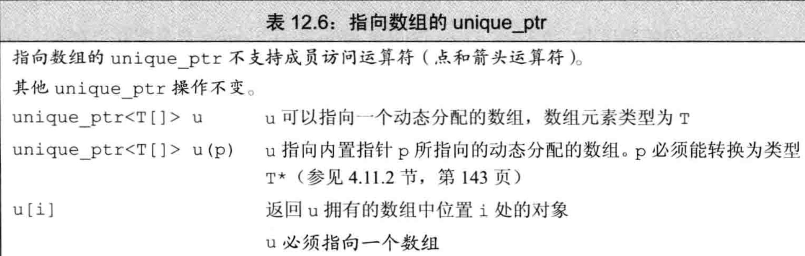
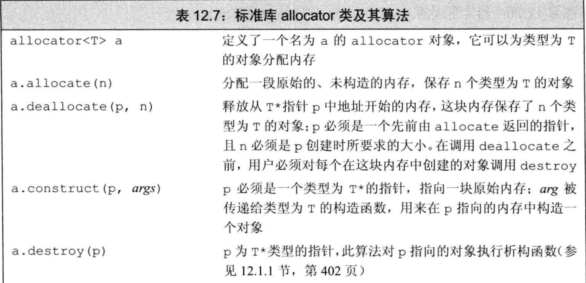
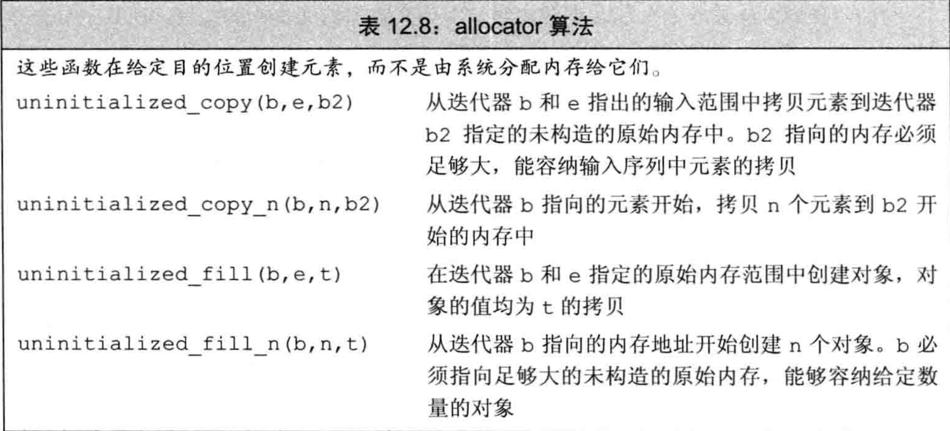

# 直接管理内存

```cpp
class D {
 public:
  D(int v) : val(v) {}
  int val;
};

void testNewAndDelete() {
  D d1(1);

  auto p = new auto(d1);
  NDK_LOG("p val=%d", p->val);
  d1.val = 2;
  NDK_LOG("p val=%d", p->val);

  delete p;
}
```

如果我们提供了一个括号包围的初始化器，就可以使用auto从此初始化器来推断我们想要分配的对象的类型。但是，由于编译器要用初始化器的类型来推断要分配的类型，只有当括号中仅有单一初始化器时才可以使用auto。

## 动态分配的const对象

用new分配const对象是合法的：

```
const int *p2 = new int(123);
const int *p3 = new const int(123);
```

## 内存耗尽

默认情况下，如果new不能分配所要求的内存空间，它会抛出一个类型为bad_alloc的异常。我们可以改变使用new的方式来阻止它抛出异常：



我们称这种形式的new为定位new（placement new）。定位new表达式允许我们向new传递额外的参数。在此例中，我们传递给它一个由标准库定义的名为nothrow的对象。如果将nothrow传递给new，我们的意图是告诉它不能抛出异常。如果这种形式的new不能分配所需内存，它会返回一个空指针。bad_alloc和nothrow都定义在**头文件new**中。


# 动态数组

C++语言定义了另一种new表达式语法，可以分配并初始化一个对象数组。标准库中包含一个名为allocator的类，允许我们将分配和初始化分离。使用allocator通常会提供更好的性能和更灵活的内存管理能力。

>
>   大多数应用应该使用标准库容器而不是动态分配的数组。使用容器更为简单、更不容易出现内存管理错误并且可能有更好的性能。

## new和数组

为了让new分配一个对象数组，我们要在类型名之后跟一对方括号，在其中指明要分配的对象的数目。

### 分配一个数组会得到一个元素类型的指针

虽然我们通常称`new T[]`分配的内存为“动态数组”，但这种叫法某种程度上有些误导。当用new分配一个数组时，我们并未得到一个数组类型的对象，而是得到一个数组元素类型的指针。即使我们使用类型别名定义了一个数组类型，new也不会分配一个数组类型的对象。我们正在分配一个数组的事实甚至都是不可见的——连[num]都没有。new返回的是一个元素类型的指针。

```c++
const int num = 5;
  // 测试静态数组
  {
    NDK_LOG("测试静态数组");
    int array[num];
    for (auto it = std::begin(array); it != std::end(array); ++it) {
      *it = 1;
    }
    for (int i = 0; i < num; i++) {
      NDK_LOG("array[%d]=%d", i, array[i]);
    }
  }
  // 测试动态数组
  {
    NDK_LOG("测试动态数组");
    int *array = new int[num];
    // 无法编译
    // for (auto it = std::begin(array); it != std::end(array); ++it) {
    //   *it = 1;
    // }
    for (int i = 0; i < num; i++) {
      NDK_LOG("array[%d]=%d", i, array[i]);
    }
  }
```

由于分配的内存并不是一个数组类型，因此不能对动态数组调用begin或end。这些函数使用数组维度来返回指向首元素和尾后元素的指针。

>   要记住我们所说的动态数组并不是数组类型，这是很重要的。

### 初始化动态分配对象的数组

```c++
void testDynamicArray2() {
  NDK_LOG("结构体动态数组初始化");
  struct S {
    int val = 2;
  };
  S *array = new S[2];
  for (int i = 0; i < 2; i++) {
    NDK_LOG("S.val=%d", array[i].val);
  }

  NDK_LOG("int动态数组初始化");
  int *intArray = new int[5]();
  for (int i = 0; i < 5; i++) {
    NDK_LOG("intArray[%d]=%d", i, intArray[i]);
  }
}
```

虽然我们用空括号对数组中元素进行值初始化，但不能在括号中给出初始化器，这意味着不能用auto分配数组。

### 动态分配一个空数组是合法的

虽然我们不能创建一个大小为0的静态数组对象，但当n等于0时，调用new[n]是合法的。

### 释放动态数组

为了释放动态数组，我们使用一种特殊形式的delete--在指针前加上一个空方括号对。

```
delete p;		//p必须指向一个动态分配的对象或为空
delete [] pa;	//pa必须指向一个动态分配的数组或为空
```

第二条语句销毁pa指向的数组中的元素，并释放对应的内存。数组中的元素按逆序销毁，即，最后一个元素首先被销毁，然后是倒数第二个，依此类推。

当我们释放一个指向数组的指针时，空方括号对是必需的：它指示编译器此指针指向一个对象数组的第一个元素。如果我们在delete一个指向数组的指针时忽略了方括号（或者在delete一个指向单一对象的指针时使用了方括号），其行为是未定义的。

### 智能指针和动态数组



与unique_ptr不同，shared_ptr不直接支持管理动态数组。如果希望使用shared_ptr管理一个动态数组，必须提供自己定义的删除器。

如果未提供删除器，这段代码将是未定义的。默认情况下，shared_ptr使用delete销毁它指向的对象。如果此对象是一个动态数组，对其使用delete所产生的问题与释放一个动态数组指针时忘记[]产生的问题一样

shared_ptr不直接支持动态数组管理这一特性会影响我们如何访问数组中的元素，shared_ptr未定义下标运算符，而且智能指针类型不支持指针算术运算。因此，为了访问数组中的元素，必须用get获取一个内置指针，然后用它来访问数组元素。

## allocator类

new有一些灵活性上的局限，其中一方面表现在它将内存分配和对象构造组合在了一起。类似的，delete将对象析构和内存释放组合在了一起。我们分配单个对象时，通常希望将内存分配和对象初始化组合在一起。因为在这种情况下，我们几乎肯定知道对象应有什么值。

当分配一大块内存时，我们通常计划在这块内存上按需构造对象。在此情况下，我们希望将内存分配和对象构造分离。这意味着我们可以分配大块内存，但只在真正需要时才真正执行对象创建操作（同时付出一定开销）。

一般情况下，将内存分配和对象构造组合在一起可能会导致不必要的浪费。更重要的是，那些没有默认构造函数的类就不能动态分配数组了。

### allocator类

标准库allocator类定义在头文件memory中，它帮助我们将内存分配和对象构造分离开来。它提供一种类型感知的内存分配方法，它分配的内存是原始的、未构造的。



### 拷贝和填充未初始化内存的算法

标准库还为allocator类定义了两个伴随算法，可以在未初始化内存中创建对象。它们都定义在头文件memory中。



