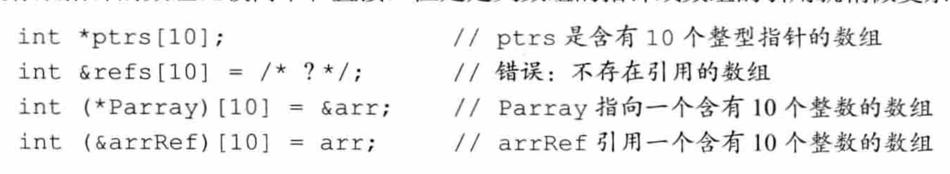
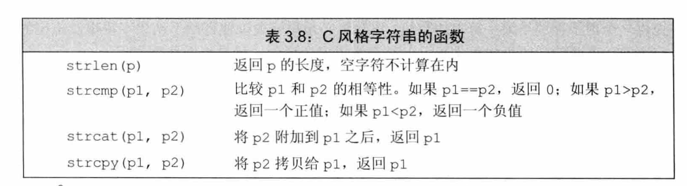

# 变量

## 声明和定义的关系

为了支持分离式编译，C++语言将声明和定义区分开来：

-   声明(declaration)使得名字为程序所知，一个文件如果想使用别处定义的名字则必须包含对那个名字的声明。
-   定义(definition)负责创建与名字关联的实体。

变量声明规定了变量的类型和名字，除此之外，定义还申请存储空间，也可能会为变量赋一个初始值。

如果想声明一个变量而非定义它，就在变量名前添加关键字extern，而且不要显式地初始化变量：

```
extern int i; //声明i而非定义i
int j; //声明并定义j
```

任何包含了显式初始化的声明即成为定义。给由extern关键字标记的变量赋一个初始值，但是这么做也就抵消了extern的作用。extern语句如果包含初始值就不再是声明，而变成定义了:

```
extern double pi = 3.1416; //定义
```


在函数体内部，如果试图初始化一个由extern关键字标记的变量，将引发错误。

**变量能且只能被定义一次，但是可以被多次声明。**如果要在多个文件中使用同一个变量，就必须将声明和定义分离。此时，变量的定义必须出现在且只能出现在一个文件中，而其他用到该变量的文件必须对其进行声明，却绝对不能重复定义。

## 复合类型

### 引用

1.   引用必须被初始化
2.   引用不是一个对象，所以不能定义引用的引用

```cpp
int val = 20;
int &val_2 = val;//创建引用变量
```

引用和指针相似，但是引用在声明的时候必须初始化，而指针不需要，引用更类似于const指针。

### 指针

#### 指针基础

指针是一个变量，其存储的是值的地址，而不是值本身。

对变量应用地址运算符(&)，就可以获得它的位置：

```cpp
int val = 100;
cout << "value of val = " << val << endl;
cout << "address of val = " << &val << endl;
```

```
value of val = 100
address of val = 0x7ffee26979f8//前面的0省略了
```

指针用于存储值的地址。指针名表示的是地址。`*`运算符被称为间接值(indirect velue )或解除引用(dereferencing)运算符，将其应用于指针，可以得到该地址处存储的值。例如，假设manly是一个指针，则manly表示的是一个地址，而`*`manly表示存储在该地址处的值。`*`manly与常规int变量等效。

```cpp
int val = 100;
int *ptr_val;
ptr_val = &val;
cout << val << endl;
cout << &val << endl;
cout << ptr_val << endl;
cout << *ptr_val << endl;
```

```
100
0x7ffee7eb59f8
0x7ffee7eb59f8
100
```

这里引用《C++ Primer Plus》的话，`*`和`&`用在变量val上，就像硬币的正反面，`*val`和`val`表示值，`val`和`&val`表示地址。看上面的小例子会更好理解。

#### 指针的危险

在C++中创建指针时，计算机将分配用来存储地址的内存，但不会分配用来存储指针所指向的数据的内存。

```cpp
int *p1;
*p1 = 1200;
cout << p1 << endl;
cout << *p1 << endl;
```

```
0x7ffeeb5e6a18
1200
```

p1是一个指针，但它没有被初始化。1200不知道会存放在哪。由于p1没有被初始化，它可能有任何值。不管值是什么，程序都将它解释为存储1200的地址。如果p1的值碰巧为100，计算机将把数据放在地址100上，即使这恰巧是程序代码的地址。p1指向的地方很可能并不是所要存储1200的地方，这种错误可能会导致一些最隐匿、最难以跟踪的bug。

**警告：一定要在对指针应用解除引用运算符`*`之前，将指针初始化为一个确定的的地址。**

#### 指针和数组

```cpp
void test_array_fun() {
    int arr[4] = {1, 2, 3, 4};//数组
    int *ptr_arr = arr;//数组指针
    cout << "size of int = " << sizeof(int) << endl;
    cout << "size of arr = " << sizeof(arr) << endl;
    cout << "address of arr = " << &arr << endl;
    cout << "size of ptr_arr's address = " << sizeof(ptr_arr) << endl;
    cout << "address of ptr_arr = " << ptr_arr << endl;
}
```

```
size of int = 4
size of arr = 16
address of arr = 0x7ffee6394a40
size of ptr_arr's address = 8
address of ptr_arr = 0x7ffee6394a40
```

一般情况下，指针可以代替数组，但是还是有一点区别，区别如上。

对数组名sizeof可以得到数组的长度（以字节为单位，下同），而对指针名sizeof只能得到指针地址的长度，这个长度对于同一台机器是死的。

#### 动态分配内存

##### new分配内存

指针真正的用武之地在于，在运行阶段分配未命名的内存以存储值。在C语言中，可以用库函数malloc()来分配内存；在C++中仍然可以这样做，但C++还有更好的方法：new运算符。

```cpp
int *pt = new int;
*pt = 100;
cout << pt << endl;
cout << *pt << endl;
```

```
0x7fe81dc017a0
100
```

##### 使用delete释放内存

delete运算符，它使得在使用完内存后，能够将其归还给内存池，

```cpp
int *pt = new int;
*pt = 100;
cout << pt << endl;
cout << *pt << endl;

delete pt;
```

这将释放pt指向的内存，但不会删除指针pt本身。例如，可以将pt重新指向另一个新分配的内存块。

**一定要配对地使用new和delete；否则将发生内存泄漏**。

**不要尝试释放已经释放的内存块，C++标准指出，这样做的结果将是不确定的，这意味着什么情况都可能发生。**

**不能使用delete来释放声明变量所获得的内存**

**只能用delete来释放使用new分配的内存。对空指针使用delete是安全的。**

##### 使用new来创建动态数组

在编译时给数组分配内存被称为**静态联编**，意味着数组是在编译时加入到程序中的。
使用new时，如果在运行阶段需要数组，则创建它；如果不需要，则不创建。还可以在程序运行时选择数组的长度。这被称为**动态联编**，意味着数组是在程序运行时创建的。这种数组叫作动态数组。

使用静态联编时，必须在编写程序时指定数组的长度；使用动态联编时，程序将在运行时确定数组的长度。

创建动态数组很容易：只要将数组的元素类型和元素数目告诉new即可。

```cpp
int n = 10;
int *p_array = new int[n];
int array[n];
```

new运算符返回第一个元素的地址。

>   这里发现，静态数组也可以用变量声明长度。

使用另一种格式的delete来释放：

```cpp
delete[] p_array;
```

方括号告诉程序，应释放整个数组，而不仅仅是指针指向的元素。

总之，使用new和delete时，应遵守以下规则：

-   不要使用delete来释放不是new分配的内存。
-   不要使用delete释放同一个内存块两次。
-   如果使用new[]为数组分配内存，则应使用delete[]来释放。
-   如果使用new[]为一个实体分配内存，则应使用delete(没有方括号)来释放。
-   对空指针应用delete是安全的。

#### 指针和const

见const关键字总结

### 引用、指针的声明

```
// i是一个int型的数，p是一个int型指针，r是一个int型引用
inti=1024，*p=&i，&r=i;
```

```
int* p1, p2;	//p1是指向int的指针，p2是int
```

# 数组

## 理解复杂的数组声明



>   要想理解数组声明的含义，最好的办法是从数组的名字开始按照由内向外的顺序阅读。

# C风格字符串的一些函数



# 左值和右值

C++的表达式要不然是右值(rvalue，读作“are-value")，要不然就是左值( lvalue，读作“ell-value ”)。

一个左值表达式的求值结果是一个对象或者一个函数，然而以常量对象为代表的某些左值实际上不能作为赋值语句的左侧运算对象。此外，虽然某些表达式的求值结果是对象，但它们是右值而非左值。

**可以做一个简单的归纳：当一个对象被用作右值的时候，用的是对象的值(内容)；当对象被用作左值的时候，用的是对象的身份(在内存中的位置)。**

# sizeof

sizeof运算符的结果部分地依赖于其作用的类型：

-   对char或者类型为char的表达式执行sizeof运算，结果得1。
-   对引用类型执行sizeof运算得到被引用对象所占空间的大小。
-   对指针执行sizeof运算得到指针本身所占空间的大小。
-   对解引用指针执行sizeof运算得到指针指向的对象所占空间的大小，指针不需有效。
-   对数组执行sizeof运算得到整个数组所占空间的大小，等价于对数组中所有的元素各执行一次sizeof运算并将所得结果求和。注意，sizeof运算不会把数组转换成指针来处理。
-   对string对象或vector对象执行sizeof运算只返回该类型固定部分的大小，不会计算对象中的元素占用了多少空间。

```cpp
void testSizeOf() {
  struct StructA {
    double d;
    int *ptr;
  };
  NDK_LOG("sizeof(StructA)=%d", sizeof(StructA));
  int i = 1;
  std::vector<StructA> list;
  list.push_back({1.1, &i});
  NDK_LOG("sizeof(list)=%d, list.size()=%d", sizeof(list), list.size());
  list.push_back({2.2, &i});
  NDK_LOG("sizeof(list)=%d, list.size()=%d", sizeof(list), list.size());
}
```

```
sizeof(StructA)=16
sizeof(list)=24, list.size()=1
sizeof(list)=24, list.size()=2
```

# 随机数

## rand

rand函数生成均匀分布的伪随机整数，每个随机数的范围在0和一个系统相关的最大值（至少为32767）之间。

rand函数有一些问题：即使不是大多数，也有很多程序需要不同范围的随机数。一些应用需要随机浮点数。一些程序需要非均匀分布的数。而程序员为了解决这些问题而试图转换rand生成的随机数的范围、类型或分布时，常常会引入非随机性。

定义在头文件random中的随机数库通过一组协作的类来解决这些问题：随机数引擎类(random-number engines)和随机数分布类(random-number distribution)。

## 随机数引擎和分布

随机数引擎是函数对象类，它们定义了一个调用运算符，该运算符不接受参数并返回一个随机unsigned整数。我们可以通过调用一个随机数引擎对象来生成原始随机数：

```c++
void testRandom() {
  // #include "random"
  std::default_random_engine e;  //生成随机无符号数
  for (size_t i = 0; i < 10; ++i) {
    // e()“调用”对象来生成下一个随机数
    NDK_LOG("%u", e());
  }
}
```

标准库定义了多个随机数引擎类，区别在于性能和随机性质量不同。每个编译器都会指定其中一个作为default_random_engine类型。

对于大多数场合，随机数引擎的输出是不能直接使用的，这也是为什么早先我们称之为原始随机数。问题出在生成的随机数的值范围通常与我们需要的不符，而正确转换随机数的范围是极其困难的。

### 分布类型和引擎

为了得到在一个指定范围内的数，我们使用一个分布类型的对象：

```c++
{
    // 生成0到9之间（包含）均匀分布的随机数
    std::uniform_int_distribution<unsigned> u(0, 9);
    std::default_random_engine e;  // 生成无符号随机整数
    for (size_t i = 0; i < 10; ++i)
      // 将u作为随机数源
      // 每个调用返回在指定范围内并服从均匀分布的值
      NDK_LOG("%u|", u(e));
  }
```

此处我们将u定义为`uniform_int_distribution<unsigned>`。此类型生成均勻分布的unsigned值。当我们定义一个这种类型的对象时，可以提供想要的最小值和最大值。

类似引擎类型，分布类型也是函数对象类。分布类型定义了一个调用运算符，它接受一个随机数引擎作为参数。分布对象使用它的引擎参数生成随机数，并将其映射到指定的分布。

注意，如果我们将调用写成`u(e())`，含义就变为将e生成的下一个值传递给u，会导致一个编译错误。我们传递的是引擎本身，而不是它生成的下一个值，原因是某些分布可能需要调用引擎多次才能得到一个值。

### 引擎生成一个数值序列

随机数发生器有一个特性经常会使新手迷惑：即使生成的数看起来是随机的，但对一个给定的发生器，每次运行程序它都会返回相同的数值序列。

```
{
      // 生成0到9之间（包含）均匀分布的随机数
      std::uniform_int_distribution<unsigned> u(0, 9);
      std::default_random_engine e;  // 生成无符号随机整数
      for (size_t i = 0; i < 10; ++i) {
        // 将u作为随机数源
        // 每个调用返回在指定范围内并服从均匀分布的值
        std::cout << u(e) << "|";
      }
      std::cout << std::endl;
    }
    // 注意，这两次结果是相同的
    {
      std::uniform_int_distribution<unsigned> u(0, 9);
      std::default_random_engine e;
      for (size_t i = 0; i < 10; ++i) {
        std::cout << u(e) << "|";
      }
    }
```

```
1|5|0|2|0|8|2|2|8|2|
1|5|0|2|0|8|2|2|8|2|
```

编写此函数的正确方法是将引擎和关联的分布对象定义为static的，由于e和u是static的，因此它们在函数调用之间会保持住状态。第一次调用会使用u（e）生成的序列中的前100个随机数，第二次调用会获得接下来100个，依此类推。

>   一个给定的随机数发生器一直会生成相同的随机数序列。一个函数如果定义了局部的随机数发生器，应该将其（包括引擎和分布对象）定义为static的。否则，每次调用函数都会生成相同的序列。


### 设置随机数发生器种子

随机数发生器会生成相同的随机数序列这一特性在调试中很有用。但是，一旦我们的程序调试完毕，我们通常希望每次运行程序都会生成不同的随机结果，可以通过提供一个种子（seed）来达到这一目的。种子就是一个数值，引擎可以利用它从序列中一个新位置重新开始生成随机数。

为引擎设置种子有两种方式：在创建引擎对象时提供种子，或者调用引擎的seed成员：

```c++
{
    std::default_random_engine e1;              // 使用默认种子
    std::default_random_engine e2(2147483646);  //使用给定的种子值
    // e3和e4将生成相同的序列，因为它们使用了相同的种子
    std::default_random_engine e3;         //使用默认种子值
    e3.seed(32767);                        // 调用seed设置一个新种子值
    std::default_random_engine e4(32767);  // 将种子值设置为32767

    for (size_t i = 0; i != 100; ++i) {
      if (e1() == e2()) cout << "unseeded match at iteration: " << i << endl;
      if (e3() != e4()) cout << "seeded differs at iteration: " << i << endl;
    }
  }
```

本例中我们定义了四个引擎。前两个引擎el和e2的种子不同，因此应该生成不同的序列。后两个引擎e3和e4有相同的种子，它们将生成相同的序列。

选择一个好的种子，与生成好的随机数所涉及的其他大多数事情相同，是极其困难的。可能最常用的方法是调用系统函数time。这个函数定义在头文件ctime中，它返回从一个特定时刻到当前经过了多少秒。函数time接受单个指针参数，它指向用于写入时间的数据结构。如果此指针为空，则函数简单地返回时间：

```
default_random_engine el (time (0)); // 稍微随机些的种子
```

由于time返回以秒计的时间，因此这种方式只适用于生成种子的间隔为秒级或更长的应用。如果程序作为一个自动过程的一部分反复运行，将time的返回值作为种子的方式就无效了；它可能多次使用的都是相同的种子。

## 其他随机数分布

### 生成随机实数

程序常需要一个随机浮点数的源。特别是，程序经常需要0到1之间的随机数。最常用但不正确的从rand获得一个随机浮点数的方法是用rand的结果除以RAND_MAX，即，系统定义的rand可以生成的最大随机数的上界。这种方法不正确的原因是随机整数的精度通常低于随机浮点数，这样，有一些浮点值就永远不会被生成了。

>   比如可以生成1/RAND_MAX和2/RAND_MAX，但是两者之间的浮点数就不能生成

使用新标准库设施，可以很容易地获得随机浮点数。我们可以定义一个`uniform_real_distribution`类型的对象，并让标准库来处理从随机整数到随机浮点数的映射。

### 生成非均匀分布的随机数

正态分布：normal_distribution
