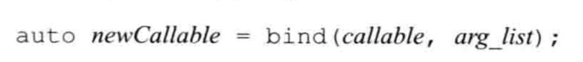
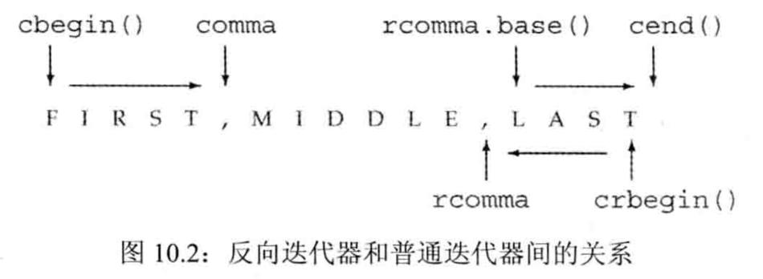
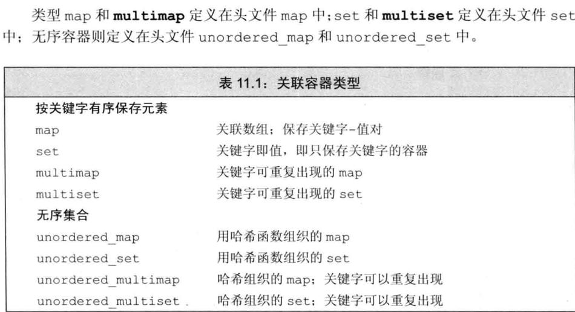
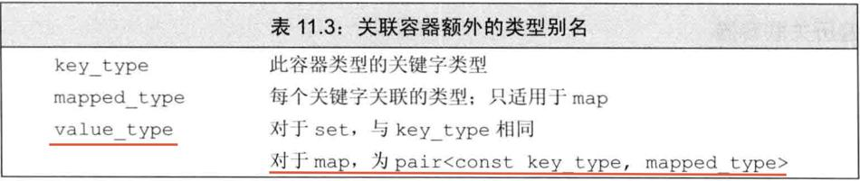
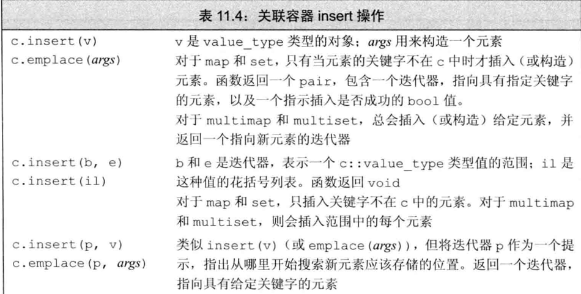
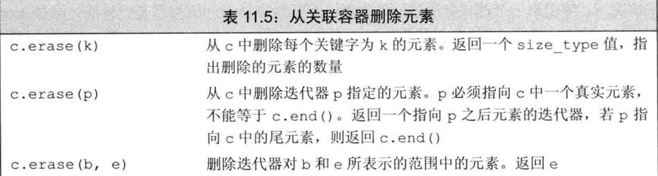
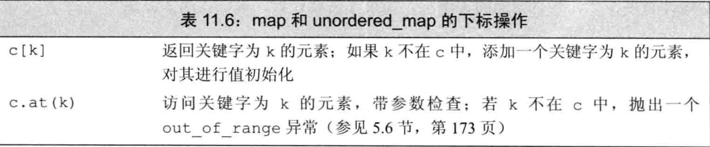
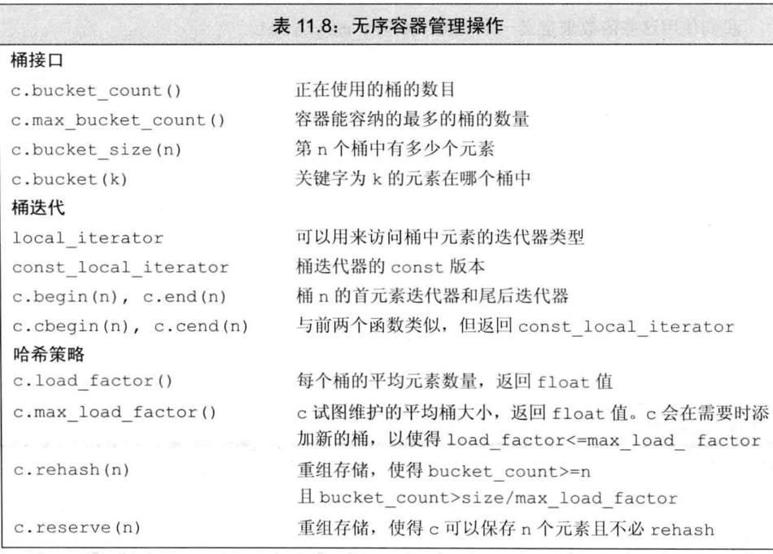

# 概述


# vector

初始化

```
vector<int> v1 (10) ;	// v1有10个元素，每个的值都是0
vector<int> v2{10} ;	// v2有1个元素，该元素的值是10
vector<int> v3(10，1) ;	// v3有10个元素，每个的值都是1
vector<int> v4{10，1};	//v4有2个元素，值分别是10和1
```

>   开始的时候创建空的vector对象，在运行时再动态添加元素，这一做法与C语言及其他大多数语言中内置数组类型的用法不同。
>
>   特别是如果用惯了C或者Java，可以预计在创建vector对象时顺便指定其容量是最好的。然而事实上，通常的情况是恰恰相反。

## 改变容器大小


## 管理容量的成员函数


reserve并不改变容器中元素的数量，它仅影响vector预先分配多大的内存空间。

只有当需要的内存空间超过当前容量时，reserve调用才会改变vector的容量。如果需求大小大于当前容量，reserve至少分配与需求一样大的内存空间（可能更大）。

如果需求大小小于或等于当前容量，reserve什么也不做。特别是，当需求大小小于当前容量时，容器不会退回内存空间。因此，在调用reserve之后，capacity将会大于或等于传递给reserve的参数。

这样，调用reserve永远也不会减少容器占用的内存空间。类似的，resize成员函数只改变容器中元素的数目，而不是容器的容量。我们同样不能使用resize来减少容器预留的内存空间。

在新标准库中，我们可以调用shrink_to_fit来要求deque，vector或string退回不需要的内存空间。此函数指出我们不再需要任何多余的内存空间。但是，具体的实现可以选择忽略此请求。也就是说，调用shrink_to_fit也并不保证一定退回内存空间。

## reserve和resize的区别

resize：如果容量增大，capacity和size都会跟着增大。resize是添加元素。如果容量减少，capacity不会变化，size会减少。

reserve：如果容量增大，capacity会增大，size不变，reserve不会添加元素。如果容量减少，都不会发生变化。

```cpp
void testVectorResizeAndReserve() {
  {
    std::vector<int> v;
    v.resize(10, 1);
    NDK_LOG("resize: capacity=%d size=%d", v.capacity(), v.size());
    // 容量减小
    v.resize(5, 2);
    NDK_LOG("resize: capacity=%d size=%d", v.capacity(), v.size());
  }
  {
    std::vector<int> v;
    v.reserve(10);
    NDK_LOG("reserve: capacity=%d size=%d", v.capacity(), v.size());
    // 容量减小
    v.reserve(5);
    NDK_LOG("reserve: capacity=%d size=%d", v.capacity(), v.size());
  }
}
```

```
resize: capacity=10 size=10
resize: capacity=10 size=5
reserve: capacity=10 size=0
reserve: capacity=10 size=0
```


# 迭代器

和指针不一样的是， 获取迭代器不是使用取地址符，有迭代器的类型同时拥有返回迭代器的成员。比如，这些类型都拥有名为begin和end的成员。

编译器决定b和e的类型。一般来说，我们不清楚(不在意)迭代器准确的类型到底是什么。

# swap操作

除array外，swap不对任何元素进行拷贝、删除或插入操作，因此可以保证在**常数时间**内完成。

元素不会被移动的事实意味着，除string外，指向容器的迭代器、引用和指针在swap操作之后都不会失效。它们仍指向swap操作之前所指向的那些元素。但是，在swap之后，这些元素已经属于不同的容器了。
例如，假定iter在swap之前指向svec1[3]的string，那么在swap之后它指向svec2[3]的元素。

与其他容器不同，对一个string调用swap会导致迭代器、引用和指针失效。

与其他容器不同，swap两个array会真正交换它们的元素。因此，交换两个array所需的时间与array中元素的数目成正比。

# 顺序容器操作

## 访问元素


### 访问成员函数返回的是引用

在容器中访问元素的成员函数（即，front、back、下标和at）返回的都是引用。如果容器是一个const对象，则返回值是const的引用。如果容器不是const的，则返回值是普通引用，我们可以用来改变元素的值：


如果我们使用auto变量来保存这些函数的返回值，并且希望使用此变量来改变元素的值，必须记得将变量定义为引用类型。

### 下标操作和安全的随机访问

如果我们希望确保下标是合法的，可以使用at成员函数。

## 删除元素


## 容器操作可能使迭代器失效

向容器中添加元素和从容器中删除元素的操作可能会使指向容器元素的指针、引用或迭代器失效。一个失效的指针、引用或迭代器将不再表示任何元素。使用失效的指针、引用或迭代器是一种严重的程序设计错误，很可能引起与使用未初始化指针一样的问题

在向容器添加元素后：

-   如果容器是vector或string，且存储空间被重新分配，则指向容器的迭代器、指针和引用都会失效。如果存储空间未重新分配，指向插入位置之前的元素的迭代器､指针和引用仍有效，但指向插入位置之后元素的迭代器、指针和引用将会失效。
-   对于deque，插入到除首尾位置之外的任何位置都会导致迭代器、指针和引用失效。如果在首尾位置添加元素，迭代器会失效，但指向存在的元素的引用和指针不会失效。
-   对于list和forward_list，指向容器的迭代器（包括尾后迭代器和首前迭代器）、指针和引用仍有效。

当我们从一个容器中删除元素后，指向被删除元素的迭代器、指针和引用会失效，这应该不会令人惊讶。毕竟，这些元素都已经被销毁了。当我们删除一个元素后：

-   对于list和forward_list，指向容器其他位置的迭代器（包括尾后迭代器和首前迭代器）、引用和指针仍有效。
-   对于deque，如果在首尾之外的任何位置删除元素，那么指向被删除元素外其他元素的迭代器、引用或指针也会失效。如果是删除deque的尾元素，则尾后迭代器也会失效，但其他迭代器、引用和指针不受影响；如果是删除首元素，这些也不会受影响。
-   对于vector和string，指向被删元素之前元素的迭代器、引用和指针仍有效。注意：当我们删除元素时，尾后迭代器总是会失效。使用失效的迭代器、指针或引用是严重的运行时错误。

# 字符串

## 修改操作


## 搜索操作


## 数值转换


# 泛型算法

## 概述

用户可能还希望做其他很多有用的操作：查找特定元素、替换或删除一个特定值、重排元素顺序等。

标准库并未给每个容器都定义成员函数来实现这些操作，而是定义了一组泛型算法，大多数算法都定义在头文件algorithm中。

## 初识泛型算法

### 写容器元素的算法

#### 算法不检查写操作

可以用fill_n将一个新值赋予vector中的元素：

```cpp
vector<int> vec;	// 空vector
// 使用vec，赋予它不同值
fill_n(vec.begin(), vec.size(), 0);	// 将所有元素重置为0
```

函数fill_n假定写入指定个元素是安全的。即，如下形式的调用

```
fill_n(dest, n, val);
```

fill_n假定dest指向一个元素，而从dest开始的序列至少包含n个元素。

一个初学者非常容易犯的错误是在一个空容器上调用fill_n（或类似的写元素的算法）。

#### 介绍back_inserter

一种保证算法有足够元素空间来容纳输出数据的方法是使用插入迭代器（insert iterator）。插入迭代器是一种向容器中添加元素的迭代器。通常情况，当我们通过一个迭代器向容器元素赋值时，值被赋予迭代器指向的元素。而当我们通过一个插入迭代器赋值时，一个与赋值号右侧值相等的元素被添加到容器中。为了展示如何用算法向容器写入数据，我们现在将使用back_inserter，它是定义在头文件iterator
中的一个函数。

```cpp
{
  // 引入头文件#include "iterator"
  std::vector<string> vec;    // 空vector
  fill_n(std::back_inserter(vec), 5, "1");    // 将所有元素重置为0

  string log;
  // #include "numeric"
  // // 初始值不能写""，因为这是const char *，const char *不支持+法
  log = std::accumulate(vec.cbegin(), vec.cend(), log);
  NDK_LOG("log=%s", log.data());
}
```

## 定制操作

### lambda捕获和返回

#### 隐式捕获

除了显式列出我们希望使用的来自所在函数的变量之外，还可以让编译器根据lambda体中的代码来推断我们要使用哪些变量。为了指示编译器推断捕获列表，应在捕获列表中写一个&或=。&告诉编译器采用捕获引用方式，=则表示采用值捕获方式。

```cpp
void testLambda() {
  int val = 123;
  NDK_LOG("val p=%p", &val);
  auto lambda1 = [=]() {
    NDK_LOG("lambda1 p=%p", &val);
  };
  lambda1();
  auto lambda2 = [&]() {
    NDK_LOG("lambda2 p=%p", &val);
  };
  lambda2();
}
```

```
val p=0x7ff7b463b63c
lambda1 p=0x7ff7b463b638
lambda2 p=0x7ff7b463b63c
```

lambda捕获列表


#### 可变lambda

默认情况下，对于一个值被拷贝的变量，lambda不会改变其值。如果我们希望能改变一个被捕获的变量的值，就必须在参数列表首加上关键字mutable。

```cpp
  {
    int val = 123;
    // 编译错误
//    auto lambda1 = [val]() {
//      return ++val;
//    };

    auto lambda2 = [val]() mutable {
      return ++val;
    };
    int v = lambda2();
    NDK_LOG("lambda2 v=%d", v);
  }
```

#### 指定lambda返回类型

当我们需要为一个lambda定义返回类型时，必须使用尾置返回类型

```cpp
{
  auto abs = [](int i) -> int {
    if (i < 0) return -i; else return i;
  };
  int val = abs(-100);
}
```

### 参数绑定

如果我们需要在很多地方使用相同的操作，通常应该定义一个函数，而不是多次编写相同的lambda表
达式。类似的，如果一个操作需要很多语句才能完成，通常使用函数更好。**如果lambda的捕获列表为空，通常可以用函数来代替它。**

但是，对于捕获局部变量的lambda，用函数来替换它就不是那么容易了。可以使用bind标准库函数，它定义在头文件functional中。调用bind的一般形式为：



其中，newCallable本身是一个可调用对象，arg_list是一个逗号分隔的参数列表，对应给定的callable的参数。即，当我们调用newCallable时，newCallable会调用callable，并传递给它arg_list中的参数。arg_list中的参数可能包含形如\_n的名字，其中n是一个整数。这些参数是“占位符”，表示newCallable的参数，它们占据了传递给newCallable的参数的“位置”。

```cpp
int functionTestBind(int a, int b) {
  return a + b;
}

void testBind() {
  {
    int a = 10;
    auto add = [a](int num) {
      return a + num;
    };
    int b = add(20);
    NDK_LOG("testBind %d", b);
  }
  {
    int a = 10;
    // #include "functional"
    auto add = std::bind(functionTestBind, std::placeholders::_1, a);
    int b = add(20);
    NDK_LOG("testBind %d", b);
  }
}
```

#### bind的参数

更一般的，可以用bind绑定给定可调用对象中的参数或重新安排其顺序。

```cpp
void functionTestBind2(int a, int b, int c, int d) {
  NDK_LOG("functionTestBind2 a=%d b=%d c=%d d=%d", a, b, c, d);
}

{
  auto fun = std::bind(functionTestBind2, 1, std::placeholders::_2, 3, std::placeholders::_1);
  fun(2, 4);
}
```

## 再探迭代器

### 反向迭代器

#### 反向迭代器和其他迭代器间的关系

```cpp
void testIterator() {
  string word = "abc,defg,hij";
  // 找第一个单词
  string first(word.cbegin(), std::find(word.cbegin(), word.cend(), ','));
  NDK_LOG("testIterator first=%s", first.data());

  // 找最后一个单词
  auto it = std::find(word.crbegin(), word.crend(), ',');
  // 因为反向迭代器，所以单词是倒着打的
  string last(word.crbegin(), it);
  NDK_LOG("testIterator last=%s", last.data());
  // 需要用base函数来恢复
  last = string(it.base(), word.cend());
  NDK_LOG("testIterator last=%s", last.data());
}
```

```
testIterator first=abc
testIterator last=jih
testIterator last=hij
```



# 关联容器(map等)



## 关联容器概述

无序容器还提供一些用来调整哈希性能的操作，关联容器的迭代器都是双向的。

### 关键字类型的要求

#### 有序容器的关键字类型

可以提供自己定义的操作来代替关键字上的<运算符。所提供的操作必须在关键字类型上定义一个严格弱序（strict weak ordering）。可以将严格弱序看作“**小于等于**”，虽然实际定义的操作可能是一个复杂的函数。无论我们怎样定义比较函数，它必须具备如下基本性质：

-   两个关键字不能同时“小于等于”对方；如果k1“小于等于”k2，那么k2绝不能“小于等于”k1。
-   如果k1“小于等于”k2，且k2“小于等于”k3，那么k1必须“小于等于”k3。
-   如果存在两个关键字，任何一个都不“小于等于”另一个，那么我们称这两个关键字是“等价”的。如果k1“等价于”k2，且k2“等价于”k3，那么k1必须“等价于”k3。

#### 使用关键字类型的比较函数

```cpp
class C {
 public:
  C(int val);
 public:
  int val = 0;
};

static bool compareC(const C &c1, const C &c2) {
  NDK_LOG("compareC");
  return c1.val < c2.val;
}

void testMap() {
  C c1(1);
  C c2(2);
  std::map<C, int, decltype(compareC) *> m(compareC);

  m[c1] = 10;
  m[c2] = 20;
}
```

使用decltype来指出自定义操作的类型。记住，当用decltype来获得一个函数指针类型时，必须加上一个*来指出我们要使用一个给定函数类型的指针。

## 关联容器操作



### 关联容器迭代器

当解引用一个关联容器迭代器时，我们会得到一个类型为容器的value_type的值的引用。对map而言，value_type是一个pair类型，其first成员保存const的关键字，second成员保存值。

>   必须记住，一个map的value_type是一个pair，我们可以改变pair的值，但不能改变关键字成员的值。

### 添加元素



### 删除元素



### map的下标操作

我们不能对一个multimap或一个unordered_multimap进行下标操作，因为这些容器中可能有多个值与一个关键字相关联。



### 访问元素

#### 在multimap或multiset中查找元素

对于允许重复关键字的容器来说，过程就更为复杂：在容器中可能有很多元素具有给定的关键字。如果一个multimap或multiset中有多个元素具有给定关键字，则这些元素在容器中会相邻存储。

## 无序容器

无序关联容器不是使用比较运算符来组织元素，而是使用一个哈希函数（hash function）和关键字类型的==运算符。在关键字类型的元素没有明显的序关系的情况下，无序容器是非常有用的。在某些应用中，维护元素的序代价非常高昂，此时无序容器也很有用。

使用无序容器通常更为简单（通常也会有更好的性能）。

### 管理桶

无序容器在存储上组织为一组桶，每个桶保存零个或多个元素。无序容器使用一个哈希函数将元素映射到桶。为了访问一个元素，容器首先计算元素的哈希值，它指出应该搜索哪个桶。容器将具有一个特定哈希值的所有元素都保存在相同的桶中。如果容器允许重复关键字，所有具有相同关键字的元素也都会在同一个桶中。因此，无序容器的性能依赖于哈希函数的质量和桶的数量和大小。

对于相同的参数，哈希函数必须总是产生相同的结果。理想情况下，哈希函数还能将每个特定的值映射到唯一的桶。但是，将不同关键字的元素映射到相同的桶也是允许的。

当一个桶保存多个元素时，需要顺序搜索这些元素来查找我们想要的那个。计算一个元素的哈希值和在桶中搜索通常都是很快的操作。但是，如果一个桶中保存了很多元素，那么查找一个特定元素就需要大量比较操作。



### 无序容器对关键字类型的要求

默认情况下，无序容器使用关键字类型的==运算符来比较元素，它们还使用一个hash<key_type>类型的对象来生成每个元素的哈希值。标准库为内置类型（包括指针）提供了hash模板。还为一些标准库类型，包括string和智能指针类型定义了hash。因此，我们可以直接定义关键字是内置类型（包括指针类型）、string还是智能指针类型的无序容器。

但是，我们不能直接定义关键字类型为自定义类类型的无序容器。与容器不同，不能直接使用哈希模板，而必须提供我们自己的hash模板版本。我们不使用默认的hash，而是使用另一种方法，类似于为有序容器重载关键字类型的默认比较操作。需要提供函数来替代==运算符和哈希值计算函数。

```cpp
class C {
 public:
  C(int val);

 public:
  int val = 0;
};

static size_t hashOfC(const C &c) { return std::hash<int>()(c.val); }

static bool equalOfC(const C &c1, const C &c2) { return c1.val == c2.val; }

void testUnorderedMap() {
  C c1(1);
  C c2(2);

  std::unordered_map<C, int, decltype(hashOfC) *, decltype(equalOfC) *> m(
      10, hashOfC, equalOfC);
  m[c1] = 10;
  m[c2] = 20;

  for (const auto &it : m) {
    NDK_LOG("c=%d val=%d", it.first.val, it.second);
  }
}
```
