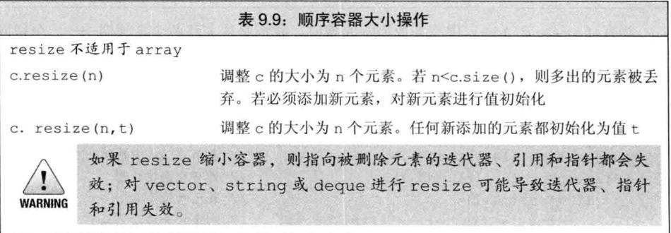
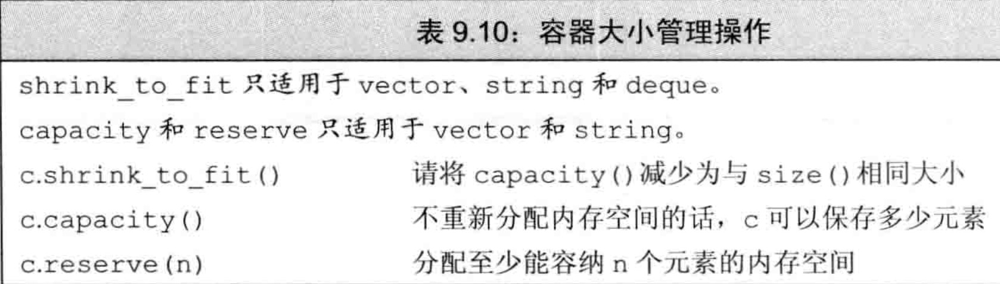
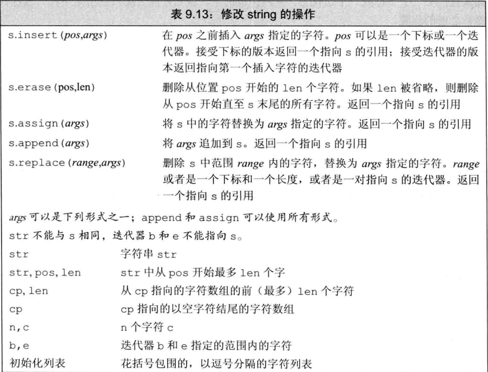
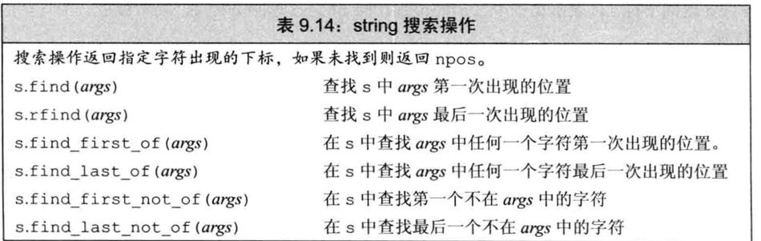
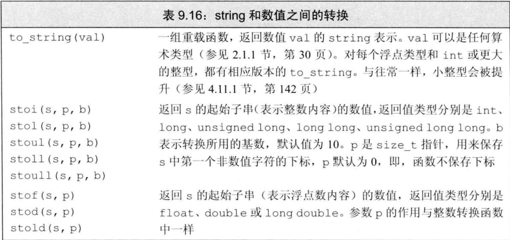
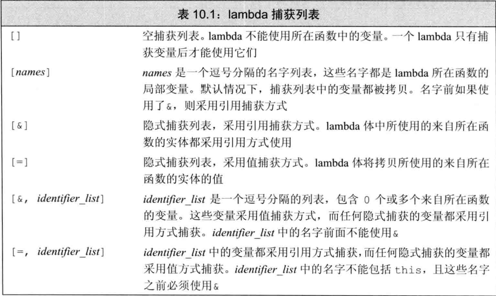

# 概述


# vector

初始化

```
vector<int> v1 (10) ;	// v1有10个元素，每个的值都是0
vector<int> v2{10} ;	// v2有1个元素，该元素的值是10
vector<int> v3(10，1) ;	// v3有10个元素，每个的值都是1
vector<int> v4{10，1};	//v4有2个元素，值分别是10和1
```

>   开始的时候创建空的vector对象，在运行时再动态添加元素，这一做法与C语言及其他大多数语言中内置数组类型的用法不同。
>
>   特别是如果用惯了C或者Java，可以预计在创建vector对象时顺便指定其容量是最好的。然而事实上，通常的情况是恰恰相反。

## 改变容器大小



## 管理容量的成员函数



reserve并不改变容器中元素的数量，它仅影响vector预先分配多大的内存空间。

只有当需要的内存空间超过当前容量时，reserve调用才会改变vector的容量。如果需求大小大于当前容量，reserve至少分配与需求一样大的内存空间（可能更大）。

如果需求大小小于或等于当前容量，reserve什么也不做。特别是，当需求大小小于当前容量时，容器不会退回内存空间。因此，在调用reserve之后，capacity将会大于或等于传递给reserve的参数。

这样，调用reserve永远也不会减少容器占用的内存空间。类似的，resize成员函数只改变容器中元素的数目，而不是容器的容量。我们同样不能使用resize来减少容器预留的内存空间。

在新标准库中，我们可以调用shrink_to_fit来要求deque，vector或string退回不需要的内存空间。此函数指出我们不再需要任何多余的内存空间。但是，具体的实现可以选择忽略此请求。也就是说，调用shrink_to_fit也并不保证一定退回内存空间。

## reserve和resize的区别

resize：如果容量增大，capacity和size都会跟着增大。resize是添加元素。如果容量减少，capacity不会变化，size会减少。

reserve：如果容量增大，capacity会增大，size不变，reserve不会添加元素。如果容量减少，都不会发生变化。

```cpp
void testVectorResizeAndReserve() {
  {
    std::vector<int> v;
    v.resize(10, 1);
    NDK_LOG("resize: capacity=%d size=%d", v.capacity(), v.size());
    // 容量减小
    v.resize(5, 2);
    NDK_LOG("resize: capacity=%d size=%d", v.capacity(), v.size());
  }
  {
    std::vector<int> v;
    v.reserve(10);
    NDK_LOG("reserve: capacity=%d size=%d", v.capacity(), v.size());
    // 容量减小
    v.reserve(5);
    NDK_LOG("reserve: capacity=%d size=%d", v.capacity(), v.size());
  }
}
```

```
resize: capacity=10 size=10
resize: capacity=10 size=5
reserve: capacity=10 size=0
reserve: capacity=10 size=0
```


# 迭代器

和指针不一样的是， 获取迭代器不是使用取地址符，有迭代器的类型同时拥有返回迭代器的成员。比如，这些类型都拥有名为begin和end的成员。

编译器决定b和e的类型。一般来说，我们不清楚(不在意)迭代器准确的类型到底是什么。

# swap操作

除array外，swap不对任何元素进行拷贝、删除或插入操作，因此可以保证在**常数时间**内完成。

元素不会被移动的事实意味着，除string外，指向容器的迭代器、引用和指针在swap操作之后都不会失效。它们仍指向swap操作之前所指向的那些元素。但是，在swap之后，这些元素已经属于不同的容器了。
例如，假定iter在swap之前指向svec1[3]的string，那么在swap之后它指向svec2[3]的元素。

与其他容器不同，对一个string调用swap会导致迭代器、引用和指针失效。

与其他容器不同，swap两个array会真正交换它们的元素。因此，交换两个array所需的时间与array中元素的数目成正比。

# 顺序容器操作

## 访问元素


### 访问成员函数返回的是引用

在容器中访问元素的成员函数（即，front、back、下标和at）返回的都是引用。如果容器是一个const对象，则返回值是const的引用。如果容器不是const的，则返回值是普通引用，我们可以用来改变元素的值：


如果我们使用auto变量来保存这些函数的返回值，并且希望使用此变量来改变元素的值，必须记得将变量定义为引用类型。

### 下标操作和安全的随机访问

如果我们希望确保下标是合法的，可以使用at成员函数。

## 删除元素


## 容器操作可能使迭代器失效

向容器中添加元素和从容器中删除元素的操作可能会使指向容器元素的指针、引用或迭代器失效。一个失效的指针、引用或迭代器将不再表示任何元素。使用失效的指针、引用或迭代器是一种严重的程序设计错误，很可能引起与使用未初始化指针一样的问题

在向容器添加元素后：

-   如果容器是vector或string，且存储空间被重新分配，则指向容器的迭代器、指针和引用都会失效。如果存储空间未重新分配，指向插入位置之前的元素的迭代器､指针和引用仍有效，但指向插入位置之后元素的迭代器、指针和引用将会失效。
-   对于deque，插入到除首尾位置之外的任何位置都会导致迭代器、指针和引用失效。如果在首尾位置添加元素，迭代器会失效，但指向存在的元素的引用和指针不会失效。
-   对于list和forward_list，指向容器的迭代器（包括尾后迭代器和首前迭代器）、指针和引用仍有效。

当我们从一个容器中删除元素后，指向被删除元素的迭代器、指针和引用会失效，这应该不会令人惊讶。毕竟，这些元素都已经被销毁了。当我们删除一个元素后：

-   对于list和forward_list，指向容器其他位置的迭代器（包括尾后迭代器和首前迭代器）、引用和指针仍有效。
-   对于deque，如果在首尾之外的任何位置删除元素，那么指向被删除元素外其他元素的迭代器、引用或指针也会失效。如果是删除deque的尾元素，则尾后迭代器也会失效，但其他迭代器、引用和指针不受影响；如果是删除首元素，这些也不会受影响。
-   对于vector和string，指向被删元素之前元素的迭代器、引用和指针仍有效。注意：当我们删除元素时，尾后迭代器总是会失效。使用失效的迭代器、指针或引用是严重的运行时错误。

# 字符串

## 修改操作



## 搜索操作



## 数值转换



# 泛型算法

## 概述

用户可能还希望做其他很多有用的操作：查找特定元素、替换或删除一个特定值、重排元素顺序等。

标准库并未给每个容器都定义成员函数来实现这些操作，而是定义了一组泛型算法，大多数算法都定义在头文件algorithm中。

## 初识泛型算法

### 写容器元素的算法

#### 算法不检查写操作

可以用fill_n将一个新值赋予vector中的元素：

```cpp
vector<int> vec;	// 空vector
// 使用vec，赋予它不同值
fill_n(vec.begin(), vec.size(), 0);	// 将所有元素重置为0
```

函数fill_n假定写入指定个元素是安全的。即，如下形式的调用

```
fill_n(dest, n, val);
```

fill_n假定dest指向一个元素，而从dest开始的序列至少包含n个元素。

一个初学者非常容易犯的错误是在一个空容器上调用fill_n（或类似的写元素的算法）。

#### 介绍back_inserter

一种保证算法有足够元素空间来容纳输出数据的方法是使用插入迭代器（insert iterator）。插入迭代器是一种向容器中添加元素的迭代器。通常情况，当我们通过一个迭代器向容器元素赋值时，值被赋予迭代器指向的元素。而当我们通过一个插入迭代器赋值时，一个与赋值号右侧值相等的元素被添加到容器中。为了展示如何用算法向容器写入数据，我们现在将使用back_inserter，它是定义在头文件iterator
中的一个函数。

```cpp
{
  // 引入头文件#include "iterator"
  std::vector<string> vec;    // 空vector
  fill_n(std::back_inserter(vec), 5, "1");    // 将所有元素重置为0

  string log;
  // #include "numeric"
  // // 初始值不能写""，因为这是const char *，const char *不支持+法
  log = std::accumulate(vec.cbegin(), vec.cend(), log);
  NDK_LOG("log=%s", log.data());
}
```

## 定制操作

### lambda捕获和返回

#### 隐式捕获

除了显式列出我们希望使用的来自所在函数的变量之外，还可以让编译器根据lambda体中的代码来推断我们要使用哪些变量。为了指示编译器推断捕获列表，应在捕获列表中写一个&或=。&告诉编译器采用捕获引用方式，=则表示采用值捕获方式。

```cpp
void testLambda() {
  int val = 123;
  NDK_LOG("val p=%p", &val);
  auto lambda1 = [=]() {
    NDK_LOG("lambda1 p=%p", &val);
  };
  lambda1();
  auto lambda2 = [&]() {
    NDK_LOG("lambda2 p=%p", &val);
  };
  lambda2();
}
```

```
val p=0x7ff7b463b63c
lambda1 p=0x7ff7b463b638
lambda2 p=0x7ff7b463b63c
```

lambda捕获列表



#### 可变lambda

默认情况下，对于一个值被拷贝的变量，lambda不会改变其值。如果我们希望能改变一个被捕获的变量的值，就必须在参数列表首加上关键字mutable。

```cpp
  {
    int val = 123;
    // 编译错误
//    auto lambda1 = [val]() {
//      return ++val;
//    };

    auto lambda2 = [val]() mutable {
      return ++val;
    };
    int v = lambda2();
    NDK_LOG("lambda2 v=%d", v);
  }
```

#### 指定lambda返回类型

当我们需要为一个lambda定义返回类型时，必须使用尾置返回类型

```cpp
{
  auto abs = [](int i) -> int {
    if (i < 0) return -i; else return i;
  };
  int val = abs(-100);
}
```

# 1

到目前为止，我们所编写的lambda都只包含单一的return语句。因此，我们还未
遇到必须指定返回类型的情况。默认情况下，如果一个lambda体包含return之外的任
何语句，则编译器假定此lambda返回void。与其他返回void的函数类似，被推断返回
void的lambda不能返回值。
下面给出了一个简单的例子，我们可以使用标准库transform算法和一个lambda
来将一个序列中的每个负数替换为其绝对值：
transform（vi。begin（），vi。end（），vi。begin（），
[]（inti）{returni<0?-i：i；}）；
函数transform接受三个迭代器和一个可调用对象。前两个迭代器表示输入序列，第三
个迭代器表示目的位置。算法对输入序列中每个元素调用可调用对象，并将结果写到目的
位置。如本例所示，目的位置迭代器与表示输入序列开始位置的迭代器可以是相同的。当
输入迭代器和目的迭代器相同时，transform将输入序列中每个元素替换为可调用对象
操作该元素得到的结果。
在本例中，我们传递给transform一个lambda，它返回其参数的绝对值。lambda
体是单一的return语句，返回一个条件表达式的结果。我们无须指定返回类型，因为可
以根据条件运算符的类型推断出来。
但是，如果我们将程序改写为看起来是等价的if语句，就会产生编译错误：
//错误：不能推断lambda的返回类型
transform（vi。begin（），vi。end（），vi。begin（），
[]（inti）{if（i<0）return-i；elsereturni；}）；
编译器推断这个版本的lambda返回类型为void，但它返回了一个int值。
（参见6。3。3节，
第206页）：
transform（vi。begin（），vi。end（），vi。begin（），
[]（inti）->int
{if（i<0）return-i；elsereturni；}）；
在此例中，传递给transform的第四个参数是一个lambda，它的捕获列表是空的，接受
单一int参数，返回一个int值。它的函数体是一个返回其参数的绝对值的if语句。
353
396
C++
11

Page380
354
397
398
第10章泛型算法
10。3。3节练习
练习10。20：标准库定义了一个名为count_if的算法。类似find_if，此函数接受
一对迭代器，表示一个输入范围，还接受一个谓词，会对输入范围中每个元素执行。
count_if返回一个计数值，表示谓词有多少次为真。使用count_if重写我们程序中
统计有多少单词长度超过6的部分。
练习10。21：编写一个lambda，捕获一个局部int变量，并递减变量值，直至它变为0。
一旦变量变为0，再调用lambda应该不再递减变量。lambda应该返回一个bool值，指
出捕获的变量是否为0。
10。3。4参数绑定
对于那种只在一两个地方使用的简单操作，lambda表达式是最有用的。如果我们需要
在很多地方使用相同的操作，通常应该定义一个函数，而不是多次编写相同的lambda表
达式。类似的，如果一个操作需要很多语句才能完成，通常使用函数更好。
如果lambda的捕获列表为空，通常可以用函数来代替它。如前面章节所示，既可以
用一个lambda，也可以用函数isShorter来实现将vector中的单词按长度排序。类似
的，对于打印vector內容的lambda，编写一个函数来替换它也是很容易的事情，这个函
数只需接受一个string并在标准输出上打印它即可。
但是，对于捕获局部变量的lambda，用函数来替换它就不是那么容易了。例如，我们
用在find_if调用中的lambda比较一个string和一个给定大小。我们可以很容易地编
写一个完成同样工作的函数：
boolcheck_size（conststring&s，string：：size_typesz）
{
returns。size（）>=sz；
}
但是，我们不能用这个函数作为find_if的一个参数。如前文所示，find_if接受一个
一元谓词，因此传递给find_if的可调用对象必须接受单一参数。biggies传递给
find_if的lambda使用捕获列表来保存sz。为了用check_size来代替此lambda，必
须解决如何向sz形参传递一个参数的问题。
标准库bind函数
我们可以解决向check_size传递一个长度参数的问题，方法是使用一个新的名为
C++bind的标准库函数，它定义在头文件functional中。可以将bind函数看作一个通用
的函数适配器（参见9。6节，第329页），它接受一个可调用对象，生成一个新的可调用对
象来“适应”原对象的参数列表。
调用bind的一般形式为：
autonewCallable=bind（callable，arg_list）；
其中，newCallable本身是一个可调用对象，arg_list是一个逗号分隔的参数列表，对应给
定的callable的参数。即，当我们调用newCallable时，newCallable会调用callable，并传
递给它arg_list中的参数。
arg_list中的参数可能包含形如_n的名字，其中n是一个整数。这些参数是“占位符”，

Page381
10。3定制操作
表示newCallable的参数，它们占据了传递给newCallable的参数的“位置”。数值n表示
生成的可调用对象中参数的位置：1为newCallable的第一个参数，2为第二个参数，依
此类推。
绑定check_size的sz参数
作为一个简单的例子，我们将使用bind生成一个调用check_size的对象，如下
所示，它用一个定值作为其大小参数来调用check_size：
//check6是一个可调用对象，接受一个string类型的参数
//并用此string和值6来调用check_size
autocheck6=bind（check_size，_1，6）；
此bind调用只有一个占位符，表示check6只接受单一参数。占位符出现在arg_list的
第一个位置，表示check6的此参数对应check_size的第一个参数。此参数是一个
conststring&。因此，调用check6必须传递给它一个string类型的参数，check6
会将此参数传递给check_size。
strings="hello"；
boolb1=check6（s）；//check6（s）会调用check_size（s，6）
使用bind，我们可以将原来基于lambda的find_if调用：
autowc=find_if（words。begin（），words。end（），
[sz]（conststring&a）
替换为如下使用check_size的版本：
autowc=find_if（words。begin（），words。end（），
bind（check_size，1，sz））；
此bind调用生成一个可调用对象，将check_size的第二个参数绑定到sz的值。当
find_if对words中的string调用这个对象时，这些对象会调用check_size，将给
定的string和sz传递给它。因此，find_if可以有效地对输入序列中每个string
调用check_size，实现string的大小与sz的比较。
使用placeholders名字
名字_n都定义在一个名为placeholders的命名空间中，而这个命名空间本身定义
在std命名空间（参见3。1节，第74页）中。为了使用这些名字，两个命名空间都要写
上。与我们的其他例子类似，对bind的调用代码假定之前已经恰当地使用了using声
明。例如，1对应的using声明为：
usingstd：：placeholders：：_1；
此声明说明我们要使用的名字_1定义在命名空间placeholders中，而此命名空间又定
义在命名空间std中。
对每个占位符名字，我们都必须提供一个单独的using声明。编写这样的声明很烦
人，也很容易出错。可以使用另外一种不同形式的using语句（详细内容将在18。2。2节
（第702页）中介绍），而不是分别声明每个占位符，如下所示：
usingnamespacenamespace_name；
这种形式说明希望所有来自namespace_name的名字都可以在我们的程序中直接使用。例
如：
355
399

Page382
356
400
usingnamespacestd：：placeholders；
使得由placeholders定义的所有名字都可用。与bind函数一样，placeholders命
名空间也定义在functional头文件中。
bind的参数
如前文所述，我们可以用bind修正参数的值。更一般的，可以用bind绑定给定可
调用对象中的参数或重新安排其顺序。例如，假定f是一个可调用对象，它有5个参数，
则下面对bind的调用：
//g是一个有两个参数的可调用对象
autog=bind（f，a，b，_2，c，1）；
第10章泛型算法
生成一个新的可调用对象，它有两个参数，分别用占位符_2和_1表示。这个新的可调用
对象将它自己的参数作为第三个和第五个参数传递给f。f的第一个、第二个和第四个参
数分别被绑定到给定的值a、b和c上。
传递给g的参数按位置绑定到占位符。即，第一个参数绑定到_1，第二个参数绑定到
_2。因此，当我们调用g时，其第一个参数将被传递给f作为最后一个参数，第二个参
数将被传递给f作为第三个参数。实际上，这个bind调用会将
g（_1，_2）
映射为
f（a，b，_2，c，1）
即，对g的调用会调用f，用g的参数代替占位符，再加上绑定的参数a、b和c。例如，
调用g（X，Y）会调用
f（a，b，Y，c，X）
用bind重排参数顺序
下面是用bind重排参数顺序的一个具体例子，我们可以用bind颠倒isShroter
的含义：
//按单词长度由短至长排序
sort（words。begin（），words。end（），isShorter）；
//按单词长度由长至短排序
sort（words。begin（），words。end（），bind（isShorter，2，1））；
在第一个调用中，当sort需要比较两个元素A和B时，它会调用isShorter（A，B）。
在第二个对sort的调用中，传递给isShorter的参数被交换过来了。因此，当sort
比较两个元素时，就好像调用isShorter（B，A）一样。
绑定引用参数
默认情况下，bind的那些不是占位符的参数被拷贝到bind返回的可调用对象中。
但是，与lambda类似，有时对有些绑定的参数我们希望以引用方式传递，或是要绑定参
数的类型无法拷贝。
例如，为了替换一个引用方式捕获ostream的lambda：
//os是一个局部变量，引用一个输出流
//c是一个局部变量，类型为char
for_each（words。begin（），words。end（），

Page383
10。4再探迭代器
[&os，c]（conststring&s）{OS<<s<<c；}）；
可以很容易地编写一个函数，完成相同的工作：
ostream&print（ostream&os，conststring&s，charc）
{
returnos<<s<<c；
}
但是，不能直接用bind来代替对os的捕获：
//错误：不能拷贝os
for_each（words。begin（），words。end（），bind（print，os，_1，'））；
原因在于bind拷贝其参数，而我们不能拷贝一个ostream。如果我们希望传递给bind
一个对象而又不拷贝它，就必须使用标准库ref函数：
for_each（words。begin（），words。end（），
bind（print，ref（os），_1，'））；
函数ref返回一个对象，包含给定的引用，此对象是可以拷贝的。标准库中还有一个cref
函数，生成一个保存const引用的类。与bind一样，函数ref和cref也定义在头文
件functional中。
向后兼容：参数绑定
旧版本C++提供的绑定函数参数的语言特性限制更多，也更复杂。标准库定义了两个分
别名为bindlst和bind2nd的函数。类似bind，这两个函数接受一个函数作为参数，
生成一个新的可调用对象，该对象调用给定函数，并将绑定的参数传递给它。但是，这
些函数分别只能绑定第一个或第二个参数。由于这些函数局限太强，在新标准中已被弃
用（deprecated）。所谓被弃用的特性就是在新版本中不再支持的特性。新的C++程序应
该使用bind。
10。3。4节练习
练习10。22：重写统计长度小于等于6的单词数量的程序，使用函数代替lambda。
练习10。23：bind接受几个参数?
练习10。24：给定一个string，使用bind和check_size在一个int的vector
中查找第一个大于string长度的值。
练习10。25：在10。3。2节（第349页）的练习中，编写了一个使用partition的biggies
版本。使用checksize和bind重写此函数。
10。4再探迭代器
除了为每个容器定义的迭代器之外，标准库在头文件iterator中还定义了额外几
种迭代器。这些迭代器包括以下几种。
•插入迭代器（insertiterator）：这些迭代器被绑定到一个容器上，可用来向容器插入
元素。
•流迭代器（streamiterator）：这些迭代器被绑定到输入或输出流上，可用来遍历所
357
401

Page384
358
402
关联的IO流。
‧反向迭代器（reverseiterator）：这些迭代器向后而不是向前移动。除了
forward_list之外的标准库容器都有反向迭代器。
●移动迭代器（moveiterator）：这些专用的迭代器不是拷贝其中的元素，而是移动它
们。我们将在13。6。2节（第480页）介绍移动迭代器。
10。4。1插入迭代器
插入器是一种迭代器适配器（参见9。6节，第329页），它接受一个容器，生成一个迭
代器，能实现向给定容器添加元素。当我们通过一个插入迭代器进行赋值时，该迭代器调
用容器操作来向给定容器的指定位置插入一个元素。表10。2列出了这种迭代器支持的操作。
it=t
*it，++it，it++
命。
第10章泛型算法
插入器有三种类型，差异在于元素插入的位置：
•back_inserter（参见10。2。2节，第341页）创建一个使用push_back的迭代
表10。2：插入迭代器操作
在it指定的当前位置插入值t。假定c是it绑定的容器，依赖于插
入迭代器的不同种类，此赋值会分别调用c。push_back（t）、
c。push_front（t）或c。insert（t，p），其中p为传递给inserter
的迭代器位置
这些操作虽然存在，但不会对it做任何事情。每个操作都返回it
Note
•front_inserter创建一个使用push_front的迭代器。
•inserter创建一个使用insert的迭代器。此函数接受第二个参数，这个参数必
须是一个指向给定容器的迭代器。元素将被插入到给定迭代器所表示的元素之前。
只有在容器支持push_front的情况下，我们才可以使用front_inserter。
类似的，只有在容器支持push_back的情况下，我们才能使用
back_inserter。
理解插入器的工作过程是很重要的：当调用inserter（c，iter）时，我们得到一个
迭代器，接下来使用它时，会将元素插入到iter原来所指向的元素之前的位置。即，如
果it是由inserter生成的迭代器，则下面这样的赋值语句
*it=val；
其效果与下面代码一样
it=c。insert（it，val）；//it指向新加入的元素
++it；//递增it使它指向原来的元素
front_inserter生成的迭代器的行为与inserter生成的迭代器完全不一样。当
我们使用front_inserter时，元素总是插入到容器第一个元素之前。即使我们传递给
inserter的位置原来指向第一个元素，只要我们在此元素之前插入一个新元素，此元素
就不再是容器的首元素了：
list<int>1st={1，2，3，4}；
list<int>lst2，1st3；//空list

Page385
10。4再探迭代器
//拷贝完成之后，1st2包含4321
copy（lst。cbegin（），1st。cend（），front_inserter（1st2））；
//拷贝完成之后，1st3包含1234
copy（1st。cbegin（），1st。cend（），inserter（1st3，1st3。begin（）））；
当调用front_inserter（c）时，我们得到一个插入迭代器，接下来会调用
push_front。当每个元素被插入到容器c中时，它变为c的新的首元素。因此，
frontinserter生成的迭代器会将插入的元素序列的顺序颠倒过来，而inserter和
backinserter则不会。
10。4。1节练习
练习10。26：解释三种插入迭代器的不同之处。
练习10。27：除了unique（参见10。2。3节，第343页）之外，标准库还定义了名为
unique_copy的函数，它接受第三个迭代器，表示拷贝不重复元素的目的位置。编写
一个程序，使用unique_copy将一个vector中不重复的元素拷贝到一个初始为空的
list中。
练习10。28：个vector中保存1到9，将其拷贝到三个其他容器中。分别使用
inserter、back_inserter和front_inserter将元素添加到三个容器中。对每
种inserter，估计输出序列是怎样的，运行程序验证你的估计是否正确。
10。4。2iostream迭代器
虽然iostream类型不是容器，但标准库定义了可以用于这些IO类型对象的迭代器
（参见8。1节，第278页）。istream_iterator（参见表10。3）读取输入流，
ostream_iterator（参见表10。4节，第361页）向一个输出流写数据。这些迭代器将
它们对应的流当作一个特定类型的元素序列来处理。通过使用流迭代器，我们可以用泛型
算法从流对象读取数据以及向其写入数据。
istream_iterator1
当创建一个流迭代器时，必须指定迭代器将要读写的对象类型。一个
istream_iterator使用>>来读取流。因此，istream_iterator要读取的类型必须
定义了输入运算符。当创建一个istream_iterator时，我们可以将它绑定到一个流。
当然，我们还可以默认初始化迭代器，这样就创建了一个可以当作尾后值使用的迭代器。
istream_iterator<int>int_it（cin）；//从cin读取int
istream_iterator<int>int_eof；
//尾后迭代器
ifstreamin（"afile"）；
istream_iterator<string>str_it（in）；//从"afile"读取字符串
下面是一个用istream_iterator从标准输入读取数据，存入一个vector的例子：
istream_iterator<int>in_iter（cin）；//从cin读取int
//istream尾后迭代器
//当有数据可供读取时
istreamiterator<int>eof；
while（initer!=eof）
//后置递增运算读取流，返回迭代器的旧值
//解引用迭代器，获得从流读取的前一个值
vec。push_back（*in_iter++）；
359
403

Page386
360
404
405
此循环从cin读取int值，保存在vec中。在每个循环步中，循环体代码检查in_iter
是否等于eof。eof被定义为空的istream_iterator，从而可以当作尾后迭代器來使
用。对于一个绑定到流的迭代器，一旦其关联的流遇到文件尾或遇到IO错误，迭代器的
值就与尾后迭代器相等。
此程序最困难的部分是传递给push_back的参数，其中用到了解引用运算符和后置
递增运算符。该表达式的计算过程与我们之前写过的其他结合解引用和后置递增运算的表
达式一样（参见4。5节，第131页）。后置递增运算会从流中读取下一个值，向前推进，但
返回的是迭代器的旧值。迭代器的旧值包含了从流中读取的前一个值，对迭代器进行解引
用就能获得此值。
我们可以将程序重写为如下形式，这体现了istream_iterator更有用的地方：
istream_iterator<int>in_iter（cin），eof；//从cin读取int
vector<int>vec（in_iter，eof）；//从迭代器范围构造vec
本例中我们用一对表示元素范围的迭代器来构造vec。这两个迭代器是
istream_iterator，这意味着元素范围是通过从关联的流中读取数据获得的。这个构
造函数从cin中读取数据，直至遇到文件尾或者遇到一个不是int的数据为止。从流中
读取的数据被用来构造vec。
第10章泛型算法
istreamiterator<T>in（is）；
istreamiterator<T>end；
in1==in2
inl!=in2
*in
表10。3：istream_iterator操作
in->mem
++in，in++
in从输入流is读取类型为T的值
读取类型为T的值的istreamiterator迭代器，
表示尾后位置
in和in2必须读取相同类型。如果它们都是尾后迭代器，或绑定到相同
的输入，则两者相等
返回从流中读取的值
与（*in）。mem的含义相同
使用元素类型所定义的>>运算符从输入流中读取下一个值。与以往一样，
前置版本返回一个指向递增后迭代器的引用，后置版本返回旧值
使用算法操作流迭代器
由于算法使用迭代器操作来处理数据，而流迭代器又至少支持某些迭代器操作，因此
我们至少可以用某些算法来操作流迭代器。我们在10。5。1节（第365页）会看到如何分辨
哪些算法可以用于流迭代器。下面是一个例子，我们可以用一对istream_iterator来
调用accumulate：
istreamiterator<int>in（cin），eof；
cout<<accumulate（in，eof，0）<<endl；
此调用会计算出从标准输入读取的值的和。如果输入为：
23109458963412903423562388923
则输出为664。
istream_iterator允许使用懒惰求值
当我们将一个istream_iterator绑定到一个流时，标准库并不保证迭代器立即从
流读取数据。具体实现可以推迟从流中读取数据，直到我们使用迭代器时才真正读取。标

Page387
10。4再探迭代器
准库中的实现所保证的是，在我们第一次解引用迭代器之前，从流中读取数据的操作已经
完成了。对于大多数程序来说，立即读取还是推迟读取没什么差别。但是，如果我们创建
了一个istream_iterator，没有使用就销毁了，或者我们正在从两个不同的对象同步
读取同一个流，那么何时读取可能就很重要了。
ostream_iterator1
我们可以对任何具有输出运算符（<<运算符）的类型定义ostream_iterator。当
创建一个ostream_iterator时，我们可以提供（可选的）第二参数，它是一个字符串，
在输出每个元素后都会打印此字符串。此字符串必须是一个C风格字符串（即，一个字符
串字面常量或者一个指向以空字符结尾的字符数组的指针）。必须将ostream_iterator
绑定到一个指定的流，不允许空的或表示尾后位置的ostream_iterator。
ostreamiterator<T>out（os）；
ostream_iterator<T>out（os，d）；
out=val
*out，++out，out++
表10。4：ostream_iterator操作
out将类型为T的值写到输出流os中
out将类型为T的值写到输出流os中，每个值
后面都输出一个dd指向一个空字符结尾的字
符数组
用<<运算符将val写入到out所绑定的ostream中。val的类
型必须与out可写的类型兼容
这些运算符是存在的，但不对out做任何事情。每个运算符都返回
out
我们可以用ostream_iterator来输出值的序列：
ostream_iterator<int>out_iter（cout，
for（autoe：vec）
*out_iter++=e；//赋值语句实际上将元素写到cout
cout<<endl；
for（autoe：vec）
"）；
此程序将vec中的每个元素写到cout，每个元素后加一个空格。每次向out_iter赋值
时，写操作就会被提交。
值得注意的是，当我们向out_iter赋值时，可以忽略解引用和递增运算。即，循环
可以重写成下面的样子：
out_iter=e；//赋值语句将元素写到cout
361
cout<<endl；
运算符*和++实际上对ostream_iterator对象不做任何事情，因此忽略它们对我们的
程序没有任何影响。但是，推荐第一种形式。在这种写法中，流迭代器的使用与其他迭代
器的使用保持一致。如果想将此循环改为操作其他迭代器类型，修改起来非常容易。而且，406
对于读者来说，此循环的行为也更为清晰。
可以通过调用copy来打印vec中的元素，这比编写循环更为简单：
copy（vec。begin（），vec。end（），out_iter）；
cout<<endl；

Page388
362
407
使用流迭代器处理类类型
我们可以为任何定义了输入运算符（>>）的类型创建istream_iterator对象。类
似的，只要类型有输出运算符（<<），我们就可以为其定义ostream_iterator。由于
Sales_item既有输入运算符也有输出运算符，因此可以使用IO迭代器重写1。6节（第
21页）中的书店程序：
istreamiterator<Salesitem>item_iter（cin），eof；
ostream_iterator<Sales_item>out_iter（cout，"\n"）；
//将第一笔交易记录存在sum中，并读取下一条记录
Sales_itemsum=*item_iter++；
while（itemiter!=eof）{
//如果当前交易记录（存在itemiter中）有着相同的ISBN号
if（itemiter->isbn（）
else{
}
sum+=*itemiter++；
outiter=sum；

sum=
==

*item_iter++；
}
outiter=sum；
sum。isbn（））
第10章泛型算法
//将其加到sum上并读取下一条记录
//输出sum当前值
//读取下一条记录
//记得打印最后一组记录的和
此程序使用
it从cin读取。
es_item交易记录，并将和写入cout，每个结
果后面都跟一个换行符。定义了自己的迭代器后，我们就可以用item_iter读取第一条
交易记录，用它的值来初始化s
sum：
//将第一条交易记录保存在sum中，并读取下一条记录
Sales_itemsum=*item_itex++；
此处，我们对item_iter执行后置递增操作，对结果进行解引用操作。这个表达式读取
下一条交易记录，并用之前保存在item_iter中的值来初始化sum。
while循环会反复执行，直至在cin上遇到文件尾为止。在while循环体中，我们
检查sum与刚刚读入的记录是否对应同一本书。如果两者的ISBN不同，我们将sum赋
予out_iter，这将会打印sum的当前值，并接着打印一个换行符。在打印了前一本书的
交易金额之和后，我们将最近读的交易记副本赋予sum，并递增迭代器，这将读取
下一条交易记录。循环会这样持续下去，直至遇到错误或文件尾。在退出之前，记住要打
印输入中最后一本书的交易金额之和。
10。4。2节练习
练习10。29：编写程序，使用流迭代器读取一个文本文件，存入一个vector中的string
里。
练习10。30：使用流迭代器、sort和copy从标准输入读取一个整数序列，将其排序，
并将结果写到标准输出。
练习10。31：修改前一题的程序，使其只打印不重复的元素。你的程序应使用
unique_copy（参见10。4。1节，第359页）。
练习10。32：重写1。6节（第21页）中的书店程序，使用一个vector保存交易记录，
使用不同算法完成处理。使用sort和10。3。1节（第345页）中的compareIsbn函数
来排序交易记录，然后使用find和accumulate求和。

Page389
10。4再探迭代器
练习10。33：编写程序，接受三个参数：一个输入文件和两个输出文件的文件名。输入
文件保存的应该是整数。使用istream_iterator读取输入文件。使用
ostream_iterator将奇数写入第一个输出文件，每个值之后都跟一个空格。将偶数
写入第二个输出文件，每个值都独占一行。
10。4。3反向迭代器
反向迭代器就是在容器中从尾元素向首元素反向移动的迭代器。对于反向迭代器，递
增（以及递减）操作的含义会颠倒过来。递增一个反向迭代器（++it）会移动到前一个
元素；递减一个迭代器（――it）会移动到下一个元素。
除了forward_list之外，其他容器都支持反向迭代器｡我们可以通过调用rbegin、
rend、crbegin和crend成员函数来获得反向迭代器。这些成员函数返回指向容器尾
元素和首元素之前一个位置的迭代器。与普通迭代器一样，反向迭代器也有const和非
const版本。
图10。1显示了一个名为vec的假设的vector上的4种迭代器：
vec。cbegin（）
vec。cend（）
↓
↓
1
vec。crend（）
vec。crbegin（）
图10。1：比较cbegin/cend和crbegin/crend
下面的循环是一个使用反向迭代器的例子，它按逆序打印vec中的元素：
vector<int>vec={0，1，2，3，4，5，6，7，8，9}；
//从尾元素到首元素的反向迭代器
for（autor_iter=vec。crbegin（）；//将riter绑定到尾元素
r_iter!=vec。crend（）；
++r_iter）
//crend指向首元素之前的位置
//实际是递减，移动到前一个元素
//#TEP9，8，7，。。。0
cout<<*riter<<endl；
虽然颠倒递增和递减运算符的含义可能看起来令人混淆，但这样做使我们可以用算法
透明地向前或向后处理容器。例如，可以通过向sort传递一对反向迭代器来将vector
整理为递减序：
sort（vec。begin（），vec。end（））；//按“正常序”排序vec
//按逆序排序：将最小元素放在vec的末尾
sort（vec。rbegin（），vec。rend（））；
反向迭代器需要递减运算符
不必惊讶，我们只能从既支持++也支持――的迭代器来定义反向迭代器。毕竟反向迭代
器的目的是在序列中反向移动。除了forward_list之外，标准容器上的其他迭代器都
既支持递增运算又支持递减运算。但是，流迭代器不支持递减运算，因为不可能在一个流
中反向移动。因此，不可能从一个forward_list或一个流迭代器创建反向迭代器。
反向迭代器和其他迭代器间的关系
假定有一个名为line的string，保存着一个逗号分隔的单词列表，我们希望打印
363
408

Page390
364
409
line中的第一个单词。使用find可以很容易地完成这一任务：
//在一个逗号分隔的列表中查找第一个元素
autocomma=find（line。cbegin（），line。cend（），'，'）；
cout<<string（line。cbegin（），comma）<<endl；
如果line中有逗号，那么comma将指向这个逗号；否则，它将等于line。cend（）。当
我们打印从line。cbegin（）到comma之间的内容时，将打印到逗号为止的字符，或者打
印整个string（如果其中不含逗号的话）。
如果希望打印最后一个单词，可以改用反向迭代器：
//在一个逗号分隔的列表中查找最后一个元素
autorcomma=find（line。crbegin（），line。crend（），
由于我们将crbegin（）和crend（）传递给find，find将从line的最后一个字符开
始向前搜索。当find完成后，如果line中有逗号，则rcomma指向最后一个逗号
即，它指向反向搜索中找到的第一个逗号。如果line中没有逗号，则rcomma指向
line。crend（）。
当我们试图打印找到的单词时，最有意思的部分就来了。看起来下面的代码是显然的
方法
//错误：将逆序输出单词的字符
cout<<string（line。crbegin（），rcomma）<<endl；
但它会生成错误的输出结果。例如，如果我们的输入是
FIRST，MIDDLE，LAST
则这条语句会打印TSAL!
图10。2说明了问题所在：我们使用的是反向迭代器，会反向处理string。因此，上
述输出语句从crbegin开始反向打印line中内容。而我们希望按正常顺序打印从
rcomma开始到line末尾间的字符。但是，我们不能直接使用rcomma。因为它是一个
反向迭代器，意味着它会反向朝着string的开始位置移动。需要做的是，将rcomma转
换回一个普通迭代器，能在line中正向移动。我们通过调用reverse_iterator的
base成员函数来完成这一转换，此成员函数会返回其对应的普通迭代器：
//正确：得到一个正向迭代器，从逗号开始读取字符直到line末尾
cout<<string（rcomma。base（），line。cend（））<<endl；
给定和之前一样的输入，这条语句会如我们的预期打印出LAST。
第10章泛型算法
cbegin（）comma
↓
↓
FIRSTMIDDLELAST
"
rcomma。base（）cend（）
，
t
rcommacrbegin（）
图10。2：反向迭代器和普通迭代器间的关系
图10。2中的对象显示了普通迭代器与反向迭代器之间的关系。例如，rcomma和
rcomma。base（）指向不同的元素，line。crbegin和line。cend（）也是如此。这些不同
保证了元素范围无论是正向处理还是反向处理都是相同的。

Page391
10。5泛型算法结构
从技术上讲，普通迭代器与反向迭代器的关系反映了左闭合区间（参见9。2。1节，第
296页）的特性。关键点在于[line。crbegin（），rcomma）和[rcomma。base（），
line。cend（））指向line中相同的元素范围。为了实现这一点，rcomma和
rcomma。base（）必须生成相邻位置而不是相同位置，crbegin（）和cend（）也是如此。
Note
反向迭代器的目的是表示元素范围，而这些范围是不对称的，这导致一个重要
的结果：当我们从一个普通迭代器初始化一个反向迭代器，或是给一个反向迭
代器赋值时，结果迭代器与原迭代器指向的并不是相同的元素。
10。4。3节练习
练习10。34：使用reverseiterator逆序打印一个vector。
练习10。35：使用普通迭代器逆序打印一个vector。
练习10。36：使用find在一个int的list中查找最后一个值为0的元素。
练习10。37：给定一个包含10个元素的vector，将位置3到7之间的元素按逆序拷
贝到一个list中。
10。5泛型算法结构
任何算法的最基本的特性是它要求其迭代器提供哪些操作。某些算法，如find，只
要求通过迭代器访问元素、递增迭代器以及比较两个迭代器是否相等这些能力。其他一些
算法，如sort，还要求读、写和随机访问元素的能力。算法所要求的迭代器操作可以分
为5个迭代器类别（iteratorcategory），如表10。5所示。每个算法都会对它的每个迭代器
参数指明须提供哪类迭代器。
输入迭代器
输出迭代器
前向迭代器
双向迭代器
随机访问迭代器
表10。5：迭代器类别
只读，不写；单遍扫描，只能递增
只写，不读；单遍扫描，只能递增
可读写；多遍扫描，只能递增
可读写；多遍扫描，可递增递减
可读写，多遍扫描，支持全部迭代器运算
第二种算法分类的方式（如我们在本章开始所做的）是按照是否读、写或是重排序列
中的元素来分类。附录A按这种分类方法列出了所有算法。
算法还共享一组参数传递规范和一组命名规范，我们在介绍迭代器类别之后将介绍这
些内容。
10。5。15类迭代器
类似容器，迭代器也定义了一组公共操作。一些操作所有迭代器都支持，另外一些只
有特定类别的迭代器才支持。例如，ostream_iterator只支持递增、解引用和赋值。
vector、string和deque的迭代器除了这些操作外，还支持递减、关系和算术运算。
迭代器是按它们所提供的操作来分类的，而这种分类形成了一种层次。除了输出迭代
365
410

Page392
366
411
器之外，一个高层类别的迭代器支持低层类别迭代器的所有操作。
C++标准指明了泛型和数值算法的每个迭代器参数的最小类别。例如，find算法在
一个序列上进行一遍扫描，对元素进行只读操作，因此至少需要输入迭代器。replace
函数需要一对迭代器，至少是前向迭代器。类似的，replace_copy的前两个迭代器参
数也要求至少是前向迭代器。其第三个迭代器表示目的位置，必须至少是输出迭代器。其
他的例子类似。对每个迭代器参数来说，其能力必须与规定的最小类别至少相当。向算法
传递一个能力更差的迭代器会产生错误。
WARNING
第10章泛型算法
对于向一个算法传递错误类别的迭代器的问题，很多编译器不会给出任何警告
或提示。
迭代器类别
输入迭代器（inputiterator）：可以读取序列中的元素。一个输入迭代器必须支持
•用于比较两个迭代器的相等和不相等运算符（==､!=）
●用于推进迭代器的前置和后置递增运算（++）
•用于读取元素的解引用运算符（*）；解引用只会出现在赋值运算符的右侧
•箭头运算符（->），等价于（*it）。member，即，解引用迭代器，并提取对象的成
员
输入迭代器只用于顺序访问。对于一个输入迭代器，*it++保证是有效的，但递增它可能
导致所有其他指向流的迭代器失效。其结果就是，不能保证输入迭代器的状态可以保存下
来并用来访问元素｡因此，输入迭代器只能用于单遍扫描算法｡算法find和accumulate
要求输入迭代器；而istream_iterator是一种输入迭代器。
输出迭代器（outputiterator）：可以看作输入迭代器功能上的补集——只写而不读元素。输
出迭代器必须支持
用于推进迭代器的前置和后置递增运算（++）
●
解引用运算符（*），只出现在赋值运算符的左侧（向一个已经解引用的输出迭代器
赋值，就是将值写入它所指向的元素）
我们只能向一个输出迭代器赋值一次。类似输入迭代器，输出迭代器只能用于单遍扫描算
法。用作目的位置的迭代器通常都是输出迭代器。例如，copy函数的第三个参数就是输
出迭代器。ostream_iterator类型也是输出迭代器。
。
前向迭代器（forwarditerator）：可以读写元素。这类迭代器只能在序列中沿一个方向移动。
前向迭代器支持所有输入和输出迭代器的操作，而且可以多次读写同一个元素。因此，我
们可以保存前向迭代器的状态，使用前向迭代器的算法可以对序列进行多遍扫描。算法
replace要求前向迭代器，forward_list上的迭代器是前向迭代器。
412双向迭代器（bidirectionaliterator）：可以正向/反向读写序列中的元素。除了支持所有前向
迭代器的操作之外，双向迭代器还支持前置和后置递减运算符（--）。算法reverse要求
双向迭代器，除了forward_list之外，其他标准库都提供符合双向迭代器要求的迭代
現
随机访问迭代器（random-accessiterator）：提供在常量时间内访问序列中任意元素的能力。
此类迭代器支持双向迭代器的所有功能，此外还支持表3。7（第99页）中的操作：

Page393
10。5泛型算法结构
●用于比较两个迭代器相对位置的关系运算符（<、<=､>和>=）
•迭代器和一个整数值的加减运算（+、+=、-和-=），计算结果是迭代器在序列中前
进（或后退）给定整数个元素后的位置
●用于两个迭代器上的减法运算符（-），得到两个迭代器的距离
•下标运算符（iter[n]），与*（iter[n]）等价
算法sort要求随机访问迭代器。array、deque、string和vector的迭代器都是随
机访问迭代器，用于访问内置数组元素的指针也是。
10。5。1节练习
练习10。38：列出5个迭代器类别，以及每类迭代器所支持的操作。
练习10。39：list上的迭代器属于哪类?vector呢?
练习10。40：你认为copy要求哪类迭代器?reverse和unique呢?
10。5。2算法形参模式
在任何其他算法分类之上，还有一组参数规范。理解这些参数规范对学习新算法很有
帮助——通过理解参数的含义，你可以将注意力集中在算法所做的操作上。大多数算法具
有如下4种形式之一：
alg（beg，end，otherargs）；
alg（beg，end，dest，otherargs）；
alg（beg，end，beg2，otherargs）；
alg（beg，end，beg2，end2，otherargs）；
-dest、
其中alg是算法的名字，beg和end表示算法所操作的输入范围。几乎所有算法都接受一
个输入范围，是否有其他参数依赖于要执行的操作。这里列出了常见的一种
beg2和end2，都是迭代器参数。顾名思义，如果用到了这些迭代器参数，它们分别承413
担指定目的位置和第二个范围的角色。除了这些迭代器参数，一些算法还接受额外的、非
迭代器的特定参数。
接受单个目标迭代器的算法
dest参数是一个表示算法可以写入的目的位置的迭代器。算法假定（assume）；按其
需要写入数据，不管写入多少个元素都是安全的。
向输出迭代器写入数据的算法都假定目标空间足够容纳写入的数据。
367
WARNING
如果dest是一个直接指向容器的迭代器，那么算法将输出数据写到容器中已存在的
元素内。更常见的情况是，dest被绑定到一个插入迭代器（参见10。4。1节，第358页）
或是一个ostream_iterator（参见10。4。2节，第359页）。插入迭代器会将新元素添加
到容器中，因而保证空间是足够的。ostream_iterator会将数据写入到一个输出流，
同样不管要写入多少个元素都没有问题。

Page394
368
414
接受第二个输入序列的算法
接受单独的beg2或是接受beg2和end2的算法用这些迭代器表示第二个输入范围。
这些算法通常使用第二个范围中的元素与第一个输入范围结合来进行一些运算。
如果一个算法接受beg2和end2，这两个迭代器表示第二个范围。这类算法接受两
个完整指定的范围：[beg，end）表示的范围和[beg2end2）表示的第二个范围。
只接受单独的beg2（不接受end2）的算法将beg2作为第二个输入范围中的首元素。
此范围的结束位置未指定，这些算法假定从beg2开始的范围与beg和end所表示的范
围至少一样大。
WARNING
第10章泛型算法
接受单独beg2的算法假定从beg2开始的序列与beg和end所表示的范围
至少一样大。
10。5。3算法命名规范
除了参数规范，算法还遵循一套命名和重载规范。这些规范处理诸如：如何提供一个
操作代替默认的<或==运算符以及算法是将输出数据写入输入序列还是一个分离的目的位
置等问题。
一些算法使用重载形式传递一个谓词
接受谓词参数来代替<或==运算符的算法，以及那些不接受额外参数的算法，通常都
是重载的函数。函数的一个版本用元素类型的运算符来比较元素；另一个版本接受一个额
外谓词参数，来代替<或==：
unique（beg，end）；
//使用运算符比较元素

unique（beg，end，comp）；//使用comp比较元素
==

两个调用都重新整理给定序列，将相邻的重复元素删除。第一个调用使用元素类型的==
运算符来检查重复元素；第二个则调用comp来确定两个元素是否相等。由于两个版本的
函数在参数个数上不相等，因此具体应该调用哪个版本不会产生歧义（参见6。4节，第208页）。
find（beg，end，val）；
find_if（beg，end，pred）；
_if版本的算法
接受一个元素值的算法通常有另一个不同名的（不是重载的）版本，该版本接受一个
谓词（参见10。3。1节，第344页）代替元素值。接受谓词参数的算法都有附加的_if前缀：
//查找输入范围中val第一次出现的位置
//查找第一个令pred为真的元素
这两个算法都在输入范围中查找特定元素第一次出现的位置｡算法find查找一个指定值；
算法find_if查找使得pred返回非零值的元素。
这两个算法提供了命名上差异的版本，而非重载版本，因为两个版本的算法都接受相
同数目的参数。因此可能产生重载歧义，虽然很罕见，但为了避免任何可能的歧义，标准
库选择提供不同名字的版本而不是重载。
区分拷贝元素的版本和不拷贝的版本
默认情况下，重排元素的算法将重排后的元素写回给定的输入序列中。这些算法还提
供另一个版本，将元素写到一个指定的输出目的位置。如我们所见，写到额外目的空间的

Page395
10。6特定容器算法
算法都在名字后面附加一个_copy（参见10。2。2节，第341页）：
reverse（beg，end）；
//反转输入范围中元素的顺序
reverse_copy（beg，end，dest）；//将元素按逆序拷贝到dest
一些算法同时提供_copy和_if版本。这些版本接受一个目的位置迭代器和一个谓词：
//从v1中删除奇数元素
remove_if（v1。begin（），vl。end（），
//将偶数元素从v1拷贝到v2；v1不变
[]（inti）{returni%2；}）；
remove_copy_if（v1。begin（），v1。end（），back_inserter（v2），
[]（inti）{returni%2；}）；
两个算法都调用了lambda（参见10。3。2节，第346页）来确定元素是否为奇数。在第一个
调用中，我们从输入序列中将奇数元素删除。在第二个调用中，我们将非奇数（亦即偶数）
元素从输入范围拷贝到v2中。
10。5。3节练习
练习10。41：仅根据算法和参数的名字，描述下面每个标准库算法执行什么操作：
replace（beg，end，old_val，new_val）；
replace_if（beg，end，pred，new_val）；
replace_copy（beg，end，dest，old_val，new_val）；
replace_copy_if（beg，end，dest，pred，new_val）；
10。6特定容器算法
与其他容器不同，链表类型list和forward_list定义了几个成员函数形式的算
法，如表10。6所示。特别是，它们定义了独有的sort、merge、remove、reverse和
unique｡通用版本的sort要求随机访问迭代器，因此不能用于list和forward_list，
因为这两个类型分别提供双向迭代器和前向迭代器。
链表类型定义的其他算法的通用版本可以用于链表，但代价太高。这些算法需要交换
输入序列中的元素。一个链表可以通过改变元素间的链接而不是真的交换它们的值来快速
“交换”元素。因此，这些链表版本的算法的性能比对应的通用版本好得多。
Best
对于list和forward_list，应该优先使用成员函数版本的算法而不是通用
Practices算法。
表10。6：list和forward_list成员函数版本的算法
这些操作都返回void
lst。merge（1st2）
1st。merge（1st2，comp）。
lst。remove（val）
lst。remove_if（pred）
lst。reverse（）
将来自1st2的元素合并入lstolst和1st2都必须是有序的。
元素将从1st2中删除。在合并之后，1st2变为空。第一个版
本使用<运算符：第二个版本使用给定的比较操作
调用erase删除掉与给定值相等（==）或令一元谓词为真的每
个元素
反转1st中元素的顺序
369
415

Page396
370
416
lst。sort（）
lst。sort（comp）
lst。unique（）
lst。unique（pred）
使用<或给定比较操作排序元素
（p，1st2，p2）
第10章泛型算法
splice成员
链表类型还定义了splice算法，其描述见表10。7。此算法是链表数据结构所特有的，
因此不需要通用版本。
lst。splice（args）或flst。splice_after（args）
（p，1st2）
（p，1st2，b，e）
调用erase删除同一个值的连续拷贝。第一个版本使用==；第
二个版本使用给定的二元谓词
表10。7：list和forward_list的splice成员函数的参数
续表
p是一个指向1st中元素的迭代器，或一个指向flst首前位
置的迭代器。函数将1st2的所有元素移动到1st中p之前的
位置或是flst中p之后的位置。将元素从1st2中删除。lst2
的类型必须与1st或flst相同，且不能是同一个链表
p2是一个指向1st2中位置的有效的迭代器。将p2指向的元
素移动到1st中，或将p2之后的元素移动到flst中。1st2
可以是与1st或flst相同的链表
b和e必须表示1st2中的合法范围。将给定范围中的元素从
1st2移动到1st或flst。lst2与1st（或flst）可以是相
同的链表，但p不能指向给定范围中元素
链表特有的操作会改变容器
多数链表特有的算法都与其通用版本很相似，但不完全相同。链表特有版本与通用版
本间的一个至关重要的区别是链表版本会改变底层的容器。例如，remove的链表版本会
删除指定的元素。unique的链表版本会删除第二个和后继的重复元素。
merge
类似的，merge和splice会销毁其参数。例如，通用版本的merge将合并的序列
写到一个给定的目的迭代器；两个输入序列是不变的。而链表版本
会销毁
给定的链表——元素从参数指定的链表中删除，被合并到调用merge的链表对象中。在
merge之后，来自两个链表中的元素仍然存在，但它们都已在同一个链表中。
10。6节练习
练习10。42：使用list代替vector重新实现10。2。3节（第343页）中的去除重复单
词的程序。

Page397
小结
小结
标准库定义了大约100个类型无关的对序列进行操作的算法。序列可以是标准库容器
类型中的元素、一个内置数组或者是（例如）通过读写一个流来生成的。算法通过在迭代
器上进行操作来实现类型无关。多数算法接受的前两个参数是一对迭代器，表示一个元素
范围。额外的迭代器参数可能包括一个表示目的位置的输出迭代器，或是表示第二个输入
范围的另一个或另一对迭代器。
根据支持的操作不同，迭代器可分为五类：输入、输出、前向、双向以及随机访问迭
代器。如果一个迭代器支持某个迭代器类别所要求的操作，则属于该类别。
如同迭代器根据操作分类一样，传递给算法的迭代器参数也按照所要求的操作进行分
类。仅读取序列的算法只要求输入迭代器操作。写入数据到目的位置迭代器的算法只要求
输出迭代器操作，依此类推。
算法从不直接改变它们所操作的序列的大小。它们会将元素从一个位置拷贝到另一个
位置，但不会直接添加或删除元素。
（371
虽然算法不能向序列添加元素，但插入迭代器可以做到。一个插入迭代器被绑定到一
个容器上。当我们将一个容器元素类型的值赋予一个插入迭代器时，迭代器会将该值添加
到容器中。
148007
容器forward_list和list对一些通用算法定义了自己特有的版本。与通用算法
不同，这些链表特有版本会修改给定的链表。
术语表
back_inserter这是一个迭代器适配器，它
接受一个指向容器的引用，生成一个插入
迭代器，该插入迭代器用push_back向
指定容器添加元素。
双向迭代器（bidirectionaliterator）支持
前向迭代器的所有操作，还具有用--在序
列中反向移动的能力。
二元谓词（binarypredicate）接受两个参
数的谓词。
bind标准库函数，将一个或多个参数绑定
到一个可调用表达式。bind定义在头文件
functional中。
可调用对象（callableobject）可以出现
在调用运算符左边的对象。函数指针、
lambda以及重载了函数调用运算符的类的
对象都是可调用对象。
捕获列表（capturelist）lambda表达式的
作
一部分，指出lambda表达式可以访问所在
上下文中哪些变量。
cref标准库函数，返回一个可拷贝的对象，
其中保存了一个指向不可拷贝类型的
const对象的引用。
前向迭代器（forwarditerator）可以读写
元素，但不必支持--的迭代器。
front_inserter迭代器适配器，给定一个容
器，生成一个用push_front向容器开始
位置添加元素的插入迭代器。
泛型算法（genericalgorithm）类型无关
的算法。
输入迭代器（inputiterator）可以读但不
能写序列中元素的迭代器。
插入迭代器（insertiterator）迭代器适配
器，生成一个迭代器，该迭代器使用容器
操作向给定容器添加元素。
417
418

Page398
372
插入器（inserter）迭代器适配器，接受
一个迭代器和一个指向容器的引用，生成
一个插入迭代器，该插入迭代器用insert
在给定迭代器指向的元素之前的位置添加
元素。
istream_iterator读取输入流的流迭代
現
命。
迭代器类别（iteratorcategory）根据所支
持的操作对迭代器进行的分类组织。迭代
器类别形成一个层次，其中更强大的类别
支持更弱类别的所有操作。算法使用迭代
器类别来指出迭代器参数必须支持哪些操
只要迭代器达到所要求的最小类别，
它就可以用于算法。例如，一些算法只要
求输入迭代器。这类算法可处理除只满足
输出迭代器要求的迭代器之外的任何迭代
器。而要求随机访问迭代器的算法只能用
于支持随机访问操作的迭代器。
lambda表达式（lambdaexpression）可
调用的代码单元。一个lambda类似一个未
命名的内联函数。一个lambda以一个捕获
列表开始，此列表允许lambda访问所在函
数中的变量。类似函数，lambda有一个（可
能为空的）参数列表、一个返回类型和一
个函数体。lambda可以忽略返回类型。如
果函数体是一个单一的return语句，返
回类型就从返回对象的类型推断。否则，
忽略的返回类型默认定为void。
第10章泛型算法
移动迭代器（moveiterator）迭代器适配
器，生成一个迭代器，该迭代器移动而不
是拷贝元素。移动迭代器将在第13章中进
行介绍。
ostream_iterator写输出流的迭代器。
输出迭代器（outputiterator）可以写元素，
但不必具有读元素能力的迭代器。
谓词（predicate）返回可以转换为bool
类型的值的函数。泛型算法通常用来检测
元素。标准库使用的谓词是一元（接受一
个参数）或二元（接受两个参数）的。
随机访问迭代器（random-accessiterator）
支持双向迭代器的所有操作再加上比较迭
代器值的关系运算符、下标运算符和迭代
器上的算术运算，因此支持随机访问元素。
ref标准库函数，从一个指向不能拷贝的类
型的对象的引用生成一个可拷贝的对象。
反向迭代器（reverseiterator）在序列中
反向移动的迭代器。这些迭代器交换了++
和——的含义。
流迭代器（streamiterator）可以绑定到
一个流的迭代器。
一元谓词（unarypredicate）接受一个参
数的谓词。
