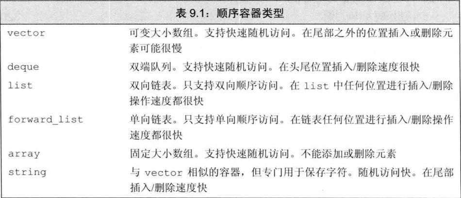
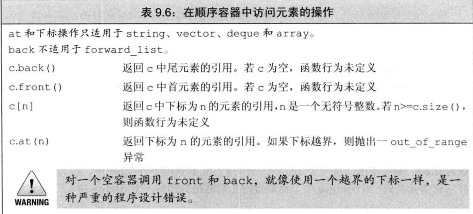
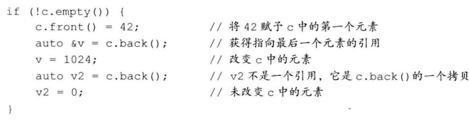
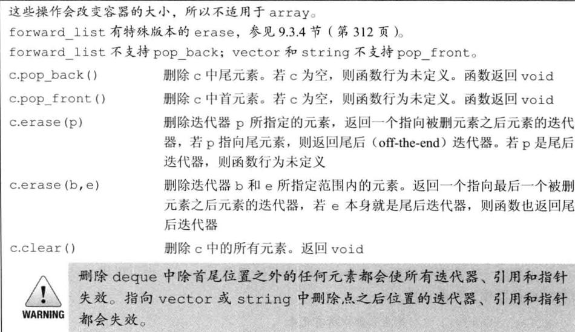

# 概述



# vector

初始化

```
vector<int> v1 (10) ;	// v1有10个元素，每个的值都是0
vector<int> v2{10} ;	// v2有1个元素，该元素的值是10
vector<int> v3(10，1) ;	// v3有10个元素，每个的值都是1
vector<int> v4{10，1};	//v4有2个元素，值分别是10和1
```

>   开始的时候创建空的vector对象，在运行时再动态添加元素，这一做法与C语言及其他大多数语言中内置数组类型的用法不同。
>
>   特别是如果用惯了C或者Java，可以预计在创建vector对象时顺便指定其容量是最好的。然而事实上，通常的情况是恰恰相反。

# 迭代器

和指针不一样的是， 获取迭代器不是使用取地址符，有迭代器的类型同时拥有返回迭代器的成员。比如，这些类型都拥有名为begin和end的成员。

编译器决定b和e的类型。一般来说，我们不清楚(不在意)迭代器准确的类型到底是什么。

# swap操作

除array外，swap不对任何元素进行拷贝、删除或插入操作，因此可以保证在**常数时间**内完成。

元素不会被移动的事实意味着，除string外，指向容器的迭代器、引用和指针在swap操作之后都不会失效。它们仍指向swap操作之前所指向的那些元素。但是，在swap之后，这些元素已经属于不同的容器了。
例如，假定iter在swap之前指向svec1[3]的string，那么在swap之后它指向svec2[3]的元素。

与其他容器不同，对一个string调用swap会导致迭代器、引用和指针失效。

与其他容器不同，swap两个array会真正交换它们的元素。因此，交换两个array所需的时间与array中元素的数目成正比。

# 顺序容器操作

## 访问元素



### 访问成员函数返回的是引用

在容器中访问元素的成员函数（即，front、back、下标和at）返回的都是引用。如果容器是一个const对象，则返回值是const的引用。如果容器不是const的，则返回值是普通引用，我们可以用来改变元素的值：



如果我们使用auto变量来保存这些函数的返回值，并且希望使用此变量来改变元素的值，必须记得将变量定义为引用类型。

### 下标操作和安全的随机访问

如果我们希望确保下标是合法的，可以使用at成员函数。

## 删除元素



## 容器操作可能使迭代器失效

向容器中添加元素和从容器中删除元素的操作可能会使指向容器元素的指针、引用或迭代器失效。一个失效的指针、引用或迭代器将不再表示任何元素。使用失效的指针、引用或迭代器是一种严重的程序设计错误，很可能引起与使用未初始化指针一样的问题

在向容器添加元素后：

-   如果容器是vector或string，且存储空间被重新分配，则指向容器的迭代器、指针和引用都会失效。如果存储空间未重新分配，指向插入位置之前的元素的迭代器､指针和引用仍有效，但指向插入位置之后元素的迭代器、指针和引用将会失效。
-   对于deque，插入到除首尾位置之外的任何位置都会导致迭代器、指针和引用失效。如果在首尾位置添加元素，迭代器会失效，但指向存在的元素的引用和指针不会失效。
-   对于list和forward_list，指向容器的迭代器（包括尾后迭代器和首前迭代器）、指针和引用仍有效。

当我们从一个容器中删除元素后，指向被删除元素的迭代器、指针和引用会失效，这应该不会令人惊讶。毕竟，这些元素都已经被销毁了。当我们删除一个元素后：

-   对于list和forward_list，指向容器其他位置的迭代器（包括尾后迭代器和首前迭代器）、引用和指针仍有效。
-   对于deque，如果在首尾之外的任何位置删除元素，那么指向被删除元素外其他元素的迭代器、引用或指针也会失效。如果是删除deque的尾元素，则尾后迭代器也会失效，但其他迭代器、引用和指针不受影响；如果是删除首元素，这些也不会受影响。
-   对于vector和string，指向被删元素之前元素的迭代器、引用和指针仍有效。注意：当我们删除元素时，尾后迭代器总是会失效。使用失效的迭代器、指针或引用是严重的运行时错误。

WARNING
建议：管理迭代器
当你使用迭代器（或指向容器元素的引用或指针）时，最小化要求迭代器必须保持有效
的程序片段是一个好的方法。
由于向迭代器添加元素和从迭代器删除元素的代码可能会使迭代器失效，因此必须
保证每次改变容器的操作之后都正确地重新定位迭代器。这个建议对vector、string
和deque尤为重要。
315
353
354

Page342
316
编写改变容器的循环程序
添加/删除vector、string或deque元素的循环程序必须考虑迭代器、引用和指
针可能失效的问题。程序必须保证每个循环步中都更新迭代器、引用或指针。如果循环中
调用的是insert或erase，那么更新迭代器很容易。这些操作都返回迭代器，我们可
以用来更新：
第9章顺序容器
//傻瓜循环，删除偶数元素，复制每个奇数元素
vector<int>vi={0，1，2，3，4，5，6，7，8，9}；
autoiter=vi。begin（）；//调用begin而不是cbegin，因为我们要改变vi
while（iter!=vi。end（））{
if（*iter%2）{
iter=vi。insert（iter，*iter）；//复制当前元素
iter+=2；//向前移动迭代器，跳过当前元素以及插入到它之前的元素
}else
iter=vi。erase（iter）；
//删除偶数元素
//不应向前移动迭代器，iter指向我们删除的元素之后的元素
}
此程序删除vector中的偶数值元素，并复制每个奇数值元素。我们在调用insert和
erase后都更新迭代器，因为两者都会使迭代器失效。
在调用erase后，不必递增迭代器，因为erase返回的迭代器已经指向序列中下一
个元素。调用insert后，需要递增迭代器两次。记住，insert在给定位置之前插入新
元素，然后返回指向新插入元素的迭代器。因此，在调用insert后，iter指向新插入
元素，位于我们正在处理的元素之前。我们将迭代器递增两次，恰好越过了新添加的元素
和正在处理的元素，指向下一个未处理的元素。
不要保存end返回的迭代器
当我们添加/删除vector或string的元素后，或在deque中首元素之外任何位置
添加/删除元素后，原来end返回的迭代器总是会失效。因此，添加或删除元素的循环程
序必须反复调用end，而不能在循环之前保存end返回的迭代器，一直当作容器末尾使
用。通常C++标准库的实现中end（）操作都很快，部分就是因为这个原因。
例如，考虑这样一个循环，它处理容器中的每个元素，在其后添加一个新元素。我们
355希望循环能跳过新添加的元素，只处理原有元素。在每步循环之后，我们将定位迭代器，
使其指向下一个原有元素。如果我们试图“优化”这个循环，在循环之前保存end（）返回
的迭代器，一直用作容器末尾，就会导致一场灾难：
//灾难：此循环的行为是未定义的
autobegin=v。begin（），
end=v。end（）；//保存尾迭代器的值是一个坏主意
while（begin!=end）{
//做一些处理
//插入新值，对begin重新赋值，否则的话它就会失效
++begin；//向前移动begin，因为我们想在此元素之后插入元素
beginv。insert（begin，42）；//插入新值
++begin；//向前移动begin跳过我们刚刚加入的元素
}
此代码的行为是未定义的。在很多标准库实现上，此代码会导致无限循环。问题在于我们
将end操作返回的迭代器保存在一个名为end的局部变量中。在循环体中，我们向容器

Page343
9。4vector对象是如何增长的
中添加了一个元素，这个操作使保存在end中的迭代器失效了。这个迭代器不再指向v
中任何元素，或是v中尾元素之后的位置。
如果在一个循环中插入/删除deque、string或vector中的元素，不要缓
存end返回的迭代器。
Tip
必须在每次插入操作后重新调用end（），而不能在循环开始前保存它返回的迭代器：
//更安全的方法：在每个循环步添加/删除元素后都重新计算end
while（begin!=v。end（））{
//做一些处理
}
++begin；//向前移动begin，因为我们想在此元素之后插入元素
begin=v。insert（begin，42）；//插入新值
++begin；//向前移动begin，跳过我们刚刚加入的元素
9。3。6节练习
练习9。31：第316页中删除偶数值元素并复制奇数值元素的程序不能用于list或
forward_list。为什么?修改程序，使之也能用于这些类型。
练习9。32：在第316页的程序中，向下面语句这样调用insert是否合法?如果不合法，
为什么?
iter=vi。insert（iter，*iter++）；
练习9。33：在本节最后一个例子中，如果不将insert的结果赋予begin，将会发生
什么?编写程序，去掉此赋值语句，验证你的答案。
练习9。34：假定vi是一个保存int的容器，其中有偶数值也有奇数值，分析下面循环
的行为，然后编写程序验证你的分析是否正确。
iter=vi。begin（）；
while（iter!=viend（））
if（*iter%2）
iter=vi。insert（iter，*iter）；
++iter；
9。4vector对象是如何增长的
为了支持快速随机访问，vector将元素连续存储——每个元素紧挨着前一个元素存
储。通常情况下，我们不必关心一个标准库类型是如何实现的，而只需关心它如何使用。
然而，对于vector和string，其部分实现渗透到了接口中。
假定容器中元素是连续存储的，且容器的大小是可变的，考虑向vector或string
中添加元素会发生什么：如果没有空间容纳新元素，容器不可能简单地将它添加到内存中
其他位置——因为元素必须连续存储。容器必须分配新的内存空间来保存已有元素和新元
素，将已有元素从旧位置移动到新空间中，然后添加新元素，释放旧存储空间。如果我们
每添加一个新元素，vector就执行一次这样的内存分配和释放操作，性能会慢到不可
接受。
为了避免这种代价，标准库实现者采用了可以减少容器空间重新分配次数的策略。
317
356

Page344
318
357
C++
11
不得不获取新的内存空间时，vector和string的实现通常会分配比新的空间需求更大
的内存空间。容器预留这些空间作为备用，可用来保存更多的新元素。这样，就不需要每
次添加新元素都重新分配容器的内存空间了。
这种分配策略比每次添加新元素时都重新分配容器内存空间的策略要高效得多。其实
际性能也表现得足够好——虽然vector在每次重新分配内存空间时都要移动所有元素，
但使用此策略后，其扩张操作通常比list和deque还要快。
管理容量的成员函数
如表9。10所示，vector和string类型提供了一些成员函数，允许我们与它的实现
中内存分配部分互动。capacity操作告诉我们容器在不扩张内存空间的情况下可以容纳
多少个元素。reserve操作允许我们通知容器它应该准备保存多少个元素。
表9。10：容器大小管理操作
shrink_to_fitRifvector，stringfdeque。
capacityreserveXifvectorfstring。
c。shrink_to_fit（）
c。capacity（）
c。reserve（n）
Note
第9章顺序容器
请将capacity（）减少为与size（）相同大小
不重新分配内存空间的话，c可以保存多少元素
分配至少能容纳n个元素的内存空间
reserve并不改变容器中元素的数量，它仅影响vector预先分配多大的內
存空间。
只有当需要的内存空间超过当前容量时，reserve调用才会改变vector的容量。
如果需求大小大于当前容量，reserve至少分配与需求一样大的内存空间（可能更大）。
如果需求大小小于或等于当前容量，reserve什么也不做。特别是，当需求大小小
于当前容量时，容器不会退回内存空间。因此，在调用reserve之后，capacity将会
大于或等于传递给reserve的参数。
这样，调用reserve永远也不会减少容器占用的内存空间。类似的，resize成员
函数（参见9。3。5节，第314页）只改变容器中元素的数目，而不是容器的容量。我们同
样不能使用resize来减少容器预留的内存空间。
在新标准库中，我们可以调用shrink_to_fit来要求deque，vector或string
退回不需要的内存空间。此函数指出我们不再需要任何多余的内存空间。但是，具体的实
现可以选择忽略此请求。也就是说，调用shrink_to_fit也并不保证一定退回内存空间。
capacitysize
理解capacity和size的区别非常重要。容器的size是指它已经保存的元素的数
目；而capacity则是在不分配新的内存空间的前提下它最多可以保存多少元素。
下面的代码展示了size和capacity之间的相互作用：
vector<int>ivec；
//size应该为0；capacity的值依赖于具体实现
cout<<"ivec：size："<<ivec。size（）
<<"capacity：<<ivec。capacity（）<<endl；
11
//向ivec添加24个元素

Page345
9。4vector对象是如何增长的
for（vector<int>：：size_typeix=0；ix!=24；++ix）
ivec。push_back（ix）；
//size应该为24；capacity应该大于等于24，具体值依赖于标准库实现
cout<<"ivec：size："<<ivec。size（）
<<"capacity："<<ivec。capacity（）<<endl
当在我们的系统上运行时，这段程序得到如下输出：
ivec：size：0capacity：0
ivec：size：24capacity：32
我们知道一个空vector的size为0，显然在我们的标准库实现中一个空vector的
capacity也为0。当向vector中添加元素时，我们知道size与添加的元素数目相等。
而capacity至少与size一样大，具体会分配多少额外空间则视标准库具体实现而定。
在我们的标准库实现中，每次添加1个元素，共添加24个元素，会使capacity变为32。
可以想象ivec的当前状态如下图所示：
012
23保留空间
1
ivec。size（）ivec。capacity（）
现在可以预分配一些额外空间：
ivec。reserve（50）；//将capacity至少设定为50，可能会更大
//size应该为24；capacity应该大于等于50，具体值依赖于标准库实现
cout<<"ivec：size：<<ivec。size（）
《
capacity：<<ivec。capacity（）<<endl；
程序的输出表明reserve严格按照我们需求的大小分配了新的空间：
ivec：size：24capacity：50
接下来可以用光这些预留空间：
//添加元素用光多余容量
while（ivec。size（）!=ivec。capacity（））
ivec。push_back（0）；
//capacity应该未改变，size和capacity不相等
cout<<"ivec：size："<<ivec。size（）
十
<<"capacity："<<ivec。capacity（）<<endl；
程序输出表明此时我们确实用光了预留空间，size和capacity相等：
ivec：size：50capacity：50
由于我们只使用了预留空间，因此没有必要为vector分配新的空间。实际上，只要没有
操作需求超出vector的容量，vector就不能重新分配内存空间。
如果我们现在再添加一个新元素，vector就不得不重新分配空间：
ivec。push_back（42）；//再添加一个元素
//size应该为51；capacity应该大于等于51，具体值依赖于标准库实现
cout<<"ivec：size：11
<<ivec。size（）
《capacity：
<<ivec。capacity（）<<endl；
这段程序的输出为
319
358

Page346
320
359
ivec：size：51capacity：100
这表明vector的实现采用的策略似乎是在每次需要分配新内存空间时将当前容量翻倍。
可以调用shrink_to_fit来要求vector将超出当前大小的多余内存退回给系统：
ivec。shrink_to_fit（）；//要求归还内存
//size应该未改变；capacity的值依赖于具体实现
cout<<"ivec：size：<<ivec。size（）
《capacity：
<<ivec。capacity（）<<endl；
调用shrink_to_fit只是一个请求，标准库并不保证退还内存。
Note
11
11
第9章顺序容器
每个vector实现都可以选择自己的內存分配策略。但是必须遵守的一条原则
是：只有当迫不得已时才可以分配新的内存空间。
只有在执行insert操作时size与capacity相等，或者调用resize或reserve
时给定的大小超过当前capacity，vector才可能重新分配内存空间。会分配多少超过
给定容量的额外空间，取决于具体实现。
stringword；
while（cin>>word）
虽然不同的实现可以采用不同的分配策略，但所有实现都应遵循一个原则：确保用
push_back向vector添加元素的操作有高效率。从技术角度说，就是通过在一个初始
为空的vector上调用n次push_back来创建一个n个元素的vector，¡花费的时间
不能超过n的常数倍。
9。4节练习
练习9。35：解释一个vector的capacity和size有何区别。
练习9。36：一个容器的capacity可能小于它的size吗?
练习9。37：为什么list或array没有capacity成员函数?
练习9。38：编写程序，探究在你的标准库实现中，vector是如何增长的。
练习9。39：解释下面程序片段做了什么：
vector<string>svec；
svec。reserve（1024）；
svec。push_back（word）；
svec。resize（svec。size（）+svec。size（）/2）；
练习9。40：如果上一题中的程序读入了256个词，在resize之后容器的capacity
可能是多少?如果读入了512个、1000个或1048个词呢?
[3609。5额外的string操作
除了顺序容器共同的操作之外，string类型还提供了一些额外的操作。这些操作中
的大部分要么是提供string类和C风格字符数组之间的相互转换，要么是增加了允许我
们用下标代替迭代器的版本。

Page347
9。5额外的string操作
标准库string类型定义了大量函数。幸运的是，这些函数使用了重复的模式。由于
函数过多，本节初次阅读可能令人心烦，因此读者可能希望快速浏览本节。当你了解
string支持哪些类型的操作后，就可以在需要使用一个特定操作时回过头来仔细阅读。
9。5。1构造string的其他方法
除了我们在3。2。1节（第76页）已经介绍过的构造函数，以及与其他顺序容器相同的
构造函数（参见表9。3，第299页）外，string类型还支持另外三个构造函数，如表9。11
所示。
n、len2和pos2都是无符号值
strings（cp，n）
strings（s2，pos2）
表9。11：构造string的其他方法
strings（s2，pos2，len2）
s是cp指向的数组中前n个字符的拷贝。此数组至少应该
包含n个字符
s是strings2从下标pos2开始的字符的拷贝。若
pos2>s2。size（），构造函数的行为未定义
strings3（noNull）；
strings4（cp+6，5）；
strings5（s1，6，5）；
strings6（s1，6）；
strings7（s1，6，20）；
strings8（s1，16）；
s是strings2从下标pos2开始len2个字符的拷贝。
若pos2>s2。size（），构造函数的行为未定义。不管len2
的值是多少，构造函数至多拷贝s2。size（）-pos2个字符
这些构造函数接受一个string或一个constchar*参数，还接受（可选的）指定
拷贝多少个字符的参数。当我们传递给它们的是一个string时，还可以给定一个下标来
指出从哪里开始拷贝：
constchar*cp"HelloWorld!!!"；//以空字符结束的数组
charnoNull[]
{'H'，'i'}；
//不是以空字符结束
strings1（cp）；//拷贝cp中的字符直到遇到空字符；s1=="HelloWorld!!!"
strings2（noNull，2）；
//从noNull拷贝两个字符；s2=="Hi"
//未定义：noNull不是以空字符结束
"World"
//从cp[6]开始拷贝5个字符；s4
//从s1[6]开始拷贝5个字符；s5=="World"
//从s1[6]开始拷贝，直至s1末尾；s6=="World!!!"
//正确，只拷贝到s1末尾；s7=="World!!!"
//抛出一个out_of_range异常
==
通常当我们从一个constchar*创建string时，指针指向的数组必须以空字符结
尾，拷贝操作遇到空字符时停止。如果我们还传递给构造函数一个计数值，数组就不必以
空字符结尾。如果我们未传递计数值且数组也未以空字符结尾，或者给定计数值大于数组
大小，则构造函数的行为是未定义的。
当从一个string拷贝字符时，我们可以提供一个可选的开始位置和一个计数值。开
始位置必须小于或等于给定的string的大小。如果位置大于size，则构造函数抛出一
个out_of_range异常（参见5。6节，第173页）。如果我们传递了一个计数值，则从给
定位置开始拷贝这么多个字符。不管我们要求拷贝多少个字符，标准库最多拷贝到string
结尾，不会更多。
substr操作
substr操作（参见表9。12）返回一个string，它是原始string的一部分或全部
的拷贝。可以传递给substr一个可选的开始位置和计数值：
321
361

Page348
322
362
strings（"helloworld"）；
strings2=s。substr（0，5）；
strings3
s。substr（6）；
strings4
s。substr（6，11）；
strings5=s。substr（12）；
=
=
//s2=hello
//s3=world
//s3=world
//拋出一个out_of_range异常
如果开始位置超过了string的大小，则substr函数抛出一个out_of_range异常（参
见5。6节，第173页）。如果开始位置加上计数值大于string的大小，则substr会调
整计数值，只拷贝到string的末尾。
表9。12：子字符串操作
s。substr（pos，n）返回一个string，包含s中从pos开始的n个字符的拷贝。pos的默
认值为0。n的默认值为s。size（）-pos，即拷贝从pos开始的所有字符
9。5。1节练习
练习9。41：编写程序，从一个vector<char>初始化一个string。
练习9。42：假定你希望每次读取一个字符存入一个string中，而且知道最少需要读取
100个字符，应该如何提高程序的性能?
第9章顺序容器
9。5。2改变string的其他方法
string类型支持顺序容器的赋值运算符以及assign、insert和erase操作（参
见9。2。5节，第302页；9。3。1节，第306页：9。3。3节，第311页）。除此之外，它还定义
了额外的insert和erase版本。
除了接受迭代器的insert和erase版本外，string还提供了接受下标的版本。
下标指出了开始删除的位置，或是insert到给定值之前的位置：
s。insert（s。size（），5，'!'）；//在s末尾插入5个感叹号
s。erase（s。size（）5，5）；//从s删除最后5个字符
标准库string类型还提供了接受C风格字符数组的insert和assign版本。例
如，我们可以将以空字符结尾的字符数组insert到或assign给一个string：
constchar*cp="Stately，plumpBuck"；
s。assign（cp，7）；
//s
s。insert（s。size（），cp+7）；//s
==
==
"Stately"
"Stately，plumpBuck"
此处我们首先通过调用assign替换s的内容。我们赋予s的是从cp指向的地址开始的
7个字符。要求赋值的字符数必须小于或等于cp指向的数组中的字符数（不包括结尾的
空字符）。
接下来在s上调用insert，我们的意图是将字符插入到s[size（）]处（不存在的）
元素之前的位置。在此例中，我们将cp开始的7个字符（至多到结尾空字符之前）拷贝
到s中。
我们也可以指定将来自其他string或子字符串的字符插入到当前string中或赋予
当前string：
strings"somestring"，s2="someotherstring"；
s。insert（0，s2）；//在s中位置0之前插入s2的拷贝

Page349
9。5额外的string操作
//在s[0]之前插入s2中s2[0]开始的s2。size（）个字符
s。insert（0，s2，0，s2。size（））；
appendreplace
string类定义了两个额外的成员函数；append和replace，这两个函数可以改变
string的内容。表9。13描述了这两个函数的功能。append操作是在string末尾进行
插入操作的一种简写形式：
strings（"C++Primer"），s2=s；//将s和s2初始化为"C++Primer"
s。insert（s。size（），4thEd。"）；//s=="C++Primer4thEd。"
s2。append（"4thEd。"）；//等价方法：将"4thEd。"追加到s2；ss2
replace操作是调用erase和insert的一种简写形式：
//将"4th"替换为"5th"的等价方法
s。erase（11，3）；
//s=="C++PrimerEd。"
s。insert（11，"5th"）；
//s
//从位置11开始，删除3个字符并插入"5th"
s2。replace（11，3，"5th"）；
s。insert（pos，args）
s。erase（pos，len）
"1
s。assign（args）
s。append（args）
s。replace（range，args）
此例中调用replace时，插入的文本恰好与删除的文本一样长。这不是必须的，可以插
入一个更长或更短的string：
==
s。replace（11，3，"Fifth"）；//s=="C++PrimerFifthEd。"
在此调用中，删除了3个字符，但在其位置插入了5个新字符。
str，pos，len
cp，len
cp
"C++Primer5thEd。"
n，c
b，e
初始化列表
//等价方法：s==s2
==
表9。13：修改string的操作
在pos之前插入args指定的字符。pos可以是一个下标或一个迭
代器。接受下标的版本返回一个指向s的引用；接受迭代器的版
本返回指向第一个插入字符的迭代器
args可以是下列形式之一；append和assign可以使用所有形式。
str不能与s相同，迭代器b和e不能指向s。
str
字符串str
str中从pos开始最多len个字
从cp指向的字符数组的前（最多）len个字符
cp指向的以空字符结尾的字符数组
n个字符c
迭代器b和e指定的范围内的字符
花括号包围的，以逗号分隔的字符列表
删除从位置pos开始的len个字符。如果len被省略，则删除
从pos开始直至s末尾的所有字符。返回一个指向s的引用
将s中的字符替换为args指定的字符。返回一个指向s的引用
将args追加到s。返回一个指向s的引用
删除s中范围range内的字符，替换为args指定的字符。range
或者是一个下标和一个长度，或者是一对指向s的迭代器。返回
一个指向s的引用
323
363

Page350
324
replace和insert所允许的args形式依赖于
replace
replace
insert
（pos，len，args）
（b，e，args）
是
是
是是
是
是
是
否
否
是
否
是
是
是
是是
改变string的多种重载函数
（pos，args）
是
是是
rangepos是如何指定的。
和
insert
否
否
（iter，args）
否
否
否
否
是
是
是
第9章顺序容器
续表
args可以是
str
str，pos，len
cp，len
cp
n，c
b2，e2
初始化列表
表9。13列出的append、assign、insert和replace函数有多个重载版本。根据
我们如何指定要添加的字符和string中被替换的部分，这些函数的参数有不同版本。幸
运的是，这些函数有共同的接口。
assign和append函数无须指定要替换string中哪个部分：assign总是替换
string中的所有内容，append总是将新字符追加到string末尾。
replace函数提供了两种指定删除元素范围的方式。可以通过一个位置和一个长度
364来指定范围，也可以通过一个迭代器范围来指定。insert函数允许我们用两种方式指定
插入点：用一个下标或一个迭代器。在两种情况下，新元素都会插入到给定下标（或迭代
器）之前的位置。
可以用好几种方式来指定要添加到string中的字符。新字符可以来自于另一个
string，来自于一个字符指针（指向的字符数组），来自于一个花括号包围的字符列表，
或者是一个字符和一个计数值。当字符来自于一个string或一个字符指针时，我们可以
传递一个额外的参数来控制是拷贝部分还是全部字符。
并不是每个函数都支持所有形式的参数。例如，insert就不支持下标和初始化列表
参数。类似的，如果我们希望用迭代器指定插入点，就不能用字符指针指定新字符的来源。
19。5。2节练习
练习9。43：编写一个函数，接受三个string参数s、oldVal和newVal。使用迭代
器及insert和erase函数将s中所有oldVal替换为newVal。测试你的程序，用
它替换通用的简写形式，如，将"tho"替换为"though"，将"thru"替换为"through"。
练习9。44：重写上一题的函数，这次使用一个下标和replace。
练习9。45：编写一个函数，接受一个表示名字的string参数和两个分别表示前缀（如
"Mr。"或"Ms。"）和后缀（如"Jr。"或"III"）的字符串。使用迭代器及insert和append
函数将前缀和后缀添加到给定的名字中，将生成的新string返回。
练习9。46：重写上一题的函数，这次使用位置和长度来管理string，并只使用insert。

Page351
9。5额外的string操作
9。5。3string搜索操作
string类提供了6个不同的搜索函数，每个函数都有4个重载版本。表9。14描述了
这些搜索成员函数及其参数。每个搜索操作都返回一个string：：size_type值，表示匹
配发生位置的下标。如果搜索失败，则返回一个名为string：inpos的static成员（参
见7。6节，第268页）。标准库将npos定义为一个conststring：：size_type类型，
并初始化为值-1。由于npos是一个unsigned类型，此初始值意味着npos等于任何
string最大的可能大小（参见2。1。2节，第32页）。
string搜索函数返回string：：size_type值，该类型是一个unsigned
类型。因此，用一个int或其他带符号类型来保存这些函数的返回值不是一
WARNING个好主意（参见2。1。2节，第33页）。
find函数完成最简单的搜索。它查找参数指定的字符串，若找到，则返回第一个匹
配位置的下标，否则返回npos：
stringname（"AnnaBelle"）；
autopos1=name。find（"Anna"）；//pos1==0
这段程序返回0，即子字符串"Anna"在"AnnaBelle"中第一次出现的下标。
搜索（以及其他string操作）是大小写敏感的。当在string中查找子字符串时，
要注意大小写：
stringlowercase（"annabelle"）；
pos1
lowercase。find（"Anna"）；//poslnpos
这段代码会将pos1置为npos，因为Anna与anna不匹配。
=
一个更复杂一些的问题是查找与给定字符串中任何一个字符匹配的位置。例如，下面
代码定位name中的第一个数字：
stringnumbers（"0123456789"），name（"r2d2"）；
//返回1，即，name中第一个数字的下标
autopos=name。find_first_of（numbers）；
如果是要搜索第一个不在参数中的字符，我们应该调用find_first_not_of。例如，为
了搜索一个string中第一个非数字字符，可以这样做：
stringdept（"03714p3"）；
//返回5——字符'p'的下标
autopos=dept。find_first_not_of（numbers）；
表9。14：string搜索操作
搜索操作返回指定字符出现的下标，如果未找到则返回npos。
s。find（args）
s。rfind（args）
s。find_first_of（args）
s。find_last_of（args）
s。find_first_not_of（args）
s。find_last_not_of（args）
查找s中args第一次出现的位置
查找s中args最后一次出现的位置
在s中查找args中任何一个字符第一次出现的位置。
在s中查找args中任何一个字符最后一次出现的位置
在s中查找第一个不在args中的字符
在s中查找最后一个不在args中的字符
325
365

Page352
326
366
args必须是以下形式之一
c，pos
s2，pos
cp，pos
cp，pos，n
从s中位置pos开始查找字符copos默认为0
}
string：：size_typepos=0；
//每步循环查找name中下一个数
while（（posname。find_first_of（numbers，pos））
!=string：：npos）{
cout<<"foundnumberatindex："<<pos
<<
"elementis。"<<name[pos]<<endl；
++pos；//移动到下一个字符
第9章顺序容器
从s中位置pos开始查找字符串s2。pos默认为0
从s中位置pos开始查找指针cp指向的以空字符结尾的C风格字符串。
pos默认为0
从s中位置pos开始查找指针cp指向的数组的前n个字符。pos和n
无默认值
指定在哪里开始搜索
我们可以传递给find操作一个可选的开始位置。这个可选的参数指出从哪个位置开
始进行搜索。默认情况下，此位置被置为0。一种常见的程序设计模式是用这个可选参数
在字符串中循环地搜索子字符串出现的所有位置：
续表
while的循环条件将pos重置为从pos开始遇到的第一个数字的下标。只要
find_first_of返回一个合法下标，我们就打印当前结果并递增pos。
如果我们忽略了递增pos，循环就永远也不会终止。为了搞清楚原因，考虑如果不做
递增运算会发生什么。在第二步循环中，我们从pos指向的字符开始搜索。这个字符是
一个数字，因此find_first_of会（重复地）返回pos!
stringriver（"Mississippi"）；
autofirstpos
river。find（"is"）；//返回1
autolast_pos=river。rfind（"is"）；//返回4
逆向搜索
到现在为止，我们已经用过的find操作都是由左至右搜索。标准库还提供了类似的，
但由右至左搜索的操作。rfind成员函数搜索最后一个匹配，即子字符串最靠右的出现位
置：
find返回下标1，表示第一个"is"的位置，而rfind返回下标4，表示最后一个"is"的
位置。
类似的，find_last函数的功能与find_first函数相似，只是它们返回最后一个
而不是第一个匹配：
•find_last_of搜索与给定string中任何一个字符匹配的最后一个字符。
•find_last_not_of搜索最后一个不出现在给定string中的字符。
每个操作都接受一个可选的第二参数，可用来指出从什么位置开始搜索。

Page353
9。5额外的string操作
19。5。3节练习
练习9。47：编写程序，首先查找string"ab2c3d74E6"中的每个数字字符，然后查
找其中每个字母字符。编写两个版本的程序，第一个要使用find_first_of，第二个
要使用find_first_not_of。
练习9。48：假定name和numbers的定义如325页所示，numbers。find（name）返回
什么?
练习9。49：如果一个字母延伸到中线之上，如d或f，则称其有上出头部分（ascender）。
如果一个字母延伸到中线之下，如p或g，则称其有下出头部分（descender）。编写程
序，读入一个单词文件，输出最长的既不包含上出头部分，也不包含下出头部分的单词。
9。5。4compare函数
除了关系运算符外（参见3。2。2节，第79页），标准库string类型还提供了一组
compare函数，这些函数与C标准库的strcmp函数（参见3。5。4节，第109页）很相似。
类似strcmp，根据s是等于、大于还是小于参数指定的字符串，s。compare返回0、正
数或负数。
如表9。15所示，compare有6个版本。根据我们是要比较两个string还是一个367
string与一个字符数组，参数各有不同。在这两种情况下，都可以比较整个或一部分字
符串。
s2
posl，n1，s2
posl，n1，s2，pos2，n2
cp
posl，nl，cp
posl，nl，cp，n2
表9。15：s。compare的几种参数形式
比较s和s2
将s中从pos1开始的n1个字符与s2进行比较
将s中从pos1开始的n1个字符与s2中从pos2开始的
n2个字符进行比较
比较s与cp指向的以空字符结尾的字符数组
将s中从pos1开始的n1个字符与cp指向的以空字符结尾
的字符数组进行比较
9。5。5数值转换
字符串中常常包含表示数值的字符。例如，我们用两个字符的string表示数值15
-字符'1'后跟字符'5′。一般情况，一个数的字符表示不同于其数值。数值15如果保
存为16位的short类型，则其二进制位模式为0000000000001111，而字符串"15"
存为两个Latin-1编码的char，二进制位模式为0011000100110101。第一个字节表示
字符'1'，其八进制值为061，第二个字节表示'5'，其Latin-1编码为八进制值065。
新标准引入了多个函数，可以实现数值数据与标准库string之间的转换：
inti=42；
strings
doubled=stod（s）；
=
将s中从pos1开始的n1个字符与指针cp指向的地址开始
的n2个字符进行比较
327
to_string（i）；//将整数i转换为字符表示形式
//将字符串s转换为浮点数
C++
11

Page354
328
368
此例中我们调用to_string将42转换为其对应的string表示，然后调用stod将此
string转换为浮点值。
要转换为数值的string中第一个非空白符必须是数值中可能出现的字符：
strings2="pi=3。14"；
//转换s中以数字开始的第一个子串，结果d=3。14
d=stod（s2。substr（s2。find_first_of（"+-。0123456789"）））；
在这个stod调用中，我们调用了find_first_of（参见9。5。3节，第325页）来获得s
中第一个可能是数值的一部分的字符的位置。我们将s中从此位置开始的子串传递给
stodstod函数读取此参数，处理其中的字符，直至遇到不可能是数值的一部分的字符。
然后它就将找到的这个数值的字符串表示形式转换为对应的双精度浮点值。
第9章顺序容器
string参数中第一个非空白符必须是符号（+或−）或数字。它可以以0x或0x
开头来表示十六进制数。对那些将字符串转换为浮点值的函数，string参数也可以以小
数点（）开头，并可以包含e或E来表示指数部分。对于那些将字符串转换为整型值的
函数，根据基数不同，string参数可以包含字母字符，对应大于数字9的数。
Note
如果string不能转换为一个数值，这些函数抛出一个invalid_argument
异常（参见5。6节，第173页）。如果转换得到的数值无法用任何类型来表示，
则抛出一个out_of_range异常。
to_string（val）
stoi（s，p，b）
stol（s，p，b）
stoul（s，p，b）
stoll（s，p，b）
stoull（s，p，b）
stof（s，p）
stod（s，p）
stold（s，p）
表9。16：string和数值之间的转换
一组重载函数，返回数值val的string表示。val可以是任何算
术类型（参见2。1。1节，第30页）。对每个浮点类型和int或更大
的整型，都有相应版本的to_string。与往常一样，小整型会被提
升（参见4。11。1节，第142页）
返回s的起始子串（表示整数內容）的数值，返回值类型分别是int、
long、unsignedlong、longlong、unsignedlonglong。b
表示转换所用的基数，默认值为10。p是size_t指针，用来保存
s中第一个非数值字符的下标，p默认为0，即，函数不保存下标
返回s的起始子串（表示浮点数内容）的数值，返回值类型分别是
float、double或longdouble。参数p的作用与整数转换函数
中一样
9。5。5节练习
练习9。50：编写程序处理一个vector<string>，其元素都表示整型值。计算vector
中所有元素之和。修改程序，使之计算表示浮点值的string之和。
练习9。51：设计一个类，它有三个unsigned成员，分别表示年、月和日。为其编写
构造函数，接受一个表示日期的string参数｡你的构造函数应该能处理不同数据格式，
如January1，1900、1/1/1990、Jan11900等。

Page355
9。6容器适配器
9。6容器适配器
除了顺序容器外，标准库还定义了三个顺序容器适配器：stack、queue和
priority_queue。适配器（adaptor）是标准库中的一个通用概念。容器、迭代器和函数
都有适配器。本质上，一个适配器是一种机制，能使某种事物的行为看起来像另外一种事
物一样。一个容器适配器接受一种已有的容器类型，使其行为看起来像一种不同的类型。
例如，stack适配器接受一个顺序容器（除array或forward_list外），并使其操作
起来像一个stack一样。表9。17列出了所有容器适配器都支持的操作和类型。
size_type
value_type
container_type
Aa；
Aa（c）；
关系运算符
a。empty（）
a。size（）
swap（a，b）
a。swap（b）
表9。17：所有容器适配器都支持的操作和类型
一种类型，足以保存当前类型的最大对象的大小
元素类型
实现适配器的底层容器类型
创建一个名为a的空适配器
创建一个名为a的适配器，带有容器c的一个拷贝
每个适配器都支持所有关系运算符：
这些运算符返回底层容器的比较结果
=
若a包含任何元素，返回false，否则返回true
返回a中的元素数目
交换a和b的内容，a和b必须有相同类型，包括底层容器类型也必
须相同
<、<=、>和>=
定义一个适配器
每个适配器都定义两个构造函数：默认构造函数创建一个空对象，接受一个容器的构
造函数拷贝该容器来初始化适配器。例如，假定deq是一个deque<int>，我们可以用
deq来初始化一个新的stack，如下所示：
stack<int>stk（deg）；//从deq拷贝元素到stk
默认情况下，stack和queue是基于deque实现的，priority_queue是在vector
之上实现的。我们可以在创建一个适配器时将一个命名的顺序容器作为第二个类型参数，
来重载默认容器类型。
//在vector上实现的空栈
stack<string，vector<string>>str_stk；
//str_stk2在vector上实现，初始化时保存svec的拷贝
stack<string，vector<string>>str_stk2（svec）；
对于一个给定的适配器，可以使用哪些容器是有限制的。所有适配器都要求容器具有添加
和删除元素的能力。因此，适配器不能构造在array之上。类似的，我们也不能用
forwardlist来构造适配器，因为所有适配器都要求容器具有添加、删除以及访问尾
元素的能力。stack只要求push_back､pop_back和back操作，因此可以使用除array
和forward_list之外的任何容器类型来构造stack。queue适配器要求back、
push_back、front和push_front，因此它可以构造于list或deque之上，但不能
基于vector构造。priority_queue除了front、push_back和pop_back操作之
外还要求随机访问能力，因此它可以构造于vector或deque之上，但不能基于list
构造。
329
369
370

Page356
330
371
栈适配器
stack类型定义在stack头文件中。表9。18列出了stack所支持的操作。下面的
程序展示了如何使用stack：
stack<int>intStack；//空栈
//填满栈
for（size_tix=0；ix!=10；++ix）
intStack。push（ix）；
//intStack保存0到9十个数
while（!intStack。empty（））{//intStack中有值就继续循环
intvalue=intStack。top（）；
//使用栈顶值的代码
intStack。pop（）；//弹出栈顶元素，继续循环
}
其中，声明语句
stack<int>intStack；//空栈
定义了一个保存整型元素的栈intStack，初始时为空。for循环将10个元素添加到栈
中，这些元素被初始化为从0开始连续的整数。while循环遍历整个stack，获取top
值，将其从栈中弹出，直至栈空。
表9。18：表9。17未列出的栈操作
栈默认基于deque实现，也可以在list或vector之上实现。
s。pop（）
删除栈顶元素，但不返回该元素值
第9章顺序容器
s。push（item）
s。emplace（args）
创建一个新元素压入栈顶，该元素通过拷贝或移动item而来，或者
由args构造
返回栈顶元素，但不将元素弹出栈
s。top（）
每个容器适配器都基于底层容器类型的操作定义了自己的特殊操作。我们只可以使用
适配器操作，而不能使用底层容器类型的操作。例如，
intStack。push（ix）；//intStack保存0到9十个数
此语句试图在intStack的底层deque对象上调用push_back。虽然stack是基于
deque实现的，但我们不能直接使用deque操作｡不能在一个stack上调用push_back，
而必须使用stack自己的操作-push。
队列适配器
queue和priority_queue适配器定义在queue头文件中。表9。19列出了它们所
支持的操作。
q。front（）
q。back（）
表9。19：表9。17未列出的queue和priority_queue操作
queue默认基于deque实现，priority_queue默认基于vector实现；
queue也可以用list或vector实现，priority_queue也可以用deque实现。
4。pop（）
返回queue的首元素或priority_queue的最高优先级的元素，
但不删除此元素
返回首元素或尾元素，但不删除此元素
只适用于queue

Page357
9。6容器适配器
q。top（）
q。push（item）
q。emplace（args）
续表
返回最高优先级元素，但不删除该元素
只适用于priority_queue
在queue末尾或priority_queue中恰当的位置创建一个元素，
其值为item，或者由args构造
标准库queue使用一种先进先出（first-in，first-out，FIFO）的存储和访问策略。进
入队列的对象被放置到队尾，而离开队列的对象则从队首删除。饭店按客人到达的顺序来
为他们安排座位，就是一个先进先出队列的例子。
priority_queue允许我们为队列中的元素建立优先级。新加入的元素会排在所有
优先级比它低的已有元素之前。饭店按照客人预定时间而不是到来时间的早晚来为他们安
排座位，就是一个优先队列的例子。默认情况下，标准库在元素类型上使用<运算符来确
定相对优先级。我们将在11。2。2节（第378页）学习如何重载这个默认设置。
9。6节练习
练习9。52：使用stack处理括号化的表达式。当你看到一个左括号，将其记录下来。
当你在一个左括号之后看到一个右括号，从stack中pop对象，直至遇到左括号，将
左括号也一起弹出栈。然后将一个值（括号内的运算结果）push到栈中，表示一个括
号化的（子）表达式已经处理完毕，被其运算结果所替代。
331

Page358
332
372
小结
标准库容器是模板类型，用来保存给定类型的对象。在一个顺序容器中，元素是按顺
序存放的，通过位置来访问。顺序容器有公共的标准接口：如果两个顺序容器都提供一个
特定的操作，那么这个操作在两个容器中具有相同的接口和含义。
所有容器（除array外）都提供高效的动态内存管理。我们可以向容器中添加元素，
而不必担心元素存储在哪里。容器负责管理自身的存储。vector和string都提供更细
致的内存管理控制，这是通过它们的reserve和capacity成员函数来实现的。
很大程度上，容器只定义了极少的操作。每个容器都定义了构造函数、添加和删除元
素的操作、确定容器大小的操作以及返回指向特定元素的迭代器的操作。其他一些有用的
操作，如排序或搜索，并不是由容器类型定义的，而是由标准库算法实现的，我们将在第
10章介绍这些内容。
当我们使用添加和删除元素的容器操作时，必须注意这些操作可能使指向容器中元素
的迭代器、指针或引用失效。很多会使迭代器失效的操作，如insert和erase，都会
返回一个新的迭代器，来帮助程序员维护容器中的位置。如果循环程序中使用了改变容器
大小的操作，就要尤其小心其中迭代器、指针和引用的使用。
术语表
适配器（adaptor）标准库类型、函数或
迭代器，它们接受一个类型、函数或迭代
器，使其行为像另外一个类型、函数或迭
代器一样。标准库提供了三种顺序容器适
配器：stack､queue和priority_queue。
每个适配器都在其底层顺序容器类型之上
定义了一个新的接口。
第9章顺序容器
[373
数组（array）固定大小的顺序容器。为了
定义一个array，除了元素类型之外还必
须给定大小。array中的元素可以用其位
置下标来访问。array支持快速的随机访
问。
begin容器操作，返回一个指向容器首元
素的迭代器，如果容器为空，则返回尾后
迭代器。是否返回const迭代器依赖于容
器的类型。
cbegin容器操作，返回一个指向容器首元
素的const_iterator，如果容器为空，
则返回尾后迭代器。
cend容器操作，返回一个指向容器尾元素
之后（不存在的）的const_iterator。
容器（container）保存一组给定类型对象
的类型。每个标准库容器类型都是一个模
板类型。为了定义一个容器，我们必须指
定保存在容器中的元素的类型。除了
array之外，标准库容器都是大小可变的。
deque顺序容器。deque中的元素可以通
过位置下标来访问。支持快速的随机访问。
deque各方面都与vector类似，唯一的
差別是，deque支持在容器头尾位置的快
速插入和删除，而且在两端插入或删除元
素都不会导致重新分配空间。
end容器操作，返回一个指向容器尾元素
之后（不存在的）元素的迭代器。是否返
回const迭代器依赖于容器的类型。
forward_list顺序容器，表示一个单向链
表。forward_list中的元素只能顺序访
问。从一个给定元素开始，为了访问另一
个元素，我们只能遍历两者之间的所有元
素。forward_list上的迭代器不支持递
减运算（--）。forwardlist支持任意
位置的快速插入（或删除）操作。与其他
容器不同，插入和删除发生在一个给定的
