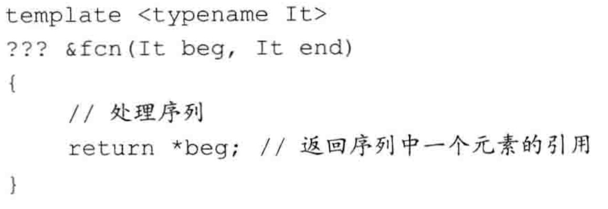
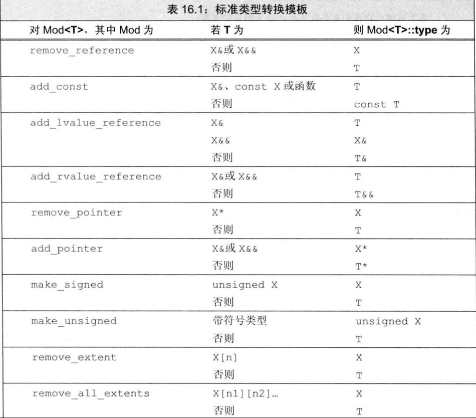

# 定义模板

## 函数模板

我们可以定义一个通用的函数模板（function template），而不是为每个类型都定义一个新函数。一个函数模板就是一个公式，可用来生成针对特定类型的函数版本。

compare的模板版本可能像下面这样：

```c++
template <typename T>
int compare(const T &vl, const T &v2) {
  if (v1 < v2) return -1;
  if (v2 < vl) return 1;
  return 0;
}
```

类似的，模板参数表示在类或函数定义中用到的类型或值。当使用模板时，我们（隐式地或显式地）指定模板实参（template argument），将其绑定到模板参数上。

我们的compare函数声明了一个名为T的类型参数。在compare中，我们用名字T表示一个类型。而T表示的实际类型则在编译时根据compare的使用情况来确定。

### 实例化函数模板

当我们调用一个函数模板时，编译器（通常）用函数实参来为我们推断模板实参。即，当我们调用compare时，编译器使用实参的类型来确定绑定到模板参数T的类型。

```
cout << compare(1, 0) << endl; //T为int
```

实参类型是int。编译器会推断出模板实参为int，并将它绑定到模板参数T。

编译器用推断出的模板参数来为我们实例化（instantiate）一个特定版本的函数。当编译器实例化一个模板时，它使用实际的模板实参代替对应的模板参数来创建出模板的一个新“实例”。

这些编译器生成的版本通常被称为模板的实例（instantiation）。

### 模板类型参数

我们的compare函数有一个模板类型参数（type parameter）。一般来说，我们可以将类型参数看作类型说明符，就像内置类型或类类型说明符一样使用。特别是，类型参数可以用来指定返回类型或函数的参数类型，以及在函数体内用于变量声明或类型转换。

类型参数前必须使用关键字 class或typename。在模板参数列表中，这两个关键字的含义相同，可以互换使用。一个模板参数列表中可以同时使用这两个关键字。

### 非类型模板参数

除了定义类型参数，还可以在模板中定义非类型参数（nontype parameter）。一个非类型参数表示一个值而非一个类型。我们通过一个特定的类型名而非关键字class或typename 来指定非类型参数。

当一个模板被实例化时，非类型参数被一个用户提供的或编译器推断出的值所代替。这些值必须是常量表达式，从而允许编译器在编译时实例化模板。

例如，我们可以编写一个compare版本处理字符串字面常量。这种字面常量是constchar的数组。由于不能拷贝一个数组，所以我们将自己的参数定义为数组的引用。由于我们希望能比较不同长度的字符串字面常量，因此为模板定义了两个非类型的参数。第一个模板参数表示第一个数组的长度，第二个参数表示第二个数组的长度：

```c++
template<unsigned N, unsigned M>
int compare(const char (&p1) [N], const char (&p2) [M])
{
	return strcmp(p1, p2);
}
```

一个非类型参数可以是一个整型，或者是一个指向对象或函数类型的指针或（左值）引用。绑定到非类型整型参数的实参必须是一个常量表达式。绑定到指针或引用非类型参数的实参必须具有静态的生存期。我们不能用一个普通（非static）局部变量或动态对象作为指针或引用非类型模板参数的实参。指针参数也可以用nullptr或一个值为0的常量表达式来实例化。

### inline 和 constexpr 的函数模板

函数模板可以声明为 inline 或 constexpr 的，如同非模板函数一样。inline或constexpr说明符放在模板参数列表之后，返回类型之前。

```c++
//正确：inline说明符跟在模板参数列表之后
template <typename T> inline T min(const T&, const T&);
//错误：inline说明符的位置不正确
inline template <typename T> T min (const T&, const T&);
```

### 模板编译

当编译器遇到一个模板定义时，它并不生成代码。只有当我们实例化出模板的一个特定版本时，编译器才会生成代码。当我们使用（而不是定义）模板时，编译器才生成代码，这一特性影响了我们如何组织代码以及错误何时被检测到。

通常，当我们调用一个函数时，编译器只需要掌握函数的声明。类似的，当我们使用一个类类型的对象时，类定义必须是可用的，但成员函数的定义不必已经出现。因此，我们将类定义和函数声明放在头文件中，而普通函数和类的成员函数的定义放在源文件中。

模板则不同：为了生成一个实例化版本，编译器需要掌握函数模板或类模板成员函数的定义。因此，与非模板代码不同，模板的头文件通常既包括声明也包括定义。

函数模板和类模板成员函数的定义通常放在头文件中。

### 大多数编译错误在实例化期间报告

模板直到实例化时才会生成代码，这一特性影响了我们何时才会获知模板内代码的编译错误。通常，编译器会在三个阶段报告错误。

-   第一个阶段是编译模板本身时。在这个阶段，编译器通常不会发现很多错误。编译器可以检查语法错误，例如忘记分号或者变量名拼错等，但也就这么多了。
-   第二个阶段是编译器遇到模板使用时。在此阶段，编译器仍然没有很多可检查的。对于函数模板调用，编译器通常会检查实参数目是否正确。它还能检查参数类型是否匹配。对于类模板，编译器可以检查用户是否提供了正确数目的模板实参，但也仅限于此了。
-   第三个阶段是模板实例化时，只有这个阶段才能发现类型相关的错误。依赖于编译器如何管理实例化，这类错误可能在链接时才报告。

## 类模板

类模板（class template）是用来生成类的蓝图的。与函数模板的不同之处是，编译器不能为类模板推断模板参数类型。为了使用类模板，我们必须在模板名后的尖括号中提供额外信息——用来代替模板参数的模板实参列表。

>   代码见demo的Blob.h

### 类模板的成员函数

与其他任何类相同，我们既可以在类模板内部，也可以在类模板外部为其定义成员函数，且定义在类模板内的成员函数被隐式声明为内联函数。

类模板的成员函数本身是一个普通函数。但是，类模板的每个实例都有其自己版本的成员函数。因此，类模板的成员函数具有和模板相同的模板参数。因而，定义在类模板之外的成员函数就必须以关键字template开始，后接类模板参数列表。

```c++
template <typename T>
class Blob {
  // ...
  void check(size_type i, const std::string& msg) const;
};

// check member
template <typename T>
void Blob<T>::check(size_type i, const std::string& msg) const {
  if (i >= data->size()) throw std::out_of_range(msg);
}
```

### 类模板成员函数的实例化

默认情况下，一个类模板的成员函数只有当程序用到它时才进行实例化。

### 在类代码内简化模板类名的使用

当我们使用一个类模板类型时必须提供模板实参，但这一规则有一个例外。在类模板自己的作用域中，我们可以直接使用模板名而不提供实参。

### 在类模板外使用类模板名

当我们在类模板外定义其成员时，必须记住，我们并不在类的作用域中，直到遇到类名才表示进入类的作用域。

```c++
// member operators
// postfix: increment/decrement the object but return the unchanged value
template <typename T>
BlobPtr<T> BlobPtr<T>::operator++(int) {
  // no check needed here; the call to prefix increment will do the check
  BlobPtr ret = *this;  // save the current value
  ++*this;              // advance one element; prefix ++ checks the increment
  return ret;           // return the saved state
}
```

由于返回类型位于类的作用域之外，我们必须指出返回类型是一个实例化的BlobPtr，它所用类型与类实例化所用类型一致。在函数体内，我们已经进入类的作用域，因此在定义ret时无须重复模板实参。如果不提供模板实参，则编译器将假定我们使用的类型与成员实例化所用类型一致。因此，ret的定义与如下代码等价：

```c++
BlobPtr<T> ret = *this;
```

### 类模板和友元

当一个类包含一个友元声明时，类与友元各自是否是模板是相互无关的。如果一个类模板包含一个非模板友元，则友元被授权可以访问所有模板实例。如果友元自身是模板，类可以授权给所有友元模板实例，也可以只授权给特定实例。

### 模板类型别名

类模板的一个实例定义了一个类类型，与任何其他类类型一样，我们可以定义一个typedef来引用实例化的类。

```
typedef Blob<string> StrBlob;
```

新标准允许我们为类模板定义一个类型别名：

```
template<typename T> using twin = pair<T, T>;
twin<string> authors; // authors 是一个pair<string, string>
```

## 模板参数

类似函数参数的名字，一个模板参数的名字也没有什么内在含义。我们通常将类型参数命名为T，但实际上我们可以使用任何名字。

### 模板参数与作用域

模板参数遵循普通的作用域规则。一个模板参数名的可用范围是在其声明之后，至模669板声明或定义结束之前。与任何其他名字一样，模板参数会隐藏外层作用域中声明的相同名字。但是，与大多数其他上下文不同，在模板内不能重用模板参数名。

### 使用类的类型成员

回忆一下，我们用作用域运算符（:）来访问static成员和类型成员。例如，如果我们写下string::size_type，编译器有 string 的定义，从而知道 size_type 是一个类型。

但对于模板代码就存在困难。例如，假定T是一个模板类型参数，当编译器遇到类似T::mem这样的代码时，它不会知道mem是一个类型成员还是一个static数据成员，直至实例化时才会知道。但是，为了处理模板，编译器必须知道名字是否表示一个类型。

默认情况下，C++语言假定通过作用域运算符访问的名字不是类型。因此，如果我们希望使用一个模板类型参数的类型成员，就必须显式告诉编译器该名字是一个类型。我们通过使用关键字typename来实现这一点：

```c++
template <typename T>
typename T::value_type top(const T& c) {
	if (!c.empty())
		return c.back();
    else
		return typename T::value_type();
}
```

### 默认模板实参

就像我们能为函数参数提供默认实参一样，我们也可以提供默认模板实参(default template argument)。

### 模板默认实参与类模板

无论何时使用一个类模板，我们都必须在模板名之后接上尖括号。尖括号指出类必须从一个模板实例化而来。特别是，如果一个类模板为其所有模板参数都提供了默认实参，且我们希望使用这些默认实参，就必须在模板名之后跟一个空尖括号对。

```c++
template <class T = int> class Numbers {}
Numbers<long double> lots_of_precision;
Numbers<> average_precision; // 空<>表示我们希望使用默认类型
```

## 成员模板

一个类（无论是普通类还是类模板）可以包含本身是模板的成员函数。这种成员被称为成员模板（member template）。成员模板不能是虚函数。

## 控制实例化

当模板被使用时才会进行实例化这一特性意味着，相同的实例可能出现在多个对象文件中。当两个或多个独立编译的源文件使用了相同的模板，并提供了相同的模板参数时，每个文件中就都会有该模板的一个实例。

在大系统中，在多个文件中实例化相同模板的额外开销可能非常严重。在新标准中，我们可以通过显式实例化（explicit instantiation）来避免这种开销。一个显式实例化有如下形式：

```
extern template declaration;	//实例化声明
template declaration;			//实例化声明
```

declaration是一个类或函数声明，其中所有模板参数已被替换为模板实参。例如，

```
//实例化声明与定义
extern template class Blob<string>;			//声明
template int compare(const int&, const int&); // 定义
```

当编译器遇到extern模板声明时，它不会在本文件中生成实例化代码。将一个实例化声明为extern就表示承诺在程序其他位置有该实例化的一个非extern声明（定义）。对于一个给定的实例化版本，可能有多个extern声明，但必须只有一个定义。

# 模板实参推断

对于函数模板，编译器利用调用中的函数实参来确定其模板参数。

## 函数模板显式实参

在某些情况下，编译器无法推断出模板实参的类型。其他一些情况下，我们希望允许用户控制模板实例化。当函数返回类型与参数列表中任何类型都不相同时，这两种情况最常出现。

### 指定显式模板实参

```
template <typename T1, typename T2, typename T3>
Tl sum(T2, T3);
```

在本例中，没有任何函数实参的类型可用来推断T1的类型。

```
//T1是显式指定的，T2和T3是从函数实参类型推断而来的
auto val3 = sum<long long>(i, lng); // long long sum(int, long)
```

## 尾置返回类型与类型转换



此例中，我们知道函数应该返回`*beg`，而且知道我们可以用`decltype（*beg）`来获取此表达式的类型。但是，在编译器遇到函数的参数列表之前，beg都是不存在的。为了定义此函数，我们必须使用尾置返回类型。由于尾置返回出现在参数列表之后，它可以使用函数的参数：

```c++
/**
 * @brief 尾置返回类型
 * @return 返回的是引用
 */
template <typename It>
auto fcn(It it) -> decltype(*it) {
  return *it;
}
```

```c++
void testFcn() {
  int array[1];
  array[0] = 123;
  NDK_LOG("array[0]=%d array[0] ptr=%p", array[0], &array[0]);
  int &num = fcn(std::begin(array));
  NDK_LOG("num=%d num ptr=%p", num, &num);
}
```

```
array[0]=123 array[0] ptr=0x7ff7b4fcb08c
num=123 num ptr=0x7ff7b4fcb08c
```

### 进行类型转换的标准库模板类

有时我们无法直接获得所需要的类型。例如，我们可能希望编写一个类似fcn的函数，但返回一个元素的值而非引用。

为了获得元素类型，我们可以使用标准库的类型转换（type transformation）模板。这些模板定义在头文件type_traits中。

```c++
/**
 * @brief 尾置返回类型
 * @return 返回的是值（拷贝）
 */
template <typename It>
auto fcn2(It it) -> typename std::remove_reference<decltype(*it)>::type {
  return *it;
}
```

```c++
void testFcn2() {
  int array[1];
  array[0] = 123;
  NDK_LOG("array[0]=%d array[0] ptr=%p", array[0], &array[0]);
  // int &num = fcn2(std::begin(array)); // 编译错误，不能返回引用
  int num = fcn2(std::begin(array));
  NDK_LOG("testFcn2 num=%d num ptr=%p", num, &num);
}
```

```
array[0]=123 array[0] ptr=0x7ff7baffe0ec
testFcn2 num=123 num ptr=0x7ff7baffe0e8
```



## 函数指针和实参推断

当我们用一个函数模板初始化一个函数指针或为一个函数指针赋值时，编译器使用指针的类型来推断模板实参。

例如，假定我们有一个函数指针，它指向的函数返回int，接受两个参数，每个参数都是指向constint的引用。我们可以使用该指针指向compare的一个实例：

```c++
template <typename T> int compare (const T&, const T&);
// pf1 指向实例 int compare(const int&, const int&)
int (*pf1) (const int&, const int&) = compare;
```

pf1中参数的类型决定了T的模板实参的类型。如果不能从函数指针类型确定模板实参，则产生错误：

```c++
//func的重载版本；每个版本接受一个不同的函数指针类型
void func (int (*) (const string&, const string&));
void func(int(*) (const int&, const int&));
func(compare); // 错误: 使用 compare 的哪个实例?
```

## 模板实参推断和引用

### 从左值引用函数参数推断类型

当一个函数参数是模板类型参数的一个普通（左值）引用时（即，形如T&），绑定规则告诉我们，只能传递给它一个左值（如，一个变量或一个返回引用类型的表达式）。实参可以是const类型，也可以不是。如果实参是const的，则T将被推断为const类型：

```c++
template <typename T> void f1(T&); // 实参必须是一个左值
//对f1的调用使用实参所引用的类型作为模板参数类型
f1(i)；
//i是一个int；模板参数类型T是int
f1(ci); // ci 是一个 const int; 模板参数T是const int
f1(5)；//错误：传递给一个&参数的实参必须是一个左值
```

如果一个函数参数的类型是`const T&`，正常的绑定规则告诉我们可以传递给它任何类型的实参——一个对象（const或非const）、一个临时对象或是一个字面常量值。当函数参数本身是const时，T的类型推断的结果不会是一个const类型。const已经是函数参数类型的一部分；因此，它不会也是模板参数类型的一部分：

```c++
template <typename T> void f2(const T&); // 可以接受一个右值
//f2中的参数是const&；实参中的const是无关的
//在每个调用中，f2的函数参数都被推断为constint&
f2(i)；//i是一个int；模板参数T是int
f2(ci); // ci 是一个 const int, 但模板参数T是 int
f2(5)；//一个const&参数可以绑定到一个右值；T是int
```

### 从右值引用函数参数推断类型

当一个函数参数是一个右值引用（即，形如T&&）时，正常绑定规则告诉我们可以传递给它一个右值。当我们这样做时，类型推断过程类似普通左值引用函数参数的推断过程。推断出的T的类型是该右值实参的类型：

```
template <typename T> void f3 (T&&);
f3(42)；//实参是一个int类型的右值；模板参数T是int
```

### 引用折叠和右值引用参数

假定i是一个int对象，我们可能认为像`f3(i)`这样的调用是不合法的。毕竟，i是一个左值，而通常我们不能将一个右值引用绑定到一个左值上。

但是，C++语言在正常绑定规则之外定义了两个例外规则，允许这种绑定。这两个例外规则是move这种标准库设施正确工作的基础。

1.   右值引用参数的推断成引用的引用。通常，我们不能（直接）定义一个引用的引用，但是，通过类型别名或通过模板类型参数间接定义是可以的。
2.   引用折叠。如果我们间接创建一个引用的引用，则这些引用形成了“折叠”。

-   `X& &`，`X& &&`和`X&& &`都折叠成类型`X&`
-   类型`X&& &&`折叠成`X&&`

>   引用折叠只能应用于间接创建的引用的引用，如类型别名或模板参数。

这两个规则导致了两个重要结果：

-   如果一个函数参数是一个指向模板类型参数的右值引用（如，T&&），则它可以被
    绑定到一个左值；且
-   如果实参是一个左值，则推断出的模板实参类型将是一个左值引用，且函数参数将
    被实例化为一个（普通）左值引用参数（T&）

如果一个函数参数是指向模板参数类型的右值引用（如，T&&），则可以传递給它任意类型的实参。如果将一个左值传递给这样的参数，则函数参数被实例化为一个普通的左值引用（T&）。

### std::move

#### 定义

标准库是这样定义move的：

```c++
// 在返回类型和类型转换中也要用到typename
template <typename T>
typename remove_reference<T>::type&& move(T&& t)
{
	return static_cast<typename remove_reference<T>::type&&>(t);
}
```

既可以传递给move一个左值，也可以传递给它一个右值：

```c++
string sl("hi!"), s2;
s2 = std::move(string("bye!"));	// 正确：从一个右值移动数据
s2 = std::move(s1); 			// 正确：但在赋值之后，s1的值是不确定的
```

#### std::move 是如何工作的

在第一个赋值中，传递给move的实参是string的构造函数的右值结果——string("bye!")。如我们已经见到过的，当向一个右值引用函数参数传递一个右值时，由实参推断出的类型为被引用的类型。因此，在`std::move(string("bye!")) `中:

-   推断出的T的类型为string。
-   因此，remove_reference 用string 进行实例化。
-   `remove_reference<string>`的type是string
-   move 的返回类型是 string&&
-   move 的函数参数t的类型为string&&

因此，这个调用实例化`move<string>`，即函数

```
string&& move(string &&t)
```

函数体返回 static_cast<string&&>(t)。t 的类型已经是 string&&，于是类型转换什么都不做。因此，此调用的结果就是它所接受的右值引用。

现在考虑第二个赋值，在此调用中，传递给move的实参是一个左值。这样：

-   推断出的T的类型为string& (string 的引用，而非普通 string)。
-   因此，remove_reference 用string&进行实例化。
-   remove_reference<string&>的type是string。
-   move 的返回类型仍是string&&。
-   move 的函数参数t实例化为string& &&，会折叠为string&。

这个实例的函数体返回static_cast<string&&>(t)。在此情况下, t 的类型为 string&，cast 将其转换为string&& 。

### 从一个左值static_cast到一个右值引用是允许的

C++通常情况下，static_cast只能用于其他合法的类型转换。但是，这里又有一条针对右值引用的特许规则：虽然不能隐式地将一个左值转换为右值引用，但我们可以用static_cast显式地将一个左值转换为一个右值引用。

