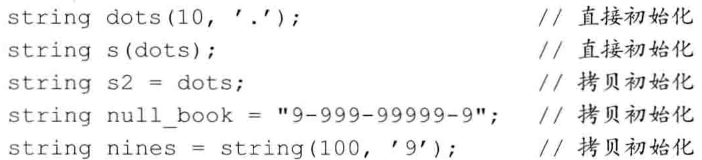
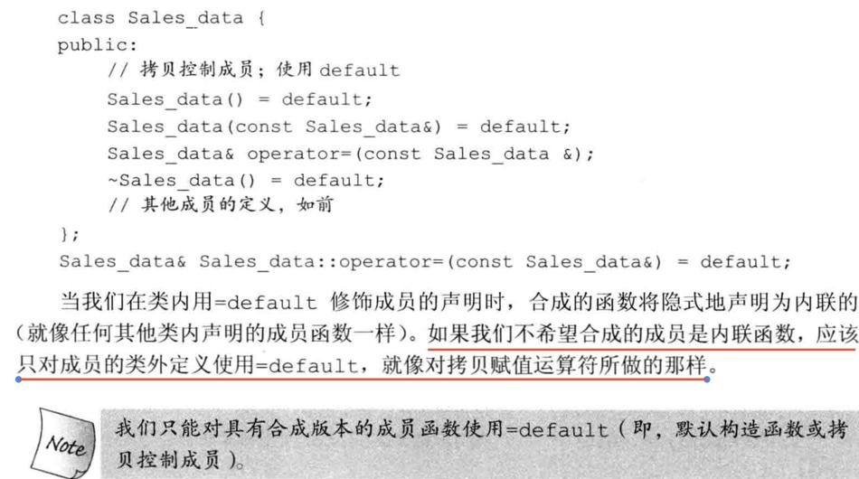
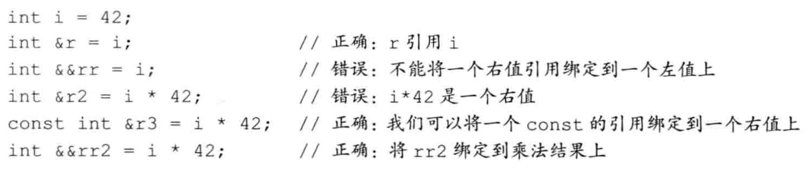
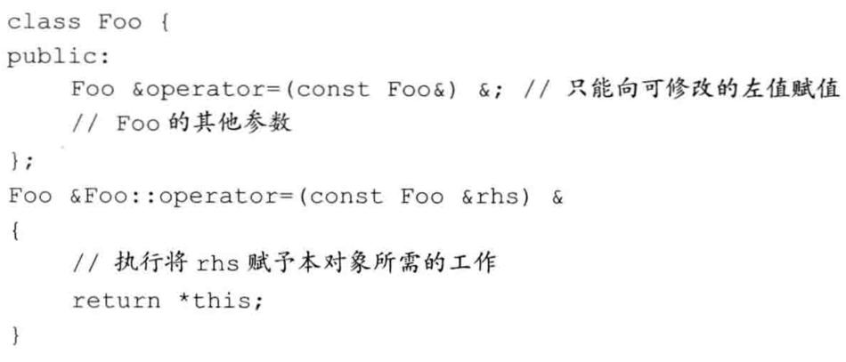
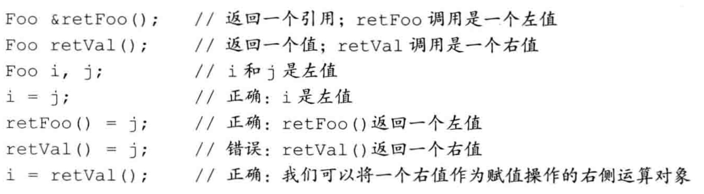
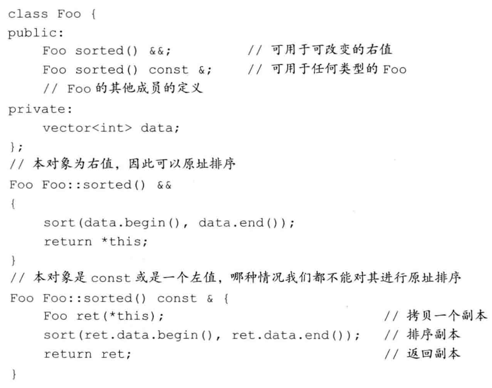

# 类总结

## 特殊成员函数

C++自动提供了下面这些成员函数：

-   默认构造函数，如果没有定义构造函数
-   默认析构函数，如果没有定义
-   复制构造函数，如果没有定义
-   赋值运算符，如果没有定义
-   地址运算符，如果没有定义

### 拷贝构造函数

如果一个构造函数的第一个参数是自身类类型的引用，且任何额外参数都有默认值，则此构造函数是拷贝构造函数。

拷贝构造函数的第一个参数必须是一个引用类型。虽然我们可以定义一个接受非const引用的拷贝构造函数，但此参数几乎总是一个const的引用。拷贝构造函数在几种情况下都会被隐式地使用。因此，拷贝构造函数通常不应该是explicit的。

#### 合成拷贝构造函数

每个成员的类型决定了它如何拷贝：对类类型的成员，会使用其拷贝构造函数来拷贝；内置类型的成员则直接拷贝。虽然我们不能直接拷贝一个数组，但合成拷贝构造函数会逐元素地拷贝一个数组类型的成员。如果数组元素是类类型，则使用元素的拷贝构造函数来进行拷贝。

#### 拷贝初始化



当使用直接初始化时，我们实际上是要求编译器使用普通的函数匹配来选择与我们提供的参数最匹配的构造函数。当我们使用拷贝初始化时，我们要求编译器将右侧运算对象拷贝到正在创建的对象中，如果需要的话还要进行类型转换。

拷贝初始化通常使用拷贝构造函数来完成。如果一个类有一个移动构造函数，则拷贝初始化有时会使用移动构造函数而非拷贝构造函数来完成。

拷贝初始化不仅在我们用=定义变量时会发生，在下列情况下也会发生：

-   将一个对象作为实参传递给一个非引用类型的形参
-   从一个返回类型为非引用类型的函数返回一个对象
-   用花括号列表初始化一个数组中的元素或一个聚合类中的成员

#### 编译器可以绕过拷贝构造函数

在拷贝初始化过程中，编译器可以（但不是必须）跳过拷贝/移动构造函数，直接创建
对象。即，编译器被允许将下面的代码

```
stringnull_book = "9-999-99999-9";//拷贝初始化
```

改写为

```
stringnull_book("9-999-99999-9");//编译器略过了拷贝构造函数
```

### 赋值运算符（又叫拷贝赋值运算符）

将已有的对象赋给另一个对象时，将使用重载的赋值运算符：

```cpp
StringBad headline1("Celery Stalks at Midnight");
...
StringBad knot;
knot = headlinel;// assignment operator invoked
```

初始化对象时，并不一定会使用赋值运算符：

```cpp
StringBad metoo = knot; // use copy constructor, possibly assignment, too
```

metoo是一个新创建的对象，被初始化为knot的值，因此使用复制构造函数。编译器实现也可能分两步来处理这条语句：使用复制构造函数创建一个临时对象，然后通过赋值将临时对象的值复制到新对象中。这就是说，初始化总是会调用复制构造函数，而使用=运算符时也**可能**调用赋值运算符。

```cpp
void test_StringBad2(){
    StringBad bad;
    StringBad bad1 = bad;
}
```

```
1: "C++" default object created
StringBad::StringBad(const StringBad &stringBad)
"C++" object deleted, 1 left
"C++" object deleted, 0 left
```

与复制构造函数相似，赋值运算符的隐式实现也对成员进行逐个复制。

**重要 重要 重要**

**如果类中包含了使用new初始化的指针成员，应当定义一个复制构造函数和赋值运算符，以复制指向的数据，而不是指针，这被称为深度复制。复制的另一种形式(成员复制或浅复制)只是复制指针值。浅复制仅浅浅地复制指针信息，而不会深入“挖掘”以复制指针引用的结构。**

**示例**

```cpp
StringBad::StringBad(const StringBad &stringBad) {
    len = stringBad.len;
    str = new char[len + 1];
    strcpy(str, stringBad.str);
    StringBad::num_strings++;
}

StringBad &StringBad::operator=(const StringBad &st) {
    if (this == &st) {
        return *this;
    }
    delete[] str;
    len = st.len;
    str = new char[len + 1];
    strcpy(str, st.str);
    return *this;
}
```

### 两者区别

看例子：

```cpp
void test_operaotr_1() {
    using namespace Chapter11;

    TestOperaotrClass operaotrClass1(1);
    cout << endl;
    TestOperaotrClass operaotrClass2;
    cout << endl;
    operaotrClass2 = operaotrClass1;
    cout << endl;
    TestOperaotrClass operaotrClass3 = operaotrClass1;
}

namespace Chapter11 {
    TestOperaotrClass::TestOperaotrClass() {
        cout << "默认构造函数" << endl;
        val = 0;
    }

    TestOperaotrClass::TestOperaotrClass(int val) {
        cout << "普通构造函数" << endl;
        this->val = val;
    }

    TestOperaotrClass::TestOperaotrClass(const TestOperaotrClass &testOperaotrClass) {
        cout << "复制构造函数" << endl;
        this->val = testOperaotrClass.val;
    }

    TestOperaotrClass &TestOperaotrClass::operator=(const TestOperaotrClass &testOperaotrClass) {
        cout << "赋值运算符" << endl;
        if (this == &testOperaotrClass) return *this;
        val = testOperaotrClass.val;
        return *this;
    }
}
```

```
普通构造函数

默认构造函数

赋值运算符

复制构造函数
```

### 析构函数

#### 什么时候会调用析构函数

无论何时一个对象被销毁，就会自动调用其析构函数：

-   变量在离开其作用域时被销毁。
-   当一个对象被销毁时，其成员被销毁。
-   容器（无论是标准库容器还是数组）被销毁时，其元素被销毁。
-   对于动态分配的对象，当对指向它的指针应用delete运算符时被销毁。
-   对于临时对象，当创建它的完整表达式结束时被销毁。

### 使用=default



### 阻止拷贝

#### 定义删除的函数

在新标准下，我们可以通过将拷贝构造函数和拷贝赋值运算符定义为删除的函数（deleted function）来阻止拷贝。删除的函数是这样一种函数：我们虽然声明了它们，但不能以任何方式使用它们。在函数的参数列表后面加上=delete来指出我们希望将它定义为删除的：

```c++
struct NoCopy{
	NoCopy() = default；
	//使用合成的默认构造函数
	NoCopy(const NoCopy&) =delete；
	NoCopy&operator=（constNoCopy&）= delete；
}
```

与=default的另一个不同之处是，我们可以对任何函数指定=delete（我们只能对编译器可以合成的默认构造函数或拷贝控制成员使用=default）。虽然删除函数的主要用途是禁止拷贝控制成员，但当我们希望引导函数匹配过程时，删除函数有时也是有用的。

#### 删除析构函数

可以删除析构函数，但相应的对象就不能删除了。

#### 合成的拷贝控制成员可能是删除的

对某些类来说，编译器将这些合成的成员定义为删除的函数：

-   如果类的某个成员的析构函数是删除的或不可访问的（例如，是private的），则类的合成析构函数被定义为删除的。
-   如果类的某个成员的拷贝构造函数是删除的或不可访问的，则类的合成拷贝构造函数被定义为删除的。如果类的某个成员的析构函数是删除的或不可访问的，则类合成的拷贝构造函数也被定义为删除的。
-   如果类的某个成员的拷贝赋值运算符是删除的或不可访问的，或是类有一个const的或引用成员，则类的合成拷贝赋值运算符被定义为删除的。
-   如果类的某个成员的析构函数是删除的或不可访问的，或是类有一个引用成员，它没有类内初始化器，或是类有一个const成员，它没有类内初始化器且其类型未显式定义默认构造函数，则该类的默认构造函数被定义为删除的。

本质上，这些规则的含义是：如果一个类有数据成员不能默认构造、拷贝、复制或销毁，则对应的成员函数将被定义为删除的。

#### private拷贝控制

在新标准发布之前，类是通过将其拷贝构造函数和拷贝赋值运算符声明为private的来阻止拷贝。

由于拷贝构造函数和拷贝赋值运算符是private的，用户代码将不能拷贝这个类型的对象。但是，
友元和成员函数仍旧可以拷贝对象。为了阻止友元和成员函数进行拷贝，我们将这些拷贝控制成员声明为private的，但并不定义它们。

声明但不定义一个成员函数是合法的，对此只有一个例外。试图访问一个未定义的成员将导致一个链接时错误。

### 交换操作swap

除了定义拷贝控制成员，管理资源的类通常还定义一个名为swap的函数。对于那些与重排元素顺序的算法一起使用的类，定义swap是非常重要的。这类算法在需要交换两个元素时会调用swap。

#### 编写我们自己的swap函数

```c++
class HasPtr {
	friend void swap(HasPtr&, HasPtr&);
	// ...
};

inline
void swap(HasPtr &lhs, HasPtr &rhs)
{
	using std::swap;
	swap(lhs.ps, rhs.ps); // swap the pointers, not the string data
	swap(lhs.i, rhs.i);   // swap the int members
}
```

## 对象移动

新标准的一个最主要的特性是可以移动而非拷贝对象的能力。在其中某些情况下，对象拷贝后就立即
被销毁了。在这些情况下，移动而非拷贝对象会大幅度提升性能。

### 右值引用

为了支持移动操作，新标准引入了一种新的引用类型——右值引用（rvalue reference）。所谓右值引用就是必须绑定到右值的引用。我们通过&&而不是&来获得右值引用。如我们将要看到的，右值引用有一个重要的性质——只能绑定到一个将要销毁的对象。因此，我们可以自由地将一个右值引用的资源“移动”到另一个对象中。

回忆一下，左值和右值是表达式的属性。一些表达式生成或要求左值，而另外一些则生成或要求右值。一般而言，一个左值表达式表示的是一个对象的身份，而一个右值表达式表示的是对象的值。

类似任何引用，一个右值引用也不过是某个对象的另一个名字而已。如我们所知，对于常规引用（为了与右值引用区分开来，我们可以称之为左值引用（Ivaluereference））



返回左值引用的函数，连同赋值、下标､解引用和前置递增/递减运算符，都是返回左值的表达式的例子。我们可以将一个左值引用绑定到这类表达式的结果上。

返回非引用类型的函数，连同算术､关系､位以及后置递增/递减运算符，都生成右值。我们不能将一个左值引用绑定到这类表达式上，但我们可以将一个const的左值引用或者一个右值引用绑定到这类表达式上。

```c++
/**
 * @brief 返回左值引用的函数
 */
inline static common::A& returnLvalueReference() {
  static common::A a;
  return a;
}

inline static common::A returnRvalueReference() {
  return common::A();
}

void testRvalueReference() {
  // 左值引用
  common::A &a1 = returnLvalueReference();
  // common::A &a2 = returnRvalueReference();  // 编译错误
  const common::A &a2 = returnRvalueReference();

  // 右值引用
  common::A &&a2 = returnRvalueReference();
}
```

变量是左值
变量可以看作只有一个运算对象而没有运算符的表达式，虽然我们很少这样看待变量。类似其他任何表达式，变量表达式也有左值/右值属性。变量表达式都是左值。带来的结果就是，我们不能将一个右值引用绑定到一个右值引用类型的变量上，这有些令人惊讶：

```
int&&rrl=42；//正确：字面常量是右值
int&&rr2=rr1；//错误：表达式rr1是左值!
```

#### 标准库move函数

虽然不能将一个右值引用直接绑定到一个左值上，但我们可以显式地将一个左值转换为对应的右值引用类型。我们还可以通过调用一个名为move的新标准库函数来获得绑定到左值上的右值引用，此函数定义在头文件utility中。

我们可以销毁一个移后源对象，也可以赋予它新值，但不能使用一个移后源对象的值。

### 移动构造函数和移动赋值运算符

类似拷贝构造函数，移动构造函数的第一个参数是该类类型的一个引用。不同于拷贝构造函数的是，这个引用参数在移动构造函数中是一个右值引用。与拷贝构造函数一样，任何额外的参数都必须有默认实参。

除了完成资源移动，移动构造函数还必须确保移后源对象处于这样一个状态销毁它是无害的。特别是，一旦资源完成移动，源对象必须不再指向被移动的资源——这些资源的所有权已经归属新创建的对象。

```c++
inline
StrVec::StrVec(StrVec &&s) noexcept  // move won't throw any exceptions
  // member initializers take over the resources in s
  : elements(s.elements), first_free(s.first_free), cap(s.cap)
{
	// leave s in a state in which it is safe to run the destructor
	s.elements = s.first_free = s.cap = nullptr;
}
```

与拷贝构造函数不同，移动构造函数不分配任何新內存；它接管给定的StrVec中的内存。在接管内存之后，它将给定对象中的指针都置为nullptr。这样就完成了从给定对象的移动操作，此对象将继续存在。最终，移后源对象会被销毁，意味着将在其上运行析构函数。

#### 移动操作、标准库容器和异常

由于移动操作“窃取”资源，它通常不分配任何资源。因此，移动操作通常不会抛出任何异常。当编写一个不抛出异常的移动操作时，我们应该将此事通知标准库。我们将看到，除非标准库知道我们的移动构造函数不会抛出异常，否则它会认为移动我们的类对象时可能会抛出异常，并且为了处理这种可能性而做一些额外的工作。

一种通知标准库的方法是在我们的构造函数中指明noexcept。

我们必须在类头文件的声明中和定义中（如果定义在类外的话）都指定noexcept。

不抛出异常的移动构造函数和移动赋值运算符必须标记为noexcept。

#### 移动赋值运算符

移动赋值运算符执行与析构函数和移动构造函数相同的工作。与移动构造函数一样，如果我们的移动赋值运算符不抛出任何异常，我们就应该将它标记为noexcept。

#### 合成的移动操作

合成移动操作的条件与合成拷贝操作的条件大不相同。

与拷贝操作不同，编译器根本不会为某些类合成移动操作。特别是，如果一个类定义了自己的拷贝构造函数、拷贝赋值运算符或者析构函数，编译器就不会为它合成移动构造函数和移动赋值运算符了。

只有当一个类没有定义任何自己版本的拷贝控制成员，且类的每个非static数据成员都可以移动时，编译器才会为它合成移动构造函数或移动赋值运算符。

与拷贝操作不同，移动操作永远不会隐式定义为删除的函数。但是，如果我们显式地要求编译器生成=default的移动操作，且编译器不能移动所有成员，则编译器会将移动操作定义为删除的函数。除了一个重要例外，什么时候将合成的移动操作定义为删除的函数遵循与定义删除的合成拷贝操作类似的原则：

-   与拷贝构造函数不同，移动构造函数被定义为删除的函数的条件是：有类成员定义了自己的拷贝构造函数且未定义移动构造函数，或者是有类成员未定义自己的拷贝构造函数且编译器不能为其合成移动构造函数。移动赋值运算符的情况类似。
-   如果有类成员的移动构造函数或移动赋值运算符被定义为删除的或是不可访问的，则类的移动构造函数或移动赋值运算符被定义为删除的。
-   类似拷贝构造函数，如果类的析构函数被定义为删除的或不可访问的，则类的移动构造函数被定义为删除的。（存疑）
-   类似拷贝赋值运算符，如果有类成员是const的或是引用，则类的移动赋值运算符被定义为删除的。

#### 移动右值，拷贝左值

```c++
StrVec v1，v2;	
v1 = v2;					//v2是左值；使用拷贝赋值
StrVec getVec(istream&);	//getVec返回一个右值
v2 = getVec(cin);			//getVec（cin）是一个右值；使用移动赋值
```

#### 如果没有移动构造函数，右值也被拷贝

如果一个类没有移动构造函数，函数匹配规则保证该类型的对象会被拷贝，即使我们试图通过调用move来移动它们时也是如此。

### 右值引用和成员函数

#### 右值和左值引用成员函数

通常，我们在一个对象上调用成员函数，而不管该对象是一个左值还是一个右值。例如：

```
string s1 = "avalue", s2 = "another";
auto n = (s1 + s2).find('a');
```

此例中，我们在一个string右值上调用find成员，该string右值是通过连接两个string而得到的。有时，右值的使用方式可能令人惊讶：

```
s1 + s2 = "wow!";
```

此处我们对两个string的连接结果——一个右值，进行了赋值。

在旧标准中，我们没有办法阻止这种使用方式。为了维持向后兼容性，新标准库类仍然允许向右值赋值。但是，我们可能希望在自己的类中阻止这种用法。在此情况下，我们希望强制左侧运算对象（即，this指向的对象）是一个左值。

我们指出this的左值/右值属性的方式与定义const成员函数相同，即，在参数列表后放置一个引用限定符（reference qualifier）：


引用限定符可以是&或&&，分别指出this可以指向一个左值或右值。类似const限定符，引用限定符只能用于（非static）成员函数，且必须同时出现在函数的声明和定义中。

对于&限定的函数，我们只能将它用于左值；对于&&限定的函数，只能用于右值：



一个函数可以同时用const和引用限定｡在此情况下，引用限定符必须跟随在const限定符之后。

#### 重载和引用函数

就像一个成员函数可以根据是否有const来区分其重载版本一样，引用限定符也可以区分重载版本。



当我们定义const成员函数时，可以定义两个版本，唯一的差别是一个版本有const限定而另一个没有。引用限定的函数则不一样。如果我们定义两个或两个以上具有相同名字和相同参数列表的成员函数，就必须对所有函数都加上引用限定符，或者所有都不加：


如果一个成员函数有引用限定符，则具有相同参数列表的所有版本都必须有引用限定符。

# explicit

```cpp
Chapter11 demo1 = 1.1;

string abc = "acb";
Chapter11 demo2 = abc;


Chapter11(double d);
Chapter11(const string &s);
```

C++可以隐式类型转换，如果要禁止这种行为，可以在构造函数前加explicit关键字。

```cpp
explicit Chapter11(double d);
```

只能在类内声明构造函数时使用explicit关键字，在类外部定义时不应重复。

可以用static_cast强制隐式构造。

## 聚合类

聚合类使得用户可以直接访问其成员，并且具有特殊的初始化语法形式。当一个类满足如下条件时，我们说它是聚合的：

-   所有成员都是public的。
-   没有定义任何构造函数。
-   没有类内初始值。
-   没有基类，也没有virtual函数。

```cpp
struct Data {
	int		ival;
	string 	s;
}
```

我们可以提供一个花括号括起来的成员初始值列表，并用它初始化聚合类的数据成员：

```
Data val1 = {0，"Anna"};
```

初始值的顺序必须与声明的顺序一致，也就是说，第一个成员的初始值要放在第一个，然后是第二个，以此类推。

# 继承总结

C++中复用代码的一个方式是组合，即类内部持有某一类的对象，另一个方式就是继承。

## 初始化顺序

当初始化列表包含多个项目时，这些项目被初始化的顺序为它们被声明的顺序，而不是它们在初始化列表中的顺序。例如，假设Student构造函数如下：

```cpp
Student (const char * str, const double *pd, int n) : scores(pd, n)，name (str) {}
```


则name成员仍将首先被初始化，因为在类定义中它首先被声明。如果代码使用一个成员的值作为另一个成员的初始化表达式的一部分时，初始化顺序就非常重要。

## 私有继承

使用私有继承，基类的公有成员和保护成员都将成为派生类的私有成员。

用法：

```cpp
class Student : private std::string, private std::valarray<double> {}
```

需要初始化父类对象。

```cpp
Student(const char *str, const double *pd, int n)
        : std::string(str), ArrayDb(pd, n) {}
```

### 调用基类方法

使用私有继承时，只能在派生类的方法中使用基类的方法。

使用类名和作用域解析运算符来调用基类的方法：

```
Parent::fun();
```

### 使用基类对象

用强制转换来使用基类对象。

```
return (string&) *this;
```

### 访问基类友元函数

友元函数不属于类，所以不能直接调用，可以通过显式地转换为基类来调用正确的函数。

例如，对于下面的友元函数定义：

```cpp
ostream & operator<<(ostream & os, const Student & stu)
{
    os << "Scores for " << (const string &) stu  << ":\n";
    stu.arr_out(os);  // use private method for scores
    return os;
}
```

**引用stu不会自动转换为string引用。根本原因在于，在私有继承中，在不进行显式类型转换的情况下，不能将指向派生类的引用或指针赋给基类引用或指针。**

>   然而，即使这个例子使用的是公有继承，也必须使用显式类型转换。原因之一是， 如果不使用类型转换，下述代码将与友元函数原型匹配，从而导致递归调用：
>
>   os<< stu;
>
>   另一个原因是，由于这个类使用的是多重继承，编译器将无法确定应转换成哪个基类，如果两个基类都提供了函数operator<<()。

### 组合和私有继承的区别

组合：

-   首先，它易于理解。类声明中包含表示被包含类的显式命名对象，代码可以通过名称引用这些对象，而使用继承将使关系更抽象。
-   其次，继承会引起很多问题，尤其从多个基类继承时，可能必须处理很多问题，如包含同名方法的独立的基类或共享祖先的独立基类。
-   另外，包含能够包括多个同类的子对象。如果某个类需要3个string对象，可以使用包含声明3个独立的string成员。而继承则只能使用一个这样的对象(当对象都没有名称时，将难以区分)。

私有继承：

-   类包含保护成员(可以是数据成员，也可以是成员函数)，则这样的成员在派生类中是可用的，但在继承层次结构外是不可用的。如果使用组合将这样的类包含在另一个类中，则后者将不是派生类，而是位于继承层次结构之外，因此不能访问保护成员。但通过继承得到的将是派生类，因此它能够访问保护成员。
-   另一种需要使用私有继承的情况是需要重新定义虚函数。派生类可以重新定义虛函数，但包含类不能。使用私有继承，重新定义的函数将只能在类中使用，而不是公有的。

**一般情况下，应使用组合来建立has-a 关系；如果新类需要访问原有类的保护成员，或需要重新定义虚函数，则应使用私有继承。**

## 保护继承

使用保护继承时，基类的公有成员和保护成员都将成为派生类的保护成员。和私有私有继承一样，基类的接口在派生类中也是可用的，但在继承层次结构之外是不可用的。当从派生类派生出另一个类时，私有继承和保护继承之间的主要区别便呈现出来了。使用私有继承时，第三代类将不能使用基类的接口，这是因为基类的公有方法在派生类中将变成私有方法；使用保护继承时，基类的公有方法在第二代中将变成受保护的，因此第三代派生类可以使用它们。

### 在继承层次结构外使用基类的公有成员

一个是声明一个公有函数，然后内部调用基类的公有函数。

另一种方法是用using声明：


注意，using声明只使用成员名——没有圆括号、函数特征标和返回类型。这表示可以使用所有同名函数。

## 各种继承方式


成员修饰符：

-   public
    可在继承结构层次之外调用。
-   protect
    只能在继承结构层次之内调用。
-   private
    无法被外部访问

继承修饰符：

C++的继承方式更改的是成员的可见性，见上表。

## 多重继承

多重继承会带来很多问题，主要的问题为：

-   从两个不同的基类继承同名方法
-   从两个或更多相关基类那里继承同一个类的多个实例。

>   下面例子的继承树：
>
>   SingingWaiter->Singer、Waiter
>
>   Singer->Worker
>
>   Waiter->Worker

### 多个实例

**问题描述**

基类：Worker

子类：Singer，Waiter

第三代子类：SingerWaiter

```cpp
SingerWaiter ed;
Worker * pw = &ed;
```

公有继承的基类指针可以指向子类对象的基类对象的地址。但ed中包含两个Worker对象，有两个地址可供选择，出现二义性，所以应使用类型转换来指定对象：

```cpp
SingerWaiter ed;
Worker * pw1 = (Waiter *)&ed;
Worker * pw2 = (Singer *)&ed;
```

这种解决方式是临时的，虚基类可以很好的解决这个问题。虚基类使得从多个类（它们的基类相同）派生出的对象只继承一个基类对象。

>   为什么不抛弃将基类声明为虚的这种方式，而使虚行为成为MI的准则呢？
>
>   -   在一些情况下，可能需要基类的多个拷贝
>   -   将基类作为虚的要求程序完成额外的计算，为不需要的工具付出代价是不应当的

#### 虚基类

虚基类使得从多个类(它们的基类相同)派生出的对象只继承一个基类对象。例如，通过在类声明中使用关键字virtual，可以使Worker被用作Singer和Waiter的虚基类(virtual和public的次序无关紧要)：

```cpp
class Singer : virtual public Worker
class Waiter : public virtual Worker {...};
```

使用虚基类后，代码规则会有一些变化。

**新的构造函数规则**

原本的构造函数规则：C类的构造函数只能调用B类的构造函数，而B类的构造函数只能调用A类的构造函数。

如果Worker是虚基类，则这种信息自动传递将不起作用。例如，对于下面的MI构造函数：

```cpp
SingingWaiter(const Worker & wk, int p = 0, int v = Singer::other): Waiter (wk,p), Singer(wk,v) { } // flawed
```

存在的问题是，自动传递信息时，将通过2条不同的途径(Waiter 和Singer)将wk传递给Worker对象。为避免这种冲突，C++在基类是虚的时，禁止信息通过中间类自动传递给基类。因此，上述构造函数将初始化成员panache和voice，但wk参数中的信息将不会传递给子对象Waiter。然而，编译器必须在构造派生对象之前构造基类对象组件；在上述情况下，编译器将使用Worker的默认构造函数。

如果不希望默认构造函数来构造虚基类对象，则需要显式地调用所需的基类构造函数。因此，构造函数应该是这样：

```cpp
SingingWaiter(const Worker & wk, int p = 0, int v = Singer::other): Worker {wk), Waiter (wk,p), Singer(wk,v) { } 
```

上述代码将显式地调用构造函数worker (const Worker &)。请注意，这种用法是合法的，对于虚基类，必须这样做，但对于非虚基类，则是非法的。

### 多个方法

在多重继承中，每个直接祖先都有一个Show()函数，这使得调用Show()是二义性的。可以使用作用域解析运算符来澄清意图：

```cpp
SingingWaiter newhire("Elise Hawks", 2005, 6, soprano);
newhire.Singer::Show(); // use Singer version
```

然而，更好的方法是在SingingWaiter中重新定义Show( )，并指出要使用哪个Show()。例如，如果希望SingingWaiter对象使用Singer版本的Show()，则可以这样做：

```cpp
void Singingwaiter::Show(}
	Singer::Show();
}
```

## 类模板

类模板（class template）是用来生成类的蓝图的。与函数模板的不同之处是，编译器不能为类模板推断模板参数类型。为了使用类模板，必须在模板名后的尖括号中提供额外信息。

