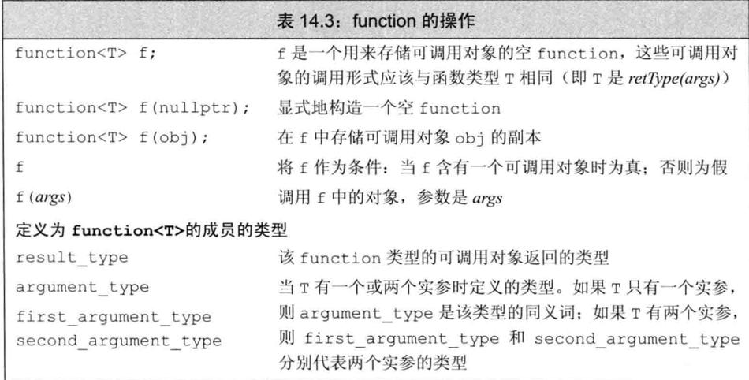
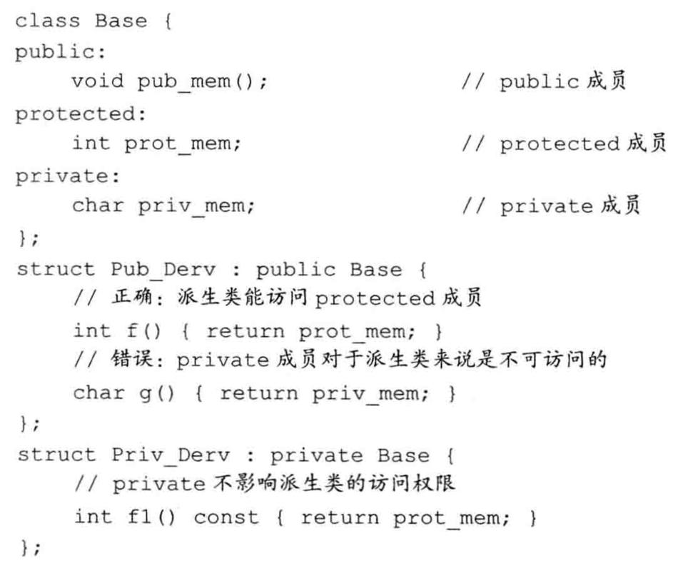
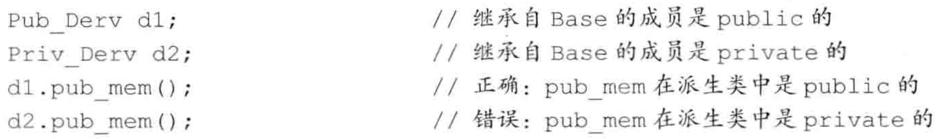
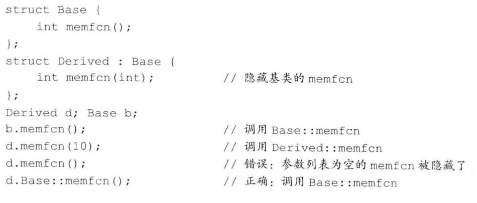

# 类总结

## 初始化顺序

当初始化列表包含多个项目时，这些项目被初始化的顺序为它们被声明的顺序，而不是它们在初始化列表中的顺序。例如，假设Student构造函数如下：

```cpp
Student (const char * str, const double *pd, int n) : scores(pd, n)，name (str) {}
```


则name成员仍将首先被初始化，因为在类定义中它首先被声明。如果代码使用一个成员的值作为另一个成员的初始化表达式的一部分时，初始化顺序就非常重要。

## 特殊成员函数

C++自动提供了下面这些成员函数：

-   默认构造函数，如果没有定义构造函数
-   默认析构函数，如果没有定义
-   复制构造函数，如果没有定义
-   赋值运算符，如果没有定义
-   地址运算符，如果没有定义

### 拷贝构造函数

如果一个构造函数的第一个参数是自身类类型的引用，且任何额外参数都有默认值，则此构造函数是拷贝构造函数。

拷贝构造函数的第一个参数必须是一个引用类型。虽然我们可以定义一个接受非const引用的拷贝构造函数，但此参数几乎总是一个const的引用。拷贝构造函数在几种情况下都会被隐式地使用。因此，拷贝构造函数通常不应该是explicit的。

#### 合成拷贝构造函数

每个成员的类型决定了它如何拷贝：对类类型的成员，会使用其拷贝构造函数来拷贝；内置类型的成员则直接拷贝。虽然我们不能直接拷贝一个数组，但合成拷贝构造函数会逐元素地拷贝一个数组类型的成员。如果数组元素是类类型，则使用元素的拷贝构造函数来进行拷贝。

#### 拷贝初始化


当使用直接初始化时，我们实际上是要求编译器使用普通的函数匹配来选择与我们提供的参数最匹配的构造函数。当我们使用拷贝初始化时，我们要求编译器将右侧运算对象拷贝到正在创建的对象中，如果需要的话还要进行类型转换。

拷贝初始化通常使用拷贝构造函数来完成。如果一个类有一个移动构造函数，则拷贝初始化有时会使用移动构造函数而非拷贝构造函数来完成。

拷贝初始化不仅在我们用=定义变量时会发生，在下列情况下也会发生：

-   将一个对象作为实参传递给一个非引用类型的形参
-   从一个返回类型为非引用类型的函数返回一个对象
-   用花括号列表初始化一个数组中的元素或一个聚合类中的成员

#### 编译器可以绕过拷贝构造函数

在拷贝初始化过程中，编译器可以（但不是必须）跳过拷贝/移动构造函数，直接创建
对象。即，编译器被允许将下面的代码

```
stringnull_book = "9-999-99999-9";//拷贝初始化
```

改写为

```
stringnull_book("9-999-99999-9");//编译器略过了拷贝构造函数
```

### 赋值运算符（又叫拷贝赋值运算符）

将已有的对象赋给另一个对象时，将使用重载的赋值运算符：

```cpp
StringBad headline1("Celery Stalks at Midnight");
...
StringBad knot;
knot = headlinel;// assignment operator invoked
```

初始化对象时，并不一定会使用赋值运算符：

```cpp
StringBad metoo = knot; // use copy constructor, possibly assignment, too
```

metoo是一个新创建的对象，被初始化为knot的值，因此使用复制构造函数。编译器实现也可能分两步来处理这条语句：使用复制构造函数创建一个临时对象，然后通过赋值将临时对象的值复制到新对象中。这就是说，初始化总是会调用复制构造函数，而使用=运算符时也**可能**调用赋值运算符。

```cpp
void test_StringBad2(){
    StringBad bad;
    StringBad bad1 = bad;
}
```

```
1: "C++" default object created
StringBad::StringBad(const StringBad &stringBad)
"C++" object deleted, 1 left
"C++" object deleted, 0 left
```

与复制构造函数相似，赋值运算符的隐式实现也对成员进行逐个复制。

**重要 重要 重要**

**如果类中包含了使用new初始化的指针成员，应当定义一个复制构造函数和赋值运算符，以复制指向的数据，而不是指针，这被称为深度复制。复制的另一种形式(成员复制或浅复制)只是复制指针值。浅复制仅浅浅地复制指针信息，而不会深入“挖掘”以复制指针引用的结构。**

**示例**

```cpp
StringBad::StringBad(const StringBad &stringBad) {
    len = stringBad.len;
    str = new char[len + 1];
    strcpy(str, stringBad.str);
    StringBad::num_strings++;
}

StringBad &StringBad::operator=(const StringBad &st) {
    if (this == &st) {
        return *this;
    }
    delete[] str;
    len = st.len;
    str = new char[len + 1];
    strcpy(str, st.str);
    return *this;
}
```

### 两者区别

看例子：

```cpp
void test_operaotr_1() {
    using namespace Chapter11;

    TestOperaotrClass operaotrClass1(1);
    cout << endl;
    TestOperaotrClass operaotrClass2;
    cout << endl;
    operaotrClass2 = operaotrClass1;
    cout << endl;
    TestOperaotrClass operaotrClass3 = operaotrClass1;
}

namespace Chapter11 {
    TestOperaotrClass::TestOperaotrClass() {
        cout << "默认构造函数" << endl;
        val = 0;
    }

    TestOperaotrClass::TestOperaotrClass(int val) {
        cout << "普通构造函数" << endl;
        this->val = val;
    }

    TestOperaotrClass::TestOperaotrClass(const TestOperaotrClass &testOperaotrClass) {
        cout << "复制构造函数" << endl;
        this->val = testOperaotrClass.val;
    }

    TestOperaotrClass &TestOperaotrClass::operator=(const TestOperaotrClass &testOperaotrClass) {
        cout << "赋值运算符" << endl;
        if (this == &testOperaotrClass) return *this;
        val = testOperaotrClass.val;
        return *this;
    }
}
```

```
普通构造函数

默认构造函数

赋值运算符

复制构造函数
```

### 析构函数

#### 什么时候会调用析构函数

无论何时一个对象被销毁，就会自动调用其析构函数：

-   变量在离开其作用域时被销毁。
-   当一个对象被销毁时，其成员被销毁。
-   容器（无论是标准库容器还是数组）被销毁时，其元素被销毁。
-   对于动态分配的对象，当对指向它的指针应用delete运算符时被销毁。
-   对于临时对象，当创建它的完整表达式结束时被销毁。

### 使用=default


### 阻止拷贝

#### 定义删除的函数

在新标准下，我们可以通过将拷贝构造函数和拷贝赋值运算符定义为删除的函数（deleted function）来阻止拷贝。删除的函数是这样一种函数：我们虽然声明了它们，但不能以任何方式使用它们。在函数的参数列表后面加上=delete来指出我们希望将它定义为删除的：

```c++
struct NoCopy{
	NoCopy() = default；
	//使用合成的默认构造函数
	NoCopy(const NoCopy&) =delete；
	NoCopy&operator=（constNoCopy&）= delete；
}
```

与=default的另一个不同之处是，我们可以对任何函数指定=delete（我们只能对编译器可以合成的默认构造函数或拷贝控制成员使用=default）。虽然删除函数的主要用途是禁止拷贝控制成员，但当我们希望引导函数匹配过程时，删除函数有时也是有用的。

#### 删除析构函数

可以删除析构函数，但相应的对象就不能删除了。

#### 合成的拷贝控制成员可能是删除的

对某些类来说，编译器将这些合成的成员定义为删除的函数：

-   如果类的某个成员的析构函数是删除的或不可访问的（例如，是private的），则类的合成析构函数被定义为删除的。
-   如果类的某个成员的拷贝构造函数是删除的或不可访问的，则类的合成拷贝构造函数被定义为删除的。如果类的某个成员的析构函数是删除的或不可访问的，则类合成的拷贝构造函数也被定义为删除的。
-   如果类的某个成员的拷贝赋值运算符是删除的或不可访问的，或是类有一个const的或引用成员，则类的合成拷贝赋值运算符被定义为删除的。
-   如果类的某个成员的析构函数是删除的或不可访问的，或是类有一个引用成员，它没有类内初始化器，或是类有一个const成员，它没有类内初始化器且其类型未显式定义默认构造函数，则该类的默认构造函数被定义为删除的。

本质上，这些规则的含义是：如果一个类有数据成员不能默认构造、拷贝、复制或销毁，则对应的成员函数将被定义为删除的。

#### private拷贝控制

在新标准发布之前，类是通过将其拷贝构造函数和拷贝赋值运算符声明为private的来阻止拷贝。

由于拷贝构造函数和拷贝赋值运算符是private的，用户代码将不能拷贝这个类型的对象。但是，
友元和成员函数仍旧可以拷贝对象。为了阻止友元和成员函数进行拷贝，我们将这些拷贝控制成员声明为private的，但并不定义它们。

声明但不定义一个成员函数是合法的，对此只有一个例外。试图访问一个未定义的成员将导致一个链接时错误。

### 交换操作swap

除了定义拷贝控制成员，管理资源的类通常还定义一个名为swap的函数。对于那些与重排元素顺序的算法一起使用的类，定义swap是非常重要的。这类算法在需要交换两个元素时会调用swap。

#### 编写我们自己的swap函数

```c++
class HasPtr {
	friend void swap(HasPtr&, HasPtr&);
	// ...
};

inline
void swap(HasPtr &lhs, HasPtr &rhs)
{
	using std::swap;
	swap(lhs.ps, rhs.ps); // swap the pointers, not the string data
	swap(lhs.i, rhs.i);   // swap the int members
}
```

## 对象移动

新标准的一个最主要的特性是可以移动而非拷贝对象的能力。在其中某些情况下，对象拷贝后就立即
被销毁了。在这些情况下，移动而非拷贝对象会大幅度提升性能。

### 右值引用

为了支持移动操作，新标准引入了一种新的引用类型——右值引用（rvalue reference）。所谓右值引用就是必须绑定到右值的引用。我们通过&&而不是&来获得右值引用。如我们将要看到的，右值引用有一个重要的性质——只能绑定到一个将要销毁的对象。因此，我们可以自由地将一个右值引用的资源“移动”到另一个对象中。

回忆一下，左值和右值是表达式的属性。一些表达式生成或要求左值，而另外一些则生成或要求右值。一般而言，一个左值表达式表示的是一个对象的身份，而一个右值表达式表示的是对象的值。

类似任何引用，一个右值引用也不过是某个对象的另一个名字而已。如我们所知，对于常规引用（为了与右值引用区分开来，我们可以称之为左值引用（Ivaluereference））


返回左值引用的函数，连同赋值、下标､解引用和前置递增/递减运算符，都是返回左值的表达式的例子。我们可以将一个左值引用绑定到这类表达式的结果上。

返回非引用类型的函数，连同算术､关系､位以及后置递增/递减运算符，都生成右值。我们不能将一个左值引用绑定到这类表达式上，但我们可以将一个const的左值引用或者一个右值引用绑定到这类表达式上。

```c++
/**
 * @brief 返回左值引用的函数
 */
inline static common::A& returnLvalueReference() {
  static common::A a;
  return a;
}

inline static common::A returnRvalueReference() {
  return common::A();
}

void testRvalueReference() {
  // 左值引用
  common::A &a1 = returnLvalueReference();
  // common::A &a2 = returnRvalueReference();  // 编译错误
  const common::A &a2 = returnRvalueReference();

  // 右值引用
  common::A &&a2 = returnRvalueReference();
}
```

变量是左值
变量可以看作只有一个运算对象而没有运算符的表达式，虽然我们很少这样看待变量。类似其他任何表达式，变量表达式也有左值/右值属性。变量表达式都是左值。带来的结果就是，我们不能将一个右值引用绑定到一个右值引用类型的变量上，这有些令人惊讶：

```
int&&rrl=42；//正确：字面常量是右值
int&&rr2=rr1；//错误：表达式rr1是左值!
```

#### 标准库move函数

虽然不能将一个右值引用直接绑定到一个左值上，但我们可以显式地将一个左值转换为对应的右值引用类型。我们还可以通过调用一个名为move的新标准库函数来获得绑定到左值上的右值引用，此函数定义在头文件utility中。

我们可以销毁一个移后源对象，也可以赋予它新值，但不能使用一个移后源对象的值。

### 移动构造函数和移动赋值运算符

类似拷贝构造函数，移动构造函数的第一个参数是该类类型的一个引用。不同于拷贝构造函数的是，这个引用参数在移动构造函数中是一个右值引用。与拷贝构造函数一样，任何额外的参数都必须有默认实参。

除了完成资源移动，移动构造函数还必须确保移后源对象处于这样一个状态销毁它是无害的。特别是，一旦资源完成移动，源对象必须不再指向被移动的资源——这些资源的所有权已经归属新创建的对象。

```c++
inline
StrVec::StrVec(StrVec &&s) noexcept  // move won't throw any exceptions
  // member initializers take over the resources in s
  : elements(s.elements), first_free(s.first_free), cap(s.cap)
{
	// leave s in a state in which it is safe to run the destructor
	s.elements = s.first_free = s.cap = nullptr;
}
```

与拷贝构造函数不同，移动构造函数不分配任何新內存；它接管给定的StrVec中的内存。在接管内存之后，它将给定对象中的指针都置为nullptr。这样就完成了从给定对象的移动操作，此对象将继续存在。最终，移后源对象会被销毁，意味着将在其上运行析构函数。

#### 移动操作、标准库容器和异常

由于移动操作“窃取”资源，它通常不分配任何资源。因此，移动操作通常不会抛出任何异常。当编写一个不抛出异常的移动操作时，我们应该将此事通知标准库。我们将看到，除非标准库知道我们的移动构造函数不会抛出异常，否则它会认为移动我们的类对象时可能会抛出异常，并且为了处理这种可能性而做一些额外的工作。

一种通知标准库的方法是在我们的构造函数中指明noexcept。

我们必须在类头文件的声明中和定义中（如果定义在类外的话）都指定noexcept。

不抛出异常的移动构造函数和移动赋值运算符必须标记为noexcept。

#### 移动赋值运算符

移动赋值运算符执行与析构函数和移动构造函数相同的工作。与移动构造函数一样，如果我们的移动赋值运算符不抛出任何异常，我们就应该将它标记为noexcept。

#### 合成的移动操作

合成移动操作的条件与合成拷贝操作的条件大不相同。

与拷贝操作不同，编译器根本不会为某些类合成移动操作。特别是，如果一个类定义了自己的拷贝构造函数、拷贝赋值运算符或者析构函数，编译器就不会为它合成移动构造函数和移动赋值运算符了。

只有当一个类没有定义任何自己版本的拷贝控制成员，且类的每个非static数据成员都可以移动时，编译器才会为它合成移动构造函数或移动赋值运算符。

与拷贝操作不同，移动操作永远不会隐式定义为删除的函数。但是，如果我们显式地要求编译器生成=default的移动操作，且编译器不能移动所有成员，则编译器会将移动操作定义为删除的函数。除了一个重要例外，什么时候将合成的移动操作定义为删除的函数遵循与定义删除的合成拷贝操作类似的原则：

-   与拷贝构造函数不同，移动构造函数被定义为删除的函数的条件是：有类成员定义了自己的拷贝构造函数且未定义移动构造函数，或者是有类成员未定义自己的拷贝构造函数且编译器不能为其合成移动构造函数。移动赋值运算符的情况类似。
-   如果有类成员的移动构造函数或移动赋值运算符被定义为删除的或是不可访问的，则类的移动构造函数或移动赋值运算符被定义为删除的。
-   类似拷贝构造函数，如果类的析构函数被定义为删除的或不可访问的，则类的移动构造函数被定义为删除的。（存疑）
-   类似拷贝赋值运算符，如果有类成员是const的或是引用，则类的移动赋值运算符被定义为删除的。

#### 移动右值，拷贝左值

```c++
StrVec v1，v2;	
v1 = v2;					//v2是左值；使用拷贝赋值
StrVec getVec(istream&);	//getVec返回一个右值
v2 = getVec(cin);			//getVec（cin）是一个右值；使用移动赋值
```

#### 如果没有移动构造函数，右值也被拷贝

如果一个类没有移动构造函数，函数匹配规则保证该类型的对象会被拷贝，即使我们试图通过调用move来移动它们时也是如此。

### 右值引用和成员函数

#### 右值和左值引用成员函数

通常，我们在一个对象上调用成员函数，而不管该对象是一个左值还是一个右值。例如：

```
string s1 = "avalue", s2 = "another";
auto n = (s1 + s2).find('a');
```

此例中，我们在一个string右值上调用find成员，该string右值是通过连接两个string而得到的。有时，右值的使用方式可能令人惊讶：

```
s1 + s2 = "wow!";
```

此处我们对两个string的连接结果——一个右值，进行了赋值。

在旧标准中，我们没有办法阻止这种使用方式。为了维持向后兼容性，新标准库类仍然允许向右值赋值。但是，我们可能希望在自己的类中阻止这种用法。在此情况下，我们希望强制左侧运算对象（即，this指向的对象）是一个左值。

我们指出this的左值/右值属性的方式与定义const成员函数相同，即，在参数列表后放置一个引用限定符（reference qualifier）：


引用限定符可以是&或&&，分别指出this可以指向一个左值或右值。类似const限定符，引用限定符只能用于（非static）成员函数，且必须同时出现在函数的声明和定义中。

对于&限定的函数，我们只能将它用于左值；对于&&限定的函数，只能用于右值：


一个函数可以同时用const和引用限定｡在此情况下，引用限定符必须跟随在const限定符之后。

#### 重载和引用函数

就像一个成员函数可以根据是否有const来区分其重载版本一样，引用限定符也可以区分重载版本。


当我们定义const成员函数时，可以定义两个版本，唯一的差别是一个版本有const限定而另一个没有。引用限定的函数则不一样。如果我们定义两个或两个以上具有相同名字和相同参数列表的成员函数，就必须对所有函数都加上引用限定符，或者所有都不加：


如果一个成员函数有引用限定符，则具有相同参数列表的所有版本都必须有引用限定符。

## 重载运算符

### 基本概念

重载的运算符是具有特殊名字的函数：它们的名字由关键字operator和其后要定义的运算符号共同组成。和其他函数一样，重载的运算符也包含返回类型、参数列表以及函数体。

重载运算符函数的参数数量与该运算符作用的运算对象数量一样多。一元运算符有一个参数，二元运算符有两个。对于二元运算符来说，左侧运算对象传递给第一个参数，而右侧运算对象传递给第二个参数。除了重载的函数调用运算符operator()之外，其他重载运算符不能含有默认实参。

如果一个运算符函数是成员函数，则它的第一个（左侧）运算对象绑定到隐式的this指针上，因此，成员运算符函数的（显式）参数数量比运算符的运算对象总数少一个。

对于一个运算符函数来说，它或者是类的成员，或者至少含有一个类类型的参数：

```
// 错误：不能为int重定义内置的运算符
int operator+(int,int);
```

这一约定意味着当运算符作用于内置类型的运算对象时，我们无法改变该运算符的含义。

我们可以重载大多数（但不是全部）运算符。我们只能重载已有的运算符，而无权发明新的运算符号。


#### 直接调用一个重载的运算符函数

我们也能像调用普通函数一样直接调用运算符函数，先指定函数名字，然后传入数量正确、类型适当的实参：

```
data1 + data2;
operator+(data1, data2);
```

我们像调用其他成员函数一样显式地调用成员运算符函数。具体做法是，首先指定运行函数的对象（或指针）的名字，然后使用点运算符（或箭头运算符）访问希望调用的函数：

```
data1 += data2;
data1.operator+=(data2);
```

#### 某些运算符不应该被重载

通常情况下，不应该重载逗号、取地址、逻辑与和逻辑或运算符。

#### 使用与内置类型一致的含义

#### 赋值和复合赋值运算符

赋值运算符的行为与复合版本的类似：赋值之后，左侧运算对象和右侧运算对象的值相等，并且运算符应该返回它左侧运算对象的一个引用。重载的赋值运算应该继承而非违背其內置版本的含义。

### 输入和输出运算符

#### 重载输出运算符<<

通常情况下，输出运算符的第一个形参是一个非常量ostream对象的引用。之所以ostream是非常量是因为向流写入内容会改变其状态；而该形参是引用是因为我们无法直接复制一个ostream对象。

第二个形参一般来说是一个常量的引用，该常量是我们想要打印的类类型。第二个形参是引用的原因是我们希望避免复制实参；而之所以该形参可以是常量是因为（通常情况下）打印对象不会改变对象的内容。

为了与其他输出运算符保持一致，operator<<一般要返回它的ostream形参。

### 赋值运算符（花括号赋值）

```c++
inline
StrVec &StrVec::operator=(std::initializer_list<std::string> il)
{
	// alloc_n_copy allocates space and copies elements from the given range
	auto data = alloc_n_copy(il.begin(), il.end());
	free();   // destroy the elements in this object and free the space
	elements = data.first; // update data members to point to the new space
	first_free = cap = data.second;
	return *this;
}
```

### 递增和递减运算符

#### 区分前置和后置运算符

```c++
/**
 * @brief 测试重载运算符
 *
 */
class MyOperatorClass {
  friend std::ostream &operator<<(std::ostream &out,
                                  const MyOperatorClass &obj);

 private:
  int val;

 public:
  MyOperatorClass(int v) : val(v) {}

  /**
   * @brief 前置++运算符
   */
  MyOperatorClass &operator++() {
    ++val;
    return *this;
  }

  /**
   * @brief 后置++运算符
   */
  MyOperatorClass operator++(int) {
    MyOperatorClass obj = *this;
    val++;
    return obj;
  }
};

inline std::ostream &operator<<(std::ostream &out, const MyOperatorClass &obj) {
  out << obj.val;
  return out;
}

/**
 * @brief 测试重置运算符
 * 
 */
static void testOperator();
```

```c++
void testOperator() {
  {
    int v1 = 1;
    std::cout << v1++ << std::endl;

    int v2 = 1;
    std::cout << ++v2 << std::endl;
  }
  {
    MyOperatorClass v1(1);
    std::cout << v1++ << std::endl;

    MyOperatorClass v2(1);
    std::cout << ++v2 << std::endl;
  }
}
```

```
1
2
1
2
```

要想同时定义前置和后置运算符，必须首先解决一个问题，即普通的重载形式无法区分这两种情况。前置和后置版本使用的是同一个符号，意味着其重载版本所用的名字将是相同的，并且运算对象的数量和类型也相同。

为了解决这个问题，后置版本接受一个额外的（不被使用）int类型的形参。当我们使用后置运算符时，编译器为这个形参提供一个值为0的实参。尽管从语法上来说后置函数可以使用这个额外的形参，但是在实际过程中通常不会这么做。这个形参的唯一作用就是区分前置版本和后置版本的函数，而不是真的要在实现后置版本时参与运算。

### 函数调用运算符

如果类重载了函数调用运算符，则我们可以像使用函数一样使用该类的对象。

```c++
struct absInt {
    int operator()(int val) const {
        return val < 0 ? -val : val;
    }
};
```


函数调用运算符必须是成员函数。一个类可以定义多个不同版本的调用运算符，相互之间应该在参数数量或类型上有所区别。

如果类定义了调用运算符，则该类的对象称作函数对象（function object）。因为可以调用这种对象，所以我们说这些对象的“行为像函数一样”。

#### lambda是函数对象

当我们编写了一个lambda后，编译器将该表达式翻译成一个未命名类的未命名对象。

#### 可调用对象与function

C++语言中有几种可调用的对象：函数、函数指针、lambda表达式、bind创建的对象以及重载了函数调用运算符的类。

和其他对象一样，可调用的对象也有类型。例如，每个lambda有它自己唯一的（未命名）类类型；函数及函数指针的类型则由其返回值类型和实参类型决定，等等。

然而，两个不同类型的可调用对象却可能共享同一种调用形式（call signature）。调用形式指明了调用返回的类型以及传递给调用的实参类型。一种调用形式对应一个函数类型，例如：

```
int (int,int)
```

是一个函数类型，它接受两个int、返回一个int。

##### 不同类型可能具有相同的调用形式

```c++
//普通函数
int add(int i,int j) { return i+j; }

// lambda, 其产生一个未命名的函数对象类
auto mod = [] (int i, int j) { return i%j; };

//函数对象类
struct divide {
	int operator() (int denominator , int divisor) {
		return denominator / divisor;
	}
};
```

上面这些可调用对象分别对其参数执行了不同的算术运算，尽管它们的类型各不相同，但是共享同一种调用形式：

```
int (int,int)
```

定义一个函数表（function table）用于存储指向这些可调用对象的“指针”。

```
map<string，int(*)(int, int)>binops;
```

可以将add的指针添加到binops中，但是不能将mod或者divide存入binops。问题在于mod是个lambda表达式，而每个lambda有它自己的类类型，该类型与存储在binops中的值的类型不匹配。

#### 标准库function类型

我们可以使用一个名为function的新的标准库类型解决上述问题，function定义在functional头文件中。



function是一个模板，和我们使用过的其他模板一样，当创建一个具体的function类型时我们必须提供额外的信息。在此例中，所谓额外的信息是指该function类型能够表示的对象的调用形式。参考其他模板，我们在一对尖括号内指定类型：

```
function<int (int, int)>
```

##### 重载的函数与function

我们不能（直接）将重载函数的名字存入function类型的对象中，解决上述二义性问题的一条途径是存储函数指针而非函数的名字。同样，我们也能使用lambda来消除二义性。

### 类型转换运算符

类型转换运算符（conversion operator）是类的一种特殊成员函数，它负责将一个类类型的值转换成其他类型。类型转换函数的一般形式如下所示：

```
operator type() const;
```

其中type表示某种类型。类型转换运算符可以面向任意类型（除了void之外）进行定义，只要该类型能作为函数的返回类型。因此，我们不允许转换成数组或者函数类型，但允许转换成指针（包括数组指针及函数指针）或者引用类型。

类型转换运算符既没有显式的返回类型，也没有形参，而且必须定义成类的成员函数。类型转换运算符通常不应该改变待转换对象的内容，因此，类型转换运算符一般被定义成const成员。

```c++
class SmallInt {
 public:
  SmallInt(int i = 0) : val(i) {}
  operator int() const { return val; }

 private:
  std::size_t val;
};

void testCast() {
  SmallInt si = 2;
  si = 3;
  int val = si + 4;
}
```

#### 类型转换运算符可能产生意外结果

在实践中，类很少提供类型转换运算符。在大多数情况下，如果类型转换自动发生，用户可能会感觉比较意外，而不是感觉受到了帮助。然而这条经验法则存在一种例外情况：对于类来说，定义向bool的类型转换还是比较普遍的现象。

```
int i = 42;
cin << i;	//如果向bool的类型转换不是显式的，则该代码在编译器看来将是合法的!
```

这段程序试图将输出运算符作用于输入流。因为istream本身并没有定义<<，所以本来代码应该产生错误。然而，该代码能使用istream的bool类型转换运算符将cin转换成bool，而这个bool值接着会被提升成int并用作内置的左移运算符的左侧运算对象。这样一来，提升后的bool值（1或0）最终会被左移42个位置。这一结果显然与我们的预期大相径庭。

#### 显式的类型转换运算符

为了防止这样的异常情况发生，C++11新标准引入了显式的类型转换运算符（explicit conversion operator)：

```c++
class SmallInt {
 public:
  SmallInt(int i = 0) : val(i) {}
  explicit operator int() const { return val; }

 private:
  std::size_t val;
};
```

和显式的构造函数一样，编译器（通常）也不会将一个显式的类型转换运算符用于隐式类型转换：

```c++
  SmallInt si = 2;
  si = 3;
  // int val = si + 4; // 编译错误
  int val = static_cast<int>(si) + 4;
```

当类型转换运算符是显式的时，我们也能执行类型转换，不过必须通过显式的强制类型转换才可以。

该规定存在一个例外，即如果表达式被用作条件，则编译器会将显式的类型转换自动应用于它。换句话说，当表达式出现在下列位置时，显式的类型转换将被隐式地执行：

-   if、while及do 语句的条件部分
-   for语句头的条件表达式
-   逻辑非运算符（!）、逻辑或运算符（||）、逻辑与运算符（&&）的运算对象
-   条件运算符（?：）的条件表达式。

```c++
class SmallInt {
 public:
  SmallInt(int i = 0) : val(i) {}
  explicit operator int() const { return val; }

  explicit operator bool() const { return val != 0; }

 private:
  std::size_t val;
};

if (si)
  {
    // do something
  }
```

# explicit

```cpp
Chapter11 demo1 = 1.1;

string abc = "acb";
Chapter11 demo2 = abc;


Chapter11(double d);
Chapter11(const string &s);
```

C++可以隐式类型转换，如果要禁止这种行为，可以在构造函数前加explicit关键字。

```cpp
explicit Chapter11(double d);
```

只能在类内声明构造函数时使用explicit关键字，在类外部定义时不应重复。

可以用static_cast强制隐式构造。

## 聚合类

聚合类使得用户可以直接访问其成员，并且具有特殊的初始化语法形式。当一个类满足如下条件时，我们说它是聚合的：

-   所有成员都是public的。
-   没有定义任何构造函数。
-   没有类内初始值。
-   没有基类，也没有virtual函数。

```cpp
struct Data {
	int		ival;
	string 	s;
}
```

我们可以提供一个花括号括起来的成员初始值列表，并用它初始化聚合类的数据成员：

```
Data val1 = {0，"Anna"};
```

初始值的顺序必须与声明的顺序一致，也就是说，第一个成员的初始值要放在第一个，然后是第二个，以此类推。

# 继承总结

## 虚函数

```c++
class Quote {
friend std::istream& operator>>(std::istream&, Quote&);
friend std::ostream& operator<<(std::ostream&, const Quote&);
public:
	Quote() = default;  
    Quote(const std::string &book, double sales_price):
                     bookNo(book), price(sales_price) { }

    // virtual destructor needed 
	// if a base pointer pointing to a derived object is deleted
    virtual ~Quote() = default; // dynamic binding for the destructor

    std::string isbn() const { return bookNo; }

    // returns the total sales price for the specified number of items
    // derived classes will override and apply different discount algorithms
    virtual double net_price(std::size_t n) const 
               { return n * price; }

	// virtual function to return a dynamically allocated copy of itself
    virtual Quote* clone() const {return new Quote(*this);}
private:
    std::string bookNo; // ISBN number of this item
protected:
    double price = 0.0; // normal, undiscounted price
};
```


在C++语言中，基类必须将它的两种成员函数区分开来：一种是基类希望其派生类进行覆盖的函数；另一种是基类希望派生类直接继承而不要改变的函数。

对于前者，基类通常将其定义为虚函数（virtual）。当我们使用指针或引用调用虚函数时，该调用将被动态绑定。根据引用或指针所绑定的对象类型不同，该调用可能执行基类的版本，也可能执行某个派生类的版本。

基类通过在其成员函数的声明语句之前加上关键字virtual使得该函数执行动态绑定。任何构造函数之外的非静态函数都可以是虚函数。关键字virtual只能出现在类内部的声明语句之前而不能用于类外部的函数定义。如果基类把一个函数声明成虚函数，则该函数在派生类中隐式地也是虚函数。

成员函数如果没被声明为虚函数，则其解析过程发生在编译时而非运行时。对于isbn成员来说这正是我们希望看到的结果。

如果派生类没有覆盖其基类中的某个虚函数，则该虚函数的行为类似于其他的普通成员，派生类会直接继承其在基类中的版本。

派生类可以在它覆盖的函数前使用virtual关键字，但不是非得这么做。C++11新标准允许派生类显式地注明它使用某个成员函数覆盖了它继承的虚函数。具体做法是在形参列表后面、或者在const成员函数的const关键字后面、或者在引用成员函数的引用限定符后面添加一个关键字**override**。

```
double net_price(std::size_t) const override;
```

### 派生类中的虚函数

当我们在派生类中覆盖了某个虚函数时，可以再一次使用virtual关键字指出该函数的性质。然而这么做并非必须，因为一旦某个函数被声明成虚函数，则在所有派生类中它都是虚函数。

同样，派生类中虚函数的返回类型也必须与基类函数匹配。该规则存在一个例外，当类的虚函数返回类型是类本身的指针或引用时，上述规则无效。

### final 和 override 说明符

派生类如果定义了一个函数与基类中虚函数的名字相同但是形参列表不同，这仍然是合法的行为。编译器将认为新定义的这个函数与基类中原有的函数是相互独立的。这时，派生类的函数并没有覆盖掉基类中的版本。

就实际的编程习惯而言，这种声明往往意味着发生了错误，因为我们可能原本希望派生类能覆盖掉基类中的虚函数，但是一不小心把形参列表弄错了。

要想调试并发现这样的错误显然非常困难。在C++11新标准中我们可以使用override关键字来说明派生类中的虚函数。

我们还能把某个函数指定为final，如果我们已经把函数定义成final了，则之后任何尝试覆盖该函数的操作都将引发错误。

### 虚函数与默认实参

和其他函数一样，虚函数也可以拥有默认实参。如果某次函数调用使用了默认实参，则该实参值由本次调用的静态类型决定。

换句话说，如果我们通过基类的引用或指针调用函数，则使用基类中定义的默认实参，即使实际运行的是派生类中的函数版本也是如此。此时，传入派生类函数的将是基类函数定义的默认实参。如果派生类函数依赖不同的实参，则程序结果将与我们的预期不符。

如果虚函数使用默认实参，则基类和派生类中定义的默认实参最好一致。

### 回避虚函数的机制

在某些情况下，我们希望对虚函数的调用不要进行动态绑定，而是強迫其执行虚函数的某个特定版本。使用作用域运算符可以实现这一目的，例如下面的代码：

```
//强行调用基类中定义的函数版本而不管baseP的动态类型到底是什么
double undiscounted = baseP->Quote::net_price (42);
```

该代码强行调用Quote的net_price函数，而不管baseP实际指向的对象类型到底是什么。该调用将在编译时完成解析。

什么时候我们需要回避虚函数的默认机制呢？通常是当一个派生类的虚函数调用它覆盖的基类的虚函数版本时。在此情况下，基类的版本通常完成继承层次中所有类型都要做的共同任务，而派生类中定义的版本需要执行一些与派生类本身密切相关的操作。

## 派生类

### 类型转换

一个派生类对象包含多个组成部分：一个含有派生类自己定义的（非静态）成员的子对象，以及一个与该派生类继承的基类对应的子对象，如果有多个基类，那么这样的子对象也有多个。


C++标准并没有明确规定派生类的对象在内存中如何分布。

在一个对象中，继承自基类的部分和派生类自定义的部分不一定是连续存储的。图示类工作机理的概念模型，而非物理模型。

因为在派生类对象中含有与其基类对应的组成部分，所以我们能把派生类的对象当成基类对象来使用，而且我们也能将基类的指针或引用绑定到派生类对象中的基类部分上。

```c++
Quote item;				// 基类对象
Bulk_ quote bulk;		// 派生类对象
Quote *p = &item;		// p指向Quote对象
p = &bulk;				// p指向bulk的Quote部分
Quote &r = bulk;		// r绑定到bulk的Quote部分
```

这种转换通常称为派生类到基类的（derived-to-base）类型转换。和其他类型转换一样，编译器会隐式地执行派生类到基类的转换。

#### 静态类型与动态类型

当我们使用存在继承关系的类型时，必须将一个变量或其他表达式的静态类型（static type）与该表达式表示对象的动态类型（dynamictype）区分开来。表达式的静态类型在编译时总是已知的，它是变量声明时的类型或表达式生成的类型：动态类型则是变量或表达式表示的内存中的对象的类型。动态类型直到运行时才可知。

例如，`double ret = item.net_price(n);`

我们知道item的静态类型是Quote&，它的动态类型则依赖于item绑定的实参，动态类型直到在运行时调用该函数时才会知道。

如果表达式既不是引用也不是指针，则它的动态类型永远与静态类型一致。

### 构造函数

尽管在派生类对象中含有从基类继承而来的成员，但是派生类并不能直接初始化这些成员。和其他创建了基类对象的代码一样，派生类也必须使用基类的构造函数来初始化它的基类部分。

首先初始化基类的部分，然后按照声明的顺序依次初始化派生类的成员。

### 使用基类的成员

派生类可以访问基类的公有成员和受保护成员。

### 静态成员

如果基类定义了一个静态成员，则在整个继承体系中只存在该成员的唯一定义。不论从基类中派生出来多少个派生类，对于每个静态成员来说都只存在唯一的实例。

静态成员遵循通用的访问控制规则，如果基类中的成员是private的，则派生类无权访问它。假设某静态成员是可访问的，则我们既能通过基类使用它也能通过派生类使用它。

### 被用作基类的类

如果我们想将某个类用作基类，则该类必须已经定义而非仅仅声明：

```c++
class Quote;		//声明但未定义
class Bulk_quote : public Quote { ... };	//错误：Quote必须被定义
```

这一规定的原因显而易见：派生类中包含并且可以使用它从基类继承而来的成员，为了使用这些成员，派生类当然要知道它们是什么。因此该规定还有一层隐含的意思，即一个类不能派生它本身。

### 防止继承

C++11新标准提供了一种防止继承发生的方法，即在类名后跟一个关键字final。

### 不存在基类转为派生类

因为一个基类的对象可能是派生类对象的一部分，也可能不是，所以不存在从基类向派生类的自动类型转换。

除此之外还有一种情况显得有点特别，即使一个基类指针或引用绑定在一个派生类对象上，我们也不能执行从基类向派生类的转换。编译器在编译时无法确定某个特定的转换在运行时是否安全，这是因为编译器只能通过检查指针或引用的静态类型来推断该转换是否合法。

如果在基类中含有一个或多个虚函数，我们可以使用dynamic_cast请求一个类型转换，该转换的安全检查将在运行时执行。同样，如果我们已知某个基类向派生类的转换是安全的，则我们可以使用static_cast来强制覆盖掉编译器的检查工作。

### 在对象之间不存在类型转换

派生类向基类的自动类型转换只对指针或引用类型有效，在派生类类型和基类类型之间不存在这样的转换。

请注意，当我们初始化或赋值一个类类型的对象时，实际上是在调用某个函数。当执行初始化时，我们调用构造函数；而当执行赋值操作时，我们调用赋值运算符。这些成员通常都包含一个参数，该参数的类型是类类型的const版本的引用。

因为这些成员接受引用作为参数，所以派生类向基类的转换允许我们给基类的拷贝/移动操作传递一个派生类的对象。这些操作不是虚函数。当我们给基类的构造函数传递一个派生类对象时，实际运行的构造函数是基类中定义的那个，显然该构造函数只能处理基类自己的成员。类似的，如果我们将一个派生类对象赋值给一个基类对象，则实际运行的赋值运算符也是基类中定义的那个，该运算符同样只能处理基类自己的成员。


## 抽象基类

### 纯虚函数

```c++
double net_price(std::size_t) const = 0;
```

我们可以将net_price定义成纯虚（pure virtual）函数从而令程序实现我们的设计意图，这样做可以清晰明了地告诉用户当前这个net_price函数是没有实际意义的。和普通的虚函数不一样，一个纯虚函数无须定义。我们通过在函数体的位置书写=0就可以将一个虚函数说明为纯虚函数。其中，=0只能出现在类内部。

### 含有纯虚函数的类是抽象基类

含有（或者未经覆盖直接继承）纯虚函数的类是抽象基类（abstract base class）。抽象基类负责定义接口，而后续的其他类可以覆盖该接口。我们不能（直接）创建一个抽象基类的对象。因为Disc_quote将net_price定义成了纯虚函数，所以我们不能定义Disc_quote的对象。我们可以定义Disc_quote的派生类的对象，前提是这些类覆盖了net_price 函数。


## 访问控制与继承

### 公有、私有和受保护继承

某个类对其继承而来的成员的访问权限受到两个因素影响：一是在基类中该成员的访问说明符，二是在派生类的派生列表中的访问说明符。



派生访问说明符对于派生类的成员（及友元）能否访问其直接基类的成员没什么影响。对基类成员的访问权限只与基类中的访问说明符有关。Pub_Derv和Priv_Derv都能访问受保护的成员prot_mem，同时它们都不能访问私有成员priv_mem。

派生访问说明符的目的是控制派生类用户（包括派生类的派生类在内）对于基类成员的访问权限。



### 各种继承方式


总的来说就是派生类继承的基类成员的可访问性不会超过继承方式。

### 友元与继承

就像友元关系不能传递一样，友元关系同样也不能继承。

基类的友元在访问派生类成员时不具有特殊性，类似的，派生类的友元也不能随意访问基类的成员。

### 改变个别成员的可访问性

有时我们需要改变派生类继承的某个名字的访问级别，通过使用using声明可以达到这一目的。

```c++
class Base {
 public:
  std::size_t size() const { return n; }

 protected:
  std::size_t n;
};

class Derived : private Base {
 public:
  using Base::size;

 protected:
  using Base::n;
};
```

因为Derived使用了私有继承，所以继承而来的成员size和n（在默认情况下）是Derived的私有成员。然而，我们使用using声明语句改变了这些成员的可访问性。改变之后，Derived的用户将可以使用size成员，而Derived的派生类将能使用n。

通过在类的内部使用using声明语句，我们可以将该类的直接或间接基类中的任何可访问成员（例如，非私有成员）标记出来。

using声明语句中名字的访问权限由该using声明语句之前的访问说明符来决定。也就是说，如果一条using声明语句出现在类的private部分，则该名字只能被类的成员和友元访问；如果using声明语句位于public部分，则类的所有用户都能访问它；如果using声明语句位于protected部分，则该名字对于成员、友元和派生类是可访问的。

### 默认的继承保护级别

使用struct和class关键字定义的类具有不同的默认访问说明符。类似的，默认派生运算符也由定义派生类所用的关键字来决定。

默认情况下，使用class关键字定义的派生类是私有继承的；而使用struct关键字定义的派生类是公有继承的。


## 继承中的类作用域

每个类定义自己的作用域，在这个作用域内我们定义类的成员。当存在继承关系时，派生类的作用域嵌套在其基类的作用域之内。如果一个名字在派生类的作用域内无法正确解析，则编译器将继续在外层的基类作用域中寻找该名字的定义。

### 名字冲突与继承

和其他作用域一样，派生类也能重用定义在其直接基类或间接基类中的名字，此时定义在内层作用域（即派生类）的名字将隐藏定义在外层作用域（即基类）的名字。

### 通过作用域运算符来使用隐藏的成员

我们可以通过作用域运算符来使用一个被隐藏的基类成员：

```
struct Derived : Base {
	int get_base_mem() { return Base::mem; }
};
```

### 一如往常，名字查找先于类型检查



## 构造函数与拷贝控制

### 虚析构函数

继承关系对基类拷贝控制最直接的影响是基类通常应该定义一个虚析构函数，这样我们就能动态分配继承体系中的对象了。

如前所述，当我们delete一个动态分配的对象的指针时将执行析构函数。如果该指针指向继承体系中的某个类型，则有可能出现指针的静态类型与被删除对象的动态类型不符的情况。

### 派生类的拷贝控制成员

和构造函数及赋值运算符不同的是，析构函数只负责销毁派生类自己分配的资源。

当派生类定义了拷贝或移动操作时，该操作负责拷贝或移动包括基类部分成员在内的整个对象。

#### 在构造函数和析构函数中调用虚函数

当执行基类的构造函数时，该对象的派生类部分是未被初始化的状态。类似的，销毁派生类对象的次序正好相反。由此可知，当我们执行上述基类成员的时候，该对象处于未完成的状态。

为了能够正确地处理这种未完成状态，编译器认为对象的类型在构造或析构的过程中仿佛发生了改变一样。
也就是说，当我们构建一个对象时，需要把对象的类和构造函数的类看作是同一个；对虚函数的调用绑定正好符合这种把对象的类和构造函数的类看成同一个的要求；对于析构函数也是同样的道理。

如果构造函数或析构函数调用了某个虚函数，则我们应该执行与构造函数或析构函数所属类型相对应的虚函数版本。

```c++
class Base {
 public:
  Base(int n) {
    NDK_LOG("Base(%d)", n);
    NDK_LOG("Base::getN(1)=%d", getN(1));
  }

 protected:
  virtual int getN(int i) { return i * 1; }
};

class Derived : private Base {
 public:
  Derived(int n) : Base(getN(n)) {
    NDK_LOG("Derived::getN(%d)=%d", n, getN(n));
  }

 protected:
  virtual int getN(int i) override { return 2 * Base::getN(i); }
};

void testExtend2() {
  NDK_LOG("testExtend2");
  TestExtend2::Derived obj(3);
}
```

```
testExtend2
Base(6)
Base::getN(1)=1
Derived::getN(3)=6
```

### 继承的构造函数

如果派生类没有直接定义这些构造函数，则编译器将为派生类合成它们。

派生类继承基类构造函数的方式是提供一条注明了（直接）基类名的using声明语句。

通常情况下，using声明语句只是令某个名字在当前作用域内可见。而当作用于构造函数时，using声明语句将令编译器产生代码。对于基类的每个构造函数，编译器都生成一个与之对应的派生类构造函数。换句话说，对于基类的每个构造函数，编译器都在派生类中生成一个形参列表完全相同的构造函数。

#### 继承的构造函数的特点

和普通成员的using声明不一样，一个构造函数的using声明不会改变该构造函数的访问级别。例如，不管using声明出现在哪儿，基类的私有构造函数在派生类中还是一个私有构造函数；受保护的构造函数和公有构造函数也是同样的规则。

而且，一个 using 声明语句不能指定 explicit 或 constexpr。如果基类的构造函数是explicit或者constexpr，则继承的构造函数也拥有相同的属性。


C++中复用代码的一个方式是组合，即类内部持有某一类的对象，另一个方式就是继承。

## 多重继承

多重继承会带来很多问题，主要的问题为：

-   从两个不同的基类继承同名方法
-   从两个或更多相关基类那里继承同一个类的多个实例。

>   下面例子的继承树：
>
>   SingingWaiter->Singer、Waiter
>
>   Singer->Worker
>
>   Waiter->Worker

### 多个实例

**问题描述**

基类：Worker

子类：Singer，Waiter

第三代子类：SingerWaiter

```cpp
SingerWaiter ed;
Worker * pw = &ed;
```

公有继承的基类指针可以指向子类对象的基类对象的地址。但ed中包含两个Worker对象，有两个地址可供选择，出现二义性，所以应使用类型转换来指定对象：

```cpp
SingerWaiter ed;
Worker * pw1 = (Waiter *)&ed;
Worker * pw2 = (Singer *)&ed;
```

这种解决方式是临时的，虚基类可以很好的解决这个问题。虚基类使得从多个类（它们的基类相同）派生出的对象只继承一个基类对象。

>   为什么不抛弃将基类声明为虚的这种方式，而使虚行为成为MI的准则呢？
>
>   -   在一些情况下，可能需要基类的多个拷贝
>   -   将基类作为虚的要求程序完成额外的计算，为不需要的工具付出代价是不应当的

#### 虚基类

虚基类使得从多个类(它们的基类相同)派生出的对象只继承一个基类对象。例如，通过在类声明中使用关键字virtual，可以使Worker被用作Singer和Waiter的虚基类(virtual和public的次序无关紧要)：

```cpp
class Singer : virtual public Worker
class Waiter : public virtual Worker {...};
```

使用虚基类后，代码规则会有一些变化。

**新的构造函数规则**

原本的构造函数规则：C类的构造函数只能调用B类的构造函数，而B类的构造函数只能调用A类的构造函数。

如果Worker是虚基类，则这种信息自动传递将不起作用。例如，对于下面的MI构造函数：

```cpp
SingingWaiter(const Worker & wk, int p = 0, int v = Singer::other): Waiter (wk,p), Singer(wk,v) { } // flawed
```

存在的问题是，自动传递信息时，将通过2条不同的途径(Waiter 和Singer)将wk传递给Worker对象。为避免这种冲突，C++在基类是虚的时，禁止信息通过中间类自动传递给基类。因此，上述构造函数将初始化成员panache和voice，但wk参数中的信息将不会传递给子对象Waiter。然而，编译器必须在构造派生对象之前构造基类对象组件；在上述情况下，编译器将使用Worker的默认构造函数。

如果不希望默认构造函数来构造虚基类对象，则需要显式地调用所需的基类构造函数。因此，构造函数应该是这样：

```cpp
SingingWaiter(const Worker & wk, int p = 0, int v = Singer::other): Worker {wk), Waiter (wk,p), Singer(wk,v) { } 
```

上述代码将显式地调用构造函数worker (const Worker &)。请注意，这种用法是合法的，对于虚基类，必须这样做，但对于非虚基类，则是非法的。

### 多个方法

在多重继承中，每个直接祖先都有一个Show()函数，这使得调用Show()是二义性的。可以使用作用域解析运算符来澄清意图：

```cpp
SingingWaiter newhire("Elise Hawks", 2005, 6, soprano);
newhire.Singer::Show(); // use Singer version
```

然而，更好的方法是在SingingWaiter中重新定义Show( )，并指出要使用哪个Show()。例如，如果希望SingingWaiter对象使用Singer版本的Show()，则可以这样做：

```cpp
void Singingwaiter::Show(}
	Singer::Show();
}
```

## 类模板

类模板（class template）是用来生成类的蓝图的。与函数模板的不同之处是，编译器不能为类模板推断模板参数类型。为了使用类模板，必须在模板名后的尖括号中提供额外信息。

