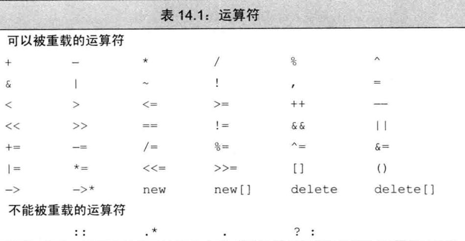

# 类总结

## 特殊成员函数

C++自动提供了下面这些成员函数：

-   默认构造函数，如果没有定义构造函数
-   默认析构函数，如果没有定义
-   复制构造函数，如果没有定义
-   赋值运算符，如果没有定义
-   地址运算符，如果没有定义

### 拷贝构造函数

如果一个构造函数的第一个参数是自身类类型的引用，且任何额外参数都有默认值，则此构造函数是拷贝构造函数。

拷贝构造函数的第一个参数必须是一个引用类型。虽然我们可以定义一个接受非const引用的拷贝构造函数，但此参数几乎总是一个const的引用。拷贝构造函数在几种情况下都会被隐式地使用。因此，拷贝构造函数通常不应该是explicit的。

#### 合成拷贝构造函数

每个成员的类型决定了它如何拷贝：对类类型的成员，会使用其拷贝构造函数来拷贝；内置类型的成员则直接拷贝。虽然我们不能直接拷贝一个数组，但合成拷贝构造函数会逐元素地拷贝一个数组类型的成员。如果数组元素是类类型，则使用元素的拷贝构造函数来进行拷贝。

#### 拷贝初始化


当使用直接初始化时，我们实际上是要求编译器使用普通的函数匹配来选择与我们提供的参数最匹配的构造函数。当我们使用拷贝初始化时，我们要求编译器将右侧运算对象拷贝到正在创建的对象中，如果需要的话还要进行类型转换。

拷贝初始化通常使用拷贝构造函数来完成。如果一个类有一个移动构造函数，则拷贝初始化有时会使用移动构造函数而非拷贝构造函数来完成。

拷贝初始化不仅在我们用=定义变量时会发生，在下列情况下也会发生：

-   将一个对象作为实参传递给一个非引用类型的形参
-   从一个返回类型为非引用类型的函数返回一个对象
-   用花括号列表初始化一个数组中的元素或一个聚合类中的成员

#### 编译器可以绕过拷贝构造函数

在拷贝初始化过程中，编译器可以（但不是必须）跳过拷贝/移动构造函数，直接创建
对象。即，编译器被允许将下面的代码

```
stringnull_book = "9-999-99999-9";//拷贝初始化
```

改写为

```
stringnull_book("9-999-99999-9");//编译器略过了拷贝构造函数
```

### 赋值运算符（又叫拷贝赋值运算符）

将已有的对象赋给另一个对象时，将使用重载的赋值运算符：

```cpp
StringBad headline1("Celery Stalks at Midnight");
...
StringBad knot;
knot = headlinel;// assignment operator invoked
```

初始化对象时，并不一定会使用赋值运算符：

```cpp
StringBad metoo = knot; // use copy constructor, possibly assignment, too
```

metoo是一个新创建的对象，被初始化为knot的值，因此使用复制构造函数。编译器实现也可能分两步来处理这条语句：使用复制构造函数创建一个临时对象，然后通过赋值将临时对象的值复制到新对象中。这就是说，初始化总是会调用复制构造函数，而使用=运算符时也**可能**调用赋值运算符。

```cpp
void test_StringBad2(){
    StringBad bad;
    StringBad bad1 = bad;
}
```

```
1: "C++" default object created
StringBad::StringBad(const StringBad &stringBad)
"C++" object deleted, 1 left
"C++" object deleted, 0 left
```

与复制构造函数相似，赋值运算符的隐式实现也对成员进行逐个复制。

**重要 重要 重要**

**如果类中包含了使用new初始化的指针成员，应当定义一个复制构造函数和赋值运算符，以复制指向的数据，而不是指针，这被称为深度复制。复制的另一种形式(成员复制或浅复制)只是复制指针值。浅复制仅浅浅地复制指针信息，而不会深入“挖掘”以复制指针引用的结构。**

**示例**

```cpp
StringBad::StringBad(const StringBad &stringBad) {
    len = stringBad.len;
    str = new char[len + 1];
    strcpy(str, stringBad.str);
    StringBad::num_strings++;
}

StringBad &StringBad::operator=(const StringBad &st) {
    if (this == &st) {
        return *this;
    }
    delete[] str;
    len = st.len;
    str = new char[len + 1];
    strcpy(str, st.str);
    return *this;
}
```

### 两者区别

看例子：

```cpp
void test_operaotr_1() {
    using namespace Chapter11;

    TestOperaotrClass operaotrClass1(1);
    cout << endl;
    TestOperaotrClass operaotrClass2;
    cout << endl;
    operaotrClass2 = operaotrClass1;
    cout << endl;
    TestOperaotrClass operaotrClass3 = operaotrClass1;
}

namespace Chapter11 {
    TestOperaotrClass::TestOperaotrClass() {
        cout << "默认构造函数" << endl;
        val = 0;
    }

    TestOperaotrClass::TestOperaotrClass(int val) {
        cout << "普通构造函数" << endl;
        this->val = val;
    }

    TestOperaotrClass::TestOperaotrClass(const TestOperaotrClass &testOperaotrClass) {
        cout << "复制构造函数" << endl;
        this->val = testOperaotrClass.val;
    }

    TestOperaotrClass &TestOperaotrClass::operator=(const TestOperaotrClass &testOperaotrClass) {
        cout << "赋值运算符" << endl;
        if (this == &testOperaotrClass) return *this;
        val = testOperaotrClass.val;
        return *this;
    }
}
```

```
普通构造函数

默认构造函数

赋值运算符

复制构造函数
```

### 析构函数

#### 什么时候会调用析构函数

无论何时一个对象被销毁，就会自动调用其析构函数：

-   变量在离开其作用域时被销毁。
-   当一个对象被销毁时，其成员被销毁。
-   容器（无论是标准库容器还是数组）被销毁时，其元素被销毁。
-   对于动态分配的对象，当对指向它的指针应用delete运算符时被销毁。
-   对于临时对象，当创建它的完整表达式结束时被销毁。

### 使用=default


### 阻止拷贝

#### 定义删除的函数

在新标准下，我们可以通过将拷贝构造函数和拷贝赋值运算符定义为删除的函数（deleted function）来阻止拷贝。删除的函数是这样一种函数：我们虽然声明了它们，但不能以任何方式使用它们。在函数的参数列表后面加上=delete来指出我们希望将它定义为删除的：

```c++
struct NoCopy{
	NoCopy() = default；
	//使用合成的默认构造函数
	NoCopy(const NoCopy&) =delete；
	NoCopy&operator=（constNoCopy&）= delete；
}
```

与=default的另一个不同之处是，我们可以对任何函数指定=delete（我们只能对编译器可以合成的默认构造函数或拷贝控制成员使用=default）。虽然删除函数的主要用途是禁止拷贝控制成员，但当我们希望引导函数匹配过程时，删除函数有时也是有用的。

#### 删除析构函数

可以删除析构函数，但相应的对象就不能删除了。

#### 合成的拷贝控制成员可能是删除的

对某些类来说，编译器将这些合成的成员定义为删除的函数：

-   如果类的某个成员的析构函数是删除的或不可访问的（例如，是private的），则类的合成析构函数被定义为删除的。
-   如果类的某个成员的拷贝构造函数是删除的或不可访问的，则类的合成拷贝构造函数被定义为删除的。如果类的某个成员的析构函数是删除的或不可访问的，则类合成的拷贝构造函数也被定义为删除的。
-   如果类的某个成员的拷贝赋值运算符是删除的或不可访问的，或是类有一个const的或引用成员，则类的合成拷贝赋值运算符被定义为删除的。
-   如果类的某个成员的析构函数是删除的或不可访问的，或是类有一个引用成员，它没有类内初始化器，或是类有一个const成员，它没有类内初始化器且其类型未显式定义默认构造函数，则该类的默认构造函数被定义为删除的。

本质上，这些规则的含义是：如果一个类有数据成员不能默认构造、拷贝、复制或销毁，则对应的成员函数将被定义为删除的。

#### private拷贝控制

在新标准发布之前，类是通过将其拷贝构造函数和拷贝赋值运算符声明为private的来阻止拷贝。

由于拷贝构造函数和拷贝赋值运算符是private的，用户代码将不能拷贝这个类型的对象。但是，
友元和成员函数仍旧可以拷贝对象。为了阻止友元和成员函数进行拷贝，我们将这些拷贝控制成员声明为private的，但并不定义它们。

声明但不定义一个成员函数是合法的，对此只有一个例外。试图访问一个未定义的成员将导致一个链接时错误。

### 交换操作swap

除了定义拷贝控制成员，管理资源的类通常还定义一个名为swap的函数。对于那些与重排元素顺序的算法一起使用的类，定义swap是非常重要的。这类算法在需要交换两个元素时会调用swap。

#### 编写我们自己的swap函数

```c++
class HasPtr {
	friend void swap(HasPtr&, HasPtr&);
	// ...
};

inline
void swap(HasPtr &lhs, HasPtr &rhs)
{
	using std::swap;
	swap(lhs.ps, rhs.ps); // swap the pointers, not the string data
	swap(lhs.i, rhs.i);   // swap the int members
}
```

## 对象移动

新标准的一个最主要的特性是可以移动而非拷贝对象的能力。在其中某些情况下，对象拷贝后就立即
被销毁了。在这些情况下，移动而非拷贝对象会大幅度提升性能。

### 右值引用

为了支持移动操作，新标准引入了一种新的引用类型——右值引用（rvalue reference）。所谓右值引用就是必须绑定到右值的引用。我们通过&&而不是&来获得右值引用。如我们将要看到的，右值引用有一个重要的性质——只能绑定到一个将要销毁的对象。因此，我们可以自由地将一个右值引用的资源“移动”到另一个对象中。

回忆一下，左值和右值是表达式的属性。一些表达式生成或要求左值，而另外一些则生成或要求右值。一般而言，一个左值表达式表示的是一个对象的身份，而一个右值表达式表示的是对象的值。

类似任何引用，一个右值引用也不过是某个对象的另一个名字而已。如我们所知，对于常规引用（为了与右值引用区分开来，我们可以称之为左值引用（Ivaluereference））


返回左值引用的函数，连同赋值、下标､解引用和前置递增/递减运算符，都是返回左值的表达式的例子。我们可以将一个左值引用绑定到这类表达式的结果上。

返回非引用类型的函数，连同算术､关系､位以及后置递增/递减运算符，都生成右值。我们不能将一个左值引用绑定到这类表达式上，但我们可以将一个const的左值引用或者一个右值引用绑定到这类表达式上。

```c++
/**
 * @brief 返回左值引用的函数
 */
inline static common::A& returnLvalueReference() {
  static common::A a;
  return a;
}

inline static common::A returnRvalueReference() {
  return common::A();
}

void testRvalueReference() {
  // 左值引用
  common::A &a1 = returnLvalueReference();
  // common::A &a2 = returnRvalueReference();  // 编译错误
  const common::A &a2 = returnRvalueReference();

  // 右值引用
  common::A &&a2 = returnRvalueReference();
}
```

变量是左值
变量可以看作只有一个运算对象而没有运算符的表达式，虽然我们很少这样看待变量。类似其他任何表达式，变量表达式也有左值/右值属性。变量表达式都是左值。带来的结果就是，我们不能将一个右值引用绑定到一个右值引用类型的变量上，这有些令人惊讶：

```
int&&rrl=42；//正确：字面常量是右值
int&&rr2=rr1；//错误：表达式rr1是左值!
```

#### 标准库move函数

虽然不能将一个右值引用直接绑定到一个左值上，但我们可以显式地将一个左值转换为对应的右值引用类型。我们还可以通过调用一个名为move的新标准库函数来获得绑定到左值上的右值引用，此函数定义在头文件utility中。

我们可以销毁一个移后源对象，也可以赋予它新值，但不能使用一个移后源对象的值。

### 移动构造函数和移动赋值运算符

类似拷贝构造函数，移动构造函数的第一个参数是该类类型的一个引用。不同于拷贝构造函数的是，这个引用参数在移动构造函数中是一个右值引用。与拷贝构造函数一样，任何额外的参数都必须有默认实参。

除了完成资源移动，移动构造函数还必须确保移后源对象处于这样一个状态销毁它是无害的。特别是，一旦资源完成移动，源对象必须不再指向被移动的资源——这些资源的所有权已经归属新创建的对象。

```c++
inline
StrVec::StrVec(StrVec &&s) noexcept  // move won't throw any exceptions
  // member initializers take over the resources in s
  : elements(s.elements), first_free(s.first_free), cap(s.cap)
{
	// leave s in a state in which it is safe to run the destructor
	s.elements = s.first_free = s.cap = nullptr;
}
```

与拷贝构造函数不同，移动构造函数不分配任何新內存；它接管给定的StrVec中的内存。在接管内存之后，它将给定对象中的指针都置为nullptr。这样就完成了从给定对象的移动操作，此对象将继续存在。最终，移后源对象会被销毁，意味着将在其上运行析构函数。

#### 移动操作、标准库容器和异常

由于移动操作“窃取”资源，它通常不分配任何资源。因此，移动操作通常不会抛出任何异常。当编写一个不抛出异常的移动操作时，我们应该将此事通知标准库。我们将看到，除非标准库知道我们的移动构造函数不会抛出异常，否则它会认为移动我们的类对象时可能会抛出异常，并且为了处理这种可能性而做一些额外的工作。

一种通知标准库的方法是在我们的构造函数中指明noexcept。

我们必须在类头文件的声明中和定义中（如果定义在类外的话）都指定noexcept。

不抛出异常的移动构造函数和移动赋值运算符必须标记为noexcept。

#### 移动赋值运算符

移动赋值运算符执行与析构函数和移动构造函数相同的工作。与移动构造函数一样，如果我们的移动赋值运算符不抛出任何异常，我们就应该将它标记为noexcept。

#### 合成的移动操作

合成移动操作的条件与合成拷贝操作的条件大不相同。

与拷贝操作不同，编译器根本不会为某些类合成移动操作。特别是，如果一个类定义了自己的拷贝构造函数、拷贝赋值运算符或者析构函数，编译器就不会为它合成移动构造函数和移动赋值运算符了。

只有当一个类没有定义任何自己版本的拷贝控制成员，且类的每个非static数据成员都可以移动时，编译器才会为它合成移动构造函数或移动赋值运算符。

与拷贝操作不同，移动操作永远不会隐式定义为删除的函数。但是，如果我们显式地要求编译器生成=default的移动操作，且编译器不能移动所有成员，则编译器会将移动操作定义为删除的函数。除了一个重要例外，什么时候将合成的移动操作定义为删除的函数遵循与定义删除的合成拷贝操作类似的原则：

-   与拷贝构造函数不同，移动构造函数被定义为删除的函数的条件是：有类成员定义了自己的拷贝构造函数且未定义移动构造函数，或者是有类成员未定义自己的拷贝构造函数且编译器不能为其合成移动构造函数。移动赋值运算符的情况类似。
-   如果有类成员的移动构造函数或移动赋值运算符被定义为删除的或是不可访问的，则类的移动构造函数或移动赋值运算符被定义为删除的。
-   类似拷贝构造函数，如果类的析构函数被定义为删除的或不可访问的，则类的移动构造函数被定义为删除的。（存疑）
-   类似拷贝赋值运算符，如果有类成员是const的或是引用，则类的移动赋值运算符被定义为删除的。

#### 移动右值，拷贝左值

```c++
StrVec v1，v2;	
v1 = v2;					//v2是左值；使用拷贝赋值
StrVec getVec(istream&);	//getVec返回一个右值
v2 = getVec(cin);			//getVec（cin）是一个右值；使用移动赋值
```

#### 如果没有移动构造函数，右值也被拷贝

如果一个类没有移动构造函数，函数匹配规则保证该类型的对象会被拷贝，即使我们试图通过调用move来移动它们时也是如此。

### 右值引用和成员函数

#### 右值和左值引用成员函数

通常，我们在一个对象上调用成员函数，而不管该对象是一个左值还是一个右值。例如：

```
string s1 = "avalue", s2 = "another";
auto n = (s1 + s2).find('a');
```

此例中，我们在一个string右值上调用find成员，该string右值是通过连接两个string而得到的。有时，右值的使用方式可能令人惊讶：

```
s1 + s2 = "wow!";
```

此处我们对两个string的连接结果——一个右值，进行了赋值。

在旧标准中，我们没有办法阻止这种使用方式。为了维持向后兼容性，新标准库类仍然允许向右值赋值。但是，我们可能希望在自己的类中阻止这种用法。在此情况下，我们希望强制左侧运算对象（即，this指向的对象）是一个左值。

我们指出this的左值/右值属性的方式与定义const成员函数相同，即，在参数列表后放置一个引用限定符（reference qualifier）：


引用限定符可以是&或&&，分别指出this可以指向一个左值或右值。类似const限定符，引用限定符只能用于（非static）成员函数，且必须同时出现在函数的声明和定义中。

对于&限定的函数，我们只能将它用于左值；对于&&限定的函数，只能用于右值：


一个函数可以同时用const和引用限定｡在此情况下，引用限定符必须跟随在const限定符之后。

#### 重载和引用函数

就像一个成员函数可以根据是否有const来区分其重载版本一样，引用限定符也可以区分重载版本。


当我们定义const成员函数时，可以定义两个版本，唯一的差别是一个版本有const限定而另一个没有。引用限定的函数则不一样。如果我们定义两个或两个以上具有相同名字和相同参数列表的成员函数，就必须对所有函数都加上引用限定符，或者所有都不加：


如果一个成员函数有引用限定符，则具有相同参数列表的所有版本都必须有引用限定符。

## 重载运算符

### 基本概念

重载的运算符是具有特殊名字的函数：它们的名字由关键字operator和其后要定义的运算符号共同组成。和其他函数一样，重载的运算符也包含返回类型、参数列表以及函数体。

重载运算符函数的参数数量与该运算符作用的运算对象数量一样多。一元运算符有一个参数，二元运算符有两个。对于二元运算符来说，左侧运算对象传递给第一个参数，而右侧运算对象传递给第二个参数。除了重载的函数调用运算符operator()之外，其他重载运算符不能含有默认实参。

如果一个运算符函数是成员函数，则它的第一个（左侧）运算对象绑定到隐式的this指针上，因此，成员运算符函数的（显式）参数数量比运算符的运算对象总数少一个。

对于一个运算符函数来说，它或者是类的成员，或者至少含有一个类类型的参数：

```
// 错误：不能为int重定义内置的运算符
int operator+(int,int);
```

这一约定意味着当运算符作用于内置类型的运算对象时，我们无法改变该运算符的含义。

我们可以重载大多数（但不是全部）运算符。我们只能重载已有的运算符，而无权发明新的运算符号。



#### 直接调用一个重载的运算符函数

我们也能像调用普通函数一样直接调用运算符函数，先指定函数名字，然后传入数量正确、类型适当的实参：

```
data1 + data2;
operator+(data1, data2);
```

我们像调用其他成员函数一样显式地调用成员运算符函数。具体做法是，首先指定运行函数的对象（或指针）的名字，然后使用点运算符（或箭头运算符）访问希望调用的函数：

```
data1 += data2;
data1.operator+=(data2);
```

#### 某些运算符不应该被重载

通常情况下，不应该重载逗号、取地址、逻辑与和逻辑或运算符。

#### 使用与内置类型一致的含义

#### 赋值和复合赋值运算符

赋值运算符的行为与复合版本的类似：赋值之后，左侧运算对象和右侧运算对象的值相等，并且运算符应该返回它左侧运算对象的一个引用。重载的赋值运算应该继承而非违背其內置版本的含义。

### 输入和输出运算符

#### 重载输出运算符<<

通常情况下，输出运算符的第一个形参是一个非常量ostream对象的引用。之所以ostream是非常量是因为向流写入内容会改变其状态；而该形参是引用是因为我们无法直接复制一个ostream对象。

第二个形参一般来说是一个常量的引用，该常量是我们想要打印的类类型。第二个形参是引用的原因是我们希望避免复制实参；而之所以该形参可以是常量是因为（通常情况下）打印对象不会改变对象的内容。

为了与其他输出运算符保持一致，operator<<一般要返回它的ostream形参。

### 赋值运算符（花括号赋值）

```c++
inline
StrVec &StrVec::operator=(std::initializer_list<std::string> il)
{
	// alloc_n_copy allocates space and copies elements from the given range
	auto data = alloc_n_copy(il.begin(), il.end());
	free();   // destroy the elements in this object and free the space
	elements = data.first; // update data members to point to the new space
	first_free = cap = data.second;
	return *this;
}
```

### 递增和递减运算符

#### 区分前置和后置运算符

```c++
/**
 * @brief 测试重载运算符
 *
 */
class MyOperatorClass {
  friend std::ostream &operator<<(std::ostream &out,
                                  const MyOperatorClass &obj);

 private:
  int val;

 public:
  MyOperatorClass(int v) : val(v) {}

  /**
   * @brief 前置++运算符
   */
  MyOperatorClass &operator++() {
    ++val;
    return *this;
  }

  /**
   * @brief 后置++运算符
   */
  MyOperatorClass operator++(int) {
    MyOperatorClass obj = *this;
    val++;
    return obj;
  }
};

inline std::ostream &operator<<(std::ostream &out, const MyOperatorClass &obj) {
  out << obj.val;
  return out;
}

/**
 * @brief 测试重置运算符
 * 
 */
static void testOperator();
```

```c++
void testOperator() {
  {
    int v1 = 1;
    std::cout << v1++ << std::endl;

    int v2 = 1;
    std::cout << ++v2 << std::endl;
  }
  {
    MyOperatorClass v1(1);
    std::cout << v1++ << std::endl;

    MyOperatorClass v2(1);
    std::cout << ++v2 << std::endl;
  }
}
```

```
1
2
1
2
```

要想同时定义前置和后置运算符，必须首先解决一个问题，即普通的重载形式无法区分这两种情况。前置和后置版本使用的是同一个符号，意味着其重载版本所用的名字将是相同的，并且运算对象的数量和类型也相同。

为了解决这个问题，后置版本接受一个额外的（不被使用）int类型的形参。当我们使用后置运算符时，编译器为这个形参提供一个值为0的实参。尽管从语法上来说后置函数可以使用这个额外的形参，但是在实际过程中通常不会这么做。这个形参的唯一作用就是区分前置版本和后置版本的函数，而不是真的要在实现后置版本时参与运算。

### 函数调用运算符

如果类重载了函数调用运算符，则我们可以像使用函数一样使用该类的对象。

```c++
struct absInt {
    int operator()(int val) const {
        return val < 0 ? -val : val;
    }
};
```


函数调用运算符必须是成员函数。一个类可以定义多个不同版本的调用运算符，相互之间应该在参数数量或类型上有所区别。

如果类定义了调用运算符，则该类的对象称作函数对象（function object）。因为可以调用这种对象，所以我们说这些对象的“行为像函数一样”。

#### lambda是函数对象

当我们编写了一个lambda后，编译器将该表达式翻译成一个未命名类的未命名对象。

#### 可调用对象与function

C++语言中有几种可调用的对象：函数、函数指针、lambda表达式（参见10。3。2节，
第346页）、bind创建的对象（参见10。3。4节，第354页）以及重载了函数调用运算符的类。
和其他对象一样，可调用的对象也有类型。例如，每个lambda有它自己唯一的（未
命名）类类型；函数及函数指针的类型则由其返回值类型和实参类型决定，等等。
然而，两个不同类型的可调用对象却可能共享同一种调用形式（callsignature）。调用
形式指明了调用返回的类型以及传递给调用的实参类型。一种调用形式对应一个函数类
型，例如：
int（int，int）
是一个函数类型，它接受两个int、返回一个int。
不同类型可能具有相同的调用形式
对于几个可调用对象共享同一种调用形式的情况，有时我们会希望把它们看成具有相
同的类型。例如，考虑下列不同类型的可调用对象：
//普通函数
intadd（inti，intj）{returni+j；}
//lambda，其产生一个未命名的函数对象类
automod=[]（inti，intj）{returni%j；}；
//函数对象类
structdivide{
intoperator（）（intdenominator，intdivisor）{
returndenominator/divisor；
}
}；
上面这些可调用对象分别对其参数执行了不同的算术运算，尽管它们的类型各不相同，但
是共享同一种调用形式：
int（int，int）
我们可能希望使用这些可调用对象构建一个简单的桌面计算器。为了实现这一目的，
需要定义一个函数表（functiontable）用于存储指向这些可调用对象的“指针”。当程序需
要执行某个特定的操作时，从表中查找该调用的函数。
在C++语言中，函数表很容易通过map来实现。对于此例来说，我们使用一个表示
运算符符号的string对象作为关键字；使用实现运算符的函数作为值。当我们需要求给
定运算符的值时，先通过运算符索引map，然后调用找到的那个元素。
假定我们的所有函数都相互独立，并且只处理关于int的二元运算，则map可以定
义成如下的形式：
//构建从运算符到函数指针的映射关系，其中函数接受两个int、返回一个int
map<string，int（*）（int，int）>binops；
我们可以按照下面的形式将add的指针添加到binops中：
//正确：add是一个指向正确类型函数的指针
binops。insert（{"+"，add}）；//{"+"，add}是一个pair（参见11。2。3节，379页）
但是我们不能将mod或者divide存入binops：
511
577

Page538
512
C++
11
binops。insert（{"%"，mod}）；
//错误：mod不是一个函数指针
问题在于mod是个lambda表达式，而每个lambda有它自己的类类型，该类型与存储在
binops中的值的类型不匹配。
标准库function类型
我们可以使用一个名为function的新的标准库类型解决上述问题，function定
义在functional头文件中，表14。3列举出了function定义的操作。
function<T>f；
function<T>f（nullptr）；
function<T>f（obj）；
first_argument_type
second_argument_type
第14章重载运算与类型转换
表14。3：function的操作
f是一个用来存储可调用对象的空function，这些可调用对
象的调用形式应该与函数类型T相同（即T是retType（args））
显式地构造一个空function
f
f（args）
定义为function<T>的成员的类型
result_type
argument_type
在f中存储可调用对象obj的副本
将f作为条件：当f含有一个可调用对象时为真；否则为假
调用f中的对象，参数是args
该function类型的可调用对象返回的类型
当T有一个或两个实参时定义的类型。如果T只有一个实参，
则argument_type是该类型的同义词；如果T有两个实参，
first_argument_type1second_argument_type
分别代表两个实参的类型
function是一个模板，和我们使用过的其他模板一样，当创建一个具体的
function类型时我们必须提供额外的信息。在此例中，所谓额外的信息是指该
function类型能够表示的对象的调用形式。参考其他模板，我们在一对尖括号内指定类
型：
function<int（int，int）>
在这里我们声明了一个function类型，它可以表示接受两个int、返回一个int的可
调用对象。因此，我们可以用这个新声明的类型表示任意一种桌面计算器用到的类型；
function<int（int，int）>f1=add；
function<int（int，int）>f2=divide（）；
cout<<f1（4，2）<<endl；
cout<<f2（4，2）<<endl；
cout<<f3（4，2）<<endl；
function<int（int，int）>f3=[]（inti，intj）//lambda
{returni*j；}；
//打印6
//打印2
//打印8
//函数指针
//函数对象类的对象
578使用这个function类型我们可以重新定义map：
//列举了可调用对象与二元运算符对应关系的表格
//所有可调用对象都必须接受两个int、返回一个int
//其中的元素可以是函数指针、函数对象或者lambda
map<string，function<int（int，int）>>binops；
我们能把所有可调用对象，包括函数指针、lambda或者函数对象在内，都添加到这个map
中：

Page539
14。8函数调用运算符
map<string，function<int（int，int）>>binops={
{"+"，add}，
{"-"，std：：minus<int>（）}，
{"/"，divide（）}，
{"*"，[]（inti，intj）{returni*j；}}，
{"%"，mod}}；
我们的map中包含5个元素，尽管其中的可调用对象的类型各不相同，我们仍然能够把
所有这些类型都存储在同一个function<int（int，int）>类型中。
一如往常，当我们索引map时将得到关联值的一个引用。如果我们索引binops，将
得到function对象的引用。function类型重载了调用运算符，该运算符接受它自己
的实参然后将其传递给存好的可调用对象：
//函数指针
//标准库函数对象
//用户定义的函数对象
//未命名的lambda
//命名了的lambda对象
binops["+"]（10，5）；//调用add（10，5）
binops["-"]（10，5）；//使用minus<int>对象的调用运算符
binops["/"]（10，5）；//使用divide对象的调用运算符
binops["*"]（10，5）；//调用lambda函数对象
binops["%"]（10，5）；//调用lambda函数对象
我们依次调用了binops中存储的每个操作。在第一个调用中，我们获得的元素存放着一
个指向add函数的指针，因此调用binops["+"]（10，5）实际上是使用该指针调用add，
并传入10和5。在接下来的调用中，binops["-"j返回一个存放着std：：minus<int>
类型对象的function，我们将执行该对象的调用运算符。
重载的函数与function
我们不能（直接）将重载函数的名字存入function类型的对象中：
intadd（inti，intj）{returni+j；}
Sales_dataadd（constSales_data&，constSales_data&）；
map<string，function<int（int，int）>>binops；
binops。insert（{"+"，add}）；
int（*fp）（int，int）=add；
binops。insert（{"+"，fp}）；
//错误：哪个add?
解决上述二义性问题的一条途径是存储函数指针（参见6。7节，第221页）而非函数的
名字：
Note
//指针所指的add是接受两个int的版本
//正确：fp指向一个正确的add版本
同样，我们也能使用lambda来消除二义性：
//正确：使用lambda来指定我们希望使用的add版本
binops。insert（{"+"，[]（inta，intb）{returnadd（a，b）；}}）；
lambda内部的函数调用传入了两个int，因此该调用只能匹配接受两个int的add版本，
而这也正是执行lambda时真正调用的函数。
新版本标准库中的function类与旧版本中的unary_function和
binary_function没有关联，后两个类已经被更通用的bind函数替代了（参
见10。3。4节，第357页）。
513
579

Page540
514
580
14。8。3节练习
练习14。44：编写一个简单的桌面计算器使其能处理二元运算。
14。9重载、类型转换与运算符
在7。5。4节（第263页）中我们看到由一个实参调用的非显式构造函数定义了一种隐
式的类型转换，这种构造函数将实参类型的对象转换成类类型。我们同样能定义对于类类
型的类型转换，通过定义类型转换运算符可以做到这一点。转换构造函数和类型转换运算
符共同定义了类类型转换（class-typeconversions），这样的转换有时也被称作用户定义的
类型转换（user-definedconversions）。
14。9。1类型转换运算符
类型转换运算符（conversionoperator）是类的一种特殊成员函数，它负责将一个类类
型的值转换成其他类型。类型转换函数的一般形式如下所示：
operatortype（）const；
其中type表示某种类型。类型转换运算符可以面向任意类型（除了void之外）进行定义，
只要该类型能作为函数的返回类型（参见6。1节，第184页）。因此，我们不允许转换成数
组或者函数类型，但允许转换成指针（包括数组指针及函数指针）或者引用类型。
类型转换运算符既没有显式的返回类型，也没有形参，而且必须定义成类的成员函数。
类型转换运算符通常不应该改变待转换对象的内容，因此，类型转换运算符一般被定义成
const成员。
Note
一个类型转换函数必须是类的成员函数；它不能声明返回类型，形参列表也必
须为空。类型转换函数通常应该是const。
第14章重载运算与类型转换
定义含有类型转换运算符的类
举个例子，我们定义一个比较简单的类，令其表示0到255之间的一个整数：
classSmallInt{
public：
SmallInt（inti=0）：val（i）
{
}
operatorint（）const{returnval；}
private：
if（i<0||i>255）
throwstd：：out_of_range（"BadSmallIntvalue"）；
std：：sizetval；
}；
我们的SmallInt类既定义了向类类型的转换，也定义了从类类型向其他类型的转换。
其中，构造函数将算术类型的值转换成SmallInt对象，而类型转换运算符将SmallInt
对象转换成int：
SmallIntsi；

Page541
14。9重载、类型转换与运算符
si=
4；
si+3；
//首先将4隐式地转换成SmallInt，然后调用SmallInt：：operator=
//首先将si隐式地转换成int，然后执行整数的加法
尽管编译器一次只能执行一个用户定义的类型转换（参见4。11。2节，第144页），但
是隐式的用户定义类型转换可以置于一个标准（内置）类型转换之前或之后（参见4。11。1
节，第141页），并与其一起使用。因此，我们可以将任何算术类型传递给SmallInt的
构造函数。类似的，我们也能使用类型转换运算符将一个SmallInt对象转换成int，
然后再将所得的int转换成任何其他算术类型：
//内置类型转换将double实参转换成int
SmallIntsi=3。14；
//SmallInt的类型转换运算符将si转换成int
si+3。14；
classSmallInt；
operatorint（SmallInt&）；
classSmallInt{
public：
}；
//调用SmallInt（int）构造函数
因为类型转换运算符是隐式执行的，所以无法给这些函数传递实参，当然也就不能在类型
转换运算符的定义中使用任何形参。同时，尽管类型转换函数不负责指定返回类型，但实
际上每个类型转换函数都会返回一个对应类型的值：
//内置类型转换将所得的int继续转换成double
//错误：不是成员函数
intoperatorint（）const；
//错误：指定了返回类型
operatorint（int。0）const；
//错误：参数列表不为空
operatorint*（）const{return42；}//错误：42不是一个指针
提示：避免过度使用类型转换函数
和使用重载运算符的经验一样，明智地使用类型转换运算符也能极大地简化类设计
者的工作，同时使得使用类更加容易。然而，如果在类类型和转换类型之间不存在明显
的映射关系，则这样的类型转换可能具有误导性。
例如，假设某个类表示Date，我们也许会为它添加一个从Date到int的转换。
然而，类型转换函数的返回值应该是什么?一种可能的解释是，函数返回一个十进制数，
依次表示年、月、日，例如，July30，1989可能转换为int值19890730。同时还存在
另外一种合理的解释，即类型转换运算符返回的int表示的是从某个时间节点（比如
January1，1970）开始经过的天数。显然这两种理解都合情合理，毕竟从形式上看它们
产生的效果都是越靠后的日期对应的整数值越大，而且两种转换都有实际的用处。
问题在于Date类型的对象和int类型的值之间不存在明确的一对一映射关系。因
此在此例中，不定义该类型转换运算符也许会更好。作为替代的手段，类可以定义一个
或多个普通的成员函数以从各种不同形式中提取所需的信息。
515
在C++标准的早期版本中，如果类想定义一个向bool的类型转换，则它常常遇到一
个问题：因为bool是一种算术类型，所以类类型的对象转换成bool后就能被用在任何
581
类型转换运算符可能产生意外结果
在实践中，类很少提供类型转换运算符。在大多数情况下，如果类型转换自动发生，
用户可能会感觉比较意外，而不是感觉受到了帮助。然而这条经验法则存在一种例外情况：582
对于类来说，定义向bool的类型转换还是比较普遍的现象。

Page542


Page543


Page544
518
585
}；
structB{
operatorA（）const；//也是把一个B转换成A
//其他数据成员
}；
Af（constA&）；
Bb；
Aa=f（b）；//二叉性错误：含义是f（B：：operatorA（））
//还是f（A：：A（constB&））?
因为同时存在两种由B获得A的方法，所以造成编译器无法判断应该运行哪个类型转换，
也就是说，对f的调用存在二义性。该调用可以使用以B为参数的A的构造函数，也可
以使用B当中把B转换成A的类型转换运算符。因为这两个函数效果相当、难分伯仲，
所以该调用将产生错误。
第14章重载运算与类型转换
如果我们确实想执行上述的调用，就不得不显式地调用类型转换运算符或者转换构造
函数：
Aal=
Aa2=f（A（b））；
f（b。operatorA（））；//正确：使用B的类型转换运算符
//正确：使用A的构造函数
值得注意的是，我们无法使用强制类型转换来解决二义性问题，因为强制类型转换本身也
面临二义性。
二义性与转换目标为内置类型的多重类型转换
另外如果类定义了一组类型转换，它们的转换源（或者转换目标）类型本身可以通过
其他类型转换联系在一起，则同样会产生二义性的问题。最简单也是最困扰我们的例子就
是类当中定义了多个参数都是算术类型的构造函数，或者转换目标都是算术类型的类型转
换运算符。
例如，在下面的类中包含两个转换构造函数，它们的参数是两种不同的算术类型；同
时还包含两个类型转换运算符，它们的转换目标也恰好是两种不同的算术类型：
structA{
A（int
//最好不要创建两个转换源都是算术类型的类型转换
A（double）；
operatorint（）const；//最好不要创建两个转换对象都是算术类型的类型转换
operatordouble（）const；
//其他成员
0）；
}；
voidf2（longdouble）；
Aa；
f2（a）；
longlg；
Aa2（lg）；
//二义性错误：含义是f（A：：operatorint（））
//还是f（A：：operatordouble（））?
//二叉性错误：含义是A：：A（int）还是A：：A（double）?
在对f2的调用中，哪个类型转换都无法精确匹配longdouble。然而这两个类型转换都
可以使用，只要后面再执行一次生成longdouble的标准类型转换即可。因此，在上面
的两个类型转换中哪个都不比另一个更好，调用将产生二义性。

Page545
14。9重载、类型转换与运算符
当我们试图用long初始化a2时也遇到了同样问题，哪个构造函数都无法精确匹配
long类型。它们在使用构造函数前都要求先将实参进行类型转换：
先执行long到double的标准类型转换，再执行A（double）
先执行long到int的标准类型转换，再执行A（int）
编译器没办法区分这两种转换序列的好坏，因此该调用将产生二义性。
调用f2及初始化a2的过程之所以会产生二义性，根本原因是它们所需的标准类型
转换级别一致（参见6。6。1节，第219页）。当我们使用用户定义的类型转换时，如果转换
过程包含标准类型转换，则标准类型转换的级别将决定编译器选择最佳匹配的过程：
shorts=42；
//把short提升成int优于把short转换成double
Aa3（s）；
//使用A：：A（int）
在此例中，把short提升成int的操作要优于把short转换成double的操作，因此
编译器将使用A：：A（int）构造函数构造a3，其中实参是s（提升后）的值。
Note
当我们使用两个用户定义的类型转换时，如果转换函数之前或之后存在标准类
型转换，则标准类型转换将决定最佳匹配到底是哪个。
提示：类型转换与运算符
要想正确地设计类的重载运算符、转换构造函数及类型转换函数，必须加倍小心。
尤其是当类同时定义了类型转换运算符及重载运算符时特别容易产生二义性。以下的经
验规则可能对你有所帮助：
•不要令两个类执行相同的类型转换：如果Foo类有一个接受Bar类对象的构造
函数，则不要在Bar类中再定义转换目标是Foo类的类型转换运算符。
•避免转换目标是內置算术类型的类型转换。特别是当你已经定义了一个转换成算
术类型的类型转换时，接下来
不要再定义接受算术类型的重载运算符。如果用户需要使用这样的运算符，
则类型转换操作将转换你的类型的对象，然后使用内置的运算符。
不要定义转换到多种算术类型的类型转换。让标准类型转换完成向其他算术
类型转换的工作。
一言以蔽之：除了显式地向bool类型的转换之外，我们应该尽量避免定义类型转换函
数并尽可能地限制那些“显然正确”的非显式构造函数。
重载函数与转换构造函数
当我们调用重载的函数时，从多个类型转换中进行选择将变得更加复杂。如果两个或
多个类型转换都提供了同一种可行匹配，则这些类型转换一样好。
举个例子，当几个重载函数的参数分属不同的类类型时，如果这些类恰好定义了同样
的转换构造函数，则二义性问题将进一步提升：
structC{
C（int）；
//其他成员
519
586

Page546
520
}；
structD{
D（int）；
//其他成员
WARNING
}；
voidmanip（constC&）；
voidmanip（constD&）；
manip（10）；
//二叉性错误：含义是manip（C（10））还是manip（D（10））
其中C和D都包含接受int的构造函数，两个构造函数各自匹配manip的一个版本。因
此调用将具有二义性：它的含义可能是把int转换成C，然后调用manip的第一个版本；
也可能是把int转换成D，然后调用manip的第二个版本。
调用者可以显式地构造正确的类型从而消除二义性：
manip（C（10））；//正确：调用manip（constC&）
第14章重载运算与类型转换
如果在调用重载函数时我们需要使用构造函数或者强制类型转换来改变实参
的类型，则这通常意味着程序的设计存在不足。
重载函数与用户定义的类型转换
当调用重载函数时，如果两个（或多个）用户定义的类型转换都提供了可行匹配，则
587我们认为这些类型转换一样好。在这个过程中，我们不会考虑任何可能出现的标准类型转
换的级别。只有当重载函数能通过同一个类型转换函数得到匹配时，我们才会考虑其中出
现的标准类型转换。
例如当我们调用manip时，即使其中一个类定义了需要对实参进行标准类型转换的
构造函数，这次调用仍然会具有二义性：
structE{
E（double）；
//其他成员
voidmanip2（constC&）；
voidmanip2（constE&）；
//二叉性错误：两个不同的用户定义的类型转换都能用在此处
manip2（10）；
//含义是manip2（C（10））还是manip2（E（double（10）））
在此例中，c有一个转换源为int的类型转换，E有一个转换源为double的类型转换。
对于manip2（10）来说，两个manip2函数都是可行的：
•manip2（constC&）是可行的，因为c有一个接受int的转换构造函数，该构造
函数与实参精确匹配。
•manip2（constE&）是可行的，因为E有一个接受double的转换构造函数，而
且为了使用该函数我们可以利用标准类型转换把int转换成所需的类型。
因为调用重载函数所请求的用户定义的类型转换不止一个且彼此不同，所以该调用具有二
义性。即使其中一个调用需要额外的标准类型转换而另一个调用能精确匹配，编译器也会
将该调用标示为错误。

Page547
14。9重载、类型转换与运算符
Note
14。9。2节练习
练习14。50：在初始化ex1和ex2的过程中，可能用到哪些类类型的转换序列呢?说
明初始化是否正确并解释原因。
在调用重载函数时，如果需要额外的标准类型转换，则该转换的级别只有当所
有可行函数都请求同一个用户定义的类型转换时才有用。如果所需的用户定义
的类型转换不止一个，则该调用具有二义性。
structLongDouble{
}；
LongDouble（double=0。0）；
operatordouble（）；
operatorfloat（）；
LongDoubleldObj；
intex1=ldObj；
floatex2=ldObj；
练习14。51：在调用calc的过程中，可能用到哪些类型转换序列呢?说明最佳可行函
数是如何被选出来的。
voidcalc（int）；
voidcalc（LongDouble）；
doubledval；
calc（dval）；
//哪个calc?
14。9。3函数匹配与重载运算符
重载的运算符也是重载的函数。因此，通用的函数匹配规则（参见6。4节，第208页）
同样适用于判断在给定的表达式中到底应该使用内置运算符还是重载的运算符。不过当运
算符函数出现在表达式中时，候选函数集的规模要比我们使用调用运算符调用函数时更
大。如果a是一种类类型，则表达式asymb可能是
a。operatorsym（b）；//a有一个operatorsym成员函数
operatorsym（a，b）；//operatorsym是一个普通函数
Note
和普通函数调用不同，我们不能通过调用的形式来区分当前调用的是成员函数还是非成员
函数。
当我们使用重载运算符作用于类类型的运算对象时，候选函数中包含该运算符的普通588
非成员版本和内置版本。除此之外，如果左侧运算对象是类类型，则定义在该类中的运算
符的重载版本也包含在候选函数内。
当我们调用一个命名的函数时，具有该名字的成员函数和非成员函数不会彼此重载，
这是因为我们用来调用命名函数的语法形式对于成员函数和非成员函数来说是不相同的。
当我们通过类类型的对象（或者该对象的指针及引用）进行函数调用时，只考虑该类的成
员函数。而当我们在表达式中使用重载的运算符时，无法判断正在使用的是成员函数还是
非成员函数，因此二者都应该在考虑的范围内。
表达式中运算符的候选函数集既应该包括成员函数，也应该包括非成员函数。
521

Page548
522
举个例子，我们为SmallInt类定义一个加法运算符：
classSmallInt{
public：
}；
friend。
SmallIntoperator+（constSmallInt&，constSmallInt&）；
private：
SmallInt（int=0）；
//转换源为int的类型转换
operatorint（）const{returnval；}//转换目标为int的类型转换
std：：size_tval；
WARNING
第14章重载运算与类型转换
589可以使用这个类将两个SmallInt对象相加，但如果我们试图执行混合模式的算术运算，
就将遇到二义性的问题：
SmallInts1，s2；
SmallInts3=s1+s2；
inti=s3+0；
第一条加法语句接受两个SmallInt值并执行+运算符的重载版本。第二条加法语句具有
二义性：因为我们可以把0转换成SmallInt，然后使用SmallInt的+；或者把s3转
换成int，然后对于两个int执行内置的加法运算。
//使用重载的operator+
//二叉性错误
如果我们对同一个类既提供了转换目标是算术类型的类型转换，也提供了重载
的运算符，则将会遇到重载运算符与内置运算符的二义性问题。
14。9。3节练习
练习14。52：在下面的加法表达式中分别选用了哪个operator+?列出候选函数、可
行函数及为每个可行函数的实参执行的类型转换：
structLongDouble{
//用于演示的成员operator+；在通常情况下+是个非成员
LongDoubleoperator+（constSmallInt&）；
//其他成员与14。9。2节（第521页）一致
LongDoubleld；
ld=si+ld；
ld=ld+si；
LongDoubleoperator+（LongDouble&，double）；
SmallIntsi；
SmallInts1；
doubled=s1+3。14；
练习14。53：假设我们已经定义了如第522页所示的SmallInt，判断下面的加法表达
式是否合法。如果合法，使用了哪个加法运算符?如果不合法，应该怎样修改代码才能
使其合法?

Page549
小结
小结
一个重载的运算符必须是某个类的成员或者至少拥有一个类类型的运算对象。重载运
算符的运算对象数量、结合律、优先级与对应的用于内置类型的运算符完全一致。当运算
符被定义为类的成员时，类对象的隐式this指针绑定到第一个运算对象。赋值、下标、
函数调用和箭头运算符必须作为类的成员。
如果类重载了函数调用运算符operator（），则该类的对象被称作“函数对象”。这
样的对象常用在标准函数中。lambda表达式是一种简便的定义函数对象类的方式。
在类中可以定义转换源或转换目的是该类型本身的类型转换，这样的类型转换将自动
执行。只接受单独一个实参的非显式构造函数定义了从实参类型到类类型的类型转换；而
非显式的类型转换运算符则定义了从类类型到其他类型的转换。
术语表
调用形式（callsignature）表示一个可调
用对象的接口。在调用形式中包括返回类
型以及一个实参类型列表，该列表在一对
圆括号内，实参类型之间以逗号分隔。
类类型转换（class-typeconversion）包括
由构造函数定义的从其他类型到类类型的
转换以及由类型转换运算符定义的从类类
型到其他类型的转换。只接受单独一个实
参的非显式构造函数定义了从实参类型到
类类型的转换；而类型转换运算符则定义
了从类类型到某个指定类型的转换。
类型转换运算符（conversionoperator）是
类的成员函数，定义了从类类型到其他类
型的转换。类型转换运算符必须是它要转
换的类的成员，并且通常被定义为常量成
员。这类运算符既没有返回类型，也不接
受参数。它们返回一个可变为转换运算符
类型的值，也就是说，operatorint返
回一个int，operatorstring返回一
个string，依此类推。
显式的类型转换运算符（explicitconversion
operator）由关键字explicit限定的类
型转换运算符。这样的运算符用于条件中
的隐式类型转换。
函数对象（functionobject）定义了重载调
用运算符的对象。在需要使用函数的地方
都能使用函数对象。
函数表（functiontable）形如map或
vector的容器，容器中所存的值可以被
调用。
函数模板（functiontemplate）能够表示任
意可调用类型的标准库模板。
重载的运算符（overloadedoperator）重
定义了某种内置运算符的含义的函数。重
载的运算符函数含有关键字operator，
之后是要定义的符号。重载的运算符必须
含有至少一个类类型的运算对象。重载运
算符的优先级、结合律、运算对象数量都
与其内置版本一致。
用户定义的类型转换（user-defined
conversion）类类型转换的同义词。
523
590

Page550

# explicit

```cpp
Chapter11 demo1 = 1.1;

string abc = "acb";
Chapter11 demo2 = abc;


Chapter11(double d);
Chapter11(const string &s);
```

C++可以隐式类型转换，如果要禁止这种行为，可以在构造函数前加explicit关键字。

```cpp
explicit Chapter11(double d);
```

只能在类内声明构造函数时使用explicit关键字，在类外部定义时不应重复。

可以用static_cast强制隐式构造。

## 聚合类

聚合类使得用户可以直接访问其成员，并且具有特殊的初始化语法形式。当一个类满足如下条件时，我们说它是聚合的：

-   所有成员都是public的。
-   没有定义任何构造函数。
-   没有类内初始值。
-   没有基类，也没有virtual函数。

```cpp
struct Data {
	int		ival;
	string 	s;
}
```

我们可以提供一个花括号括起来的成员初始值列表，并用它初始化聚合类的数据成员：

```
Data val1 = {0，"Anna"};
```

初始值的顺序必须与声明的顺序一致，也就是说，第一个成员的初始值要放在第一个，然后是第二个，以此类推。

# 继承总结

C++中复用代码的一个方式是组合，即类内部持有某一类的对象，另一个方式就是继承。

## 初始化顺序

当初始化列表包含多个项目时，这些项目被初始化的顺序为它们被声明的顺序，而不是它们在初始化列表中的顺序。例如，假设Student构造函数如下：

```cpp
Student (const char * str, const double *pd, int n) : scores(pd, n)，name (str) {}
```


则name成员仍将首先被初始化，因为在类定义中它首先被声明。如果代码使用一个成员的值作为另一个成员的初始化表达式的一部分时，初始化顺序就非常重要。

## 私有继承

使用私有继承，基类的公有成员和保护成员都将成为派生类的私有成员。

用法：

```cpp
class Student : private std::string, private std::valarray<double> {}
```

需要初始化父类对象。

```cpp
Student(const char *str, const double *pd, int n)
        : std::string(str), ArrayDb(pd, n) {}
```

### 调用基类方法

使用私有继承时，只能在派生类的方法中使用基类的方法。

使用类名和作用域解析运算符来调用基类的方法：

```
Parent::fun();
```

### 使用基类对象

用强制转换来使用基类对象。

```
return (string&) *this;
```

### 访问基类友元函数

友元函数不属于类，所以不能直接调用，可以通过显式地转换为基类来调用正确的函数。

例如，对于下面的友元函数定义：

```cpp
ostream & operator<<(ostream & os, const Student & stu)
{
    os << "Scores for " << (const string &) stu  << ":\n";
    stu.arr_out(os);  // use private method for scores
    return os;
}
```

**引用stu不会自动转换为string引用。根本原因在于，在私有继承中，在不进行显式类型转换的情况下，不能将指向派生类的引用或指针赋给基类引用或指针。**

>   然而，即使这个例子使用的是公有继承，也必须使用显式类型转换。原因之一是， 如果不使用类型转换，下述代码将与友元函数原型匹配，从而导致递归调用：
>
>   os<< stu;
>
>   另一个原因是，由于这个类使用的是多重继承，编译器将无法确定应转换成哪个基类，如果两个基类都提供了函数operator<<()。

### 组合和私有继承的区别

组合：

-   首先，它易于理解。类声明中包含表示被包含类的显式命名对象，代码可以通过名称引用这些对象，而使用继承将使关系更抽象。
-   其次，继承会引起很多问题，尤其从多个基类继承时，可能必须处理很多问题，如包含同名方法的独立的基类或共享祖先的独立基类。
-   另外，包含能够包括多个同类的子对象。如果某个类需要3个string对象，可以使用包含声明3个独立的string成员。而继承则只能使用一个这样的对象(当对象都没有名称时，将难以区分)。

私有继承：

-   类包含保护成员(可以是数据成员，也可以是成员函数)，则这样的成员在派生类中是可用的，但在继承层次结构外是不可用的。如果使用组合将这样的类包含在另一个类中，则后者将不是派生类，而是位于继承层次结构之外，因此不能访问保护成员。但通过继承得到的将是派生类，因此它能够访问保护成员。
-   另一种需要使用私有继承的情况是需要重新定义虚函数。派生类可以重新定义虛函数，但包含类不能。使用私有继承，重新定义的函数将只能在类中使用，而不是公有的。

**一般情况下，应使用组合来建立has-a 关系；如果新类需要访问原有类的保护成员，或需要重新定义虚函数，则应使用私有继承。**

## 保护继承

使用保护继承时，基类的公有成员和保护成员都将成为派生类的保护成员。和私有私有继承一样，基类的接口在派生类中也是可用的，但在继承层次结构之外是不可用的。当从派生类派生出另一个类时，私有继承和保护继承之间的主要区别便呈现出来了。使用私有继承时，第三代类将不能使用基类的接口，这是因为基类的公有方法在派生类中将变成私有方法；使用保护继承时，基类的公有方法在第二代中将变成受保护的，因此第三代派生类可以使用它们。

### 在继承层次结构外使用基类的公有成员

一个是声明一个公有函数，然后内部调用基类的公有函数。

另一种方法是用using声明：


注意，using声明只使用成员名——没有圆括号、函数特征标和返回类型。这表示可以使用所有同名函数。

## 各种继承方式


成员修饰符：

-   public
    可在继承结构层次之外调用。
-   protect
    只能在继承结构层次之内调用。
-   private
    无法被外部访问

继承修饰符：

C++的继承方式更改的是成员的可见性，见上表。

## 多重继承

多重继承会带来很多问题，主要的问题为：

-   从两个不同的基类继承同名方法
-   从两个或更多相关基类那里继承同一个类的多个实例。

>   下面例子的继承树：
>
>   SingingWaiter->Singer、Waiter
>
>   Singer->Worker
>
>   Waiter->Worker

### 多个实例

**问题描述**

基类：Worker

子类：Singer，Waiter

第三代子类：SingerWaiter

```cpp
SingerWaiter ed;
Worker * pw = &ed;
```

公有继承的基类指针可以指向子类对象的基类对象的地址。但ed中包含两个Worker对象，有两个地址可供选择，出现二义性，所以应使用类型转换来指定对象：

```cpp
SingerWaiter ed;
Worker * pw1 = (Waiter *)&ed;
Worker * pw2 = (Singer *)&ed;
```

这种解决方式是临时的，虚基类可以很好的解决这个问题。虚基类使得从多个类（它们的基类相同）派生出的对象只继承一个基类对象。

>   为什么不抛弃将基类声明为虚的这种方式，而使虚行为成为MI的准则呢？
>
>   -   在一些情况下，可能需要基类的多个拷贝
>   -   将基类作为虚的要求程序完成额外的计算，为不需要的工具付出代价是不应当的

#### 虚基类

虚基类使得从多个类(它们的基类相同)派生出的对象只继承一个基类对象。例如，通过在类声明中使用关键字virtual，可以使Worker被用作Singer和Waiter的虚基类(virtual和public的次序无关紧要)：

```cpp
class Singer : virtual public Worker
class Waiter : public virtual Worker {...};
```

使用虚基类后，代码规则会有一些变化。

**新的构造函数规则**

原本的构造函数规则：C类的构造函数只能调用B类的构造函数，而B类的构造函数只能调用A类的构造函数。

如果Worker是虚基类，则这种信息自动传递将不起作用。例如，对于下面的MI构造函数：

```cpp
SingingWaiter(const Worker & wk, int p = 0, int v = Singer::other): Waiter (wk,p), Singer(wk,v) { } // flawed
```

存在的问题是，自动传递信息时，将通过2条不同的途径(Waiter 和Singer)将wk传递给Worker对象。为避免这种冲突，C++在基类是虚的时，禁止信息通过中间类自动传递给基类。因此，上述构造函数将初始化成员panache和voice，但wk参数中的信息将不会传递给子对象Waiter。然而，编译器必须在构造派生对象之前构造基类对象组件；在上述情况下，编译器将使用Worker的默认构造函数。

如果不希望默认构造函数来构造虚基类对象，则需要显式地调用所需的基类构造函数。因此，构造函数应该是这样：

```cpp
SingingWaiter(const Worker & wk, int p = 0, int v = Singer::other): Worker {wk), Waiter (wk,p), Singer(wk,v) { } 
```

上述代码将显式地调用构造函数worker (const Worker &)。请注意，这种用法是合法的，对于虚基类，必须这样做，但对于非虚基类，则是非法的。

### 多个方法

在多重继承中，每个直接祖先都有一个Show()函数，这使得调用Show()是二义性的。可以使用作用域解析运算符来澄清意图：

```cpp
SingingWaiter newhire("Elise Hawks", 2005, 6, soprano);
newhire.Singer::Show(); // use Singer version
```

然而，更好的方法是在SingingWaiter中重新定义Show( )，并指出要使用哪个Show()。例如，如果希望SingingWaiter对象使用Singer版本的Show()，则可以这样做：

```cpp
void Singingwaiter::Show(}
	Singer::Show();
}
```

## 类模板

类模板（class template）是用来生成类的蓝图的。与函数模板的不同之处是，编译器不能为类模板推断模板参数类型。为了使用类模板，必须在模板名后的尖括号中提供额外信息。

