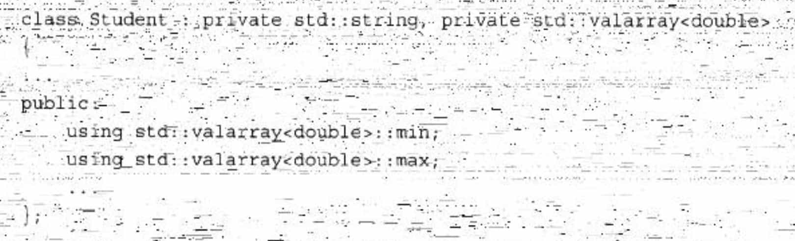
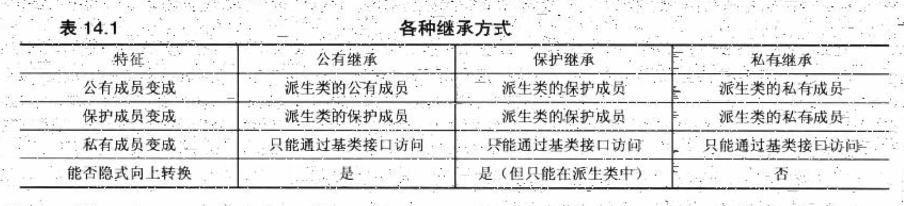

# 类总结

## 特殊成员函数

C++自动提供了下面这些成员函数：

-   默认构造函数，如果没有定义构造函数
-   默认析构函数，如果没有定义
-   复制构造函数，如果没有定义
-   赋值运算符，如果没有定义
-   地址运算符，如果没有定义

### 复制构造函数

```cpp
/**
 * 这段赋值相当于
 *
 * StringBad sailor = StringBad(sports);
 * 函数原型：StringBad(const StringBad &);
 * 
 * 当使用一个对象来初始化另一个对象时，编译器将自动生成上述构造函数(称为复制构造函数，因为它创建对象的一个副本)。
 */
StringBad sailor = sports;
```

**调用时机**

```cpp
StringBad ditto = StringBad(motto);
StringBad metoo = motto;
StringBad also = StringBad(motto);
StringBad * pStringBad = new StringBad(motto);
```

每当程序生成了对象副本时，编译器都将使用复制构造函数。具体地说，当函数按值传递对象或函数返回对象时，都将使用复制构造函数。

默认的复制构造函数是相当于浅拷贝，如果成员本身就是类对象，则将使用这个类的复制构造函数来复制成员对象。

### 赋值运算符

将已有的对象赋给另一个对象时，将使用重载的赋值运算符：

```cpp
StringBad headline1("Celery Stalks at Midnight");
...
StringBad knot;
knot = headlinel;// assignment operator invoked
```

初始化对象时，并不一定会使用赋值运算符：

```cpp
StringBad metoo = knot; // use copy constructor, possibly assignment, too
```

metoo是一个新创建的对象，被初始化为knot的值，因此使用复制构造函数。编译器实现也可能分两步来处理这条语句：使用复制构造函数创建一个临时对象，然后通过赋值将临时对象的值复制到新对象中。这就是说，初始化总是会调用复制构造函数，而使用=运算符时也**可能**调用赋值运算符。

```cpp
void test_StringBad2(){
    StringBad bad;
    StringBad bad1 = bad;
}
```

```
1: "C++" default object created
StringBad::StringBad(const StringBad &stringBad)
"C++" object deleted, 1 left
"C++" object deleted, 0 left
```

与复制构造函数相似，赋值运算符的隐式实现也对成员进行逐个复制。

**重要 重要 重要**

**如果类中包含了使用new初始化的指针成员，应当定义一个复制构造函数和赋值运算符，以复制指向的数据，而不是指针，这被称为深度复制。复制的另一种形式(成员复制或浅复制)只是复制指针值。浅复制仅浅浅地复制指针信息，而不会深入“挖掘”以复制指针引用的结构。**

**示例**

```cpp
StringBad::StringBad(const StringBad &stringBad) {
    len = stringBad.len;
    str = new char[len + 1];
    strcpy(str, stringBad.str);
    StringBad::num_strings++;
}

StringBad &StringBad::operator=(const StringBad &st) {
    if (this == &st) {
        return *this;
    }
    delete[] str;
    len = st.len;
    str = new char[len + 1];
    strcpy(str, st.str);
    return *this;
}
```

### 两者区别

看例子：

```cpp
void test_operaotr_1() {
    using namespace Chapter11;

    TestOperaotrClass operaotrClass1(1);
    cout << endl;
    TestOperaotrClass operaotrClass2;
    cout << endl;
    operaotrClass2 = operaotrClass1;
    cout << endl;
    TestOperaotrClass operaotrClass3 = operaotrClass1;
}

namespace Chapter11 {
    TestOperaotrClass::TestOperaotrClass() {
        cout << "默认构造函数" << endl;
        val = 0;
    }

    TestOperaotrClass::TestOperaotrClass(int val) {
        cout << "普通构造函数" << endl;
        this->val = val;
    }

    TestOperaotrClass::TestOperaotrClass(const TestOperaotrClass &testOperaotrClass) {
        cout << "复制构造函数" << endl;
        this->val = testOperaotrClass.val;
    }

    TestOperaotrClass &TestOperaotrClass::operator=(const TestOperaotrClass &testOperaotrClass) {
        cout << "赋值运算符" << endl;
        if (this == &testOperaotrClass) return *this;
        val = testOperaotrClass.val;
        return *this;
    }
}
```

```
普通构造函数

默认构造函数

赋值运算符

复制构造函数
```

# explicit

```cpp
Chapter11 demo1 = 1.1;

string abc = "acb";
Chapter11 demo2 = abc;


Chapter11(double d);
Chapter11(const string &s);
```

C++可以隐式类型转换，如果要禁止这种行为，可以在构造函数前加explicit关键字。

```cpp
explicit Chapter11(double d);
```

只能在类内声明构造函数时使用explicit关键字，在类外部定义时不应重复。

可以用static_cast强制隐式构造。

## 聚合类

聚合类使得用户可以直接访问其成员，并且具有特殊的初始化语法形式。当一个类满足如下条件时，我们说它是聚合的：

-   所有成员都是public的。
-   没有定义任何构造函数。
-   没有类内初始值。
-   没有基类，也没有virtual函数。

```cpp
struct Data {
	int		ival;
	string 	s;
}
```

我们可以提供一个花括号括起来的成员初始值列表，并用它初始化聚合类的数据成员：

```
Data val1 = {0，"Anna"};
```

初始值的顺序必须与声明的顺序一致，也就是说，第一个成员的初始值要放在第一个，然后是第二个，以此类推。

# 继承总结

C++中复用代码的一个方式是组合，即类内部持有某一类的对象，另一个方式就是继承。

## 初始化顺序

当初始化列表包含多个项目时，这些项目被初始化的顺序为它们被声明的顺序，而不是它们在初始化列表中的顺序。例如，假设Student构造函数如下：

```cpp
Student (const char * str, const double *pd, int n) : scores(pd, n)，name (str) {}
```


则name成员仍将首先被初始化，因为在类定义中它首先被声明。如果代码使用一个成员的值作为另一个成员的初始化表达式的一部分时，初始化顺序就非常重要。

## 私有继承

使用私有继承，基类的公有成员和保护成员都将成为派生类的私有成员。

用法：

```cpp
class Student : private std::string, private std::valarray<double> {}
```

需要初始化父类对象。

```cpp
Student(const char *str, const double *pd, int n)
        : std::string(str), ArrayDb(pd, n) {}
```

### 调用基类方法

使用私有继承时，只能在派生类的方法中使用基类的方法。

使用类名和作用域解析运算符来调用基类的方法：

```
Parent::fun();
```

### 使用基类对象

用强制转换来使用基类对象。

```
return (string&) *this;
```

### 访问基类友元函数

友元函数不属于类，所以不能直接调用，可以通过显式地转换为基类来调用正确的函数。

例如，对于下面的友元函数定义：

```cpp
ostream & operator<<(ostream & os, const Student & stu)
{
    os << "Scores for " << (const string &) stu  << ":\n";
    stu.arr_out(os);  // use private method for scores
    return os;
}
```

**引用stu不会自动转换为string引用。根本原因在于，在私有继承中，在不进行显式类型转换的情况下，不能将指向派生类的引用或指针赋给基类引用或指针。**

>   然而，即使这个例子使用的是公有继承，也必须使用显式类型转换。原因之一是， 如果不使用类型转换，下述代码将与友元函数原型匹配，从而导致递归调用：
>
>   os<< stu;
>
>   另一个原因是，由于这个类使用的是多重继承，编译器将无法确定应转换成哪个基类，如果两个基类都提供了函数operator<<()。

### 组合和私有继承的区别

组合：

-   首先，它易于理解。类声明中包含表示被包含类的显式命名对象，代码可以通过名称引用这些对象，而使用继承将使关系更抽象。
-   其次，继承会引起很多问题，尤其从多个基类继承时，可能必须处理很多问题，如包含同名方法的独立的基类或共享祖先的独立基类。
-   另外，包含能够包括多个同类的子对象。如果某个类需要3个string对象，可以使用包含声明3个独立的string成员。而继承则只能使用一个这样的对象(当对象都没有名称时，将难以区分)。

私有继承：

-   类包含保护成员(可以是数据成员，也可以是成员函数)，则这样的成员在派生类中是可用的，但在继承层次结构外是不可用的。如果使用组合将这样的类包含在另一个类中，则后者将不是派生类，而是位于继承层次结构之外，因此不能访问保护成员。但通过继承得到的将是派生类，因此它能够访问保护成员。
-   另一种需要使用私有继承的情况是需要重新定义虚函数。派生类可以重新定义虛函数，但包含类不能。使用私有继承，重新定义的函数将只能在类中使用，而不是公有的。

**一般情况下，应使用组合来建立has-a 关系；如果新类需要访问原有类的保护成员，或需要重新定义虚函数，则应使用私有继承。**

## 保护继承

使用保护继承时，基类的公有成员和保护成员都将成为派生类的保护成员。和私有私有继承一样，基类的接口在派生类中也是可用的，但在继承层次结构之外是不可用的。当从派生类派生出另一个类时，私有继承和保护继承之间的主要区别便呈现出来了。使用私有继承时，第三代类将不能使用基类的接口，这是因为基类的公有方法在派生类中将变成私有方法；使用保护继承时，基类的公有方法在第二代中将变成受保护的，因此第三代派生类可以使用它们。

### 在继承层次结构外使用基类的公有成员

一个是声明一个公有函数，然后内部调用基类的公有函数。

另一种方法是用using声明：



注意，using声明只使用成员名——没有圆括号、函数特征标和返回类型。这表示可以使用所有同名函数。

## 各种继承方式



成员修饰符：

-   public
    可在继承结构层次之外调用。
-   protect
    只能在继承结构层次之内调用。
-   private
    无法被外部访问

继承修饰符：

C++的继承方式更改的是成员的可见性，见上表。

## 多重继承

多重继承会带来很多问题，主要的问题为：

-   从两个不同的基类继承同名方法
-   从两个或更多相关基类那里继承同一个类的多个实例。

>   下面例子的继承树：
>
>   SingingWaiter->Singer、Waiter
>
>   Singer->Worker
>
>   Waiter->Worker

### 多个实例

**问题描述**

基类：Worker

子类：Singer，Waiter

第三代子类：SingerWaiter

```cpp
SingerWaiter ed;
Worker * pw = &ed;
```

公有继承的基类指针可以指向子类对象的基类对象的地址。但ed中包含两个Worker对象，有两个地址可供选择，出现二义性，所以应使用类型转换来指定对象：

```cpp
SingerWaiter ed;
Worker * pw1 = (Waiter *)&ed;
Worker * pw2 = (Singer *)&ed;
```

这种解决方式是临时的，虚基类可以很好的解决这个问题。虚基类使得从多个类（它们的基类相同）派生出的对象只继承一个基类对象。

>   为什么不抛弃将基类声明为虚的这种方式，而使虚行为成为MI的准则呢？
>
>   -   在一些情况下，可能需要基类的多个拷贝
>   -   将基类作为虚的要求程序完成额外的计算，为不需要的工具付出代价是不应当的

#### 虚基类

虚基类使得从多个类(它们的基类相同)派生出的对象只继承一个基类对象。例如，通过在类声明中使用关键字virtual，可以使Worker被用作Singer和Waiter的虚基类(virtual和public的次序无关紧要)：

```cpp
class Singer : virtual public Worker
class Waiter : public virtual Worker {...};
```

使用虚基类后，代码规则会有一些变化。

**新的构造函数规则**

原本的构造函数规则：C类的构造函数只能调用B类的构造函数，而B类的构造函数只能调用A类的构造函数。

如果Worker是虚基类，则这种信息自动传递将不起作用。例如，对于下面的MI构造函数：

```cpp
SingingWaiter(const Worker & wk, int p = 0, int v = Singer::other): Waiter (wk,p), Singer(wk,v) { } // flawed
```

存在的问题是，自动传递信息时，将通过2条不同的途径(Waiter 和Singer)将wk传递给Worker对象。为避免这种冲突，C++在基类是虚的时，禁止信息通过中间类自动传递给基类。因此，上述构造函数将初始化成员panache和voice，但wk参数中的信息将不会传递给子对象Waiter。然而，编译器必须在构造派生对象之前构造基类对象组件；在上述情况下，编译器将使用Worker的默认构造函数。

如果不希望默认构造函数来构造虚基类对象，则需要显式地调用所需的基类构造函数。因此，构造函数应该是这样：

```cpp
SingingWaiter(const Worker & wk, int p = 0, int v = Singer::other): Worker {wk), Waiter (wk,p), Singer(wk,v) { } 
```

上述代码将显式地调用构造函数worker (const Worker &)。请注意，这种用法是合法的，对于虚基类，必须这样做，但对于非虚基类，则是非法的。

### 多个方法

在多重继承中，每个直接祖先都有一个Show()函数，这使得调用Show()是二义性的。可以使用作用域解析运算符来澄清意图：

```cpp
SingingWaiter newhire("Elise Hawks", 2005, 6, soprano);
newhire.Singer::Show(); // use Singer version
```

然而，更好的方法是在SingingWaiter中重新定义Show( )，并指出要使用哪个Show()。例如，如果希望SingingWaiter对象使用Singer版本的Show()，则可以这样做：

```cpp
void Singingwaiter::Show(}
	Singer::Show();
}
```

## 类模板

类模板（class template）是用来生成类的蓝图的。与函数模板的不同之处是，编译器不能为类模板推断模板参数类型。为了使用类模板，必须在模板名后的尖括号中提供额外信息。

