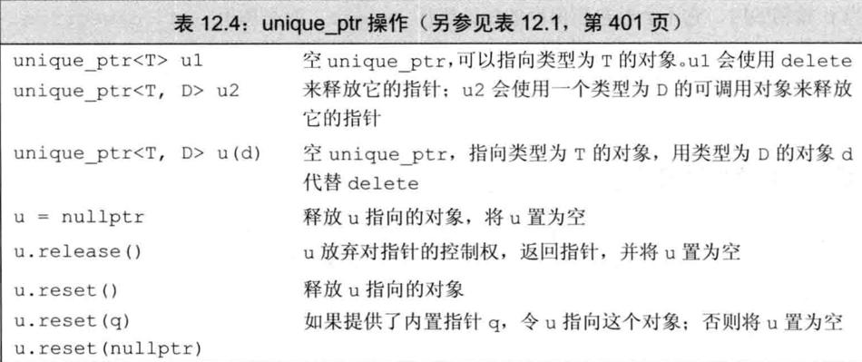
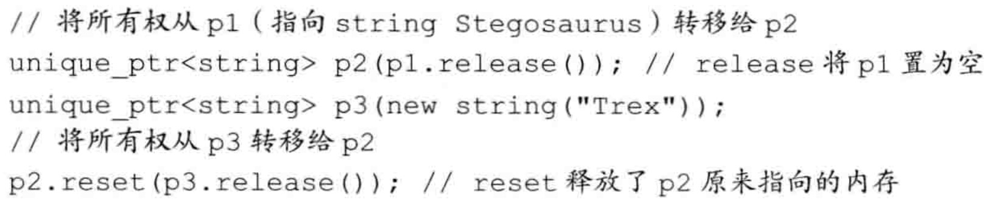
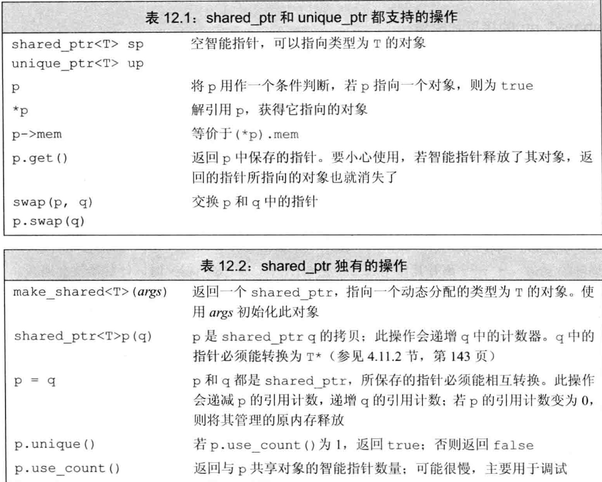
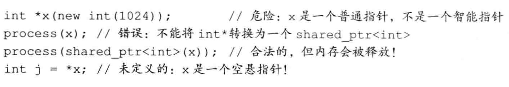

# 动态内存与智能指针

## 介绍

智能指针定义在memory头文件中。智能指针的作用是管理一个指针，避免申请的空间在函数结束时忘记释放，造成内存泄漏这种情况的发生。

## auto_ptr

(C++98 的方案，C11 已抛弃)采用所有权模式。

```c++
void testAutoPtr() {
  SY_LOG("测试1");
  {
    std::auto_ptr<ClasstAutoPtr> p(new ClasstAutoPtr());
    SY_LOG("p ptr=%p", p.get());
  }
  SY_LOG("测试2");
  {
    std::auto_ptr<ClasstAutoPtr> p1(new ClasstAutoPtr());
    SY_LOG("p1 ptr=%p", p1.get());
    std::auto_ptr<ClasstAutoPtr> p2;
    p2 = p1;
    SY_LOG("p1 ptr=%p", p1.get());
    SY_LOG("p2 ptr=%p", p2.get());
  }
}
```

```
测试1
ClasstAutoPtr()
p ptr=0x600003f64050
~ClasstAutoPtr()
测试2
ClasstAutoPtr()
p1 ptr=0x600003f64050
p1 ptr=0x0
p2 ptr=0x600003f64050
~ClasstAutoPtr()
```

此时不会报错，p2 剥夺了 p1 的所有权，但是当程序运行时访问 p1 将会报错。所以 auto_ptr 的缺点是：存在潜在的内存崩溃问题。

## unique_ptr

一个unique_ptr“拥有”它所指向的对象。与shared_ptr不同，某个时刻只能有一个unique_ptr指向一个给定对象。当unique_ptr被销毁时，它所指向的对象也被销毁。

与shared_ptr不同，没有类似make_shared的标准库函数返回一个unique_ptr。当我们定义一个unique_ptr时，需要将其绑定到一个new返回的指针上。

由于一个unique_ptr拥有它指向的对象，因此unique_ptr不支持普通的拷贝或赋值操作。



虽然不能拷贝或赋值unique_ptr，但可以通过调用release或reset将指针的所有权从一个（非const）unique_ptr转移给另一个unique。



```c++
void testUniquePtr() {
  SY_LOG("测试1");
  {
    std::unique_ptr<SmartPtr> p(new SmartPtr());
    SY_LOG("p ptr=%p", p.get());
  }
  SY_LOG("测试2");
  {
    std::unique_ptr<SmartPtr> p1(new SmartPtr());
    SY_LOG("p1 ptr=%p", p1.get());
    std::unique_ptr<SmartPtr> p2;
//    p2 = p1; // 不支持赋值
    p2.reset(p1.release());
    SY_LOG("p1 ptr=%p", p1.get());
    SY_LOG("p2 ptr=%p", p2.get());
  }
}
```

```
测试1
SmartPtr()
p ptr=0x600003c88050
~SmartPtr()
测试2
SmartPtr()
p1 ptr=0x600003c88050
p1 ptr=0x0
p2 ptr=0x600003c88050
~SmartPtr()
```

### 传递unique_ptr参数和返回unique_ptr

不能拷贝unique_ptr的规则有一个例外：我们可以拷贝或赋值一个将要被销毁的unique_ptr。最常见的例子是从函数返回一个unique_ptr：

```c++
unique_ptr<int>clone(int p){
    //正确：从int*创建一个unique_ptr<int>
    return unique_ptr<int>(new int(p));
}
```

还可以返回一个局部对象的拷贝：

```c++
unique_ptr<int>clone(int p){
    unique_ptr<int> ret(new int(p));
    // ...
    return ret;
}
```

对于两段代码，编译器都知道要返回的对象将要被销毁。在此情况下，编译器执行一种特殊的“拷贝”。

### 小结

unique_ptr实现独占式拥有概念（unique_ptr不支持赋值），保证同一时间内只有一个智能指针可以指向该对象。它对于避免资源泄露特别有用。

## shared_ptr

默认初始化的智能指针中保存着一个空指针。智能指针的使用方式与普通指针类似。解引用一个智能指针返回它指向的对象。



### shared_ptr的拷贝和赋值

当进行拷贝或赋值操作时，每个shared_ptr都会记录有多少个其他shared_ptr指向相同的对象。

可以认为每个shared_ptr都有一个关联的计数器，通常称其为引用计数（reference count）。

无论何时拷贝一个shared_ptr，计数器都会递增。当用一个shared_ptr初始化另一个shared_ptr，或将它作为参数传递给一个函数以及作为函数的返回值时，它所关联的计数器就会递增。

当我们给shared_ptr赋予一个新值或是shared_ptr被销毁（例如一个局部的shared_ptr离开其作用域）时，计数器就会递减。

一旦一个shared_ptr的计数器变为0，它就会自动释放自己所管理的对象。

## shared_ptr和new结合使用

接受指针参数的智能指针构造函数是explicit的。因此，我们不能将一个内置指针隐式转换为一个智能指针，必须使用直接初始化形式。

### 不要混合使用普通指针和智能指针



在上面的调用中，我们将一个临时shared_ptr传递给process。当这个调用所在的表达式结束时，这个临时对象就被销毁了。销毁这个临时变量会递减引用计数，此时引用计数就变为0了。因此，当临时对象被销毁时，它所指向的内存会被释放。但x继续指向（已经释放的）内存，从而变成一个空悬指针。如果试图使用x的值，其行为是未定义的。

## weak_ptr

weak_ptr是一种不控制所指向对象生存期的智能指针，它指向由一个shared_ptr管理的对象。将一个weak_ptr绑定到一个shared_ptr不会改变shared_ptr的引用计数。一旦最后一个指向对象的shared_ptr被销毁，对象就会被释放。即使有weak_ptr指向对象，对象也还是会被释放，因此，weak_ptr的名字抓住了这种智能指针“弱”共享对象的特点。

由于对象可能不存在，我们不能使用weak_ptr直接访问对象（weak_ptr没有get接口），而必须调用lock。此函数检查weak_ptr指向的对象是否仍存在。如果存在，lock返回一个指向共享对象的shared_ptr。与任何其他shared_ptr类似，只要此shared_ptr存在，它所指向的底层对象也就会一直存在。

weak_ptr 是用来解决 shared_ptr 相互引用时的死锁问题，如果说两个 shared_ptr 相互引用，那么这两个指针的引用计数永远不可能下降为0，也就是资源永远不会释放。当两个智能指针都是 shared_ptr 类型的时候，析构时两个资源引用计数会减一，但是两者引用计数还是为 1，导致跳出函数时资源没有被释放，解决办法：把其中一个改为weak_ptr就可以。

```c++
void testWeakPtr() {
  std::weak_ptr<SmartPtr> wp;
  {
    std::shared_ptr<SmartPtr> sp = std::make_shared<SmartPtr>();
    SY_LOG("*sp == %p", sp.get());
    wp = sp;

    SY_LOG("gw.use_count() == %ld", wp.use_count());
    std::shared_ptr<SmartPtr> spt = wp.lock();
    if (spt != nullptr) {
      SY_LOG("*spt == %p", spt.get());
    } else {
      SY_LOG("nullptr");
    }
  }
  SY_LOG("gw.use_count() == %ld", wp.use_count());
  std::shared_ptr<SmartPtr> spt = wp.lock();
  if (spt != nullptr) {
    SY_LOG("*spt == %p", spt.get());
  } else {
    SY_LOG("nullptr");
  }
}
```

```
SmartPtr()
*sp == 0x600003c891d8
gw.use_count() == 1
*spt == 0x600003c891d8
~SmartPtr()
gw.use_count() == 0
nullptr
```

# C++中内存分配情况 

栈：由编译器管理分配和回收，存放局部变量和函数参数。

堆：由程序员管理，需要手动 new、malloc、delete、free 进行分配和回收，空间较大，但可能会出现内存泄漏和空闲碎片的情况。

全局/静态存储区：分为初始化和未初始化两个相邻区域，存储初始化和未初始化的全局变量和静态变量。 

常量存储区：存储常量，一般不允许修改。

代码区：存放程序的二进制代码。

# const和static

**static作用：控制变量的存储方式和可⻅性。**

1.   修饰局部变量：一般情况下，对于局部变量在程序中是存放在栈区的，并且局部的生命周期在包含语句块执行结束时便结束了。但是如果用 static 关键字修饰的话，该变量便会存放在静态数据区，其生命周期会一直延续到整个程序执行结束。但是要注意的是，虽然用 static 对局部变量进行修饰之后，其生命周期以及存储空间发生了变化，但其作用域并没有改变，作用域还是限制在其语句块。
2.   修饰全部变量：对于一个全局变量，它既可以在本文件中被访问到，也可以在同一个工程中其它源文件被访问(添加extern进行声明即可)。用 static 对全局变量进行修饰改变了其作用域范围，由原来的整个工程可⻅变成了本文件可⻅。
3.   修饰函数：用 static 修饰函数，情况和修饰全局变量类似，也是改变了函数的作用域。

**const 关键字：含义及实现机制**

1.   const修饰基本类型数据类型：基本数据类型，修饰符 const 可以用在类型说明符前，也可以用在类型说明符后，其结果是一样的。在使用这些常量的时候，只要不改变这些常量的值即可。
2.   const 在类中的用法：const 关键字和 static 关键字对于成员函数来说是不能同时使用的，因为 static 关键字修饰静态成员函数不含有 this 指针，即不能实例化，const 成员函数又必须具体到某一个函数。
3.   常量对象可以调用类中的 const 成员函数，但不能调用非 const 成员函数。 
     因为对象调用成员函数时，在形参列表的最前面加一个形参this，但这是隐式的。
     this指针是指向当前对象的，this 是一个常量指针 `ptr * const`，因为不可以修改 this 指针代表的地址。
     当成员函数的参数列表后加了 const 关键字，此成员函数为常量成员函数，此时它的隐式this形参为 `const test * const`，即不可以通过 this 指针来改变指向对象的值。

# 常量存放在内存的哪个位置

1.   对于局部常量，存放在栈区
2.   对于全局常量，编译期一般不分配内存，放在符号表中以提高访问效率
3.   字面值常量，比如字符串，放在常量区

# 重载、重写、重定义的区别

1.   重载
     略
2.   重写
     派生类中重新定义父类中除了函数体外完全相同的虚函数，注意被重写的函数不能是 static 的，一定要是虚函数，且其他一定要完全相同。要注意，重写和被重写的函数是在不同的类当中的，重写函数的访问修饰符是可以不同的，尽管 virtual 中是 private 的，派生类中重写可以改为 public。
3.   重定义(隐藏)
     派生类重新定义父类中相同名字的非 virtual 函数，参数列表和返回类型都可以不同，即父类中除了定义成 virtual 且完全相同的同名函数才不会被派生类中的同名函数所隐藏(重定义)。

# 四种强制转换

1.   static_cast
     明确指出类型转换，一般建议将隐式转换都替换成显示转换，因为没有动态类型检查，派生类->基类安全，基类->派生类不安全，所以主要执行非多态的转换操作

2.   dynamic_cast
     `Superb *pm = dynamic_cast<Superb *>(pg);`
     如果指针pg可以安全地转换为`Superb *`，运算符将返回对象的地址，否则返回一个空指针。

     也可以将dynamic_cast用于引用，其用法稍微有点不同：没有与空指针对应的引用值，因此无法使用特殊的引用值来指示失败。当请求不正确时，`dynamic_cast`将引发类型为`bad_cast`的异常，这种异常是从exception类派生而来的，它是在头文件typeinfo中定义的。

3.   const_cast
     专⻔用于 const 属性的转换，去除 const 性质，或增加 const 性质， 是四个转换符中唯一一个可以操作常量的转换符。

4.   reinterpret_cast
     不到万不得已，不要使用这个转换符，高危操作。
     使用特点：从底层对数据进行重新解释，依赖具体的平台，可移植性差
     可以将整形转换为指针，也可以把指针转换为数组，可以在指针和引用之间进行肆无忌惮的转换。

## swig的指针和long互转

基本思路是地址的互转，而不是值的互转（如：`long handle = (long) ptr`）

```
 *(Obj **) &java_handle = ptr; 
 
 Obj *ptr = *(Obj **)&java_handle; 
```

# 指针和引用的区别

指针和引用都是一种内存地址的概念。指针是一个实体，引用只是一个别名。在程序编译的时候，将指针和引用添加到符号表中。

指针它指向一块内存，指针的内容是所指向的内存的地址，在编译的时候，则是将“指针变量名-指针变量的地址”添加到符号表中，所以说，指针包含的内容是可以改变的，允许拷⻉和赋值，有 const 和非 const 区别，甚至可以为空，sizeof 指针得到的是指针类型的大小。

引用是一块内存的别名，在添加到符号表的时候，是将"引用变量名-引用对象的地址"添加到符号表中，符号表一经完成不能改变，所以引用必须而且只能在定义时被绑定到一块内存上，后续不能更改，也不能为空，也没有 const 和非 const 区别。

sizeof引用得到代表对象的大小。而 sizeof 指针得到的是指针本身的大小。另外在参数传递中，指针需要被解引用后才可以对对象进行操作，而直接对引用进行的修改会直接作用到引用对象上。

作为参数时也不同，传指针的实质是传值，传递的值是指针的地址
传引用的实质是传地址，传递的是变量的地址。


# 野指针与悬空指针有什么区别？

野指针(wild pointer)：就是没有被初始化过的指针。用 gcc -Wall 编译, 会出现 used uninitialized 警告。 

悬空指针：是指针最初指向的内存已经被释放了的一种指针。

无论是野指针还是悬空指针，都是指向无效内存区域(这里的无效指的是"不安全不可控")的指针。 访问"不安全可控"(invalid)的内存区域将导致"Undefined Behavior"。

如何避免使用野指针？在平时的编码中，养成在定义指针后且在使用之前完成初始化的习惯或者使用智能指针。 

# const修饰指针如何区分

```c++
const int * p1; // 指向整形常量的指针，它指向的值不能修改
int * const p2; // 指向整形的常量指针，它不能在指向别的变量，但指向(变量)的值可以修改
const int * const p3; //指向整形常量的常量指针。它既不能再指向别的常量，指向的值也不能修改
```

# 函数指针

首先是定义：函数指针是指向函数的指针变量。函数指针本身首先是一个指针变量，该指针变量指向一个具体的函数。这正如用指针变量可指向整型变量、字符型、数组一样，这里是指向函数。

在编译时，每一个函数都有一个入口地址，该入口地址就是函数指针所指向的地址。有了指向函数的指针变量后，可用该指针变量调用函数，就如同用指针变量可引用其他类型变量一样，在这些概念上是大体一致的。

其次是用途：调用函数和做函数的参数，比如回调函数。
示例:

# 堆和栈区别 

## 栈

由编译器进行管理，在需要时由编译器自动分配空间，在不需要时候自动回收空间，一般保存的是局部变量和函数参数等。连续的内存空间，在函数调用的时候，首先入栈的主函数的下一条可执行指令的地址，然后是函数的各个参数。

大多数编译器中，参数是从右向左入栈。

>   原因在于采用这种顺序，是为了让程序员在使用C/C++的“函数参数⻓度可变”这个特性时更方便。如果是从左向右压栈，第一个参数(即描述可变参数表各变量类型的那个参数)将被放在栈底，由于可变参的函数第一步就需要解析可变参数表的各参数类型，即第一步就需要得到上述参数，因此，将它放在栈底是很不方便的。
>
>   zsy：存疑？

本次函数调用结束时，局部变量先出栈，然后是参数，最后是栈顶指针最开始存放的地址，程序由该点继续运行，不会产生碎片。

栈是高地址向低地址扩展，栈低高地址，空间较小。

## 堆

由程序员管理，需要手动 new malloc delete free 进行分配和回收，如果不进行回收的话，会造成内存泄漏的问题。

不连续的空间，实际上系统中有一个空闲链表，当有程序申请的时候，系统遍历空闲链表找到第一个大于等于申请大小的空间分配给程序，一般在分配程序的时候，也会空间头部写入内存大小，方便 delete 回收空间大小。当然 如果有剩余的，也会将剩余的插入到空闲链表中，这也是产生内存碎片的原因。

堆是低地址向高地址扩展，空间交大，较为灵活。

# 函数传递参数的几种方式 

1.   值传递：形参是实参的拷⻉，函数内部对形参的操作并不会影响到外部的实参。
2.   指针传递：也是值传递的一种方式，形参是指向实参地址的指针，当对形参的指向操作时，就相当于对实参本身进行操作。
3.   引用传递：实际上就是把引用对象的地址放在了开辟的栈空间中，函数内部对形参的任何操作可以直接映射到外部的实参上面。

# new｜delete，malloc｜free区别

都可以用来在堆上分配和回收空间。new /delete 是操作符，malloc/free 是库函数。

执行 new 实际上执行两个过程：

1.   分配未初始化的内存空间(malloc)
2.   使用对象的构造函数对空间进行初始化
3.   返回空间的首地址。

如果在第一步分配空间中出现问题，则抛出 std::bad_alloc 异常，或被某个设定的异常处理函数捕获处理。

如果在第二步构造对象时出现异常，则自动调用 delete 释放内存。

执行 delete 实际上也有两个过程：

1.   使用析构函数对对象进行析构
2.   回收内存空间(free)

以上也可以看出 new 和 malloc 的区别，new 得到的是经过初始化的空间，而 malloc 得到的是未初始化的空间。delete 和 free 同理，delete 不仅释放空间还析构对象。

为什么有了malloc/free 还需要 new/delete？
因为对于非内部数据类型而言，光用 malloc/free 无法满足动态对象的要求。对象在创建的同时需要自动执行构造函数，对象在消亡以前要自动执行析构函数。由于 mallo/ free 是库函数而不是运算符，不在编译器控制权限之内，不能够把执行的构造函数和析构函数的任务强加于malloc/free，所以有了 new/delete 操作符。

# volatile 和 extern 关键字 

## volatile

1.   易变性：在汇编层面反映出来，就是两条语句，下一条语句不会直接使用上一条语句对应的 volatile 变量的寄存器内容，而是重新从内存中读取。
2.   不可优化性：静止编译器优化。避免将变量直接消除，保证程序员写在代码中的指令，一定会被执行。
3.   顺序性：能够保证 volatile 变量之间的顺序性，编译器不会进行乱序优化。 

## extern

在 C 语言中，修饰符 extern 用在变量或者函数的声明前，用来说明 “此变量/函数是在别处定义的，要在此处引用”。

注意 extern 声明的位置对其作用域也有关系，如果是在 main 函数中进行声明的，则只能在 main 函数中调用，在其它函数中不能调用。其实要调用其它文件中的函数和变量，只需把该文件用 #include 包含进来即可，为什么要用 extern？因为用 extern 会加速程序的编译过程，这样能节省时间。

在 C++ 中 extern 还有另外一种作用，用于指示 C 或者 C++函数的调用规范。比如在 C++ 中调用 C 库函数，就 需要在 C++ 程序中用 extern “C” 声明要引用的函数。这是给链接器用的，告诉链接器在链接的时候用C 函数规范来链接。主要原因是 C++ 和 C 程序编译完成后在目标代码中命名规则不同，用此来解决名字匹配的问题。

# define 和 const 区别(编译阶段、安全性、内存占用等)

对于 define 来说，宏定义实际上是在预编译阶段进行处理，没有类型，也就没有类型检查，仅仅做的是遇到宏定义进行字符串的展开，遇到多少次就展开多少次，而且这个简单的展开过程中，很容易出现边界效应，达不到预期的效果。因为 define 宏定义仅仅是展开，因此运行时系统并不为宏定义分配内存，但是从汇编的⻆度来讲， define却以立即数的方式保留了多份数据的拷⻉。

对于const来说，const是在编译期间进行处理的，const有类型，也有类型检查，程序运行时系统会为const常量分配内存，而且从汇编的⻆度讲，const常量在出现的地方保留的是真正数据的内存地址，只保留了一份数据的拷⻉，省去了不必要的内存空间。而且，有时编译器不会为普通的const常量分配内存，而是直接将const常量添加到符号表中，省去了读取和写入内存的操作，效率更高。

# 虚函数的实现原理

C++中多态的表象，在基类的函数前加上 virtual 关键字，在派生类中重写该函数，运行时将会根据对象的实际类型来调用相应的函数。如果对象类型是派生类，就调用派生类的函数，如果是基类，就调用基类的函数。

>   测试父类函数有virtual关键字，子类没有的情况：见demo的`mezzsy::TestClass::Extend::testVirtual`

实际上，当一个类中包含虚函数时，编译器会为该类生成一个虚函数表，保存该类中虚函数的地址，同样，派生类继承基类，派生类中自然一定有虚函数，所以编译器也会为派生类生成自己的虚函数表。当定义一个派生类对象时，编译器检测该类型有虚函数，所以为这个派生类对象生成一个虚函数指针，指向该类型的虚函数表，这个虚函数指针的初始化是在构造函数中完成的。

后续如果有一个基类类型的指针，指向派生类，那么当调用虚函数时，就会根据所指真正对象的虚函数表指针去寻找虚函数的地址，也就可以调用派生类的虚函数表中的虚函数以此实现多态。

如果基类中没有定义成 virtual，那么进行`Base B; Derived D; Base *p = D; p->function();`这种情况下调用的则是Base中的`function()`。因为基类和派生类中都没有虚函数的定义，那么编译器就会认为不用留给动态多态的机会，就事先进行函数地址的绑定(静态绑定)，详述过程就是，定义了一个派生类对象，首先要构造基类的空间，然后构造派生类的自身内容，形成一个派生类对象，那么在进行类型转换时，直接截取基类的部分的内存，编译器认为类型就是基类，那么(函数符号表[不同于虚函数表的另一个表]中)绑定的函数地址也就是基类中函数的地址，所以执行的是基类的函数。

## demo1

```c++
// mezzsy::TestClass::Extend::testVirtual
// 祖父类函数有 virtual 关键字，父类没有，子类没有
void testVirtual() {
  Class1The1 obj1;
  Class2The1 obj2;
  Class3The1 obj3;

  SY_LOG("Test Class1The1::fun(Class1The1 &obj)");
  Class1The1::fun(obj1);
  Class1The1::fun(obj2);
  Class1The1::fun(obj3);
  SY_LOG("Test Class2The1::fun(Class2The1 &obj)");
  Class2The1::fun(obj2);
  Class2The1::fun(obj3);
  SY_LOG("Test Class3The1::fun(Class3The1 &obj)");
  Class3The1::fun(obj3);
}
```

```
Test Class1The1::fun(Class1The1 &obj)
Class1The1::fun
Class2The1::fun
Class3The1::fun
Test Class2The1::fun(Class2The1 &obj)
Class2The1::fun
Class3The1::fun
Test Class3The1::fun(Class3The1 &obj)
Class3The1::fun
```

结论：子类及后续子类即使不加 virtual 也不会影响虚函数的性质。

## demo2

```c++
// mezzsy::TestClass::Extend::testVirtual2
// 祖父类函数没有 virtual 关键字，父类有，子类有
void testVirtual2() {
  Class1The1 obj1;
  Class2The1 obj2;
  Class3The1 obj3;

  SY_LOG("Test Class1The1::fun2(Class1The1 &obj)");
  Class1The1::fun2(obj1);
  Class1The1::fun2(obj2);
  Class1The1::fun2(obj3);
  SY_LOG("Test Class2The1::fun2(Class2The1 &obj)");
  Class2The1::fun2(obj2);
  Class2The1::fun2(obj3);
  SY_LOG("Test Class3The1::fun2(Class3The1 &obj)");
  Class3The1::fun2(obj3);
}
```

```
Test Class1The1::fun2(Class1The1 &obj)
Class1The1::fun2
Class1The1::fun2
Class1The1::fun2
Test Class2The1::fun2(Class2The1 &obj)
Class2The1::fun2
Class3The1::fun2
Test Class3The1::fun2(Class3The1 &obj)
Class3The1::fun2
```

结论：父类没有 virtual 关键词，但是字类有，该虚函数性质从子类开始，父类没有该虚函数性质。

# 编译器如何处理虚函数表

对于派生类来说，编译器建立虚函数表的过程其实一共是三个步骤：

1.   拷⻉基类的虚函数表，如果是多继承，就拷⻉每个有虚函数基类的虚函数表。
2.   一个基类的虚函数表和派生类自身的虚函数表共用了一个虚函数表，也称为某个基类为派生类的主基类。
3.   查看派生类中是否有重写基类中的虚函数， 如果有，就替换成已经重写的虚函数地址；查看派生类是否有自身的虚函数，如果有，就追加自身的虚函数到自身的虚函数表中。

# 纯虚函数

实际上，纯虚函数的出现就是为了让继承可以出现多种情况：

1.   希望派生类只继承成员函数的接口
2.   希望派生类既继承成员函数的接口，又继承成员函数的实现，而且可以在派生类中可以重写成员函数以实现多态
3.   希望派生类在继承成员函数接口和实现的情况下，不能重写缺省的实现。

其实，声明一个纯虚函数的目的就是为了让派生类只继承函数的接口，而且派生类中必需提供一个这个纯虚函数的实现，否则含有纯虚函数的类将是抽象类，不能进行实例化。

对于纯虚函数来说，其实是可以给它提供实现代码的，但是由于抽象类不能实例化，调用这个实现的唯一方式是在派生类对象中指出其 class 名称来调用。

```c++
class Parent {
public:
  // 纯虚函数可以有实现
  virtual void fun() = 0;
};

class Child : public Parent {
public:
  virtual void fun() override;
};

void Parent::fun() {
  SY_LOG("Parent::fun");
}

void Child::fun() {
  Parent::fun();
  SY_LOG("Child::fun");
}

void testVirtual4() {
  Child c;
  c.fun();
}
```

```
Parent::fun
Child::fun
```

结论：C++的纯虚函数和Java的抽象方法不同，C++的纯虚函数可以有实现，在子类中通过`<父类>::<函数名>`的方式调用。

# 深拷⻉和浅拷⻉

当出现类的等号赋值时，会调用拷⻉函数，在未定义显示拷⻉构造函数的情况下， 系统会调用默认的拷⻉函数，即浅拷⻉，它能够完成成员的一一复制。

当数据成员中没有指针时，浅拷⻉是可行的。但当数据成员中有指针时，如果采用简单的浅拷⻉，则两类中的两个指针指向同一个地址，当对象快要结束时，会调用两次析构函数，而导致指野指针的问题。

所以，这时必需采用深拷⻉。深拷⻉与浅拷⻉之间的区别就在于深拷⻉会在堆内存中另外申请空间来存储数据，从而也就解决来野指针的问题。简而言之，当数据成员中有指针时，必需要用深拷⻉更加安全。

# 结构体内存对⻬方式和为什么要进行内存对⻬？

结构体中内存对⻬的规则：

对于结构体中的各个成员，第一个成员位于偏移为 0 的位置，以后的每个数据成员的偏移量必须是 min(#pragma pack() 制定的数，数据成员本身⻓度) 的倍数。 在所有的数据成员完成各自对⻬之后，结构体或联合体本身也要进行对⻬，整体⻓度是 min(#pragma pack() 制定的数，⻓度最⻓的数据成员的⻓度) 的倍数。

## 作用

经过内存对⻬之后，CPU 的内存访问速度大大提升。

因为 CPU 把内存当成是一块一块的，块的大小可以是 2，4，8，16 个字节，因此 CPU 在读取内存的时候是一块一块进行读取的，块的大小称为内存读取粒度。比如说 CPU 要读取一个 4 个字节的数据到寄存器中(假设内存读取粒度是 4)，如果数据是从 0 字节开始的， 那么直接将 0-3 四个字节完全读取到寄存器中进行处理即可。

如果数据是从 1 字节开始的，就首先要将前 4 个字节读取到寄存器，并再次读取 4-7 个字节数据进入寄存器，接着把 0 字节，5，6，7 字节的数据剔除，最后合并 1，2，3，4 字节的数据进入寄存器，所以说，当内存没有对⻬时，寄存器进行了很多额外的操作，大大降低了 CPU 的性能。

另外，还有一个就是，有的 CPU 遇到未进行内存对⻬的处理直接拒绝处理，不是所有的硬件平台都能访问任意地址上的任意数据，某些硬件平台只能在某些地址处取某些特定类型的数据，否则抛出硬件异常。

所以内存对⻬还有利于平台移植。

# define、const、typedef、inline

## const 与 #define 的区别

const 定义的常量是变量带类型，而 #define 定义的只是个常数不带类型;
define 只在预处理阶段起作用，简单的文本替换，而 const 在编译、链接过程中起作用;
define 只是简单的字符串替换没有类型检查。而const是有数据类型的，是要进行判断的，可以避免一些低级错 误;
define 预处理后，占用代码段空间，const 占用数据段空间;
const 不能重定义，而 define 可以通过 #undef 取消某个符号的定义，进行重定义;
define 独特功能，比如可以用来防止文件重复引用。

## #define 和别名 typedef 的区别

1. 执行时间不同
   typedef 在编译阶段有效，typedef 有类型检查的功能;
   #define 是宏定义，发生在预处理阶段， 不进行类型检查;
2. 功能差异
   typedef 用来定义类型的别名，定义与平台无关的数据类型，与 struct 的结合使用等。
   #define 不只是可以为类型取别名，还可以定义常量、变量、编译开关等
3. 作用域不同
   #define 没有作用域的限制，只要是之前预定义过的宏，在以后的程序中都可以使用。 
   typedef 有自己的作用域。

## define 与 inline 的区别

1. #define是关键字，inline是函数
2. 宏定义在预处理阶段进行文本替换，inline 函数在编译阶段进行替换; 
3. inline 函数有类型检查，相比宏定义比较安全;

# 预处理，编译，汇编，链接程序的区别

一段高级语言代码经过四个阶段的处理形成可执行的目标二进制代码。

```
预处理器→编译器→汇编器→链接器
```

1. 预处理阶段：写好的高级语言的程序文本比如 hello.c，预处理器根据 #开头的命令，修改原始的程序，如` #include<stdio.h> `将把系统中的头文件插入到程序文本中，通常是以 .i 结尾的文件。
2. 编译阶段：编译器将 hello.i 文件翻译成文本文件 hello.s，这个是汇编语言程序。高级语言是源程序。所以注意概念之间的区别。汇编语言程序：每条语句都以标准的文本格式确切描述一条低级机器语言指令。不同的高级语言翻译的汇编语言相同。
3. 汇编阶段：汇编器将 hello.s 翻译成机器语言指令。把这些指令打包成可重定位目标程序，即 .o文件。hello.o是一个二进制文件，它的字节码是机器语言指令，不再是字符。前面两个阶段都还有字符。
4. 链接阶段：比如 hello 程序调用 printf 程序，它是每个 C 编译器都会提供的标准库 C 的函数。这个函数存在于一个 名叫 printf.o 的单独编译好的目标文件中，这个文件将以某种方式合并到 hello.o 中。链接器就负责这种合并。得到的是可执行目标文件。

# fork，exec，clone 

## fork

fork函数产生一个和当前进程完全一样的新进程，在fork函数调用之后，新的任务将启动并和本任务一起从fork函数返回。但不同的是本任务的fork将返回新任务pid，而新任务的fork将返回0。（参考demo，test4）

fork产生新任务的速度非常快，因为fork并不复制原任务的内存空间，而是和原任务一起共享一个写时复制（Copy on Write，COW）的内存空间。所谓写时复制，指的是两个任务可以同时自由地读取内存，但任意一个任务试图对内存进行修改时，内存就会复制一份提供给修改方单独使用，以免影响到其他的任务使用。

## exec

fork只能够产生本任务的镜像，因此须要使用exec配合才能够启动别的新任务。exec可以用新的可执行映像替换当前的可执行映像，因此在fork产生了一个新任务之后，新任务可以调用exec来执行新的可执行文件。

>   exec的demo暂略

## clone

fork和exec通常用于产生新任务，而如果要产生新线程，则可以使用clone。使用clone可以产生一个新的任务，从指定的位置开始执行，并且（可选的）共享当前进程的内存空间和文件等。如此就可以在实际效果上产生一个线程。
