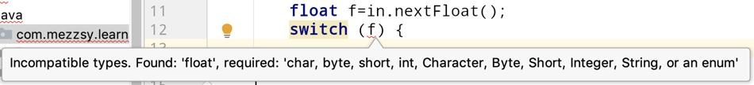

# 编译和运行过程

```java
//MainApp.java
public class MainApp {  
    public static void main(String[] args) {  
        Animal animal = new Animal("Puppy");  
        animal.printName();  
    }  
}  
//Animal.java 
public class Animal {  
    public String name;  
    public Animal(String name) {  
        this.name = name;  
    }  
    public void printName() {  
        System.out.println("Animal ["+name+"]");  
    }  
}  
```

**编译**

第一步(编译)：创建完源文件之后，程序会先被编译为class文件。Java编译一个类时，如果这个类所依赖的类还没有被编译，编译器就会先编译这个被依赖的类，然后引用，否则直接引用。如果java编译器在指定目录下找不到该类所依赖的类class文件的话，编译器会报“cant find symbol”的错误。

编译后的字节码文件格式主要分为两部分：**常量池**和**方法字节码**。常量池记录的是代码出现过的所有token(类名，成员变量名等等)以及符号引用（方法引用，成员变量引用等等）；方法字节码放的是类中各个方法的字节码。

**运行**

第二步（运行）：java类运行的过程大概可分为两个过程：1、类的加载  2、类的执行。

JVM主要在程序第一次主动使用类的时候，才会去加载该类。也就是说，JVM并不是在一开始就把一个程序就所有的类都加载到内存中，而是到不得不用的时候才把它加载进来，而且只加载一次。

下面是程序运行的详细步骤：

1. 在编译好java程序得到MainApp.class文件后，在命令行上敲java AppMain。系统就会启动一个jvm进程，jvm进程从classpath路径中找到一个名为AppMain.class的二进制文件，将MainApp的类信息加载到运行时数据区的方法区内，这个过程叫做MainApp类的加载。
2. 然后JVM找到AppMain的主函数入口，开始执行main函数。
3. main函数的第一条命令是Animal  animal = new Animal("Puppy");就是让JVM创建一个Animal对象，但是这时候方法区中没有Animal类的信息，所以JVM马上加载Animal类，把Animal类的类型信息放到方法区中。
4. 加载完Animal类之后，Java虚拟机做的第一件事情就是在堆区中为一个新的Animal实例分配内存，然后调用构造函数初始化Animal实例，这个Animal实例持有着指向方法区的Animal类的类型信息（其中包含有方法表，java动态绑定的底层实现）的引用。
5. 当使用animal.printName()的时候，JVM根据animal引用找到Animal对象，然后根据Animal对象持有的引用定位到方法区中Animal类的类型信息的方法表，获得printName()函数的字节码的地址。
6. 开始运行printName()函数。

# 编码

## 为什么要编码

- 计算机中存储信息的最小单元是`8bit`，所以能表示的字符范围是`0~255`个。
- 要表示的符号太多，无法用一个字节来完全表示。
- 要解决这个矛盾必须要一个新的数据结构`char`，从`char`到`byte`必须编码。

## 编码方式

- ASCII 码
    `ASCII`码总共有`128`个，用一个字节的低`7`位表示。
- ISO-8859-1
    在`ASCII`码基础上制定了一系列标准来扩展`ASCII`编码，其仍然是单字节编码，总共能表示`256`个字符。
- GB2312
    双字节编码，总的范围是`A1~F7`，从`A1~A9`是符号区，总共包含`682`个符号；从`B0~F7`是汉字区，包含`6763`个汉字。
- GBK
    扩展`GB2312`，加入更多的汉字，其编码范围是`8140~FEFE`，和`GB2312`兼容。
- GB18030
    我国的强制标准，可能是单字节、双字节或者四字节编码，与`GB2312`兼容。
- Unicode编码集
    `ISO`试图创建一个全新的语言字典，将所有的语言互相翻译。`String`在内存中 **不需要编码格式**，它只是一个`Unicode`字符串而已。只有当字符串需要在网络中传输或要被写入文件时，才需要编码格式。
    - UTF-16
        `UTF-16`具体定义了`Unicode`字符在计算机中的存取方法，它用两个字节表示`Unicode`转化格式。
    - UTF-8
        UTF-16的缺点在于很大部分字符仅用一个字节就可以表示，目前却需要使用两个，而UTF-8采用了变长技术，不同类型的字符可以由1~4个字节组成。 
        - 如果一个字节，最高位为`0`，表示这是一个`ASCII`字符。
        - 如果一个字节，以`11`开头，连续的`1`个数表示这个字符的字节数。
        - 如果一个字节，以`10`开始，表示它不是首字节，需要向前查找才能得到当前字符的首字节。

```
String s = "源"; 
//编码。
byte[] b = s.getBytes("UTF-8");
//解码。 
String n = new String(b,"UTF-8"); 
```

Unicode 为世界上所有字符都分配了一个唯一的数字编号，而UTF-8/16/32将编号表示成二进制。UTF-8/16/32 都是 Unicode 的一种实现。

## 对比

- `GB2312`与`GBK`编码规则类似，但是`GBK`范围更大，它能处理所有汉字字符。
- `UTF-16`和`UTF-8`都是处理`Unicode`编码，`UTF-16`效率更高，它适合在本地磁盘和内存之间使用。
- `UTF-16`不是在网络之间传输，因为网络传输容易损坏字节流，`UTF-8`更适合网络传输，对`ASCII`字符采用单字节存储，单字节损毁不会影响后面其它字符。

# 对象

## 引用

即使没有对象，引用也可以独立存在。比如创建一个String引用：

```java
String s;
```

这里创建的只是引用，不是对象。

# 操作符

## 取模运算

符号与被除数保持一致

```
2%5=2
-2%5=-2
2%(-5)=2
-2%(-5)=-2
5%2=1
-5%2=-1
5%(-2)=1
-5%(-2)=-1
```

**判断是否是偶数**

```java
/**
 * 测试是否为偶数
 */
private static void test2() {
    for (int i = -3; i <= 3; i++) {
        System.out.println(i + "是否是偶数：" + isEven(i));
    }
}

private static boolean isEven(int n) {
    return n % 2 == 0;
}

-3是否是偶数：false
-2是否是偶数：true
-1是否是偶数：false
0是否是偶数：true
1是否是偶数：false
2是否是偶数：true
3是否是偶数：false
```

没有问题。

**判断是否为奇数**

```java
/**
 * 测试是否为奇数
 */
private static void test3() {
    for (int i = -3; i <= 3; i++) {
        System.out.println(i + "是否是奇数：" + isOdd(i));
    }
}

private static boolean isOdd(int n) {
    return n % 2 == 1;
}

-3是否是奇数：false
-2是否是奇数：false
-1是否是奇数：false
0是否是奇数：false
1是否是奇数：true
2是否是奇数：false
3是否是奇数：true
```

如果判断奇数的方法是这样的：

```java
private static boolean isOdd(int n) {
    return n % 2 == 1;
}
```

那么结果就会出现问题，因为取模结果的符号与被除数有关。

正确的方法：

```java
private static boolean isOdd(int n) {
    return n % 2 != 0;
}

-3是否是奇数：true
-2是否是奇数：false
-1是否是奇数：true
0是否是奇数：false
1是否是奇数：true
2是否是奇数：false
3是否是奇数：true
```

## 短路现象

&&和||是短路的。

&&如果遇到false，那么后面的不再执行；||如果遇到true，那么后面的不再执行；|和&不管怎样都执行。

## 按位操作符

- **&**：与
- **|**：或
- **^**：异或
- **~**：非

有符号左移(<<)是在低位补0。

有符号右移(>>)是，如果是负数，高位补1，正数补0。

无符号右移(>>>)是高位补0。

```java
public static void main(String[] args) {
    int i = -1;
    // 1111 1111 1111 1111 1111 1111 1111 1111
    System.out.println(Integer.toBinaryString(i));
    i >>>= 10;
    // 11 1111 1111 1111 1111 1111
    System.out.println(Integer.toBinaryString(i));
    // 4194303
    System.out.println(i);
//-----------------------------------------------------------------
    long l = -1;
    // 1111 1111 1111 1111 1111 1111 1111 1111 1111 1111 1111 1111 1111 1111 1111 1111
    System.out.println(Long.toBinaryString(l));
    l >>>= 10;
    // 11 1111 1111 1111 1111 1111 1111 1111 1111 1111 1111 1111 1111 1111
    System.out.println(Long.toBinaryString(l));
    // 18014398509481983
    System.out.println(l);
//---------------------------------------------------------------   
    short s = -1;
    // 1111 1111 1111 1111 1111 1111 1111 1111
    System.out.println(Integer.toBinaryString(s));//这里被强转为int
    
    s >>>= 10;//如果对byte或short值进行移位运算，会先被转换成int类型，再进行右移操作，然后被截断，赋值给原来的类型。
    // 1111 1111 1111 1111 1111 1111 1111 1111
    System.out.println(Integer.toBinaryString(s));
    // 例：这里short -1的二进制为 1111 1111 1111 1111，转为int：1111 1111 1111 1111 1111 1111 1111 1111，无符号右移10，得到结果0000 0000 0011 1111 1111 1111 1111 1111，截断变为1111 1111 1111 1111，值为-1.
    // -1
    System.out.println(s);
    
    s = -1;
    s >>>= 20;
    // 1111 1111 1111
    System.out.println(Integer.toBinaryString(s));
    // 例：-1的二进制为 1111 1111 1111 1111，转为int：1111 1111 1111 1111 1111 1111 1111 1111，无符号右移20，得到结果0000 0000 0000 0000 0000 1111 1111 1111，截断变为0000 1111 1111 1111，值为4095.
    // 4095
    System.out.println(s);
//---------------------------------------------------------------   
    byte b = -1;
    // 1111 1111 1111 1111 1111 1111 1111 1111
    System.out.println(Integer.toBinaryString(b));
    b >>>= 10;
    // 1111 1111 1111 1111 1111 1111 1111 1111
    System.out.println(Integer.toBinaryString(b));
    b = -1;
    // 1111111111111111111111
    System.out.println(Integer.toBinaryString(b >>> 10));//这里由于没有赋值给b，没有截断，所以结果正确。
}
```

> 通过将比较小的类型传递给Integer的toBinaryString方法，则该类型会自动转为int。

如果使用无符号右移，得到的结果可能不正确：

```java
public static void main(String[] args) {
    byte b = -1;
    System.out.println(b);
    out.println(Integer.toBinaryString(b));
    b >>>= 24;
    System.out.println(b);
    out.println(Integer.toBinaryString(b));
    b = -1;
    b >>>= 25;
    System.out.println(b);
    out.println(Integer.toBinaryString(b));
    b = -1;
    b >>>= 26;
    System.out.println(b);
    out.println(Integer.toBinaryString(b));
}

-1
11111111111111111111111111111111
-1
11111111111111111111111111111111
127
1111111
63
111111
```

总结：比int短的类型进行位移操作时，先转为int，然后高低位添0/1，然后从低位截断成原来的类型。

## 类型转换

-   如果要执行窄化转换的操作(也就是说，将能容纳更多信息的数据类型转换成无法容纳那么多信息的类型)，就有可能面临信息丢失的危险。此时，需要强制进行类型转换。
    对于扩展转换，则不必显式地进行类型转换，因为新类型肯定能容纳原来类型的信息，不会造成任何信息的丢失。

-   布尔类型不能进行类型转换。

-   在将float或double转型为整型值时，总是对该数字执行截尾（如0.7变为0，0.4也是0）。如果想要得到四舍五入的结果，就需要使用java.lang.Math中的round方法。
-   表达式中出现的最大的数据类型决定了表达式最终结果的数据类型。如果将一个float值与一个double值相乘，结果就是double；如果将一个int和一个long值相加，则结果为long。

### int和char

```java
int i = 100;
char c = 'a';
System.out.println((char) i);
System.out.println(c);
System.out.println((int) c);

d
a
97
```

### short、byte和char的运算

在char、byte和short中， 使用算术操作符会有数据类型提升的效果。对这些类型的任何一个进行算术运算，都会获得一个int结果， 必须将其显式地类型转换回原来的类型(窄化转换可能会造成信息的丢失)，以将值赋给原本的类型。但对于int值，却不必进行类型转化，因为所有数据都已经属于int类型。

```java
public static void main(String[] args) {
    short a = 1;
    short b = 2;
    short c = (short) (a + b);//必须显式地类型转换
}
```

# 控制执行流程

## 迭代

Java的迭代有for、foreach、Iterator的方式，for很好理解，这里看一下foreach和Iterator的区别：

**Java代码**

```java
/**
 * Iterator迭代
 */
private static void iterator1() {
    ArrayList<Integer> list = new ArrayList<>();
    list.add(1);

    Iterator<Integer> iterator = list.iterator();
    while (iterator.hasNext()) {
        System.out.println(iterator.next());
    }
}

/**
 * foreach迭代
 */
private static void iterator2() {
    ArrayList<Integer> list = new ArrayList<>();
    list.add(1);

    for (Integer i : list) {
        System.out.println(i);
    }
}
```

编译成class文件后，利用IDEA进行查看：

```java
private static void iterator1() {
    ArrayList var0 = new ArrayList();
    var0.add(1);
    Iterator var1 = var0.iterator();

    while(var1.hasNext()) {
        System.out.println(var1.next());
    }

}

private static void iterator2() {
    ArrayList var0 = new ArrayList();
    var0.add(1);
    Iterator var1 = var0.iterator();

    while(var1.hasNext()) {
        Integer var2 = (Integer)var1.next();
        System.out.println(var2);
    }

}
```

可以看到对于可以使用Iterator的集合来说，foreach和Iterator底层实现上是一样的。

数组没有Iterator的方式，这里看看数组的for和foreach的区别。

**java代码**

```java
/**
 * for方式
 */
private static void forr() {
    int[] ints = new int[10];

    for (int i = 0; i < ints.length; i++) {
        System.out.println(ints[i]);
    }
}

/**
 * foreach方式
 */
private static void foreach() {
    int[] ints = new int[10];

    for (int anInt : ints) {
        System.out.println(anInt);
    }
}
```

**class文件**

```java
private static void forr() {
    int[] var0 = new int[10];

    for(int var1 = 0; var1 < var0.length; ++var1) {
        System.out.println(var0[var1]);
    }

}

private static void foreach() {
    int[] var0 = new int[10];
    int[] var1 = var0;
    int var2 = var0.length;

    for(int var3 = 0; var3 < var2; ++var3) {
        int var4 = var1[var3];
        System.out.println(var4);
    }

}
```

可以看到，foreach这里先是获取数组长度，然后再利用for进行迭代，所以对于数组的迭代，for和foreach在底层上也是一样的。

### 小结

对于容器的迭代，foreach和Iterator在底层实现上是一样的。

对于数组的迭代，for和foreach在底层实现上是一样的。

## goto

goto虽然是Java的关键字，但是Java没有使用goto。Java的跳转是利用标签：

```java
TAG1:
for (int i = 0; i < 10; i++) {
    for (int j = 0; j < 20; j++) {
        if (i == 5 && j == 10) {
            break TAG1;
        }
    }
}
```

在for的头上加一个标签。break 标签很好理解，这里看一下continue 标签的结果：

```java
public static void main(String[] args) {

    TAG1:
    for (int i = 0; i < 3; i++) {
        for (int j = 0; j < 4; j++) {
            if (i == 1 && j == 2) {
                continue TAG1;
            }
            System.out.println(i + ":" + j);
        }
    }
}
```

out:

```
0:0
0:1
0:2
0:3
1:0
1:1
2:0
2:1
2:2
2:3
```

依然很好理解。

## switch

switch要求使用一个选择因子，并且必须是int或char那样的整数值。例如，假如将一个字符串（Java8以后可以）或者浮点数作为选择因子使用，那么它们在switch语句里是不会工作的。



看一下demo了解一下switch：

**demo1，顺序的case：**

```java
public static void main(String[] args) {
    for (int i = 0; i < 5; i++) {
        switch (i) {
            case 5:
                System.out.println(5);
            case 4:
                System.out.println(4);
            case 3:
                System.out.println(3);
            case 2:
                System.out.println(2);
            case 1:
                System.out.println(1);
            default:
                System.out.println("default");
                break;
        }
        System.out.println("------------");
    }
}
```

output：

```
default
------------
1
default
------------
2
1
default
------------
3
2
1
default
------------
4
3
2
1
default
------------
```

**demo2，乱序的case：**

```java
public static void main(String[] args) {
    for (int i = 1; i < 6; i++) {
        switch (i) {
            default:
                System.out.println("default");
                break;
            case 4:
                System.out.println(4);
            case 5:
                System.out.println(5);
            case 1:
                System.out.println(1);
            case 3:
                System.out.println(3);
            case 2:
                System.out.println(2);
        }
        System.out.println("------------");
    }
}
```

output：

```
1
3
2
------------
2
------------
3
2
------------
4
5
1
3
2
------------
5
1
3
2
------------
```

对应的字节码：

```
 public static void main(java.lang.String[]);
    Code:
       0: iconst_1
       1: istore_1
       2: iload_1
       3: bipush        6
       5: if_icmpge     104
       8: iload_1
       9: tableswitch   { // 1 to 5
                     1: 69
                     2: 83
                     3: 76
                     4: 55
                     5: 62
               default: 44
          }
      44: getstatic     #2                  // Field java/lang/System.out:Ljava/io/PrintStream;
      47: ldc           #3                  // String default
      49: invokevirtual #4                  // Method java/io/PrintStream.println:(Ljava/lang/String;)V
      52: goto          90
      55: getstatic     #2                  // Field java/lang/System.out:Ljava/io/PrintStream;
      58: iconst_4
      59: invokevirtual #5                  // Method java/io/PrintStream.println:(I)V
      62: getstatic     #2                  // Field java/lang/System.out:Ljava/io/PrintStream;
      65: iconst_5
      66: invokevirtual #5                  // Method java/io/PrintStream.println:(I)V
      69: getstatic     #2                  // Field java/lang/System.out:Ljava/io/PrintStream;
      72: iconst_1
      73: invokevirtual #5                  // Method java/io/PrintStream.println:(I)V
      76: getstatic     #2                  // Field java/lang/System.out:Ljava/io/PrintStream;
      79: iconst_3
      80: invokevirtual #5                  // Method java/io/PrintStream.println:(I)V
      83: getstatic     #2                  // Field java/lang/System.out:Ljava/io/PrintStream;
      86: iconst_2
      87: invokevirtual #5                  // Method java/io/PrintStream.println:(I)V
      90: getstatic     #2                  // Field java/lang/System.out:Ljava/io/PrintStream;
      93: ldc           #6                  // String ------------
      95: invokevirtual #4                  // Method java/io/PrintStream.println:(Ljava/lang/String;)V
      98: iinc          1, 1
     101: goto          2
     104: return
```

在字节码层面上，switch是利用了goto的方式，先定义每个case的序号，对于每个i，获取对应的case的序号，然后执行goto语句，跳转到相应的case部分，由于没有break，按照字节码的执行流程，会继续执行下面的case部分。这也是为什么Java层面上，会继续执行后面的case语句。

# 并发

[并发](并发.md)

[线程池归类总结](线程池归类总结.md)

# 字符串

## 格式化输出

```
public static void main(String[] args) {
    MyStringLearn demo = new MyStringLearn();
    demo.fPrintf();
}

private void fPrintf() {
    System.out.printf("%s is %d years old, he is %s's father\n", "zzsy", 20, "lmh");
    System.out.format("%s is %d years old, he is %s's father", "zzsy", 20, "lmh");
}

output:
zzsy is 20 years old, he is lmh's father
zzsy is 20 years old, he is lmh's father
```

| 字符 | 类型                 |
| ---- | -------------------- |
| d    | 整型                 |
| c    | Unicode字符          |
| b    | Boolean值            |
| s    | String               |
| f    | 浮点数（十进制）     |
| e    | 浮点数（科学计数法） |
| x    | 整数（十六进制）     |
| h    | 散列码（十六进制）   |

format方法模仿自C的printf方法。

### 格式化说明服符

```
%[argument_index$][flags][width][.precision]conversion
```

最常见的应用是控制一个域的最小尺寸，这可以通过指定width来实现。Formatter对象通过在必要时添加空格，来确保一个域至少达到某个长度。在默认的情况下，数据是右对齐，不过可以通过使用“-”标志来改变对齐方向。
与width相对的是precision，它用来指明最大尺寸。width可以应用于各种类型的数据转换，并且其行为方式都一样。precision则不然，不是所有类型的数据都能使用precision，而且，应用于不同类型的数据转换时，precision的意义也不同。在将precision应用于String时，它表示打印String时输出字符的最大数量。而在将precision应用于浮点数时，它表示小数部分要显示出来的位数（默认是6位小数），如果小数位数过多则舍人，太少则在尾部补零。由于整数没有小数部分，所以precision无法应用于整数，如果你对整数应用precision，则会触发异常。

```
private void fFormat() {
    System.out.format("%-5s %5s\n", "name", "price");
    System.out.format("%-5s %5s\n", "----", "----");
    System.out.format("%-5.5s %5.2f\n", "aaaaa", 1.12);
    System.out.format("%-5.5s %5.2f\n", "bbbb", 2.1);
    System.out.format("%-5.5s %5.2f\n", "cccccc", 3.123);
}

output:
name  price
----   ----
aaaaa  1.12
bbbb   2.10
ccccc  3.12
```

## 正则表达式

[Java正则表达式](Java正则表达式.md)

| 字符          | 说明                                                         |
| ------------- | ------------------------------------------------------------ |
| \             | 将下一字符标记为特殊字符、文本、反向引用或八进制转义符。例如，"n"匹配字符"n"。"\n"匹配换行符。序列"\\\\"匹配"\\"，"\\("匹配"("。 |
| ^             | 匹配输入字符串开始的位置。如果设置了 **RegExp** 对象的 **Multiline** 属性，^ 还会与"\n"或"\r"之后的位置匹配。 |
| $             | 匹配输入字符串结尾的位置。如果设置了 **RegExp** 对象的 **Multiline** 属性，$ 还会与"\n"或"\r"之前的位置匹配。 |
| *             | 零次或多次匹配前面的字符或子表达式。例如，zo* 匹配"z"和"zoo"。* 等效于 {0,}。 |
| +             | 一次或多次匹配前面的字符或子表达式。例如，"zo+"与"zo"和"zoo"匹配，但与"z"不匹配。+ 等效于 {1,}。 |
| ?             | 零次或一次匹配前面的字符或子表达式。例如，"do(es)?"匹配"do"或"does"中的"do"。? 等效于 {0,1}。 |
| {*n*}         | *n* 是非负整数。正好匹配 *n* 次。例如，"o{2}"与"Bob"中的"o"不匹配，但与"food"中的两个"o"匹配。 |
| {*n*,}        | *n* 是非负整数。至少匹配 *n* 次。例如，"o{2,}"不匹配"Bob"中的"o"，而匹配"foooood"中的所有 o。"o{1,}"等效于"o+"。"o{0,}"等效于"o*"。 |
| {*n*,*m*}     | *m* 和 *n* 是非负整数，其中 *n* <= *m*。匹配至少 *n* 次，至多 *m* 次。例如，"o{1,3}"匹配"fooooood"中的头三个 o。'o{0,1}' 等效于 'o?'。注意：您不能将空格插入逗号和数字之间。 |
| ?             | 当此字符紧随任何其他限定符（*、+、?、{*n*}、{*n*,}、{*n*,*m*}）之后时，匹配模式是"非贪心的"。"非贪心的"模式匹配搜索到的、尽可能短的字符串，而默认的"贪心的"模式匹配搜索到的、尽可能长的字符串。例如，在字符串"oooo"中，"o+?"只匹配单个"o"，而"o+"匹配所有"o"。 |
| .             | 匹配除"\r\n"之外的任何单个字符。若要匹配包括"\r\n"在内的任意字符，请使用诸如"[\s\S]"之类的模式。 |
| (*pattern*)   | 匹配 *pattern* 并捕获该匹配的子表达式。可以使用 **$0…$9** 属性从结果"匹配"集合中检索捕获的匹配。若要匹配括号字符 ( )，请使用"\("或者"\)"。 |
| (?:*pattern*) | 匹配 *pattern* 但不捕获该匹配的子表达式，即它是一个非捕获匹配，不存储供以后使用的匹配。这对于用"or"字符 (\|) 组合模式部件的情况很有用。例如，'industr(?:y\|ies) 是比 'industry\|industries' 更经济的表达式。 |
| (?=*pattern*) | 执行正向预测先行搜索的子表达式，该表达式匹配处于匹配 *pattern* 的字符串的起始点的字符串。它是一个非捕获匹配，即不能捕获供以后使用的匹配。例如，'Windows (?=95\|98\|NT\|2000)' 匹配"Windows 2000"中的"Windows"，但不匹配"Windows 3.1"中的"Windows"。预测先行不占用字符，即发生匹配后，下一匹配的搜索紧随上一匹配之后，而不是在组成预测先行的字符后。 |
| (?!*pattern*) | 执行反向预测先行搜索的子表达式，该表达式匹配不处于匹配 *pattern* 的字符串的起始点的搜索字符串。它是一个非捕获匹配，即不能捕获供以后使用的匹配。例如，'Windows (?!95\|98\|NT\|2000)' 匹配"Windows 3.1"中的 "Windows"，但不匹配"Windows 2000"中的"Windows"。预测先行不占用字符，即发生匹配后，下一匹配的搜索紧随上一匹配之后，而不是在组成预测先行的字符后。 |
| *x*\|*y*      | 匹配 *x* 或 *y*。例如，'z\|food' 匹配"z"或"food"。'(z\|f)ood' 匹配"zood"或"food"。 |
| [*xyz*]       | 字符集。匹配包含的任一字符。例如，"[abc]"匹配"plain"中的"a"。 |
| [^*xyz*]      | 反向字符集。匹配未包含的任何字符。例如，"[^abc]"匹配"plain"中"p"，"l"，"i"，"n"。 |
| [*a-z*]       | 字符范围。匹配指定范围内的任何字符。例如，"[a-z]"匹配"a"到"z"范围内的任何小写字母。 |
| [^*a-z*]      | 反向范围字符。匹配不在指定的范围内的任何字符。例如，"[^a-z]"匹配任何不在"a"到"z"范围内的任何字符。 |
| \b            | 匹配一个字边界，即字与空格间的位置。例如，"er\b"匹配"never"中的"er"，但不匹配"verb"中的"er"。 |
| \B            | 非字边界匹配。"er\B"匹配"verb"中的"er"，但不匹配"never"中的"er"。 |
| \c*x*         | 匹配 *x* 指示的控制字符。例如，\cM 匹配 Control-M 或回车符。*x* 的值必须在 A-Z 或 a-z 之间。如果不是这样，则假定 c 就是"c"字符本身。 |
| \d            | 数字字符匹配。等效于 [0-9]。                                 |
| \D            | 非数字字符匹配。等效于 [^0-9]。                              |
| \f            | 换页符匹配。等效于 \x0c 和 \cL。                             |
| \n            | 换行符匹配。等效于 \x0a 和 \cJ。                             |
| \r            | 匹配一个回车符。等效于 \x0d 和 \cM。                         |
| \s            | 匹配任何空白字符，包括空格、制表符、换页符等。与 [ \f\n\r\t\v] 等效。 |
| \S            | 匹配任何非空白字符。与 [^ \f\n\r\t\v] 等效。                 |
| \t            | 制表符匹配。与 \x09 和 \cI 等效。                            |
| \v            | 垂直制表符匹配。与 \x0b 和 \cK 等效。                        |
| \w            | 匹配任何字类字符，包括下划线。与"[A-Za-z0-9_]"等效。         |
| \W            | 与任何非单词字符匹配。与"[^A-Za-z0-9_]"等效。                |
| \x*n*         | 匹配 *n*，此处的 *n* 是一个十六进制转义码。十六进制转义码必须正好是两位数长。例如，"\x41"匹配"A"。"\x041"与"\x04"&"1"等效。允许在正则表达式中使用 ASCII 代码。 |
| \*num*        | 匹配 *num*，此处的 *num* 是一个正整数。到捕获匹配的反向引用。例如，"(.)\1"匹配两个连续的相同字符。 |
| \*n*          | 标识一个八进制转义码或反向引用。如果 \*n* 前面至少有 *n* 个捕获子表达式，那么 *n* 是反向引用。否则，如果 *n* 是八进制数 (0-7)，那么 *n* 是八进制转义码。 |
| \*nm*         | 标识一个八进制转义码或反向引用。如果 \*nm* 前面至少有 *nm* 个捕获子表达式，那么 *nm* 是反向引用。如果 \*nm* 前面至少有 *n* 个捕获，则 *n* 是反向引用，后面跟有字符 *m*。如果两种前面的情况都不存在，则 \*nm* 匹配八进制值 *nm*，其中 *n* 和 *m* 是八进制数字 (0-7)。 |
| \nml          | 当 *n* 是八进制数 (0-3)，*m* 和 *l* 是八进制数 (0-7) 时，匹配八进制转义码 *nml*。 |
| \u*n*         | 匹配 *n*，其中 *n* 是以四位十六进制数表示的 Unicode 字符。例如，\u00A9 匹配版权符号 (©)。 |

# Socket

[Socket](Socket.md)

# Java8

[Java8](Java8.md)

# 有效的Java

[有效的Java](有效的Java.md)

# 笔记来源

1.  《Java编程思想》
2.  菜鸟教程
3.  《Effective Java》
4.  《Java并发编程实战》

