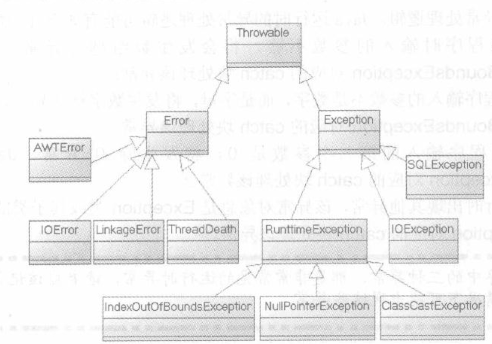

# 基本使用

Java异常机制主要依赖于try、catch、finally、throw、throws五个关键字。

1. try：它里面放置可能引发异常的代码

2. catch：后面对应异常类型和一个代码块，用于表明该catch块用于处理这种类型的代码块，可以有多个catch块。

3. finally：无论是否有异常，finally块中的代码总是会被执行的。 finally语句在执行关闭资源的语句时非常有用。

   ```java
   public static void main(String[] args) {
   		System.out.println(f());//不管有没有出错都会返回3.
   }
   
   public static int f() {
   //  String s = "1";
       String s = null;
       try {
       		s.charAt(0);
           return 1;
       } catch (Exception e) {
           return 2;
       } finally {
           return 3;
       }
   }
   ```

   ```java
   public static int f() {
           String s = "1";//返回1
   //        String s = null;//返回2
           try {
               s.charAt(0);
               return 1;
           } catch (Exception e) {
               return 2;
           } finally {
           }
       }
   ```

4. throw：用于抛出一个实际的异常，可以单独作为语句使用，抛出一个具体的异常对象。

5. throws：用在方法签名中，用于声明该方法可能抛出的异常。

当程序执行try块，catch块时遇到return语句或者throw语句，这两个语句都会导致该方法立即结束，所以系统并不会立即执行这两个语句，而是去寻找该异常处理流程中的finally块。如果没有finally块，程序立即执行return语句或者throw语句，方法终止。如果有finally块，系统立即开始执行finally块，只有当finally块执行完成后，系统才会再次跳回来执行try块、catch块里的return或throw语句，如果finally块里也使用了return或throw等导致方法终止的语句，则finally块已经终止了方法，不用再跳回去执行try块、catch块里的任何代码了。

# 异常

**执行步骤：**

1. 如果业务逻辑代码时出现异常，系统自动生成一个异常对象，该异常对象被提交给java运行环境，这个过程称为抛出（throw）异常。

2. 当java运行环境收到异常对象时，会寻找能处理该异常对象的catch块，如果找到合适的catch块并把该异常对象交给catch块处理，那这个过程称为捕获（catch）异常；如果java运行时环境找不到捕获异常的catch块，则运行时环境终止，java程序也将退出。

注意1：不管程序代码块是否处于try块中，甚至包括catch块中代码，只要执行该代码时出现了异常，系统都会自动生成一个异常对象，如果程序没有为这段代码定义任何catch块，java运行环境肯定找不到处理该异常的catch块，程序肯定在此退出。

注意2：try块后可以有多个catch块，try块后使用多个catch块是为了针对不同异常类提供的不同的异常处理方式。当系统发生不同意外情况时，系统会生成不同的异常对象，java运行时就会根据该异常对象所属的异常类来决定使用哪个catch块来处理该异常。

注意3：通常情况下，如果try块被执行一次，则try块后只有一个catch块会被执行，绝不可能有多个catch块被执行，除非在循环中使用类continue开始下一次循环，下一次循环又重新运行了try块，这才可能导致多个catch块被执行。

注意4：进行异常捕获时，要先捕获小的异常，再捕获大的异常。

# 异常类



**java把所有非正常情况分成两种：异常（Exception）和错误（Error），都是继承自Throwable父类。**

## Error

Error类一般是指与虚拟机相关的问题，如系统崩溃，虚拟机错误，内存空间不足，方法调用栈溢等。对于这类错误的导致的应用程序中断，仅靠程序本身无法恢复和预防，遇到这样的错误，建议让程序终止。Error也可以捕获。

## Exception

Exception类表示程序可以处理的异常，可以捕获且可能恢复。遇到这类异常，应该尽可能处理异常，使程序恢复运行，而不应该随意终止异常。

Exception又分为Checked异常（受检异常）和Runtime异常（运行时异常）

所有RuntimeException类及其子类的实例被称为Runtime异常，不是RuntimeException类及其子类的异常实例则被称为Checked异常。

对于非运行时异常（checked exception），必须要对其进行处理，否则无法通过编译。

运行时异常（Runtime exception），不需要对其进行处理（也可以进行处理）。

> **为什么运行时异常不需要显式处理？**
>
> 参考甲骨文Java文档，https://docs.oracle.com/javase/tutorial/essential/exceptions/runtime.html。
>
> The next question might be: "If it's so good to document a method's API, including the exceptions it can throw, why not specify runtime exceptions too?" Runtime exceptions represent problems that are the result of a programming problem, and as such, the API client code cannot reasonably be expected to recover from them or to handle them in any way. Such problems include arithmetic exceptions, such as dividing by zero; pointer exceptions, such as trying to access an object through a null reference; and indexing exceptions, such as attempting to access an array element through an index that is too large or too small.
>
> 大致意思是说Runtime异常一般是编程导致的问题，不能希望程序去恢复它。
>
> Runtime exceptions can occur anywhere in a program, and in a typical one they can be very numerous. Having to add runtime exceptions in every method declaration would reduce a program's clarity. Thus, the compiler does not require that you catch or specify runtime exceptions (although you can).
>
> Runtime exceptions可能到处发生，显式地处理会导致代码阅读性差。
>
> One case where it is common practice to throw a `RuntimeException` is when the user calls a method incorrectly. For example, a method can check if one of its arguments is incorrectly `null`. If an argument is `null`, the method might throw a `NullPointerException`, which is an *unchecked* exception.
>
> 有些地方可以要显式处理，比如有些方法的参数不能是null，这里就可以抛NullPointerException。
>
> Generally speaking, do not throw a `RuntimeException` or create a subclass of `RuntimeException` simply because you don't want to be bothered with specifying the exceptions your methods can throw.
>
> Here's the bottom line guideline: If a client can reasonably be expected to recover from an exception, make it a checked exception. If a client cannot do anything to recover from the exception, make it an unchecked exception.
>
> 如果一个异常可以程序恢复，那么就当它是受检异常，如果不能，就当它是运行时异常。

Checked异常的处理方式：

①：当方法明确知道如何处理异常，程序应该使用try...catch块来捕获该异常，然后在对应的catch块中修补该异常。

②：当方法不知道如何处理异常，应该在定义该方法时声明抛出该异常。

Runtime异常无须显式声明抛出，如果程序需要捕捉Runtime异常，也可以使用try...catch块来捕获Runtime异常。

# 使用throws抛出异常

使用throws抛出异常的思路是：当前方法不知道如何处理这种类型的异常，该异常应该由上一级调用者处理，如果main方法也不知道应该如何处理这种类型的异常，也可以使用使用throws声明抛出异常，该异常将交给JVM来处理。

JVM对异常的处理方法：打印异常跟踪栈的信息，并终止程序运行，所以有很多程序遇到异常后自动结束。

使用throws抛出异常的格式：

throws声明的抛出的语法格式紧跟在方法之后，可以声明多个异常类，多个异常类之间以逗号隔开。一旦使用了throws语句声明抛出异常，就不用再使用try...catch来捕获异常了。

如：throws ExceptionClass1，ExceptionClass2...

注意点1：如果某段代码调用了一个带throws声明的方法，该方法声明抛出了Checked异常，这表明该方法希望它的调用者来处理该异常。那么这段代码要么放在try块中显示捕获该异常，要么这段代码处于另一个带throws声明抛出的方法中。

使用throws声明抛出异常时有一个限制：就是方法重写时的“两小”中的一条规则：子类方法声明抛出的异常类型应该是父类方法声明抛出的异常类型的子类或或相等，子类方法中不允许比父类方法声明抛出更多异常。即如果子类抛出的异常是父类抛出的异常的父类，那么程序无法通过编译。

因为Checked异常存在一些不便之处，大部分情况，可以使用Runtime异常，如果程序需要在合适的地方捕获异常，并对异常进行处理，程序一样可以用try...catch捕获Runtime异常。

# 使用throw抛出异常

当程序出现错误时，系统会自动抛出异常。另外，java也允许程序自行抛出异常，自行抛出异常使用throw语句完成。

抛出异常：

如果需要在程序中自行抛出异常，应使用throw语句，throw语句可以单独使用，throw语句抛出的不是异常类，而是一个异常实例，而且每次只能抛出一个异常实例。throw语句的格式如下：throw ExceptionInstance;

throw语句抛出异常的两种情况：

1. 当throw语句抛出的异常是Checked异常，则该throw语句要么处于try块里显式捕获该异常，要么放在一个带throws声明抛出的方法中，即把异常交给方法的调用者处理。
   如：

   ```java
   public static void f1() {
       try {
           throw new IOException();
       } catch (IOException e) {
           e.printStackTrace();
       }
   }
   
   public static void f2() throws IOException {
   		throw new IOException();
   }
   
   //编译出错
   public static void f3() {
   		throw new IOException();
   }
   ```

2. 当throw语句抛出的异常是Runtime异常，则该语句无须放在try块内，也无须放在带throws声明抛出的方法中，程序既可以显式使用try...catch来捕获并处理该异常，也可以完全不理会该异常，把该异常交给方法的调用者处理。

