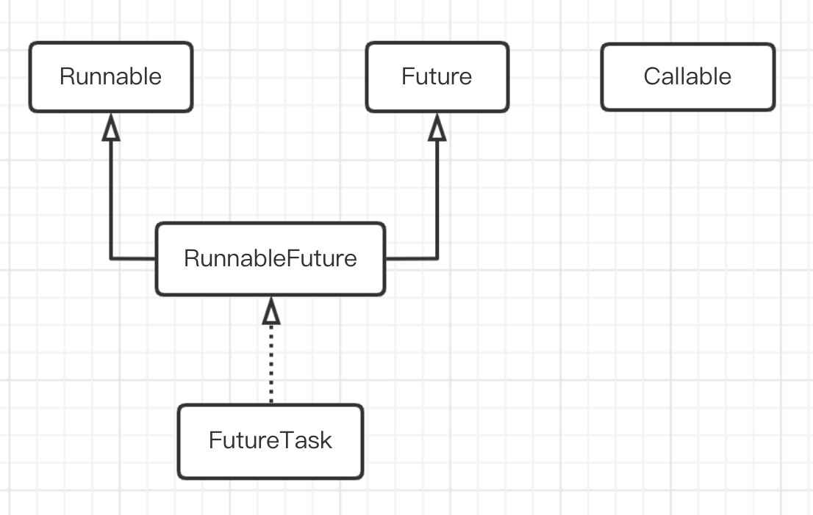
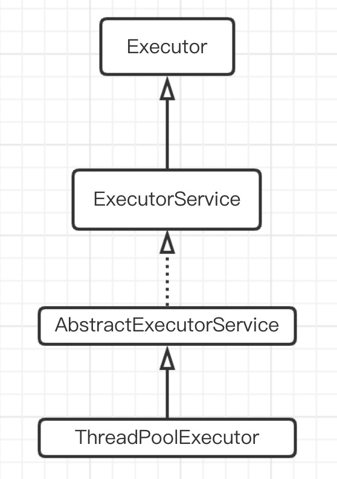

# 基础知识

## 线程安全性

如果当多个线程访问同一个可变的状态变量时没有使用合适的同步，那么程序就会出现错误。有三种方式可以修复这个问题：

-   不在线程之间共享该状态变量。
-   将状态变量修改为不可变的变量。
-   在访问状态变量时使用同步。

# 基本的线程机制

TODO 局部变量的Thread对象为什么不会被回收？

## 几种线程池的比较

| 线程池               | 特点                                                         |
| -------------------- | ------------------------------------------------------------ |
| FixedThreadPool      | 线程数量固定，当线程处于空闲状态也不会被回收，除非线程池被关闭。<br />只有核心线程，并且没有超时机制，另外任务队列没有大小限制。 |
| CachedThreadPool     | 线程数量不定，只有非核心线程，最大的线程数为Integer.MAX_VALUE<br />空闲线程具有超时机制，超过60秒就会被回收。<br />适合大量耗时少的任务。 |
| ScheduledThreadPool  | 核心线程数量固定，非核心线程没有限制，非核心线程闲置时会被立即回收。<br />主要用于执行定时任务和具有固定周期的重复任务。 |
| SingleThreadExecutor | 只有一个核心线程，相当于只有1个线程的FixedThreadPool，确保所有的任务都在同一个线程按顺序执行<br />意义在于统一所有的外界任务到一个线程，使得不需要处理同步问题。 |

## 在任务中产生返回值

实现Callable接口可以返回一个值。

```java
public class TaskWithResult implements Callable<Integer> {
    private static int taskCount = 0;
    private final int id = taskCount++;
    private int countDown = 3;

    public TaskWithResult() {
    }

    public TaskWithResult(int countDown) {
        this.countDown = countDown;
    }

    @Override
    public Integer call() throws Exception {
        return id;
    }

    public static void main(String[] args) {
        ExecutorService service=Executors.newCachedThreadPool();
        ArrayList<Future<Integer>> futures=new ArrayList<>();
        for (int i = 0; i < 5; i++) {
            futures.add(service.submit(new TaskWithResult()));
        }
        for (Future<Integer> future : futures) {
            try {
                System.out.println(future.get()+"");
            } catch (ExecutionException | InterruptedException e) {
                e.printStackTrace();
            }
        }
        service.shutdown();
    }
}

output:
0
1
2
3
4
```

submit方法会产生Future对象，它用Callable返回结果的特定类型进行了参数化。你可以用isDone方法来查询Future是否已经完成。当任务完成时，它具有一个结果，你可以调用get方法来获取该结果。你也可以不用isDone进行检查就直接调用get()，在这种情况下，get方法将阻塞，直至结果准备就绪。你还可以在试图调用get()来获取结果之前，先调用具有超时的get方法，或者调用isDone方法来查看任务是否完成。

## 优先级

优先级是在run方法里设置的，在构造器里设置不会有任何好处，因为Executor此刻还没有开始执行任何任务。

JDK有10个优先级。

## 后台线程

所谓后台(daemon)线程，是指在程序运行的时候在后台提供种通用服务的线程，并且这种线程并不属于程序中不可或缺的部分。因此，当所有的非后台线程结束时，程序也就终止了，同时会杀死进程中的所有后台线程。反过来说，只要有任何非后台线程还在运行，程序就不会终止。比如，执行main方法的就是一个非后台线程。

通过Thread类的setDaemon方法来设置后台线程。

```java
public class SimpleDaemons implements Runnable {
    @Override
    public void run() {
        while (true){
            try {
                TimeUnit.MILLISECONDS.sleep(100);
                System.out.println(this);
            } catch (InterruptedException e) {
                e.printStackTrace();
            }
        }
    }

    public static void main(String[] args) {
        for (int i = 0; i < 5; i++) {
            Thread thread=new Thread(new SimpleDaemons());
            thread.setDaemon(true);
            thread.start();
        }

        try {
            TimeUnit.MILLISECONDS.sleep(200);
        } catch (InterruptedException e) {
            e.printStackTrace();
        }
    }
}

output:
com.mezzsy.learnsomething.java.chapter21.SimpleDaemons@21b2eb29
com.mezzsy.learnsomething.java.chapter21.SimpleDaemons@55ca3d7b
com.mezzsy.learnsomething.java.chapter21.SimpleDaemons@4ed00e29
com.mezzsy.learnsomething.java.chapter21.SimpleDaemons@446e492e
com.mezzsy.learnsomething.java.chapter21.SimpleDaemons@2f74c3b2
```

可以看到后台线程还没执行完，程序就停止了。

## 另一种开启线程的方法

```java
public class MyThread extends Thread {
    @Override
    public void run() {
        System.out.println("1"+Thread.currentThread());
    }

    public static void main(String[] args) {
        System.out.println("2"+Thread.currentThread());
        new MyThread().start();
        new MyThread().run();
    }
}

output:
2Thread[main,5,main]
1Thread[main,5,main]
1Thread[Thread-0,5,main]
```

之前的是在Thread的构造器里传入一个实现了Runnable接口并重写其run方法的对象，然后调用start方法开启一个线程。

这一种方法是直接重写Thread类的run方法，然后调用start方法开启一个线程。如果直接调用Thread的run方法只会在当前线程执行。

可以看出，开启一个线程都需要调用start方法。

## 加入一个线程

```java
public class Sleeper extends Thread {
    private int duration;

    public Sleeper(String name, int duration) {
        super(name);
        this.duration = duration;
        start();
    }

    @Override
    public void run() {
        try {
            sleep(duration);
        } catch (InterruptedException e) {
            e.printStackTrace();
        }
        System.out.println(currentThread());
    }

}
```

```java
public class Joiner extends Thread {
    private Sleeper mSleeper;

    public Joiner(String name, Sleeper sleeper) {
        super(name);
        mSleeper = sleeper;
        start();
    }

    @Override
    public void run() {
        try {
            mSleeper.join();
        } catch (InterruptedException e) {
            e.printStackTrace();
        }
        System.out.println(currentThread());
    }

    public static void main(String[] args) {
        new Joiner("Joiner", new Sleeper("Sleeper", 500));
    }
}

output：
Thread[Sleeper,5,main]
Thread[Joiner,5,main]
```

修改Joiner的run方法

```java
@Override
    public void run() {
        try {
//            mSleeper.join();
            mSleeper.join(400);
        } catch (InterruptedException e) {
            e.printStackTrace();
        }
        System.out.println(currentThread());
    }
```

再次运行

```
Thread[Joiner,5,main]
Thread[Sleeper,5,main]
```

设置一个超时参数，如果目标线程在这段时间到期时还没结束的话，join方法总能返回。

中断join方法可以用interrupt方法。

改写Sleeper的run方法

```java
@Override
public void run() {
    try {
        sleep(duration);
    } catch (InterruptedException e) {
        System.out.println("Sleeper被中断");
        return;
    }
    System.out.println(currentThread());
}
```

```java
public static void main(String[] args) {
    Sleeper sleeper=new Sleeper("Sleeper",500);
    new Joiner("Joiner",sleeper);
    sleeper.interrupt();
}

output：
Sleeper被中断
Thread[Joiner,5,main]
```

另外在异常中调用isInterrupt方法，总是为假，因为异常被捕获的时候讲清理这个标志。

```java
public void run() {
        try {
            sleep(duration);
        } catch (InterruptedException e) {
            System.out.println("Sleeper被中断");
            System.out.println(isInterrupted());
            return;
        }
        System.out.println(currentThread());
}

Sleeper被中断
false
Thread[Joiner,5,main]
```

## 捕获异常

由于线程的本质特性，使得不能捕获从线程中逃逸的异常。

```java
public class ExeceptionRunnable implements Runnable {
    @Override
    public void run() {
        throw new RuntimeException();
    }
}
```

```java
public static void main(String[] args) {
    ExecutorService service=Executors.newCachedThreadPool();
    service.execute(new ExeceptionRunnable());
    service.shutdown();
}

Exception in thread "pool-1-thread-1" java.lang.RuntimeException
//...	
```

```java
public static void main(String[] args) {
    try {
        ExecutorService service=Executors.newCachedThreadPool();
        service.execute(new ExeceptionRunnable());
        service.shutdown();
    }catch (RuntimeException e){
        System.out.println("catch !!!");
    }
}

Exception in thread "pool-1-thread-1" java.lang.RuntimeException
//...
```

为了解决这个问题，修改Executor产生线程的方式。

```java
public class HandlerExeceptionThread implements Thread.UncaughtExceptionHandler,
        ThreadFactory {

    public static void main(String[] args) {
        ExecutorService service = Executors.newCachedThreadPool(new HandlerExeceptionThread());
        service.execute(new ExeceptionRunnable());
        service.shutdown();
    }

    @Override
    public void uncaughtException(Thread t, Throwable e) {
        System.out.println("catch !!!");
    }

    @Override
    public Thread newThread(Runnable r) {
        Thread thread = new Thread(r);
        thread.setUncaughtExceptionHandler(new HandlerExeceptionThread());
        return thread;
    }
}

output：
catch !!!
```

在创建线程的时候，用setUncaughtExceptionHandler方法为其设置异常处理器。

# 共享受限资源

## 解决共享资源竞争

主要是synchronized关键字。

## 显式的Lock对象（ReentrantLock）

### 不加锁的情况

```java
public class Main {
    private int i = 0;

    public static void main(String[] args) {
        Main main = new Main();

        int size = 10000;
        Thread[] threads = new Thread[size];
        for (int i = 0; i < size; i++) {
            threads[i] = new Thread(main::add);
        }
        for (int i = 0; i < size; i++) {
            threads[i].start();
        }
    }

    public void add() {
        i++;
        System.out.println(i);
    }
}
```

创建10000个线程，对同一个对象main调用方法add，输出结果：

```
//。。。上面略，以下是最后3个结果
9863
9864
9865
```

可以看到i并没有变为预期的10000。

### 加锁

```java
public class Main {
    private int i = 0;
    private static Lock sLock = new ReentrantLock();//锁类
  	private Lock mLock = new ReentrantLock();//锁对象

    public static void main(String[] args) {
        Main main = new Main();

        int size = 10000;
        Thread[] threads = new Thread[size];
        for (int i = 0; i < size; i++) {
            threads[i] = new Thread(main::add);
        }
        for (int i = 0; i < size; i++) {
            threads[i].start();
        }
    }

    public void add() {
        sLock.lock();
        try {
            i++;
            System.out.println(i);
        } finally {
            sLock.unlock();
        }
    }
}
```

### 特点

#### 可重入

其实synchronized 也是可重入的

```java
lock.lock();
lock.lock();
try{
    i++;
            
}           
finally{
    lock.unlock();
    lock.unlock();
}
```

> 由于`ReentrantLock`是重入锁，所以可以反复得到相同的一把锁，它有一个与锁相关的获取计数器，如果拥有锁的某个线程再次得到锁，那么获取计数器就加1，然后锁需要被释放两次才能获得真正释放(重入锁)。

#### 可中断

#### 可限时

- 超时不能获得锁，就返回false，不会永久等待构成死锁
- 使用`lock.tryLock(long timeout, TimeUnit unit)`来实现可限时锁，参数为时间和单位。

#### 公平锁

- 一般意义上的锁是不公平的，不一定先来的线程能先得到锁，后来的线程就后得到锁。不公平的锁可能会产生饥饿现象。
- 公平锁的意思就是，这个锁能保证线程是先来的先得到锁。虽然公平锁不会产生饥饿现象，但是公平锁的性能会比非公平锁差很多。

使用

```java
private Lock mLock = new ReentrantLock(true);
```

## 原子类

```java
public class Main {
    public static void main(String[] args) {
        Thread[] threads = new Thread[1000];
        for (int i = 0; i < threads.length; i++) {
            threads[i] = new Thread(new InteterAddRunnable());
        }
        for (Thread thread : threads) {
            thread.start();
        }
    }

    private static class InteterAddRunnable implements Runnable {
        private static int i = 0;

        @Override
        public void run() {
            for (int j = 0; j < 10; j++) {
                add();
                printInt();
            }
        }

        private static void add() {
            i++;
        }

        private static void printInt() {
            System.out.println(i);
        }
    }

}
```

这是很常见的一个并发问题，最终i的结果并不是预期的10000。

一种解决方法是加锁

```java
private synchronized static void add() {
    i++;
}

private synchronized static void printInt() {
    System.out.println(i);
}
```

另一种方法是利用原子类

```java
public class Main {
    public static void main(String[] args) {
        Thread[] threads = new Thread[1000];
        for (int i = 0; i < threads.length; i++) {
            threads[i] = new Thread(new InteterAddRunnable());
        }
        for (Thread thread : threads) {
            thread.start();
        }
    }

    private static class InteterAddRunnable implements Runnable {
        private static AtomicInteger i = new AtomicInteger(0);

        @Override
        public void run() {
            for (int j = 0; j < 10; j++) {
                add();
                printInt();
            }
        }

        private static void add() {
            i.addAndGet(1);
        }

        private static void printInt() {
            System.out.println(i);
        }
    }
}
```

## 线程本地存储

防止任务在共享资源上产生冲突的第二种方式是根除对变量的共享。

# 线程之间的协作

## wait和notifyAll

有两种形式的wait()。

第一种版本接受毫秒数作为参数，含义与sleep方法里参数的意思相同，都是指“在此期间暂停”。但是与sleep不同的是，对于wait而言：

1.  在wait期间对象锁是释放的。
2.  可以通过notify、notifyAll，或者令时间到期，从wait中恢复执行。

第二种，也是更常用形式的wait不接受任何参数。这种wait将无限等待下去，直到线程接收到notify或者notifyAlI消息。

wait、notify以及notifyAll是基类Object的一部分，而不是属于Thread的一部分。只能在同步控制方法或同步控制块里调用wait、notify和notifyAll(因为不用操作锁，所以sleep可以在非同步控制方法里调用)。如果在非同步控制方法里调用这些方法，程序能通过编译，但运行的时候，将得到legalMonitorStateException异常，并伴随着一些含糊的消息，比如“当前线程不是拥有者”。wait、notify以及 notifyAll前提是要获取锁。

**注意点**

wait设置了等待时间，并且其他线程操作超过此等待时间。

```java
public static void main(String[] args) {
    Main main = new Main();

    new Thread(new Runnable() {
        @Override
        public void run() {
            main.f1();
        }
    }).start();

    new Thread(new Runnable() {
        @Override
        public void run() {
            main.f2();
        }
    }).start();
}

private synchronized void f1() {
    try {
        System.out.println("wait");
        wait(100);
        System.out.println("finish");
    } catch (InterruptedException e) {
        System.out.println("error");
    }
}

private synchronized void f2() {
    try {
        System.out.println("sleep");
        Thread.sleep(5000);
    } catch (InterruptedException e) {
        e.printStackTrace();
    }
    System.out.println("wake");
}

out：
wait
sleep
wake
finish
```

将上面的wait(100)改为wait()，结果出现死锁。

**结论**，带参数的wait方法当超过了指定时间后会移除等待集合，开始竞争锁，而不带wait的方法会一直等待。

## notify和notifyAll

使用notify时，在众多等待同一个锁的任务中只有一个会被唤醒，因此如果使用notify，就必须保证被唤醒的是恰当的任务。另外，为了使用notify，所有任务必须等待相同的条件，因为如果有多个任务在等待不同的条件，那么不会知道是否唤醒了恰当的任务。如果使用notify，当条件发生变化时，必须只有一个任务能够从中受益。最后，这些限制对所有可能存在的子类都必须总是起作用的。如果这些规则中有任何一条不满足，那么就必须使用notifyAll而不是notify。

>   个人总结：notifyAll()是将所有等待此锁的线程移出等待集合，开始竞争锁。而notify方法是选择一个移出等待集合，开始竞争锁。

**demo**

```java
public static void main(String[] args) {
    Main main = new Main();

    new Thread(new Runnable() {
        @Override
        public void run() {
            main.f1();
        }
    }).start();

    new Thread(new Runnable() {
        @Override
        public void run() {
            main.f2();
        }
    }).start();

    new Thread(new Runnable() {
        @Override
        public void run() {
            main.f3();
        }
    }).start();
}

private synchronized void f1() {
    try {
        System.out.println("f1 wait");
        wait();
    } catch (InterruptedException e) {
        e.printStackTrace();
    }
    System.out.println("f1 finish");
}

private synchronized void f2() {
    try {
        System.out.println("f2 wait");
        wait();
    } catch (InterruptedException e) {
        e.printStackTrace();
    }
    System.out.println("f2 finish");
}

private synchronized void f3() {
    System.out.println("f3 notifyAll");
    notifyAll();
    System.out.println("f3 finish");
}
```

**输出**

```
f1 wait
f2 wait
f3 notifyAll
f3 finish
f2 finish
f1 finish
```

全部执行完成，然后将上面的notifyAll改为notify，结果只有一个线程唤醒，另一个出现死锁。

## Lock和Condition

**condition.await()————>lock.wait()**

**condition.await(long time, TimeUnit unit)————>lock.wait(long timeout)**

**condition.signal()————>lock.notify()**

**condition.signaAll()————>lock.notifyAll()**

用法和synchronized差不多，而且对于一个锁可以绑定多个条件。

```java
public class Main {
    private Lock mLock = new ReentrantLock();
    private Condition mCondition1 = mLock.newCondition();
    private Condition mCondition2 = mLock.newCondition();

    public static void main(String[] args) {
        Main main = new Main();

        new Thread(new Runnable() {
            @Override
            public void run() {
                main.f1();
            }
        }).start();

        new Thread(new Runnable() {
            @Override
            public void run() {
                main.f2();
            }
        }).start();

        new Thread(new Runnable() {
            @Override
            public void run() {
                main.f3();
            }
        }).start();
    }

    private void f1() {
        mLock.lock();

        try {
            mCondition1.await();
        } catch (InterruptedException e) {
            e.printStackTrace();
        }
        System.out.println("f1 awake");

        mLock.unlock();
    }

    private void f2() {
        mLock.lock();

        try {
            mCondition2.await();
        } catch (InterruptedException e) {
            e.printStackTrace();
        }
        System.out.println("f2 awake");

        mLock.unlock();
    }

    private void f3() {
        mLock.lock();

        for (int i = 0; i < 20; i++) {
            if (i == 5) {
                mCondition1.signalAll();
            } else if (i == 10) {
                mCondition2.signalAll();
            }
        }
        System.out.println("f3 finish");

        mLock.unlock();
    }

}

out:
f3 finish
f1 awake
f2 awake
```

# 线程/线程池总结

## 线程池及任务的类关系



-   Runnable：用于描述线程需要执行的任务。
-   Future：用于描述异步任务执行的结果。
-   RunnableFuture：将Runnable和Future结合。
-   FutureTask：RunnableFuture的具体实现。
-   Callable：能够返回结果的任务。



-   Executor：执行Runnable任务（execute方法）。
-   ExecutorService：扩展了Executor，除了能执行Runnable任务（execute方法），还可以执行Callable任务（submit方法）。
-   AbstractExecutorService：ExecutorService的默认实现。
-   ThreadPoolExecutor：线程池的具体实现。

### 总结

Thread类和Runnable类是最早出现的类，而线程池和Callable是后面才出现的类，为了兼容两者，出现了RunnableFuture类，具体实现是FutureTask，FutureTask有2个构造方法：`public FutureTask(Callable<V> callable)`和`public FutureTask(Runnable runnable, V result)`，在内部，它们都会转为Callable，并成为FutureTask的成员变量callable，而FutureTask本身是一个Runnable，所以会在run方法里执行callable的call方法。

线程池一般有2个方法用来执行任务，一个是execute，还有一个是submit，submit有3个重载方法，但殊途同归，传入的参数最终都会转为FutureTask，然后调用execute方法。所以execute方法是线程池执行任务的核心。

# 线程相关问题

## Thread的interrupt方法会不会中断线程？

```java
public static void main(String[] args) {
    Thread thread = new Thread(new Runnable() {
        @Override
        public void run() {
            //模拟耗时操作
            int[] ints = new int[Integer.MAX_VALUE / 1000];
            Random random = new Random();
            for (int i = 0; i < ints.length; i++) {
                ints[i] = random.nextInt();
                Arrays.sort(ints);
            }

            System.out.println("finish!");
        }
    });
    thread.start();

    //停顿一下
    try {
        Thread.sleep(1000);
    } catch (InterruptedException e) {
        e.printStackTrace();
    }
    thread.interrupt();
}
```

从结果来看，interrupt并不会中断正在执行的线程。

从源码的文档来看，除了某些状态，如当前线程正在wait、join、sleep等等会抛出异常，其余的情况只会更改interrupt状态。原文如下：

```
If none of the previous conditions hold then this thread's interrupt status will be set.
```

如果想要实际地中断线程，可以利用上文所说的interrupt状态，修改代码：

```java
for (int i = 0; i < ints.length; i++) {
	if (Thread.interrupted()) break;
		ints[i] = random.nextInt();
		Arrays.sort(ints);
}
```

## Thread对象会不会被回收？

在start之前会，在start会，因为start内部会调用`private native static void nativeCreate(Thread t, long stackSize, boolean daemon);`方法，将Thread对象本身传给native。native会持有Thread的引用。

# 

