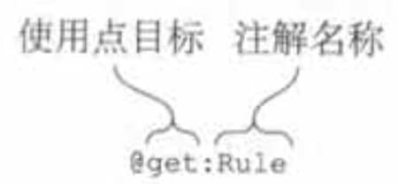
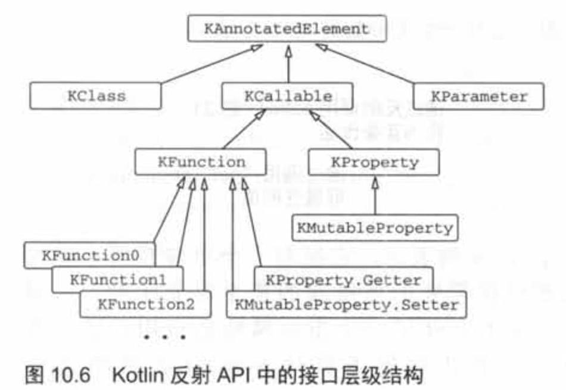

# 注解

## 应用注解

使用方式和Java一样。

注解只能拥有如下类型的参数：基本数据类型、字符串、枚举、类引用、其他的注解类，以及前面这些类型的数组。

指定注解实参的语法与Java有些微小的差别：

-   要把一个类指定为注解实参，在类名后加上::class：@MyAnnotation(MyClass::class)。
-   要把另一个注解指定为一个实参，去掉注解名称前面的@。
-   要把一个数组指定为一个实参，使用arrayOf函数；`@RequestMapping(path = arrayOf("/foo", "/bar"))`。 如果注解类是在Java中声明的，命名为value的形参按需自动地被转换成可变长度的形参，所以不用arrayOf函数就可以提供多个实参。

注解实参需要在编译期就是已知的，所以不能引用任意的属性作为实参。要把属性当作注解实参使用，需要用const修饰符标记它，来告知编译器这个属性是编译期常量。

## 注解目标

Kotin源代码中的一些单个声明会对应成多个Java声明，而且它们每个都能携带注解。例如，一个 Kotlin属性就对应了一个Java字段、一个getter，以及一个潜在的setter和它的参数。所以需要说明这些元素中哪些需要注解。

使用点目标声明被用来说明要注解的元素。使用点目标被放在@符号和注解名称之间，并用冒号和注解名称隔开。图中的单词get导致注解@Rule被应用到了属性的getter上。



Kotlin支持的使用点目标的整列表如下：

-   property：Java的注解不能应用这种使用点目标。

-   field：为属性生成的字段。
-   get：属性的getter.
-   set：属性的setter。
-   receiver：扩展函数或者扩展属性的接收者参数。
-   param：构造方法的参数。
-   setparam：属性setter的参数。
-   delegate：为委托属性存储委托实例的字段。
-   file：包含在文件中声明的顶层函数和属性的类。

注意，和Java不一样的是，Kotin 允许对任意的表达式应用注解，而不仅仅是类和函数的声明及类型。

### 用注解控制Java API

Kotlin提供了各种注解来控制Kotlin编写的声明如何编译成字节码并暴露给Java调用者。其中一些注解代替了Java语言中对应的关键字：比如，注解@Volatile和@Strictfp直接充当了Java的关键字volatile和strictfp的替身。

其他的注解则是被用来改变Kotlin 声明对Java调用者的可见性：

-   @JvmName将改变由Kotlin 生成的Java方法或字段的名称。

-   @JvmStatic能被用在对象声明或者伴生对象的方法上，把它们暴露成Java的静态方法。

-   @JvmOverloads,曾在3.2.2节中出现过，指导Kotlin编译器为带默认参数值的函数生成多个重载(函数)。

-   @JvmField可以应用于一个属性，把这个属性暴露成一个没有访问器的公有Java字段。

## 声明注解

Kotlin的注解声明和Java的不一样：

```
annotation class JsonExclude(val name : String)//如果有参数的话
```

# 反射

Kotlin的反射有2种API，一种是Java的API，定义在包`java.lang.reflect`中，所以使用了反射API的Java库完全兼容Kotlin代码。另一种是Kotlin的API，定义在`kotlin.reflect`。

Koltin的反射库单独打成了包，这是为了减小Android包的大小，如果要使用，需要引入依赖：`org.jetbrains.kotlin:kotlin-reflect`。

Java反射的入口是Class对象，而Kotlin反射的入口是KClass对象。

```kotlin
fun getClass() {
    val person = Person("Alice", 29)
    //获取KClass对象
    val kClass1: KClass<Person> = Person::class
    val kClass2: KClass<Person> = person.javaClass.kotlin
    //获取JavaClass对象
    val class1: Class<Person> = Person::class.java
    val class2: Class<Person> = person.javaClass
}
```

## 反射调用方法

2种方式

1.  获取没有类型参数的KFunction对象，然后调用call方法并传入相应的参数

```kotlin
fun foo(x: Int) = println(x)

fun main(args: Array<String>) {
    val kFunction = ::foo
    kFunction.call(42)
}
```

但这种方式如果传的参数个数有错误就会导致运行时异常。

2.  获取带类型参数的KFunction对象，然后调用invoke方法。

```kotlin
fun sum(x: Int,y: Int) = x + y

fun test() {
    val kFunction: KFunction2<Int,Int,Int> = ::sum
    println(kFunction.invoke(1, 2))//可以调用invoke方法
    println(kFunction(3, 4))//可以省略invoke方法
}
```

>   **KFunctionN接口是如何定义的，又是在哪里定义的？**
>
>   像KFunction1这样的类型代表了不同数量参数的函数。每一个类型都继承了KFunction并加上一个额外的成员invoke，它拥有数量刚好的参数。例如，KFunction2声明了operator fun invoke(p1: P1， p2: P2): R，其中P1和P2代表着函数的参数类型，而R代表着函数的返回类型。
>
>   这些类型称为合成的编译器生成类型，你不会在包kotlin.reflect中找到它们的声明。这意味着你可以使用任意数量参数的函数接口。合成类型的方式减小了kotlin-reflect.jar的尺寸，同时避免了对函数类型参数数量的人为限制。

## 反射的方法包含默认参数的情况

```kotlin
fun test2() {
    val fun1: KFunction1<Int,Int> = ::fun1
    println(fun1.call())
}

fun fun1(x: Int = 1): Int = x
```

调用test2方法会报错`Callable expects 1 arguments, but 0 were provided.`

应该用callBy方法，callBy需要一个`Map<KParameter, Any?>`参数，表示传入此方法的参数。

```kotlin
fun test2() {
    val fun1: KFunction2<Int,Int,Int> = ::fun1
    val paramList = fun1.parameters
    val paramsMap = hashMapOf<KParameter,Any?>()
    paramsMap[paramList[0]] = 2
    println(fun1.callBy(paramsMap))
}

fun fun1(x: Int = 1,y: Int = 3): Int = x + y
```

## 反射获取属性

```kotlin
var value: Int = 1

class Person(val name: String, var age: Int)

fun main(args: Array<String>) {
    //顶层属性表示为KProperty0的实例，有一个无参的get方法
    val kProperty = ::value
    var temp = kProperty.call()//call方法会调用其getter方法
    println(temp)
    kProperty.set(23)
    temp = kProperty.get()
    println(temp)
    
    //成员属性由KProperty1的实例表示，它拥有一个单参数的get方法，参数为所属的那个对象实例。
    val person = Person("aa", 12)
    val kPropertyAge = Person::age//具体类型为KProperty<Person, Int>，第一个表示接收者类型，第二个表示属性类
    println(kPropertyAge.get(person))
    kPropertyAge.set(person, 22)
    println(kPropertyAge.get(person))
}
```

不能访问函数的局部变量。

KProperty可以表示任何属性，而它的子类KMutableProperty表示一个用var声明的可变属性。



