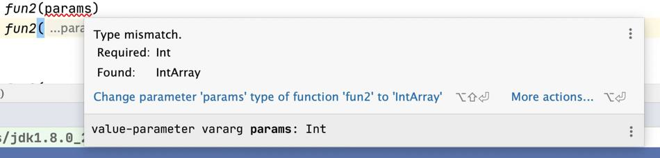

# 函数使用示例

```kotlin
/**
 * 没有返回值的函数
 */
fun main(args: Array<String>) {
    println("Hello World")
}

/**
 * 带有返回值的函数
 */
fun max(a: Int, b: Int): Int {
    return if (a > b) a else b
}
```

# 表达式函数体

```kotlin
fun fizzBuzz(i: Int) = when {
    i % 15 == 0 -> "FizzBuzz"
    i % 3 == 0 -> "Fizz"
    i % 5 == 0 -> "Buzz"
    else -> "$i"
}
```

如果函数体写在花括号中，那么这个函数有代码块体。如果它直接返回了一个表达式，它就有表达式体。

事实上，Kotlin的每个变量和表达式都有类型，每个函数都有返回类型。但是对表达式体函数来说，编译器会分析作为函数体的表达式，并把它的类型作为函数的返回类型，即使没有显式地写出来。（这种分析通常被称作类型推导）

注意，只有表达式体函数的返回类型可以省略。对于有返回值的代码块体函数，必须显式地写出返回类型和return语句。

# 默认函数

注意，参数的默认值是被编码到被调用的函数中，而不是调用的地方。如果改变了参数的默认值并重新编译这个函数，没有给参数重新赋值的调用者，将会开始使用新的默认值。

## Java调用Kotlin默认值函数

Java没有参数默认值的概念，从Java中调用Kotlin函数的时候，必须显式地指定所有参数值。

如果需要从Java代码中做频繁的调用，而且希望它能对Java的调用者更简便，可以用`@JvmOverloads`注解它。这个指示编译器生成Java重载函数，从最后一个开始省略每个参数。

# 顶层函数

Java调用Kotlin的顶层函数，一般是`文件+kt.xxx();`，如：

```java
import com.mezzsy.javalearn.kotlin.chapter3.Chapter3Kt;

/**
 * 调用Kotlin的顶层函数
 */
private static void test9() {
    Chapter3Kt.helloWorld();
}
```

## 修改顶层函数的文件类名

要改变包含Kotlin顶层函数的生成的类的名称，需要为这个文件添加@JvmName的注解，将其放到这个文件的开头，位于包名的前面

**kotlin文件**

```kotlin
@file:JvmName("StaticFun")//注解指定类名

package com.mezzsy.learnsomething.kotlin.chapter2 //包的声明在注解之后

fun staticFun() {
    println("Hello World!")
}

class Human(var age: Int, val name: String)
```

这样就可以在Java文件中调用了

**Java文件**

```Java
package com.mezzsy.learnsomething.kotlin.chapter3;

import com.mezzsy.learnsomething.kotlin.chapter2.StaticFun;

class StaticFunTest {
    public static void main(String[] args) {
        StaticFun.staticFun();
    }
}

Hello World!
```

**这个功能在Kotlin文件中不能使用。**

## 顶层属性

```kotlin
val UNIX_LINE_SEPARATOR = "\n"
```

默认情况下，项层属性和其他任意的属性一样，是通过访问器暴露给Java使用的。为了方便使用，如果要把一个常量以`public static final`的属性暴露给Java，可以用const来修饰它（这个适用于所有的基本数据类型的属性，以及String类型）。

```kotlin
const val UNIX_LINE_SEPARATOR = "\n"
```

使用例子：

```kotlin
val ch3V1 = 123
const val ch3V2 = 234
val ch3V3 = Ch3ClassA()

class Ch3ClassA
```

```java
/**
 * 调用Kotlin的顶层属性
 */
private static void test10() {
    System.out.println("v1 = " + Chapter3Kt.getCh3V1());
    System.out.println("v2 = " + Chapter3Kt.ch3V2);
    System.out.println("v3 = " + Chapter3Kt.getCh3V3());
}
```

# 扩展函数

## 导入扩展函数

对于定义的一个扩展函数，它不会自动地在整个项目范围内生效。如果要使用它，需要进行导入，就像其他任何的类或者函数一样。 这是为了避免偶然性的命名冲突。Kotin 允许用和导入类一样的语法来导入单个的函数。

```kotlin
import com.mezzsy.learnsomething.kotlin.chapter2.staticFun as sF

fun main() {
    sF()
}
```

在导入声明的时候，可以用关键字as用来进行重命名。

## 在Java中调用扩展函数

扩展函数本质是静态函数，它把调用对象作为了它的第一个参数。调用扩展函数，不会创建适配的对象或者任何运行时的额外消耗。

从Java中调用Kotlin的扩展函数：调用这个静态函数，然后把接收者对象作为第一个参数传进去即可。包含这个函数的Java类的名称，是由这个函数声明的文件名称决定的。

假设它声明在一个叫作StringUtil.kt的文件中：

```java
/* Java */
char c = StringUtilKt.lastChar("Java");
```

## 扩展函数总结

扩展函数本质是一个语法糖，就是在当前类里声明一个静态方法，其第一个参数是调用对象。所以只能扩展函数内部只能调用对象的public方法。

从Java的调用方式即可看出。

## 扩展属性

略。

# 可变参数

```kotlin
fun testMultiParams() {
    fun1(1,2,3)
}

fun fun1(vararg params: Int) {
    fun2(*params)
//    fun2(params)
    fun2(0, *params)
}

fun fun2(vararg params: Int) {
    println(params)
    println(params.contentToString())
}
```

```
[I@3cd1a2f1
[1, 2, 3]
[I@27c170f0
[0, 1, 2, 3]
```

语法：Kotlin在该类型之后不会再使用三个点，而是在参数上使用vararg修饰符。

另一个区别是，当需要传递的参数已经包装在数组中时，调用该函数的语法。在Java中，可以按原样传递数组，而Kotlin则要求你显式地解包数组，以便每个数组元素在函数中能作为单独的参数来调用。从技术的角度来讲，这个功能被称为展开运算符，而使用的时候，不过是在对应的参数前面放一个`*` 。通过展开运算符，可以在单个调用中组合来自数组的值和某些固定值。

例子中注释掉是因为会报错：



>   //TODO 可以从反编译字节码文件来查看其原理。

# 命名参数

当调用一个Kotin定义的函数时，可以显式地标明一些参数的名称。如果在调用一个函数时，指明了一个参数的名称，为了避免混淆，那它之后的所有参数都需要标明名称。

```kotlin
fun main(args: Array<String>) {
    val list = listOf(1, 2, 3)
    println(list.joinToString(separator = "; ",
            prefix = "(", postfix = ")"))
}
```

>   注意，调用Java的方法时，不能使用命名参数，因为把参数名称存到.class文件是Java8及其更高版本的一个可选功能，而Kotlin需要保持和Java 6的兼容性。所以，编译器不能识别出调用函数的参数名称，然后把这些参数名对应到函数的定义的地方。

# 中缀调用to和结构声明

[标准库函数总结](./标准库函数总结.md)

