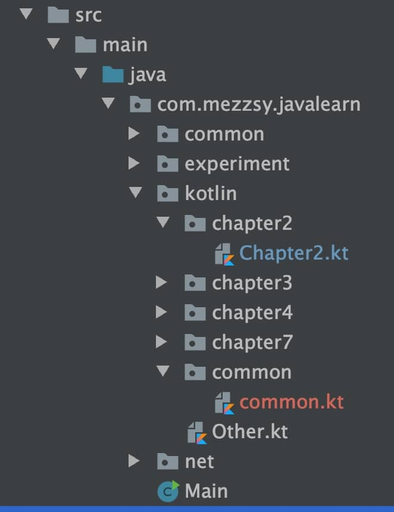

# 语句和表达式（if）

在Kotlin中，if是表达式，而不是语句。

语句和表达式的区别在于，表达式有值，并且能作为另一个表达式的一部分使用；而语句总是包围着它的代码块中的顶层元素，并且没有自己的值。

在Java中， 所有的控制结构都是语句。而在Kotlin中，除了循环(for、do和do/while)以外大多数控制结构都是表达式。

另一方面，Java 中的赋值操作是表达式，在Kotlin中反而变成了语句。这句话的意思是，Java一般会有这样的写法：`while((len = in.read(buffer)) != -1)`，因为Java的赋值操作有返回值，但是Koltin不行，这种写法在Kotlin行不通。

**例子**

```kotlin
fun main(args: Array<String>) {
    println(max(1，2))
}

fun max(a: Int， b: Int): Int {
    return if (a > b) a else b
}

2
```

# 可变变量和不可变量

在Kotlin中以关键字开始，然后是变量名称，最后可以加上类型（不加也可以）。

-   val（来自value）不可变引用，对应Java的final变量。
-   var（来自variable）可变引用，对应Java普通(非final)变量。

lateinit不能修饰基础数据类型，只能修饰引用类型。

# 类型检查和转换

```kotlin
fun main() {
    println(eval(Sum(Sum(Num(1), Num(4)), Num(7))));
}

interface Expr
class Num(val value: Int) : Expr
class Sum(val left: Expr, val right: Expr) : Expr

fun eval(e: Expr): Int =
        when (e) {
            is Num ->
                e.value
            is Sum ->
                eval(e.right) + eval(e.left)
            else ->
                throw IllegalArgumentException("未知表达式")
        }


12
```

is相当于Java中instanceof，但是不需要显式的类型转换。

可以使用as进行显式转换。

```kotlin
val n = e as Num
```

# 异常

在Java中，受检异常必须显式地处理，要么trycatch受检异常，要么抛出。

和其他许多现代JVM语言一样，Kotlin 并不区分受检异常和未受检异常。不用指定函数抛出的异常，而且可以处理也可以不处理异常。

这种设计是基于Java中使用异常的实践做出的决定，经验显示这些Java规则常常导致许多毫无意义的重新抛出或者忽略异常的代码，而且这些规则不能总是免受可能发生的错误。

Kotlin的try和catch都是表达式，可以返回值。

# 字符串

## 字符串模版

```kotlin
fun main(args: Array<String>) {
    val name = if (args.size > 0) args[0] else "Kotlin"
    println("Hello, $name!")
}

fun main(args: Array<String>) {
    println("Hello, ${if (args.size > 0) args[0] else "someone"}!")
}
```

在字符串中用`$`来引用变量，如果要打印`$`，可以用`\`转义。

## 分割字符串

在Java中

```java
public static void main(String[] args) {
    System.out.println(Arrays.toString("12.345-6.7".split(".")));
}

[]
```

如果将点.作为分隔符，那么返回的是一个空数组，因为它将一个正则表达式作为参数，并根据表达式将字符串分割成多个字符串。

而Kotlin的解决办法是

```kotlin
fun main(args: Array<String>) {
    println("12.345-6.7".split(".".toRegex()))
}

[， ， ， ， ， ， ， ， ， ， ]
```

如果传入的是正则表达式，那么用toRegex方法表示这是一个正则表达式，如果不加，就表示不是正则表达式。

```kotlin
fun main(args: Array<String>) {
    println("12.345-6.7".split("."))
}

[12， 345-6， 7]
```

指定多个分隔符

```kotlin
fun main(args: Array<String>) {
    println("12.345-6.7".split("."，"-"))
}

[12， 345， 6， 7]
```

使用扩展函数

```kotlin
fun main(args: Array<String>) {
    val path = "D:\\Android\\Hexo\\hexo\\source\\_posts\\Kotlin.md"
    val directory = path.substringBeforeLast("\\")
    val fullName = path.substringAfterLast("\\")
    val fileName = fullName.substringBeforeLast(".")
    val extension = fullName.substringAfterLast(".")

    println("directory = $directory ， " +
            "fileName = $fileName ， extension = $extension")
}

directory = D:\Android\Hexo\hexo\source\_posts ， fileName = Kotlin ， extension = md
```

使用正则表达式

```kotlin
fun main() {
    val path = "D:\\Android\\Hexo\\hexo\\source\\_posts\\Kotlin.md"
    val regex = """(.+)\\(.+)\.(.+)""".toRegex()
    val matchResult = regex.matchEntire(path)
    if (matchResult != null) {
        val (directory, fileName, extension) = matchResult.destructured
        println("Dir: $directory , name: $fileName , ext: $extension")
    }
}

Dir: D:\Android\Hexo\hexo\source\_posts , name: Kotlin , ext: md
```

正则表达式写在一个三重引号的字符串中。在这样的字符串中，不需要对任何字符进行转义，包括反斜线，所以可以用 \\. 而不是 \\\\. 来表示点，正如写一个普通的字符串字面值一样。这个正则表达式将一个路径分为三个由斜线和点分隔的组。这个 . 模式从字符串的一开始就进行匹配，所以第一组 (.+) 包含最后一个 \\\\ 之前的子串。这个子串包括所有前面的斜线，因为它们匹配“任何字符”的模式。同理，第二组包含最后一个 . 之前的子串，第三组包含剩余部分。

```
(.+)\\(.+)\.(.+)
```

\\\\表示最后一个\\\\，\\.表示最后一个.

## 多行三重引号的字符串

三重引号字符串的目的，不仅在于避免转义字符，而且使它可以包含任何字符，包括换行符。另外，它提供了一种更简单的方法，从而可以简单地把包含换行符的文本嵌入到程序中。例如，可以用ASCII码来画点东西：

```kotlin
fun main() {
    val kotlinLogo = """
        .| //
        .|//
        .|/ \
    """.trimMargin(".")
    println(kotlinLogo)
}

| //
|//
|/ \
```

多行字符串包含三重引号之间的所有字符，包括用于格式化代码的缩进。如果要更好地表示这样的字符串，可以去掉缩进(左边距)。为此，可以向字符串内容添加前缀，标记边距的结尾，然后调用trimMargin来删除每行中的前缀和前面的空格。在前面的例子中，它就是使用了点来作为前缀。

一个三重引号的字符串可以包含换行，而不用专门的字符，比如\n。另一方面，可以不必转义字符所头Windows 风格的路径"C: \\\\Users\\\yole\\\kotlin-book"可以写成 ”'C\Users\yole\kotlin-book'"

还可以在多行字符串中使用字符串模板。因为多行字符串不支持转义序列，如果需要在字符串的内容中使用美元符号的字面量，则必须使用嵌入式表达式，像这样: 

```kotlin
fun main() {
    val price = """${'$'}100"""
    val price2 = """$100"""//貌似不加也可以
    println(price)
    println(price2)
}

$100
$100
```

除了使用ASCII的画图游戏外，需要使用多行字符串的一个地方是测试。在测试中，往往需要执行产生多行文本(例如，网页片段)的操作并将结果与预期输出进行比较。多行字符串完美地解决了将预期输出作为测试的一部分的问题。不需要笨拙的转义或从外部文件中加载文本，只需放入一些引号并将预期的HTML或其他输出放在它们中间。为了更好的格式化，请使用前面提到的trimMargin函数。

# 目录和包

和Java类似，不同包，需要导入（import）属性和类。Kotlin还可以导入顶层函数。在Kotin中，可以把多个类放在同一个文件中，文件的名字还可以随意选择。并且不像java那样受文件目录限制。

```kotlin
package com.mezzsy.javalearn.kotlin.chapter2

import com.mezzsy.kotlinlearn.common.testCommon

fun main(args: Array<String>) {
    println("Hello World")
    testCommon()
}
```

```kotlin
package com.mezzsy.kotlinlearn.common

fun testCommon() {
    println("testCommon")
}
```

文件目录结构：



# when

在Java中可以用switch语句完成，而Kotlin对应的结构是when。和if相似，when是一个有返回值的表达式，因此可以写一个直接返回when表示式的表达式体函数。

和Java不一样，不需要在每个分支都写上break语句。如果匹配成功，只有对应的分支会执行。也可以把多个值合并到同一个分支，只需要用逗号隔开这些值。

```kotlin
enum class Color {
    RED, ORANGE, YELLOW, GREEN, BLUE, INDIGO, VIOLET
}

fun getWarmth(color: Color) = when (color) {
    Color.RED, Color.ORANGE, Color.YELLOW -> "warm"
    Color.GREEN -> "neutral"
    Color.BLUE, Color.INDIGO, Color.VIOLET -> "cold"
}
```

## 使用任意对象

switch要求必须使用常量（枚举常量、字符串或者数字字面值）作为分支条件，和它不一样，when允许使用任何对象。

```kotlin
fun mix(c1: Color, c2: Color) =
        when (setOf(c1, c2)) {
            setOf(RED, YELLOW) -> ORANGE
            setOf(YELLOW, BLUE) -> GREEN
            setOf(BLUE, VIOLET) -> INDIGO
            else -> throw Exception("Dirty color")
        }
```

## 不带参数的when

```kotlin
fun mixOptimized(c1: Color, c2: Color) =
        when {
            (c1 == RED && c2 == YELLOW) ||
                    (c1 == YELLOW && c2 == RED) -> ORANGE
            (c1 == YELLOW && c2 == BLUE) ||
                    (c1 == BLUE && c2 == YELLOW) -> GREEN
            (c1 == BLUE && c2 == VIOLET) ||
                    (c1 == VIOLET && c2 == BLUE) -> INDIGO
            else -> throw Exception("Dirty color")
        }
```

if和when都可以使用代码块作为分支体。这种情况下，代码块中的最后一个表达式就是结果。

```kotlin
fun evalWithLogging(e: Expr): Int =
        when (e) {
            is Num -> {
                println("num: ${e.value}")
                e.value
            }
            is Sum -> {
                val left = evalWithLogging(e.left)
                val right = evalWithLogging(e.right)
                println("sum: $left + $right")
                left + right
            }
            else -> throw IllegalArgumentException("Unknown expression")
        }
```

# 检查类型

is检查和Java中的instanceOf相似。

但是在Java中，如果已经检查过一个变量是某种类型并且要把它当作这种类型来访问其成员时，在instanceOf检查之后还需要显式地加上类型转换。Kotlin就不需要。

# 循环

## while

和Java一样，略。

## for

for循环和Java的不一样，Kotlin使用的是区间的概念，而且是闭区间，包含最后一个值。

```kotlin
for (c in 'A'..'F') {
    val binary = Integer.toBinaryString(c.toInt())
    binaryReps[c] = binary
}
```

可以指定步长：

```kotlin
fun testFor() {
    for (i in 5 downTo 1 step 2) {
        println("$i")
    }
    println("-------")
    for (i in 1..5 step 2) {
        println("$i")
    }
    println("-------")
    for (i in 1 downTo 5 step 2) {
        println("$i")
    }
    println("-------")
    for (i in 5..1 step 2) {
        println("$i")
    }
}

5
3
1
-------
1
3
5
-------
-------
```

`..`是的步长是1，而`downTo`的步长是-1，step把步长的绝对值变为了2，step的值不能是负数。

### 迭代map

```kotlin
fun main(args: Array<String>) {
    val binaryReps = TreeMap<Char, String>()

    for (c in 'A'..'F') {
        val binary = Integer.toBinaryString(c.toInt())
        binaryReps[c] = binary
    }

    for ((letter, binary) in binaryReps) {
        println("$letter = $binary")
    }
}
```

### 迭代list

```kotlin
for ((index, element) in list) {
    println("$index = $element")
}
```

# in：检查是否在区间内

```kotlin
fun isLetter(c: Char) = c in 'a'..'z' || c in 'A'..'Z'
fun isNotDigit(c: Char) = c !in '0'..'9'
```

如果一个类型实现了`java.lang.Comparable`，就能创建这种类型的对象区间。

