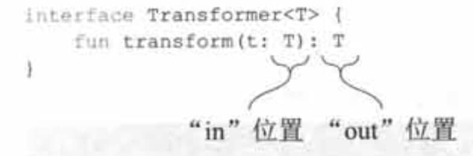

# 类型参数

类型参数虽然没有加?，但是默认上届是Any?，所以需要进行判空。

如果想让类型参数非空，可以指定上届是Any。

Kotlin不允许使用没有指定类型实参的泛型类型。那么如何检查一个值是否是列表，可以使用特殊的星号投影语法来做这种检查：

```kotlin
if (value is List<*>) { ... }
```

这种类似Java的`List<?>`。

## 类型参数约束

### 多个约束

Java的语法

```java
/**
 * 用&隔开，类需要写在前面，接口写在后
 */
private static <T extends Parent & Runnable> void test7(T t) {
    t.parentFun();//Parent的方法
    t.run();//Runnable的方法
}
```

Kotlin的语法

````kotlin
fun <T> test1(t: T): T where T : Parent, T : Runnable {
    t.parentFun() //Parent的方法
    t.run() //Runnable的方法
    return t
}
````

使用where

## 实化类型参数

Kotlin泛型在运行时会被擦除，这意味着无法得知泛型类实例在创建时用的是哪些类型实参。


泛型函数的类型实参也是这样，在调用泛型函数的时候不能决定调用它用的类型实参：

```kotlin
fun <T> isA(value: Any) = value is T
Error: Cannot check for instance of erased type: T
```

通过内联函数可以实化类型形参，意味着可以在运行时引用实际的类型实参。

使用例子：

isA函数声明成inline并且用reified标记类型参数。

```kotlin
inline fun <reified T> isA(value: Any) = value is T
```

>   **为什么实化只对内联函数有效？**
>
>   编译器把实现内联函数的字节码插入每一次调用发生的地方。每次调用带实化类型参数的函数时，编译器都知道这次特定调用中用作类型实参的确切类型。因此，编译器可以生成引用作为类型实参的具体类的字节码。
>
>   因为生成的字节码引用了具体类，而不是类型参数，它不会被运行时发生的类型参数擦除影响。
>
>   注意，带reified类型参数的inline函数不能在Java代码中调用。普通的内联函数可以像常规函数那样在Java中调用一一它们可以被调用而不能被内联。带实化类型参数的函数需要额外的处理，来把类型实参的值替换到字节码中，所以它们必须永远是内联的。这样它们不可能用Java那样普通的方式调用。

### 实化类型参数的限制

具体来说，可以按下面的方式使用实化类型参数：

-   用在类型检查和类型转换中(is、!is、as、as?)
-   使用Kotlin反射API,我们将在第10章讨论(::class)
-   获取相应的java. lang.Class (::class.java )
-   作为调用其他函数的类型实参

不能做下面这些事情：

-   创建指定为类型参数的类的实例
-   调用类型参数类的伴生对象的方法
-   调用带实化类型参数函数的时候使用非实化类型形参作为类型实参
-   把类、属性或者非内联函数的类型参数标记成reified

最后一条限制会带来有趣的后果：因为实化类型参数只能用在内联函数上，使用实化类型参数意味着函数和所有传给它的lambda都会被内联。如果内联函数使用lambda的方式导致lambda不能被内联，或者你不想lambda因为性能的关系被内联，可以使用noinline修饰符把它们标记成非内联的。

# 类、类型和子类型

## 概念

在Kotlin中，类和类型的概念不一样。如String是类，它有两种类型：可空和非空。这意味着每 一个Kotlin类都可以用于构造至少两种类型。

泛型类的情况更复杂。一个合法的类型需要用一个作为类型实参的具体类型替换(泛型)类的类型形参。如：List不是一个类型(它是一个类)，`List<Int>`、`List<String?>`、`List<List<String>> `等是类型。每一个泛型类都可能生成潜在的无限数量的类型。

**子类型**

任何时候如果需要的是类型A的值，你都能够使用类型B的值(当作A的值)，类型B就称为类型A的子类型。举例来说， Int 是Number的子类型，但Int不是String的子类型。

术语超类型是子类型的反义词。如果A是B的子类型,那么B就是A的超类型。

一般情况下。子类型和子类本质上意味着一样的事物。例如，Int类是Number的子类，因此Int类型是Number类型的子类型。如果一个类实现了一个接口，它的类型就是该接口类型的子类型，如String是CharSequence的子类型。

**特例**：可空类型的例子，说明子类型和子类不是同一个事物。


一个非空类型是它的可空版本的子类型，但它们都对应着同一个类。

一个泛型类，例如，MutableList如果对于任意两种类型A和B，`MutableList<A>`既不是`MutableList<B>`的子类型也不是它的超类型，它就被称为在该类型参数上是不变型的。Java中所有的类都是不变型的。

对List来说，子类型化规则不一样。Kotin中的List接口表示的是只读集合。如果A是B的子类型，那么`List<A>`就是`List<B>`的子类型。这样的类或者接口被称为**协变**的。

一个非空类型是它的可空版本的子类型，但它们都对应着同一个类。

一个泛型类，例如，MutableList如果对于任意两种类型A和B，`MutableList<A>`既不是`MutableList<B>`的子类型也不是它的超类型，它就被称为在该类型参数上是不变型的。Java中所有的类都是不变型的。

对List来说，子类型化规则不一样。Kotin中的List接口表示的是只读集合。如果A是B的子类型，那么`List<A>`就是`List<B>`的子类型。这样的类或者接口被称为**协变**的。

## 变型

>   Kotlin的变型概念对应Java的通配符。

```kotlin
fun test3() {
    val stringList: List<String> = listOf("a", "b")
    testList(stringList)
    val stringMutableList: MutableList<String> = mutableListOf("a", "b")
//  testMutableList(stringMutableList)//编译错误
    testList(stringMutableList)
}


fun testList(list: List<Any>) {
    println(list)
}


fun testMutableList(list: MutableList<Any>) {
    list.add(123)
}
```

把一个字符串列表传给期望Any对象列表的函数是否安全。如果函数添加或者替换了列表中的元素就是不安全的，因为这样会产生类型不一致的可能性。否则它就是安全的。

在Kotlin中，如果是只读的集合，那么可以使用类型参数的子类进行传参。如果是可变的集合，那么只能传对应类型参数的集合。

## 协变

>   Java的协变是`List<? extends A>`可以引用`List<A>`对象。

一个协变类是一个泛型类：如果A是B的子类型，那么`Producer<A>`就是`Producer<B>`的子类型。例如，`Producer<Cat> `是`Producer<Animal>`的子类型，因为Cat是Animal的子类型。

在Kotin中，要声明类在某个类型参数上是可以协变的，在该类型参数的名称前加上out关键字即可：

```kotlin
interface Producer<out T> {
	fun produce() : T
}
```

将一个类的类型参数标记为协变的，在该类型实参没有精确匹配到函数中定义的类型形参时，可以让该类的值作为这些函数的实参传递，也可以作为这些函数的返回值。

一个类，它声明了一个类型参数T并包含了一个使用T的函数。如果函数是把T当成返回类型，我们说它在out位置。这种情况下，该函数生产类型为T的值。如果T用作函数参数的类型，它就在in位置。



类型参数T上的关键字out有两层含义：

-   子类型化会被保留(`Producer<Cat>`是`Producer<Animal>`的子类型)
-   T只能用在out位置

Kotlin的List是只读的，所以它只有一个返回类型为T的元素的方法get，而没有定义任何把类型为T的元素存储到列表中的方法。因此，它也是协变的。

注意，构造方法的参数既不在in位置，也不在out位置。即使类型参数声明成了out，仍然可以在构造方法参数的声明中使用它。

还需要留意的是，位置规则只覆盖了类外部可见的(public、protected和internal) API。私有方法的参数既不在in位置也不在out位置。变型规则只会防止外部使用者对类的误用但不会对类自己的实现起作用。

## 逆变

>   类似Java的`List<? super A>`

一个在类型参数上逆变的类是这样的一个泛型类（以`Consumer<T>`为例），对这种类来说，下面的描述是成立的：如果B是A的子类型，那么`Consumer<A>`就是`Consumer<B>`的子类型。

```kotlin
public interface Comparable<in T> {
    public operator fun compareTo(other: T): Int
}
```

T只在in位置使用，因此它的声明之前用了in关键字。

一个类可以在一个类型参数上协变，同时在另外一个类型参数上逆变。Function接口就是一个经典的例子。下面是一个单个参数的Function的声明：

```kotlin
interface Functionl<in P, out R> {
		operator fun invoke(p:P): R
}
```

## 点变型

Kotlin只需要指定一次，而Java需要一直使用通配符。

在类声明的时候就能够指定变型修饰符是很方便的，因为这些修饰符会应用到所有类被使用的地方。这被称作声明点变型。

而Java的通配符类型(? extends和? super)，每一次使用带类型参数的类型的时候，还可以指定这个类型参数是否可以用它的子类型或者超类型替换。这叫作使用点变型。

对于一些泛型类，虽然不能在类型参数声明处使用in/out，但是可以在某个方法处使用in/out。

```kotlin
fun test4() {
    val list: MutableList<out Int> = mutableListOf(1, 2, 3, 4)
//    list.add(1)//编译错误
    //可以编译，并能运行
    for (i in list) {
        println(i)
    }
}
```

## 星号投影

为什么编译器会把`MutableList<*>`当成out投影的类型？`MutableList<*>`投影成了`MutableList<out Any?>`：当没有任何元素类型信息的时候，读取Any?类型的元素仍然是安全的，但是向列表中写入元素是不安全的。

Kotlin的`MyType<*>`对应于Java的`MyType<?>`。

对于协变类型参数，星号投影等价于`<out Any?>`。


对于像`Consumer<in T>`这样的逆变类型参数来说，星号投影等价于`<in Nothing>`。 实际上，在这种星号投影中无法调用用任何签名中有T的方法。


星号投影的语法很简洁，但只能用在对泛型类型实参的确切值不感兴趣的地方：只是使用生产值的方法，而且不关心那些值的类型。
