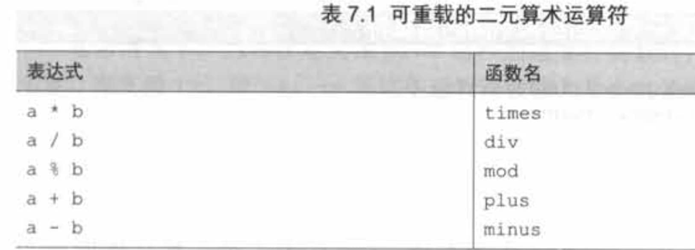

# 安全调用运算符“?.”

Kotlin的库中最有效的一种工具就是安全调用运算符：?. ，它允许你把一次null检查和一次方法调用合并成一个操作。

例如

```
s?.toUpperCase()
```

等同于下面这种烦琐的写法

```kotlin
if (s!=null)
    s.toUpperCase()
else
    null
```

换句话说，如果你试图调用一个非空值的方法， 这次方法调用会被正常地执行。但如果值是null，这次调用不会发生，而整个表达式的值为null。

注意，这次调用的结果果类型也是可空的。尽管String.toUpperCase()会返回string类型的值，但s是可空的时候，表达式s?.toUpperCase()的结果类型是String?

安全调用不光可以调用方法，也能用来访问属性。

# Elvis运算符"?:"

类似?:三元运算符，Elvis运算符接收两个运算数，如果第一个运算数不为null，运算结果就是第一个运算数；如果第一个运算数为null，运算结果就是第二个运算数。

```kotlin
fun foo(s: String?) {
    val t: String = s ?: ""//如果“s”为null,结果是一个空的字符串
}
```

# 安全转换”as?”

as?运算符尝试把值转换成指定的类型，如果值不是合适的类型就返回null。

一种常见的模式是把安全转换和Elvis运算符结合使用。例如，实现equals方法的时候这样的用法非常方便。

```kotlin
class Person(val firstName: String, val lastName: String) {
    override fun equals(other: Any?): Boolean {
        val otherPerson = other as? Person ?: return false
        return otherPerson.firstName == firstName
                && otherPerson.lastName == lastName;
    }
}
```

# 非空断言“!!”

非空断言使用双感叹号表示，可以把任何值转换成非空类型。如果对null值做非空断言，则会抛出异常。

```kotlin
fun main() {
    ignoreNulls(null)
}

fun ignoreNulls(s: String?) {
    val sNotNull: String = s!!
    println(sNotNull.length)
}

Exception in thread "main" kotlin.KotlinNullPointerException.....
```

注意异常抛出的位置是非空断言所在的那一行，而不是接下来试图使用那个值的一行。

某些问题适合用非空断言来解决。当你在一个函数中检查一个值是否为null，而在另一个函数中使用这个值时，这种情况下编译器无法识别这种用法是否安全。如果你确信这样的检查定在其他某个函数中存在，你可能不想在使用这个值之前重复检查，这时你就可以使用非空断言。

# “let”函数

let函数让处理可空表达式变得更容易。和安全调用运算符一起， 它允许你对表达式求值，检查求值结果是否为null，并把结果保存为一个变量。所有这些动作都在同一个简洁的表达式中。

```kotlin
fun sendEmailTo(email:String){
    //...
}

fun main() {
    val email: String? = ""
    if (email != null)
        sendEmailTo(email)
}
```

还有另外一种处理方式：使用let函数，并通过安全调用来调用它。let函数做的所有事情就是把一个调用它的对象变成lambda表达式的参数。如果结合安全调用语法，它能有效地把调用let函数的可空对象，转变成非空类型。

let函数只在email的值非空时才被调用，所以你就能在lambda中把email当作非空的实参使用。

```
email?.let { email -> sendEmailTo(email) }
```

使用自动生成的名字it这种简明语法之后，上面的代码就更短了：

```
email?.let { sendEmailTo(it) }
```

# 重载算术运算符

Kotlin运算符重载的技术叫约定，如：命名了一个plus的特殊方法，就可以在其实例上使用+。

使用`operator`关键字来声明重载方法。

## 二元算术运算符

例子：

```kotlin
data class Point(val x: Int, val y: Int) {
    operator fun plus(other: Point): Point 
            = Point(x + other.x, y + other.y)
}

fun main() {
    val p1 = Point(10, 20)
    val p2 = Point(30, 40)
    println(p1 + p2)
}

Point(x=40, y=60)
```

**可重载的二元算术运算符**



**Koltin和Java的互调**

从Java调用Kotlin：因为每个重载的运算符都被定义为一个函数，可以像普通函数那样调用它们。

从Kotlin调用Java：由于Java没有定义任何用于标记运算符函数的语法，所以使用operator修饰符的要求对它不适用，唯一的约束是，参数需要匹配名称和数量。如果Java类定义了一个满足需求的函数，但是起了一个不同的名称，可以通过定义一个扩展函数来修正这个函数名，用来代替现有的Java方法。

**没有用于位运算的特殊运算符**

Kotlin没有为标准数字类型定义任何位运算符，因此，也不允许你为自定义类型定义它们。相反，它使用支持中缀调用语法的常规函数，可以为自定义类型定义相似的函数。

以下是Kotlin提供的，用于执行位运算的完整函数列表

| 函数名 | 作用       |
| ------ | ---------- |
| shl    | 带符号左移 |
| shr    | 带符号右移 |
| ushr   | 无符号右移 |
| and    | 按位与     |
| or     | 按位或     |
| xor    | 按位异或   |
| inv    | 按位取反   |

## 重载复合赋值运算符

像+=、-=等这些运算符被称为复合赋值运算符。

```kotlin
point = point + Point (3, 4)//1
point += Point (3, 4)//2
```

1和2效果相同，但是1是返回新的对象，2是在原对象上修改（只对于可变变量有效）。

如果定义了一个返回值为Unit，名为plusAssign的函数，Kotlin将会在用到+=运算符的地方调用它。其他二元算术运算符也有命名相似的对应函数：如minusAssign、timesAssign等。

当代码中用到+=的时候，理论上plus和plusAssign都可能被调用。如果在这种情况下，两个函数都有定义且适用，编译器会报错，解决办法：

1.  替换运算符的使用为普通函数调用。
2.  另一个办法是，用val替换var，这样plusAssign运算就不再适用。

但一般来说，最好在设计新类时保持(可变性)一致：尽量不要同时给一个类添加plus和plusAssign运算。

Kotlin标准库支持集合的这两种方法。**+和-运算符总是返回一个新的集合。+=和-=运算符用于可变集合时，始终就地修改它们；而它们用于只读集合时，会返回一个修改过的副本(这意味着只有当引用只读集合的变量被声明为var的时候，才能使用+=和-=)**。

```kotlin
val list1= listOf(1,2,3)
list1+=4;//编译出错，需改为var
fun main() {
    val list = arrayListOf(1, 2)
    list += 3
    val newList = list + listOf(3, 4)
    println(list)
    println(newList)
}

[1, 2, 3]
[1, 2, 3, 3, 4]
```

## 重载一元运算符

和二元算术运算符类似。

| 表达式  | 函数名     |
| ------- | ---------- |
| +a      | unaryPlus  |
| -a      | unaryMinus |
| !a      | not        |
| ++a,a++ | inc        |
| --a,a-- | dec        |

# 重载比较运算符

与算术运算符样，在Kotlin中，可以对任何对象使用比较运算符(==、!=、>、<等)，而不仅仅限于基本数据类型。不用像Java那样调用equals或compareTo函数，可以直接使用比较运算符。在这一节中，我们将介绍用于支持这些运算符的约定。

## 等号运算符"equals”

如果在Kotlin中使用==运算符，它将被转换成equals方法的调用。

注意，和所有其他运算符不同的是，==和!=可以用于可空运算数，因为这些运算符事实上会检查运算数是否为null。比较a == b会检查a是否为非空，如果不是，就调用a.equals(b)；否则，只有两个参数都是空引用，结果才是true。

数据类的equals的实现将会由编译器自动生成。手动实现equals：

```kotlin
override fun equals(other: Any?): Boolean {
    if (other === this)
        return true
    if (other !is Point)
        return false
    return other.x == x && other.y == y;
}
```

使用恒等运算符(===)来检查引用是否相同。===不能被重载。

equals函数没有operator修饰符，这是因为这个方法的实现是在Any类中定义的。函数的operator修饰符适用于所有实现或重写它的方法。

注意，equals不能实现为扩展函数，因为继承自Any类的实现始终优先于扩展函数。

## 排序运算符compareTo

Kotlin支持相同的Comparable接口（Kotlin的Comparable是kotlin包下的）。但是接口中定义的compareTo方法可以按约定调用，比较运算符(<, >, <=和>=)的使用将被转换为compareTo。compareTo的返回类型必须为Int。pl < p2 表达式等价于pl.compareTo(p2)< 0。其他比较运算符的运算方式也是完全样的。

在这种情况下，可以实现Comparable接口，这样Person对象不仅可以在Kotlin代码中用来比较，还可以被Java函数(比如用于对集合进行排序的功能)进行比较。与equals一样，operator修饰符已经被用在了基类的接口中，因此在重写该接口时无须再重复。

# 集合和区间

## in

in运算符用于检查某个对象是否属于集合，相应的函数叫作contains。

```kotlin
data class Point(val x: Int, val y: Int)

data class Rectangle(val upperLeft: Point, val lowerRight: Point)

operator fun Rectangle.contains(p: Point): Boolean {
    return p.x in upperLeft.x until lowerRight.x &&
            p.y in upperLeft.y until lowerRight.y
}

fun main(args: Array<String>) {
    val rect = Rectangle(Point(10, 20), Point(50, 50))
    println(Point(20, 30) in rect)
    println(Point(5, 5) in rect)
}

true
false
```

## rangeTo..

`..` 运算符对应rangeTo函数。

```kotlin
fun main(args: Array<String>) {
    val p1 = Person(10)
    val people5 = People(5)
    val people9 = People(9)
    val people10 = People(10)
    val people11 = People(11)
    val people30 = People(30)

    println(p1 in people10)
    println(p1 in people30)

    println(people9 in people5..people10)
    println(people11 in people10..people30)
    println(people30 in people5..people11)
}

/**
 * 表示某个年龄的人
 */
data class Person(val age: Int)

/**
 * 表示某个年龄的人群
 */
data class People(val age: Int) : Comparable<People> {
    override fun compareTo(other: People): Int {
        return age.compareTo(other.age)
    }

    operator fun contains(p: Person): Boolean {
        return p.age == age
    }

    operator fun rangeTo(p: People): ClosedRange<People> {
        return object : ClosedRange<People> {
            override val start: People
                get() = this@People
            override val endInclusive: People
                get() = p
        }
    }
}

true
false
true
true
false
```

例子如上，总的来说是语法糖，没什么用。

## for循环

```kotlin
for(x in list) {...} 
```

将被转换成list.iterator()的调用，然后就像在Java中一样，在它上面重复调用hasNext和next方法。

# 解构声明

解构声明主要使用场景之一，是从一个函数返回多个值。

```
val p = Point(10, 20)
va1 (x, y) = p
>>> print1n (x)
10
>>> println (y)
20
```

```kotlin
class Point (val X: Int , val y: Int) {
	operator fun component1 () = X
	operator fun component2 () = y
}
```

不能定义无限数量的componentN函数，标准库只允许使用此语法来访问一个对象的前五个元素。

还有一个使用场景时map的遍历。

```kotlin
fun printEntries(map: Map<String, String>) {
    for ((key, value) in map) {
        println("$key -> $value")
    }
}
```

# 委托属性

## 基本语法

委托属性用于处理起来比把值存储在支持字段中更复杂，却不用在每个访问器中都重复这样的逻辑。例如，这些属性可以把它们的值存储在数据库表中，在浏览器会话中，在一个map中等。

委托属性的背后是委托模式，操作的对象不用自己执行，而是把工作委托给另一个辅助的对象。

委托属性的基本语法是这样的：

```kotlin
class Foo {
	var p: Type by Delegate ()
}
```

Delegate类必须具有getValue和setValue方法(后者仅适用于可变属性)。

```kotlin
class Delegate {
    operator fun getValue(...) {...}
	operator fun setValue(..., value: Type) {...}
}
```

相当于这样写：

```kotlin
class Foo {
    private val delegate = Delegate ()
    var p: Type
		set(value: Type) = delegate.setValuel(..., value)
		get() = delegate.getValue(...)
}
```

## 惰性加载

一般的惰性加载代码：

```kotlin
class Person(val name: String) {
    private var _emails: List<Email>? = null

    val emails: List<Email>
       get() {
           if (_emails == null) {
               _emails = loadEmails(this)
           }
           return _emails!!
       }
}
```

如果有多个惰性属性，代码会很长。而且，它不是线程安全的。

Kotlin可以使用标准库函数lazy返回的委托。

>   //TODO 这里为什么Kotlin是线程安全的

```kotlin
class Person(val name: String) {
    val emails by lazy { loadEmails(this) }
}
```

Iazy函数返回一个对象，该对象具有一个名为getValue且签名正确的方法，因此可以把它与by关键字一起使用来创建一个委托属性。lazy的参数是一个lambda，可以调用它来初始化这个值。默认情况下，lazy函数是线程安全的，如果需要，可以设置其他选项来告诉它要使用哪个锁，或者完全避开同步，如果该类永远不会在多线程环境中使用。

## 原理

