# 内存

## 简洁总结

- **直接使用物理内存的缺点**：程序之间缺乏地址隔离，容易相互干扰；简单的连续分配和整程序换入换出导致内存利用效率低；加载位置不固定，需要处理地址重定位。
- **虚拟内存**：为每个进程提供独立的虚拟地址空间，通过地址映射实现进程隔离，让程序无需关心实际的物理内存位置。
- **分段与分页**：分段按不同大小的段管理内存；分页按固定大小的页管理内存，支持按需加载和换出，减少数据搬运，提高内存利用效率。
- **地址转换**：程序使用虚拟地址，操作系统管理映射关系，硬件中的 MMU 将虚拟地址转换为物理地址。

## 直接面向物理内存的缺点

在早期的计算机中，程序是直接运行在物理内存上的，程序在运行时所访问的地址都是物理地址。那么很明显的一个问题是，如何将计算机上有限的物理内存分配给多个程序使用。

假设我们的计算机有128MB内存，程序A运行需要10MB，程序B需要100MB，程序C需要20MB。如果我们需要同时运行程序A和B，那么比较直接的做法是将内存的前10MB分配给程序A，10MB~110MB分配给B。这样就能够实现A和B两个程序同时运行，但是这种简单的内存分配策略问题很多。

-   地址空间不隔离
    所有程序都直接访问物理地址，程序所使用的内存空间不是相互隔离的。其它程序很容易影响当前程序。
-   内存使用效率低
    由于没有有效的内存管理机制，通常需要一个程序执行时，监控程序就将整个程序装入内存中然后开始执行。如果我们忽然需要运行程序C，那么这时内存空间其实已经不够了，这时候我们可以用的一个办法是将其他程序的数据暂时写到磁盘里面，等到需要用到的时候再读回来。由于程序所需要的空间是连续的，那么这个例子里面，如果我们将程序A换出到磁盘所释放的内存空间是不够的，所以只能将B换出到磁盘，然后将C读入到内存开始运行。可以看到整个过程中有大量的数据在换入换出，导致效率十分低下。
-   程序运行的地址
    不确定因为程序每次需要装入运行时，我们都需要给它从内存中分配一块足够大的空闲区域，这个空闲区域的位置是不确定的。这给程序的编写造成了一定的麻烦，因为程序在编写时，它访问数据和指令跳转时的目标地址很多都是固定的，这涉及程序的重定位问题。

解决这几个问题的思路就是使用一种间接的地址访问方法。整个想法是这样的：
我们把程序给出的地址看作是一种虚拟地址(Virtual Address)，然后通过某些映射的方法，将这个虚拟地址转换成实际的物理地址。这样，只要我们能够妥善地控制这个虚拟地址到物理地址的映射过程，就可以保证任意一个程序所能够访问的物理内存区域跟另外一个程序相互不重叠，以达到地址空间隔离的效果。

## 虚拟地址和物理地址

地址空间分两种：虚拟地址空间(Virtual Address Space)和物理地址空间(Physical Address Space)。

物理地址空间是实实在在存在的，存在于计算机中，而且对于每一台计算机来说只有唯一的一个，你可以把物理空间想象成物理内存，比如你的计算机用的是32位的机器，即计算机地址线有32条(实际上是36条地址线，不过我们暂时认为它只是32条)，那么物理空间就有4GB。但是你的计算机上只装了512MB的内存，那么其实物理地址的真正有效部分只有0x00000000~0x1FFFFFFF，其他部分都是无效的(实际上还有一些外部I/O设备映射到物理空间的，也是有效的，但是我们暂时无视其存在)。

虚拟地址空间是指虚拟的、人们想象出来的地址空间，其实它并不存在，每个进程都有自己独立的虚拟空间，而且每个进程只能访问自己的地址空间，这样就有效地做到了进程的隔离。

## 分段(Segmentation)

最开始人们使用的是一种叫做分段(Segmentation)的方法，基本思路是把一段与程序所需要的内存空间大小的虚拟空间映射到某个地址空间。比如程序A需要10MB内存，

分段的方法基本解决了地址空间不隔离和程序运行的地址的问题。

首先它做到了地址隔离，因为程序A和程序B被映射到了两块不同的物理空间区域，它们之间没有任何重叠，如果程序A访问虚拟空间的地址超出了0x00A00000这个范围，那么硬件就会判断这是一个非法的访问，拒绝这个地址请求，并将这个请求报告给操作系统或监控程序，由它来决定如何处理。

第二，对于每个程序来说，无论它们被分配到物理地址的哪一个区域，对于程序来说都是透明的，它们不需要关心物理地址的变化，所以程序不再需要重定位。

但是分段的这种方法还是没有解决内存使用效率低的问题。

分段对内存区域的映射还是按照程序为单位，如果内存不足，被换入换出到磁盘的都是整个程序，这样势必会造成大量的磁盘访问操作，从而严重影响速度。

## 分页（Paging）

分页的基本方法是把地址空间人为地等分成固定大小的页，每一页的大小由硬件决定，或硬件支持多种大小的页，由操作系统选择决定页的大小。

那么，当我们把进程的虚拟地址空间按页分割，把常用的数据和代码页装载到内存中，把不常用的代码和数据保存在磁盘里，当需要用到的时候再把它从磁盘里取出来即可。

把虚拟空间的页就叫虚拟页（VP，Virtual Page），把物理内存中的页叫做物理页（PP，Physical Page），把磁盘中的页叫做磁盘页（DP，Disk Page）。

虚拟存储的实现需要依靠硬件的支持，对于不同的CPU来说是不同的。但是几乎所有的硬件都采用一个叫MMU（Memory Management Unit）的部件来进行页映射，在页映射模式下，CPU发出的是Virtual Address，即我们的程序看到的是虚拟地址。经过MMU转换以后就变成了Physical Address。一般MMU都集成在CPU内部了，不会以独立的部件存在。

# 虚拟内存

## 🌟总结

### 虚拟内存背后的原理

虚拟内存的核心是**地址映射 + 按需分配**：

- 每个进程使用独立的虚拟地址空间，操作系统维护页表，硬件 MMU 将虚拟地址转换为物理地址。
- 页面不在内存时，触发缺页异常，由操作系统分配内存或从磁盘载入。

这样既能隔离进程，也无需把程序的全部内容同时放进物理内存。

### 内存映射

内存映射将进程的一段虚拟地址空间与文件等对象关联起来。以文件映射为例，调用 `mmap` 后，程序可以像访问内存一样通过指针读写文件内容，页面通常按需载入，无需提前把整个文件读入内存。

### 与普通文件写入的区别

- **普通写入**：调用 `write`，将数据从用户缓冲区复制到内核页缓存，再由内核回写文件。
- **映射写入**：程序通过映射地址直接修改对应的页缓存页面，再由内核回写文件；每次修改不必调用 `write`，也不必额外从用户缓冲区复制数据。若程序仍先在其他缓冲区生成数据，再复制到映射区，这次拷贝仍然存在。

### 为什么不能全部改为内存映射

**内存映射可能更快，但优势取决于访问方式和工作负载。** 从上述机制看，它更可能在反复随机访问、直接就地修改文件内容时受益；不能据此认定所有文件操作都会更快。

- **自身也有开销**：建立和解除映射、维护页表、处理缺页都需要成本；小文件、短期访问或大块顺序写入时，普通 I/O 可通过批量操作摊薄开销，映射未必占优。
- **文件增长更麻烦**：向映射区写入不会自动扩展文件，追加日志等场景需要先扩展文件，并在超出映射范围时调整映射；普通写入处理这类需求更直接。
- **异常与一致性仍需处理**：映射文件被截短后，访问超出文件末尾的页面可能触发 `SIGBUS`；并发修改仍需协调，持久化仍需同步，磁盘 I/O 成本也不会消失。参见 [mmap 手册](https://man7.org/linux/man-pages/man2/mmap.2.html)。

## 物理和虚拟寻址

计算机系统的主存被组织成一个由M个连续的字节大小的单元组成的数组。每字节都有一个唯一的物理地址（Physical Address，PA）。CPU访问内存的最自然的方式就是使用物理地址。我们把这种方式称为物理寻址（physical addressing）。

使用虚拟寻址，CPU通过生成一个虚拟地址（Virtual Address，VA）来访问主存，这个虚拟地址在被送到内存之前先转换成适当的物理地址。
将一个虚拟地址转换为物理地址的任务叫做地址翻译（address translation）。地址翻译需要CPU硬件和操作系统之间的紧密合作。CPU芯片上叫做内存管理单元（Memory Management Unit，MMU）的专用硬件，利用存放在主存中的查询表来动态翻译虚拟地址，该表的内容由操作系统管理。

## 虚拟内存作为缓存的工具

概念上而言，虚拟内存被组织为一个由存放在磁盘上的N个连续的字节大小的单元组成的数组。每字节都有一个唯一的虚拟地址，作为到数组的索引。磁盘上数组的内容被缓存在主存中。

VM系统通过将虚拟内存分割为称为虚拟页（Virtual Page，VP）的大小固定的块来处理这个问题。每个虚拟页的大小为`P=2^p`字节。类似地，物理内存被分割为物理页（Physical Page，PP），大小也为P字节（物理页也被称为页帧（page frame））。

在任意时刻，虚拟页面的集合都分为三个不相交的子集：

-   未分配的：VM系统还未分配（或者创建）的页。未分配的块没有任何数据和它们相关联，因此也就不占用任何磁盘空间。
-   缓存的：当前已缓存在物理内存中的已分配页。
-   未缓存的：未缓存在物理内存中的已分配页。

图示例展示了一个有8个虚拟页的小虚拟内存。虚拟页0和3还没有被分配，因此在磁盘上还不存在。虚拟页1、4和6被缓存在物理内存中。页2、5和7已经被分配了，但是当前并未缓存在主存中。

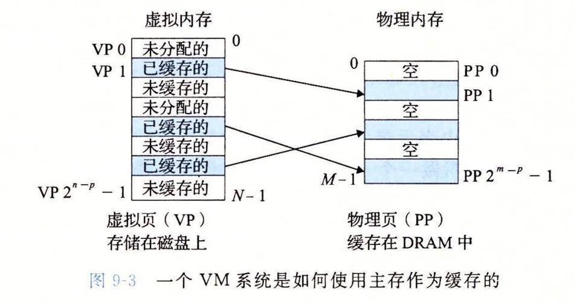


### 页命中

当CPU想要读包含在VP2中的虚拟内存的一个字时会发生什么？VP2被缓存在DRAM中。

地址翻译硬件将虚拟地址作为一个索引来定位PTE 2，并从内存中读取它。因为设置了有效位，那么地址翻译硬件就知道VP2是缓存在内存中的了。所以它使用PTE中的物理内存地址（该地址指向PP1中缓存页的起始位置），构造出这个字的物理地址。

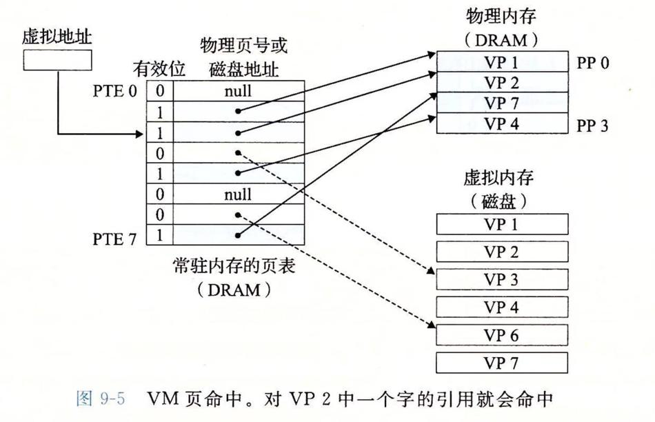

### 缺页

在虚拟内存的习惯说法中，DRAM缓存不命中称为缺页（page fault）。

CPU引用了VP3中的一个字，VP3并未缓存在DRAM中。地址翻译硬件从内存中读取PTE3，从有效位推断出VP3未被缓存，并且触发一个缺页异常。缺页异常调用内核中的缺页异常处理程序，该程序会选择一个牺性页，在此例中就是存放在PP3中的VP4。如果VP4已经被修改了，那么内核就会将它复制回磁盘。无论哪种情况，内核都会修改VP4的页表条目，反映出VP4不再缓存在主存中这一事实。

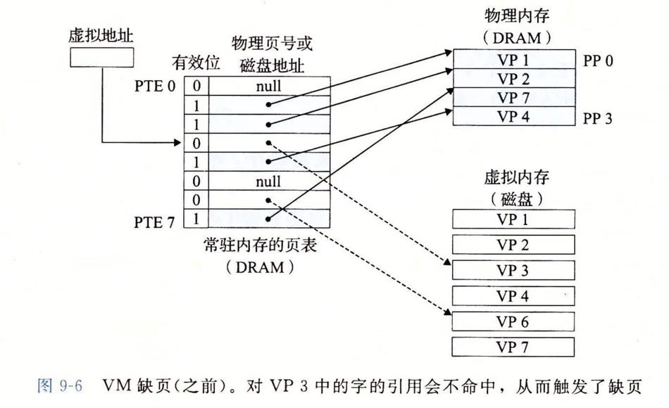

接下来，内核从磁盘复制VP3到内存中的PP3，更新PTE3，随后返回。当异常处理程序返回时，它会重新启动导致缺页的指令，该指令会把导致缺页的虚拟地址重发送到地址翻译硬件。但是现在，VP3已经缓存在主存中了，那么页命中也能由地址翻译硬件正常处理了。

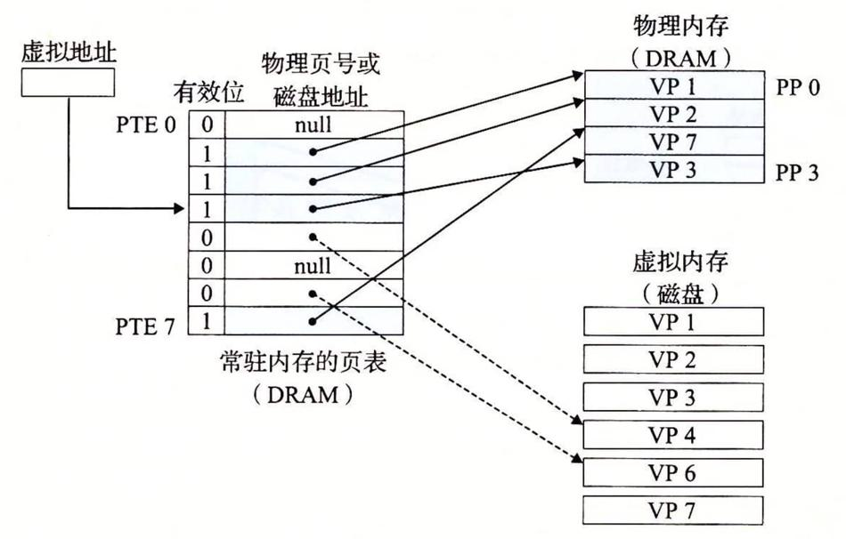

>   虚拟内存是在20世纪60年代早期发明的，远在CPU-内存之间差距的加大引发产生SRAM缓存之前。因此，虚拟内存系统使用了和SRAM缓存不同的术语，即使它们的许多概念是相似的。
>
>   在虚拟内存的习惯说法中，块被称为页。在磁盘和内存之间传送页的活动叫做交换（swapping）或者页面调度（paging）。

## 虚拟内存作为内存保护的工具

任何现代计算机系统必须为操作系统提供手段来控制对内存系统的访问。不应该允许一个用户进程修改它的只读代码段。而且也不应该允许它读或修改任何内核中的代码和数据结构。不应该允许它读或者写其他进程的私有内存，并且不允许它修改任何与其他进程共享的虚拟页面，除非所有的共享者都显式地允许它这么做（通过调用明确的进程间通信系统调用）。

就像我们所看到的，提供独立的地址空间使得区分不同进程的私有内存变得容易。但是，地址翻译机制可以以一种自然的方式扩展到提供更好的访问控制。因为每次CPU生成一个地址时，地址翻译硬件都会读一个PTE，所以通过在PTE上添加一些额外的许可位来控制对一个虚拟页面内容的访问十分简单。

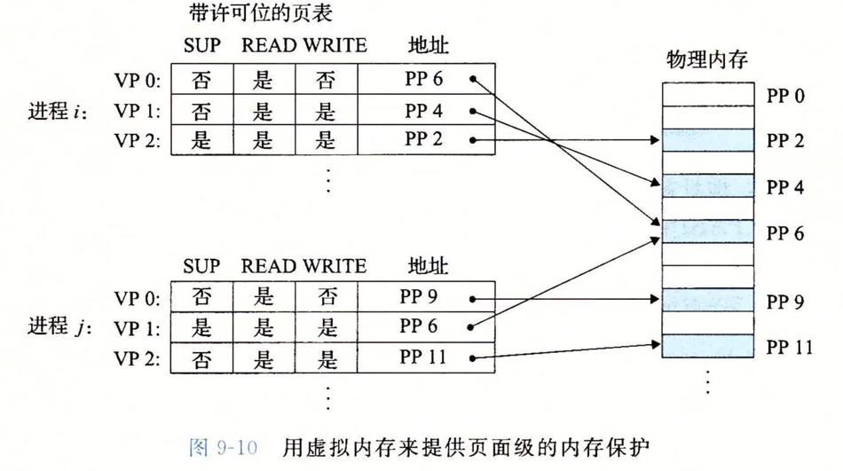

## 案例研究：Linux内存系统

### Linux虚拟内存系统

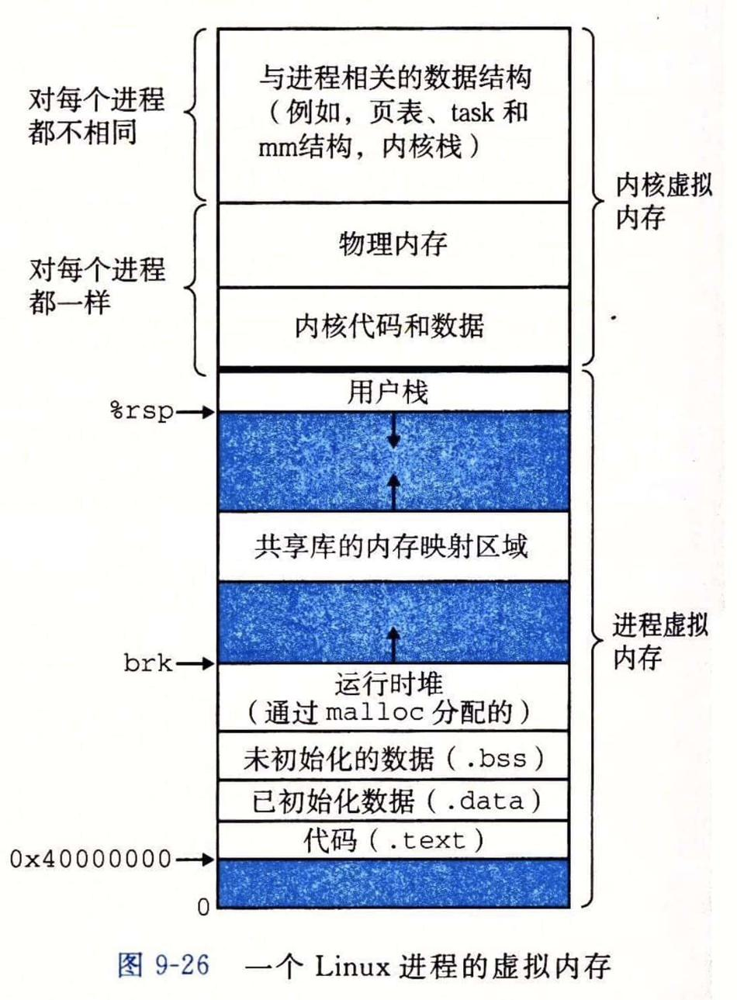

内核虚拟内存包含内核中的代码和数据结构。内核虚拟内存的某些区域被映射到所有进程共享的物理页面。例如，每个进程共享内核的代码和全局数据结构。

内核虚拟内存的其他区域包含每个进程都不相同的数据。比如说，页表、内核在进程的上下文中执行代码时使用的栈，以及记录虚拟地址空间当前组织的各种数据结构。

#### Linux虚拟内存区域

Linux将虚拟内存组织成一些区域（也叫做段）的集合。一个区域（area）就是已经存在着的（已分配的）虚拟内存的连续片（chunk），这些页是以某种方式相关联的。例如，代码段、数据段、堆、共享库段，以及用户栈都是不同的区域。每个存在的虚拟页面都保存在某个区域中，而不属于某个区域的虚拟页是不存在的，并且不能被进程引用。
区域的概念很重要，因为它允许虚拟地址空间有间隙。内核不用记录那些不存在的虚拟页，而这样的页也不占用内存、磁盘或者内核本身中的任何额外资源。

#### Linux缺页异常处理

假设MMU在试試图翻译某个虚拟地址A时，触发了一个缺页。这个异常导致控制转移到内核的缺页处理程序，处理程序随后就执行下面的步骤：

1.   虚拟地址A是合法的吗？换句话说，A在某个区域结构定义的区域内吗？为了回答这个问题，缺页处理程序搜索区域结构的链表，把A和每个区域结构中的vm_start和vm_end做比较。如果这个指令是不合法的，那么缺页处理程序就触发一个段错误，从而终止这个进程。
     因为一个进程可以创建任意数量的新虚拟内存区域（mmap函数），所以顺序搜索区域结构的链表花销可能会很大。因此在实际中，Linux在链表中构建了一棵树，并在这棵树上进行查找。
2.   试图进行的内存访问是否合法？换句话说，进程是否有读、写或者执行这个区域内页面的权限？
3.   此刻，内核知道了这个缺页是由于对合法的虚拟地址进行合法的操作造成的。
     它是这样来处理这个缺页的：选择一个牺牲页面，如果这个牺牲页面被修改过，那么就将它交换出去，换入新的页面并更新页表。当缺页处理程序返回时，CPU重新启动引起缺页的指令，这条指令将再次发送A到MMU。这次，MMU就能正常地翻译A，而不会再产生缺页中断了。

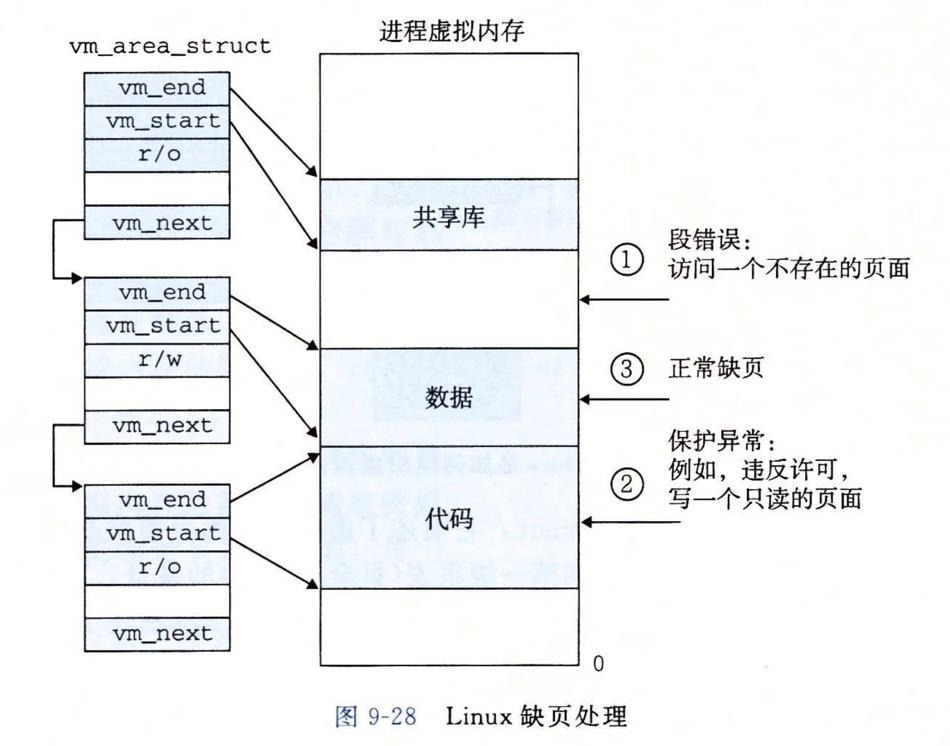

## 内存映射

Linux通过将一个虚拟内存区域与一个磁盘上的对象（object）关联起来，以初始化这个虚拟内存区域的内容，这个过程称为内存映射（memorymapping）。虚拟内存区域可以映射到两种类型的对象中的一种：

1.   Linux文件系统中的普通文件：一个区域可以映射到一个普通磁盘文件的连续部分，例如一个可执行目标文件。
     文件区（section）被分成页大小的片，每一片包含一个虚拟页面的初始内容。因为按需进行页面调度，所以这些虚拟页面没有实际交换进人物理内存，直到CPU第一次引用到页面（即发射一个虚拟地址，落在地址空间这个页面的范围之内）。如果区域比文件区要大，那么就用零来填充这个区域的余下部分。
2.   匿名文件：一个区域也可以映射到一个匿名文件，匿名文件是由内核创建的，包含的全是二进制零。

无论在哪种情况中，一旦一个虚拟页面被初始化了，它就在一个由内核维护的专门的交換文件（swap file）之间换来换去。交换文件也叫做交换空间（swap space）或者交换区域（swap area）。需要意识到的很重要的一点是，在任何时刻，交换空间都限制着当前运行着的进程能够分配的虚拟页面的总数。

### 再看共享对象

进程这一抽象能够为每个进程提供自己私有的虚拟地址空间，可以免受其他进程的错误读写。不过，许多进程有同样的只读代码区域。内存映射给我们提供了一种清晰的机制，用来控制多个进程如何共享对象。

一个对象可以被映射到虚拟内存的一个区域，要么作为共享对象，要么作为私有对象。
如果一个进程将一个共享对象映射到它的虚拟似地址空间的一个区域内，那么这个进程对这个区域的任何写操作，对于那些也把这个共享对象映射到它们虚拟内存的其他进程而言，也是可见的。而且，这些变化也会反映在磁盘上的原始对象中。
另一方面，对于一个映射到私有对象的区域做的改变，对于其他进程来说是不可见的，并且进程对这个区域所做的任何写操作都不会反映在磁盘上的对象中。

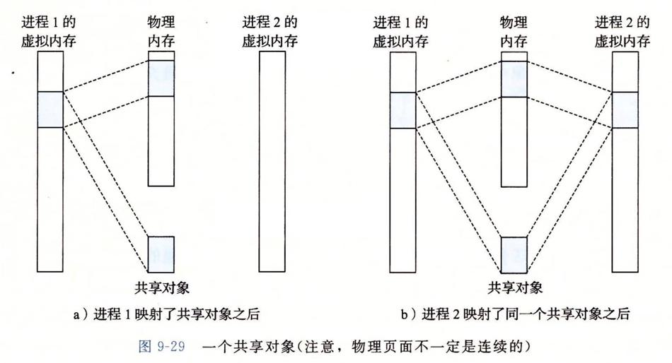

私有对象使用一种叫做写时复制（copy-on-write）的巧妙技术被映射到虚拟内存中。一个私有对象开始生命周期的方式基本上与共享对象的一样，在物理内存中只保存有私有对象的一份副本。比如，图a展示了一种情况，其中两个进程将一个私有对象映射到它们虚拟内存的不同区域，但是共享这个对象同一个物理副本。对于每个映射私有对象的进程，相应私有区域的页表条目都被标记为只读，并且区域结构被标记为私有的写时复制。只要没有进程试图写它自己的私有区域，它们就可以继续共享物理内存中对象的一个单独副本。然而，只要有一个进程试图写私有区域内的某个页面，那么这个写操作就会触发一个保护故障。

当故障处理程序注意到保护异常是由于进程试图写私有的写时复制区域中的一个页面而引起的，它就会在物理内存中创建这个页面的一个新副本，更新页表条目指向这个新的副本，然后恢复这个页面的可写权限，如图b所示。当故障处理程序返回时，CPU重新执行这个写操作，现在在新创建的页面上这个写操作就可以正常执行了。

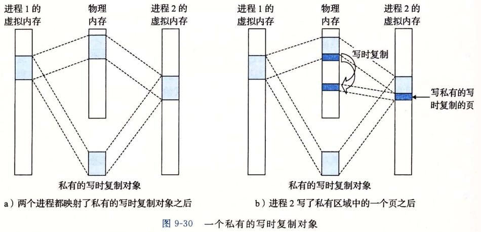

### 再看fork函数

当fork函数被当前进程调用时，内核为新进程创建各种数据结构，并分配给它一个唯一的PID。为了给这个新进程创建虚拟内存，它创建了当前进程的mm_struct、区域结构和页表的原样副本。它将两个进程中的每个页面都标记为只读，并将两个进程中的每个区域结构都标记为私有的写时复制。

当fork在新进程中返回时，新进程现在的虚拟内存刚好和调用fork时存在的虚拟内存相同。当这两个进程中的任一个后来进行写操作时，写时复制机制就会创建新页面，

因此，也就为每个进程保持了私有地址空间的抽象概念。

### 使用mmap函数的用户级内存映射

Linux进程可以使用mmap函数来创建新的虚拟内存区域，并将对象映射到这些区域中。

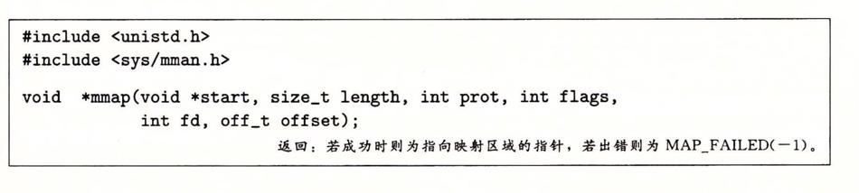

# 线程基础

线程（Thread），是程序执行流的最小单元。一个标准的线程由线程ID、当前指令指针（PC）、寄存器集合和堆栈组成。

通常意义上，一个进程由一个到多个线程组成，各个线程之间共享程序的内存空间（包括代码段、数据段、堆等）及一些进程级的资源（如打开文件和信号）。

## 线程的访问权限

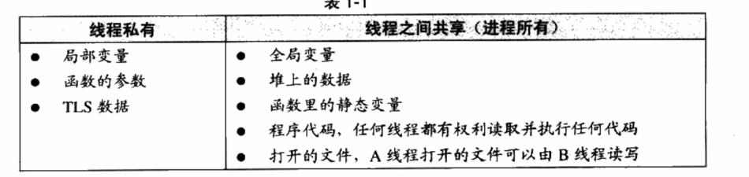

## 线程调度与优先级

并发是一种模拟出来的状态，操作系统会让这些多线程程序轮流执行，每次仅执行一小段时间（通常是几十到几百毫秒），这样每个线程就“看起来”在同时执行。这样的一个不断在处理器上切换不同的线程的行为称之为线程调度（Thread Schedule）。

在线程调度中，线程通常拥有至少三种状态，分别是：

-   运行（Running）：此时线程正在执行。
-   就绪（Ready）：此时线程可以立刻运行，但CPU已经被占用。
-   等待（Waiting）：此时线程正在等待某一事件（通常是IVO或同步）发生，无法执行。

处于运行中线程拥有一段可以执行的时间，这段时间称为时间片（TimeSlice），当时间片用尽的时候，该进程将进入就绪状态。如果在时间片用尽之前进程就开始等待某事件，那么它将进入等待状态。每当一个线程离开运行状态时，调度系统就会选择一个其他的就绪线程继续执行。在一个处于等待状态的线程所等待的事件发生之后，该线程将进入就绪状态。

## Linux的多线程

Windows对进程和线程的实现如同教科书一般标准，Windows内核有明确的线程和进程的概念。在Windows API中，可以使用明确的API：CreateProcess和CreateThread来创建进程和线程，并且有一系列的API来操纵它们。但对于Linux来说，线程并不是一个通用的概念。

Linux对多线程的支持颇为贫乏，事实上，在Linux内核中并不存在真正意义上的线程概念。Linux将所有的执行实体（无论是线程还是进程）都称为任务（Task），每一个任务概念上都类似于一个单线程的进程，具有内存空间、执行实体、文件资源等。不过，Linux下不同的任务之间可以选择共享内存空间，因而在实际意义上，共享了同一个内存空间的多个任务构成了一个进程，这些任务也就成了这个进程里的线程。在Linux下，用以下方法可以创建一个新的任务。

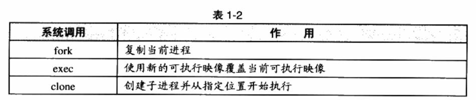

fork函数产生一个和当前进程完全一样的新进程，并和当前进程一样从fork函数里返回。例如如下代码：

```
pid_t pid;
if (pid = fork()) {
	...
}
```

在fork函数调用之后，新的任务将启动并和本任务一起从fork函数返回。但不同的是本任务的fork将返回新任务pid,而新任务的fork将返回0。（参考demo，test4）

fork产生新任务的速度非常快，因为fork并不复制原任务的内存空间，而是和原任务一起共享一个写时复制（Copy on Write，COW）的内存空间。所谓写时复制，指的是两个任务可以同时自由地读取内存，但任意一个任务试图对内存进行修改时，内存就会复制一份提供给修改方单独使用，以免影响到其他的任务使用。

fork只能够产生本任务的镜像，因此须要使用exec配合才能够启动别的新任务。exec可以用新的可执行映像替换当前的可执行映像，因此在fork产生了一个新任务之后，新任务可以调用exec来执行新的可执行文件。

>   exec的demo暂略

fork和exec通常用于产生新任务，而如果要产生新线程，则可以使用clone。使用clone可以产生一个新的任务，从指定的位置开始执行，并且（可选的）共享当前进程的内存空间和文件等。如此就可以在实际效果上产生一个线程。

# 编译链接

在Linux下，当我们使用GCC来编译HelloWorld程序时，只须使用最简单的命令：

```
$gcc hello.c
$./a.out
HelloWorld
```

事实上，上述过程可以分解为4个步骤：

1. 预处理（Prepressing）
2. 编译（Compilation）
3. 汇编（Assembly）
4. 链接（Linking）

## 预编译

首先是源代码文件`hello.c`和相关的头文件，如`stdio.h`等被预编译器cpp预编译成一个`.i`文件。

预编译过程主要处理那些源代码文件中的以“#”开始的预编译指令。比如`#include`、`#define`等，主要处理规则如下：

- 将所有的`#define`删除，并且展开所有的宏定义。
- 处理所有条件预编译指令，比如`#if`、`#ifdef`、`#elif`、`#else`、`#endif。
- 处理`#include`预编译指令，将被包含的文件插入到该预编译指令的位置。注意，这个过程是递归进行的，也就是说被包含的文件可能还包含其他文件。
- 删除所有的注释`//`和`/**/`。
- 添加行号和文件名标识，比如`#2 “hello.c” 2`，以便于编译时编译器产生调试用的行号信息及用于编译时产生编译错误或警告时能够显示行号。
- 保留所有的`#pragma`编译器指令，因为编译器须要使用它们。

经过预编译后的`.i`文件不包含任何宏定义，因为所有的宏已经被展开，并且包含的文件也已经被插入到`.i`文件中。所以当我们无法判断宏定义是否正确或头文件包含是否正确时，可以查看预编译后的文件来确定问题。

## 编译

编译过程就是把预处理完的文件进行一系列词法分析、语法分析、语义分析及优化后生产相应的汇编代码文件。

## 汇编

汇编器是将汇编代码转变成机器可以执行的指令，每一个汇编语句几乎都对应一条机器指令。

## 链接

重要，见下。

# 链接

## 🌟总结

### 链接

链接将多个目标文件中的代码和数据组合起来，使模块之间的引用能够正确连接。核心工作是**符号解析**（找到函数、变量引用对应的定义）和**重定位**（安排代码与数据的位置，并修正地址引用）。

### 静态链接

在构建可执行文件时，将所需的库代码和数据合并进可执行文件。Linux 静态库通常为 `.a` 文件，链接器通常按需提取其中的目标模块，而非复制整个库。程序运行时不再需要这些已静态链接的库文件。

### 动态链接

库代码保存在独立的共享库中，Linux 通常使用 `.so` 文件。构建程序时记录库依赖和相关符号信息，程序启动或运行期间，由动态链接器加载共享库并完成必要的符号解析和重定位；部分函数的符号解析也可延迟到首次调用时。


**在构建动态库时，如果缺少对应的依赖库，还能编译成功吗？**

> 生成 `.so` 时，可以允许外部符号暂未解析，也可以通过选项要求立即检查。

有可能，取决于构建阶段和链接选项。 以 Linux + GNU 链接器为例：

- 链接时明确指定 `-lfoo`：如果找不到对应的 `libfoo.so` 或 `libfoo.a`，链接会失败。
- 生成 `.so` 时保留未解析符号：默认情况下通常允许，符号可留待加载时由主程序或其他库提供；使用 `-Wl,-z,defs` 可以要求缺少定义时立即报错。

所以，生成动态库成功，不代表它一定能正常使用；加载或调用时，所需的库和符号仍必须能够找到。


**在运行时动态链接时，如果缺少对应的依赖库，会怎么样？**

通常会加载失败，具体分两种情况：

- 程序启动时缺少依赖库：动态链接器报错，程序通常还没进入 `main` 就终止，例如 `error while loading shared libraries`。
- 运行中通过 `dlopen` 加载库失败：返回 `NULL`，程序可以捕获并处理错误，例如禁用对应功能，不一定退出。

注意：函数符号的延迟解析，不代表依赖库也延迟加载。启动时声明的必需依赖库，即使其函数尚未调用，也需要能够找到。


### 静态链接与动态链接的区别

| 对比项 | 静态链接 | 动态链接 |
| --- | --- | --- |
| 可执行文件体积 | 包含所需库代码，通常较大 | 库代码独立存放，可执行文件通常较小 |
| 内存共享 | 不同可执行文件各自包含库代码副本 | 多个进程可共享同一共享库的只读代码页，私有数据仍各自独立 |
| 部署依赖 | 不依赖已合并进去的库文件 | 运行环境需提供兼容的共享库 |
| 库更新 | 通常需重新链接并发布程序 | 二进制接口兼容时，可替换共享库，通常需重启程序生效 |
| 性能开销 | 无需为这些库进行运行时动态链接 | 有加载、符号解析和可能的间接调用开销；实际性能取决于程序，不能一概而论 |

一个程序可以对不同的库分别采用静态链接和动态链接。

## 介绍

链接（linking）是将各种代码和数据片段收集并组合成为一个单一文件的过程。

链接的主要内容就是将各个模块之间相互引用的部分正确的衔接起来。它的工作就是把一些指令对其他符号地址的引用加以修正。链接过程主要包括了地址和空间分配、符号解析和重定向。

## 静态链接

静态链接器（static linker）以一组可重定位目标文件和命令行参数作为输入，生成一个完全链接的、可以加载和运行的可执行目标文件作为输出。

为了构造可执行文件，链接器必须完成两个主要任务：

-   符号解析（symbolresolution）。
    目标文件定义和引用符号，每个符号对应于一个函数、一个全局变量或一个静态变量（即C语言中任何以static属性声明的变量）。 符号解析的目的是将每个符号引用正好和一个符号定义关联起来。 
-   重定位（relocation）。
    编译器和汇编器生成从地址0开始的代码和数据节。链接器通过把每个符号定义与一个内存位置关联起来，从而重定位这些节，然后修改所有对这些符号的引用，使得它们指向这个内存位置。链接器使用汇编器产生的重定位条目（relocationentry）的详细指令，不加甄别地执行这样的重定位。 

## 符号和符号表

符号表存放了这些东西：

每个可重定位目标模块m都有一个符号表，它包含m定义和引用的符号的信息。在链接器的上下文中，有三种不同的符号：

-   由模块m定义并能被其他模块引用的全局符号。全局链接器符号对应于非静态的C函数和全局变量。
-   由其他模块定义并被模块m引用的全局符号。这些符号称为外部符号，对应于在其他模块中定义的非静态C函数和全局变量。
-   只被模块m定义和引用的局部符号。它们对应于带static属性的C函数和全局变量。这些符号在模块m中任何位置都可见，但是不能被其他模块引用。

.symtab中的符号表不包含对应于本地非静态程序变量的任何符号。这些符号在运行时在栈中被管理，链接器对此类
符号不感兴趣。

定义为带有C static属性的本地过程变量是不在栈中管理的。相反，编译器在.data或.bss中为每个定义分配空间，并在符号表中创建一个有唯一名字的本地链接器符号。

符号表存放了符号信息，符号信息里有一个value值，对于可重定位的模块来说，value是距定义目标的节的起始位置的偏移。对于可执行目标文件来说，该值是一个绝对运行时地址。（也就是说，符号的定义在其它section中）

## 符号解析

链接器解析符号引用的方法是将每个引用与它输入的可重定位目标文件的符号表中的一个确定的符号定义关联起来。
编译器只允许每个模块中每个局部符号有一个定义。静态局部变量也会有本地链接器符号，编译器还要确保它们拥有唯一的名字。

不过，对全局符号的引用解析就棘手得多。当编译器遇到一个不是在当前模块中定义的符号（变量或函数名）时，会假设该符号是在其他某个模块中定义的，生成一个链接器符号表条目，并把它交给链接器处理。如果链接器在它的任何输入模块中都找不到这个被引用符号的定义，就输出一条错误信息并终止（undefined reference）。

### 链接器如何解析多重定义的全局符号

在编译时，编译器向汇编器输出每个全局符号，或者是强（strong）或者是弱（weak），而汇编器把这个信息隐含地编码在可重定位目标文件的符号表里。函数和已初始化的全局变量是强符号，未初始化的全局变量是弱符号。

根据强弱符号的定义，Linux链接器使用下面的规则来处理多重定义的符号名：

-   规则1：不允许有多个同名的强符号。
-   规则2：如果有一个强符号和多个弱符号同名，那么选择强符号。
-   规则3：如果有多个弱符号同名，那么从这些弱符号中任意选择一个。

### 与静态库链接

所有的编译系统都提供一种机制，将所有相关的目标模块打包成为一个单独的文件，称为静态库（static library），它可以用做链接器的输入。当链接器构造一个输出的可执行文件时，它只复制静态库里被应用程序引用的目标模块。

相关的函数可以被编译为独立的目标模块，然后封装成一个单独的静态库文件。然后，应用程序可以通过在命令行上指定单独的文件名字来使用这些在库中定义的函数。

在链接时，链接器将只复制被程序引用的目标模块，这就减少了可执行文件在磁盘和内存中的大小。

在Linux系统中，静态库以一种称为存档（archive）的特殊文件格式存放在磁盘中。存档文件是一组连接起来的可重定位目标文件的集合，有一个头部用来描述每个成员目标文件的大小和位置。存档文件名由后缀.a标识。

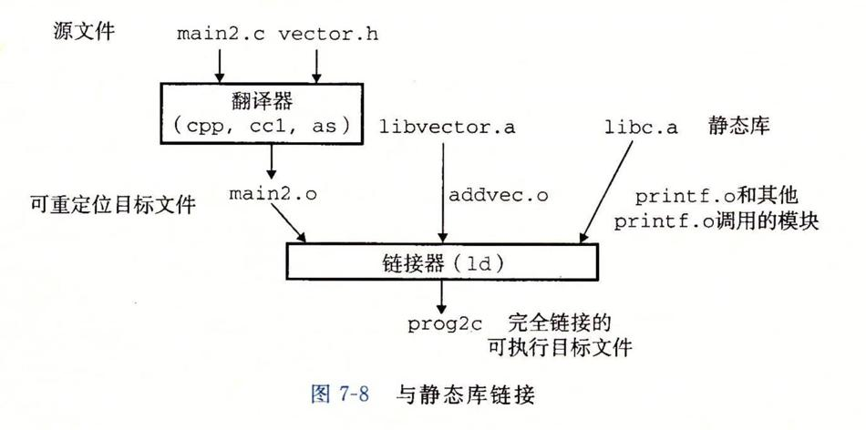

一个例子：

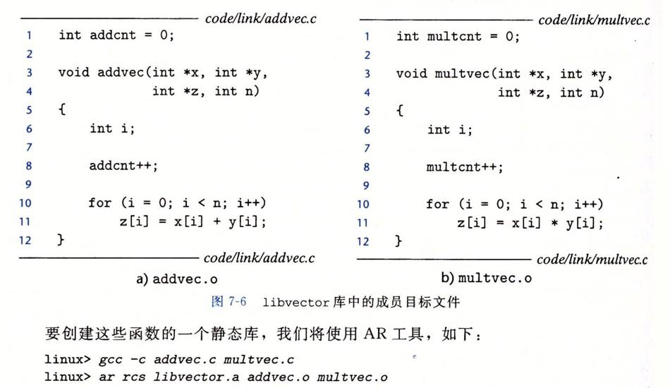

为了使用这个库，可以编写一个应用，它调用addvec库例程。头文件vector.h定义了libvector.a中例程的函数原型。

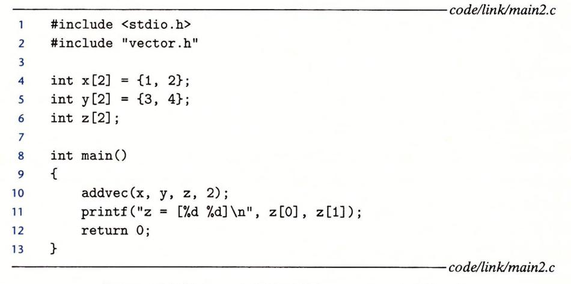

为了创建这个可执行文件，需要编译和链接输入文件main.o和libvector.a：

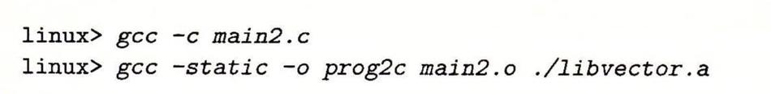

图概括了链接器的行为。-static参数告诉编译器驱动程序，链接器应该构建一个完全链接的可执行目标文件，它可以加载到内存并运行，在加载时无须更进一步的链接。-lvector参数是libvector.a的缩写，-L.参数告诉链接器在当前目录下查找libvector.a。

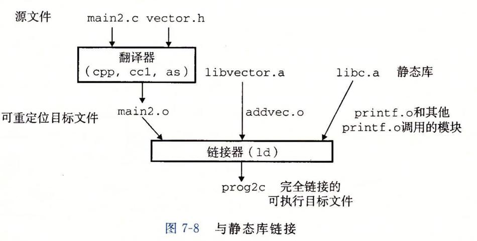

当链接器运行时，它判定main2.o引用了addvec.o定义的addvec符号，所以复制addvec.o到可执行文件。因为程序不引用任何由multvec.o定义的符号，所以链接器就不会复制这个模块到可执行文件。链接器还会复制libc.a中的printf.o模块，以及许多C运行时系统中的其他模块。

### 链接器如何使用静态库来解析引用

在符号解析阶段，链接器从左到右按照它们在编译器驱动程序命令行上出现的顺序来扫描可重定位目标文件和存档文件（.a）。

在这次扫描中，链接器维护
一个可重定位目标文件的集合E（这个集合中的文件会被合并起来形成可执行文件），
一个未解析的符号（即引用了但是尚未定义的符号）集合U，
一个在前面输入文件中已定义的符号集合D。

初始时，E、U和D均为空：

-   对于命令行上的每个输入文件f，链接器会判断f是一个目标文件还是一个存档文件。
    如果f是一个目标文件，那么链接器把f添加到E，修改U和D（f可能也会定义了一些符号）来反映f中的符号定义和引用，并继续下一个输入文件。
-   如果f是一个存档文件，那么链接器就尝试匹配U中未解析的符号和由存档文件成员定义的符号。如果某个存档文件成员m，定义了一个符号来解析U中的一个引用，那么就将m加到E中，并且链接器修改U和D来反映m中的符号定义和引用。
    对存档文件中所有的成员目标文件都依次进行这个过程，直到U和D都不再发生变化。此时，任何不包含在E中的成员目标文件都简单地被丟弃，而链接器将继续处理下一个输入文件。
-   如果当链接器完成对命令行上输入文件的扫描后，U是非空的，那么链接器就会输出一个错误并终止。否则，它会合并和重定位E中的目标文件，构建输出的可执行文件。

这种算法会导致一些令人困扰的链接时错误，因为命令行上的库和目标文件的顺序非常重要。在命令行中，如果定义一个符号的库出现在引用这个符号的目标文件之前，那么引用就不能被解析，链接会失败。比如：

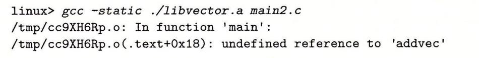

在处理libvector.a时，U是空的，所以没有libvector.a中的成员目标文件会添加到E中。因此，对addvec的引用是绝不会被解析的，所以链接器会产生一条错误信息并终止。

关于库的一般准则是将它们放在命令行的结尾。如果各个库的成员是相互独立的（也就是说没有成员引用另一个成员定义的符号），那么这些库就可以以任何顺序放置在命令行的结尾处。另一方面，如果库不是相互独立的，那么必须对它们排序，使得对于每个被存档文件的成员外部引用的符号s，在命令行中至少有一个s的定义是在对s的引用之后的。

## 重定位

一旦链接器完成了符号解析这一步，就把代码中的每个符号引用和正好一个符号定义（即它的一个输入目标模块中的一个符号表条目）关联起来。此时，链接器就知道它的输入目标模块中的代码节和数据节的确切大小。现在就可以开始重定位步骤了，在这个步骤中，将合并输入模块，并为每个符号分配运行时地址。

重定位由两步组成：

-   重定位节和符号定义。在这一步中，链接器将所有相同类型的节合并为同一类型的新的聚合节。例如，来自所有输入模块的。data节被全部合并成一个节，这个节成为输出的可执行目标文件的。data节。然后，链接器将运行时内存地址赋给新的聚合节，赋给输入模块定义的每个节，以及赋给输人模块定义的每个符号。当这一步完成时，程序中的每条指令和全局变量都有唯一的运行时内存地址了。
-   重定位节中的符号引用。在这一步中，链接器修改代码节和数据节中对每个符号的引用，使得它们指向正确的运行时地址。

### 重定位条目

当汇编器生成一个目标模块时，它并不知道数据和代码最终将放在内存中的什么位置。它也不知道这个模块引用的任何外部定义的函数或者全局变量的位置。所以，无论何时汇编器遇到对最终位置未知的目标引用，它就会生成一个重定位条目，告诉链接器在将目标文件合并成可执行文件时如何修改这个引用。

代码的重定位条目放在.rel.text中。已初始化数据的重定位条目放在.rel.data中。

### 重定位符号引用

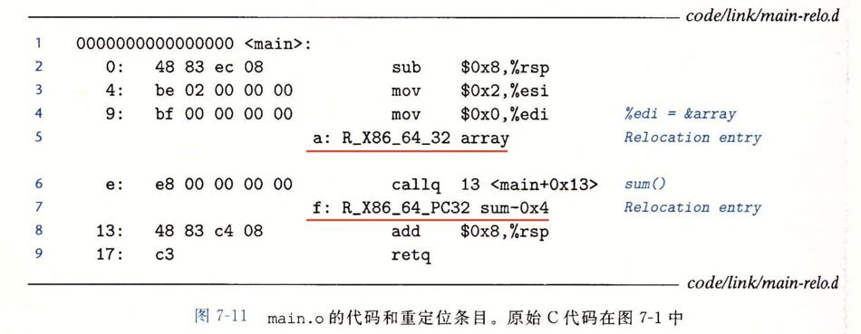

main函数引用了两个全局符号：array和sum。为每个引用，汇编器产生一个重定位条目，显示在引用的后面一行上。这些重定位条目告诉链接器对sum的引用要使用32位PC相对地址进行重定位，而对array的引用要使用32位绝对地址进行重定位。

## 可执行目标文件

图概括了一个典型的ELF可执行文件中的各类信息。

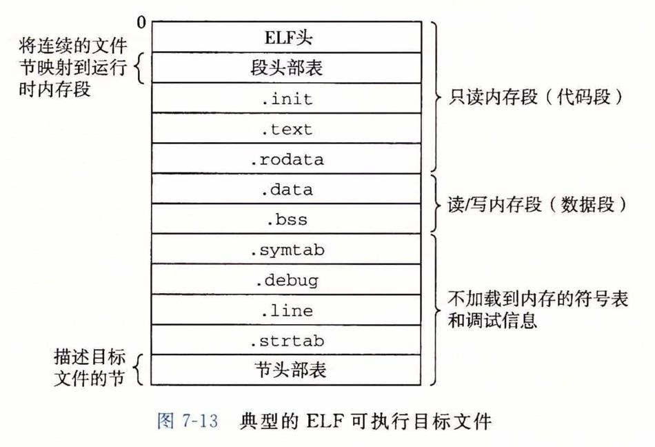
可执行目标文件的格式类似于可重定位目标文件的格式。ELF头描述文件的总体格式。它还包括程序的入口点（entry point），也就是当程序运行时要执行的第一条指令的地址。.text、.rodata和.data节与可重定位目标文件中的节是相似的，除了这些节已经被重定位到它们最终的运行时内存地址以外。.init节定义了一个小函数，叫做_init，程序的初始化代码会调用它。因为可执行文件是完全链接的（已被重定位），所以它不再需要.rel节。

ELF可执行文件被设计得很容易加载到内存，可执行文件的连续的片（chunk）被映射到连续的内存段。程序头部表（program header table)描述了这种映射关系。

## 加载可执行目标文件

要运行可执行目标文件prog，可以在Linuxshell的命令行中输入它的名字：

```
linux> ./prog
```

因为prog不是一个内置的shell命令，所以shell会认为prog是一个可执行目标文件，通过调用某个驻留在存储器中称为加载器（loader）的操作系统代码来运行它。

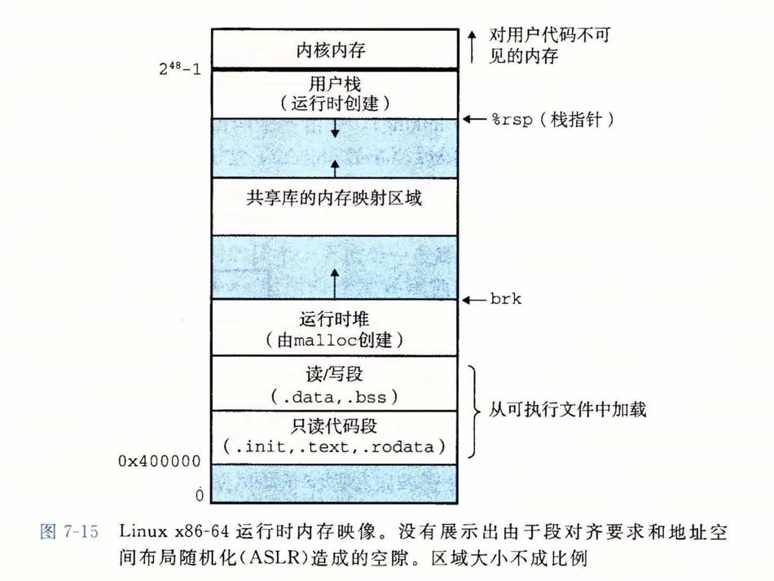

每个Linux程序都有一个运行时内存映像，类似于图7-15中所示。在Linux x86-64系统中，代码段总是从地址0x400000处开始，后面是数据段。运行时堆在数据段之后，通过调用malloc库往上增长。堆后面的区域是为共享模块保留的。用户栈总是从最大的合法用户地址（2^48-1）开始，向较小内存地址增长。栈上的区域，从地址2^48开始，是为内核（kernel）中的代码和数据保留的，所谓内核就是操作系统驻留在内存的部分。

>   加载器实际是如何工作的？
>
>   下面是关于加载实际是如何工作的一个概述：
>
>   Linux系统中的每个程序都运行在一个进程上下文中，有自己的虛拟地址空间。当shell运行一个程序时，父shell进程生成一个子进程，它是父进程的一个复制。子进程通过execve系统调用启动加载器。加载器删除子进程现有的虚拟內存段，并创建一组新的代码、数据、堆和栈段。新的栈和堆段被初始化为零。通过将虛拟地址空间中的页映射到可执行文件的页大小的片（chunk），新的代码和数据段被初始化为可执行文件的內容。最后，加载器跳转到_start地址，它最终会调用应用程序的main函数。**除了一些头部信息，在加载过程中没有任何从磁盘到內存的数据复制。直到CPU引用一个被映射的虛拟页时才会进行复制，此时，操作系统利用它的页面调度机制自动将页面从磁盘传送到内存。**


