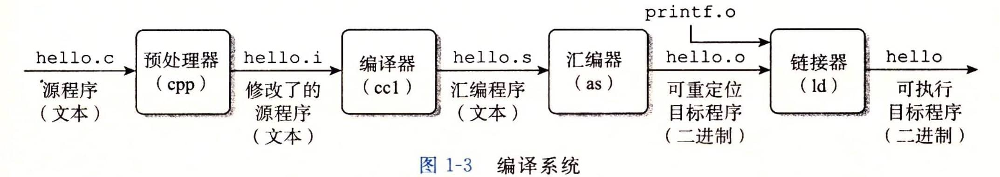
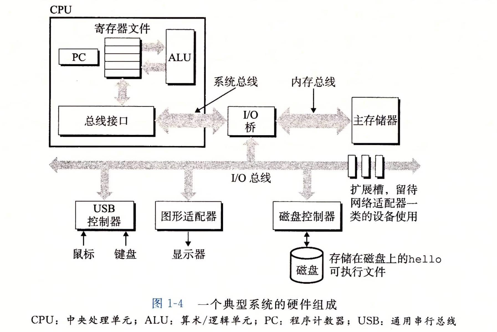
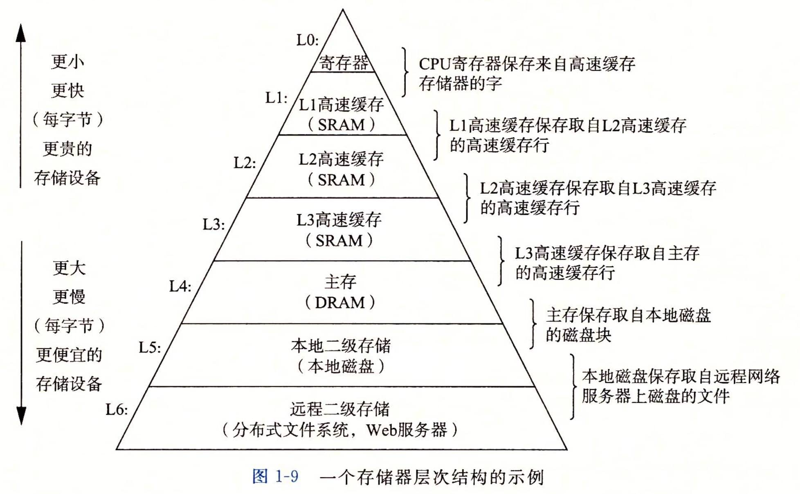
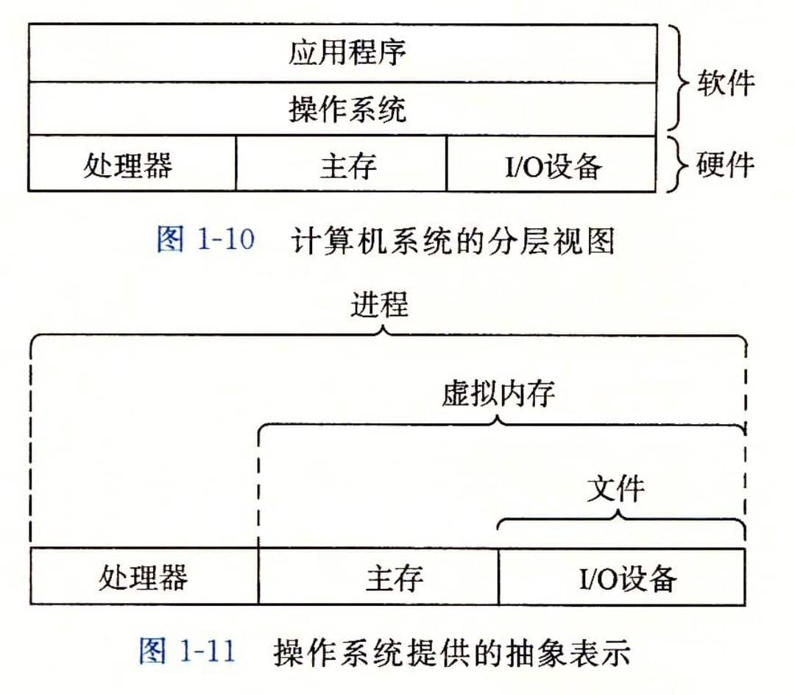

# 编译

从源文件到目标文件的转化是由编译器驱动程序完成的：

```
gcc -o hello hello.c
```

执行这四个阶段的程序（预处理器、编译器、汇编器和链接器）一起构成了编译系统。



-   预处理阶段。预处理器（cpp）根据以字符#开头的命令，修改原始的C程序。比如#include `<stdio.h>` 命令告诉预处理器读取系统头文件stdio.h的内容，并把它直接插人程序文本中。结果就得到了另一个C程序，通常是以`.i`作为文件扩展名。

-   编译阶段。编译器（ccl）将文本文件`hello.i`翻译成文本文件`hello.s`，它包含一个汇编语言程序。该程序包含函数 main 的定义，如下所示：

    


-   汇编阶段。接下来，汇编器（as）将 hello.s翻译成机器语言指令，把这些指令打包成一种叫做可重定位目标程序的格式，并将结果保存在目标文件hello.o中。
-   链接阶段。hello程序调用了printf函数，它是每个 C编译器都提供的标准C库中的一个函数。printf函数存在于一个名为 printf.o的单独的预编译好了的目标文件中，而这个文件必须以某种方式合并到我们的hello.o程序中。链接器（Id）就负责处理这种合并。结果就得到 hello 文件，它是一个可执行目标文件（或者简称为可执行文件），可以被加载到内存中，由系统执行。

# 系统的硬件组成

1.  总线
    贯穿整个系统的是一组电子管道，称作总线，它携带信息字节并负责在各个部件间传递。通常总线被设计成传送定长的字节块，也就是字（word）。字中的字节数（即字长）是一个基本的系统参数，各个系统中都不尽相同。现在的大多数机器字长要么是4个字节（32位），要么是8个字节（64 位）。
2.  I/O设备
3.  主存
    主存是一个临时存储设备，在处理器执行程序时，用来存放程序和程序处理的数据。从物理上来说，主存是由一组动态随机存取存储器（DRAM）芯片组成的。从逻辑上来说，存储器是一个线性的字节数组，每个字节都有其唯一的地址（数组索引），这些地址是从零开始的。
    数据一般需要经过处理器才能到达主存。利用直接存储器存取技术，数据可以不通过处理器而直接从磁盘到达主存。
4.  处理器
    中央处理单元（CPU），简称处理器，是解释（或执行）存储在主存中指令的引擎。处理器的核心是一个大小为一个字的存储设备（或寄存器），称为程序计数器（PC）。在任何时刻，PC都指向主存中的某条机器语言指令（即含有该条指令的地址）。



## 64/32位

64位CPU是指CPU内部的通用寄存器的宽度为64比特，支持整数的64比特宽度的算术与逻辑运算。

存储器的大小是依据可寻址的存储器组件大小而变，例如 16位地址总线其寻址能力有 2的 16次方 = 65,536 = 64 KB 的存储器空间，而 32位地址总线其寻址能力有 2的 32次方 = 4,294,967,296 = 4 GB的存储器空间。

>   CPU的64位是指一次处理数据，数据的最大长度。
>
>   地址总线的32位是指寻址能力，最大能寻2的32次-1的地址，也就是4GB；64位就是2的64次-1。

# 高速缓存

hello程序的机器指令最初是存放在磁盘上，当程序加载时，它们被复制到主存；当处理器运行程序时，指令又从主存复制到处理器。相似地，数据串`hello，world/n`开始时在磁盘上，然后被复制到主存，最后从主存上复制到显示设备。

从程序员的角度来看，这些复制就是开销，减慢了程序“真正”的工作。因此，系统设计者的一个主要目标就是使这些复制操作尽可能快地完成。

针对这种处理器与主存之间的差异，系统设计者采用了更小更快的存储设备，称为高速缓存存储器（cache memory，简称为 cache 或高速缓存），作为暂时的集结区域，存放处理器近期可能会需要的信息。


>   从图中可以看到，高速缓存是位于CPU芯片中的。

# 存储设备层次结构

每个计算机系统中的存储设备都被组织成了一个存储器层次结构：



# 操作系统管理硬件

操作系统有两个基本功能：

1.  防止硬件被失控的应用程序滥用
2.  向应用程序提供简单一致的机制来控制复杂而又通常大不相同的低级硬件设备。

操作系统通过几个基本的抽象概念（进程、虚拟内存和文件）来实现这两个功能。



## 进程

进程是操作系统对一个正在运行的程序的一种抽象。

并发运行，则是说一个进程的指令和另一个进程的指令是交错执行的。

一个 CPU 看上去都像是在并发地执行多个进程，这是通过处理器在进程间切换来实现的。操作系统实现这种交错执行的机制称为**上下文切换**。

操作系统保持跟踪进程运行所需的所有状态信息。这种状态，也就是上下文，包括许多信息，比如PC和寄存器文件的当前值，以及主存的内容。在任何一个时刻，单处理器系统都只能执行一个进程的代码。当操作系统决定要把控制权从当前进程转移到某个新进程时，就会进行上下文切换，即保存当前进程的上下文、恢复新进程的上下文，然后将控制权传递到新进程。新进程就会从它上次停止的地方开始。

### 线程

一个进程可以由多个称为线程的执行单元组成，每个线程都运行在进程的上下文中，并共享同样的代码和全局数据。

### 虚拟内存

虚拟内存是一个抽象概念，它为每个进程提供了一个假象，即每个进程都在独占地使用主存。每个进程看到的内存都是一致的，称为虚拟地址空间。在 Linux 中，地址空间最上面的区域是保留给操作系统中的代码和数据的，这对所有进程来说都是一样。

地址空间的底部区域存放用户进程定义的代码和数据。图中的地址是从下往上增大的。


### 文件

文件就是字节序列，仅此而已。

文件这个简单而精致的概念是非常强大的，因为它向应用程序提供了一个统一的视图，来看待系统中可能含有的所有各式各样的I/O设备。

# 并发和并行

数字计算机的整个历史中，有两个需求是驱动进步的持续动力：一个是我们想要计算机做得更多，另一个是我们想要计算机运行得更快。并发和并行就是上面的目的。

-   术语并发（concurrency）是一个通用的概念，指一个同时具有多个活动的系统
-   术语并行（parallelism）指的是用并发来使一个系统运行得更快

并行可以在计算机系统的多个抽象层次上运用。在此，我们按照系统层次结构中由高到低的顺序重点强调三个层次。

## 线程级并发

构建在进程这个抽象之上，我们能够设计出同时有多个程序执行的系统，这就导致了并发。使用线程，我们甚至能够在一个进程中执行多个控制流。

传统意义上，这种并发执行只是模拟出来的，是通过使一台计算机在它正在执行的进程间快速切换来实现的。

超线程，有时称为同时多线程（simultaneous multi-threading），是一项允许一个CPU执行多个控制流的技术。它涉及CPU某些硬件有多个备份，比如程序计数器和寄存器文件，而其他的硬件部分只有一份，比如执行浮点算术运算的单元。

常规的处理器需要大约20000个时钟周期做不同线程间的转换，而超线程的处理器可以在单个周期的基础上决定要执行哪一个线程。这使得CPU能够更好地利用它的处理资源。

多处理器的使用可以从两方面提高系统性能。首先，它减少了在执行多个任务时模拟并发的需要。正如前面提到的，即使是只有一个用户使用的个人计算机也需要并发地执行多个活动。其次，它可以使应用程序运行得更快，当然，这必须要求程序是以多线程方式来书写的，这些线程可以并行地高效执行。

## 指令级并行

在较低的抽象层次上，现代处理器可以同时执行多条指令的属性称为指令级并行。

