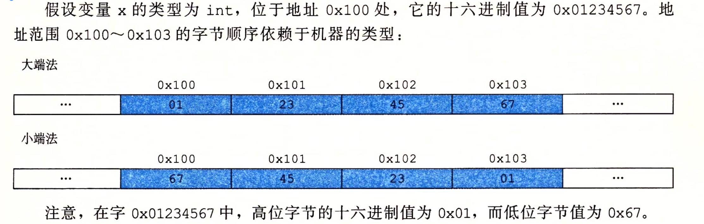
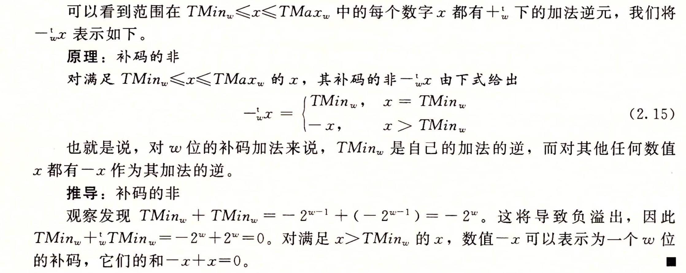

# 信息存储

## 寻址和字节顺序

-   最低有效字节在最前面（低地址）的方式，称为小端法（little endian）。
-   最高有效字节在最前面（低地址）的方式，称为大端法（big endian）。



### 为什么会有小端字节序？

计算机电路先处理低位字节，效率比较高，因为计算都是从低位开始的。所以，计算机的内部处理都是小端字节序。

但是，人类还是习惯读写大端字节序。所以，除了计算机的内部处理，其他的场合几乎都是大端字节序，比如网络传输和文件储存。

计算机处理字节序的时候，不知道什么是高位字节，什么是低位字节。它只知道按顺序读取字节，先读第一个字节，再读第二个字节。如果是大端字节序，先读到的就是高位字节，后读到的就是低位字节。小端字节序正好相反。

```cpp
void computer_system::test1() {
    short val = 12345;//0x3039
    show_bytes((byte_pointer) &val, sizeof(short));
}

void computer_system::show_bytes(computer_system::byte_pointer start, size_t len) {
    size_t i;
    for (i = 0; i < len; i++)
        printf(" %.2x", start[i]);    //%.2x，x表示16进制输出，.2的作用是如果格式化的数据不足2位则用0填充
    printf("\n");
}
```

```
 39 30
```

## 表示字符串

C语言中字符申被编码为一个以null（其值为0）字符结尾的字符数组。每个字符都由某个标准编码来表示，最常见的是 ASCII 字符码。

## C语言中的移位运算

左移就是在低位补0，而右移分为逻辑右移和算术右移。

逻辑右移在左端补k个0，算术右移是在左端补k个最高有效位的值。

C语言标准并没有明确定义对于有符号数应该使用哪种类型的右移——算术右移或者逻辑右移都可以。与C相比，Java对于如何进行右移有明确的定义。表达是 x>>k 会将 x 算术右移k个位置，而 x>>>k 会对x做逻辑右移。

# 整数运算

## 补码加法

x+y。位长w。

如果发生正溢出，那么减去2^w，负溢出则加上2^w。

## 补码的非

除了MIN，其他的值都是正负号变化，而MIN的取非还是MIN。



```cpp
void computer_system::test2() {
    cout << "(-INT32_MIN) = " << -INT32_MIN << endl;
}

(-INT32_MIN) = -2147483648
```
