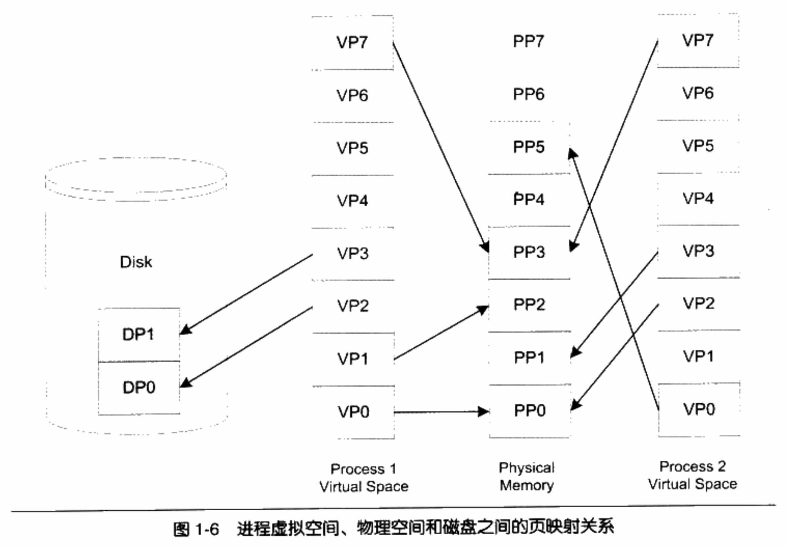

# 直接面向物理内存的缺点

在早期的计算机中，程序是直接运行在物理内存上的，程序在运行时所访问的地址都是物理地址。那么很明显的一个问题是，如何将计算机上有限的物理内存分配给多个程序使用。

假设我们的计算机有128MB内存，程序A运行需要10MB，程序B需要100MB，程序C需要20MB。如果我们需要同时运行程序A和B，那么比较直接的做法是将内存的前10MB分配给程序A，10MB~110MB分配给B。这样就能够实现A和B两个程序同时运行，但是这种简单的内存分配策略问题很多。

-   地址空间不隔离
    所有程序都直接访问物理地址，程序所使用的内存空间不是相互隔离的。其它程序很容易影响当前程序。
-   内存使用效率低
    由于没有有效的内存管理机制，通常需要一个程序执行时，监控程序就将整个程序装入内存中然后开始执行。如果我们忽然需要运行程序C，那么这时内存空间其实已经不够了，这时候我们可以用的一个办法是将其他程序的数据暂时写到磁盘里面，等到需要用到的时候再读回来。由于程序所需要的空间是连续的，那么这个例子里面，如果我们将程序A换出到磁盘所释放的内存空间是不够的，所以只能将B换出到磁盘，然后将C读入到内存开始运行。可以看到整个过程中有大量的数据在换入换出，导致效率十分低下。
-   程序运行的地址
    不确定因为程序每次需要装入运行时，我们都需要给它从内存中分配一块足够大的空闲区域，这个空闲区域的位置是不确定的。这给程序的编写造成了一定的麻烦，因为程序在编写时，它访问数据和指令跳转时的目标地址很多都是固定的，这涉及程序的重定位问题。

解决这几个问题的思路就是使用一种间接的地址访问方法。整个想法是这样的：
我们把程序给出的地址看作是一种虚拟地址(Virtual Address)，然后通过某些映射的方法，将这个虚拟地址转换成实际的物理地址。这样，只要我们能够妥善地控制这个虚拟地址到物理地址的映射过程，就可以保证任意一个程序所能够访问的物理内存区域跟另外一个程序相互不重叠，以达到地址空间隔离的效果。

# 虚拟地址和物理地址

地址空间分两种：虚拟地址空间(Virtual Address Space)和物理地址空间(Physical Address Space)。

物理地址空间是实实在在存在的，存在于计算机中，而且对于每一台计算机来说只有唯一的一个，你可以把物理空间想象成物理内存，比如你的计算机用的是32位的机器，即计算机地址线有32条(实际上是36条地址线，不过我们暂时认为它只是32条)，那么物理空间就有4GB。但是你的计算机上只装了512MB的内存，那么其实物理地址的真正有效部分只有0x00000000~0x1FFFFFFF，其他部分都是无效的(实际上还有一些外部I/O设备映射到物理空间的，也是有效的，但是我们暂时无视其存在)。

虚拟地址空间是指虚拟的、人们想象出来的地址空间，其实它并不存在，每个进程都有自己独立的虚拟空间，而且每个进程只能访问自己的地址空间，这样就有效地做到了进程的隔离。

# 分段(Segmentation)

最开始人们使用的是一种叫做分段(Segmentation)的方法，基本思路是把一段与程序所需要的内存空间大小的虚拟空间映射到某个地址空间。比如程序A需要10MB内存，

分段的方法基本解决了地址空间不隔离和程序运行的地址的问题。

首先它做到了地址隔离，因为程序A和程序B被映射到了两块不同的物理空间区域，它们之间没有任何重叠，如果程序A访问虚拟空间的地址超出了0x00A00000这个范围，那么硬件就会判断这是一个非法的访问，拒绝这个地址请求，并将这个请求报告给操作系统或监控程序，由它来决定如何处理。

第二，对于每个程序来说，无论它们被分配到物理地址的哪一个区域，对于程序来说都是透明的，它们不需要关心物理地址的变化，所以程序不再需要重定位。

但是分段的这种方法还是没有解决内存使用效率低的问题。

分段对内存区域的映射还是按照程序为单位，如果内存不足，被换入换出到磁盘的都是整个程序，这样势必会造成大量的磁盘访问操作，从而严重影响速度。

# 分页（Paging）

分页的基本方法是把地址空间人为地等分成固定大小的页，每一页的大小由硬件决定，或硬件支持多种大小的页，由操作系统选择决定页的大小。

那么，当我们把进程的虚拟地址空间按页分割，把常用的数据和代码页装载到内存中，把不常用的代码和数据保存在磁盘里，当需要用到的时候再把它从磁盘里取出来即可。

把虚拟空间的页就叫虚拟页（VP，Virtual Page），把物理内存中的页叫做物理页（PP，Physical Page），把磁盘中的页叫做磁盘页（DP，Disk Page）。

虚拟存储的实现需要依靠硬件的支持，对于不同的CPU来说是不同的。但是几乎所有的硬件都采用一个叫MMU（Memory Management Unit）的部件来进行页映射，在页映射模式下，CPU发出的是Virtual Address，即我们的程序看到的是虚拟地址。经过MMU转换以后就变成了Physical Address。一般MMU都集成在CPU内部了，不会以独立的部件存在。
