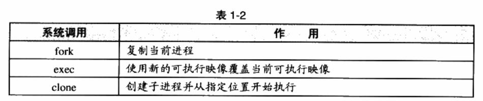

# 线程基础

线程（Thread），是程序执行流的最小单元。一个标准的线程由线程ID、当前指令指针（PC）、寄存器集合和堆栈组成。

通常意义上，一个进程由一个到多个线程组成，各个线程之间共享程序的内存空间（包括代码段、数据段、堆等）及一些进程级的资源（如打开文件和信号）。

## 线程的访问权限


## 线程调度与优先级

并发是一种模拟出来的状态，操作系统会让这些多线程程序轮流执行，每次仅执行一小段时间（通常是几十到几百毫秒），这样每个线程就“看起来”在同时执行。这样的一个不断在处理器上切换不同的线程的行为称之为线程调度（Thread Schedule）。

在线程调度中，线程通常拥有至少三种状态，分别是：

-   运行（Running）：此时线程正在执行。
-   就绪（Ready）：此时线程可以立刻运行，但CPU已经被占用。
-   等待（Waiting）：此时线程正在等待某一事件（通常是IVO或同步）发生，无法执行。

处于运行中线程拥有一段可以执行的时间，这段时间称为时间片（TimeSlice），当时间片用尽的时候，该进程将进入就绪状态。如果在时间片用尽之前进程就开始等待某事件，那么它将进入等待状态。每当一个线程离开运行状态时，调度系统就会选择一个其他的就绪线程继续执行。在一个处于等待状态的线程所等待的事件发生之后，该线程将进入就绪状态。

## Linux的多线程

Windows对进程和线程的实现如同教科书一般标准，Windows内核有明确的线程和进程的概念。在Windows API中，可以使用明确的API：CreateProcess和CreateThread来创建进程和线程，并且有一系列的API来操纵它们。但对于Linux来说，线程并不是一个通用的概念。

Linux对多线程的支持颇为贫乏，事实上，在Linux内核中并不存在真正意义上的线程概念。Linux将所有的执行实体（无论是线程还是进程）都称为任务（Task），每一个任务概念上都类似于一个单线程的进程，具有内存空间、执行实体、文件资源等。不过，Linux下不同的任务之间可以选择共享内存空间，因而在实际意义上，共享了同一个内存空间的多个任务构成了一个进程，这些任务也就成了这个进程里的线程。在Linux下，用以下方法可以创建一个新的任务。



fork函数产生一个和当前进程完全一样的新进程，并和当前进程一样从fork函数里返回。例如如下代码：

```
pid_t pid;
if (pid = fork()) {
	...
}
```

在fork函数调用之后，新的任务将启动并和本任务一起从fork函数返回。但不同的是本任务的fork将返回新任务pid,而新任务的fork将返回0。（参考demo，test4）

fork产生新任务的速度非常快，因为fork并不复制原任务的内存空间，而是和原任务一起共享一个写时复制（Copy on Write，COW）的内存空间。所谓写时复制，指的是两个任务可以同时自由地读取内存，但任意一个任务试图对内存进行修改时，内存就会复制一份提供给修改方单独使用，以免影响到其他的任务使用。

fork只能够产生本任务的镜像，因此须要使用exec配合才能够启动别的新任务。exec可以用新的可执行映像替换当前的可执行映像，因此在fork产生了一个新任务之后，新任务可以调用exec来执行新的可执行文件。

>   exec的demo暂略

fork和exec通常用于产生新任务，而如果要产生新线程，则可以使用clone。使用clone可以产生一个新的任务，从指定的位置开始执行，并且（可选的）共享当前进程的内存空间和文件等。如此就可以在实际效果上产生一个线程。

## 线程安全

### 同步与锁

**二元信号量（Binary Semaphore）**是最简单的一种锁，它只有两种状态：占用与非占用。它适合只能被唯一一个线程独占访问的资源。当二元信号量处于非占用状态时，第一个试图获取该二元信号量的线程会获得该锁，并将二元信号量置为占用状态，此后其他的所有试图获取该二元信号量的线程将会等待，直到该锁被释放。

对于允许多个线程并发访问的资源，**多元信号量简称信号量（Semaphore**），它是一个很好的选择。一个初始值为N的信号量允许N个线程并发访问。线程访问资源的时候首先获取信号量，进行如下操作：

-   将信号量的值减1。
-   如果信号量的值小于0，则进入等待状态，否则继续执行。

访问完资源之后，线程释放信号量，进行如下操作：

-   将信号量的值加1。
-   如果信号量的值小于1，唤醒一个等待中的线程。

**互斥量（Mutex）**和二元信号量很类似，资源仅同时允许一个线程访问，但和信号量不同的是，信号量在整个系统可以被任意线程获取并释放，也就是说，同一个信号量可以被系统中的一个线程获取之后由另一个线程释放。而互斥量则要求哪个线程获取了互斥量，哪个线程就要负责释放这个锁，其他线程越俎代庖去释放互斥量是无效的。

**临界区（CriticalSection）**是比互斥量更加严格的同步手段。在术语中，把临界区的锁的获取称为进入临界区，而把锁的释放称为离开临界区。临界区和互斥量与信号量的区别在于，互斥量和信号量在系统的任何进程里都是可见的，也就是说，一个进程创建了一个互斥量或信号量，另一个进程试图去获取该锁是合法的。
然而，临界区的作用范围仅限于本进程，其他的进程无法获取该锁。除此之外，临界区具有和互斥量相同的性质。

**读写锁（Read-WriteLock）**致力于一种更加特定的场合的同步。对于一段数据，多个线程同时读取总是没有问题的，但假设操作都不是原子型，只要有任何一个线程试图对这个数据进行修改，就必须使用同步手段来避免出错。对于同一个锁，读写锁有两种获取方式，共享的（Shared）或独占的（Exclusive）。当锁处于自由的状态时，试图以任何一种方式获取锁都能成功，并将锁置于对应的状态。如果锁处于共享状态，其他线程以共享的方式获取锁仍然会成功，此时这个锁分配给了多个线程。然而，如果其他线程试图以独占的方式获取已经处于共享状态的锁，那么它将必须等待锁被所有的线程释放。相应地，处于独占状态的锁将阻止任何其他线程获取该锁，不论它们试图以哪种方式获取。

**条件变量（ConditionVariable）**作为一种同步手段，作用类似于一个栅栏。对于条件变量，线程可以有两种操作，首先线程可以等待条件变量，一个条件变量可以被多个线程等待。其次，线程可以唤醒条件变量，此时某个或所有等待此条件变量的线程都会被唤醒并继续支持。也就是说，使用条件变量可以让许多线程一起等待某个事件的发生，当事件发生时（条件变量被唤醒），所有的线程可以一起恢复执行。

### volatile

可重入（Reentrant）与线程安全
一个函数被重入，表示这个函数没有执行完成，由于外部因素或内部调用，又一次进入
该函数执行。一个函数要被重入，只有两种情况;
（1）多个线程同时执行这个函数。
（2）函数自身（可能是经过多层调用之后）调用自身。
一个函数被称为可重入的，表明该函数被重入之后不会产生任何不良后果。举个例子，
如下面这个sqr函数就是可重入的：
成功
等待
等待
27
以独占方式获取
一个函数要成为可重入的，必须具有如下几个特点：
程序员的自我修养——链接、装载与库

Page51
28
不使用任何（局部）静态或全局的非const变量。
不返回任何（局部）静态或全局的非const变量的指针。
仅依赖于调用方提供的参数。
不依赖任何单个资源的锁（mutex等）。
不调用任何不可重入的函数。
可重入是并发安全的强力保障，一个可重入的函数可以在多线程环境下放心使用。
过度优化
线程安全是一个非常烫手的山芋，因为即使合理地使用了锁，也不一定能保证线程安全，
这是源于落后的编译器技术已经无法满足日益增长的并发需求。很多看似无错的代码在优化
和并发面前又产生了麻烦。最简单的例子，让我们看看如下代码：
x=0;
Thread1Thread2
lock（）;
x++;
unlock（）;unlock（）;
由于有lock和unlock的保护，x++的行为不会被并发所破坏，那么x的值似乎必然是2
了。然而，如果编译器为了提高x的访问速度，把x放到了某个寄存器里，那么我们知道不
同线程的寄存器是各自独立的，因此如果Threadl先获得锁，则程序的执行可能会呈现如下
的情况：
lock（）;
x++;
[Thread1]读取x的值到某个寄存器R[1]（R[1]=0）。
[Thread1]R[1]++（由于之后可能还要访问x，因此Thread1暂时不将R[1]写回x）。
[Thread2]读取x的值到某个寄存器R[2]（R[2]=0）。
●[Thread2]R[2]++（R[2]=1）。
第1章温故而知新
x=1;
r1=y;
[Thread2]将R[2]写回至x（x=1）。
[Threadl]（很久以后）将R[1]写回至x（x=1）。
可见在这样的情况下即使正确地加锁，也不能保证多线程安全。下面是另一个例子：
x=y=0;
Thread1Thread2
y=1：
r2=x;
很显然，r1和r2至少有一个为1，逻辑上不可能同时为0。然而，事实上r1=r2=0的情
况确实可能发生。原因在于早在几十年前，CPU就发展出了动态调度，在执行程序的时候
为了提高效率有可能交换指令的顺序。同样，编译器在进行优化的时候，也可能为了效率而
程序员的自我修养——链接、装载与库

Page52
x=y=0;
ThreadlThread2
r1=y;
x=1;
交换毫不相干的两条相邻指令（如x=1和rl=y）的执行顺序。也就是说，以上代码执行的
时候可能是这样的：
y=1;
r2=x;
那么r1=r2=0就完全可能了。我们可以使用volatile关键字试图阻止过度优化，volatile基本
可以做到两件事情：
（1）阻止编译器为了提高速度将一个变量缓存到寄存器内而不写回。
（2）阻止编译器调整操作volatile变量的指令顺序。
可见volatile可以完美地解决第一个问题，但是volatile是否也能解决第二个问题呢?答
案是不能。因为即使volatile能够阻止编译器调整顺序，也无法阻止CPU动态调度换序。
volatileT*pInst=0;
T*GetInstance（）
另一个颇为著名的与换序有关的问题来自于Singleton模式的double-check。一段典型的
double-check的singleton代码是这样的（不熟悉Singleton的读者可以参考《设计模式：可
复用面向对象软件的基础》，但下面所介绍的内容并不真正需要了解Singleton）：
{
if（pInst==NULL）
{
1.6众人拾柴火焰高
lock（）;
if（pInst==NULL）
pInst=newT;
29
unlock（）;
}
returnpInst;
抛开逻辑，这样的代码乍看是没有问题的，当函数返回时，PInst总是指向一个有效的
对象。而lock和unlock防止了多线程竞争导致的麻烦。双重的if在这里另有妙用，可以让
lock的调用开销降低到最小。读者可以自己揣摩。
但是实际上这样的代码是有问题的。问题的来源仍然是CPU的乱序执行。C++里的new
其实包含了两个步骤：
（1）分配内存。
（2）调用构造函数。
所以pInst=newT包含了三个步骤：
（1）分配内存。
程序员的自我修养——链接、装载与库

Page53
30
（2）在内存的位置上调用构造函数。
（3）将内存的地址赋值给pInst。
在这三步中，（2）和（3）的顺序是可以颠倒的。也就是说，完全有可能出现这样的情
况：plnst的值已经不是NULL，但对象仍然没有构造完毕。这时候如果出现另外一个对
GetInstance的并发调用，此时第一个if内的表达式pInst==NULL为false，所以这个调用会
直接返回尚未构造完全的对象的地址（pInst）以提供给用户使用。那么程序这个时候会不会
崩溃就取决于这个类的设计如何了。
从上面两个例子可以看到CPU的乱序执行能力让我们对多线程的安全保障的努力变得
异常困难。因此要保证线程安全，阻止CPU换序是必需的。遗憾的是，现在并不存在可移
植的阻止换序的方法。通常情况下是调用CPU提供的一条指令，这条指令常常被称为barrier。
一条barrier指令会阻止CPU将该指令之前的指令交换到barrier之后，反之亦然。换句话说，
barrier指令的作用类似于一个拦水坝，阻止换序“穿透”这个大坝。
许多体系结构的CPU都提供barrier指令，不过它们的名称各不相同，例如POWERPC
提供的其中一条指令名叫lwsync。我们可以这样来保证线程安全：
#definebarrier（）_asmvolatile（*1wsync"）
volatileT*pInst=0;
T*GetInstance（）
{
}
第1章温故而知新
if（!pInst）
{
lock（）;
if（!pInst）
{
T*temp=newT;
barrier（）;
pInst=temp;
unlock（）;
}
returnpInst;
由于barrier的存在，对象的构造一定在barrier执行之前完成，因此当pInst被赋值时，
对象总是完好的。
1.6.3多线程内部情况
三种线程模型
线程的并发执行是由多处理器或操作系统调度来实现的。但实际情况要更为复杂一些：
大多数操作系统，包括Windows和Linux，都在内核里提供线程的支持，内核线程（注：这
程序员的自我修养——链接、装载与库

Page54
里的内核线程和Linux内核里的kernel_thread并不是一回事）和我们之前讨论的一样，由多
处理器或调度来实现并发。然而用户实际使用的线程并不是内核线程，而是存在于用户态的
用户线程。用户态线程并不一定在操作系统内核里对应同等数量的内核线程，例如某些轻量
级的线程库，对用户来说如果有三个线程在同时执行，对内核来说很可能只有一个线程。本
节我们将详细介绍用户态多线程库的实现方式。
1.一对一模型
对于直接支持线程的系统，一对一模型始终是最为简单的模型。对一对一模型来说，
个用户使用的线程就唯一对应一个内核使用的线程（但反过来不一定，一个内核里的线程在
用户态不一定有对应的线程存在），如图1-11所示。
UserThread
KernelThread
1.6众人拾柴火焰高
intthread_function（void*）
{....）
charthread_stack[4096];
}
图1-11一对一线程模型
这样用户线程就具有了和内核线程一致的优点，线程之间的并发是真正的并发，一个线
程因为某原因阻塞时，其他线程执行不会受到影响。此外，一对一模型也可以让多线程程序
在多处理器的系统上有更好的表现。
voidfoo
{
K
一般直接使用API或系统调用创建的线程均为一对一的线程｡例如在Linux里使用clone
（带有CLONE_VM参数）产生的线程就是一个一对一线程，因为此时在内核有一个唯一的
线程与之对应。下列代码演示了这一过程：
31
clone（thread_function，thread_stack，CLONE_VM，0）;
在Windows里，使用APICreateThread即可创建一个一对一的线程。
一对一线程缺点有两个：
程序员的自我修养——链接、装载与库

Page55
32
由于许多操作系统限制了内核线程的数量，因此一对一线程会让用户的线程数量受到
限制。
第1章温故而知新
许多操作系统内核线程调度时，上下文切换的开销较大，导致用户线程的执行效率下
降。
2.多对一模型
多对一模型将多个用户线程映射到一个内核线程上，线程之间的切换由用户态的代码来
进行，因此相对于一对一模型，多对一模型的线程切换要快速许多。多对一的模型示意图如
图1-12所示。
??
UserThread
KernelThread
图1-12多对一线程模型
程序员的自我修养——链接、装载与库
K
多对一模型一大问题是，如果其中一个用户线程阻塞，那么所有的线程都将无法执行，
因为此时内核里的线程也随之阻塞了。另外，在多处理器系统上，处理器的增多对多对一模
型的线程性能也不会有明显的帮助。但同时，多对一模型得到的好处是高效的上下文切换和
几乎无限制的线程数量。
3.多对多模型
多对多模型结合了多对一模型和一对一模型的特点，将多个用户线程映射到少数但不止
一个内核线程上，如图1-13所示。
在多对多模型中，一个用户线程阻塞并不会使得所有的用户线程阻塞，因为此时还有
别的线程可以被调度来执行。另外，多对多模型对用户线程的数量也没什么限制，在多处
理器系统上，多对多模型的线程也能得到一定的性能提升，不过提升的幅度不如一对一模
型高。

Page56
UserThread
KernelThread
1.7本章小结
图1-13多对多线程模型
33
1.7本章小结
在这一章中，我们对整个计算机的软硬件基本结构进行了回顾，包括CPU与外围部件
的连接方式、SMP与多核、软硬件层次体系结构、如何充分利用CPU及与系统软件十分相
关的设备驱动、操作系统、虚拟空间、物理空间、页映射和线程的基础概念。虽然这些概念
都是大家所了解的，但是我们认为还是有必要回顾一下，它们跟本书后面章节介绍的内容息
息相关。正所谓温故而知新，这就是本章的目的。
程序员的自我修养——链接、装载与库

Page57


Page58
【程序员的自我修养】
静态链接

Page59


Page60
编译和链接
2.1被隐藏了的过程
2.2编译器做了什么
2.3链接器年龄比编译器长
2.4模块拼装——静态链接
2.5本章小结
程序员的自我修养——链接、装载与库

Page61
38
对于平常的应用程序开发，我们很少需要关注编译和链接过程，因为通常的开发环境
都是流行的集成开发环境（IDE），比如VisualStudio、Delphi等。这样的IDE一般都将编
译和链接的过程一步完成，通常将这种编译和链接合并到一起的过程称为构建（Build）。
即使使用命令行来编译一个源代码文件，简单的一句“gcchello.c”命令就包含了非常复
杂的过程。
IDE和编译器提供的默认配置、编译和链接参数对于大部分的应用程序开发而言已经
足够使用了。但是在这样的开发过程中，我们往往会被这些复杂的集成工具所提供的強大
功能所迷惑，很多系统软件的运行机制与机理被掩盖，其程序的很多莫名其妙的错误让我
们无所适从，面对程序运行时种种性能瓶颈我们束手无策。我们看到的是这些问题的现象，
但是却很难看清本质，所有这些问题的本质就是软件运行背后的机理及支撑软件运行的各
种平台和工具，如果能够深入了解这些机制，那么解决这些问题就能够游刃有余，收放自
如了。
第2章编译和链接
2.1被隐藏了的过程
C语言的经典，“HelloWorld”程序几乎是每个程序员闭着眼睛都能写出的，编译运行
通过一气呵成，基本成了程序入门和开发环境测试的默认的标准。
#include<stdio.h>
intmain（）
{
printf（"HelloWorld\n"）;
return0;
在Linux下，当我们使用GCC来编译HelloWorld程序时，只须使用最简单的命令（假
设源代码文件名为hello.c）：
$gcchello.c
$./a.out
HelloWorld
事实上，上述过程可以分解为4个步骤，分别是预处理（Prepressing）、编译
（Compilation）、汇编（Assembly）和链接（Linking），如图2-1所示。
程序员的自我修养——链接、装载与库

Page62
SourceCode
hello.c
HeaderFiles
stdio.h
+H
StaticLibrary
libc.a
2.1被隐藏了的过程
Propressing
（cpp）
ObjectFile
hello.o
Linking
（id）
Preprocessed
hello.i
Assembly
（as）
Executable
a.out
图2-1GCC编译过程分解
Compilation
（gcc）
Assembly
hello.s
39
2.1.1预编译
首先是源代码文件hello.c和相关的头文件，如stdio.h等被预编译器cpp预编译成一个i
文件。对于C++程序来说，它的源代码文件的扩展名可能是.cpp或.cxx，头文件的扩展名可
能是.hpp，而预编译后的文件扩展名是.ii。第一步预编译的过程相当于如下命令（-E表示只
进行预编译）：
$gcc-Ehello.c-ohello.i
或者：
$cpphello.c>hello.i
预编译过程主要处理那些源代码文件中的以“#”开始的预编译指令。比如“#include”、
“#define”等，主要处理规则如下：
将所有的“#define”删除，并且展开所有的宏定义。
处理所有条件预编译指令，比如“#if”、“#ifdef”、“#elif”、“#else”、“#endif”。
处理“#include”预编译指令，将被包含的文件插入到该预编译指令的位置。注意，这
个过程是递归进行的，也就是说被包含的文件可能还包含其他文件。
删除所有的注释“//”和“/**/”。
添加行号和文件名标识，比如#2“hello.c”2，以便于编译时编译器产生调试用的行号
信息及用于编译时产生编译错误或警告时能够显示行号。
●保留所有的#pragma编译器指令，因为编译器须要使用它们。
经过预编译后的j文件不包含任何宏定义，因为所有的宏已经被展开，并且包含的文件
程序员的自我修养——链接、装载与库

Page63
40
也已经被插入到i文件中。所以当我们无法判断宏定义是否正确或头文件包含是否正确时，
可以查看预编译后的文件来确定问题。
2.1.2编译
编译过程就是把预处理完的文件进行一系列词法分析、语法分析、语义分析及优化后生
产相应的汇编代码文件，这个过程往往是我们所说的整个程序构建的核心部分，也是最复杂
的部分之一。我们将在下一节简单介绍编译的具体几个步骤，这涉及编译原理等一些内容，
由于它不是本书介绍的核心内容，所以也仅仅是介绍而已。上面的编译过程相当于如下命令：
$gcc-Shello.i-ohello.s.
现在版本的GCC把预编译和编译两个步骤合并成一个步骤，使用一个叫做cci的程序
来完成这两个步骤。这个程序位于“/usr/lib/gcc/i486-linux-gnu/4.1/”，我们也可以直接调用
cc1来完成它：
第2章编译和链接
$/usr/lib/gcc/i486-linux-gnu/4.1/cc1hello.c
main
Executiontimes（seconds）
preprocessing
lexicalanalysis
parser
expand
TOTAL
：0.01（100%）usr0.01（33%）sys0.00（0%）wall77kB（8%）ggc
：0.00（0%）usr0.000%）sys0.02（50%）wall0kB（0%）ggc
：0.00（0%）usr0.00（0%）sys0.01（25%）wall125kB（138）ggc
：0.00（0%）usr0.01（33%）sys0.00（0%）wall6kB（18）ggc
982kB
：0.01
或者：
$gcc-chello.s-ohello.o
0.03
或者使用如下命令：
$gcc-Shello.c-ohello.s
都可以得到汇编输出文件hello.s.对于C语言的代码来说，这个预编译和编译的程序是cc1，
对于C++来说，有对应的程序叫做cc1plus：Objective-C是cclobj;fortran是f771;Java是
jc1。所以实际上gcc这个命令只是这些后台程序的包装，它会根据不同的参数要求去调用
预编译编译程序cc1、汇编器as、链接器Id。
程序员的自我修养——链接、装载与库
0.04
2.1.3汇编
汇编器是将汇编代码转变成机器可以执行的指令，每一个汇编语句几乎都对应一条机器
指令。所以汇编器的汇编过程相对于编译器来讲比较简单，它没有复杂的语法，也没有语义，
也不需要做指令优化，只是根据汇编指令和机器指令的对照表一一翻译就可以了，“汇编”
这个名字也来源于此。上面的汇编过程我们可以调用汇编器as来完成：
$ashello.s-ohello.o

Page64
2.2编译器做了什么
41
或者使用gcc命令从C源代码文件开始，经过预编译､编译和汇编直接输出目标文件（Object
File）：
$gcc-chello.c-ohello.o
2.1.4链接
链接通常是一个让人比较费解的过程，为什么汇编器不直接输出可执行文件而是输出一
个目标文件呢?链接过程到底包含了什么内容?为什么要链接?这恐怕是很多读者心中的
疑惑。正是因为这些疑惑总是挥之不去，所以我们特意用这一章的篇幅来分析链接，具体地
说分析静态链接的章节。下面让我们来看看怎么样调用ld才可以产生一个能够正常运行的
HelloWorld程序：
$ld-static/usr/lib/crt1.0/usr/lib/crti.o
/usr/lib/gcc/i486-1inux-gnu/4.1.3/crtbeginT.o
-L/usr/lib/gcc/i486-1inux-gnu/4.1.3-L/usr/lib-L/libhello.o--start-group
-lgcc-lgcc_eh-lc--end-group/usr/lib/gcc/1486-1inux-gnu/4.1.3/crtend.o
/usr/lib/crtn.o
如果把所有的路径都省略掉，那么上面的命令就是：
ld-staticcrt1.ocrti.ocrtbeginT.ohello.o-start-group-lgcc-lgcc_eh-lc
-end-groupcrtend.ocrtn.o
可以看到，我们需要将一大堆文件链接起来才可以得到“a.out”，即最终的可执行文件。
看了这行复杂的命令，可能很多读者的疑惑更多了，crt1.o、crti.o、crtbegin.o、crtend.o、
crtn.o这些文件是什么?它们做什么用的?-lgcc-lgcc_ehIc这些都是什么参数?为什么要
使用它们?为什么要将它们和hello.o链接起来才可以得到可执行文件?等等。
这些问题正是本书所需要介绍的内容，它们看似简单，其实涉及了编译、链接和库，甚
至是操作系统的一些很底层的内容。我们将紧紧围绕着这些内容，进行必要的分析。不过在
分析这些内容之前，我们还是来关注一下上面这些过程中，编译器担任了一个什么样的角色。
2.2编译器做了什么
从最直观的角度来讲，编译器就是将高级语言翻译成机器语言的一个工具。比如我们用
C/C++语言写的一个程序可以使用编译器将其翻译成机器可以执行的指令及数据。我们前面
也提到了，使用机器指令或汇编语言编写程序是十分费事及乏味的事情，它们使得程序开发
的效率十分低下。并且使用机器语言或汇编语言编写的程序依赖于特定的机器，一个为某种
CPU编写的程序在另外一种CPU下完全无法运行，需要重新编写，这几乎是令人无法接受
的。所以人们期望能够采用类似于自然语言的语言来描述一个程序，但是自然语言的形式不
程序员的自我修养-链接、装载与库

Page65
42
够精确，所以类似于数学定义的编程语言很快就诞生了。20世纪的六七十年代诞生了很多
高级语言，有些至今仍然非常流行，如FORTRAN、C语言等（准确地讲，FORTRAN诞生
于20世纪50年代的IBM）。高级语言使得程序员们能够更加关注程序逻辑的本身，而尽量
少考虑计算机本身的限制，如字长、内存大小、通信方式、存储方式等。高级编程语言的出
现使得程序开发的效率大大提高，高级语言的可移植性也使得它在多种计算机平台下能够游
刃有余。据研究，高级语言的开发效率是汇编语言和机器语言的5倍以上。
让我们继续回到编译器本身的职责上来，编译过程一般可以分为6步：扫描、语法分析、
语义分析、源代码优化、代码生成和目标代码优化。整个过程如图2-2所示。
Source
Code
Intermediate
Representation
Code
Generator
array
[
-Scanner-
Target
Code
第2章编译和链接
Code
Optimizer
记号
Tokens
array[index]=（index+4）（2+6）
CompilerExpression.c
程序员的自我修养——链接、装载与库
Source
Code
Optimizer
大
-Parser
;Final
图2-2编译过程
我们将结合图2-2来简单描述从源代码（SourceCode）到最终目标代码（FinalTarget
Code）的过程。以一段很简单的C语言的代码为例子来讲述这个过程。比如我们有一行C
语言的源代码如下：
Target
Code
Syntax
Tree
2.2.1词法分析
首先源代码程序被输入到扫描器（Scanner），扫描器的任务很简单，它只是简单地进
行词法分析，运用一种类似于有限状态机（FiniteStateMachine）的算法可以很轻松地将源
代码的字符序列分割成一系列的记号（Token）。比如上面的那行程序，总共包含了28个非
空字符，经过扫描以后，产生了16个记号，如表2-1所示。
€2-1
Commented
Syntax
Tree
标识符
左方括号
Semantic
Analyzer
类型

Page66
index
]
=
（
index
+
4
*
（
2
+
6
）
记号
2.2编译器做了什么
标识符
右方括号
赋值
左圆括号
标识符
加号
数字
右圆括号
乘号
左圆括号
数字
加号
数字
右圆括号
类型
43
续表
词法分析产生的记号一般可以分为如下几类：关键字、标识符、字面量（包含数字、字
符串等）和特殊符号（如加号、等号）。在识别记号的同时，扫描器也完成了其他工作。比
如将标识符存放到符号表，将数字、字符串常量存放到文字表等，以备后面的步骤使用。
有一个叫做lex的程序可以实现词法扫描，它会按照用户之前描述好的词法规则将输入
的字符串分割成一个个记号。因为这样一个程序的存在，编译器的开发者就无须为每个编译
器开发一个独立的词法扫描器，而是根据需要改变词法规则就可以了。
另外对于一些有预处理的语言，比如C语言，它的宏替换和文件包含等工作一般不归
入编译器的范围而交给一个独立的预处理器。
2.2.2语法分析
接下来语法分析器（GrammarParser）将对由扫描器产生的记号进行语法分析，从而
产生语法树（SyntaxTree）。整个分析过程采用了上下文无关语法（Context-freeGrammar）
的分析手段，如果你对上下文无关语法及下推自动机很熟悉，那么应该很好理解。否则，可
以参考一些计算理论的资料，一般都会有很详细的介绍。此处不再赘述。简单地讲，由语法
分析器生成的语法树就是以表达式（Expression）为节点的树。我们知道，C语言的一个语
句是一个表达式，而复杂的语句是很多表达式的组合。上面例子中的语句就是一个由赋值表
达式、加法表达式、乘法表达式、数组表达式、括号表达式组成的复杂语句。它在经过语法
分析器以后形成如图2-3所示的语法树。
程序员的自我修养——链接、装载与库

Page67
44
Subscript
Expression
[]
Identifier
（Expression）
array
第2章编译和链接
Identifier
（Expression）
Index
Assign
Expression
=
Additive
Expression
Identifier
（Expression）
Index
Multiplicative
Expression
Additive
Expression
+
Number
Number
（Expression）（Expression）
2
4
Number
（Expression）
6
图2-3语法树
从图2-3中我们可以看到，整个语句被看作是一个赋值表达式;赋值表达式的左边是一
个数组表达式，它的右边是一个乘法表达式;数组表达式又由两个符号表达式组成，等等。
符号和数字是最小的表达式，它们不是由其他的表达式来组成的，所以它们通常作为整个语
法树的叶节点。在语法分析的同时，很多运算符号的优先级和含义也被确定下来了。比如乘
法表达式的优先级比加法高，而圆括号表达式的优先级比乘法高，等等。另外有些符号具有
多重含义，比如星号*在C语言中可以表示乘法表达式，也可以表示对指针取内容的表达式，
所以语法分析阶段必须对这些内容进行区分。如果出现了表达式不合法，比如各种括号不匹
配、表达式中缺少操作符等，编译器就会报告语法分析阶段的错误。
正如前面词法分析有lex一样，语法分析也有一个现成的工具叫做yacc（YetAnother
CompilerCompiler）。它也像lex一样，可以根据用户给定的语法规则对输入的记号序列进行
解析，从而构建出一棵语法树。对于不同的编程语言，编译器的开发者只须改变语法规则，
而无须为每个编译器编写一个语法分析器，所以它又被称为“编译器编译器（Compiler
Compiler）”。
2.2.3语义分析
接下来进行的是语义分析，由语义分析器（SemanticAnalyzer）来完成。语法分析仅
仅是完成了对表达式的语法层面的分析，但是它并不了解这个语句是否真正有意义。比如C
语言里面两个指针做乘法运算是没有意义的，但是这个语句在语法上是合法的;比如同样一
个指针和一个浮点数做乘法运算是否合法等。编译器所能分析的语义是静态语义（Static
Semantic），所谓静态语义是指在编译期可以确定的语义，与之对应的动态语义（Dynamic
程序员的自我修养——链接、装载与库

Page68
Semantic）就是只有在运行期才能确定的语义。
静态语义通常包括声明和类型的匹配，类型的转换。比如当一个浮点型的表达式赋值给
一个整型的表达式时，其中隐含了一个浮点型到整型转换的过程，语义分析过程中需要完成
这个步骤｡比如将一个浮点型赋值给一个指针的时候，语义分析程序会发现这个类型不匹配，
编译器将会报错。动态语义一般指在运行期出现的语义相关的问题，比如将0作为除数是一
个运行期语义错误。
Subscript
Expression[]
integer
2.2编译器做了什么
经过语义分析阶段以后，整个语法树的表达式都被标识了类型，如果有些类型需要做隐
式转换，语义分析程序会在语法树中插入相应的转换节点。上面描述的语法树在经过语义分
析阶段以后成为如图2-4所示的形式。
Identifier
array
arrayofinteger
Identifier
index
integer
Assign
Expression=
integer
Additive
Expression+
integer
Identifier
index
integer
Multiplicative
Expression
integer
Number
4
integer
Additive
Expression+
integer
45
Number
2
integer
Number
6
integer
图2-4标识语义后的语法树
可以看到，每个表达式（包括符号和数字）都被标识了类型。我们的例子中几乎所有的
表达式都是整型的，所以无须做转换，整个分析过程很顺利。语义分析器还对符号表里的符
号类型也做了更新。
2.2.4中间语言生成
现代的编译器有着很多层次的优化，往往在源代码级别会有一个优化过程。我们这里所
描述的源码级优化器（SourceCodeOptimizer）在不同编译器中可能会有不同的定义或有
一些其他的差异。源代码级优化器会在源代码级别进行优化，在上例中，细心的读者可能已
经发现，（2+6）这个表达式可以被优化掉，因为它的值在编译期就可以被确定。类似的还
有很多其他复杂的优化过程，我们在这里就不详细描述了。经过优化的语法树如图2-5所示。
程序员的自我修养——链接、装载与库

Page69
46
Subscript
Expression[]
integer
Identifier
array
arrayofinteger
t1=2+6
t2=index+4
=t2*t1
array[index]=t3
第2章编译和链接
Identifier
index
integer
t2=index+4
2=t2*8
Assign
Expression=
integer
Additive
Expression+
integer
程序员的自我修养——链接、装载与库
Identifier
index
integer
Multiplicative
Expression*
integer
图2-5优化后的语法树
我们看到（2+6）这个表达式被优化成8。其实直接在语法树上作优化比较困难，所以
源代码优化器往往将整个语法树转换成中间代码（IntermediateCode），它是语法树的顺序
表示，其实它已经非常接近目标代码了。但是它一般跟目标机器和运行时环境是无关的，比
如它不包含数据的尺寸、变量地址和寄存器的名字等。中间代码有很多种类型，在不同的编
译器中有着不同的形式，比较常见的有：三地址码（Three-addressCode）和P-代码
（P-Code）。我们就拿最常见的三地址码来作为例子，最基本的三地址码是这样的：
Number
4
Integer
x=yopz
这个三地址码表示将变量y和z进行op操作以后，赋值给x。这里op操作可以是算数
运算，比如加减乘除等，也可以是其他任何可以应用到y和z的操作。三地址码也得名于此，
因为一个三地址码语句里面有三个变量地址。我们上面的例子中的语法树可以被翻译成三地
址码后是这样的：
Number
8
integer
我们可以看到，为了使所有的操作都符合三地址码形式，这里利用了几个临时变量：t1、
12和t3。在三地址码的基础上进行优化时，优化程序会将2+6的结果计算出来，得到t1=6。
然后将后面代码中的t1替换成数字6。还可以省去一个临时变量t3，因为t2可以重复利用。
经过优化以后的代码如下：

Page70
2.2编译器做了什么
array[index]=t2
中间代码使得编译器可以被分为前端和后端。编译器前端负责产生机器无关的中间代
码，编译器后端将中间代码转换成目标机器代码。这样对于一些可以跨平台的编译器而言，
它们可以针对不同的平台使用同一个前端和针对不同机器平台的数个后端。
2.2.5目标代码生成与优化
源代码级优化器产生中间代码标志着下面的过程都属于编辑器后端｡编译器后端主要包
括代码生成器（CodeGenerator）和目标代码优化器（TargetCodeOptimizer）。让我们先
来看看代码生成器。代码生成器将中间代码转换成目标机器代码，这个过程十分依赖于目标
机器，因为不同的机器有着不同的字长、寄存器、整数数据类型和浮点数数据类型等。对于
上面例子中的中间代码，代码生成器可能会生成下面的代码序列（我们用x86的汇编语言来
表示，并且假设index的类型为int型，array的类型为int型数组）：
movlindex，tecx
addl$4，%ecx
mull$8，ecx
movlindex，teax
movl%ecx，array（，eax，4）;array[index】
;valueofindextoecx
7
EX=becx+4
7
ex
=ex所8
;
valueofindextoeax
=becx
movl
leal
movl
47
最后目标代码优化器对上述的目标代码进行优化，比如选择合适的寻址方式、使用位移
来代替乘法运算、删除多余的指令等。上面的例子中，乘法由一条相对复杂的基址比例变址
寻址（BaseIndexScaleAddressing）的lea指令完成，随后由一条mov指令完成最后的赋
值操作，这条mov指令的尋址方式与lea是一样的。
index，%edx
32（，%edx，8），teax
%eax，array（，%edx，4）
现代的编译器有着异常复杂的结构，这是因为现代高级编程语言本身非常地复杂，比如
C++语言的定义就极为复杂，至今没有一个编译器能够完整支持C++语言标准所规定的所有
语言特性。另外现代的计算机CPU相当地复杂，CPU本身采用了诸如流水线、多发射、超
标量等诸多复杂的特性，为了支持这些特性，编译器的机器指令优化过程也变得十分复杂。
使得编译过程更为复杂的是有些编译器支持多种硬件平台，即允许编译器编译出多种目标
CPU的代码。比如著名的GCC编译器就几乎支持所有CPU平台，这也导致了编译器的指
令生成过程更为复杂。
经过这些扫描、语法分析、语义分析、源代码优化、代码生成和目标代码优化，编译器
忙活了这么多个步骤以后，源代码终于被编译成了目标代码。但是这个目标代码中有一个问
题是：index和array的地址还没有确定。如果我们要把目标代码使用汇编器编译成真正能
够在机器上执行的指令，那么index和array的地址应该从哪儿得到呢?如果index和array
程序员的自我修养--链接、装载与库

Page71
48
第2章编译和链接
定义在跟上面的源代码同一个编译单元里面，那么编译器可以为index和array分配空间，
确定它们的地址;那如果是定义在其他的程序模块呢?
这个看似简单的问题引出了我们一个很大的话题：目标代码中有变量定义在其他模块，
该怎么办?事实上，定义其他模块的全局变量和函数在最终运行时的绝对地址都要在最终链
接的时候才能确定。所以现代的编译器可以将一个源代码文件编译成一个未链接的目标文
件，然后由链接器最终将这些目标文件链接起来形成可执行文件。让我们带着这个问题，走
进链接的世界。
2.3链接器年龄比编译器长
很久很久以前，在一个非常遥远的银河系……人们编写程序时，将所有源代码都写在
同一个文件中，发展到后来一个程序源代码的文件长达数百万行，以至于这个地方的
人类已经没有能力维护这个程序了。人们开始寻找新的办法，一场新的软件开发革命
即将爆发-
为了更好地理解计算机程序的编译和链接的过程，我们简单地回顾计算机程序开发的历
史一定会非常有益。计算机的程序开发并非从一开始就有着这么复杂的自动化编译、链接过
程｡原始的链接概念远在高级程序语言发明之前就已经存在了，在最开始的时候，程序员（当
时程序员的概念应该跟现在相差很大了）先把一个程序在纸上写好，当然当时没有很高级的
语言，用的都是机器语言，甚至连汇编语言都没有。当程序须要被运行时，程序员人工将他
写的程序写入到存储设备上，最原始的存储设备之一就是纸带，即在纸带上打相应的孔。
这个过程我们可以通过图2-6来看到，假设有一种计算机，它的每条指令是1个字节，
也就是8位。我们假设有一种跳转指令，它的高4位是0001，表示这是一条跳转指令;低4
程序员的自我修养--链接、装载与库
图2-6纸带与机器指令
000010100
1
2345
..
410000111

Page72
2.3链接器年龄比编译器长
49
位存放的是跳转目的地的绝对地址。我们可以从图2-6中看到，这个程序的第一条指令就是
一条跳转指令，它的目的地址是第5条指令（注意，第5条指令的绝对地址是4）。至于0
和1怎么映射到纸带上，这个应该很容易理解，比如我们可以规定纸带上每行有8个孔位，
每个孔位代表一位，穿孔表示0，未穿孔表示1。
现在问题来了，程序并不是一写好就永远不变化的，它可能会经常被修改。比如我们在
第1条指令之后､第5条指令之前插入了一条或多条指令，那么第5条指令及后面的指令的
位置将会相应地往后移动，原先第一条指令的低4位的数字将需要相应地调整。在这个过程
中，程序员需要人工重新计算每个子程序或跳转的目标地址。当程序修改的时候，这些位置
都要重新计算，十分繁琐又耗时，并且很容易出错。这种重新计算各个目标的地址过程被叫
做重定位（Relocation）。
如果我们有多条纸带的程序，这些程序之间可能会有类似的跨纸带之间的跳转，这种程
序经常修改导致跳转目标地址变化在程序拥有多个模块的时候更为严重。人工绑定进行指令
的修正以确保所有的跳转目标地址都正确，在程序规模越来越大以后变得越来越复杂和繁琐。
没办法，这种黑暗的程序员生活是没有办法容忍的。先驱者发明了汇编语言，这相比机
器语言来说是个很大的进步。汇编语言使用接近人类的各种符号和标记来帮助记忆，比如指
令采用两个或三个字母的缩写，记住“jmp”比记住0001XXXX是跳转（jump）指令容易得
多了;汇编语言还可以使用符号来标记位置，比如一个符号“divide”表示一个除法子程序
的起始地址，比记住从某个位置开始的第几条指令是除法子程序方便得多。最重要的是，这
种符号的方法使得人们从具体的指令地址中逐步解放出来。比如前面纸带程序中，我们把刚
开始第5条指令开始的子程序命名为“foo”，那么第一条指令的汇编就是：
jmpfoo
当然人们可以使用这种符号命名子程序或跳转目标以后，不管这个“foo”之前插入或
减少了多少条指令导致“foo”目标地址发生了什么变化，汇编器在每次汇编程序的时候会
重新计算“foo”这个符号的地址，然后把所有引用到“foo”的指令修正到这个正确的地址。
整个过程不需要人工参与，对于一个有成百上千个类似的符号的程序，程序员终于摆脱了这
种低级的繁琐的调整地址的工作，用一句政治口号来说叫做“极大地解放了生产力”。符号
（Symbol）这个概念随着汇编语言的普及迅速被使用，它用来表示一个地址，这个地址可
能是一段子程序（后来发展成函数）的起始地址，也可以是一个变量的起始地址。
有了汇编语言以后，生产力大大提高了，随之而来的是软件的规模也开始日渐庞大，这
时程序的代码量也已经开始快速地膨胀，导致人们要开始考虑将不同功能的代码以一定的方
式组织起来，使得更加容易阅读和理解，以便于日后修改和重复使用。自然而然，人们开始
将代码按照功能或性质划分，分别形成不同的功能模块，不同的模块之间按照层次结构或其
他结构来组织。这个在现代的软件源代码组织中很常见，比如在C语言中，最小的单位是
程序员的自我修养——链接、装载与库

Page73
50
第2章编译和链接
变量和函数，若干个变量和函数组成一个模块，存放在一个“c”的源代码文件里，然后这
些源代码文件按照目录结构来组织。在比较高级的语言中，如Java中，每个类是一个基本
的模块，若干个类模块组成一个包（Package），若干个包组合成一个程序。
在现代软件开发过程中，软件的规模往往都很大，动辄数百万行代码，如果都放在一个
模块肯定无法想象。所以现代的大型软件往往拥有成千上万个模块，这些模块之间相互依赖
又相对独立。这种按照层次化及模块化存储和组织源代码有很多好处，比如代码更容易阅读、
理解、重用，每个模块可以单独开发、编译、测试，改变部分代码不需要编译整个程序等。
在一个程序被分割成多个模块以后，这些模块之间最后如何组合形成一个单一的程序是
须解决的问题。模块之间如何组合的问题可以归结为模块之间如何通信的问题，最常见的属
于静态语言的C/C++模块之间通信有两种方式，一种是模块间的函数调用，另外一种是模块
间的变量访问。函数访问须知道目标函数的地址，变量访问也须知道目标变量的地址，所以
这两种方式都可以归结为一种方式，那就是模块间符号的引用。模块间依靠符号来通信类似
于拼图版，定义符号的模块多出一块区域，引用该符号的模块刚好少了那一块区域，两者一
拼接刚好完美组合（见图2-7）。这个模块的拼接过程就是本书的一个主题：链接（Linking）。
Graph.o（User.o
程序员的自我修养——链接、装载与库
Logic.olibc.a
File.o
math.a
Net.o
Init.o
图2-7模块间拼合
这种基于符号的模块化的一个直接结果是链接过程在整个程序开发中变得十分重要和
突出。我们在本书的后面将可以看到链接器如何将这些编译后的模块链接到一起，最终产生
一个可以执行的程序。
2.4模块拼装——静态链接
程序设计的模块化是人们一直在追求的目标，因为当一个系统十分复杂的时候，我们不
得不将一个复杂的系统逐步分割成小的系统以达到各个突破的目的。一个复杂的软件也如
此，人们把每个源代码模块独立地编译，然后按照须要将它们“组装”起来，这个组装模块

Page74
2.4模块拼装——静态链接
的过程就是链接（Linking）。链接的主要内容就是把各个模块之间相互引用的部分都处理好，
使得各个模块之间能够正确地衔接。链接器所要做的工作其实跟前面所描述的“程序员人工
调整地址”本质上没什么两样，只不过现代的高级语言的诸多特性和功能，使得编译器、链
接器更为复杂，功能更为强大，但从原理上来讲，它的工作无非就是把一些指令对其他符号
地址的引用加以修正。链接过程主要包括了地址和空间分配（AddressandStorage
Allocation）、符号决议（SymbolResolution）和重定位（Relocation）等这些步骤。
符号决议有时候也被叫做符号绑定（SymbolBinding）、名称绑定（NameBinding）
名称决议（NameResolution），甚至还有叫做地址绑定（AddressBinding）、指令绑
定（InstructionBinding）的，大体上它们的意思都一样，但从细节角度来区分，它们
之间还是存在一定区别的，比如“决议”更倾向于静态链接，而“绑定”更倾向于动
态链接，即它们所使用的范围不一样。在静态链接，我们将统一称为符号决议。
最基本的静态链接过程如图2-8所示。每个模块的源代码文件（如.c）文件经过编译器
编译成目标文件（ObjectFile，一般扩展名为.o或.obj），目标文件和库（Library）一起链接
SourceCode
a.c
Propressing
{cpp）
Compilation
{gcc）
Assembly
（as）
ObjectFile
3.
HeaderFiles
h
Library
libc.acrt1.0
Linking
（d）
Executable
a.out
图2-8链接过程
SourceCode
b.c
...........
Propressing
（cpp）
Compilation
（gcc）
51
Assembly
（as）
ObjectFile
b.o
程序员的自我修养——链接、装载与库

Page75
52
第2章编译和链接
形成最终可执行文件。而最常见的库就是运行时库（RuntimeLibrary），它是支持程序运行
的基本函数的集合。库其实是一组目标文件的包，就是一些最常用的代码编译成目标文件后
打包存放。关于库本书的后面还会再详细分析。
我们认为对于Object文件没有一个很合适的中文名称，把它叫做中间目标文件比较合
适，简称为目标文件，所以本书后面的内容都将称Object文件为目标文件，很多时候
我们也把目标文件称为模块。
现代的编译和链接过程也并非想象中的那么复杂，它还是一个比较容易理解的概念。比
如我们在程序模块main.c中使用另外一个模块func.c中的函数foo（）。我们在main.c模块中
每一处调用foo的时候都必须确切知道foo这个函数的地址，但是由于每个模块都是单独编
译的，在编译器编译main.c的时候它并不知道foo函数的地址，所以它暂时把这些调用foo
的指令的目标地址搁置，等待最后链接的时候由链接器去将这些指令的目标地址修正。如果
没有链接器，须要我们手工把每个调用foo的指令进行修正，则填入正确的foo函数地址。
当func.c模块被重新编译，foo函数的地址有可能改变时，那么我们在main.中所有使用到
foo的地址的指令将要全部重新调整。这些繁琐的工作将成为程序员的噩梦。使用链接器，
你可以直接引用其他模块的函数和全局变量而无须知道它们的地址，因为链接器在链接的时
候，会根据你所引用的符号foo，自动去相应的func.c模块查找foo的地址，然后将main.c
模块中所有引用到foo的指令重新修正，让它们的目标地址为真正的foo函数的地址。这就
是静态链接的最基本的过程和作用。
在链接过程中，对其他定义在目标文件中的函数调用的指令须要被重新调整，对使用其
他定义在其他目标文件的变量来说，也存在同样的问题。让我们结合具体的CPU指令来了
解这个过程。假设我们有个全局变量叫做var，它在目标文件A里面。我们在目标文件B里
面要访问这个全局变量，比如我们在目标文件B里面有这么一条指令：
movl
$0x2a，var
这条指令就是给这个var变量赋值0x2a，相当于C语言里面的语句var=42。然后我们
编译目标文件B，得到这条指令机器码，如图2-9所示。
mov指令码
程序员的自我修养——链接、装载与库
C705
00000000
目标地址
源常量
图2-9传送指令
2a000000

Page76
2.5本章小结
53
由于在编译目标文件B的时候，编译器并不知道变量var的目标地址，所以编译器在没
法确定地址的情况下，将这条mov指令的目标地址置为0，等待链接器在将目标文件A和B
链接起来的时候再将其修正。我们假设A和B链接后，变量var的地址确定下来为0x1000，
那么链接器将会把这个指令的目标地址部分修改成0x10000。这个地址修正的过程也被叫做
重定位（Relocation），每个要被修正的地方叫一个重定位入口（RelocationEntry）。重定位
所做的就是给程序中每个这样的绝对地址引用的位置“打补丁”，使它们指向正确的地址。
2.5本章小结
在这一章中，我们首先回顾了从程序源代码到最终可执行文件的4个步骤：预编译、编
译、汇编、链接，分析了它们的作用及相互之间的联系，IDE集成开发工具和编译器默认的
命令通常将这些步骤合并成一步，使得我们通常很少关注这些步骤。
我们还详细回顾了上面这4个步骤中的主要部分，即编译步骤。介绍了编译器将C程
序源代码转变成汇编代码的若干个步骤：词法分析、语法分析、语义分析、中间代码生成、
目标代码生成与优化。最后我们介绍了链接的历史和静态链接的一系列基本概念：重定位、
符号、符号决议、目标文件、库、运行库等概念。
程序员的自我修养——链接、装载与库

Page77


Page78
目标文件里有什么
3.1目标文件的格式
3.2目标文件是什么样的
3.3挖掘SimpleSection.o
3.4ELF文件结构描述
3.5链接的接口——符号
3.6
调试信息
3.7本章小结
程序员的自我修养——链接、装载与库

Page79
56
编译器编译源代码后生成的文件叫做目标文件，那么目标文件里面到底存放的是什么
呢?或者我们的源代码在经过编译以后是怎么存储的?我们将在这一节剥开目标文件的层
层外壳，去探索它最本质的内容。
第3章目标文件里有什么
目标文件从结构上讲，它是已经编译后的可执行文件格式，只是还没有经过链接的过程，
其中可能有些符号或有些地址还没有被调整。其实它本身就是按照可执行文件格式存储的，
只是跟真正的可执行文在结构上稍有不同。
可执行文件格式涵盖了程序的编译、链接、装载和执行的各个方面。了解它的结构并深
入剖析它对于认识系统、了解背后的机理大有好处。
3.1目标文件的格式
现在PC平台流行的可执行文件格式（Executable）主要是Windows下的PE（Portable
Executable）和Linux的ELF（ExecutableLinkableFormat），它们都是COFF（Commonfile
format）格式的变种。目标文件就是源代码编译后但未进行链接的那些中间文件（Windows
的.obj和Linux下的），它跟可执行文件的内容与结构很相似，所以一般跟可执行文件格式
一起采用一种格式存储。从广义上看，目标文件与可执行文件的格式其实几乎是一样的，所
以我们可以广义地将目标文件与可执行文件看成是一种类型的文件，在Windows下，我们
可以统称它们为PE-COFF文件格式。在Linux下，我们可以将它们统称为ELF文件。其他
不太常见的可执行文件格式还有Intel/Microsoft的OMF（ObjectModuleFormat）､Unixa.out
格式和MS-DOS.COM格式等。
不光是可执行文件（Windows的.exe和Linux下的ELF可执行文件）按照可执行文件
格式存储。动态链接库（DLL，DynamicLinkingLibrary）（Windows的.dll和Linux的.so）
及静态链接库（StaticLinkingLibrary）（Windows的.lib和Linux的.a）文件都按照可执行文
件格式存储。它们在Windows下都按照PE-COFF格式存储，Linux下按照ELF格式存储。
静态链接库稍有不同，它是把很多目标文件捆绑在一起形成一个文件，再加上一些索引，你
可以简单地把它理解为一个包含有很多目标文件的文件包｡ELF文件标准里面把系统中采用
ELF格式的文件归为如表3-1所列举的4类。
ELF文件类型
可重定位文件
（RelocatableFile）
€3-1
说明
这类文件包含了代码和数据，可以被用来
链接成可执行文件或共享目标文件，静态
链接库也可以归为这一类
程序员的自我修养——链接、装载与库
实例
Linux的.o
Windows的.obj

Page80
ELF文件类型
可执行文件
（ExecutableFile）
共享目标文件
（SharedObjectFile）
核心转储文件
（CoreDumpFile）
3.1目标文件的格式
说明
这类文件包含了可以直接执行的程序，它
的代表就是ELF可执行文件，它们一般都
没有扩展名
这种文件包含了代码和数据，可以在以下
两种情况下使用。一种是链接器可以使用
这种文件跟其他的可重定位文件和共享目
标文件链接，产生新的目标文件。第二种
是动态链接器可以将几个这种共享目标文
件与可执行文件结合，作为进程映像的一
部分来运行
实例
比如/bin/bash文件
Windows的.exe
Linux的.so，如/lib/
glibc-2.5.so
WindowsDLL
当进程意外终止时，系统可以将该进程的
地址空间的内容及终止时的一些其他信息|Linux下的coredump
转储到核心转储文件
续表
我们可以在Linux下使用file命令来查看相应的文件格式，上面几种文件在file命令下
会显示出相应的类型：
$filefoobar.o
foobar.o：ELF32-bitLSBrelocatable，Intel80386，version1（SYSV），not
stripped
57
$file/bin/bash
/bin/bash：ELF32-bitLSBexecutable，Intel80386，version1（SYSV），for
GNU/Linux2.6.8，dynamicallylinked（usessharedlibs），stripped
sfile/lib/ld-2.6.1.80
/lib/libc-2.6.1.so：ELF32-bitLSBsharedobject，Intel80386，version1
（SYSV），forGNU/Linux2.6.8，stripped
目标文件与可执行文件格式的小历史
目标文件与可执行文件格式跟操作系统和编译器密切相关，所以不同的系统平台下会
有不同的格式，但这些格式又大同小异，目标文件格式与可执行文件格式的历史几乎
是操作系统的发展史。
COFF是由UnixSystemVRelease3首先提出并且使用的格式规范，后来微软公司基
于COFF格式，制定了PE格式标准，并将其用于当时的WindowsNT系统。System
VRelease4在COFF的基础上引入了ELF格式，目前流行的Linux系统也以ELF作
为基本可执行文件格式。这也就是为什么目前PE和ELF如此相似的主要原因，因为
它们都是源于同一种可执行文件格式COFF。
Unix最早的可执行文件格式为a.out格式，它的设计非常地简单，以至于后来共享库
这个概念出现的时候，a.out格式就变得捉襟见肘了。于是人们设计了COFF格式来解
决这些问题，这个设计非常通用，以至于COFF的继承者到目前还在被广泛地使用。
程序员的自我修养——链接、装载与库

Page81
58
注
意
COFF的主要贡献是在目标文件里面引入了“段”的机制，不同的目标文件可以拥有
不同数量及不同类型的“段”。另外，它还定义了调试数据格式。
3.2目标文件是什么样的
我们大概能猜到，目标文件中的内容至少有编译后的机器指令代码、数据。没错，除了
这些内容以外，目标文件中还包括了链接时所须要的一些信息，比如符号表、调试信息、字
符串等。一般目标文件将这些信息按不同的属性，以“节”（Section）的形式存储，有时候
也叫“段”（Segment），在一般情况下，它们都表示一个一定长度的区域，基本上不加以区
别，唯一的区别是在ELF的链接视图和装载视图的时候，后面会专门提到。在本书中，默
认情况下统一将它们称为“段”。
下文的剖析我们以ELF结构为主。然后会专门分析PE-COFF文件结构，并对比其与ELF
的异同。
程序源代码编译后的机器指令经常被放在代码段（CodeSection）里，代码段常见的名
字有“.code”或“.text”;全局变量和局部静态变量数据经常放在数据段（DataSection），
数据段的一般名字都叫“.data”。让我们来看一个简单的程序被编译成目标文件后的结构，
如图3-1所示。
}
Ccodewithvariousstorageclasses
intglobal_init_var=84;
intglobal_uninit_var;
voidfunc1（inti）
{
第3章目标文件里有什么
}
printf（"%d\n"，工）;
intmain（void）
{
staticintstatic_var=85;
staticintstatic_var2;
inta=1;
intb;
func1（static_var+static_var2+
a+b）;
return0;
程序员的自我修养——链接、装载与库
图3-1程序与目标文件
ExecutableFile/
ObjectFile
FileHeader
.textsection
.datasection
.bsssection

Page82
3.2目标文件是什么样的
假设图3-1的可执行文件（目标文件）的格式是ELF，从图中可以看到，ELF文件的开
头是一个“文件头”，它描述了整个文件的文件属性，包括文件是否可执行、是静态链接还
是动态链接及入口地址（如果是可执行文件）、目标硬件、目标操作系统等信息，文件头还
包括一个段表（SectionTable），段表其实是一个描述文件中各个段的数组。段表描述了文
件中各个段在文件中的偏移位置及段的属性等，从段表里面可以得到每个段的所有信息。文
件头后面就是各个段的内容，比如代码段保存的就是程序的指令，数据段保存的就是程序的
静态变量等。
对照图3-1来看，一般C语言的编译后执行语句都编译成机器代码，保存在.text段;已
初始化的全局变量和局部静态变量都保存在.data段;未初始化的全局变量和局部静态变量
一般放在一个叫.“bss”的段里。我们知道未初始化的全局变量和局部静态变量默认值都为
0，本来它们也可以被放在.data段的，但是因为它们都是0，所以为它们在.data段分配空间
并且存放数据0是没有必要的。程序运行的时候它们的确是要占内存空间的，并且可执行文
件必须记录所有未初始化的全局变量和局部静态变量的大小总和，记为.bss段。所以.bss段
只是为未初始化的全局变量和局部静态变量预留位置而已，它并没有内容，所以它在文件中
也不占据空间。
BSS历史
BSS（BlockStartedbySymbol）这个词最初是UA-SAP汇编器（UnitedAircraft
SymbolicAssemblyProgram）中的一个伪指令，用于为符号预留一块内存空间。该
汇编器由美国联合航空公司于20世纪50年代中期为IBM704大型机所开发。
59
后来BSS这个词被作为关键字引入到了IBM709和7090/94机型上的标准汇编器FAP
（FortranAssemblyProgram），用于定义符号并且为该符号预留给定数量的未初始化
空间。
UnixFAQsection1.3（http：//www.faqs.org/faqs/unix-faq/faq/part1/section-3.html）
里面有Unix和C语言之父DennisRithcie对BSS这个词由来的解释。
总体来说，程序源代码被编译以后主要分成两种段：程序指令和程序数据。代码段属于
程序指令，而数据段和.bss段属于程序数据。
很多人可能会有疑问：为什么要那么麻烦，把程序的指令和数据的存放分开?混杂地放
在一个段里面不是更加简单?其实数据和指令分段的好处有很多。主要有如下几个方面。
一方面是当程序被装载后，数据和指令分别被映射到两个虚存区域。由于数据区域
对于进程来说是可读写的，而指令区域对于进程来说是只读的，所以这两个虚存区
域的权限可以被分别设置成可读写和只读。这样可以防止程序的指令被有意或无意
地改写。
程序员的自我修养——链接、装载与库

Page83
60
另外一方面是对于现代的CPU来说，它们有着极为强大的缓存（Cache）体系。由
于缓存在现代的计算机中地位非常重要，所以程序必须尽量提高缓存的命中率。指
令区和数据区的分离有利于提高程序的局部性。现代CPU的缓存一般都被设计成数
据缓存和指令缓存分离，所以程序的指令和数据被分开存放对CPU的缓存命中率提
高有好处。
第三个原因，其实也是最重要的原因，就是当系统中运行着多个该程序的副本时，它
们的指令都是一样的，所以内存中只须要保存一份改程序的指令部分。对于指令这种
只读的区域来说是这样，对于其他的只读数据也一样，比如很多程序里面带有的图标、
图片、文本等资源也是属于可以共享的。当然每个副本进程的数据区域是不一样的，
它们是进程私有的。不要小看这个共享指令的概念，它在现代的操作系统里面占据了
极为重要的地位，特别是在有动态链接的系统中，可以节省大量的内存。比如我们常
用的WindowsInternetExplorer7.0运行起来以后，它的总虚存空间为112844KB，它
的私有部分数据为15944KB，即有96900KB的空间是共享部分（数据来源见图3-2）。
如果系统中运行了数百个进程，可以想象共享的方法来节省大量空间。关于内存共享
的更为深入的内容我们将在装载这一章探讨。
程序员的自我修养-
第3章目标文件里有什么
iexplore.exe：20776Properties
Security
Performance
TCP/IP
Image
CPU
Priority
KernelTime
UserTime
TotalTime
Context
VirtualMemory
PrivateBytes
PeakPrivateBytes
VirtualSize
PageFaults
PageFaultDelta
PhysicalMemory
WorkingSet
WSPrivate
WSShareable
WSShared
PeakWorkingSet
0：00：00.359
0：00：00.218
0：00：00.578
-链接、装载与库
15，944K
16，240K
112，844K
7.642
23.520K
7.672K
15，843K
9.436K
S23688K.
Environment
PerformanceGraph
I/O
Reads
ReadDelta
ReadBytesDelta
Writes
WriteDelta
WriteBytesDelta
Other
OtherDelta
OtherBytesDelta
andles
GDIHandles
USERHandles
Strings
hreads
324
06
。
1，482
网
图3-2ProcessExplorer下查看进程Explorer.exe的进程信息

Page84
3.3挖掘SimpleSection.o
前面对于目标文件只是作了概念上的阐述，如果不彻底深入目标文件的具体细节，相信
这样的分析也只是泛泛而谈，没有真正深入理解的效果。就像知道TCP/IP协议是基于包的
结构，但是从来却没有看到过包的结构是怎样的，包的头部有哪些内容?目标地址和源地址
是怎么存放的?如果不了解这些，那么对于TCP/IP的了解是粗略的，不够细致的。很多问
题其实在表面上看似很简单，其实深入内部会发现很多鲜为人知的秘密，或者发现以前自己
认为理所当然的东西居然是错误的，或者是有偏差的。对于系统软件也是如此，不了解ELF
文件的结构细节就像学习了TCP/IP网络没有了解IP包头的结构一样。本节后面的内容就是
以ELF目标文件格式作为例子，彻底深入剖析目标文件，争取不放过任何一个字节。
真正了不起的程序员对自己的程序的每一个字节都了如指掌。
*SimpleSection.c
*
佚名
我们就以前面提到过的SimpleSection.c编译出来的目标文件作为分析对象，这个程序是
经过精心挑选的，具有一定的代表性而又不至于过于繁琐和复杂。在接下来所进行的一系列
编译、链接和相关的实验过程中，我们将会用到第1章所提到过的工具套件，比如GCC编
译器、binutils等工具，如果你忘了这些工具怎么使用，那么在阅读过程中可以再回去参考
本书第1部分的内容。图3-1中的程序代码如清单3-1所示。
清单3-1
*Linux：
*
*
3.3挖掘SimpleSection.o
gcc-cSimpleSection.c
*Windows：
*clSimpleSection.c/c/Za
intprintf（constchar*format，
intglobal_init_var=84;
intglobal_uninit_var;
voidfunc1（inti）
{
printf（"%d\n"，i）;
}
intmain（void）
{
staticintstatic_var=85;
staticintstatic_var2;
61
...
）;
程序员的自我修养——链接、装载与库

Page85
62
inta=1;
intb;
funcl{static_var+static_var2+a+b）;
returna;
如不加说明，则以下所分析的都是32位Intelx86平台下的ELF文件格式。
意
我们使用GCC来编译这个文件（参数-c表示只编译不链接）：
$gcc-cSimpleSection.c
我们得到了一个1104字节（该文件大小可能会因为编译器版本以及机器平台不同而变
化）的SimpleSection.o目标文件。我们可以使用binutils的工具objdump来查看object內部
的结构，这个工具在第1部分已经介绍过了，它可以用来查看各种目标文件的结构和内容。
运行以下命令：
$objdump-hSimpleSection.o
SimpleSection.o：
Sections：
IdxName
0.text
1.data
第3章目标文件里有什么
2.bss
3.rodata
4.comment
5.note.GNU-stack
fileformatelf32-1386
Size
Fileoff
0000005b000000000000000000000034
CONTENTS，ALLOC，LOAD，RELOC，
000000080000000000000000
CONTENTS，ALLOC，LOAD，DATA
000000040000000000000000
ALLOC
VMA
LMA
Algn
2**2
程序员的自我修养——链接、装载与库
READONLY，CODE
000000902**2
000000982**2
000000040000000000000000000000982**0
CONTENTS，ALLOC，LOAD，RE/ONLY，DATA
0000002a00000000000000000000009c2**0
CONTENTS，READONLY
000000000000000000000000000000062**0
CONTENTS，READONLY
GCC和binutils可被移植到各种平台上，所以它们支持多种目标文件格式。比如Windows
下的GCC和binutils支持PE文件格式、Linux版本支持ELF格式。Linux还有一个很不错
的工具叫readelf，它是专门针对ELF文件格式的解析器，很多时候它对ELF文件的分析可
以跟objdump相互对照，所以我们下面会经常用到这个工具。
参数“-h”就是把ELF文件的各个段的基本信息打印出来。我们也可以使用“objdump
-x”把更多的信息打印出来，但是“-x”输出的这些信息又多又复杂，对于不熟悉ELF和
objdump的读者来说可能会很陌生。我们还是先把ELF段的结构分析清楚。从上面的结果
来看，SimpleSection.o的段的数量比我们想象中的要多，除了最基本的代码段、数据段和

Page86
0x2a
BSS段以外，还有3个段分别是只读数据段（.rodata）、注释信息段（.comment）和堆栈提
示段（.note.GNU-stack），这3个额外的段的意义我们暂且不去细究。先来看看几个重要的
段的属性，其中最容易理解的是段的长度（Size）和段所在的位置（FileOffset），每个段的
第2行中的“CONTENTS”、“ALLOC”等表示段的各种属性，“CONTENTS”表示该段在
文件中存在。我们可以看到BSS段没有“CONTENTS”，表示它实际上在ELF文件中不存
在内容。“.note.GNU-stack”段虽然有“CONTENTS”，但它的长度为0，这是个很古怪的段，
我们暂且忽略它，认为它在ELF文件中也不存在｡那么ELF文件中实际存在的也就是“.text”、
“.data”、“.rodata”和“.comment”这4个段了，它们的长度和在文件中的偏移位置我们已
经用粗体表示出来了。它们在ELF中的结构如图3-3所示。
0x04
0x08
0x5b
3.3挖掘SimpleSection.o
0x34
Otherdata
.comment
.rodata
.data
.text
ELFHeader
0x00000450
$sizeSimpleSection.o
textdatabssdechexfilename
95
8
0x000000c6
10766SimpleSection.o
0x0000009c
0x00000098
0x00000090
0x00000034
0x00000000
图3-3SimpleSection.o
了解了这几个段在SimpleSection.o的基本分布，接着将逐个来看这几个段，看看它们
包含了什么内容。
有一个专门的命令叫做“size”，它可以用来查看ELF文件的代码段、数据段和BSS
段的长度（dec表示3个段长度的和的十进制，hex表示长度和的十六进制
63
程序员的自我修养——链接、装载与库

Page87
64
3.3.1代码段
挖掘各个段的内容，我们还是离不开objdump这个利器。objdump的“-s”参数可以将
所有段的内容以十六进制的方式打印出来，“-d”参数可以将所有包含指令的段反汇编。我
们将objdump输出中关于代码段的内容提取出来，分析一下关于代码段的内容（省略号表示
略去无关内容）：
$objdump-s-dSimpleSection.o
Contentsofsection.text：
00005589e583ec088b450889442404c70424U.
001000000000e8fcffffffc9c38d4c240483
0020e4f0ff71fc5589e55183ec14c745f401
00300000008b1504000000a1000000008d04
0040020345f40345f8890424e8fcffffff8b
005045f483c414595d8d61fcc3
00000000<func1>：
0：
1：
3：
6：
9：
d：
14：
19：
la：
第3章目标文件里有什么
55
89e5
83ec08
8b4508
89442404
c7042400000000movl
e8fcffff
ff
call
c9
c3
000000lb<main>：
1b：8d4c2404
1f：83e4f0
22：
ff71fc
25：
55
26：
89e5
28：
51
29：
83ec14
2c：
c745f401000000
33：
39：
3e：
41：
44：
47：
4a：
4f：
8b1504000000
al00000000
8d0402
0345
4
03458
890424
e8fcffffff
8b45f4.
83c414
52：
55：59
56：5d
57：
5a：
8d61fc
c3
pushsebp
mov
程序员的自我修养-链接、装载与库
sub
mov
mov
lea
and
leave
ret
pushl
push
movl
mov
που
push
sub
mov
lea
add
add
%esp，%ebp
mov
add
pop
pop
lea
ret
$0x0，（esp）
15<func1+0x15>
mov
call
..q.U..Q....E..
0x4，%edx
..E..D$...$
.LS..
..E..E...$.
Yl.a..
$0x8，%esp
0x8（%ebp），Seax
%eax，0x4（%esp）
0x4（esp），%ecx
$0xfffffff0，%esp
-0x4（%ecx）
%ebp
%esp，%ebp
%ecx
$0x14，%esp
$0x1，-0xc（%ebp）
0x0，$eax
（%edx，%eax，1），%eax
-Oxc（sebp），Beax
-0x8（%ebp），%eax
%eax，（esp）
4b<main+0x30>
-0xc（%ebp），teax
$0x14，%esp
%ecx
sebp
-0x4（%ecx），%esp
"Contentsofsection.text".text+ÀØÐSAÐØH*ŇAŤ，Št0x5b

Page88
字节，跟前面我们了解到的“.text”段长度相符合，最左面一列是偏移量，中间4列是十六
进制内容，最右面一列是.text段的ASCII码形式。对照下面的反汇编结果，可以很明显地
看到，.text段里所包含的正是SimpleSection.c里两个函数func1（）和main（）的指令。.text段
的第一个字节“0x55”就是“func1（）”函数的第一条“push%ebp”指令，而最后一个字节
0xc3正是main（）函数的最后一条指令“ret”。
3.3.2数据段和只读数据段
.data段保存的是那些已经初始化了的全局静态变量和局部静态变量。前面的
SimpleSection.c代码里面一共有两个这样的变量，分别是global_init_varabal与static_var。
这两个变量每个4个字节，一共刚好8个字节，所以“.data”这个段的大小为8个字节。
SimpleSection.c里面我们在调用“printf”的时候，用到了一个字符串常量“%d\n"，它
是一种只读数据，所以它被放到了“.rodata”段，我们可以从输出结果看到“.rodata”这个
段的4个字节刚好是这个字符串常量的ASCII字节序，最后以10结尾。
3.3挖掘SimpleSection.o
“.rodata”段存放的是只读数据，一般是程序里面的只读变量（如const修饰的变量）
和字符串常量。单独设立“.rodata”段有很多好处，不光是在语义上支持了C++的const关
键字，而且操作系统在加载的时候可以将“.rodata”段的属性映射成只读，这样对于这个段
的任何修改操作都会作为非法操作处理，保证了程序的安全性。另外在某些嵌入式平台下，
有些存储区域是采用只读存储器的，如ROM，这样将“.rodata”段放在该存储区域中就可
以保证程序访问存储器的正确性。
另外值得一提的是，有时候编译器会把字符串常量放到“.data”段，而不会单独放在
“.rodata”段。有兴趣的读者可以试着把SimpleSection.c的文件名改成SimpleSection.cpp，
然后用各种MSVC编译器编译一下看看字符串常量的存放情况。
$objdump-x-s-dSimpleSection.o
………...
Sections：
IdxName
1.data
3.rodata
65
VMA
LMA
Size
FileoffAlgn
000000080000000000000000000000902**2
CONTENTS，ALLOC，
DATA
0000000400000000
LOAD，
00000000
LOAD，
000000982**0
CONTENTS，ALLOC，
READONLY，DATA
Contentsofsection.data：
00005400000055000000
Contentsofsection.rodata：
000025640a00
T...U...
td..
我们看到“.data”段里的前4个字节，从低到高分别为0x54、0x00、0x00、0x00。这
程序员的自我修养——链接、装载与库

Page89
66
个值刚好是global_init_varabal，即十进制的84。global_init_varabal是个4字节长度的int
类型，为什么存放的次序为0x54、0x00、0x00、0x00而不是0x00、0x00、0x00、0x54?这
涉及CPU的字节序（ByteOrder）的问题，也就是所谓的大端（Big-endian）和小端
（Little-endian）的问题。关于字节序的问题本书的附录有详细的介绍。而最后4个字节刚
好是static_init_var的值，即85。
3.3.3BSS段
.bss段存放的是未初始化的全局变量和局部静态变量，如上述代码中global_uninit_var
和static_var2就是被存放在.bss段，其实更准确的说法是.bss段为它们预留了空间。但是我
们可以看到该段的大小只有4个字节，这与global_uninit_var和static_var2的大小的8个字节
不符。
其实我们可以通过符号表（SymbolTable）（后面章节介绍符号表）看到，只有static_var2
被存放在了.bss段，而global_uninit_var却没有被存放在任何段，只是一个未定义的
“COMMON符号”。这其实是跟不同的语言与不同的编译器实现有关，有些编译器会将全
局的未初始化变量存放在目标文件.bss段，有些则不存放，只是预留一个未定义的全局变量
符号，等到最终链接成可执行文件的时候再在.bss段分配空间。我们将在“弱符号与强符号”
和“COMMON块”这两个章节深入分析这个问题。原则上讲，我们可以简单地把它当作全
局未初始化变量存放在.bss段。值得一提的是编译单元内部可见的静态变量（比如给
global_uninit_var加上static修饰）的确是存放在.bss段的，这一点很容易理解。
第3章目标文件里有什么
$objdump-x-s-dSimpleSection.o
******
Sections：
IdxName
2.bss
Size
FileoffAlgn
000000040000000000000000000000982**2
ALLOC
x1和x2会被放在什么段中呢?
VMA
Quiz变量存放位置
现在让我们来做一个小的测试，请看以下代码：
staticintx10;
staticintx21;
LMA
程序员的自我修养——链接、装载与库
x1会被放在.bss中，x2会被放在.data中。为什么一个在.bss段，一个在.data段?因为
x1为0，可以认为是未初始化的，因为未初始化的都是0，所以被优化掉了可以放在.bss+
这样可以节省磁盘空间，因为.bss不占磁盘空间。另外一个变量x2初始化值为1，是初始化

Page90
的，所以放在.data段中。
注
意
常用的段名
3.3.4其他段
除了.text、.data、.bss这3个最常用的段之外，ELF文件也有可能包含其他的段，用来
保存与程序相关的其他信息。表3-2中列举了ELF的一些常见的段。
€3-2
.rodatal
这种类似的编译器的优化会对我们分析系统软件背后的机制带来很多障碍，使得很多问
题不能一目了然，本书将尽量避开这些优化过程，还原机制和原理本身。
.comment
.debug
.dynamic
.hash
.line
.note
.strtab
.symtab
.shstrtab
.plt
.got
3.3挖掘SimpleSection.o
.init
.fini
67
说明
ReadonlyData，这种段里存放的是只读数据，比如字符串常量、全局const
变量。跟“.rodata”一样
存放的是编译器版本信息，比如字符串："GCC：（GNU）4.2.0"
调试信息
动态链接信息，详见本书第2部分
符号哈希表
调试时的行号表，即源代码行号与编译后指令的对应表
额外的编译器信息。比如程序的公司名、发布版本号等
StringTable.字符串表，用于存储ELF文件中用到的各种字符串
SymbolTable.符号表
SectionStringTable.段名表
动态链接的跳转表和全局入口表，详见本书第2部分
程序初始化与终结代码段。见“C++全局构造与析构”一节
这些段的名字都是由“.”作为前缀，表示这些表的名字是系统保留的，应用程序也可
以使用一些非系统保留的名字作为段名。比如我们可以在ELF文件中插入一个“music”的
段，里面存放了一首MP3音乐，当ELF文件运行起来以后可以读取这个段播放这首MP3。
但是应用程序自定义的段名不能使用“.”作为前缀，否则容易跟系统保留段名冲突。一个
ELF文件也可以拥有几个相同段名的段，比如一个ELF文件中可能有两个或两个以上叫做
“.text”的段。还有一些保留的段名是因为ELF文件历史遗留问题造成的，以前用过的一些
名字如.sdata、tdesc、.sbss、lit4、.lit8、.reginfo、.gptab、liblist、conflict。可以不用理会
这些段，它们已经被遗弃了。
程序员的自我修养——链接、装载与库

Page91
68
Q&A
Q：如果我们要将一个二进制文件，比如图片、MP3音乐、词典一类的东西作为目标文件
中的一个段，该怎么做?
A：可以使用objcopy工具，比如我们有一个图片文件“image.jpg”，大小为0x82100字节;
$objcopy-Ibinary-0elf32-1386-Bi386image.jpgimage.o
$objdump-htimage.0
image.o：
Sections：
IdxName
0.data
SYMBOLTABLE：
000000001
00000000g
00081200g
00081200g
第3章目标文件里有什么
{
}
fileformatelf32-i386
d
Size
FileoffAlgn
000812000000000000000000000000342**0
CONTENTS，ALLOC，LOAD，DATA
VMA
.data00000000.data
.data00000000binary_image_jpg_start
.data00000000_binary_image_jpg_end
*ABS*00000000binary_image_jpg_size
符号“_binary_image_jpg_start”、“_binary_image_jpg_end”和“_binary_image_jpg_size"
分别表示该图片文件在内存中的起始地址、结束地址和大小，我们可以在程序里面直接声明
并使用它们。
LMA
自定义段
正常情况下，GCC编译出来的目标文件中，代码会被放到“.text”段，全局变量和静态
变量会被放到“.data”和“.bss”段，正如我们前面所分析的。但是有时候你可能希望变量或
某些部分代码能够放到你所指定的段中去，以实现某些特定的功能。比如为了满足某些硬件
的内存和VO的地址布局，或者是像Linux操作系统内核中用来完成一些初始化和用户空间复
制时出现页错误异常等。GCC提供了一个扩展机制，使得程序员可以指定变量所处的段：
_attribute_（（section（"FOO"）））intglobal=42;
_attribute_（（section（"BAR"）））voidfoo（）
3.4ELF文件结构描述
我们在全局变量或函数之前加上“_attribute_（（section（“name"）））”属性就可以把相应
的变量或函数放到以“name”作为段名的段中。
程序员的自我修养——链接、装载与库
我们已经通过SimpleSection.o的结构大致了解了ELF文件的轮廓，接着就来看看ELF

Page92
文件的结构格式。图3-4描述的是ELF目标文件的总体结构，我们省去了ELF一些繁琐的
结构，把最重要的结构提取出来，形成了如图3-4所示的ELF文件基本结构图，随着我们
讨论的展开，ELF文件结构会在这个基本结构之上慢慢变得复杂起来。
3.4.1文件头
3.4ELF文件结构描述
Version：
OS/ABI：
ABIVersion：
Type：
Machine：
Version：
ELFHeader
.text
Entrypointaddress：
Startofprogramheaders：
.data
图3-4ELF结构
ELF目标文件格式的最前部是ELF文件头（ELFHeader），它包含了描述整个文件的
基本属性，比如ELF文件版本、目标机器型号、程序入口地址等。紧接着是ELF文件各个
段。其中ELF文件中与段有关的重要结构就是段表（SectionHeaderTable），该表描述了
ELF文件包含的所有段的信息，比如每个段的段名、段的长度、在文件中的偏移、读写权限
及段的其他属性。接着将详细分析ELF文件头、段表等ELF关键的结构。另外还会介绍一
些ELF中辅助的结构，比如字符串表、符号表等，这些结构我们在本节只是简单介绍一下，
到相关章节中再详细展开。
.bss
我们可以用readelf命令来详细查看ELF文件，代码如清单3-2所示。
清单3-2查看ELF文件头
$readelf-hSimpleSection.o
ELFHeader：
Magic：7f454c46010101000000000000000000
Class：
ELF32
Data：
othersections
Sectionheadertable
StringTables
SymbolTables
2'scomplement，littleendian
1（current）
UNIX-SystemV
69
0
REL（Relocatablefile）
Intel80386
0x1
0x0
0（bytesintofile）
程序员的自我修养——链接、装载与库

Page93
70
Startofsectionheaders：
Flags：
Sizeofthisheader：
Sizeofprogramheaders：
Numberofprogramheaders：
Sizeofsectionheaders：
第3章目标文件里有什么
52（bytes）
0（bytes）
0
40（bytes）
Numberofsectionheaders：
11
Sectionheaderstringtableindex：8
从上面输出的结果可以看到，ELF的文件头中定义了ELF魔数、文件机器字节长度、
数据存储方式、版本、运行平台、ABI版本、ELF重定位类型、硬件平台、硬件平台版本、
入口地址、程序头入口和长度、段表的位置和长度及段的数量等。这些数值中有关描述ELF
目标平台的部分，与我们常见的32位Intel的硬件平台基本上一样。
自定义类型
ELF文件头结构及相关常数被定义在“/usr/include/elf.h”里，因为ELF文件在各种平
台下都通用，ELF文件有32位版本和64位版本。它的文件头结构也有这两种版本，分别叫
做“Elf32_Ehdr”和“Elf64_Ehdr”。32位版本与64位版本的ELF文件的文件头内容是一样
的，只不过有些成员的大小不一样。为了对每个成员的大小做出明确的规定以便于在不同的
编译环境下都拥有相同的字段长度，“elf.h”使用typedef定义了一套自己的变量体系，如表
3-3所示。
Elf32_Addr
Elf32_Half
Elf32_Off
Elf32_Sword
Elf32_Word
Elf64_Addr
Elf64_Half
Elf64_Off
Elf64_Sword
Elf64_Word
描述
32位版本程序地址
32位版本的无符号短整形
32位版本的偏移地址
32位版本有符号整形
32位版本无符号整形
64位版本程序地址
64位版本的无符号短整形
64位版本的偏移地址
64位版本有符号整形
64位版本无符号整形
280（bytesintofile）.
0x0
unsignedchare_ident[16];
Elf32_Halfe_type：
Elf32_Halfe_machine;
Elf32_Worde_version;
Elf32_Addre_entry;
表3-3
程序员的自我修养——链接、装载与库
原始类型
uint32_t
uint16_t
uint32_t
uint32_t
int32_t
uint64_t
uint16_t
uint64_t
uint32_t
int32_t
长度（字节）
4
2
4
4
4
8
2
8
我们这里以32位版本的文件头结构“Elf32_Ehdr”作为例子来描述，它的定义如下：
typedefstruct{
4
4

Page94
Elf32_Offe_phoff;
Elf32_Off
e_shoff;
Elf32_Worde_flags;
Elf32_Halfe_ehsize;
Elf32_Halfe_phentsize;
Elf32_Halfe_phnum;
Elf32_Halfe_shentsize;
Elf32_Halfe_shnum;
Elf32_Halfe_shstrndx;
}Elf32_Ehdr;
让我们拿ELF文件头结构跟前面readelf输出的ELF文件头信息相比照，可以看到输出
的信息与ELF文件头中的结构很多都一一对应。有点例外的是“Elf32_Ehdr”中的e_ident
这个成员对应了readelf输出结果中的“Class”“Data”“Version”、“OS/ABI”和“ABIVersion"
这5个参数。剩下的参数与“Elf32_Ehdr”中的成员都一一对应。我们在表3-4中简单地列
举一下，让大家有个初步的印象，详细的定义可以在ELF标准文档里面找到。表3-4是ELF
文件头中各个成员的含义与readelf输出结果的对照表。
成员
e_ident
e_type
e_machine
e_version
e_entry
e_phoff
3.4ELF文件结构描述
e_shoff
Magic：
Class：
Data：
Version：
OS/ABI：
表3-4ELF文件头结构成员含义
readelf输出结果与含义
7f454c46010101000000000000000000
ELF32
2'scomplement，littleendian
1（current）
UNIX-SystemV
ABIVersion：0
Type：REL（Relocatablefile）
ELF文件类型
Machine：Intel80386
ELF文件的CPU平台属性。相关常量以EM_开头
Version：0x1
ELF版本号。一般为常数1
Entrypointaddress：0x0
入口地址，规定ELF程序的入口虚拟地址，操作系统在加载完该程序后从
这个地址开始执行进程的指令。可重定位文件一般没有入口地址，则这个
值为0
Startofprogramheaders：0（bytesintofile）
这个暂时不关心，请参考后面的“ELF链接视图和执行视图”一节
71
Startofsectionheaders：280（bytesintofile）
段表在文件中的偏移，上面的例子里这个值是280，也就是段表从文件的
第281个字节开始
程序员的自我修养-链接、装载与库

Page95
72
成员
e_word
e_ehsize
e_phentsize
e_phnum
e_shentsize
e_shnum
e_shstrndx
第3章目标文件里有什么
Flags：0x0
ELF标志位，用来标识一些ELF文件平台相关的属性。相关常量的格式一
般为EF_machine_flag，machine为平台，flag为标志
Sizeofthisheader：52（bytes）
即ELF文件头本身的大小，这个例子里面为52字节
Sizeofprogramheaders：0（bytes）
这个暂时不关心，请参考后面的“ELF链接视图和执行视图”一节
readelf输出结果与含义
Numberofprogramheaders：（0
这个暂时不关心，请参考后面的“ELF链接视图和执行视图”一节
Sizeofsectionheaders：40（bytes）
段表描述符的大小，这个一般等于sizeof（Elf32_Shdr）。具体参照“段表”
一节
Numberofsectionheaders：11
段表描述符数量。这个值等于ELF文件中拥有的段的数量，上面那个例子
里面为11
Sectionheaderstringtableindex：8
段表字符串表所在的段在段表中的下标。这个名称有点绕口，一下子反应
不过来?没关系，让我们后面探讨了什么是字符串表之后再回头来看这个
ELF120x7F
‘E’‘L''F'
这些字段的相关常量都定义在“elf.h”里面，我们在表3-5中会列举一些常见的常量，
完整的常量定义请参考“elf.h"。
ELF魔数我们可以从前面readelf的输出看到，最前面的“Magic”的16个字节刚好
对应“Elf32_Ehdr”的e_ident这个成员。这16个字节被ELF标准规定用来标识ELF文件
的平台属性，比如这个ELF字长（32位/64位）、字节序、ELF文件版本，如图3-5所示。
ELF文件类
0无效文件
132位ELF文件
264位ELF文件
续表
字节序
0无效格式
1小端格式
2大端格式
7f454c46010101000000000000000000
程序员的自我修养——链接、装载与库
ELF版本
图3-5ELF魔数

Page96
3.4ELF文件结构描述
最开始的4个字节是所有ELF文件都必须相同的标识码，分别为0x7F、0x45、0x4c、
0x46，第一个字节对应ASCII字符里面的DEL控制符，后面3个字节刚好是ELF这3个字
母的ASCII码。这4个字节又被称为ELF文件的魔数，几乎所有的可执行文件格式的最开
始的几个字节都是魔数。比如a.out格式最开始两个字节为0x01、0x07;PE/COFF文件最
开始两个个字节为0x4d、Ox5a，即ASCII字符MZ。这种魔数用来确认文件的类型，操作系
统在加载可执行文件的时候会确认魔数是否正确，如果不正确会拒绝加载。
接下来的一个字节是用来标识ELF的文件类的，0x01表示是32位的，0x02表示是
64位的;第6个字是字节序，规定该ELF文件是大端的还是小端的（见附录：字节序）。
第7个字节规定ELF文件的主版本号，一般是1，因为ELF标准自1.2版以后就再也没有
更新了。后面的9个字节ELF标准没有定义，一般填0，有些平台会使用这9个字节作为
扩展标志。
各种魔数的由来
a.out格式的魔数为0x01、0×07，为什么会规定这个魔数呢?
UNIX早年是在PDP小型机上诞生的，当时的系统在加载一个可执行文件后直接从文
件的第一个字节开始执行，人们一般在文件的最开始放置一条跳转（jump）指令，这
条指令负责跳过接下来的7个机器字的文件头到可执行文件的真正入口。而0x010x07
这两个字节刚好是当时PDP-11的机器的跳转7个机器字的指令。为了跟以前的系统
保持兼容性，这条跳转指令被当作魔数一直被保留到了几十年后的今天。
73
计算机系统中有很多怪异的设计背后有着很有趣的历史和传统，了解它们的由来可以
让我们了解到很多很有意思的事情。这让我想起了经济学里面所谓的“路径依赖”，其
中一个很有意思的叫“马屁股决定航天飞机”的故事在网上流传很广泛，有兴趣的话
你可以在google以“马屁股”和“航天飞机”作为关键字搜索一下。
ELF文件标准历史
20世纪90年代，一些厂商联合成立了一个委员会，起草并发布了一个ELF文件格式
标准供公开使用，并且希望所有人能够遵循这项标准并且从中获益。1993年，委员会
发布了ELF文件标准。当时参与该委员会的有来自于编译器的厂商，如Watcom和
Borland;来自CPU的厂商如IBM和Intel;来自操作系统的厂商如IBM和Microsoft。
1995年，委员会发布了ELF1.2标准，自此委员会完成了自己的使命，不久就解散了。
所以ELF文件格式标准的最新版本为1.2。
文件类型e_type成员表示ELF文件类型，即前面提到过的3种ELF文件类型，每个
文件类型对应一个常量。系统通过这个常量来判断ELF的真正文件类型，而不是通过文件
的扩展名。相关常量以“ET_”开头，如表3-5所示。
程序员的自我修养——链接、装载与库

Page97
74
常量
ET_REL
ET_EXEC
ET_DYN
常量
1
2
3
EM_M32
EM_SPARC
EM_386
EM_68K
EM_88K
EM_860
值
1
2
3
4
5
6
第3章目标文件里有什么
机器类型ELF文件格式被设计成可以在多个平台下使用。这并不表示同一个ELF文
件可以在不同的平台下使用（就像java的字节码文件那样），而是表示不同平台下的ELF文
件都遵循同一套ELF标准。e_machine成员就表示该ELF文件的平台属性，比如3表示该
ELF文件只能在Intelx86机器下使用，这也是我们最常见的情况。相关的常量以“EM_”
开头，如表3-6所示。
值
€3-5
可重定位文件，一般为.o文件
可执行文件
共享目标文件，一般为.so文件
程序员的自我修养——链接、装载与库
表3-6
含义：
AT&TWE32100
SPARC
Intelx86
Motorola68000
Motorola88000
Intel80860
含义
3.4.2段表
我们知道ELF文件中有很多各种各样的段，这个段表（SectionHeaderTable）就是保
存这些段的基本属性的结构。段表是ELF文件中除了文件头以外最重要的结构，它描述了
ELF的各个段的信息，比如每个段的段名、段的长度、在文件中的偏移、读写权限及段的其
他属性。也就是说，ELF文件的段结构就是由段表决定的，编译器、链接器和装载器都是依
靠段表来定位和访问各个段的属性的。段表在ELF文件中的位置由ELF文件头的“e_shoff”
成员决定，比如SimpleSection.中，段表位于偏移0x118。
前文中我们使用了“objudmp-h”来查看ELF文件中包含的段，结果是SimpleSection
里面看到了总共有6个段，分别是“.code”、“.data”、“.bss”、“.rodata”、“.comment”和
“.note.GNU-stack”。实际上的情况却有所不同，“objdump-h”命令只是把ELF文件中关键
的段显示了出来，而省略了其他的辅助性的段，比如：符号表、字符串表、段名字符串表、
重定位表等。我们可以使用readelf工具来查看ELF文件的段，它显示出来的结果才是真正
的段表结构：

Page98
$readelf-SSimpleSection.o
Thereare11sectionheaders，startingatoffset0x118：
SectionHeaders：
[Nr]Name
[0]
[1].text
[2].rel.text
[3].data
[4].bsS
[5].rodata
[6]
.comment
.note.GNU-stack
3.4ELF文件结构描述
[8]
.shstrtab
[9].symtab
[10].strtab
Туре
NULL
PROGBITS
off
Addr
00000000000000000000000
0000000000003400005b00AX
0000000000042800002808
0000000000009000000800WA
0000000000009800000400WA
PROGBITS
NOBITS
0
PROGBITS0000000000009800000400A
0000000000009c00002a00
000000000000c6000000000
000000000000c6000051000
PROGBITS
PROGBITS
STRTAB
SYMTAB
00000000000200000f010
STRTAB
000000000003c000006600001
REL
KeytoFlags：
W（write），A（alloc），X（execute），M（merge），S（strings）
I（info），L（linkorder），G（group），x（unknown）
SizeESFlgLkInfAl
1009000000110
M00100011110
144441
Elf32_Shdr被定义在“/usr/include/elf.h"，代码如清单3-3所示。
清单3-3Elf32_Shdr段描述符结构
typedefstruct
{
Elf32_Word
Elf32_Word
Elf32_Word
Elf32_Addr
Elf32_Off
Elf32_Wordsh_size;
Elf32_Word
sh_link;
Elf32_Wordsh_info;
Elf32_Wordsh_addralign;
Elf32_Wordsh_entsize;
}Elf32_Shdr;
Elf32_Shdr的各个成员的含义如表3-7所示。
75
1010
0（extraOSprocessingrequired）o（OSspecific），p（processorspecific）
数组的存放方式
ELF文件里面很多地方采用了这种与段表类似的数组方式保存。一般定义一个固定长
度的结构，然后依次存放。这样我们就可以使用下标来引用某个结构。
sh_name;
sh_type：
sh_flags;
sh_addr;
sh_offset;
readelf输出的结果就是ELF文件段表的内容，那么就让我们对照这个输出来看看段表
的结构。段表的结构比较简单，它是一个以“Elf32_Shdr”结构体为元素的数组。数组元素
的个数等于段的个数，每个“Elf32_Shdr”结构体对应一个段。“Elf32_Shdr”又被称为段描
述符（SectionDescriptor）。对于SimpleSection.o来说，段表就是有11个元素的数组。ELF
段表的这个数组的第一个元素是无效的段描述符，它的类型为“NULL”，除此之外每个段
描述符都对应一个段。也就是说SimpleSection.o共有10个有效的段。
4
程序员的自我修养——链接、装载与库

Page99
76
sh_name
sh_type
sh_flags
sh_addr
sh_offset
sh_size
sh_link和
sh_info
sh_addralign
sh_entsize
第3章目标文件里有什么
Sectionname段名'
段名是个字符串，它位于一个叫做“.shstrtab”的字符串表。sh_name是段名
字符串在“.shstrtab”中的偏移
Sectiontype段的类型
详见后文“段的类型”
*3-7
Sectionflag段的标志位
详见后文“段的标志位”
SectionAddress段虚拟地址2
如果该段可以被加载，则sh_addr为该段被加载后在进程地址空间中的虚拟
地址;否则sh_addr为0
SectionOffset段偏移
如果该段存在于文件中，则表示该段在文件中的偏移;否则无意义。比如
sh_offset对于BSS段来说就没有意义
SectionSize段的长度
SectionLinkandSectionInformation段链接信息
详见后文“段的链接信息”
SectionAddressAlignment段地址对齐
有些段对段地址对齐有要求，比如我们假设有个段刚开始的位置包含了一个
double变量，因为Intelx86系统要求浮点数的存储地址必须是本身的整数倍，
也就是说保存double变量的地址必须是8字节的整数倍。这样对一个段来
说，它的sh_addr必须是8的整数倍。
由于地址对齐的数量都是2的指数倍，sh_addralign表示是地址对齐数量中
的指数，即sh_addrlign=3表示对齐为2的3次方倍，即8倍，依此类推。
所以一个段的地址sh_addr必须满足下面的条件，即sh_addr%（2**
sh_addralign）=0.**表示指数运算。
如果sh_addralign为0或1，则表示该段没有对齐要求
SectionEntrySize项的长度
有些段包含了一些固定大小的项，比如符号表，它包含的每个符号所占的大
小都是一样的。对于这种段，sh_entsize表示每个项的大小。如果为0，则表
示该段不包含固定大小的项
注1：事实上段的名字对于编译器，链接器来说是有意义的，但是对于操作系统来说并没有实质的意义，对于操作
系统来说，一个段该如何处理取决于它的属性和权限，即由段的类型和段的标志位这两个成员决定。
注2：关于这些字段，涉及一些映像文件的加载的概念，我们将在本书的第2部分详细介绍其相关内容，读者也可
以先阅读第2部分的最前面一章“可执行文件的装载与进程”，了解一下加载的概念，然后再来阅读关于段的虚拟大
小和虚拟地址的内容。当然，如果读者对映像文件加载过程比较熟悉，应该很容易理解这些内容，
让我们对照Elf32_Shdr和“readelf-S”的输出结果，可以很明显看到，结构体的每一个
成员对应于输出结果中从第二列“Name”开始的每一列。于是SimpleSection的段表的位置
如图3-6所示。
程序员的自我修养——链接、装载与库

Page100
到了这一步，我们才彻彻底底把SimpleSection的所有段的位置和长度给分析清楚了。
在图3-6中，SectionTable长度为0x1b8，也就是440个字节，它包含了11个段描述符，每
个段描述符为40个字节，这个长度刚好等于sizeof（Elf32_Shdr），符合段描述符的结构体长
度;整个文件最后一个段“.rel.text”结束后，长度为0x450，即1104字节，即刚好是
SimpleSection.o的文件长度。中间SectionTable和“.rel.text”都因为对齐的原因，与前面的
段之间分别有一个字节和两个字节的间隔。
常量
SHT_NULL
SHTPROGBITS
0x5b
SHT_SYMTAB
0x08
0x04
0x2a
0x51
0x1b8
0x66
0x280x34
3.4ELF文件结构描述
0
1
值
ELFHeader
e_shoff=0x118-
.text
.data
.rodata
.comment
.shstrtab
SectionTable
.symtab
.rel.text
0x00000000
3-8
0x00000034
0x00000090
0x00000098
0x000000c
图3-6SimpleSection.o的SectionTable及所有段的位置和长度
段的类型（sh_type）正如前面所说的，段的名字只是在链接和编译过程中有意义，但
它不能真正地表示段的类型。我们也可以将一个数据段命名为“.text”，对于编译器和链接
器来说，主要决定段的属性的是段的类型（sh_type）和段的标志位（sh_flags）。段的类型相
关常量以SHT_开头，列举如表3-8所示。
0x000000c6
0x00000117
0x00000118
0x000002dO
0x00000426
0x00000428
0x00000450
77
含义
无效段
程序段。代码段、数据段都是这种类型的
2表示该段的内容为符号表
程序员的自我修养——链接、装载与库