# 介绍

现代系统提供了一种对主存的抽象概念，叫做虚拟內存（VM）。它为每个进程提供了一个大的、一致的和私有的地址空间。

虚拟内存提供了三个重要的能力：

1.   它将主存看成是一个存储在磁盘上的地址空间的高速缓存，在主存中只保存活动区域，并根据需要在磁盘和主存之间来回传送数据，通过这种方式，它高效地使用了主存。
2.   它为每个进程提供了一致的地址空间，从而简化了内存管理。
3.   它保护了每个进程的地址空间不被其他进程破坏。

# 物理和虚拟寻址

计算机系统的主存被组织成一个由M个连续的字节大小的单元组成的数组。每字节都有一个唯一的物理地址（Physical Address，PA）。CPU访问内存的最自然的方式就是使用物理地址。我们把这种方式称为物理寻址（physical addressing）。

早期的PC使用物理寻址，现代处理器使用的是一种称为虚拟寻址（virtual addressing）的寻址形式。

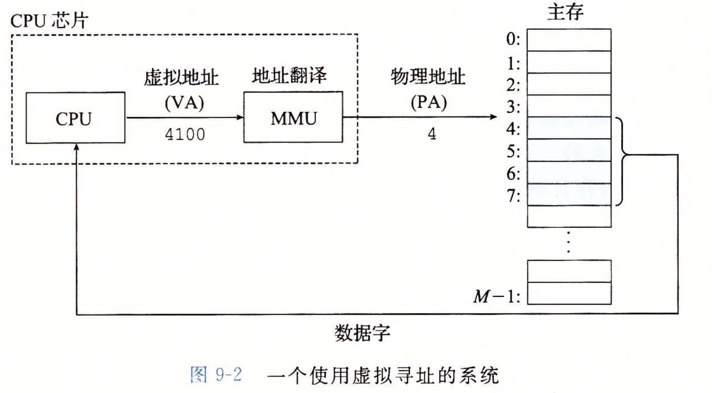

使用虚拟寻址，CPU通过生成一个虚拟地址（Virtual Address，VA）来访问主存，这个虚拟地址在被送到内存之前先转换成适当的物理地址。
将一个虚拟地址转换为物理地址的任务叫做地址翻译（address translation）。地址翻译需要CPU硬件和操作系统之间的紧密合作。CPU芯片上叫做内存管理单元（Memory Management Unit，MMU）的专用硬件，利用存放在主存中的查询表来动态翻译虚拟地址，该表的内容由操作系统管理。

# 地址空间

在一个带虚拟内存的系统中，CPU从一个有`N=2^n`个地址的地址空间中生成虚拟地址，这个地址空间称为虚拟地址。一个地址空间的大小是由表示最大地址所需要的位数来描述的。例如，一个包含`N=2^n`个地址的虚拟地址空间就叫做一个n位地址空间。

现代系统通常支持32位或者64位虚拟地址空间。

# 虚拟内存作为缓存的工具

概念上而言，虚拟内存被组织为一个由存放在磁盘上的N个连续的字节大小的单元组成的数组。每字节都有一个唯一的虚拟地址，作为到数组的索引。磁盘上数组的内容被缓存在主存中。

VM系统通过将虚拟内存分割为称为虚拟页（Virtual Page，VP）的大小固定的块来处理这个问题。每个虚拟页的大小为`P=2^p`字节。类似地，物理内存被分割为物理页（Physical Page，PP），大小也为P字节（物理页也被称为页帧（page frame））。

在任意时刻，虚拟页面的集合都分为三个不相交的子集：

-   未分配的：VM系统还未分配（或者创建）的页。未分配的块没有任何数据和它们相关联，因此也就不占用任何磁盘空间。
-   缓存的：当前已缓存在物理内存中的已分配页。
-   未缓存的：未缓存在物理内存中的已分配页。

图示例展示了一个有8个虚拟页的小虚拟内存。虚拟页0和3还没有被分配，因此在磁盘上还不存在。虚拟页1、4和6被缓存在物理内存中。页2、5和7已经被分配了，但是当前并未缓存在主存中。

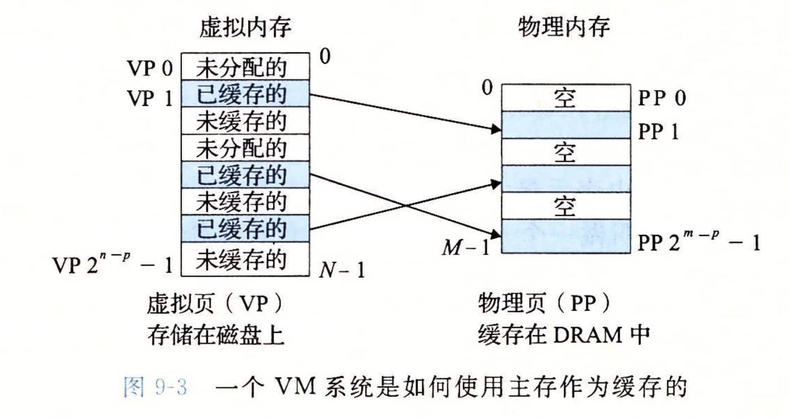

## DRAM缓存的组织结构

用术语DRAM缓存来表示虚拟内存系统的缓存，它在主存中缓存虚拟页。

## 页表

同任何缓存一样，虚拟内存系统必须有某种方法来判定一个虚拟页是否缓存在DRAM中的某个地方。如果是，系统还必须确定这个虚拟页存放在哪个物理页中。如果不命中，系统必须判断这个虚拟页存放在磁盘的哪个位置，在物理内存中选择一个牺牲页，并将虚拟页从磁盘复制到DRAM中，替换这个牺牲页。

这些功能是由软硬件联合提供的，包括操作系统软件、MMU（内存管理单元）中的地址翻译硬件和一个存放在物理内存中叫做页表（page table）的数据结构，页表将虚拟页映射到物理页。每次地址翻译译硬件将一个虚拟地址转换为物理地址时，都会读取页表。操作系统负责维护页表的内容，以及在磁盘与DRAM之间来回传送页。

PTE：页表条目

## 页命中

当CPU想要读包含在VP2中的虚拟内存的一个字时会发生什么？VP2被缓存在DRAM中。

地址翻译硬件将虚拟地址作为一个索引来定位PTE 2，并从内存中读取它。因为设置了有效位，那么地址翻译硬件就知道VP2是缓存在内存中的了。所以它使用PTE中的物理内存地址（该地址指向PP1中缓存页的起始位置），构造出这个字的物理地址。

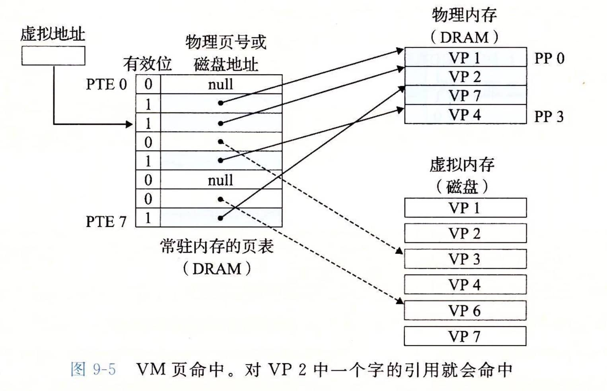

## 缺页

在虚拟内存的习惯说法中，DRAM缓存不命中称为缺页（page fault）。

CPU引用了VP3中的一个字，VP3并未缓存在DRAM中。地址翻译硬件从内存中读取PTE3，从有效位推断出VP3未被缓存，并且触发一个缺页异常。缺页异常调用内核中的缺页异常处理程序，该程序会选择一个牺性页，在此例中就是存放在PP3中的VP4。如果VP4已经被修改了，那么内核就会将它复制回磁盘。无论哪种情况，内核都会修改VP4的页表条目，反映出VP4不再缓存在主存中这一事实。

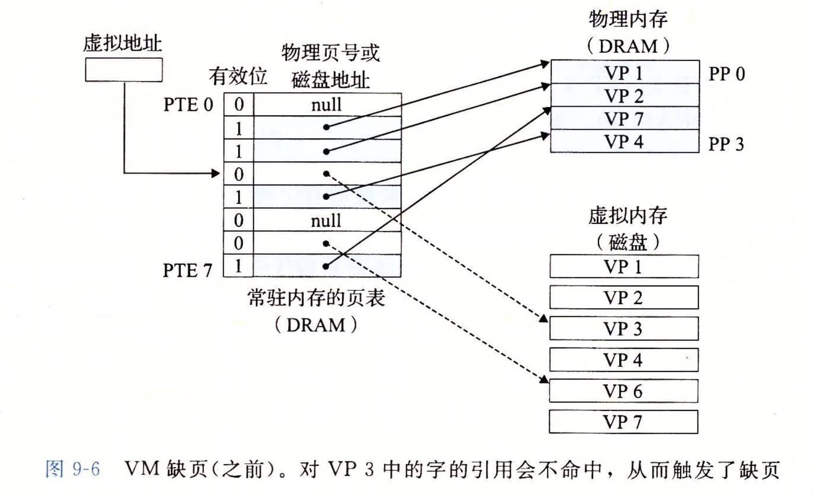

接下来，内核从磁盘复制VP3到内存中的PP3，更新PTE3，随后返回。当异常处理程序返回时，它会重新启动导致缺页的指令，该指令会把导致缺页的虚拟地址重发送到地址翻译硬件。但是现在，VP3已经缓存在主存中了，那么页命中也能由地址翻译硬件正常处理了。

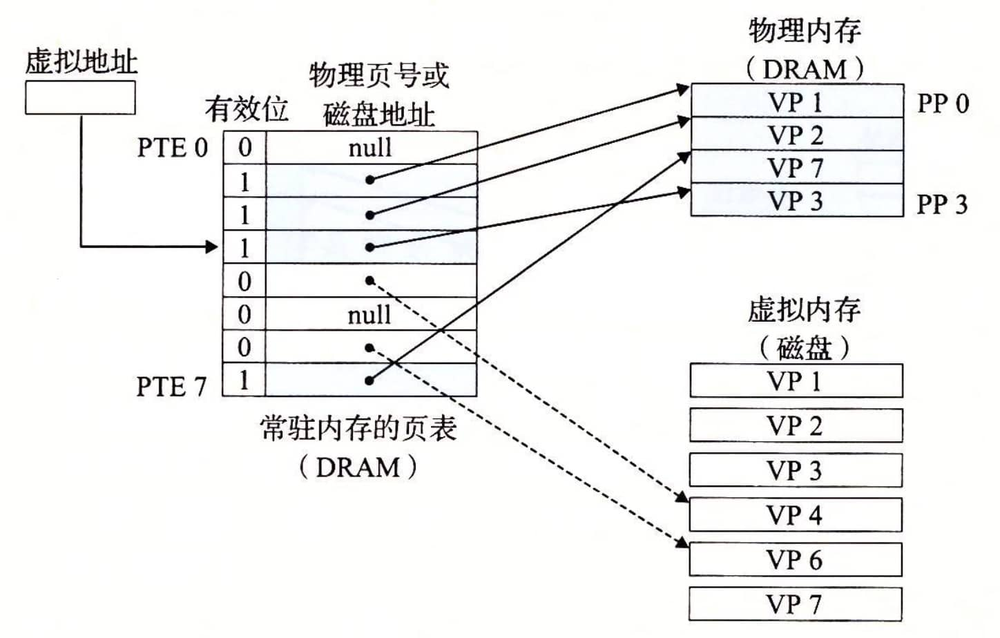

>   虚拟内存是在20世纪60年代早期发明的，远在CPU-内存之间差距的加大引发产生SRAM缓存之前。因此，虚拟内存系统使用了和SRAM缓存不同的术语，即使它们的许多概念是相似的。
>
>   在虚拟内存的习惯说法中，块被称为页。在磁盘和内存之间传送页的活动叫做交换（swapping）或者页面调度（paging）。

# 虚拟内存作为内存管理的工具

略

# 虚拟内存作为内存保护的工具

任何现代计算机系统必须为操作系统提供手段来控制对内存系统的访问。不应该允许一个用户进程修改它的只读代码段。而且也不应该允许它读或修改任何内核中的代码和数据结构。不应该允许它读或者写其他进程的私有内存，并且不允许它修改任何与其他进程共享的虚拟页面，除非所有的共享者都显式地允许它这么做（通过调用明确的进程间通信系统调用）。

就像我们所看到的，提供独立的地址空间使得区分不同进程的私有内存变得容易。但是，地址翻译机制可以以一种自然的方式扩展到提供更好的访问控制。因为每次CPU生成一个地址时，地址翻译硬件都会读一个PTE，所以通过在PTE上添加一些额外的许可位来控制对一个虚拟页面内容的访问十分简单。

# 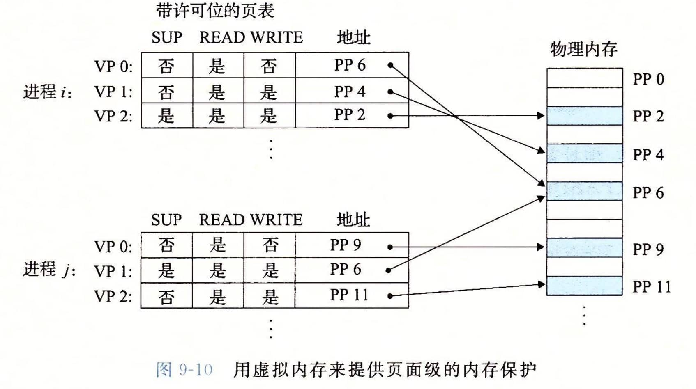地址翻译

略

# 案例研究：Linux内存系统

## Linux虚拟内存系统

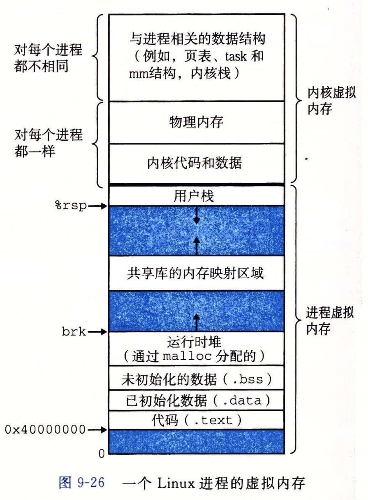

内核虚拟内存包含内核中的代码和数据结构。内核虚拟内存的某些区域被映射到所有进程共享的物理页面。例如，每个进程共享内核的代码和全局数据结构。

内核虚拟内存的其他区域包含每个进程都不相同的数据。比如说，页表、内核在进程的上下文中执行代码时使用的栈，以及记录虚拟地址空间当前组织的各种数据结构。

### Linux虚拟内存区域

Linux将虚拟内存组织成一些区域（也叫做段）的集合。一个区域（area）就是已经存在着的（已分配的）虚拟内存的连续片（chunk），这些页是以某种方式相关联的。例如，代码段、数据段、堆、共享库段，以及用户栈都是不同的区域。每个存在的虚拟页面都保存在某个区域中，而不属于某个区域的虚拟页是不存在的，并且不能被进程引用。
区域的概念很重要，因为它允许虚拟地址空间有间隙。内核不用记录那些不存在的虚拟页，而这样的页也不占用内存、磁盘或者内核本身中的任何额外资源。

### Linux缺页异常处理

假设MMU在试試图翻译某个虚拟地址A时，触发了一个缺页。这个异常导致控制转移到内核的缺页处理程序，处理程序随后就执行下面的步骤：

1.   虚拟地址A是合法的吗？换句话说，A在某个区域结构定义的区域内吗？为了回答这个问题，缺页处理程序搜索区域结构的链表，把A和每个区域结构中的vm_start和vm_end做比较。如果这个指令是不合法的，那么缺页处理程序就触发一个段错误，从而终止这个进程。
     因为一个进程可以创建任意数量的新虚拟内存区域（mmap函数），所以顺序搜索区域结构的链表花销可能会很大。因此在实际中，Linux在链表中构建了一棵树，并在这棵树上进行查找。
2.   试图进行的内存访问是否合法？换句话说，进程是否有读、写或者执行这个区域内页面的权限？
3.   此刻，内核知道了这个缺页是由于对合法的虚拟地址进行合法的操作造成的。
     它是这样来处理这个缺页的：选择一个牺牲页面，如果这个牺牲页面被修改过，那么就将它交换出去，换入新的页面并更新页表。当缺页处理程序返回时，CPU重新启动引起缺页的指令，这条指令将再次发送A到MMU。这次，MMU就能正常地翻译A，而不会再产生缺页中断了。

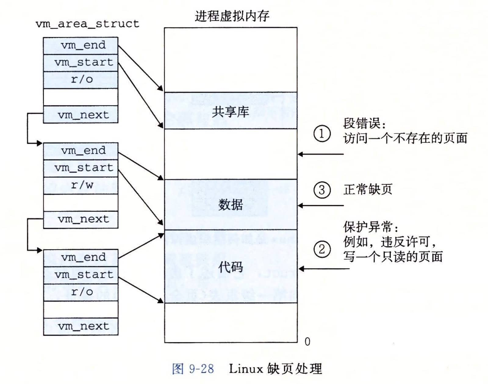

# 内存映射

Linux通过将一个虚拟内存区域与一个磁盘上的对象（object）关联起来，以初始化这个虚拟内存区域的内容，这个过程称为内存映射（memorymapping）。虚拟内存区域可以映射到两种类型的对象中的一种：

1.   Linux文件系统中的普通文件：一个区域可以映射到一个普通磁盘文件的连续部分，例如一个可执行目标文件。
     文件区（section）被分成页大小的片，每一片包含一个虚拟页面的初始内容。因为按需进行页面调度，所以这些虚拟页面没有实际交换进人物理内存，直到CPU第一次引用到页面（即发射一个虚拟地址，落在地址空间这个页面的范围之内）。如果区域比文件区要大，那么就用零来填充这个区域的余下部分。
2.   匿名文件：一个区域也可以映射到一个匿名文件，匿名文件是由内核创建的，包含的全是二进制零。

无论在哪种情况中，一旦一个虚拟页面被初始化了，它就在一个由内核维护的专门的交換文件（swap file）之间换来换去。交换文件也叫做交換空间（swap space）或者交换区域（swap area）。需要意识到的很重要的一点是，在任何时刻，交换空间都限制着当前运行着的进程能够分配的虚拟页面的总数。

## 再看共享对象

进程这一抽象能够为每个进程提供自己私有的虚拟地址空间，可以免受其他进程的错误读写。不过，许多进程有同样的只读代码区域。内存映射给我们提供了一种清晰的机制，用来控制多个进程如何共享对象。

一个对象可以被映射到虚拟内存的一个区域，要么作为共享对象，要么作为私有对象。
如果一个进程将一个共享对象映射到它的虚拟似地址空间的一个区域内，那么这个进程对这个区域的任何写操作，对于那些也把这个共享对象映射到它们虚拟内存的其他进程而言，也是可见的。而且，这些变化也会反映在磁盘上的原始对象中。
另一方面，对于一个映射到私有对象的区域做的改变，对于其他进程来说是不可见的，并且进程对这个区域所做的任何写操作都不会反映在磁盘上的对象中。

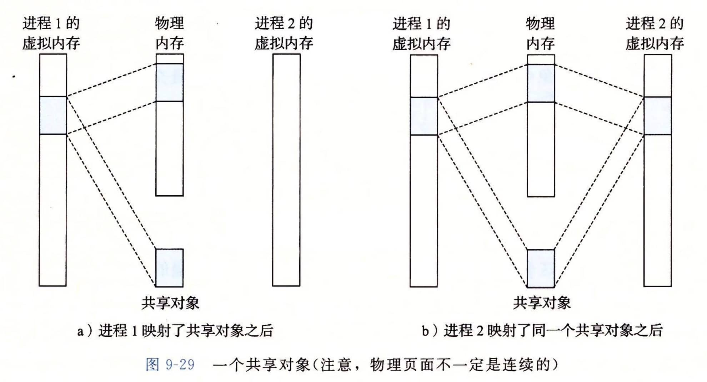

私有对象使用一种叫做写时复制（copy-on-write）的巧妙技术被映射到虚拟内存中。一个私有对象开始生命周期的方式基本上与共享对象的一样，在物理内存中只保存有私有对象的一份副本。比如，图a展示了一种情况，其中两个进程将一个私有对象映射到它们虚拟内存的不同区域，但是共享这个对象同一个物理副本。对于每个映射私有对象的进程，相应私有区域的页表条目都被标记为只读，并且区域结构被标记为私有的写时复制。只要没有进程试图写它自己的私有区域，它们就可以继续共享物理内存中对象的一个单独副本。然而，只要有一个进程试图写私有区域内的某个页面，那么这个写操作就会触发一个保护故障。

当故障处理程序注意到保护异常是由于进程试图写私有的写时复制区域中的一个页面而引起的，它就会在物理内存中创建这个页面的一个新副本，更新页表条目指向这个新的副本，然后恢复这个页面的可写权限，如图b所示。当故障处理程序返回时，CPU重新执行这个写操作，现在在新创建的页面上这个写操作就可以正常执行了。

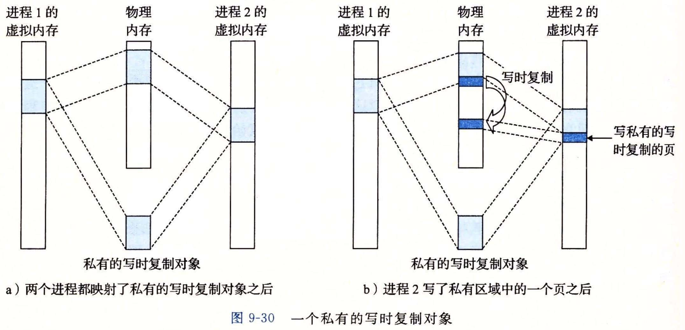

## 再看fork函数

当fork函数被当前进程调用时，内核为新进程创建各种数据结构，并分配给它一个唯一的PID。为了给这个新进程创建虚拟内存，它创建了当前进程的mm_struct、区域结构和页表的原样副本。它将两个进程中的每个页面都标记为只读，并将两个进程中的每个区域结构都标记为私有的写时复制。

当fork在新进程中返回时，新进程现在的虚拟内存刚好和调用fork时存在的虚拟内存相同。当这两个进程中的任一个后来进行写操作时，写时复制机制就会创建新页面，

因此，也就为每个进程保持了私有地址空间的抽象概念。

## 使用mmap函数的用户级内存映射

Linux进程可以使用mmap函数来创建新的虚拟内存区域，并将对象映射到这些区域中。

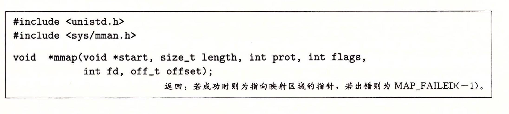

mmap函数要求内核创建一个新的虚拟内存区域，最好是从地址start开始的一个区域，并将文件描述符fd指定的对象的一个连续的片（chunk）映射到这个新的区域。连续的对象片大小为length字节，从距文件开始处偏移量为offset字节的地方开始。start地址仅仅是一个暗示，通常被定义为NULL。为了我们的目的，我们总是假设起始地址为
NULL。图9-32描述了这些参数的意义。
length（#）
start
length（#）
（或由内核选
定的地址）
offset
（字节）
文件描述符fd指定
的磁盘文件
进程虚拟内存
图9-32
mmap参数的可视化解释
参数prot包含描述新映射的虚拟内存区域的访问权限位（即在相应区域结构中的vm_
prot位）。
●PROT_EXEC：这个区域内的页面由可以被CPU执行的指令组成。
●PROT_READ：这个区域内的页面可读。
●PROT_WRITE：这个区域内的页面可写。
●PROT_NONE;这个区域内的页面不能被访问。
参数flags由描述被映射对象类型的位组成。如果设置了MAP_ANON标记位，那
么被映射的对象就是一个匿名对象，而相应的虚拟页面是请求二进制零的。MAP_PRI-
VATE表示被映射的对象是一个私有的、写时复制的对象，而MAP_SHARED表示是一
个共享对象。例如
bufp=Mmap（NULL，size，PROT_READ，MAP_PRIVATE|MAP_ANON，0，0）;
%3D
让内核创建一个新的包含size字节的只读、私有、请求二进制零的虚拟内存区域。
如果调用成功，那么bufp包含新区域的地址。
munmap函数删除虚拟内存的区域：
#include<unistd。h>
#include<sys/mman。h>
intmunmap（void*start，size_tlength）;
返回：若成功则为0，若出错则为-1。
munmap函数删除从虚拟地址start开始的，由接下来length字节组成的区域。接
下：
删除
引用会
：错误。
练习题9。5编写一个C程序mmapcopy。c，使用mmap将一个任意大小的磁盘文件复
制到stdout。输入文件的名字必须作为一个命令行参数来传递。

Page623
第9章虛拟內存
587
9。9动态内存分配
虽然可以使用低级的mmap和munmap函数来创建和删除虚拟内存的区域，但是C程
序员还是会觉得当运行时需要额外虚拟内存时，用动态内存分配器（dynamicmemoryallo-
cator）更方便，也有更好的可移植性。
动态内存分配器维护着一个进程的虚拟内存区
域，称为堆（heap）（见图9-33）。系统之间细节不同，
但是不失通用性，假设堆是一个请求二进制零的区
域，它紧接在未初始化的数据区域后开始，并向上生
长（向更高的地址）。对于每个进程，内核维护着一个
变量brk（读做“break”），它指向堆的顶部。
分配器将堆视为一组不同大小的块（block）的集合
来维护。每个块就是一个连续的虚拟内存片（chunk），
用户栈
共享库的内存映射区域
堆向上生长
←堆顶
（brk指针）
要么是已分配的，要么是空闲的。已分配的块显式地
堆
保留为供应用程序使用。空闲块可用来分配。空闲块
保持空闲，直到它显式地被应用所分配。一个已分配
的块保持已分配状态，直到它被释放，这种释放要么
是应用程序显式执行的，要么是内存分配器自身隐式
未初始化的数据（。bss）
已初始化的数据（。data）
代码（。text）
执行的。
分配器有两种基本风格。两种风格都要求应用显
式地分配块。它们的不同之处在于由哪个实体来负责
释放已分配的块。
●显式分配器（explicitallocator），要求应用显式地释放任何已分配的块。例如，C标
准库提供一种叫做nalloc程序包的显式分配器。C程序通过调用malloc函数来
分配一个块，并通过调用free函数来释放一个块。C++中的new和delete操作
符与C中的malloc和free相当。
图9-33堆
●隐式分配器（implicitallocator），另一方面，要求分配器检测一个已分配块何时不再
被程序所使用，那么就释放这个块。隐式分配器也叫做垃圾收集器（garbagecollec-
tor），而自动释放未使用的已分配的块的过程叫做垃圾收集（garbagecollection）。
例如，诸如Lisp、ML以及Java之类的高级语言就依赖垃圾收集来释放已分配
的块。
本节剩下的部分讨论的是显式分配器的设计和实现。我们将在9。10节中讨论隐式分
配器。为了更具体，我们的讨论集中于管理堆内存的分配器。然而，应该明白内存分配是
一个普遍的概念，可以出现在各种上下文中。例如，图形处理密集的应用程序就经常使用
标准分配器来要求获得一大块虚拟内存，然后使用与应用相关的分配器来管理内存，在该
块中创建和销毁图形的节点。
9。9。1
malloc和free函数
C标准库提供了ー个称为malloc程序包的显式分配器。程序通过调用malloc函数
来从堆中分配块。

Page624
588
第二部分在系统上运行程序
#include<stdlib。h>
void*malloc（size_tsize）;
返回：若成功则为已分配块的指针，若出错则为NULL。
malloc函数返回一个指针，指向大小为至少size字节的内存块，这个块会为可能包
含在这个块内的任何数据对象类型做对齐。实际中，对齐依赖于编译代码在32位模式
（gcc-m32）还是64位模式（默认的）中运行。在32位模式中，malloc返回的块的地址总
是8的倍数。在64位模式中，该地址总是16的倍数。
旁注一个字有多大
回想一下在第3章中我们对机器代码的讨论，Intel将4字节对象称为双字。然而，在
本节中，我们会假设字是4字节的对象，而双字是8字节的对象，这和传统术语是一
致的。
如果malloc遇到问题（例如，程序要求的内存块比可用的虚拟内存还要大），那么它
就返回NULL，并设置errno。malloc不初始化它返回的内存。那些想要已初始化的动
态内存的应用程序可以使用calloc，calloc是一个基于malloc的瘦包装函数，它将分
配的内存初始化为零。想要改变一个以前已分配块的大小，可以使用realloc函数。
动态内存分配器，例如malloc，可以通过使用mmap和munmap函数，显式地分配和
释放堆内存，或者还可以使用sbrk函数：
#include<unistd。h>
void*sbrk（intptr_tincr）;
返回：若成功则为旧的brk指针，若出错则为-1。
sbrk函数通过将内核的brk指针增加incr来扩展和收缩堆。如果成功，它就返回
brk的旧值，否则，它就返回一1，并将errno设置为ENOMEM。如果incr为零，那么
sbrk就返回brk的当前值。用一个为负的incr来调用sbrk是合法的，而且很巧妙，因
为返回值（brk的旧值）指向距新堆顶向上abs（incr）字节处。
程序是通过调用free函数来释放已分配的堆块。
#include<stdlib。h>
voidfree（void*ptr）;
返回：无。
ptr参数必须指向一个从mal1loc、calloc或者realloc获得的已分配块的起始位
置。如果不是，那么free的行为就是未定义的。更糟的是，既然它什么都不返回，free
就不会告诉应用出现了错误。就像我们将在9。11节里看到的，这会产生一些令人迷惑的
运行时错误。
图9-34展示了一个malloc和free的实现是如何管理一个C程序的16字的（非常）小
的堆的。每个方框代表了一个4字节的字。粗线标出的矩形对应于已分配块（有阴影的）和
空闲块（无阴影的）。初始时，堆是由一个大小为16个字的、双字对齐的、空闲块组成的。
（本节中，我们假设分配器返回的块是8字节双字边界对齐的。）

Page625
第9章虚拟內存
589
●图9-34a：程序请求一个4字的块。malloc的响应是：从空闲块的前部切出一个4
字的块，并返回一个指向这个块的第一字的指针。
●图9-34b：程序请求一个5字的块。
malloc的响应是：从空闲块的前部分
配一个6字的块。在本例中，malloc
在块里填充了一个额外的字，是为了
保持空闲块是双字边界对齐的。
●图9-34c：程序请求一个6字的块，而
malloc就从空闲块的前部切出一个6
p1
a）p1=malloc（4*sizeof（int））
p1
p2
b）p2
=malloc（5*sizeof（int））
p1
p2
p3
字的块。
●图9-34d：程序释放在图9-34b中分配
的那个6字的块。注意，在调用free
返回之后，指针p2仍然指向被释放了
的块。应用有责任在它被一个新的
malloc调用重新初始化之前，不再使
用p2。
c）p3
=malloc（6*sizeof（int））
p1
p2
p3
d）free（p2）
p1
p2p4
p3
●图9-34e：程序请求一个2字的块。在
这种情况中，malloc分配在前一步中
被释放了的块的一部分，并返回一个
指向这个新块的指针。
e）p4=malloc（2*sizeof（int））
用malloc和free分配和释放块。每个
方框对应于一个字。每个粗线标出的矩
形对应于一个块。阴影部分是已分配的
块。已分配的块的填充区域是深阴影的。
无阴影部分是空闲块。堆地址是从左往
右增加的
图9-34
9。9。2为什么要使用动态内存分配
程序使用动态内存分配的最重要的原因
是经常直到程序实际运行时，才知道某些数
据结构的大小。例如，假设要求我们编写一个C程序，它读一个n个ASCII码整数的链
表，每一行一个整数，从stdin到一个C数组。输入是由整数n和接下来要读和存储到
数组中的n个整数组成的。最简单的方法就是静态地定义这个数组，它的最大数组大小是
硬编码的：
1
#include"csapp。h"
2
#defineMAXN15213
3
4
intarray[MAXN];
5
6。
intmain（）
7
{
8
inti，n;
scanf（"%d"，&n）;
if（n>MAXN）
10
11
app_error（"Inputfileto0big"）;
for（i=0;i<n;i++）
scanf（"%d"，&array[i]）;
exit（0）;
12
13
14
15
16

Page626
590
第二部分在系统上运行程序
像这样用硬编码的大小来分配数组通常不是一种好想法。MAXN的值是任意的，与
机器上可用的虚拟内存的实际数量没有关系。而且，如果这个程序的使用者想读取一个比
MAXN大的文件，唯一的办法就是用一个更大的MAXN值来重新编译这个程序。虽然对
于这个简单的示例来说这不成问题，但是硬编码数组界限的出现对于拥有百万行代码和大
量使用者的大型软件产品而言，会变成一场维护的噩梦。
一种更好的方法是在运行时，在已知了n的值之后，动态地分配这个数组。使用这种
方法，数组大小的最大值就只由可用的虚拟内存数量来限制了。
1
#include"csapp。h"
2
intmain（）
4
{
5
int*array，i，n;
scanf（"%d"，&n）;
array=（int*）Malloc（n*sizeof（int））;
for（i=0;i<n;i++）
scanf（"%d"，&array[i]）;
free（array）;
exit（0）;
7
8
9。
10
11
12
13
动态内存分配是一种有用而重要的编程技术。然而，为了正确而高效地使用分配器，
程序员需要对它们是如何工作的有所了解。我们将在9。11节中讨论因为不正确地使用分
配器所导致的一些可怕的错误。
9。9。3分配器的要求和目标
显式分配器必须在一些相当严格的约束条件下工作：
●处理任意请求序列。一个应用可以有任意的分配请求和释放请求序列，只要满足约
束条件：每个释放请求必须对应于一个当前已分配块，这个块是由一个以前的分配
请求获得的。因此，分配器不可以假设分配和释放请求的顺序。例如，分配器不能
假设所有的分配请求都有相匹配的释放请求，或者有相匹配的分配和空闲请求是嵌
套的。
●立即响应请求。分配器必须立即响应分配请求。因此，不允许分配器为了提高性能
重新排列或者缓冲请求。
●只使用堆。为了使分配器是可扩展的，分配器使用的任何非标量数据结构都必须保
存在堆里。
●对齐块（对齐要求）。分配器必须对齐块，使得它们可以保存任何类型的数据对象。
●不修改已分配的块。分配器只能操作或者改变空闲块。特别是，一旦块被分配了，
就不允许修改或者移动它了。因此，诸如压缩已分配块这样的技术是不允许使
用的。
在这些限制条件下，分配器的编写者试图实现吞吐率最大化和内存使用率最大化，而
这两个性能目标通常是相互冲突的。
●目标1：最大化吞吐率。假定n个分配和释放请求的某种序列：
R，，R，*，R，。，R„-1

Page627
第9章虚拟內存
591
我们希望一个分配器的吞吐率最大化，吞吐率定义为每个单位时间里完成的请求
数。例如，如果一个分配器在1秒内完成500个分配请求和500个释放请求，那么
它的吞吐率就是每秒1000次操作。一般而言，我们可以通过使满足分配和释放请
求的平均时间最小化来使吞吐率最大化。正如我们会看到的，开发一个具有合理性
能的分配器并不困难，所谓合理性能是指一个分配请求的最糟运行时间与空闲块的
数量成线性关系，而一个释放请求的运行时间是个常数。
●目标2：最大化內存利用率。天真的程序员经常不正确地假设虚拟内存是一个无限
的资源。实际上，一个系统中被所有进程分配的虚拟内存的全部数量是受磁盘上交
换空间的数量限制的。好的程序员知道虚拟内存是一个有限的空间，必须高效地使
用。对于可能被要求分配和释放大块内存的动态内存分配器来说，尤其如此。
有很多方式来描述一个分配器使用堆的效率如何。在我们的经验中，最有用的标准是
峰值利用率（peakutilization）。像以前一样，我们给定n个分配和释放请求的某种顺序
Ro，R1，*，R4，，R„-1
如果一个应用程序请求一个p字节的块，那么得到的已分配块的有效載荷（payload）是p
字节。在请求R完成之后，聚集有效載荷（aggregatepayload）表示为P，为当前已分配的
块的有效载荷之和，而H。表示堆的当前的（单调非递减的）大小。
那么，前k十1个请求的峰值利用率，表示为U。，可以通过下式得到：
max;<P;
那么，分配器的目标就是在整个序列中使峰值利用率U，-1最大化。正如我们将要看到的，
在最大化吞吐率和最大化利用率之间是互相牵制的。特别是，以堆利用率为代价，很容易
编写出吞吐率最大化的分配器。分配器设计中一个有趣的挑战就是在两个目标之间找到一
个适当的平衡。
旁注放宽单调性假设
我们可以通过让H。成为前k十1个请求的最高峰，从而使得在我们对U。的定义中
放宽单调非递减的假设，并且允许堆增长和降低。
9。9。4碎片
造成堆利用率很低的主要原因是一种称为碎片（fragmentation）的现象，当虽然有未使
用的内存但不能用来满足分配请求时，就发生这种现象。有两种形式的碎片：内部碎片
（internalfragmentation）fl$☆A（externalfragmentation）。
內部碎片是在一个已分配块比有效载荷大时发生的。很多原因都可能造成这个问题。
例如，一个分配器的实现可能对已分配块强加一个最小的大小值，而这个大小要比某个请
求的有效载荷大。或者，就如我们在图9-34b中看到的，分配器可能增加块大小以满足对
齐约束条件。
内部碎片的量化是简单明了的。它就是已分配块大小和它们的有效载荷大小之差的
和。因此，在任意时刻，内部碎片的数量只取决于以前请求的模式和分配器的实现方式。
外部碎片是当空闲内存合计起来足够满足一个分配请求，但是没有一个单独的空闲块
足够大可以来处理这个请求时发生的。例如，如果图9-34e中的请求要求6个字，而不是
2个字，那么如果不向内核请求额外的虚拟内存就无法满足这个请求，即使在堆中仍然有

Page628
592
第二部分在系统上运行程序
6个空闲的字。问题的产生是由于这6个字是分在两个空闲块中的。
外部碎片比内部碎片的量化要困难得多，因为它不仅取决于以前请求的模式和分配器
的实现方式，还取决于将来请求的模式。例如，假设在k个请求之后，所有空闲块的大小
都恰好是4个字。这个堆会有外部碎片吗?答案取决于将来请求的模式。如果将来所有的
分配请求都要求小于或者等于4个字的块，那么就不会有外部碎片。另一方面，如果有一
个或者多个请求要求比4个字大的块，那么这个堆就会有外部碎片。
因为外部碎片难以量化且不可能预测，所以分配器通常采用启发式策略来试图维持少
量的大空闲块，而不是维持大量的小空闲块。
9。9。5实现问题
可以想象出的最简单的分配器会把堆组织成一个大的字节数组，还有一个指针p，初
始指向这个数组的第一个字节。为了分配size个字节，malloc将p的当前值保存在栈
里，将p增加size，并将p的旧日值返回到调用函数。free只是简单地返回到调用函数，
而不做其他任何事情。
这个简单的分配器是设计中的一种极端情况。因为每个malloc和free只执行很少
量的指令，吞吐率会极好。然而，因为分配器从不重复使用任何块，内存利用率将极差。
一个实际的分配器要在吞吐率和利用率之间把握好平衡，就必须考虑以下几个问题：
●空闲块组织：我们如何记录空闲块?
●放置：我们如何选择一个合适的空闲块来放置一个新分配的块?
●分割：在将一个新分配的块放置到某个空闲块之后，我们如何处理这个空闲块中的
剩余部分?
●合并：我们如何处理一个刚刚被释放的块?
本节剩下的部分将更详细地讨论这些问题。因为像放置、分割以及合并这样的基本技
术贯穿在许多不同的空闲块组织中，所以我们将在一种叫做隐式空闲链表的简单空闲块组
织结构中来介绍它们。
9。9。6隐式空闲链表
任何实际的分配器都需要一些数据结构，允许它来区别块边界，以及区别已分配块和
空闲块。大多数分配器将这些信息嵌人块本身。一个简单的方法如图9-35所示。
31
头部
3210
malloc返回一个指针，
它指向有效载荷的开始处
a=1：已分配的
a=0：空闲的
块大小
00a
块大小包括头部、
有效载荷
（只包括已分配的块）
有效载荷和所有的填充
填充（可选）
图9-35一个简单的堆块的格式
在这种情况中，一个块是由一个字的头部、有效载荷，以及可能的一些额外的填充组
成的。头部编码了这个块的大小（包括头部和所有的填充），以及这个块是已分配的还是空

Page629
第9章虚拟內存
593
闲的。如果我们强加一个双字的对齐约束条件，那么块大小就总是8的倍数，且块大小的
最低3位总是零。因此，我们只需要内存大小的29个高位，释放剩余的3位来编码其他
信息。在这种情况中，我们用其中的最低位（已分配位）来指明这个块是已分配的还是空闲
的。例如，假设我们有一个已分配的块，大小为24（Ox18）字节。那么它的头部将是
Ox00000018|Ox1=0x00000019
类似地，一个块大小为40（0x28）字节的空闲块有如下的头部：
Ox00000028|Ox0=0x00000028
头部后面就是应用调用malloc时请求的有效载荷。有效载荷后面是一片不使用的填
充块，其大小可以是任意的。需要填充有很多原因。比如，填充可能是分配器策略的一部
分，用来对付外部碎片。或者也需要用它来满足对齐要求。
假设块的格式如图9-35所示，我们可以将堆组织为一个连续的已分配块和空闲块的
序列，如图9-36所示。
未使用的
堆的
起始
位置
：双字
0/1
对齐的
8/0
16/1
32/0
16/1
图9-36用隐式空闲链表来组织堆。阴影部分是已分配块。没有阴影的部分是空闲块。
头部标记为（大小（字节）/已分配位）
我们称这种结构为隐式空闲链表，是因为空闲块是通过头部中的大小字段隐含地连接着
的。分配器可以通过遍历堆中所有的块，从而间接地遍历整个空闲块的集合。注意，我们需要
某种特殊标记的结束块，在这个示例中，就是一个设置了已分配位而大小为零的终止头部（ter-
minatingheader）。（就像我们将在9。9。12节中看到的，设置已分配位简化了空闲块的合并。）
隐式空闲链表的优点是简单。显著的缺点是任何操作的开销，例如放置分配的块，要
求对空闲链表进行搜索，该搜索所需时间与堆中已分配块和空闲块的总数呈线性关系。
很重要的一点就是意识到系统对齐要求和分配器对块格式的选择会对分配器上的最小
块大小有强制的要求。没有已分配块或者空闲块可以比这个最小值还小。例如，如果我们
假设一个双字的对齐要求，那么每个块的大小都必须是双字（8字节）的倍数。因此，图9-
35中的块格式就导致最小的块大小为两个字：一个字作头，另一个字维持对齐要求。即
使应用只请求一字节，分配器也仍然需要创建一个两字的块。
练习题9。6确定下面malloc请求序列产生的块大小和头部值。假设：1）分配器保
持双字对齐，并且使用块格式如图9-35中所示的隐式空闲链表。2）块大小向上舍入
为最接近的8字节的倍数。
请求
块大小（十进制字节）
块头部（十六进制）
malloc（1）
malloc（5）
malloc（12）
malloc（13）
9。9。7放置已分配的块
当一个应用请求一个k字节的块时，分配器搜索空闲链表，查找一个足够大可以放置

Page630
594
第二部分在系统上运行程序
所请求块的空闲块。分配器执行这种搜索的方式是由放置策略（placementpolicy）确定的。
一些常见的策略是首次适配（firstfit）、下一次适配（nextfit）和最佳适配（bestfit）。
首次适配从头开始搜索空闲链表，选择第一个合适的空闲块。下一次适配和首次适配
很相似，只不过不是从链表的起始处开始每次搜索，而是从上一次查询结束的地方开始。
最佳适配检查每个空闲块，选择适合所需请求大小的最小空闲块。
首次适配的优点是它趋向于将大的空闲块保留在链表的后面。缺点是它趋向于在靠近
链表起始处留下小空闲块的“碎片”，这就增加了对较大块的搜索时间。下一次适配是由
DonaldKnuth作为首次适配的一种代替品最早提出的，源于这样一个想法：如果我们上
一次在某个空闲块里已经发现了一个匹配，那么很可能下一次我们也能在这个剩余块中发
现匹配。下一次适配比首次适配运行起来明显要快一些，尤其是当链表的前面布满了许多
小的碎片时。然而，一些研究表明，下一次适配的内存利用率要比首次适配低得多。研究
还表明最佳适配比首次适配和下一次适配的内存利用率都要高一些。然而，在简单空闲链
表组织结构中，比如隐式空闲链表中，使用最佳适配的缺点是它要求对堆进行彻底的搜
索。在后面，我们将看到更加精细复杂的分离式空闲链表组织，它接近于最佳适配策略，
不需要进行彻底的堆搜索。
9。9。8分割空闲块
一旦分配器找到一个匹配的空闲块，它就必须做另一个策略决定，那就是分配这个空
闲块中多少空间。一个选择是用整个空闲块。虽然这种方式简单而快捷，但是主要的缺点
就是它会造成内部碎片。如果放置策略趋向于产生好的匹配，那么额外的内部碎片也是可
以接受的。
然而，如果匹配不太好，那么分配器通常会选择将这个空闲块分割为两部分。第一部
分变成分配块，而剩下的变成一个新的空闲块。图9-37展示了分配器如何分割图9-36中
8个字的空闲块，来满足一个应用的对堆内存3个字的请求。
未使用的
堆的
起始
位置
双字
0/1
对齐的
8/0
16/1
16/1
16/0
16/1
分割一个空闲块，以满足一个3个字的分配请求。阴影部分是已分配块。
没有阴影的部分是空闲块。头部标记为（大小（字节）/已分配位）
图9-37
9。9。9获取额外的堆内存
如果分配器不能为请求块找到合适的空闲块将发生什么呢?一个选择是通过合并那些在
内存中物理上相邻的空闲块来创建一些更大的空闲块（在下一节中描述）。然而，如果这样还
是不能生成一个足够大的块，或者如果空闲块已经最大程度地合并了，那么分配器就会通过
调用sbrk函数，向内核请求额外的堆内存。分配器将额外的内存转化成一个大的空闲块，
将这个块插入到空闲链表中，然后将被请求的块放置在这个新的空闲块中。
9。9。10合并空闲块
当分配器释放一个已分配块时，可能有其他空闲块与这个新释放的空闲块相邻。这些
邻接的空闲块可能引起一种现象，叫做假碎片（faultfragmentation），就是有许多可用的

Page631
第9章虛拟內存
595
空闲块被切割成为小的、无法使用的空闲块。比如，图9-38展示了释放图9-37中分配的
块后得到的结果。结果是两个相邻的空闲块，每一个的有效载荷都为3个字。因此，接下
来一个对4字有效载荷的请求就会失败，即使两个空闲块的合计大小足够大，可以满足这
个请求。
未使用的，
堆的
双字
0/1
对齐的
8/0
16/1
16/0
16/0
16/1
起始
位置
图9-38假碎片的示例。阴影部分是已分配块。没有阴影的部分是空闲块。
头部标记为（大小（字节）/已分配位）
为了解决假碎片问题，任何实际的分配器都必须合并相邻的空闲块，这个过程称为合
并（coalescing）。这就出现了一个重要的策略决定，那就是何时执行合并。分配器可以选
择立即合并（immediatecoalescing），也就是在每次一个块被释放时，就合并所有的相邻
块。或者它也可以选择推迟合并（deferredcoalescing），也就是等到某个稍晚的时候再合并
空闲块。例如，分配器可以推迟合并，直到某个分配请求失败，然后扫描整个堆，合并所
有的空闲块。
立即合并很简单明了，可以在常数时间内执行完成，但是对于某些请求模式，这种方
式会产生一种形式的抖动，块会反复地合并，然后马上分割。例如，在图9-38中，反复
地分配和释放一个3个字的块将产生大量不必要的分割和合并。在对分配器的讨论中，我
们会假设使用立即合并，但是你应该了解，快速的分配器通常会选择某种形式的推迟
合并。
9。9。11带边界标记的合并
分配器是如何实现合并的?让我们称想要释放的块为当前块。那么，合并（内存中的）
下一个空闲块很简单而且高效。当前块的头部指向下一个块的头部，可以检查这个指针以
判断下一个块是否是空闲的。如果是，就将它的大小简单地加到当前块头部的大小上，这
两个块在常数时间内被合并。
但是我们该如何合并前面的块呢?给定一个带头部的隐式空闲链表，唯一的选择将是
搜索整个链表，记住前面块的位置，直到我们到达当前块。使用隐式空闲链表，这意味着
每次调用free需要的时间都与堆的大小成线性关系。即使使用更复杂精细的空闲链表组
织，搜索时间也不会是常数。
Knuth提出了一种聪明而通用的技术，叫做
边界标记（boundarytag），允许在常数时间内进行
对前面块的合并。这种思想，如图9-39所示，是
在每个块的结尾处添加一个脚部（footer，边界标
记），其中脚部就是头部的一个副本。如果每个块
包括这样一个脚部，那么分配器就可以通过检查
它的脚部，判断前面一个块的起始位置和状态，
这个脚部总是在距当前块开始位置一个字的距离。
考虑当分配器释放当前块时所有可能存在的
31
3210
a=001：已分配的
a=000：空闲的
块大小
a/f|头部
有效载荷
（只包括已分配的块）
填充（可选）
块大小
a/f
脚部
情况：
图9-39
使用边界标记的堆块的格式

Page632
596
第二部分在系统上运行程序
1）前面的块和后面的块都是已分配的。
2）前面的块是已分配的，后面的块是空闲的。
3）前面的块是空闲的，而后面的块是已分配的。
4）前面的和后面的块都是空闲的。
图9-40展示了我们如何对这四种情况进行合并。
m1
a
m1
a
m1
a
m1
a
m1
a
m1
m1
m1
a
a
f
a
n+m2
f
a
f
a
m2
a
m2
a
m2
f
m2
a
m2
a
m2
f
n+m2
f
情况1
情况2
m1
f
n+m1
f
m1
f
n+m1+m2
m1
f
m1
f
a
in
a
a
n+m1
f
a
m2
a
m2
a
m2
m2
a
m2
a
m2
n+m1+m2
f
情况3
情况4
图9-40使用边界标记的合并（情况1：前面的和后面块都已分配。情况2：前面块已分配，后面
块空闲。情况3：前面块空闲，后面块已分配。情况4：后面块和前面块都空闲）
在情况1中，两个邻接的块都是已分配的，因此不可能进行合并。所以当前块的状态
只是简单地从已分配变成空闲。在情况2中，当前块与后面的块合并。用当前块和后面块
的大小的和来更新当前块的头部和后面块的脚部。在情况3中，前面的块和当前块合并。
用两个块大小的和来更新前面块的头部和当前块的脚部。在情况4中，要合并所有的三个
块形成一个单独的空闲块，用三个块大小的和来更新前面块的头部和后面块的脚部。在每
种情况中，合并都是在常数时间内完成的。
边界标记的概念是简单优雅的，它对许多不同类型的分配器和空闲链表组织都是通用
的。然而，它也存在一个潜在的缺陷。它要求每个块都保持一个头部和一个脚部，在应用
程序操作许多个小块时，会产生显著的内存开销。例如，如果一个图形应用通过反复调用
malloc和free来动态地创建和销毁图形节点，并且每个图形节点都只要求两个内存字，
那么头部和脚部将占用每个已分配块的一半的空间。
幸运的是，有一种非常聪明的边界标记的优化方法，能够使得在已分配块中不再需要
脚部。回想一下，当我们试图在内存中合并当前块以及前面的块和后面的块时，只有在前
面的块是空闲时，才会需要用到它的脚部。如果我们把前面块的已分配/空闲位存放在当
前块中多出来的低位中，那么已分配的块就不需要脚部了，这样我们就可以将这个多出来
的空间用作有效载荷了。不过请注意，空闲块仍然需要脚部。
练习题9。7确定下面每种对齐要求和块格式的组合的最小的块大小。假设：隐式空
闲链表，不允许有效载荷为零，头部和脚部存放在4字节的字中。

Page633
第9章虚拟內存
597
对齐要求
已分配的块
空闲块
最小块大小（字节）
单字
头部和脚部
头部和脚部
单字
头部，但是无脚部
头部和脚部
双字
头部和脚部
头部和脚部
双字
头部，但是没有脚部
头部和脚部
9。9。12综合：实现一个简单的分配器
构造一个分配器是一件富有挑战性的任务。设计空间很大，有多种块格式、空闲链表
格式，以及放置、分割和合并策略可供选择。另一个挑战就是你经常被迫在类型系统的安
全和熟悉的限定之外编程，依赖于容易出错的指针强制类型转换和指针运算，这些操作都
属于典型的低层系统编程。
虽然分配器不需要大量的代码，但是它们也还是细微而不可忽视的。熟悉诸如
C++或者Java之类高级语言的学生通常在他们第一次遇到这种类型的编程时，会遭遇
一个概念上的障碍。为了帮助你清除这个障碍，我们将基于隐式空闲链表，使用立即边
界标记合并方式，从头至尾地讲述一个简单分配器的实现。最大的块大小为232=4GB。
代码是64位干净的，即代码能不加修改地运行在32位（gcc-m32）或64位（gcc-m64）的
进程中。
1。通用分配器设计
我们的分配器使用如图9-41所示的memlib。c包所提供的一个内存系统模型。模型的
目的在于允许我们在不干涉已存在的系统层malloc包的情况下，运行分配器。
mem_init函数将对于堆来说可用的虚拟内存模型化为一个大的、双字对齐的字节
数组。在mem_heap和mem_brk之间的字节表示已分配的虚拟内存。mem_brk之后的字
节表示未分配的虚拟内存。分配器通过调用mem_sbrk函数来请求额外的堆内存，这个
函数和系统的sbrk函数的接口相同，而且语义也相同，除了它会拒绝收缩堆的请求。
分配器包含在一个源文件中（mm。c），用户可以编译和链接这个源文件到他们的应用之
中。分配器输出三个函数到应用程序：
externintmminit（void）;
externvoid*mm_malloc（size_tsize）;
1
2
3
externvoidmm_free（void*ptr）;
mm_init函数初始化分配器，如果成功就返回0，否则就返回-1。mm_malloc和mm
free函数与它们对应的系统函数有相同的接口和语义。分配器使用如图9-39所示的块格
式。最小块的大小为16字节。空闲链表组织成为一个隐式空闲链表，具有如图9-42所示
的恒定形式。
第一个字是一个双字边界对齐的不使用的填充字。填充后面紧跟着一个特殊的序言块
（prologueblock），这是一个8字节的已分配块，只由一个头部和一个脚部组成。序言块
是在初始化时创建的，并且永不释放。在序言块后紧跟的是零个或者多个由malloc或者
free调用创建的普通块。堆总是以一个特殊的结尾块（epilogueblock）来结束，这个块是
一个大小为零的已分配块，只由一个头部组成。序言块和结尾块是一种消除合并时边界条
件的技巧。分配器使用一个单独
言块。（作为一个小优化，我们可以让它指向下一个块，而不是这个序言块。）
有（stat：
全局变量（heap_listp），它』

Page634
598
第二部分在系统上运行程序
code/vm/malloc/memlib。c
/*Privateglobalvariables*/
staticchar*mem_heap;
staticchar*mem_brk;
1
/*Pointstofirstbyteofheap*/
/*Pointstolastbyteofheapplus1*/
2
4
staticchar*mem_max_addr;/*Maxlegalheapaddrplus1*/
/*
*mem_init
*/
7
Initializethememorysystemmodel
8
9。
voidmem_init（void）
10
{
（char*）Malloc（MAX_HEAP）;
mem_heap
mem_brk=（char*）mem_heap;
mem_max_addr=（char*）（mem_heap+MAX_HEAP）;
}
11
12
13
14
15
16
/*
*mem_sbrk
byincrbytesandreturnsthestartaddressofthenewarea。In
17
Simplemodelofthesbrkfunction。Extendstheheap
18
*
19
thismodel，theheapcannotbeshrunk。
20
*/
void*mem_sbrk（intincr）
{
21
22
23
char*old_brk=mem_brk;
24
25
if（（incr<0）||（（mem_brk+incr）>mem_max_addr））{
errno=ENOMEM;
fprintf（stderr，"ERROR：mem_sbrkfailed。Ranoutofmemory。。。\n"）;
return（void*）-1;
}
26
27
28
29
30
mem_brk+=incr;
return（void*）old_brk;
}
31
32
code/vm/malloc/memlib。c
图9-41
memlib。c：内存系统模型
序言块
普通块1
普通块2
普通块n
结尾块hdr
堆的
起始
位置
双字
0/1
：对齐的
8/18/1|hdr
ftr
hdr
ftr。hdr
ftr
staticchar*heap_listp
图9-42隐式空闲链表的恒定形式
2。操作空闲链表的基本常数和宏
图9-43展示了一些我们在分配器编码中将要使用的基本常数和宏。第2~4行定义了
一些基本的大小常数：字的大小（WSIZE）和双字的大小（DSIZE），初始空闲块的大小和扩
展堆时的默认大小（CHUNKSIZE）。
在空闲链表中操作头部和脚部可能是很麻烦的，因为它要求大量使用强制类型转换和指针
运算。因此，我们发现定义一小组宏来访问和遍历空闲链表是很有帮助的（第9~25行）。PACK
-------
-------

Page635
第9章虛拟內存
599
宏（第9行）将大小和已分配位结合起来并返回一个值，可以把它存放在头部或者脚部中。
code/vm/malloc/mm。c
1
/*Basicconstantsandmacros*/
/*Wordandheader/footersize（bytes）*/
/*Doublewordsize（bytes）*/
/*Extendheapbythisamount（bytes）*/
2
#defineWSIZE
4
3
#defineDSIZE
8
4
#defineCHUNKSIZE
（1<<12）
5
#defineMAX（x，y）（（x）>（y）?（x）：（y））
7
8
/*Packasizeandallocatedbitintoaword*/
#definePACK（size，alloc）
（（size）|（alloc））
10
/*Readandwriteawordataddressp*/
#defineGET（p）
#definePUT（p，val）
11
（*（unsignedint*）（p））
（*（unsignedint*）（p）
12
13
（val））
14
/*Readthesizeandallocatedfieldsfromaddressp*/
#defineGET_SIZE（p）
#defineGET_ALLOC（p）（GET（p）&Ox1）
15
16
（GET（p）&~0x7）
17
18
/*Givenblockptrbp，computeaddressofitsheaderandfooter*/
#defineHDRP（bp）
#defineFTRP（bp）
19
（（char*）（bp）
（（char*）（bp）+GET_SIZE（HDRP（bp））-DSIZE）
20
WSIZE）
21
22
/*Givenblockptrbp，computeaddressofnextandpreviousblocks*/
#defineNEXT_BLKP（bp）
#definePREV_BLKP（bp）
23
（（char*）（bp）+GET_SIZE（（（char*）（bp）
（（char*）（bp）
24
WSIZE）））
25
GET_SIZE（（（char*）（bp）
DSIZE）））
code/vm/malloc/mm。c
图9-43操作空闲链表的基本常数和宏
GET宏（第12行）读取和返回参数p引用的字。这里强制类型转换是至关重要的。参
数p典型地是一个（viod*）指针，不可以直接进行间接引用。类似地，PUT宏（第13行）
将val存放在参数p指向的字中。
GET_SIZE和GET_ALLOC宏（第16~17行）从地址p处的头部或者脚部分别返回大
小和已分配位。剩下的宏是对块指针（blockpointer，用bp表示）的操作，块指针指向第一
个有效载荷字节。给定一个块指针bp，HDRP和FTRP宏（第20~21行）分别返回指向这
个块的头部和脚部的指针。NEXT_BLKP和PREV_BLKP宏（第24~25行）分别返回指向
后面的块和前面的块的块指针。
可以用多种方式来编辑宏，以操作空闲链表。比如，给定一个指向当前块的指针bp，
我们可以使用下面的代码行来确定内存中后面的块的大小：
size_tsize=GET_SIZE（HDRP（NEXT_BLKP（bp）））;
3。创建初始空闲链表
在调用mm_malloc或者mm_free之前，应用必须通过调用mm_init函数来初始化堆
（见图9-44）。
mm_init函数从内存系统得到4个字，并将它们初始化，创建一个空的空闲链表（第4
~10行）。然后它调用extendheap函数（图9-45），这个函数将堆扩展CHUNKSIZE字

Page636
600
第二部分在系统上运行程序
节，并且创建初始的空闲块。此刻，分配器已初始化了，并且准备好接受来自应用的分配
和释放请求。
code/vm/malloc/mm。c
1
intmm_init（void）
2
{
3
/*Createtheinitialemptyheap*/
if（（heap_listp
=mem_sbrk（4*WSIZE））==（void*）-1）
4
5
return-1;
PUT（heap_listp，0）;
PUT（heap_listp+（1*WSIZE），PACK（DSIZE，1））;/*Prologueheader*/
PUT（heap_listp+（2*WSIZE），PACK（DSIZE，1））;/*Prologuefooter*/
PUT（heap_listp+（3*WSIZE），PACK（0，1））;
heap_listp+=（2*WSIZE）;
/*Alignmentpadding*/
7
8。
/*Epilogueheader*/
10
11
/*ExtendtheemptyheapwithafreeblockofCHUNKSIZEbytes*/
if（extend_heap（CHUNKSIZE/WSIZE）
12
13
NULL）
==
14
return-1;
15
return0;
16
}
code/vm/malloc/mm。c
图9-44
mm_init：创建带一个初始空闲块的堆
code/vm/malloc/mm。c
1
staticvoid*extend_heap（size_twords）
2
{
3
char*bp;
4
size_tsize;
5
/*Allocateanevennumberofwordstomaintainalignment*/
size=（words%2）?（words+1）*WSIZE：words*WSIZE;
if（（long）（bp
7
8
=mem_sbrk（size））
==-1）
9。
returnNULL;
10
/*Initializefreeblockheader/footerandtheepilogueheader*/
PUT（HDRP（bp），PACK（size，0））;
PUT（FTRP（bp），PACK（size，0））;
PUT（HDRP（NEXT_BLKP（bp）），PACK（0，1））;/*Newepilogueheader*/
11
12
/*Freeblockheader*/
13
/*Freeblockfooter*/
14
15
/*Coalesceifthepreviousblockwasfree*/
returncoalesce（bp）;
16
17
18
}
code/vm/malloc/mm。c
图9-45
extend_heap：用一个新的空闲块扩展堆
extendheap函数会在两种不同的环境中被调用：1）当堆被初始化时;2）当mm_mal-
loc不能找到一个合适的匹配块时。为了保持对齐，extend_heap将请求大小向上舍人为
最接近的2字（8字节）的倍数，然后向内存系统请求额外的堆空间（第7~9行）。
extend_heap函数的剩余部分（第12~17行）有点儿微妙。堆开始于一个双字对齐的
边界，并且每次对extend_heap的调用都返回-一个块，该块的大小是双字的整数倍。因
此，对mem_sbrk的每次调用都返回一个双字对齐的内存片，紧跟在结尾块的头部后面。
这个头部变成了新的空闲块的头部（第12行），并且这个片的最后一个字变成了新的结尾

Page637
第9章虚拟內存
601
块的头部（第14行）。最后，在很可能出现的前一个堆以一个空闲块结束的情况中，我们
调用coalesce函数来合并两个空闲块，并返回指向合并后的块的块指针（第17行）。
4。释放和合并块
应用通过调用mm_free函数（图9-46），来释放一个以前分配的块，这个函数释放所请求
的块（bp），然后使用9。9。11节中描述的边界标记合并技术将之与邻接的空闲块合并起来。
code/vm/malloc/mm。c
1
voidmm_free（void*bp）
2
{
3
size_tsize=GET_SIZE（HDRP（bp））;
4
PUT（HDRP（bp），PACK（size，0））;
PUT（FTRP（bp），PACK（size，0））;
coalesce（bp）;
5
7
8
}
9
staticvoid*coalesce（void*bp）
{
10
11
GET_ALLOC（FTRP（PREV_BLKP（bp）））;
GET_ALLOC（HDRP（NEXT_BLKP（bp）））;
12
size_tprev_alloc
%3D
13
size_tnext_alloc=
14
size_tsize=GET_SIZE（HDRP（bp））;
15
if（prev_alloc&&next_alloc）{
/*Case1*/
16
17
returnbp;
18
19
elseif（prev_alloc&&!next_alloc）{
size+=GET_SIZE（HDRP（NEXT_BLKP（bp）））;
PUT（HDRP（bp），PACK（size，0））;
PUT（FTRP（bp），PACK（size，0））;
20
/*Case2*/
21
22
23
24
}
25
elseif（!prev_alloc&&next_alloc）{
size+=GET_SIZE（HDRP（PREV_BLKP（bp）））;
PUT（FTRP（bp），PACK（size，0））;
PUT（HDRP（PREV_BLKP（bp）），PACK（size，0））;
PREV_BLKP（bp）;
26
/*Case3*/
27
28
29
bp
}
30
%3D
31
32
33
else{
/*Case4*/
size+=GET_SIZE（HDRP（PREV_BLKP（bp）））+
GET_SIZE（FTRP（NEXT_BLKP（bp）））;
PUT（HDRP（PREV_BLKP（bp）），PACK（size，0））;
PUT（FTRP（NEXT_BLKP（bp）），PACK（size，0））;
PREV_BLKP（bp）;
34
35
36
37
bp
}
38
39
40
returnbp;
41
}
code/vm/malloc/mm。c
图9-46
mm_free：释放一个块，并使用边界标记合并将之与所有的邻接空闲块在常数时间内合并

Page638
602
第二部分在系统上运行程序
coalesce函数中的代码是图9-40中勾画的四种情况的一种简单直接的实现。这里也
有一个微妙的方面。我们选择的空闲链表格式（它的序言块和结尾块总是标记为已分配）允
许我们忽略潜在的麻烦边界情况，也就是，请求块bp在堆的起始处或者是在堆的结尾处。
如果没有这些特殊块，代码将混乱得多，更加容易出错，并且更慢，因为我们将不得不在
每次释放请求时，都去检查这些并不常见的边界情况。
5。分配块
一个应用通过调用mm_malloc函数（见图9-47）来向内存请求大小为size字节的块。
在检查完请求的真假之后，分配器必须调整请求块的大小，从而为头部和脚部留有空间，
并满足双字对齐的要求。第12~13行强制了最小块大小是16字节：8字节用来满足对齐
要求，而另外8个用来放头部和脚部。对于超过8字节的请求（第15行），一般的规则是
加上开销字节，然后向上舍人到最接近的8的整数倍。
code/vm/malloc/mm。c
一
void*mm_malloc（size_tsize）
{
3
size_tasize;
/*Adjustedblocksize*/
size_textendsize;/*Amounttoextendheapifnofit*/
char*bp;
4
5
/*Ignorespuriousrequests*/
if（size==0）
8
returnNULL;
10
11
/*Adjustblocksizetoincludeoverheadandalignmentreqs。
12
if（size<=DSIZE）
13
asize=2*DSIZE;
14
else
15
asize=DSIZE*（（size+（DSIZE）+（DSIZE-1））/DSIZE）;
16
17
/*Searchthefreelistforafit*/
18
if（（bp
find_fit（asize））!=NULL）{
%3D
place（bp，asize）;
returnbp;
}
19
20
21
22
/*Nofitfound。Getmorememoryandplacetheblock*/
MAX（asize，CHUNKSIZE）;
extend_heap（extendsize/WSIZE））
23
24
extendsize=
25
if（（bp
==NULL）
%3D
26
returnNULL;
place（bp，asize）;
returnbp;
27
28
29
code/vm/malloc/mm。c
图9-47
mm_malloc：从空闲链表分配一个块
一旦分配器调整了请求的大小，它就会搜索空闲链表，寻找一个合适的空闲块（第18
行）。如果有合适的，那么分配器就放置这个请求块，并可选地分割出多余的部分（第19
行），然后返回新分配块的地址。

Page639
第9章虚拟內存
603
如果分配器不能够发现一个匹配的块，那么就用一个新的空闲块来扩展堆（第24~26
行），把请求块放置在这个新的空闲块里，可选地分割这个块（第27行），然后返回一个指
针，指向这个新分配的块。
练习题9。8为9。9。12节中描述的简单分配器实现一个find_fit函数。
staticvoid*find_fit（size_tasize）
你的解答应该对隐式空闲链表执行首次适配搜索。
练习题9。9为示例的分配器编写一个place函数。
staticvoidplace（void*bp，size_tasize）
你的解答应该将请求块放置在空网块的起始位置，只有当剩余部分的大小等于或
者超出最小块的大小时，才进行分割。
9。9。13显式空闲链表
隐式空闲链表为我们提供了一种介绍一些基本分配器概念的简单方法。然而，因为块
分配与堆块的总数呈线性关系，所以对于通用的分配器，隐式空闲链表是不适合的（尽管
对于堆块数量预先就知道是很小的特殊的分配器来说它是可以的）。
一种更好的方法是将空闲块组织为某种形式的显式数据结构。因为根据定义，程序不
需要一个空闲块的主体，所以实现这个数据结构的指针可以存放在这!
面。例如，堆可以组织成一个双向空闲链表，在每个空闲块中，都包含一个pred（前驱）
和succ（后继）指针，如图9-48所示。
闲块的主体
31
3210
31
3210
块大小
a/f|头部
块大小
a/f|头部
pred（祖先）
succ（后继）
有效载荷
原来的有效载荷
填充（可选）
填充（可选）
块大小
a/f|脚部
块大小
a/f|脚部
a）分配块
b）空闲块
图9-48使用双向空闲链表的堆块的格式
使用双向链表而不是隐式空闲链表，使首次适配的分配时间从块总数的线性时间减少
到了空闲块数量的线性时间。不过，释放一个块的时间可以是线性的，也可能是个常数，
这取决于我们所选择的空闲链表中块的排序策略。
一种方法是用后进先出（LIFO）的顺序维护链表，将新释放的块放置在链表的开始处。
使用LIFO的顺序和首次适配的放置策略，分配器会最先检查最近使用过的块。在这种情
况下，释放一个块可以在常数时间内完成。如果使用了边界标记，那么合并也可以在常数
时间内完成。
另一种方法是按照地址顺序来维护链表，其中链表中每个块的地址都小于它后继的地
址。在这种情况下，释放一个块需要线性时间的搜索来定位合适的前驱。平衡点在于，按

Page640
604
第二部分在系统上运行程序
照地址排序的首次适配比LIFO排序的首次适配有更高的内存利用率，接近最佳适配的利
用率。
一般而言，显式链表的缺点是空闲块必须足够大，以包含所有需要的指针，以及头部
和可能的脚部。这就导致了更大的最小块大小，也潜在地提高了内部碎片的程度。
9。9。14
分离的空闲链表
就像我们已经看到的，一个使用单向空闲块链表的分配器需要与空闲块数量呈线性关
系的时间来分配块。一种流行的减少分配时间的方法，通常称为分离存储（segregated
storage），就是维护多个空闲链表，其中每个链表中的块有大致相等的大小。一般的思路
是将所有可能的块大小分成一些等价类，也叫做大小类（sizeclass）。有很多种方式来定义
大小类。例如，我们可以根据2的幂来划分块大小：
{1}，{2}，{3，4}，{5~8}，。…，{1025~2048}，{2049~4096}，{4097~}
或者我们可以将小的块分派到它们自己的大小类里，而将大块按照2的幂分类：
{1}，{2}，{3}，…，{1023}，{1024}，{1025~2048}，{2049~4096}，{4097-0}
分配器维护着一个空闲链表数组，每个大小类一个空闲链表，按照大小的升序排列。
当分配器需要一个大小为n的块时，它就搜索相应的空闲链表。如果不能找到合适的块与
之匹配，它就搜索下一个链表，以此类推。
有关动态内存分配的文献描述了几十种分离存储方法，主要的区别在于它们如何定义
大小类，何时进行合并，何时向操作系统请求额外的堆内存，是否允许分割，等等。为了
使你大致了解有哪些可能性，我们会描述两种基本的方法：简单分离存储（simplesegrega-
tedstorage）fl（segregatedfit）。
1。简单分离存储
使用简单分离存储，每个大小类的空闲链表包含大小相等的块，每个块的大小就是这
个大小类中最大元素的大小。例如，如果某个大小类定义为{17~32}，那么这个类的空闲
链表全由大小为32的块组成。
为了分配一个给定大小的块，我们检查相应的空闲链表。如果链表非空，我们简单地
分配其中第一块的全部。空闲块是不会分割以满足分配请求的。如果链表为空，分配器就
向操作系统请求一个固定大小的额外内存片（通常是页大小的整数倍），将这个片分成大小
相等的块，并将这些块链接起来形成新的空闲链表。要释放一个块，分配器只要简单地将
这个块插入到相应的空闲链表的前部。
这种简单的方法有许多优点。分配和释放块都是很快的常数时间操作。而且，每个片
中都是大小相等的块，不分割，不合并，这意味着每个块只有很少的内存开销。由于每个
片只有大小相同的块，那么一个已分配块的大小就可以从它的地址中推断出来。因为没有
合并，所以已分配块的头部就不需要一个已分配/空闲标记。因此已分配块不需要头部，
同时因为没有合并，它们也不需要脚部。因为分配和释放操作都是在空闲链表的起始处操
作，所以链表只需要是单向的，而不用是双向的。关键点在于，在任何块中都需要的唯一
字段是每个空闲块中的一个字的succ指针，因此最小块大小就是一个字。
一个显著的缺点是，简单分离存储很容易造成内部和外部碎片。因为空闲块是不会被
分割的，所以可能会造成内部碎片。更糟的是，因为不会合并空闲块，所以某些引用模式
会引起极多的外部碎片（见练习题9。10）。
|练习题9。10描述一个在基于简单分离存储的分配器中会导致严重外部碎片的引用模式。
。。。

Page641
第9章虚拟內存
605
2。分离适配
使用这种方法，分配器维护着一个空闲链表的数组。每个空闲链表是和一个大小类相
关联的，并且被组织成某种类型的显式或隐式链表。每个链表包含潜在的大小不同的块，
这些块的大小是大小类的成员。有许多种不同的分离适配分配器。这里，我们描述了一种
简单的版本。
为了分配一个块，必须确定请求的大小类，并且对适当的空闲链表做首次适配，查找
一个合适的块。如果找到了一个，那么就（可选地）分割它，并将剩余的部分插人到适当的
空闲链表中。如果找不到合适的块，那么就搜索下一个更大的大小类的空闲链表。如此重
复，直到找到一个合适的块。如果空闲链表中没有合适的块，那么就向操作系统请求额外
的堆内存，从这个新的堆内存中分配出一个块，将剩余部分放置在适当的大小类中。要释
放一个块，我们执行合并，并将结果放置到相应的空闲链表中。
分离适配方法是一种常见的选择，C标准库中提供的GNUmalloc包就是采用的这种
方法，因为这种方法既快速，对内存的使用也很有效率。搜索时间减少了，因为搜索被限
制在堆的某个部分，而不是整个堆。内存利用率得到了改善，因为有一个有趣的事实：对
分离空闲链表的简单的首次适配搜索，其内存利用率近似于对整个堆的最佳适配搜索的内
存利用率。
3。伙伴系统
伙伴系统（buddysystem）是分离适配的一种特例，其中每个大小类都是2的幂。基本
的思路是假设一个堆的大小为2"个字，我们为每个块大小2*维护一个分离空闲链表，其
中0<k<m。请求块大小向上舍人到最接近的2的幂。最开始时，只有一个大小为2"个字
的空闲块。
为了分配一个大小为2"的块，我们找到第一个可用的、大小为2/的块，其中<j<m。
如果j一k，那么我们就完成了。否则，我们递归地二分割这个块，直到j=k。当我们进行这
样的分割时，每个剩下的半块（也叫做伙伴）被放置在相应的空闲链表中。要释放一个大小为
2*的块，我们继续合并空闲的伙伴。当遇到一个已分配的伙伴时，我们就停止合并。
关于伙伴系统的一个关键事实是，给定地址和块的大小，很容易计算出它的伙伴的地
址。例如，一个块，大小为32字节，地址为：
XXI**x00000
它的伙伴的地址为
XxX…x10000
换句话说，一个块的地址和它的伙伴的地址只有一位不相同。
伙伴系统分配器的主要优点是它的快速搜索和快速合并。主要缺点是要求块大小为2
的幂可能导致显著的內部碎片。因此，伙伴系统分配器不适合通用目的的工作负载。然
而，对于某些特定应用的工作负载，其中块大小预先知道是2的幂，伙伴系统分配器就很
有吸引力了。
9。10垃圾收集
在诸如Cmalloc包这样的显式分配器中，应用通过调用malloc和free来分配和释
放堆块。应用要负责释放所有不再需要的已分配块。
未能释放已分配的块是一种常见的编程错误。例如，考虑下面的C函数，作为处理的
一部分，它分配一块临时存储：

Page642
606
第二部分在系统上运行程序
voidgarbage（）
{
1
2
int*p=（int*）Malloc（15213）;
4
5
return;/*Arraypisgarbageatthispoint*/
6
因为程序不再需要p，所以在garbage返回前应该释放p。不幸的是，程序员忘了释
放这个块。它在程序的生命周期内都保持为已分配状态，毫无必要地占用着本来可以用来
满足后面分配请求的堆空间。
垃圾收集器（garbagecollector）是一种动态内存分配器，它自动释放程序不再需要的
已分配块。这些块被称为垃圾（garbage）（因此术语就称之为垃圾收集器）。自动回收堆存
储的过程叫做垃圾收集（garbagecollection）。在一个支持垃圾收集的系统中，应用显式分
配堆块，但是从不显示地释放它们。在C程序的上下文中，应用调用malloc，但是从不
调用free。反之，垃圾收集器定期识别垃圾块，并相应地调用free，将这些块放回到空
闲链表中。
垃圾收集可以追溯到JohnMcCarthy在20世纪60年代早期在MIT开发的Lisp系统。
它是诸如Java、ML、Perl和Mathematica等现代语言系统的一个重要部分，而且它仍然
是一个重要而活跃的研究领域。有关文献描述了大量的垃圾收集方法，其数量令人吃惊。
我们的讨论局限于McCarthy独创的Mark&。Sweep（标记&清除）算法，这个算法很有趣，
因为它可以建立在已存在的malloc包的基础之上，为C和C++程序提供垃圾收集。
9。10。1垃圾收集器的基本知识
垃圾收集器将内存视为一张有向可达图（reachabilitygraph），其形式如图9-49所示。
该图的节点被分成一组根节点（rootnode）和一组堆节点（heapnode）。每个堆节点对应于
堆中的一个已分配块。有向边p一→9意味着块p中的某个位置指向块g中的某个位置。根
节点对应于这样一种不在堆中的位置，它们中包含指向堆中的指针。这些位置可以是寄存
器、栈里的变量，或者是虚拟内存中读写数据区域内的全局变量。
根节点
堆节点
可达的
（）不可达的
（垃圾）
图9-49垃圾收集器将内存视为一张有向图
当存在一条从任意根节点出发并到达p的有向路径时，我们说节点p是可达的
（reachable）。在任何时刻，不可达节点对应于垃圾，是不能被应用再次使用的。垃圾收集
器的角色是维护可达图的某种表示，并通过释放不可达节点且将它们返回给空闲链表，来
定期地回收它们。
像ML和Java这样的语言的垃圾收集器，对应用如何创建和使用指针有很严格的控
制，能够维护可达图的一种精确的表示，因此也就能够回收所有垃圾。然而，诸如C和

Page643
第9章虚拟內存
607
C++这样的语言的收集器通常不能维持可达图的精确表示。这样的收集器也叫做保守的
垃圾收集器（conservativegarbagecollector）。从某种意义上来说它们是保守的，即每个可
达块都被正确地标记为可达了，而一些不可达节点却可能被错误地标记为可达。
收集器可以按需提供它们的服务，或者它们可以作为一个和应用并行的独立线程，不
断地更新可达图和回收垃圾。例如，考虑如何将一个C程序的保守的收集器加人到已存在
的malloc包中，如图9-50所示。
动态内存分配器
保守的垃圾
收集器
C应用程序
malloc（）
free（）
图9-50将一个保守的垃圾收集器加入到C的malloc包中
无论何时需要堆空间时，应用都会用通常的方式调用malloc。如果malloc找不到一
个合适的空闲块，那么它就调用垃圾收集器，希望能够回收一些垃圾到空闲链表。收集器
识别出垃圾块，并通过调用free函数将它们返回给堆。关键的思想是收集器代替应用去
调用free。当对收集器的调用返回时，malloc重试，试图发现一个合适的空闲块。如果
还是失败了，那么它就会向操作系统要求额外的内存。最后，mal1loc返回一个指向请求
块的指针（如果成功）或者返回一个空指针（如果不成功）。
9。10。2
Mark&Sweep垃圾收集器
Mark&Sweep垃圾收集器由标记（mark）阶段和清除（sweep）阶段组成，标记阶段标记
出根节点的所有可达的和已分配的后继，而后面的清除阶段释放每个未被标记的已分配
块。块头部中空闲的低位中的一位通常用来表示这个块是否被标记了。
我们对Mark&。Sweep的描述将假设使用下列函数，其中ptr定义为typedefvoid*ptr：
ptrisPtr（ptrp）。如果p指向一个已分配块中的某个字，那么就返回一个指向
这个块的起始位置的指针b。否则返回NULL。
●intblockMarked（ptrb）。如果块b是已标记的，那么就返回true。
●intblockAllocated（ptrb）。如果块b是已分配的，那么就返回true。
•voidmarkBlock（ptrb）。b。
intlength（b）。返回块b的以字为单位的长度（不包括头部）。
●voidunmarkBlock（ptrb）。将块b的状态由已标记的改为未标记的。
●ptrnextBlock（ptrb）。返回堆中块b的后继。
标记阶段为每个根节点调用一次图9-51a所示的mark函数。如果p不指向一个已分
配并且未标记的堆块，mark函数就立即返回。否则，它就标记这个块，并对块中的每个
字递归地调用它自己。每次对mark函数的调用都标记某个根节点的所有未标记并且可达
的后继节点。在标记阶段的末尾，任何未标记的已分配块都被认定为是不可达的，是垃
圾，可以在清除阶段回收。
清除阶段是对图9-51b所示的sweep函数的一次调用。sweep函数在堆中每个块上反
复循环，释
图9-52展示了一个小堆的Mark&Sweep的图形化解释。块边界用粗线条表示。每个方
块对应于内存中的一个字。每个块有一个字的头部，要么是已标记的，要么是未标记的。
斤遇到的所有未标记的
e（也

Page644
608
第二部分在系统上运行程序
voidmark（ptrp）{
if（（b
voidsweep（ptrb，ptrend）{
while（b<end）{
isPtr（p））
NULL）
==
if（blockMarked（b））
unmarkBlock（b）;
elseif（blockAllocated（b））
free（b）;
b=nextBlock（b）;
return;
if（blockMarked（b））
return;
markBlock（b）;
len=length（b）;
for（i=0;i<len;i++）
mark（b[i]）;
return;
return;
}
a）mark函数
b）Sweep函数
图9-51
mark和sweep函数的伪代码
根节点
1
2
4
标记前：
未标记的块头部
标记后：
已标记的块头部
清除后：
空闲的
空闲的
图9-52Mark&。Sweep示例。注意这个示例中的箭头表示内存引用，而不是空闲链表指针
初始情况下，图9-52中的堆由六个已分配块组成，其中每个块都是未分配的。第3
块包含一个指向第1块的指针。第4块包含指向第3块和第6块的指针。根指向第4块。
在标记阶段之后，第1块、第3块、第4块和第6块被做了标记，因为它们是从根节点可
达的。第2块和第5块是未标记的，因为它们是不可达的。在清除阶段之后，这两个不可
达块被回收到空闲链表。
9。10。3C程序的保守Mark&Sweep
Mark&。Sweep对C程序的垃圾收集是一种合适的方法，因为它可以就地工作，而不
需要移动任何块。然而，C语言为isPtr函数的实现造成了一些有趣的挑战。
第一，C不会用任何类型信息来标记内存位置。因此，对isPtr没有一种明显的方式
来判断它的输入参数p是不是一个指针。第二，即使我们知道p是一个指针，对isPtr也
没有明显的方式来判断p是否指向一个已分配块的有效载荷中的某个位置。
对后一问题的解决方法是将已分配块集合维护成一棵平衡二叉树，这棵树保持着这样一
个属性：左子树中的所有块都放在较小的地址处，而右子树中的所有块都放在较大的地址
处。如图9-53所示，这就要求每
个字段指向某个已分配块的头部。isPtr（ptrp）函数用树来执行对已分配块的二分查找。在
每一步中，它依赖于块头部中的大小字段来判断p是否落在这个块的范围之内。
两个附加字段（left和right）。

Page645
第9章虚拟內存
609
已分配块头部
Size
Left
Right
块剩余的部分
图9-53一棵已分配块的平衡树中的左右指针
平衡树方法保证会标记所有从根节点可达的节点，从这个意义上来说它是正确的。这
是一个必要的保证，因为应用程序的用户当然不会喜欢把他们的已分配块过早地返回给空
闲链表。然而，这种方法从某种意义上而言又是保守的，因为它可能不正确地标记实际上
不可达的块，因此它可能不会释放某些垃圾。虽然这并不影响应用程序的正确性，但是这
可能导致不必要的外部碎片。
C程序的Mark&Sweep收集器必须是保守的，其根本原因是C语言不会用类型信息
来标记内存位置。因此，像int或者float这样的标量可以伪装成指针。例如，假设某
个可达的已分配块在它的有效载荷中包含一个int，其值碰巧对应于某个其他已分配块b
的有效载荷中的一个地址。对收集器而言，是没有办法推断出这个数据实际上是int而不
是指针。因此，分配器必须保守地将块b标记为可达，尽管事实上它可能是不可达的。
9。11C程序中常见的与内存有关的错误
对C程序员来说，管理和使用虚拟内存可能是个困难的、容易出错的任务。与内存有
关的错误属于那些最令人惊恐的错误，因为它们在时间和空间上，经常在距错误源一段距
离之后才表现出来。将错误的数据写到错误的位置，你的程序可能在最终失败之前运行了
好几个小时，且使程序中止的位置距离错误的位置已经很远了。我们用一些常见的与内存
有关错误的讨论，来结束对虚拟内存的讨论。
9。11。1间接引用坏指针
正如我们在9。7。2节中学到的，在进程的虚拟地址空间中有较大的洞，没有映射到任何有
意义的数据。如果我们试图间接引用一个指向这些洞的指针，那么操作系统就会以段异常中止
程序。而且，虚拟内存的某些区域是只读的。试图写这些区域将会以保护异常中止这个程序。
间接引用坏指针的一个常见示例是经典的scanf错误。假设我们想要使用scanf从
stdin读一个整数到一个变量。正确的方法是传递给scanf一个格式串和变量的地址：
scanf（"%d"，&val）
然而，对于C程序员初学者而言（对有经验者也是如此!），很容易传递val的内容，而不
是它的地址：
scanf（"%d"，val）
在这种情况下，scanf将把val的内容解释为一个地址，并试图将一个字写到这个位置。
在最好的情况下，程序立即以异常终止。在最糟糕的情况下，val的内容对应于虚拟内存
的某个合法的读/写区域，于是我们就覆盖了这块内存，这通常会在相当长的一段时间以
后造成灾难性的、令人困惑的后果。
9。11。2读未初始化的内存
虽然bss内存位置（诸如未初始化的全局C变量）总是被加载器初始化为零，但是对于
堆内存却并不是这样的。一个常见的错误就是假设堆内存被初始化为零：

Page646
610
第二部分在系统上运行程序
1
/*Returny=Ax*/
int*matvec（int**A，int*x，intn）
3
{
4
inti，j;
5
6。
int*y=（int*）Malloc（n*sizeof（int））;
8
for（i=0;i<n;i++）
for（j=0;j<n;j++）
10
y[i]+=A[i][j]
x[j];
*
11
returny;
12
}
在这个示例中，程序员不正确地假设向量y
被初始化为零。正确的实现方式是显式地将
y[i]设置为零，或者使用calloc。
9。11。3允许栈缓冲区溢出
正如我们在3。10。3节中看到的，如果一个程序不检查输入串的大小就写入栈中的目
标缓冲区，那么这个程序就会有缓冲区溢出错误（bufferoverflowbug）。例如，下面的函
数就有缓冲区溢出错误，因为gets函数复制一个任意长度的串到缓冲区。为了纠正这个
错误，我们必须使用fgets函数，这个函数限制了输入串的大小：
1
voidbufoverflow（）
2
{
3
charbuf[64];
4
5
gets（buf）;/*Hereisthestackbufferoverflowbug*/
return;
7
9。11。4假设指针和它们指向的对象是相同大小的
一种常见的错误是假设指向对象的指针和它们所指向的对象是相同大小的：
1
/*Createannxmarray*/
int**makeArray1（intn，intm）
{
2
inti;
5
int**A=（int**）Malloc（n*sizeof（int））;
0;i<n;i++）
A[i]=（int*）Malloc（m*sizeof（int））;
7
for（i
%3D
8
returnA;
}
9。
10
这里的目的是创建一个由n个指针组成的数组，每个指针都指向一个包含m个int的数
组。然而，因为程序员在第5行将sizeof（int*）写成了sizeof（int），代码实际上创建
的是一个int的数组。
这段代码只有在int和指向int的指针大小相同的机器上运行良好。但是，如果我们
在像Corei7这样的机器上运行这段代码，其中指针大于int，那么第7行和第8行的循环将

Page647
第9章虚拟內存
611
写到超出A数组结尾的地方。因为这些字中的一个很可能是已分配块的边界标记脚部，所以
我们可能不会发现这个错误，直到在这个程序的后面很久释放这个块时，此时，分配器中的
合并代码会戏剧性地失败，而没有任何明显的原因。这是“在远处起作用（actionatdis-
tance）”的一个阴险的示例，这类“在远处起作用”是与内存有关的编程错误的典型情况。
9。11。5造成错位错误
错位（off-by-one）错误是另一种很常见的造成覆盖错误的来源：
1
/*Createannxmarray*/
int**makeArray2（intn，intm）
{
2
3
4
inti;
5
int**A=（int**）Malloc（n*sizeof（int*））;
for（i=0;i<=n;i++）
8
A[i]
（int*）Malloc（m*sizeof（int））;
%D
returnA;
10
这是前面一节中程序的另一个版本。这里我们在第5行创建了一个n个元素的指针数
组，但是随后在第7行和第8行试图初始化这个数组的n+1个元素，在这个过程中覆盖
了A数组后面的某个内存位置。
9。11。6引用指针，而不是它所指向的对象
如果不太注意C操作符的优先级和结合性，我们就会错误地操作指针，而不是指针所
指向的对象。比如，考虑下面的函数，其目的是删除一个有*size项的二叉堆里的第一
项，然后对剩下的*size-1项重新建堆：
int*binheapDelete（int**binheap，int*size）
{
一
2
int*packet
binheap[0];
3
4
binheap[0]
*size--;/*Thisshouldbe（*size）--*/
binheap[*size
1];
5
%3D
heapify（binheap，*size，0）;
return（packet）;
}
7
8
9。
在第6行，目的是减少size指针指向的整数的值。然而，因为一元运算符一-和*
的优先级相同，从右向左结合，所以第6行中的代码实际减少的是指针自己的值，而不是
它所指向的整数的值。如果幸运地话，程序会立即失败;但是更有可能发生的是，当程序
在执行过程后很久才产生出一个不正确的结果时，我们只有一头的雾水。这里的原则是当
你对优先级和结合性有疑问的时候，就使用括号。比如，在第6行，我们可以使用表达式
（*size）--，
清晰地表明我们的意图。
9。11。7误解指针运算
另一种常见的错误是忘记了指针的算术操作是以它们指向的对象的大小为单位来进行
的，而这种大小单位并不一定是字节。例如，下面函数的目的是扫描一个int的数组，并

Page648
612
第二部分在系统上运行程序
返回一个指针，指向val的首次出现：
1
int*search（int*p，intval）
2
{
while（*p&&*p!=val）
p+=sizeof（int）;/*Shouldbep++*/
4
returnp;
}
然而，因为每次循环时，第4行都把指针加了4（一个整数的字节数），函数就不正确地扫
描数组中每4个整数。
9。11。8引用不存在的变量
没有太多经验的C程序员不理解栈的规则，有时会引用不再合法的本地变量，如下列
所示：
一
int*stackref（）
{
intval;
4
return&val;
这个函数返回一个指针（比如说是p），指向栈里的一个局部变量，然后弹出它的栈
帧。尽管p仍然指向一个合法的内存地址，但是它已经不再指向一个合法的变量了。当以
后在程序中调用其他函数时，内存将重用它们的栈帧。再后来，如果程序分配某个值给
*p，那么它可能实际上正在修改另一个函数的栈帧中的一个条目，从而潜在地带来灾难性
的、令人困惑的后果。
9。11。9引用空闲堆块中的数据
一个相似的错误是引用已经被释放了的堆块中的数据。例如，考虑下面的示例，这个示例
在第6行分配了一个整数数组x，在第10行中先释放了块x，然后在第14行中又引用了它：
int*heapref（intn，intm）
{
1
3
inti;
int*x，*y;
6。
x=（int*）Malloc（n*sizeof（int））;
7
8
：//Othercallstomallocandfreegohere
9。
10
free（x）;
11
y=（int*）Malloc（m*sizeof（int））;
for（i=0;i<m;i++）
y[i]
12
13
14
=x[i]++;/*Oops!x[i]isawordinafreeblock*/
15
16
returny;
17
}

Page649
第9章虚拟內存
613
取决于在第6行和第10行发生的malloc和free的调用模式，当程序在第14行引用
x[i]时，数组x可能是某个其他已分配堆块的一部分了，因此其内容被重写了。和其他许
多与内存有关的错误一样，这个错误只会在程序执行的后面，当我们注意到y中的值被破
坏了时才会显现出来。
9。11。10引起内存泄漏
内存泄漏是缓慢、隐性的杀手，当程序员不小心忘记释放已分配块，而在堆里创建了
垃圾时，会发生这种问题。例如，下面的函数分配了一个堆块x，然后不释放它就返回：
1
voidleak（intn）
2
{
3
int*x=
（int*）Malloc（n*sizeof（int））;
4
5
return;
/*xisgarbageatthispoint*/
如果经常调用1eak，那么渐渐地，堆里就会充满了垃圾，最糟糕的情况下，会占用
整个虚拟地址空间。对于像守护进程和服务器这样的程序来说，内存泄漏是特别严重的，
根据定义这些程序是不会终止的。
9。12小结
虚拟内存是对主存的一个抽象。支持虚拟内存的处理器通过使用一种叫做虚拟寻址的间接形式来引
用主存。处理器产生一个虚拟地址，在被发送到主存之前，这个地址被翻译成一个物理地址。从虚拟地
址空间到物理地址空间的地址翻译要求硬件和软件紧密合作。专门的硬件通过使用页表来翻译虚拟地址，
而页表的内容是由操作系统提供的。
虚拟内存提供三个重要的功能。第一，它在主存中自动缓存最近使用的存放磁盘上的虚拟地址空间
的内容。虚拟内存缓存中的块叫做页。对磁盘上页的引用会触发缺页，缺页将控制转移到操作系统中的
一个缺页处理程序。缺页处理程序将页面从磁盘复制到主存缓存，如果必要，将写回被驱逐的页。第二，
虚拟内存简化了内存管理，进而又简化了链接、在进程间共享数据、进程的内存分配以及程序加载。最
后，虚拟内存通过在每条页表条目中加入保护位，从而了简化了内存保护。
地址翻译的过程必须和系统中所有的硬件缓存的操作集成在一起。大多数页表条目位于L1高速缓
存中，但是一个称为TLB的页表条目的片上高速缓存，通常会消除访问在L1上的页表条目的开销。
现代系统通过将虚拟内存片和磁盘上的文件片关联起来，来初始化虚拟内存片，这个过程称为内存
映射。内存映射为共享数据、创建新的进程以及加载程序提供了一种高效的机制。应用可以使用mamap函
数来手工地创建和删除虚拟地址空间的区域。然而，大多数程序依赖于动态内存分配器，例如malloc，
它管理虚拟地址空间区域内一个称为堆的区域。动态内存分配器是一个感觉像系统级程序的应用级程序，
它直接操作内存，而无需类型系统的很多帮助。分配器有两种类型。显式分配器要求应用显式地释放它
们的内存块。隐式分配器（垃圾收集器）自动释放任何未使用的和不可达的块。
对于C程序员来说，管理和使用虚拟内存是一件困难和容易出错的任务。常见的错误示例包括：间
接引用坏指针，读取未初始化的内存，允许栈缓冲区溢出，假设指针和它们指向的对象大小相同，引用
指针而不是它所指向的对象，误解指针运算，引用不存在的变量，以及引起内存泄漏。
参考文献说明
Kilburn和他的同事们发表了第一篇关于虚拟内存的描述[63]。体系结构教科书包括关于硬件在虚拟
内存中的角色的更多细节[46]。操作系统教科书包含关于操作系统统角色的更多信息[102，106，113]。
Bovet和Cesati[11]给出了Linux虚拟内存系统的详细描述。Intel公司提供了IA处理器上32位和64位

Page650
614
第二部分在系统上运行程序
地址翻译的详细文档[52]。
Knuth在1968年编写了有关内存分配的经典之作[64]。从那以后，在这个领域就有了大量的文献。
Wilson、Johnstone、Neely和Boles编写了一篇关于显式分配器的漂亮综述和性能评价的文章[118]。本
书中关于各种分配器策略的吞吐率和利用率的一般评价就引自于他们的调查。Jones和Lins提供了关于
垃圾收集的全面综述[56]。Kernighan和Ritchie[61]展示了一个简单分配器的完整代码，这个简单的分
配器是基于显式空闲链表的，每个空闲块中都有一个块大小和后继指针。这段代码使用联合（union）来消
除大量的复杂指针运算，这是很有趣的，但是代价是释放操作是线性时间（而不是常数时间）。DougLea
开发了广泛使用的开源malloc包，称为dlmalloc[67]。
家庭作业
在下面的一系列问题中，你要展示9。6。4节中的示例内存系统如何将虚拟地址翻译成物理地址，
以及如何访问缓存。对于给定的虚拟地址，请指出访问的TLB条目、物理地址，以及返回的缓存
字节值。请指明是否TLB不命中，是否发生了缺页，是否发生了缓存不命中。如果有缓存不命
中，对于“返回的缓存字节”用“-”来表示。如果有缺页，对于“PPN”用“-”来表示，而C部分和D
部分就空着。
虚拟地址：0x027c
*9。11
A。虚拟地址格式
13
121110
9。
8
7
6。
5
4
3
2
1
B。地址翻译
参数
值
VPN
TLB索引
TLB标记
TLB命中?（是/否）
缺页?（是/否）
PPN
C。物理地址格式
111098765
4
3
1
D。物理地址引引用
参数
值
字节偏移
缓存索引
缓存标记
缓存命中?（是/否）
返回的缓存字节
*9。12对于下面的地址，重复习题9。11：
虚拟地址：0x03a9
A。虚拟地址格式

