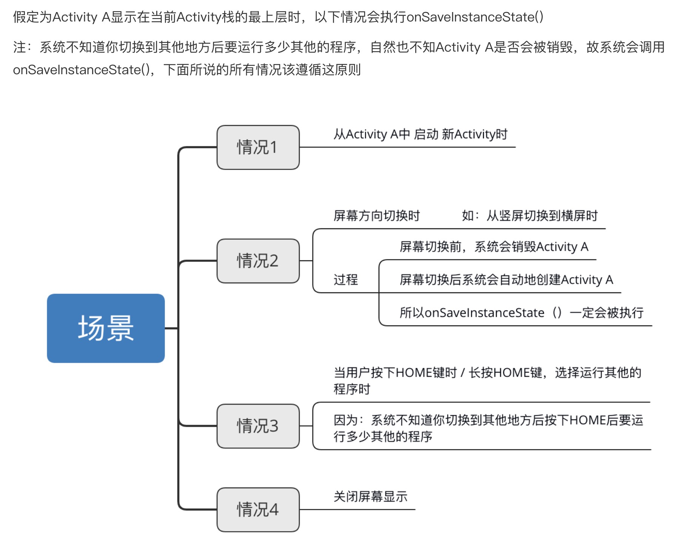

# 常见生命周期情况

## Main启动A

```
2023-04-23 22:39:13.744 32187-32187/? D/测试生命周期-Main: onCreate: 
2023-04-23 22:39:13.744 32187-32187/? D/测试生命周期-Main: onStart: 
2023-04-23 22:39:13.745 32187-32187/? D/测试生命周期-Main: onResume: 

2023-04-23 22:39:17.192 32187-32187/? D/测试生命周期-Main: onPause: 
2023-04-23 22:39:17.199 32187-32187/? D/测试生命周期-A: onCreate: 
2023-04-23 22:39:17.204 32187-32187/? D/测试生命周期-A: onStart: 
2023-04-23 22:39:17.204 32187-32187/? D/测试生命周期-A: onResume: 
2023-04-23 22:39:17.740 32187-32187/? D/测试生命周期-Main: onStop: 

2023-04-23 22:39:21.875 32187-32187/? D/测试生命周期-A: onPause: 
2023-04-23 22:39:21.883 32187-32187/? D/测试生命周期-Main: onRestart: 
2023-04-23 22:39:21.884 32187-32187/? D/测试生命周期-Main: onStart: 
2023-04-23 22:39:21.884 32187-32187/? D/测试生命周期-Main: onResume: 
2023-04-23 22:39:22.417 32187-32187/? D/测试生命周期-A: onStop: 
2023-04-23 22:39:22.418 32187-32187/? D/测试生命周期-A: onDestroy: 
```

Main启动A也会触发main的onSaveInstanceState

## 按Home键或者锁屏回到主屏

```
2023-04-23 22:48:11.673 32187-32187/? D/测试生命周期-Main: onCreate: 
2023-04-23 22:48:11.674 32187-32187/? D/测试生命周期-Main: onStart: 
2023-04-23 22:48:11.675 32187-32187/? D/测试生命周期-Main: onResume: 
// 按Home键或者锁屏
2023-04-23 22:48:14.231 32187-32187/? D/测试生命周期-Main: onPause: 
2023-04-23 22:48:14.250 32187-32187/? D/测试生命周期-Main: onStop: 
// 回到Activity
2023-04-23 22:48:29.358 32187-32187/? D/测试生命周期-Main: onRestart: 
2023-04-23 22:48:29.358 32187-32187/? D/测试生命周期-Main: onStart: 
2023-04-23 22:48:29.360 32187-32187/? D/测试生命周期-Main: onResume: 
```

## 启动dialog风格的activity

```xml
<activity
    android:name=".basic.activity.lifecycle.MyDialogActivity"
    android:theme="@style/Theme.AppCompat.Dialog" />
```

```java
protected void onCreate(Bundle savedInstanceState) {
    super.onCreate(savedInstanceState);

    getWindow().setLayout(500, 500);

    TextView textView = new TextView(this);
    textView.setLayoutParams(new ViewGroup.LayoutParams(300, 300));
    textView.setText("这是DialogActivity");
    setContentView(textView);
}
```

当`activity`中弹出`dialog`对话框的时候，`activity不会回调onPause`。

然而当`activity`启动`dialog风格的activity`的时候，此`activity会回调onPause函数`。

```
D/测试生命周期-Main: onCreate: 
D/测试生命周期-Main: onStart: 
D/测试生命周期-Main: onResume: 
D/测试生命周期-Main: onPause: 
// 启动DialogActivity
I/测试生命周期-DialogAct: onCreate: screenWidth = 1440, screenHeight = 3007
// 返回
D/测试生命周期-Main: onResume: 
```

可以认为，Activity未被完全覆盖只是失去焦点：onPause--->onResume

## 启动非全屏的Activity

```java
protected void onCreate(Bundle savedInstanceState) {
    super.onCreate(savedInstanceState);

    if (getIntent().getBooleanExtra("is_half_screen", false)) {
        getWindow().setLayout(500, 500);
    }

    // ...
}
```


```
D/测试生命周期-Main: onCreate: before
D/测试生命周期-Main: onCreate: 
D/测试生命周期-Main: onStart: 
D/测试生命周期-Main: onResume: before
D/测试生命周期-Main: onResume: 

// 启动半屏Activity

D/测试生命周期-Main: onPause: 
I/测试生命周期-DialogAct: onCreate: isHalfScreen = true
D/测试生命周期-Main: onStop: 
```

可以看到，风格是一般的Activity且window只有屏幕的一部分，但Main Activity还是会回调onStop。如图所示，虽然window只有屏幕的一部分，但是其余不是透明的，是黑的。

## 在onCreate中执行post

```kotlin
override fun onCreate(savedInstanceState: Bundle?) {
    Log.d(TAG, "onCreate: before")
    super.onCreate(savedInstanceState)
    Log.d(TAG, "onCreate: ")
    uiHandler.post { Log.i(TAG, "run: ") }
}

override fun onStart() {
    super.onStart()
    Log.d(TAG, "onStart: ")
}

override fun onResume() {
    Log.d(TAG, "onResume: before")
    super.onResume()
    Log.d(TAG, "onResume: ")
}
```

```
D/测试生命周期-Main: onCreate: before
D/测试生命周期-Main: onCreate: 
D/测试生命周期-Main: onStart: 
D/测试生命周期-Main: onResume: before
D/测试生命周期-Main: onResume: 
I/测试生命周期-Main: run: 
```

在onCreate中执行post，post的代码最终在onResume之后执行。

## 按home键

```
D/测试生命周期-Main: onCreate: before
D/测试生命周期-Main: onCreate: 
D/测试生命周期-Main: onStart: 
D/测试生命周期-Main: onResume: before
D/测试生命周期-Main: onResume: 
// 按home键
D/测试生命周期-Main: onPause: 
D/测试生命周期-Main: onStop: 
D/测试生命周期-Main: onSaveInstanceState: 
// 返回
D/测试生命周期-Main: onRestart: 
D/测试生命周期-Main: onStart: 
D/测试生命周期-Main: onResume: before
D/测试生命周期-Main: onResume: 
```

Activity运行时按下HOME键（跟被完全覆盖是一样的）。

## 旋转屏幕

```
I/测试生命周期-旋转屏幕: onCreate: begin
I/测试生命周期-旋转屏幕: onCreate: after
D/测试生命周期-旋转屏幕: onStart: begin
D/测试生命周期-旋转屏幕: onStart: after
D/测试生命周期-旋转屏幕: onResume: begin
D/测试生命周期-旋转屏幕: onResume: after

D/测试生命周期-旋转屏幕: onPause: begin
D/测试生命周期-旋转屏幕: onPause: after
D/测试生命周期-旋转屏幕: onStop: begin
D/测试生命周期-旋转屏幕: onStop: after
D/测试生命周期-旋转屏幕: onSaveInstanceState: begin
D/测试生命周期-旋转屏幕: onSaveInstanceState: after
D/测试生命周期-旋转屏幕: onDestroy: begin
D/测试生命周期-旋转屏幕: onDestroy: after
I/测试生命周期-旋转屏幕: onCreate: begin
I/测试生命周期-旋转屏幕: onCreate: after
D/测试生命周期-旋转屏幕: onStart: begin
D/测试生命周期-旋转屏幕: onStart: after
D/测试生命周期-旋转屏幕: onRestoreInstanceState: begin
D/测试生命周期-旋转屏幕: onRestoreInstanceState: after
D/测试生命周期-旋转屏幕: onResume: begin
D/测试生命周期-旋转屏幕: onResume: after
```


## 其它

-   当前Activity产生事件弹出Toast和AlertDialog的时候Activity的生命周期不会有改变。
-   Dialog不会影响生命周期，按home键也是显示正常的生命周期。PopupWindow也不会影响生命周期。
-   防止重新创建activity：`activity`指定`configChange`属性来不让系统重新创建`activity`。
    `android:configChanges = "orientation"`
-   Activity与menu创建先后顺序：在`activity`创建完回调`onResume`后创建`menu`，回调`onCreateOptionsMenu`

# setResult和finish的顺序关系

**情况1：**在AActivity中点击按钮以startActivityForResult的方式启动BActivity，在BActivity中点击按钮setResult并finish。

log：

```
//起始状态
onCreate: A
onResume: A
//点击按钮跳转到B
onPause: A
onCreate: B
onResume: B
onStop: A
//点击按钮返回A
onPause: B
onActivityResult: A
onRestart: A
onResume: A
onStop: B
onDestroy: B
```

可以看到onActivityResult是在 B Pause后立即回调。

**情况2：**由于某些原因不能在setResult()之后立刻调用finish()函数，只能通过用户按Back键自己退出到**A**。这个时候要注意设置setResult方法的时机。

```java
//AActivity.java
@Override
protected void onActivityResult(int requestCode, int resultCode, Intent data) {
    super.onActivityResult(requestCode, resultCode, data);
    if (resultCode == RESULT_OK) {
        Log.d(TAG, "onActivityResult: " + FLAG);
    }
}
```

```java
//BActivity.java
@Override
protected void onPause() {
//  setResult(RESULT_OK);
		super.onPause();
    Log.d(TAG, "onPause: " + FLAG);
//  setResult(RESULT_OK);
}
```

从情况1的log看，将setResult方法放在onPause中，可能可以。但是实际log显示，并没有设置成功，不管是放在super前还是后。

**从源码可以看出，Activity返回result是在被finish的时候，也就是说调用setResult()方法必须在finish()之前。**

**解决方法：**

1. 在onBackPressed中设置

   ```java
   @Override
   public void onBackPressed() {
       setResult(RESULT_OK);
       super.onBackPressed();
   }
   ```

2. 像情况1中那样显式调用finish方法

   ```java
   button.setOnClickListener(v -> {
   	setResult(RESULT_OK);
       finish();
   });
   ```

# 状态保存与恢复

如果系统由于系统约束（而不是正常的应用程序行为）而破坏了Activity，那么尽管实际 Activity实例已经消失，但是系统还是会记住它已经存在，这样如果用户导航回到它，系统会创建一个新的实例的Activity使用一组保存的数据来描述Activity在被销毁时的状态。系统用于恢复以前状态的已保存数据称为“实例状态”，是存储在Bundle对象中的键值对的集合。

**注意**
1、如果是用户自动按下返回键，或程序调用finish()退出程序，是不会触发onSaveInstanceState()和onRestoreInstanceState()的。
2、每次旋转屏幕时，Activity将被破坏并重新创建。当屏幕改变方向时，系统会破坏并重新创建前台Activity，因为屏幕配置已更改，Activity可能需要加载替代资源（例如布局）。即会执行onSaveInstanceState()和onRestoreInstanceState()。

默认情况下，系统使用Bundle实例状态来保存有关View中Activity布局每个对象的信息（例如输入到EditText对象中的文本值）。因此，如果Activity实例被销毁并重新创建，则布局状态会自动恢复到之前的状态。但是，Activity可能包含更多要恢复的状态信息，例如跟踪Activity中用户进度的成员变量。

为了让Activity添加额外的数据到已保存的实例状态，Activity生命周期中还有一个额外的回调方法onSaveInstanceState()，系统在用户离开Activity时调用它。当系统调用此方法时，它将传递Bundle将在您的Activity意外销毁的事件中保存的对象，以便您可以向其中添加其他信息。然后，如果系统在被销毁之后必须重新创建Activity实例，它会将相同的Bundle对象传递给您的Activity的onRestoreInstanceState()方法以及您的onCreate() 方法。

## 两个方法与生命周期的顺序

log：

```
//初始
onCreate: A
onStart: A
onResume: A
//旋转屏幕
onPause: A
onSaveInstanceState: A
onStop: A
onDestroy: A
onCreate: A
onStart: A
onRestoreInstanceState: A
onResume: A
//退出
onPause: A
onStop: A
onDestroy: A
```

## 保存状态onSaveInstanceState

当开始停止时，系统会调用，onSaveInstanceState()以便您的Activity可以使用一组键值对来保存状态信息。此方法的默认实现保存有关Activity视图层次结构状态的信息，例如EditText小部件中的文本或ListView的滚动位置。

为了保存Activity的附加状态信息，必须实现onSaveInstanceState()并向对象添加键值对Bundle。

### 具体调用场景



## 恢复状态onRestoreInstanceState

当系统“未经你许可”时，确实销毁了你的Activity，则重新启动时会被系统调用。

onCreate()和onRestoreInstanceState()都可以恢复状态。

onCreate()还可以表示正在创建一个Activity，所以在onCreate()中恢复数据**需要**判断Bundle是否为空。

onRestoreInstanceState()只有在存在保存状态的情况下才会恢复，因此**不需要**检查是否Bundle为空。

注意：onSaveInstanceState、onRestoreInstanceState不一定成对被调用

# onConfigurationChanged

参考：https://blog.csdn.net/qq_27570955/article/details/55046934

## 方法介绍

```java
public void onConfigurationChanged(Configuration newConfig)
```

newConfig：新的设备配置信息

当系统的配置信息发生改变时，系统会调用此方法。只有在配置文件AndroidManifest中处理了configChanges属性对应的设备配置，该方法才会被调用。如果发生设备配置与在配置文件中设置的不一致，则Activity会被销毁并使用新的配置重建。

>   测试时，targetSdkVersion为28。

例如：

当屏幕方向发生改变时，Activity会被销毁重建，如果在AndroidManifest文件中处理屏幕方向配置信息如下

```xml
 android:configChanges="orientation|screenSize"
```

则Activity不会被销毁重建，而是调用onConfigurationChanged方法。

```
I/测试生命周期-旋转屏幕: onCreate: begin
I/测试生命周期-旋转屏幕: onCreate: after
D/测试生命周期-旋转屏幕: onStart: begin
D/测试生命周期-旋转屏幕: onStart: after
D/测试生命周期-旋转屏幕: onResume: begin
D/测试生命周期-旋转屏幕: onResume: after

I/测试生命周期-旋转屏幕: onConfigurationChanged: begin
I/测试生命周期-旋转屏幕: onConfigurationChanged: after
```

如果configChanges只设置了orientation，则当其他设备配置信息改变时，Activity依然会销毁重建，且不会调用onConfigurationChanged。例如，在上面的配置的情况下，如果语言改变了，Acitivty就会销毁重建，且不会调用onConfigurationChanged方法。

## configChanges设置取值

**注意：横竖屏切换的属性是orientation。如果targetSdkVersion的值大于等于13，则如下配置才会回调onConfigurationChanged方法**

```
 android:configChanges="orientation|screenSize"
```

如果targetSdkVersion的值小于13，则只要配置

```
  android:configChanges="orientation"
```

# 在不同的生命周期中调用finish方法

**在onCreate方法中调用**

```
D/smzq: onCreate: 
D/smzq: onDestroy: 
```

**在onStart方法中调用**

```
D/smzq: onCreate: 
D/smzq: onStart: 
D/smzq: onStop: 
D/smzq: onDestroy: 
```

**在onResume方法中调用**

```
D/smzq: onCreate: 
D/smzq: onStart: 
D/smzq: onResume: 
D/smzq: onPause: 
D/smzq: onStop: 
D/smzq: onDestroy: 
```

**在onPause方法中调用**

```
D/smzq: onCreate: 
D/smzq: onStart: 
D/smzq: onResume: 
D/smzq: onPause: 
D/smzq: onStop: 
D/smzq: onDestroy: 
```

**在onStop方法中调用**

```
D/smzq: onCreate: 
D/smzq: onStart: 
D/smzq: onResume: 
D/smzq: onPause: 
D/smzq: onStop: 
D/smzq: onDestroy: 
```

**在onDestroy方法中调用**

```
D/smzq: onCreate: 
D/smzq: onStart: 
D/smzq: onResume: 
D/smzq: onPause: 
D/smzq: onStop: 
D/smzq: onDestroy: 
```

# Service生命周期

## startService

```java
public class TestLifecycleService extends Service {
    private static final String TAG = "TestLifecycleService";

    public TestLifecycleService() {
    }

    @Override
    public void onCreate() {
        super.onCreate();
        Log.d(TAG, "onCreate: " + Thread.currentThread());
    }

    @Override
    public int onStartCommand(Intent intent, int flags, int startId) {
        Log.d(TAG, "onStartCommand: " + Thread.currentThread());
        return super.onStartCommand(intent, flags, startId);
    }

    @Override
    public IBinder onBind(Intent intent) {
        Binder binder = new Binder() {
            @Override
            public String toString() {
                Log.d(TAG, "toString: " + Thread.currentThread());
                return super.toString();
            }
        };
        Log.d(TAG, "onBind: " + binder);
        return binder;
    }

    @Override
    public void onDestroy() {
        super.onDestroy();
        Log.d(TAG, "onDestroy: ");
    }
}
```

log：

```
// startService
D/TestLifecycleService: onCreate: Thread[main,5,main]
D/TestLifecycleService: onStartCommand: Thread[main,5,main]
// 再次startService
D/TestLifecycleService: onStartCommand: Thread[main,5,main]
// 再次startService
D/TestLifecycleService: onStartCommand: Thread[main,5,main]
// stopService
D/TestLifecycleService: onDestroy: 
// 再次stopService无日志
```

多次startService只会执行一次onCreate，而onStartCommand会多次执行。

调用stopService，生命周期执行onDestroy方法，并且多次调用stopService时，onDestroy只有第一次会被执行。

## bindService

**onBind返回值是null**

log：

```
//bindService
onCreate: 
onBind: 
//unbindService
onDestroy: 
```

1.   调用多次bindService，onCreate和onBind也只在第一次会被执行。
2.   unbindService方法只能调用一次，多次调用应用会抛出异常。

**onBind返回值是Binder类型**

log：

```
// bindService
31142-31142 D/TestLifecycleService: onCreate: Thread[main,5,main]
31142-31142 D/TestLifecycleService: onBind: android.os.Binder@a0b4b26
31142-31142 D/TestLifecycleService: onServiceConnected: android.os.Binder@a0b4b26
// unbindService
31142-31142 D/TestLifecycleService: onDestroy: 
```

1.   调用多次bindService，onCreate、onBind和onServiceConnected都只在第一次会被执行。
2.   调用unbindService结束服务和上面相同，unbindService只能调用一次，onDestroy也只执行一次，多次调用会抛出异常。
3.   Service return的Binder（普通的Binder）的地址与onServiceConnected中的service hashCode相同，说明是同一个对象。

当走跨进程通信时，Service的Binder与Client中的Binder的地址并不一样，并不是同一个对象。

startService和bindService开启服务时，他们与activity之间的关系。

1. startService开启服务以后，与activity就没有关联，不受影响，独立运行。
2. bindService开启服务以后，与activity存在关联，退出activity时必须调用unbindService方法，否则会报ServiceConnection泄漏的错误。

**同一个服务可以用两种方式一同开启，没有先后顺序的要求，MyService的onCreate只会执行一次。关闭服务需要stopService和unbindService都被调用，也没有先后顺序的影响，MyService的onDestroy也只执行一次。但是如果只用一种方式关闭服务，不论是哪种关闭方式，onDestroy都不会被执行，服务也不会被关闭。这一点需要注意。**

## 各方法运行的线程

Service中的各个生命周期回调都是在主线程，普通Binder内部的方法也是在主线程，跨进程通信的Binder内部的方法是在Binder线程池中运行。而ServiceConnection中的方法也是在主线程。

## IntentService

IntentService内部有个HandlerThread，可以执行耗时操作，只有onHandleIntent方法在子线程中运行。

