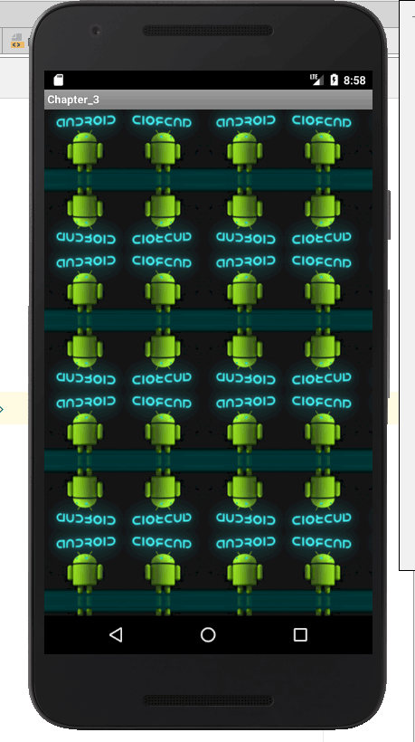
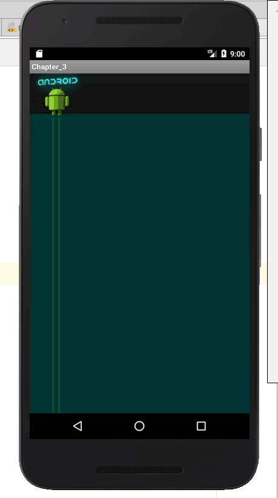
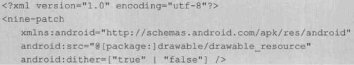
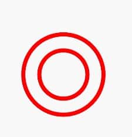
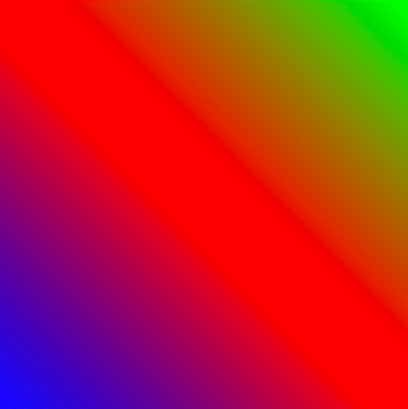
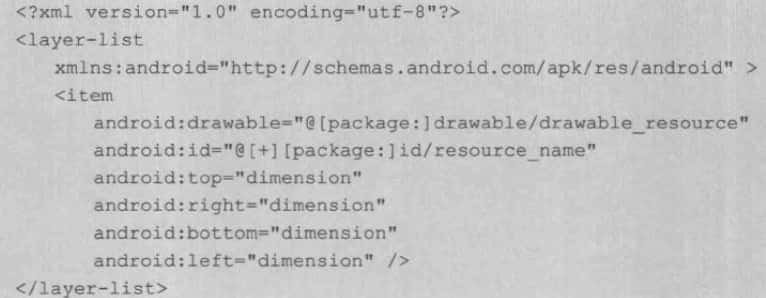
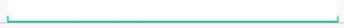

# 参考

《Android艺术探索》

# 简介

Drawable的优点：使用简单，比自定义View的成本低；其次，非图片类型的Drawable占用空间比较小，有利于减小apk大小。

Drawable可以用XML来定义，也可以用具体的代码来实现，只是稍微复杂点。

Drawable的内部宽/高这个参数比较重要，通过getIntrinsicWidth和getIntrinsicHeight这两个方法可以获取到它们。但是并不是所有的Drawable都有内部宽/高，比如一张图片所形成的Drawable，它的内部宽/高就是图片的宽/高，但是一个颜色所形成的Drawable，它就没有内部宽/高的概念。另外需要注意的是，Drawable的内部宽/高不等同于它的大小，一般来说，Drawable是没有大小概念的，当用作View的背景时，Drawable会被拉伸至View的同等大小。

# Drawable的分类

## BitmapDrawable

这几乎是最简单的Drawable了，在实际开发中可以直接使用原始图片，也可以用XML来描述。


- android:src 
  图片id

- android:antialias 
  抗锯齿。应该开启

- android:dither 
  当图片的像素配置和手机屏幕的像素配置不一样时，开启这个可以让高质量的图片在低质量的手机上更好的显示。应该开启

- android:filter 
  过滤效果。应该开启

- android:gravity 
  当图片小于容器的尺寸时，设置此选项可以对图片进行定位。这个属性的可选项比较多，不同的选项可以通过“|”来组合使用。

| 可选项            | 含义                                             |
| ----------------- | ------------------------------------------------ |
| top               | 将图片放在容器的顶部，不改变图片的大小           |
| botom             | 将图片放在容器的底部，不改变图片的大小           |
| left              | 将图片放在容器的左部，不改变图片的大小           |
| right             | 将图片放在容器的右部，不改变图片的大小           |
| center_vertical   | 使图片竖直居中，不改变图片的大小                 |
| fill_vertical     | 图片竖直方向填充容器                             |
| center_horizontal | 使图片水平居中，不改变图片的大小                 |
| fill_horizontal   | 图片水平方向填充容器                             |
| center            | 使图片在水平和竖直方向同时居中，不改变图片的大小 |
| fill              | 图片在水平和竖直方向均填充容器，这是默认值       |
| clip_vertical     | 附加选项，表示竖直方向的裁剪，较少使用           |
| clip_horizontal   | 附加选项，表示水平方向的裁剪，较少使用           |

- android:mipMap 
  这是一种图像相关的处理技术，也叫纹理映射，比较抽象，这里也不对其深究了，默认值为false，在日常开发中此选项不常用。
  
- android:tileMode	 
  平铺模式。当开启平铺模式的时候，gravity属性会被忽略。有四个值可以选：disabled、clamp、repeat、mirror。disabled表示关闭平铺模式。
  三种效果：
  
  - repeat
    
  - mirror
    
  - clamp
    

### 使用

```xml
<bitmap
    xmlns:android="http://schemas.android.com/apk/res/android"
    android:src="@drawable/image1"
    android:antialias="true"
    android:dither="true"
    android:filter="true"
    android:tileMode="repeat"/>
```

```xml
<TextView
    android:layout_width="match_parent"
    android:layout_height="match_parent"
    android:background="@drawable/my_bitmap_drawable_clamp"/>
```

## NinePatchDrawable

它表示的是一张 .9 格式的图片，.9 图片可以自动地根据所需的宽/高进行相应的缩放并保证不失真。和BitmapDrawable一样，在实际使用中直接引用图片即可，但是也可以通过XML来描述.9图。



上述XML中的属性的含义和BitmapDrawable中的对应属性的含义是相同的。

另外，在实际使用中发现在BitmapDrawable也可以使用 .9 格式的图片。

## ShapeDrawable

ShapeDrawable是用颜色来构造的图形。可以是纯色，也可以具有渐变效果。

### 格式

```xml
<?xml version="1.0" encoding="utf-8"?>
<shape xmlns:android="http://schemas.android.com/apk/res/android"
    android:shape="">

    <corners
        android:bottomLeftRadius=""
        android:bottomRightRadius=""
        android:radius=""
        android:topLeftRadius=""
        android:topRightRadius="" />

    <gradient
        android:angle=""
        android:centerColor=""
        android:centerX=""
        android:centerY=""
        android:endColor=""
        android:gradientRadius=""
        android:startColor=""
        android:type=""
        android:useLevel="" />

    <padding
        android:bottom=""
        android:left=""
        android:right=""
        android:top="" />

    <size
        android:width=""
        android:height="" />

    <solid android:color="" />

    <stroke
        android:width=""
        android:color=""
        android:dashWidth=""
        android:dashGap="" />
</shape>
```

### 属性

#### shape

有四个选项：rectangle（矩形）、oval（椭圆）、line（横线）、ring（圆环）。默认值是矩形。另外line和ring需要通过\<stoke\>标签来指定线的宽度和颜色等信息。

对于ring还有5个特殊的属性：

- android：innerRadius			
  圆环的内半径，和android:innerRadiusRatio同时存在时，以android:innerRadius为准
- android：thickness			
  圆环的厚度，即外半径减去内半径的大小，和android:thicknessRatio同时存在时，以android:thickness为准。
- android：innerRadiusRatio	
  内半径占整个Drawable宽度的比例，默认值为9。如果为n，那么内半径 = 宽度/n
- android：thicknessRatio		
  厚度占整个Drawable宽度的比例，默认值为3。如果为n，那么厚度 = 宽度/n
- android：useleve				
  一般为false，否则有可能无法到达预期的显示效果，除非它被当作LevelListDrawable

示例

```xml
<shape xmlns:android="http://schemas.android.com/apk/res/android"
    android:shape="ring"
    android:innerRadius="30dp"
    android:thickness="20dp"
    android:useLevel="false">
    <stroke
        android:color="#ff0000"
        android:width="5dp"/>
</shape>
```



#### corners		

表示shape的四个角的角度，只适用于矩形shape。

- android：radius				
  为四个角同时设定相同的角度
- android：topLeftRadius		
  设定左上角的角度
- android：topRightRadius		
  设定右上角的角度
- android：bottomLeftRadius	
  设定左下角的角度
- android：bottomRightRadius	
  设定右下角的角度

#### gradient

与**solid**标签是互斥的，其中**solid**表示纯色填充，**gradient**表示渐变效果。

- android:angel			
  渐变的角度，默认为0，其值必须是45的倍数，0表示从左到右，90表示从上到下
- android:centerX			
  中心点的横坐标
- android:centerY			
  中心点的纵坐标
- android:startColor		
  起始色
- android:centerColor		
  中间色
- android:endColor		
  结束色
- android:gradientRadius	
  渐变半径，仅当type为radial时有效
- android:useLevel			
  一般为false
- android:type				
  渐变的类别，有linear线性渐变，radial径向渐变，sweep扫描线渐变，默认为linear线性渐变

示例

```xml
<shape
    xmlns:android="http://schemas.android.com/apk/res/android"
    android:shape="rectangle">
    <gradient
        android:angle="0"
        android:startColor="#fff"
        android:centerColor="#ff0000"
        android:endColor="#000"
        android:useLevel="false"
        android:type="linear"/>
</shape>
```

angle为0的情况


angle为45的情况



#### solid

表示纯色填充，通过android：color 来指定颜色

#### stroke

描边

- android:width			
  描边的宽度
- android:color			
  描边的颜色
- android:dashWidth		
  组成虚线的线段的宽度
- android:dashGap			
  组成虚线的线段之间的间隔

如果android:dashWidth和android:dashGap	有一个为0，那么虚线效果不能显示

```xml
<?xml version="1.0" encoding="utf-8"?>
<shape xmlns:android="http://schemas.android.com/apk/res/android"
    android:shape="rectangle">

    <solid android:color="#ff0000" />

    <stroke
        android:width="10dp"
        android:color="#00ff00"
        android:dashWidth="10dp"
        android:dashGap="2dp" />
</shape>
```


#### padding

表示空白，但是它表示的不是shape的空白，而是包含它的View 的空白，有四个属性: android:left、 android:top、android:right和android:bottom。

#### size

shape的大小，有两个属性：android:width和android:height，分别表示shape 的宽/高。这个表示的是shape的固有大小，但是一般来说它并不是shape最终显示的大小，对于shape来说它并没有宽/高的概念，作为View的背景它会自适应View的宽/高。

Drawable的两个方法getIntrinsicWidth和getIntrinsicHeight表示的是Drawable的固有宽/高，对于有些Drawable比如图片来说，它的固有宽/高就是图片的尺寸。而对于shape来说，默认情况下它是没有固有宽/高这个概念的，这个时候getIntrinsicWidth 和getIntrinsicHeight会返回-1，但是如果通过\<size\>标签来指定宽/高信息，那么这个时候shape就有了所谓的固有宽/高。因此，总结来说，\<size\>标签设置的宽/高就是ShapeDrawable的固有宽/高，但是作为View的背景时，shape 还会被拉伸或者缩小为View的大小。

## LayerDrawable

对应的xml标签是layer-list，它表示一种层次化的Drawable集合，通过将不同的Drawable 放置在不同的层上面从而达到一种叠加后的效果。



一个layer-list中可以包含多个item，每个item表示一个Drawable。Item的结构也比较简单，比较常用的属性有android:top、android:bottom、android:left和android:right，它们分别表示Drawable 相对于View的上下左右的偏移量，单位为像素。

可以通过android:drawable属性来直接引用一个已有的Drawable资源，也可以在item中自定义Drawable。默认情况下，layer-list中的所有的Drawable都会被缩放至View的大小，对于bitmap来说，需要使用android:gravity属性才能控制图片的显示效果。

Layer-list有层次的概念，下面的item会覆盖上面的item，通过合理的分层，可以实现一些特殊的叠加效果。

示例

```xml
<?xml version="1.0" encoding="utf-8"?>
<layer-list xmlns:android="http://schemas.android.com/apk/res/android"
    android:shape="rectangle">

    <item>
        <shape android:shape="rectangle">
            <solid android:color="#0ac39e" />
        </shape>
    </item>

    <item android:bottom="6dp">
        <shape android:shape="rectangle">
            <solid android:color="#ffffff" />
        </shape>
    </item>

    <item
        android:bottom="1dp"
        android:left="1dp"
        android:right="1dp">
        <shape android:shape="rectangle">
            <solid android:color="#ffffff" />
        </shape>
    </item>
</layer-list>
```



## StateListDrawable

StateListDrawable对应于selector标签，它也是表示Drawable 集合，每个Drawable都对应着View的一种状态，这样系统就会根据View 的状态来选择合适的Drawable。StateListDrawable主要用于设置可单击的View的背景，最常见的是Button。

```xml
<?xml version="1.0" encoding="utf-8"?>
<selector xmlns:android="http://schemas.android.com/apk/res/android"
    android:constantSize=""
    android:dither=""
    android:variablePadding="">

    <item
        android:drawable=""
        android:state_pressed=""
        android:state_focused=""
        android:state_hovered=""
        android:state_selected=""
        android:state_checkable=""
        android:state_checked=""
        android:state_enabled=""
        android:state_activated=""
        android:state_window_focused=""/>
</selector>
```

- android:constantSize
  StateListDrawable的固有大小是否不随着其状态的改变而改变的，因为状态的改变会导致StateListDrawable切换到具体的Drawable，而不同的Drawable具有不同的固有大小。True表示StateListDrawable的固有大小保持不变，这时它的固有大小是内部所有Drawable的固有大小的最大值，false 则会随着状态的改变而改变。此选项默认值为false。
- android:dither
  是否开启抖动效果，这个在BitmapDrawable中也有提到，开启此选项可以让图片在低质量的屏幕上仍然获得较好的显示效果。此选项默认值为true。
- android:variablePadding
  StateListDrawable的padding表示是否随着其状态的改变而改变，true 表示会随着状态的改变而改变，false 表示StateListDrawable的padding是内部所有Drawable的padding 的最大值。此选项默认值为false,并且不建议开启此选项。

item标签表示一个具体的Drawable，它的结构也比较简单，其中android:drawable是一个已有Drawable的资源id，剩下的属性表示的是View的各种状态，每个item表示的都是一种状态下的Drawable信息。

| 状态                   | 含义                                                         |
| ---------------------- | ------------------------------------------------------------ |
| android:state_pressed  | 表示按下状态，比如Button被按下后仍没有松开时的状态           |
| android:state_focused  | 表示View已经获取了焦点                                       |
| android:state_selected | 表示用户选择了View                                           |
| android:state_checked  | 表示用户选中了View，一般适用于CheckBox这类在选中和非选中状态之间进行切换的View |
| android:state_enabled  | 表示View当前处于可用状态                                     |

示例

```xml
<?xml version="1.0" encoding="UTF-8"?>
< selector xmlns:android="http://schemas.android.com/apk/res/android">
 < !-- 指定按钮按下时的图片 -->
 <item android:state_pressed="true"  
       android:drawable="@drawable/start_down"/>

 < !-- 指定按钮松开时的图片 --> 
 <item android:state_pressed="false"
       android:drawable="@drawable/start"/>
< /selector>
```

## LevelListDrawable

对应于level-list标签，它同样表示一个 Drawable集合，集合中的每个Drawable都有一个等级(level) 的概念。根据不同的等级，LevelListDrawable 会切换为对应的Drawable，它的语法如下所示。


上面的语法中，每个item表示一个Drawable，并且有对应的等级范围，由 android:minLevel 和 android:maxLevel 来指定，在最小值和最大值之间的等级会对应此item 中的 Drawable。

下面是一个实际的例子，当它作为View的背景时，可以通过Drawable的setLevel方法来设置不同的等级从而切换具体的Drawable。 如果它被用来作为ImageView 的前景Drawable，那么还可以通过 ImageView 的setImageLevel 方法来切换Drawable。 最后，Drawable的等级是有范围的，即0~ 10000最小等级是0，这也是默认值，最大等级是10000。

```xml
<?xml version="1.0" encoding="utf-8"?>
<level-list xmlns:android="http://schemas.android.com/apk/res/android">
    <item
        android:drawable="@drawable/img1"
        android:maxLevel="0" />
    <item
        android:drawable="@drawable/img3"
        android:maxLevel="1" />
</level-list>
```

## TransitionDrawable

TransitionDrawable对应于transition标签，它用于实现两个Drawable之间的淡入淡出
效果，语法如下所示。


其中android:top、android:bottom、android:left和android:right仍然表示的是Drawable四周的偏移量，这里就不多介绍了。

### 示例

定义一个transition。

```xml
<?xml version="1.0" encoding="utf-8"?>
<transition xmlns:android="http://schemas.android.com/apk/res/android">
    <item android:drawable="@drawable/img1" />
    <item android:drawable="@drawable/img3" />
</transition>
```

将上面的TransitionDrawable 设置为View 的背景。当然也可以在ImageView中直接作为Drawable来使用。

通过它的startTransition和reverseTransition 方法来实现淡入淡出的效果以及它的逆过程。

```java
TransitionDrawable drawable = (TransitionDrawable) mDrawables.get(position);
drawable.startTransition(1000);
mImageView.setImageDrawable(drawable);
```

## InsetDrawable

InsetDrawable对应于inset标签，它可以将其他Drawable内嵌到自己当中，并可以在四周留出一定的间距。

当一个View希望自己的背景比自己的实际区域小的时候，可以采用InsetDrawable来实现，通过LayerDrawable 也可以实现这种效果。

InsetDrawable的语法如下所示。


上面的属性都比较好理解，其中android:insetTop、android:insetBottom、android:insetLeft和android:insetRight分别表示顶部、底部、左边和右边内凹的大小。

在下面的例子中，inset中的shape距离View的边界为15dp。

```xml
<?xml version="1.0" encoding="utf-8"?>
<inset xmlns:android="http://schemas.android.com/apk/res/android"
    android:insetLeft="15dp"
    android:insetTop="15dp"
    android:insetRight="15dp"
    android:insetBottom="15dp">

    <shape android:shape="rectangle">
        <solid android:color="#BB8888" />
    </shape>
</inset>
```

## ScaleDrawable

ScaleDrawable对应于scale标签，它可以根据自己的等级(level)将指定的Drawable缩放到一定比例，它的语法如下所示。


android:scaleGravity 的含义等同于shape 中的android:gravity，而android:scaleWidth和android:scaleHeight分别表示对指定Drawable宽和高的缩放比例，以百分比的形式表示，比如25%。

等级0表示ScaleDrawable不可见，这是默认值，要想ScaleDrawable可见，需要等级不能为0。

## ClipDrawable

ClipDrawable对应于clip标签，它可以根据自己当前的等级(level)来裁剪另一个Drawable，裁剪方向可以通过android:clipOrientation和android:gravity这两个属性来共同控制，它的语法如下所示。


其中clipOrientation表示裁剪方向，有水平和竖直两个方向，gravity 比较复杂，需要和clipOrientation一起才能发挥作用，如表所示。另外gravity的各种选项是可以通过“|”来组合使用的。

| 选项              | 含义                                                         |
| ----------------- | ------------------------------------------------------------ |
| top               | 将内部的Drawable放在容器的顶部，不改变它的大小。如果为竖直裁剪，那么从底部开始裁剪 |
| bottom            | 将内部的Drawable放在容器的底部，不改变它的大小。如果为竖直裁剪，那么从顶部开始裁剪 |
| left              | 将内部的Drawable放在容器的左边，不改变它的大小。如果为水平裁剪，那么从右边开始裁剪，这是默认值。 |
| right             | 将内部的Drawable放在容器的右边，不改变它的大小。如果为水平裁剪，那么从左边开始裁剪 |
| center_vertical   | 使内部的Drawable在容器中竖直居中，不改变它的大小。如果为竖直裁剪，那么从上下同时开始裁剪 |
| fill_vertical     | 使内部的Drawable在竖直方向上填充容器。如果为竖直裁剪，那么仅当ClipDrawable的等级为0 (0表示ClipDrawable被完全裁剪，即不可见)时，才能有裁剪行为 |
| center_horizontal | 使内部的Drawable 在容器中水平居中，不改变它的大小。如果为水平裁剪，那么从左右两边同时开始裁剪 |
| fill_horizontal   | 使内部的Drawable在水平方向上填充容器。如果为水平裁剪，那么仅当ClipDrawable的等级为0时，才能有裁剪行为 |
| center            | 使内部的Drawable在容器中水平和竖直方向都居中，不改变它的大小。如果为竖直裁剪，那么从上下同时开始裁剪；如果为水平裁剪，那么从左右同时开始裁剪 |
| fill              | 使内部的Drawable在水平和竖直方向上同时填充容器。仅当ClipDrawable的等级为0时，才能有裁剪行为 |
| clip_vertical     | 附加选项，表示竖直方向的裁剪，较少使用                       |
| clip_horizontal   | 附加选项，表示水平方向的裁剪，较少使用                       |