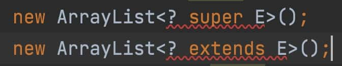

# 泛型的起因

对于一般的类和方法，如果要编写应用于多种类型的代码，那么代码的耦合度就会非常大。

Java的多态允许一个方法参数为某个父类，调用时可以传入其子类。但是Java是单继承的，如果方法参数是一个接口，那么会更加灵活。

但是接口是确定的，当需要不确定的参数时，这就引入泛型的概念。

**泛型实现了类型参数化的概念，能够让代码应用于多种类型。**

泛型的好处：

- 类型安全。放置的是什么，取出来的自然是什么，不用担心会抛出ClassCastException异常。
- 提升可读性。从编码阶段就显式地知道泛型集合、泛型方法等处理的对象类型是什么。
- 代码重用。泛型合并了同类型的处理代码，使代码重用度变高。

# 泛型示例

对于容器而言，以往解决类型耦合的办法是利用Object数组。但是这样会造成类型安全问题，而且有时更希望存放一些具体类型的对象，这个时候可以利用泛型来指定存放的类型。

要达到这个目的，需要使用类型参数，用尖括号括住，放在类名后面。

```java
private static class Holder<T> {
    private T a;

    public Holder(T a) {
        this.a = a;
    }

    public T getA() {
        return a;
    }

    public void setA(T a) {
        this.a = a;
    }
}
```

# 泛型方法

可以在类中包含参数化方法，而这个方法所在的类可以是泛型类，也可以不是泛型类。也就是说，是否拥有泛型方法，与其所在的类是否是泛型没有关系。

泛型方法使得该方法能够独立于类而产生变化。另外，对于一个static的方法而言，无法访问泛型类的类型参数，所以，如果static方法需要使用泛型能力，就必须使其成为泛型方法。

>   为什么静态方法不能访问类的类型参数呢？
>
>   静态方法是对于类的，而类型参数是对于对象的。如果静态方法可以访问，那么假设有两个对象设置了不同的类型参数，对于这个静态方法而言，它就会访问两种类型参数，这显然是不合理的。

要定义泛型方法，只需将泛型参数列表置于返回值之前。

如：

```java
private static <A> String getClassName(A a) {
    return a.getClass().getSimpleName();
}

private <A> void getClassName2(A a) {
    System.out.println(a.getClass().getSimpleName());
}
```

# 类型擦除

```java
public static void main(String[] args) {
    List<Integer> list1 = new ArrayList<>();
    List<String> list2 = new ArrayList<>();
    System.out.println(Arrays.toString(list1.getClass().getTypeParameters()));
    System.out.println(Arrays.toString(list2.getClass().getTypeParameters()));
}

out:
[E]
[E]
```

根据JDK文档的描述，Class.getTypeParameters()将“返回一个TypeVariable对象数组，表示有泛型声明所声明的类型参数....”，这里只是输出用作参数占位符的标识符，这并非有用的信息。

因此，**在泛型代码内部，无法获得任何有关泛型参数类型的信息**。

可以知道诸如类型参数标识符和泛型类型边界这类的信息，却无法知道用来创建某个特定实例的实际的类型参数。

**Java泛型是使用擦除来实现的**，这意味着当在使用泛型时，任何具体的类型信息都被擦除了。因此`List<String>` 和`List<Integer>`在运行时事实上是相同的类型。这两种形式都被擦除成它们的“原生”类型，即List。

>   类型擦除的目的？为什么要用类型擦除解决泛型问题？
>
>   Java1.5之前没有泛型，为了兼容以前的版本，选择了类型擦除。

擦除的代价是显著的。泛型不能用于显式地引用运行时类型的操作之中，例如instanceof操作和new表达式，因为所有关于参数的类型信息都丢失了。

## 类型擦除的问题

### 返回值

```java
class Holder {
    private Object mObject;

    public Object get() {
        return mObject;
    }

    public void set(Object object) {
        mObject = object;
    }

    public static void main(String[] args) {
        Holder holder = new Holder();
        holder.set("abc");
        String s = (String) holder.get();
    }
}
```

这是没有泛型的Holder，get需要显式的进行类型转换。

```java
class HolderWithType<T> {
    T t;

    public T get() {
        return t;
    }

    public void set(T t) {
        this.t = t;
    }

    public static void main(String[] args) {
        HolderWithType<String> holder = new HolderWithType<>();
        holder.set("abc");
        String s = holder.get();
    }
}
```

这是有泛型的Holder，get并不需要显式转型。

这里产生问题：**类型擦除是将泛型擦成Object，那为什么泛型的Holder不需要转型？**

Holder的字节码

```
class com.mezzsy.learnsomething.java.chapter15.Holder {
	
	//构造方法
  com.mezzsy.learnsomething.java.chapter15.Holder();
    Code:
       0: aload_0
       1: invokespecial #1                  // Method java/lang/Object."<init>":()V
       4: return

	//get方法
  public java.lang.Object get();
    Code:
       0: aload_0
       1: getfield      #2                  // Field mObject:Ljava/lang/Object;
       4: areturn

	//set方法
  public void set(java.lang.Object);
    Code:
       0: aload_0
       1: aload_1
       2: putfield      #2                  // Field mObject:Ljava/lang/Object;
       5: return

  public static void main(java.lang.String[]);
    Code:
       0: new           #3                  // class com/mezzsy/learnsomething/java/chapter15/Holder
       3: dup
       4: invokespecial #4                  // Method "<init>":()V
       7: astore_1
       8: aload_1
       9: ldc           #5                  // String abc
      11: invokevirtual #6                  // Method set:(Ljava/lang/Object;)V
      14: aload_1
      15: invokevirtual #7                  // Method get:()Ljava/lang/Object;
      18: checkcast     #8                  // class java/lang/String
      21: astore_2
      22: return
}
```

HolderWithType的字节码

```
class com.mezzsy.learnsomething.java.chapter15.HolderWithType<T> {
  T t;

	//构造方法
  com.mezzsy.learnsomething.java.chapter15.HolderWithType();
    Code:
       0: aload_0
       1: invokespecial #1                  // Method java/lang/Object."<init>":()V
       4: return

	//get方法
  public T get();
    Code:
       0: aload_0
       1: getfield      #2                  // Field t:Ljava/lang/Object;
       4: areturn

	//set方法
  public void set(T);
    Code:
       0: aload_0
       1: aload_1
       2: putfield      #2                  // Field t:Ljava/lang/Object;
       5: return

  public static void main(java.lang.String[]);
    Code:
       0: new           #3                  // class com/mezzsy/learnsomething/java/chapter15/HolderWithType
       3: dup
       4: invokespecial #4                  // Method "<init>":()V
       7: astore_1
       8: aload_1
       9: ldc           #5                  // String abc
      11: invokevirtual #6                  // Method set:(Ljava/lang/Object;)V
      14: aload_1
      15: invokevirtual #7                  // Method get:()Ljava/lang/Object;
      18: checkcast     #8                  // class java/lang/String
      21: astore_2
      22: return
}
```

这里两个字节码几乎一模一样的，因此得出结论：对于泛型的转型是由编译器自动插入的，不需要显式转型。

>   注意，是在调用的地方进行强转，而不是get方法内部。

# 擦除的补偿

```java
private static <T> void f(Object o) {
  	//if (o instanceof T){}//编译错误
    //T t=new T();//编译错误
    //T[] ts=new T[10];//编译错误
    T[] array= (T[]) new Object[10];//Unchecked
}
```

## 比较类型

不能使用instanceof关键字，因为类型信息擦除了，

如果要比较类型，可以利用isInstanceOf()方法

```java
final class Main<T> {
    private Class<T> kind;

    public static void main(String[] args) {
        Main<String> main = new Main<>();
        main.setKind(String.class);
        main.f("a");//true
        main.f(1);//false
    }

    public void setKind(Class<T> kind) {
        this.kind = kind;
    }

    public void f(Object o) {
        System.out.println(kind.isInstance(o));
    }
}
```

## 创建对象

不能用new T()来创建对象，部分原因是因为擦除，而另一部分原因是因为编译器不能验证T具有默认(无参)构造器。

解决办法是利用工厂方法模式或者模版方法模式

```java
//工厂方法模式
private static class Factory<T> {
    public T create(Class<T> clazz) {
        T t;
        try {
            t = clazz.newInstance();
            return t;
        } catch (IllegalAccessException e) {
            System.out.println("IllegalAccessException");
            return null;
        } catch (InstantiationException e) {
            System.out.println("InstantiationException");
            return null;
        }
    }
}
//模版方法模式
private static abstract class GenericWithCreate<T> {
    protected final T t;

    public GenericWithCreate() {
        t = create();
    }

    abstract T create();
}

private static class Creator extends GenericWithCreate<Main>{

    @Override
    Main create() {
        return new Main();
    }
}
```

## 泛型数组

不能创建泛型数组。一般的解决方法是创建动态数组ArrayList。

```java
public static void main(String[] args) {
        Generic<Integer>[] generics = new Generic[3];
        generics = (Generic<Integer>[]) new Object[3];//可以编译，但是运行会报ClassCastException
        generics[0] = new Generic<>();
        generics[1] = (Generic<Integer>) new Object();//ClassCastException，父类对象不能强转为子类对象
//        generics[2] = new Generic<Double>();//编译时错误
    }

    static class Generic<T>{}
}
```

### 问题一

下面的代码运行时会出现ClassCastException。

```java
public static void main(String[] args) {
    GenericArray<String> array = new GenericArray<>(2);
    String[] strings = array.rep();//编译器会在这里做自动强转，但是array对象的类型是Object[]，父类对象不能强转为子类对象，所以ClassCastException
}

private static class GenericArray<T> {
    private T[] array;

    @SuppressWarnings("unchecked")
    public GenericArray(int size) {
        array = (T[]) new Object[size];//因为类型擦除，T被擦成Object，所以这里的强转没有问题。
    }

    public T[] rep() {
        return array;
    }
}
```

如果要用泛型数组，那么需要声明Object[]，在putget的时候进行转型，参照ArrayList。

### 反证法解释

不能创建泛型数组。一般的解决方法是创建动态数组ArrayList。

```java
// 假设可以创建泛型数组
List<String>[] stringLists = new ArrayList<String>[1];
// 在数组中，子类数组 是 父类数组 的子类
Object[] objects = stringLists;
// 泛型擦除，虚拟机不知道类型信息，而List 继承自 Object，所以可以如此赋值
List<Integer> intList = Arrays.asList(42);
objects[0] = intList;
// 但此时出现问题了，List<Integer> 实例添加到了声明为 List<String>[] 类型的数组中了。这样就导致类型安全问题。
String s = stringLists[0].get(0);
```

假设编译器允许创建泛型数组，因为类型擦除，虚拟机不知道类型信息，就会导致类型安全问题。

如果一定要创建泛型数组，可以用这种方式：

```java
List<?>[] lists = new ArrayList<?>[2];
```

# 边界

因为擦除移除了类型信息，所以可以用无界泛型参数调用的方法只是那些可以用Object调用的方法。但是，如果能够将这个参数限制为某个类型子集，那么就可以用这些类型子集来调用方法。

为了执行这种限制，Java泛型重用了extends关键字。

```java
private static class MyClass1 {}

private static class MyClass2 {}

//出错，对于类而言，只能继承一个
private static class GenericClass1<T extends MyClass1 & MyClass2> {}
private interface MyInterface1 {}

private interface MyInterface2 {}

private static class MyClass1 {}

//出错，类需要放在第一位，后面可以有多个接口，用&隔开
private static class GenericClass1<T extends MyInterface1 & MyInterface2 & MyClass1> {}
//正确
private static class GenericClass1<T extends MyClass1 & MyInterface1 & MyInterface2> {}
```

# 通配符

```java
Object[] objects = new String[2];//这样是可行的
ArrayList<Object> list = new ArrayList<String>();//出错，因为泛型不是协变的
```

>   协变
>
>   Koltin的协变概念为如果A是B的子类型，那么`List<A>`就是`List<B>`的子类型。这样的类或者接口被称为协变的。
>
>   用数组可以更好的说明这个概念，A是B的子类，那么A[]也是B[]的子类。

为了能够协变，泛型利用通配符`？`。

>   class A
>   class B extends A
>   class C extends B
>   class D extends A

```java
List<? extends B> list1 = new ArrayList<C>();
List<? super B> list2 = new ArrayList<A>();
```

`List<? extends B>`表示list1的实例是B及其子类的一个List。
`List<? super B>`表示list2的实例是B及其父类的一个List。

```java
ArrayList<? extends Object> list = new ArrayList<String>();//可行
ArrayList<?> list = new ArrayList<String>();//由于是extends Object，可以省略
```

`ArrayList<? extends Object>`这实际上并不意味着这个List将持有任何类型的Object。通配符引用的是明确的类型，因此它意味着“某种list引用没有指定的具体类型”。因此这个被赋值的List必须持有诸如Object或String这样的某种指定类型。

协变（extends）只能读，逆变（super）只能写。这是为了保证运行时原始容器的类型正确。

```java
private static void test11() {
    List<B> list = new ArrayList<>();
    list.add(new B());
    list.add(new B());

    List<? extends A> list2 = list;
    funExtend(list2);
    //funSuper(objects);//编译错误

    List<? super B> list3 = list;
    //funExtend(list3);//编译错误，因为B及其父类不一定继承A，如Object
    funSuper(list3);
    System.out.println(list3);
}

private static void funExtend(List<? extends A> list) {
    //不能写
    //list.add(new A());//编译出错
    //list.add(new B());//编译出错
    //只能读
    for (A a : list) {
        System.out.println(a.hashCode());
    }
}

private static void funSuper(List<? super B> list) {
    //B b = list.get(0);//编译出错
    B s = (B) list.get(0);//编译没有问题，但可能会导致ClassCastException

    //list.add(new A());//编译出错
    list.add(new B());
    list.add(new C());
}

1878246837
929338653
[com.didi.javademo.Main$B@6ff3c5b5, com.didi.javademo.Main$B@3764951d, com.didi.javademo.Main$B@4b1210ee, com.didi.javademo.Main$C@4d7e1886]

```

超类型通配符（逆变）。可以声明通配符是由某个特定类的任何基类来界定的，方法是指定`<? super MyClass>`，甚至或者使用类型参数：`<? super T>` （不能对泛型参数给出一个超类型边界，即不能声明`<T super MyClass>`)。这使得你可以安全地传递一个类型对象到泛型类型中。因此，有了超类型通配符，就可以向Collection写入了。

## 问题一

为什么`ArrayList<? extends Object>`只能读不能写？

这里通配符表示某种继承Object的具体类型，但是目前是未知的，而不是继承Object的任一类型，这点和数组不同。虽然引用的是`ArrayList<String>`，但是编译器不知道。list可以引用`ArrayList<String>`，也可以引用`ArrayList<Integer>`，也可以引用`ArrayList<Object>`，如果list可以放入对象，对于这三种具体的ArrayList显然不是类型安全的，所以不能放入。

为什么`ArrayList<? super B>`只能写不能读？

因为写入B及其子类实例是满足类型安全的，但是读数据，有可能实例是`ArrayList<A>`，这时候强转会导致异常。即读是不安全的。

以上问题的解是本人参考《Java编程思想》得出的，可能存在某些未知问题。

## 问题二

```java
private static void funSuper(List<? super B> list) {
    //B b = list.get(0);//编译出错
    B s = (B) list.get(0);//编译没有问题，但可能会导致ClassCastException

    //list.add(new A());//编译出错
    list.add(new B());
    list.add(new C());
}
```

在上面的代码中，`List<? super B> list`，A是B的super，list为什么不能放入A对象？

`List<? super B> list`表示list存放类型的最大父类是B，为了静态类型正确，放入B及其子类肯定没有问题。如果放入了A，那么就可以放入其它非B的对象，如D。

## 问题三

List、`List<?>`和`List<? extends Object>`的区别。

List可以写成`List<Object>`，表示存放的内容是Object。

`List<?>`和`List<? extends Object>`是一样的，前者只是省略的写法。两者表示存放的是某个Object及其子类的具体类型。只能引用某个具体类型的对象，不能单独创建对象。



extends和super都不能单独创建对象。

## 小结

泛型中的extends还是super的种种限制都是为了类型安全，保证取出来的不会类型匹配问题。

# 泛型的问题

## 不能使用基本数据类型

不能将基本类型用作类型参数。不能创建`ArrayList<int>`之类的东西。解决之道是使用基本类型的包装器类以及自动包装机制。

## 实现参数化接口

一个类不能实现同一个泛型接口的两种变体，由于擦除的原因，这两个变体会成为相同的接口。

```java
public class Main {
    private static class Parent implements MyInterface<Parent>{}

    private static class Child extends Parent implements MyInterface<Child>{}//编译错误: 无法使用以下不同的参数继承MyInterface: <com.mezzsy.learnsomething.Main.Child> 和 <com.mezzsy.learnsomething.Main.Parent>

    private interface MyInterface<T>{}
}
```

Child不能编译，因为类型擦除，这样上面的代码就意味着在重复两次地实现相同的接口。

如果移除掉泛型参数，就可以编译：

```java
public class Main {
	private static class Parent implements MyInterface{}

    private static class Child extends Parent implements MyInterface{}

    private interface MyInterface<T>{}
}
```

## 不能重载

```java
private void f(MyInterface<A> i){}//不能进行重载
private void f(MyInterface<B> i){}

private static class A {}

private static class B {}

private interface MyInterface<T>{
}
```
