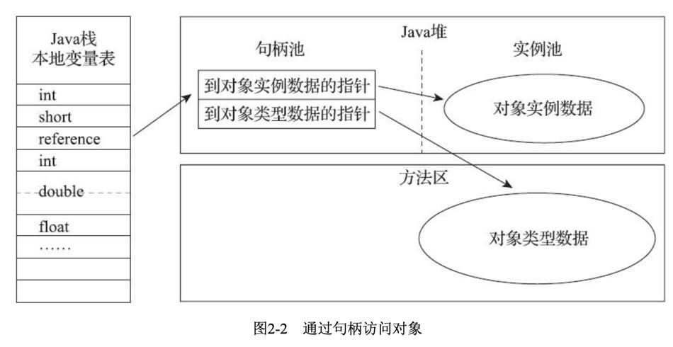

# 运行时数据区域


## 程序计数器

程序计数器是一块较小的内存空间，它可以看作是当前线程所执行的字节码的行号指示器。

Java虚拟机的多线程是通过线程切换并分配处理器执行时间的方式来实现的，在任何一个确定的时刻，一个处理器（对于多核处理器的一个内核）只会执行一条线程中的指令。**为了线程切换后能恢复到正确的执行位置**，每条线程都需要有一个独立的程序计数器，各条线程之间计数器互不影响，独立存储。

如果当前执行的方法是java方法，那么计数器记录的是字节码指令的地址。如果是native方法，那么计时器值为空。

## 虚拟机栈

**虚拟机栈描述的是java方法执行的内存模型**，它的生命周期与线程相同。每个方法执行的同时都会创建一个栈帧，用于存储局部变量表、操作数栈、动态链接、方法出口等信息。

局部变量表存放了编译期可知的各种基本数据类型，对象引用和returnAddress类型。

这些数据类型在局部变量表中的存储空间以局部变量槽(Slot)来表示，其中64位长度的long和 double类型的数据会占用两个变量槽，其余的数据类型只占用一个。局部变量表所需的内存空间在编译期间完成分配，当进入一个方法时，这个方法需要在栈帧中分配多大的局部变量空间是完全确定的，**在方法运行期间不会改变局部变量表的大小**。这里的“大小”是指变量槽的数量。

## 本地方法栈

和虚拟机栈相似，本地方法栈为native方法服务。

## Java堆

Java堆是Java虚拟机所管理的内存中最大的一块。Java堆是被所有线程共享的一块内存区域，在虚拟机启动时创建。此内存唯一的目的就是存放对象实例，几乎所有的对象实例都在这里分配内存。

Java堆可以处于物理上不连续的内存空间中，只要逻辑上是连续的即可。

>   由于现代垃圾收集器大部分都是基于分代收集理论设计的，所以Java堆中经常会出现“新生代”“老年代”等名词。但是到了今天，垃圾收集器技术与十年前已不可同日而语，HotSpot里面也出现了不采用分代设计的新垃圾收集器。

## 方法区

用于存储已被虚拟机加载的类信息、常量、静态变量等数据。方法区(Method Area)与Java堆一样，是各个线程共享的内存区域，它用于存储已被虚拟机加载的类型信息、常量、静态变量、即时编译器编译后的代码缓存等数据。

## 元空间

1.8把方法区改用元空间了。类的元信息被存储在元空间中。元空间没有使用堆内存，而是与堆不相连的本地内存区域。所以，理论上系统可以使用的内存有多大，元空间就有多大，所以不会出现永久代存在时的内存溢出问题。


## 运行时常量池

在1.7版本之前，运行时常量池是在方法区中的，在1.7及以后的版本中，将运行时常量池移到了堆中，运行时常量池中，每个类型对应一个常量池，例如字符串常量池，基本数据类型的常量池

Class文件中除了有类的版本、字段、方法、接口等描述信息外，还有一项信息是常量池，用于存放编译期间生成的各种字面量和符号引用，这部分内容将在类加载后进入方法区的运行时常量池中存放。

运行时常量池相对于Class文件常量池的另外一个重要特征是具备动态性，Java语言并不要求常量一定只有编译期才能产生，也就是说，并非预置入Class文件中常量池的内容才能进入方法区运行时常量池，运行期间也可以将新的常量放入池中，这种特性被开发人员利用的比较多的是String类的intern方法。

### 字符串

#### 情况1

```java
String s1 = "zzsyzzsy";
String s2 = "zzsyzzsy";
System.out.println(s1 == s2);//true
```

通过双引号获取的字符串，会去字符串常量池中寻找，如果有直接返回引用，如果没有就创建一个并返回引用。所以情况1是2个同一个对象。

#### 情况2

```java
String s3 = new String("zzsyzzsy");
System.out.println(s2 == s3);//false
```

new String("str")的操作。如果""修饰的字符串没有创建，那么会创建一个，并将其作为String(String str)的参数。另外，new操作会在Java堆上创建一个新的String对象，所以两者不是同一个对象。

```java
public String(String original) {
    this.value = original.value;
    this.hash = original.hash;
}
```

`new String("str")`的操作是创建了一个对象，但是内部的字符数组是同一个。

#### 情况3

```java
String s4 = "123";
String s5 = new String("123");
String s6 = s5.intern();
System.out.println(s4 == s6);//true
System.out.println(s5 == s6);//false
```

String::intern()是一个本地方法，它的作用是如果字符串常量池中已经包含一个等于此String对象的字符串，则返回代表池中这个字符串的String对象的引用；否则，会将此String对象包含的字符串添加到常量池中，并且返回此String对象的引用。

s6就是在字符串常量池中找到的s4，所以两者是一个对象；而s5是new出来的新对象，所以不是同一个对象。

#### 情况4

```java
// JDK6中返回2个false
// JDK7之后返回true和false
String s7 = new StringBuilder("计算机").append("软件").toString();
System.out.println(s7.intern() == s7);
String s8 = new StringBuilder("ja").append("va").toString();
System.out.println(s8.intern() == s8);
```

情况4在JDK6中返回2个false，在JDK7之后返回true和false。

因为，在JDK6之前，字符串常量池存放在方法区，自JDK7起，字符串常量池被移至Java堆之中。

在JDK 6中，intern()方法会把首次遇到的字符串实例复制到永久代的字符串常量池中存储，返回的也是永久代里面这个字符串实例的引用，而由StringBuilder创建的字符串对象实例在Java堆上，所以必然不可能是同一个引用，结果将返回false。（StringBuilder的toString会new一个String）

而在JDK7中，s7是在堆上创建的，其字符串值为“计算机软件”，这个值是新的，在此之前，没有这个字符串，所以s7.intern()在堆上找到的就是s7，然后返回s7，所以两者是同一个对象。
s8是在堆上new了一个对象，而"java"字符串此前已经出现在了字符串常量池。s8.intern()首次遇到的是字符串常量池中的"java"，所以返回的是"java"，和s8不是同一个对象。


## 直接内存

直接内存(Direct Memory)并不是虚拟机运行时数据区的一部分，也不是《Java虚拟机规范》中定义的内存区域。但是这部分内存也被频繁地使用，而且也可能导致OutOfMemoryError异常出现。

在JDK1.4中新加入了NIO(New Input/Output)类，引入了一种基于通道(Channel)与缓冲区 (Buffer)的I/O方式，它可以使用Native函数库直接分配堆外内存，然后通过一个存储在Java堆里面的DirectByteBuffer对象作为这块内存的引用进行操作。


# 对象

## 对象的创建

在语言层面上，创建一个对象通常（例外：复制、序列化）只是一个new关键字而已。

在虚拟机中：

1. 虚拟机遇到一条new指令时，首先去检查是否能在方法区的常量池中定位到一个类的符号引用，并且检查这个符号引用代表的类是否已被加载、解析和初始化过。如果没有，那就必须先执行相应的类加载过程。
2. 在类加载检查通过后，接下来虚拟机将为新生对象分配内存，对象的大小在类加载完成后便可完全确定。有两种分配方式：**指针碰撞**和**空闲列表**。
    除了如何划分空间外，还有一个问题要考虑：
    对象的创建在虚拟机中是非常频繁的行为，在并发情况下也并不是线程安全的，可能出现正在给对象A分配内存，指针还没来得及修改，对象B又同时使用了原来的指针来分配内存的情况。
    解决这个问题有两个方案：
    1、对分配内存空间的动作进行同步处理——实际上虚拟机采用CAS配上失败重试的方法来保证更新操作的原子性。
    2、在Java堆中预先分配一小块内存，称为本地线程分配缓冲（TLAB），哪个线程要分配内存，就在哪个线程的TLAB上分配，只有TLAB用完并分配新的TLAB时，才需要同步锁定。
3. 内存分配完成后，虚拟机需要将分配到的内存空间都初始化为零值，这一步操作保证了对象的实例字段在Java代码中可以不赋值就直接使用。
4. 接下来，虚拟机对对象进行必要的设置，这些信息存放在对象的对象头之中。例如这个对象是哪个类的实例、如何才能找到类的元数据信息、对象的哈希码(实际上对象的哈希码会延后到真正调用Object::hashCode()方法时才计算)、对象的GC分代年龄等信息。
5. 上面的工作完成后，执行\<init\>方法（构造器），一个真正可用的对象才算完全产生出来。

> 指针碰撞：
>把一块确定大小的内存从Java堆中划分出来。假设Java堆中内存是绝对规整的，所有用过的内存都放在一边，空闲的内存放在另一边，中间放着一个指针作为分界点的指示器，那所分配内存就仅仅是把那个指针向空闲空间那边挪动一段与对象大小相等的距离，这种分配方式称为“指针碰撞”(Bump the Pointer)。
> 
>空闲列表：
> 如果Java堆中的内存并不是规整的，已使用的内存和空闲的内存相互交错，那就没有办法简单地进行指针碰撞了，虚拟机就必须维护一个列表，记录上哪些内存块是可用的，在分配的时候从列表中找到一块足够大的空间划分给对象实例，并更新列表上的记录，这种分配方式称为“空闲列表”(Free List)。

**总结**

1.  首先虚拟机遇到new指令，检查类是否加载，如果没有就进行类加载。
2.  然后进行内存分配并将内存空间初始化为零值。
3.  然后设置对象，将一些信息放在对象头里。
4.  最后调用构造器，一个真正可用的对象构造完成。

## 对象的内存布局

对象在内存中存储的布局可以分为3块区域：**对象头、实例数据和对齐填充**。

### 对象头

包括两部分信息：
第一部分用于存储对象自身的运行时数据，如哈希码，GC分代年龄，锁状态标志等。
另一部分是类型指针，虚拟机通过这个指针来确定这个对象是哪个类的实例。如果对象是数组，那么还有记录长度的数据。

### 实例数据

实例数据部分是对象真正存储的有效信息，即在程序代码里面所定义的各种类型的字段内容，无论是从父类继承下来的，还是在子类中定义的字段都必须记录起来。

### 对齐填充

对齐填充并不是必然存在的，仅仅起着占位符的作用。

## 对象的访问定位

Java程序会通过栈上的reference数据来操作堆上的具体对象。由于reference类型在《Java虚拟机规范》里面只规定了它是一个指向对象的引用，并没有定义这个引用应该通过什么方式去定位、访问到堆中对象的具体位置，所以对象访问方式也是由虚拟机实现而定的，主流的访问方式主要有使用句柄和直接指针两种：

### 句柄



使用句柄来访问的最大好处就是reference中存储的是稳定句柄地址，在对象被移动(垃圾收集时移动对象是非常普遍的行为)时只会改变句柄中的实例数据指针，而reference本身不需要被修改。

**直接指针**：


直接指针的好处是速度更快。

