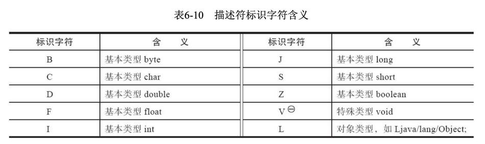
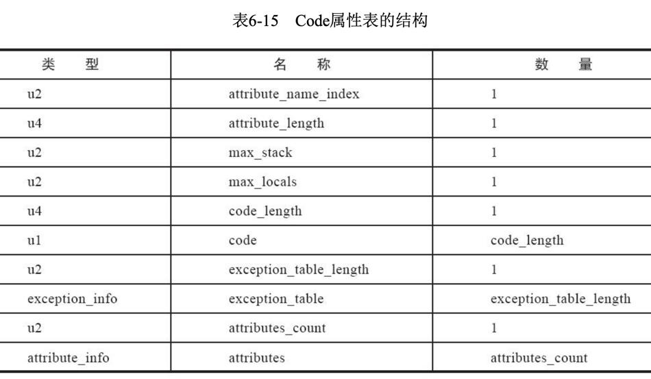

# 无关性的基石

实现语言无关性的基础仍然是虚拟机和字节码存储格式。

Java虚拟机不与包括Java语言在内的任何程序语言绑定，它只与“Class文件”这种特定的二进制文件格式所关联，Class文件中包含了Java虚拟机指令集、符号表以及若干其他辅助信息。虚拟机丝毫不关心Class的来源是什么语言。

# Class类文件的结构

尽管不同版本的《Java虚拟机规范》对Class文件格式进行了几次更新，但基本上只是在原有结构基础上
新增内容、扩充功能，并未对已定义的内容做出修改。

Class文件是一组以8个字节为基础单位的二进制流，各个数据项目严格按照顺序紧凑地排列在文件之中，中间没有添加任何分隔符，这使得整个Class文件中存储的内容几乎全部是程序运行的必要数据，没有空隙存在。当遇到需要占用8个字节以上空间的数据项时，则会按照高位在前的方式分割成若干个8个字节进行存储。（大端序）

Class文件格式采用一种类似于C语言结构体的伪结构来存储数据，这种伪结构中只有两种数据类型：“无符号数”和“表”。

-   无符号数属于基本的数据类型型，以u1、u2、u4、u8来分别代表1个字节、2个字节、4个字节和8个字节的无符号数，无符号数可以用来描述数字、索引引用、数量值或者按照UTF-8编码构成字符串值。
-   表是由多个无符号数或者其他表作为数据项构成的复合数据类型。

无论是无符号数还是表，当需要描述同一类型但数量不定的多个数据时，经常会使用一个前置的容量计数器加若干个连续的数据项的形式，这时候称这一系列连续的某一类型的数据为某一类型的“集合”。

## 魔数与Class文件的版本

每个Class文件的头4个字节被称为魔数（MagicNumber），它的唯一作用是确定这个文件是否为一个能被虚拟机接受的Class文件。

紧接着魔数的4个字节存储的是Class文件的版本号：第5和第6个字节是次版本号（Minor Version），第7和第8个字节是主版本号（MajorVersion）。

## 常量池

由于常量池中常量的数量是不固定的，所以在常量池的入口需要放置一项u2类型的数据，代表常量池容量计数值（constant_pool_count）。
与Java中语言习惯不同，这个容量计数是从1而不是0开始的，如常量池容量为十六进制数0x0016，即十进制的22，这就代表常量池中有21项常量，索引值范围为1~21。
在Class文件格式规范制定之时，设计者将第0项常量空出来是有特殊考虑的，这样做的目的在于，如果后面某些指向常量池的索引值的数据在特定情况下需要表达“不引用任何一个常量池项目”的含义，可以把索引值设置为0来表示。
Class文件结构中只有常量池的容量计数是从1开始，对于其他集合类型型，包括接口索引集合、字段表集合、方法表集合等的容量计数都与一般习惯相同，是从0开始。

常量池中主要存放两大类常量：字面量（Literal）和符号引用（Symbolic References）。

字面量比较接近于Java语言层面的常量概念，如文本字符串、被声明为final的常量值等。

符号引用则属于编译原理方面的概念，主要包括下面几类常量：

-   被模块导出或者开放的包
-   类和接口的全限定名
-   字段的名称和描述符
-   方法的名称和描述符
-   方法句柄和方法类型

Java代码在进行Javac编译的时候，并不像C和C++那样有“连接”这一步骤，而是在虚拟机加载Class文件的时候进行动态连接。当虚拟机做类加载时，将会从常量池获得对应的符号引用，再在类创建时或运行时解析、翻译到具体的内存地址之中。

## 访问标志

这个标志用于识别一些类或者接口层次的访问信息，包括：这个Class是类还是接口；是否定义为public类型；是否定义为abstract类型；如果是类的话，是否被声明为final；等等。

## 类索引、父类索引与接口索引集合

类索引（this_class）和父类索引（super_class）都是一个u2类型的数据，而接口索引集合（interfaces）是一组u2类型的数据的集合，Class文件中由这三项数据来确定该类型的继承关系。类索引用于确定这个类的全限定名，父类索引用于确定这个类的父类的全限定名。（指向常量池的索引）

## 字段表集合

字段表（field_info）用于描述接口或者类中声明的变量。Java语言中的“字段”（Field）包括类级变量以及实例级变量，但不包括在方法内部声明的局部变量。

### 全限定名

“org/fenixsoft/clazz/TestClass”是这个类的全限定名，仅仅是把类全名中的“\.”替换成了“/”而已，为了使连续的多个全限定名之间不产生混淆，在使用时最后一般会加入一个“;”号表示全限定名结束。

### 简单名称

简单名称则就是指没有类型和参数修饰的方法或者字段名称，这个类中的inc方法和m字段的简单名称分别就是“inc“和“m”。

### 描述符

描述符的作用是用来描述字段的数据类型、方法的参数列表（包括数量、类型以及顺序）和返回值。

对于数组类型，每一维度将使用一个前置的“[”字符来描述，如一个定义为`java.lang.String[][]`类型的二维数组将被记录成`[[Ljava/lang/String;`，一个整型数组`int[]`将被记录成`[I`。

用描述符来描述方法时，按照先参数列表、后返回值的顺序描述，参数列表按照参数的严格顺序放在一组小括号“()“之内。如方法`void inc()`的描述符为`()V`，方法`java.lang.String.toString()`的描述符`()Ljava/lang/String;`，方法`int indexOf(char[] source, int sourceOffset, int sourceCount, char[] target, int targetOffset, int targetCount, int fromIndex)`的描述符为`([CII{CIII)I`。

字段表集合中不会列出从父类或者父接口中继承而来的字段，但有可能出现原本Java代码之中不存在的字段，譬如在内部类中为了保持对外部类的访问性，编译器就会自动添加指向外部类实例的字段。

## 方法表集合

方法的定义可以通过访问标志、名称索引、描述符索引来表达清楚，而方法里的Java代码，经过Javac编译器编译成字节码指令之后，存放在方法属性表集合中一个名为“Code“”的属性里面。

与字段表集合相对应地，如果父类方法在子类中没有被重写（Override），方法表集合中就不会出现来自父类的方法信息。但同样地，有可能会出现由编译器自动添加的方法，最常见的便是类构造器`<clinit>()`方法和实例构造器`<init>()`方法。

在Java语言中，要重载（Overload）一个方法，除了要与原方法具有相同的简单名称之外，还要求必须拥有一个与原方法不同的特征签名。但是在Class文件格式之中，特征签名的范围明显要更大一些，只要描述符不是完全一致的两个方法就可以共存。也就是说，如果两个方法有相同的名称和特征签名，但返回值不同，那么也是可以合法共存于同一个Class文件中的。

>   Java不允许参数列表和名称相同而返回值不同的方法，但在Class文件中是允许的，因为描述符不一致。

## 属性表集合

Class文件、字段表、方法表都可以携带自己的属性表集合，以描述某些场景专有的信息。

### Code属性

Java程序方法体里面的代码经过Javac编译器处理之后，最终变为字节码指令存储在Code属性内。Code属性出现在方法表的属性集合之中，但并非所有的方法表都必须存在这个属性，譬如接口或者抽象类中的方法就不存在Code属性，如果方法表有Code属性存在，那么它的结构将如图所示。

attribute_name_index是一项指向CONSTANT_Utf8_info型常量的索引，此常量值固定为“Code”，它代表了该属性的属性名称。

attribute_length指示了属性值的长度。

max_stack代表了操作数栈（Operand Stack）深度的最大值。在方法执行的任意时刻，操作数栈都不会超过这个深度。虚拟机运行的时候需要根据这个值来分配栈帧（Stack Frame）中的操作栈深度。

max_locals代表了局部变量表所需的存储空间。
在这里，max_locals的单位是变量槽（Slot），变量槽是虚拟机为局部变量分配内存所使用的最小单位。对于byte、char、float、int、short、boolean和return Address等长度不超过32位的数据类型，每个局部变量占用一个变量槽，而double和long这两种64位的数据类型则需要两个变量槽来存放。
方法参数（包括实例方法中的隐藏参数“this”）、显式异常处理程序的参数（Exception Handler Parameter，就是try-catch语句中catch块中所定义的异常）、方法体中定义的局部变量都需要依赖局部变量表来存放。
注意，并不是在方法中用了多少个局部变量，就把这些局部变量所占变量槽数量之和作为max_locals的值，操作数栈和局部变量表直接决定一个该方法的栈帧所耗费的内存，不必要的操作数栈深度和变量槽数量会造成内存的浪费。
Java虚拟机的做法是将局部变量表中的变量槽进行重用，当代码执行超出一个局部变量的作用域时，这个局部变量所占的变量槽可以被其他局部变量所使用，Javac编译器会根据变量的作用域来分配变量槽给各个变量使用，根据同时生存的最大局部变量数量和类型计算出max_locals的大小。

code_length和code用来存储Java源程序编译后生成的字节码指令。code_length代表字节码长度，code是用于存储字节码指令的一系列字节流。既然叫字节码指令，那顾名思义每个指令就是一个u1类型的单字节，当虚拟机读取到code中的一个字节码时，就可以对应找出这个字节码代表的是什么指令，并且可以知道这条指令后面是否需要跟随参数，以及后续的参数应当如何解析。
关于code_length，有一件值得注意的事情，虽然它是一个u4类型的长度值，理论上最大值可以达到2的32次幂，但是《Java虚拟机规范》中明确限制了一个方法不允许超过65535条字节码指令，即它实际只使用了u2的长度，如果超过这个限制，Javac编译器就会拒绝编译。

### 其它属性

略

# 字节码指令简介

Java虚拟机的指令由一个字节长度的、代表着某种特定操作含义的数字（称为操作码，Opcode）以及跟随其后的零至多个代表此操作所需的参数（称为操作数，Operand）构成。由于Java虚拟机采用面向操作数栈而不是面向寄存器的架构，所以大多数指令都不包含操作数，只有一个操作码，指令参数都存放在操作数栈中。

## 其它指令

略

## 同步指令

Java虚拟机可以支持方法级的同步和方法内部一段指令序列的同步，这两种同步结构都是使用管程（Monitor，更常见的是直接将它称为“锁”）来实现的。

方法级的同步是隐式的，无须通过字节码指令来控制，它实现在方法调用和返回操作之中。虚拟机可以从方法常量池中的方法表结构中的ACC_SYNCHRONIZED访问标志得知一个方法是否被声明为同步方法。

当方法调用时，调用指令将会检查方法的ACC_SYNCHRONIZED访问标志是否被设置，如果设置了，执行线程就要求先成功持有管程，然后才能执行方法，最后当方法完成（无论是正常完成还是非正常完成）时释放管程。在方法执行期间，执行线程持有了管程，其他任何线程都无法再获取到同一个管程。如果一个同步方法执行期间抛出了异常，并且在方法内部无法处理此异常，那这个同步方法所持有的管程将在异常抛到同步方法边界之外时自动释放。

同步一段指令集序列通常是由Java语言中的synchronized语句块来表示的，Java虚拟机的指令集中有monitorenter和monitorexit两条指令来支持synchronized关键字的语义。

编译器必须确保无论方法通过何种方式完成，方法中调用过的每条monitorenter指令都必须有其对应的monitorexit指令，而无论这个方法是正常结束还是异常结束。

从代码中可以看到，为了保证在方法异常完成时monitorenter和monitorexit指令依然可以正确配对执行，编译器会自动产生一个异常处理程序，这个异常处理程序声明可处理所有的异常，它的目的就是用来执行monitorexit指令。