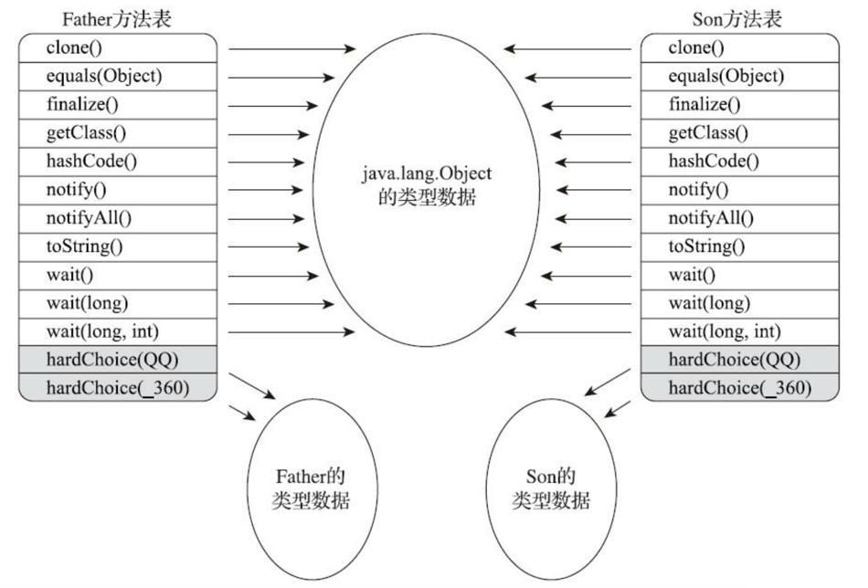

# 运行时栈帧结构

Java虚拟机以方法作为最基本的执行单元，“栈帧”则是用于支持虚拟机进行方法调用和方法执行背后的数据结构，它也是虚拟机运行时数据区中的虚拟机栈的栈元素。

## 局部变量表

局部变量表是一组变量值的存储空间，用于存放方法参数和方法内部定义的局部变量。局部变量表的容量以变量槽为最小单位，槽的内存空间没有规定，但需要能存放一个boolean、byte、char、short、int、float、reference或returnAddress类型的数据。

>   reference类型表示对一个对象实例的引用。它能够：一是从根据引用直接或间接地查找到对象在Java堆中的数据存放的起始地址或索引，二是根据引用直接或间接地查找到对象所属数据类型在方法区中的存储的类型信息。
>
>   returnAddress类型目前已经很少见了，它是为字节码指令jsr、jsr_w和ret服务的，指向了一条字节码指令的地址，某些很古老的Java虚拟机曾经使用这几条指令来实现异常处理时的跳转，但现在也已经全部改为采用异常表来代替了。

对于64位的数据类型，Java虚拟机会以高位对齐的方式为其分配两个连续的变量槽空间。不过，由于局部变量表是建立在线程堆栈中的，属于线程私有的数据，不会引起线程问题。

为了尽可能节省栈帧耗用的内存空间，局部变量表中的变量槽是可以重用的，方法体中定义的变量，其作用域并不一定会覆盖整个方法体，如果当前字节码PC计数器的值已经超出了某个变量的作用域，那这个变量对应的变量槽就可以交给其他变量来重用。

局部变量不像类变量存在“准备阶段”。类变量即使不设置，也会存在初始值。而局部变量定义了但没有赋初始值，那它是完全不能使用的。所以不要认为Java中任何情况下都存在诸如整型变量默认为0、布尔型变量默认为false等这样的默认值规则。（这一部分，我猜是局部变量表中的变量槽复用导致的）

## 操作数栈

操作数栈的每一个元素都可以是包括long和double在内的任意Java数据类型。32位数据类型所占的栈容量为1，64位数据类型所占的栈容量为2。Javac编译器的数据流分析工作保证了在方法执行的任何时候，操作数栈的深度都不会超过在max_stacks数据项中设定的最大值。

当一个方法刚刚开始执行的时候，这个方法的操作数栈是空的，在方法的执行过程中，会有各种字节码指令往操作数栈中写入和读取内容，也就是出栈和入栈操作。譬如在做算术运算的时候是通过将运算涉及的操作数栈压入栈顶后调用运算指令来进行的，又譬如在调用其他方法的时候是通过操作 数栈来进行方法参数的传递。举个例子，例如整数加法的字节码指令iadd，这条指令在运行的时候要 求操作数栈中最接近栈顶的两个元素已经存入了两个int型的数值，当执行这个指令时，会把这两个int值出栈并相加，然后将相加的结果重新入栈。

## 方法返回地址

当一个方法开始执行后，只有两种方式退出这个方法：

1.  执行引擎遇到任意一个方法返回的字节码指令，这时候可能会有返回值传递给上层的方法调用者。
2.  在方法执行的过程中遇到了异常，并且这个异常没有在方法体内得到妥善处理。一个方法使用异常完成出口的方式退出，是不会给它的上层调用者提供任何返回值的。

方法退出的过程实际上等同于把当前栈帧出栈，因此退出时可能执行的操作有：恢复上层方法的局部变量表和操作数栈，把返回值（如果有的话）压入调用者栈帧的操作数栈中，调整PC计数器的值以指向方法调用指令后面的一条指令等。

# 方法调用

## 解析调用

所有方法调用的目标方法在Class文件里面都是一个常量池中的符号引用，在类加载的解析阶段，会将其中的一部分符号引用转化为直接引用，这种解析能够成立的前提是：方法在程序真正运行之前就有一个可确定的调用版本，并且这个方法的调用版本在运行期是不可改变的。主要有静态方法和私有方法两大类，前者与类型直接关联，后者在外部不可被访问，这两种方法各自的特点决定了它们都不可能通过继承或别的方式重写出其他版本，因此它们都适合在类加载阶段进行解析。

解析调用一定是个静态的过程，在编译期间就完全确定，在类加载的解析阶段就会把涉及的符号引用全部转变为明确的直接引用，不必延迟到运行期再去完成。

## 分派调用

### 静态分派

一个例子

```java
public class StaticDispatch {
    static abstract class Human {}
    static class Man extends Human {}
    static class Woman extends Human {}

    public void sayHello(Human guy) {
        System.out.println("hello,guy!");
    }

    public void sayHello(Man guy) {
        System.out.println("hello,gentleman!");
    }

    public void sayHello(Woman guy) {
        System.out.println("hello,lady!");
    }

    public static void main(String[] args) {
        Human man = new Man();
        Human woman = new Woman();
        StaticDispatch sr = new StaticDispatch();
        sr.sayHello(man);
        sr.sayHello(woman);
    }
}
```

```
hello,guy!
hello,guy!
```

```java
Human man = new Man();
```

Human是man的静态类型，Man是man的运行时类型。两种类型在程序中会发生变化，如：

```java
// 实际类型变化
Human human = (new Random()).nextBoolean() ? new Man() : new Woman();
// 静态类型变化 
sr.sayHello((Man) human) sr.sayHello((Woman) human);
```

使用哪个重载版本，就完全取决于传入参数的数量和静态类型。

所有依赖静态类型来决定方法执行版本的分派动作，都称为静态分派。静态分派的最典型应用表现就是方法重载。静态分派发生在编译阶段。

### 动态分派

一个例子

```java
public class DynamicDispatch {
    static abstract class Human {
        protected abstract void sayHello();
    }

    static class Man extends Human {
        @Override
        protected void sayHello() {
            System.out.println("man say hello");
        }
    }

    static class Woman extends Human {
        @Override
        protected void sayHello() {
            System.out.println("woman say hello");
        }
    }

    public static void main(String[] args) {
        Human man = new Man();
        Human woman = new Woman();
        man.sayHello();
        woman.sayHello();
        man = new Woman();
        man.sayHello();
    }
}
```

```
man say hello 
woman say hello 
woman say hello
```

通过javap反编译，发现调用sayHello的符号引用是Human的。Java虚拟机是通过invokevirtual指令来实现重写的。

invokevirtual指令的运行时解析过程大致分为以下几步：

1.  找到操作数栈顶的第一个元素所指向的对象的实际类型，记作C。
2.  如果在类型C中找到与常量中的描述符和简单名称都相符的方法，则进行访问权限校验，如果通过则返回这个方法的直接引用，查找过程结束；不通过则返回`java.lang.IllegalAccessError`异常。
3.  否则，按照继承关系从下往上依次对C的各个父类进行第二步的搜索和验证过程。
4.  如果始终没有找到合适的方法，则抛出`java.lang.AbstractMethodError`异常。

虚的概念只适用于方法，字段不参与多态。

### 单分派和多分派

方法的接收者与方法的参数统称为方法的宗量。

-   Java语言的静态分派属于多分派类型，因为是根据多个宗量进行选择。 
-   Java语言的动态分派属于单分派类型，因为只有一个宗量作为选择依据。

### 虚拟机动态分派的实现

和C++类似，Java动态分派的实现是使用虚方法表。



虚方法表中存放着各个方法的实际入口地址。如果某个方法在子类中没有被重写，那子类的虚方法表中的地址入口和父类相同方法的地址入口是一致的，都指向父类的实现入口。如果子类中重写了这个方法，子类虚方法表中的地址也会被替换为指向子类实现版本的入口地址。

虚方法表一般在类加载的连接阶段进行初始化，准备了类的变量初始值后，虚拟机会把该类的虚方法表也一同初始化完毕。

## 小结

-   解析调用是静态方法和私有方法的调用原理。
-   分派调用是Java重写和重载的原理。

# 动态类型语言支持

## java.lang.invoke包

```java
public class TestInvoke {
    public static void main(String[] args) throws Throwable {
        Object obj = System.currentTimeMillis() % 2 == 0 ? System.out : new ClassA();
        // 无论obj最终是哪个实现类，下面这句都能正确调用到println方法。
        getPrintlnMH(obj).invokeExact("mezzsy");
    }

    /**
     * 获取println的方法句柄
     */
    private static MethodHandle getPrintlnMH(Object reveiver) throws Throwable {
        // MethodType：代表“方法类型”，包含了方法的返回值(methodType()的第一个参数)和
        // 具体参数(methodType()第二个及以后的参数)。
        MethodType mt = MethodType.methodType(void.class, String.class);
        // lookup()方法的作用是在指定类中查找符合给定的方法名称、方法类型，并且符合调用权限的方法句柄。
        // 因为这里调用的是一个虚方法，按照Java语言的规则，
        // 方法第一个参数是隐式的，代表该方法的接收者，也即this指向的对象，
        // 这个参数以前是放在参数列表中进行传递，现在提供了bindTo()方法来完成这件事情。
        return MethodHandles.lookup()
                .findVirtual(reveiver.getClass(), "println", mt)
                .bindTo(reveiver);
    }

    private static class ClassA {
        public void println(String s) {
            System.out.println("A = " + s);
        }
    }
}
```

`java.lang.invoke`包提供了新的方法调用能力，称为方法句柄（类似C++的函数指针），之前是利用符号引用。

**和反射的区别**

-   Reflection和MethodHandle机制本质上都是在模拟方法调用，但是Reflection是在模拟Java代码层次的方法调用，而MethodHandle是在模拟字节码层次的方法调用。
-   Reflection中的`java.lang.reflect.Method`对象远比MethodHandle机制中的`java.lang.invoke.MethodHandle`对象所包含的信息来得多。前者是方法在Java端的全面映像，包含了方法的签名、描述符以及方法属性表中各种属性的Java端表示方式，还包含执行权限等的运行期信息。而后者仅包含执行该方法的相关信息。用开发人员通俗的话来讲，Reflection是重量级，而MethodHandle是轻量级。
-   由于MethodHandle是对字节码的方法指令调用的模拟，那理论上虚拟机在这方面做的各种优化（如方法内联），在MethodHandle上也应当可以采用类似思路去支持（但目前实现还在继续完善中），而通过反射去调用方法则几乎不可能直接去实施各类调用点优化措施。
-   最关键的一点还在于：Reflection API的设计目标是只为Java语言服务的，而MethodHandle则设计为可服务于所有Java虚拟机之上的语言。

## 小结

Java虚拟机的动态类型语言支持主要是为非Java语言服务。

# 基于栈的字节码解释执行引擎

## 解释执行

笼统地说“解释执行”，对于整个Java语言来说几乎是没有意义的，只有确定了具体的Java实现版本和执行引擎运行模式时，谈解释执行还是编译执行才有意义。

## 基于栈的指令集与基于寄存器的指令集

Javac编译器输出的字节码指令流，基本上是一种基于栈的指令集架构，字节码指令流里面的指令大部分都是零地址指令，它们依赖操作数栈进行工作。

### 两者指令集的区别

执行计算1+1：

```
iconst_1 
iconst_1 
iadd 
istore_0
```

两条iconst_1指令连续把两个常量1压入栈后，iadd指令把栈顶的两个值出栈、相加，然后把结果放回栈顶，最后`istore_0`把栈顶的值放到局部变量表的第0个变量槽中。这种指令流中的指令通常都是不带参数的，使用操作数栈中的数据作为指令的运算输入，指令的运算结果也存储在操作数栈之中。 

如果用基于寄存器的指令集，那程序可能会是这个样子：

```
mov eax, 1 
add eax, 1
```

mov指令把EAX寄存器的值设为1，然后add指令再把这个值加1，结果就保存在EAX寄存器里面。 这种二地址指令是x86指令集中的主流，每个指令都包含两个单独的输入参数，依赖于寄存器来访问和存储数据。

-   基于栈的指令集主要优点是可移植，因为寄存器由硬件直接提供。
-   栈架构指令集的主要缺点是理论上执行速度相对来说会稍慢一些，不过这里的执行速度是要局限在解释执行的状态下，如果经过即时编译器输出成物理机上的汇编指令流，那就与虚拟机采用哪种指令集架构没有什么关系了。

在解释执行时，栈架构指令集的代码虽然紧凑，但是完成相同功能所需的指令数量一般会比寄存器架构来得更多，因为出栈、入栈操作本身就产生了相当大量的指令。
更重要的是栈实现在内存中，频繁的栈访问也就意味着频繁的内存访问，相对于处理器来说，内存始终是执行速度的瓶颈。
因此由于指令数量和内存访问的原因，导致了栈架构指令集的执行速度会相对慢上一点。


