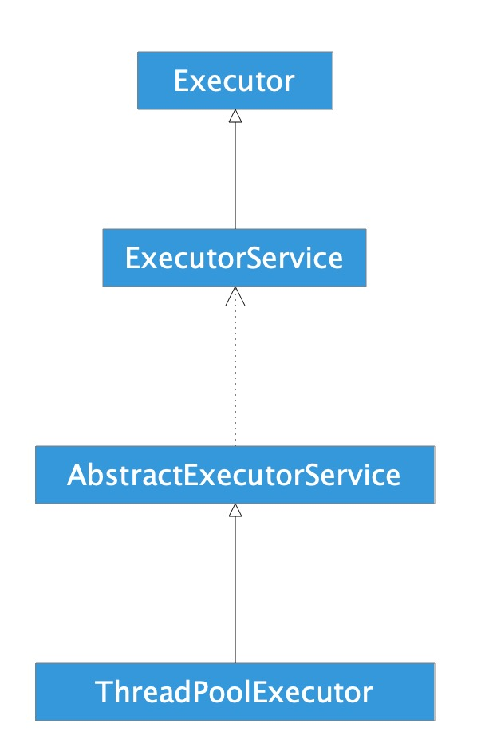
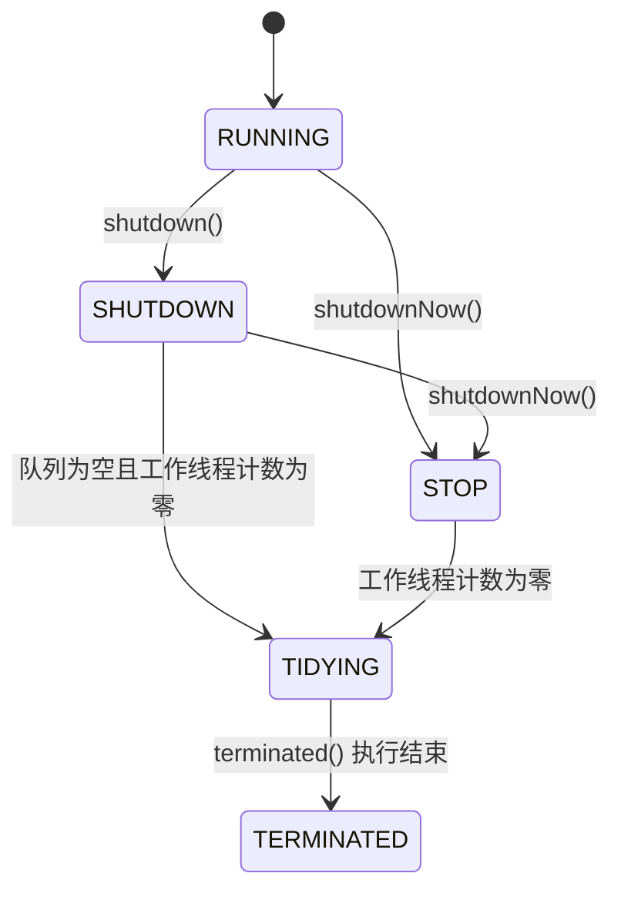

# 线程池简单使用

- shutDown()，关闭线程池，需要执行完已提交的任务；
- shutDownNow()，关闭线程池，并尝试结束已提交的任务；
- allowCoreThreadTimeOut(boolen)，允许核心线程闲置超时回收；
- execute()，提交任务无返回值；
- submit()，提交任务有返回值；

## 示例

```java
public class Main {

    public static void main(String[] args) {
        ExecutorService service = Executors.newCachedThreadPool();
        for (int i = 0; i < 5; i++) {
            service.execute(new MyRunnable());
        }

        List<Future<Long>> futures = new ArrayList<>();
        for (int i = 0; i < 5; i++) {
            futures.add(service.submit(new MyCallable()));
        }
        for (int i = 0; i < 5; i++) {
            try {
                System.out.println(futures.get(i).get());
            } catch (ExecutionException | InterruptedException e) {
                e.printStackTrace();
            }
        }

        service.shutdown();
    }

    private static class MyRunnable implements Runnable {

        @Override
        public void run() {
            System.out.println("Runnable:" +
                    Thread.currentThread().getName() +
                    "##" + System.currentTimeMillis());
        }
    }

    private static class MyCallable implements Callable<Long> {

        @Override
        public Long call() {
            System.out.println("Callable:" +
                    Thread.currentThread().getName() +
                    "##" + System.currentTimeMillis());
            return System.currentTimeMillis();
        }
    }

}
```

log

```
Runnable:pool-1-thread-1##1567044193328
Runnable:pool-1-thread-5##1567044193328
Runnable:pool-1-thread-4##1567044193328
Runnable:pool-1-thread-2##1567044193328
Runnable:pool-1-thread-3##1567044193328
Callable:pool-1-thread-5##1567044193329
Callable:pool-1-thread-4##1567044193329
Callable:pool-1-thread-1##1567044193329
Callable:pool-1-thread-2##1567044193329
Callable:pool-1-thread-3##1567044193329
1567044193329
1567044193329
1567044193329
1567044193329
1567044193329
```

# 线程

一般实现线程的方法有两种，一种是类继承Thread，一种是实现接口Runnable。这两种方式的优缺点如何呢？

Java是单继承但可以调用多个接口，所以看起来Runnable更加好一些。

**继承Thread**

```java
class MyThread extends Thread(){
    @Override
    public void run() {
        super.run();
        Log.i(Thread.currentThread().getId());
    }
}
new MyThread().start();
```

**实现Runnable接口**

```java
class MyThread implements Runnable{
    @Override
    public void run() {
        Log.i("MyThread", Thread.currentThread().getName());
    }
}
MyThreaed myThread = new MyThread();
new Thread(myThread).start();
```

当调用Thread时，会有两种方式：

```java
Thread myThread = new Thread();
myThread.run();
myThread.start();
```

run()方法只是调用了Thread实例的run()方法而已，它仍然运行在主线程上，而start()方法会开辟一个新的线程，在新的线程上调用run()方法，此时它运行在新的线程上。

Runnable只是一个接口，所以单看这个接口它和线程毫无瓜葛。Thread调用了Runnable接口中的方法用来在线程中执行任务。

```java
public interface Runnable {
    public void run();
}

public interface Callable<V> {
    V call() throws Exception;
}
```

而Thread类只支持Runnable接口，由此引入FutureTask的概念。

# 线程池相关类介绍

## Executor

```java
public interface Executor {
    void execute(Runnable command);
}
```

Executor是一个接口内部只有一个execute方法，用来运行Runnable对象。

在此接口的文档中提到，这个接口的作用是**负责运行Runnable任务**，并不保证异步执行。

此接口虽然是线程池框架中的一员，但是本身与线程没有关联。

## Runnable

```java
public interface Runnable {
    void run();
}
```

描述任务，没有返回值。

## ExecutorService

```java
public interface ExecutorService extends Executor {
    void shutdown();
    List<Runnable> shutdownNow();
	boolean isShutdown();
    boolean isTerminated();
    boolean awaitTermination(long timeout, TimeUnit unit) throws InterruptedException;
    <T> Future<T> submit(Callable<T> task);
    <T> Future<T> submit(Runnable task, T result);
    Future<?> submit(Runnable task);
    <T> List<Future<T>> invokeAll(Collection<? extends Callable<T>> tasks) throws InterruptedException;
    <T> List<Future<T>> invokeAll(Collection<? extends Callable<T>> tasks, long timeout, TimeUnit unit) throws InterruptedException;
    <T> T invokeAny(Collection<? extends Callable<T>> tasks) throws InterruptedException, ExecutionException;
    <T> T invokeAny(Collection<? extends Callable<T>> tasks, long timeout, TimeUnit unit) throws InterruptedException, ExecutionException, TimeoutException;
}

```

ExecutorService是描述线程池内部机制的一个接口。提供了开启和关闭线程池的方法，以及能够运行带有返回值的任务。

**shutdown和shutdownNow的区别**

1.   shutdown调用后，不可以再submit新的task，已经submit的将继续执行。
2.   shutdownNow试图停止当前正执行的task，并返回尚未执行的task的list

## Callable

```java
public interface Callable<V> {
    V call() throws Exception;
}
```

与Runnable相似，带有返回值。

## Future

```java
public interface Future<V> {
    boolean cancel(boolean mayInterruptIfRunning);
    boolean isCancelled();
    boolean isDone();
    V get() throws InterruptedException, ExecutionException;
    V get(long timeout, TimeUnit unit) throws InterruptedException, ExecutionException, TimeoutException;
}
```

Future描述的是一个任务运行结果的情况，如任务是否被取消、任务完成后的返回值。

## ThreadFactory

```java
public interface ThreadFactory {
    Thread newThread(Runnable r);
}
```

ThreadFactory线程工厂，创建线程的。

## ThreadPoolExecutor

以上都是对线程池的抽象描述，ThreadPoolExecutor才是线程池的真正实现。ThreadPoolExecutor见分析。

## Executors

Executors内部提供了默认的线程工厂，以及一些具体的线程池

**FixedThreadPool：**

- 线程数量固定（需用户指定），当线程处于空闲状态也不会被回收，除非线程池被关闭。
- 只有核心线程，并且没有超时机制，另外任务队列没有大小限制。

**CachedThreadPool：**

- 线程数量不定，只有非核心线程，最大的线程数为Integer.MAX_VALUE
- 空闲线程具有超时机制，超过60秒就会被回收。
- 适合大量耗时少的任务。

**ScheduledThreadPool：**

- 核心线程数量固定，非核心线程没有限制，非核心线程闲置时会被立即回收。
- 主要用于执行定时任务和具有固定周期的重复任务。

**SingleThreadExecutor：**

- 只有一个核心线程，确保所有的任务都在同一个线程按顺序执行
- 意义在于统一所有的外界任务到一个线程，使得不需要处理同步问题。

## FutureTask

FutureTask 实现了 Runnable 和 Future，所以兼顾两者优点，既可以在 Thread 中使用，又可以在 ExecutorService 中使用。

```java
public interface Future<V> {
    boolean cancel(boolean mayInterruptIfRunning);
    boolean isCancelled();
    boolean isDone();
    V get() throws InterruptedException, ExecutionException;
    V get(long timeout, TimeUnit unit)
        throws InterruptedException, ExecutionException, TimeoutException;
}
```

使用 FutureTask 的好处是 FutureTask 是为了弥补 Thread 的不足而设计的，它可以让程序员准确地知道线程什么时候执行完成并获得到线程执行完成后返回的结果。FutureTask 是一种可以取消的异步的计算任务，它的计算是通过 Callable 实现的，它等价于可以携带结果的 Runnable，并且有三个状态：等待、运行和完成。完成包括所有计算以任意的方式结束，包括正常结束、取消和异常。

# 类关系图



# ThreadPoolExecutor分析

## 构造方法

```java
public ThreadPoolExecutor(int corePoolSize,
                          int maximumPoolSize,
                          long keepAliveTime,
                          TimeUnit unit,
                          BlockingQueue<Runnable> workQueue) {
    this(corePoolSize, maximumPoolSize, keepAliveTime, unit, workQueue, Executors.defaultThreadFactory(), defaultHandler);
}

public ThreadPoolExecutor(int corePoolSize,
                          int maximumPoolSize,
                          long keepAliveTime,
                          TimeUnit unit,
                          BlockingQueue<Runnable> workQueue,
                          ThreadFactory threadFactory) {
    this(corePoolSize, maximumPoolSize, keepAliveTime, unit, workQueue, threadFactory, defaultHandler);
}

public ThreadPoolExecutor(int corePoolSize,
                          int maximumPoolSize,
                          long keepAliveTime,
                          TimeUnit unit,
                          BlockingQueue<Runnable> workQueue,
                          RejectedExecutionHandler handler) {
    this(corePoolSize, maximumPoolSize, keepAliveTime, unit, workQueue, Executors.defaultThreadFactory(), handler);
}

public ThreadPoolExecutor(int corePoolSize,
                          int maximumPoolSize,
                          long keepAliveTime,
                          TimeUnit unit,
                          BlockingQueue<Runnable> workQueue,
                          ThreadFactory threadFactory,
                          RejectedExecutionHandler handler) {
    if (corePoolSize < 0 ||
        maximumPoolSize <= 0 ||
        maximumPoolSize < corePoolSize ||
        keepAliveTime < 0)
        throw new IllegalArgumentException();
    if (workQueue == null || threadFactory == null || handler == null) 
      throw new NullPointerException();
  
    this.corePoolSize = corePoolSize;
    this.maximumPoolSize = maximumPoolSize;
    this.workQueue = workQueue;
    this.keepAliveTime = unit.toNanos(keepAliveTime);
    this.threadFactory = threadFactory;
    this.handler = handler;
}
```

## 参数解释

- int corePoolSize：该线程池中核心线程数最大值
  核心线程：线程池新建线程的时候，如果当前线程总数小于corePoolSize，则新建的是核心线程，如果超过corePoolSize，则新建的是非核心线程。核心线程默认情况下会一直存活在线程池中，即使这个核心线程啥也不干(闲置状态)。
  如果指定ThreadPoolExecutor的allowCoreThreadTimeOut这个属性为true，那么核心线程如果不干活(闲置状态)的话，超过一定时间(时长下面参数决定)，就会被销毁掉。
- int maximumPoolSize：该线程池中线程总数最大值
  线程总数 = 核心线程数 + 非核心线程数。
- long keepAliveTime：该线程池中非核心线程闲置超时时长
  一个非核心线程，如果不干活(闲置状态)的时长超过这个参数所设定的时长，就会被销毁掉，如果设置allowCoreThreadTimeOut = true，则会作用于核心线程。
- BlockingQueue workQueue：该线程池中的任务队列，维护着等待执行的Runnable对象
  当所有的核心线程都在干活时，新添加的任务会被添加到这个队列中等待处理，如果队列满了，则新建非核心线程执行任务。
  常用的workQueue类型：
  - SynchronousQueue
  这个队列接收到任务的时候，会直接提交给线程处理，而不保留它，如果所有线程都在工作怎么办？那就新建一个线程来处理这个任务！所以为了保证不出现“线程数达到了maximumPoolSize而不能新建线程”的错误，使用这个类型队列的时候，maximumPoolSize一般指定成Integer.MAX_VALUE，即无限大。
  - LinkedBlockingQueue
  这个队列接收到任务的时候，如果当前线程数小于核心线程数，则新建线程(核心线程)处理任务；如果当前线程数等于核心线程数，则进入队列等待。由于这个队列没有最大值限制，即所有超过核心线程数的任务都将被添加到队列中，这也就导致了maximumPoolSize的设定失效，因为总线程数永远不会超过corePoolSize
  - ArrayBlockingQueue
  可以限定队列的长度，接收到任务的时候，如果没有达到corePoolSize的值，则新建线程(核心线程)执行任务，如果达到了，则入队等候，如果队列已满，则新建线程(非核心线程)执行任务，又如果总线程数到了maximumPoolSize，并且队列也满了，则发生错误
  - DelayQueue
  队列内元素必须实现Delayed接口，这就意味着你传进去的任务必须先实现Delayed接口。这个队列接收到任务时，首先先入队，只有达到了指定的延时时间，才会执行任务
- ThreadFactory threadFactory
  创建线程的方式，这是一个接口，new的时候需要实现的Thread newThread(Runnable r)方法。
- RejectedExecutionHandler handler
  当提交任务数超过maxmumPoolSize+workQueue之和时，任务会交给RejectedExecutionHandler来处理；jdk1.5提供了四种饱和策略 ：
  - AbortPolicy 
    默认。直接抛异常。
  - CallerRunsPolicy 
    只用调用者所在的线程执行任务，重试添加当前的任务，它会自动重复调用execute()方法
  - DiscardOldestPolicy 
    丢弃任务队列中最久的任务。
  - DiscardPolicy 
    丢弃当前任务。
    
## 提交任务

可以向ThreadPoolExecutor提交两种任务：Callable和Runnable。

- Callable 
  该类任务有返回结果，可以抛出异常。 
  通过submit函数提交，返回Future对象。 
  可通过get获取执行结果。
- Runnable 
  该类任务只执行，无法获取返回结果，并在执行过程中无法抛异常。 
  通过execute提交。
  
## 关闭线程池

关闭线程池有两种方式：shutdown和shutdownNow，关闭时，会遍历所有的线程，调用它们的interrupt函数中断线程。但这两种方式对于正在执行的线程处理方式不同。

- shutdown() 
  仅停止阻塞队列中等待的线程，那些正在执行的线程就会让他们执行结束。
- shutdownNow() 
  不仅会停止阻塞队列中的线程，而且会停止正在执行的线程。

demo log：

```
08:21:13.288 27249-27562 first runnable start
08:21:13.668 27249-27249 线程池shutdown
08:21:15.289 27249-27562 first runnable end
08:21:15.289 27249-27562 second runnable start
08:21:17.291 27249-27562 second runnable end

08:27:02.681 29525-29848 first runnable start
08:27:03.116 29525-29525 shutdownNow
08:27:03.116 29525-29525 shutdownNow [MyRunnable{tag='second'}]
08:27:03.116 29525-29848 first 线程被打断
08:27:03.116 29525-29848 first runnable end
```

上部分是shutdown，正在执行和已经在队列中的任务会继续执行。

下部分是shutdownNow，会停止正在执行的线程，并且返回未执行的任务。

## 设置合理的线程池大小

任务一般可分为：CPU密集型、IO密集型、混合型，对于不同类型的任务需要分配不同大小的线程池。

- CPU密集型任务 
  尽量使用较小的线程池，一般为CPU核心数+1。 
  因为CPU密集型任务使得CPU使用率很高，若开过多的线程数，只能增加上下文切换的次数，因此会带来额外的开销。
- IO密集型任务 
  可以使用稍大的线程池，一般为2*CPU核心数。 
  IO密集型任务CPU使用率并不高，因此可以让CPU在等待IO的时候去处理别的任务，充分利用CPU时间。
- 混合型任务 
  可以将任务分成IO密集型和CPU密集型任务，然后分别用不同的线程池去处理。 
  只要分完之后两个任务的执行时间相差不大，那么就会比串行执行来的高效。 
  因为如果划分之后两个任务执行时间相差甚远，那么先执行完的任务就要等后执行完的任务，最终的时间仍然取决于后执行完的任务，而且还要加上任务拆分与合并的开销，得不偿失。

# Callable原理

Callable的实现原理主要是ExecutorService的submit的实现原理。

**基本使用**

```java
private void test2() {
    Callable<String> callable = new MyCallable("mezzsy");
    Future<String> future = getSingleThreadPool().submit(callable);
    try {
        String res = future.get();
        Log.i(TAG, "test2: " + res);
    } catch (ExecutionException | InterruptedException e) {
        e.printStackTrace();
    }
}
```

## AbstractExecutorService#submit

```java
public Future<?> submit(Runnable task) {
    if (task == null) throw new NullPointerException();
    RunnableFuture<Void> ftask = newTaskFor(task, null);
    execute(ftask);
    return ftask;
}
```

```java
public <T> Future<T> submit(Callable<T> task) {
    if (task == null) throw new NullPointerException();
    RunnableFuture<T> ftask = newTaskFor(task);
    execute(ftask);
    return ftask;
}
```

```java
protected <T> RunnableFuture<T> newTaskFor(Callable<T> callable) {
    return new FutureTask<T>(callable);
}
```

ExecutorService会将Runnable和Callable封装成一个FutureTask。execute会执行FutureTask的run方法。

## FutureTask的构造

```java
public FutureTask(Callable<V> callable) {
    if (callable == null)
        throw new NullPointerException();
    this.callable = callable;
    this.state = NEW;
}

public FutureTask(Runnable runnable, V result) {
    this.callable = Executors.callable(runnable, result);
    this.state = NEW;
}
```

```java
public static <T> Callable<T> callable(Runnable task, T result) {
    if (task == null)
        throw new NullPointerException();
    return new RunnableAdapter<T>(task, result);
}
```

```java
private static final class RunnableAdapter<T> implements Callable<T> {
    private final Runnable task;
    private final T result;
    RunnableAdapter(Runnable task, T result) {
        this.task = task;
        this.result = result;
    }
    public T call() {
        task.run();
        return result;
    }
}
```

FutureTask的构造是对Callable和Runnable的封装，对于Runnable，是将其包装成返回指定结果的Callable。

## 执行

上面说到，execute会执行FutureTask的run方法，FutureTask的run方法就是执行callable的call方法。

FutureTask的get方法就是等待call方法执行完，然后返回结果。

# 几个类/接口的关系


1.  Runnable（接口）表示一个不带返回结果的可执行任务
2.  Callable（接口）表示一个带返回结果的可执行任务
3.  Future（接口）表示一个可执行任务的执行情况
4.  RunnableFuture（接口）继承Runnable和Future，表示一个不带返回结果的可执行任务及其执行情况。
5.  FutureTask（类）实现了RunnableFuture，是对Runnable和Callable的封装，用于可执行任务及其执行情况。

# 如何停止Java线程

## stop

```java
/**
 * 测试停止Java线程
 * 用stop的方式停止
 */
private static void testStopThread() {
    MyThread thread = new MyThread();
    thread.start();
    try {
        Thread.sleep(1000);
    } catch (InterruptedException e) {
        e.printStackTrace();
    }
    thread.stop();
    System.out.println("End");
}

public static class MyThread extends Thread {
    @Override
    public void run() {
        while (true) {
            System.out.println("run");
            try {
                Thread.sleep(1000);
            } catch (InterruptedException e) {
                e.printStackTrace();
            }
        }
    }
}
```

```
run
End

Process finished with exit code 0
```

经测试，线程可以被停止。

## interrupt + return

```java
public static class MyThread2 extends Thread {

    public static void test() {
        MyThread2 thread = new MyThread2();
        thread.start();
        thread.interrupt();
        System.out.println("End");
    }

    @Override
    public void run() {
        while (!isInterrupted()) {
            System.out.println("run");
        }
        System.out.println("interrupt");
    }
}
```

```
End
interrupt
```

## interrupt + throw

```java
public static class MyThread3 extends Thread {

    public static void test() {
        MyThread3 thread = new MyThread3();
        thread.start();
        thread.interrupt();
        System.out.println("Main End");
    }

    @Override
    public void run() {
        try {
            while (true) {
                if (isInterrupted()) {
                    throw new InterruptedException();
                }
                System.out.println("run");
            }
        } catch (InterruptedException e) {
            System.out.println("throw InterruptedException");
            e.printStackTrace();
        }
    }
}
```

```
Main End
throw InterruptedException
java.lang.InterruptedException
	at com.mezzsy.javademo.experiment.TestConcurrent$MyThread3.run(TestConcurrent.java:30)
```

## 总结

1.   线程调用stop方法会被暴力停止，该方法已弃用。该方法有可能使一些请理性的工作得不到完成。
2.   调用interrupt标记为中断状态后，在run方法中判断当前线程状态，如果为中断状态则return，能达到停止线程的效果。
3.   用“抛异常”的方法来实现线程的停止，因为在catch块中还可以将异常向上抛，使线程停止的事件得以传播。

# 参考

1. Java线程池-ThreadPoolExecutor原理分析与实战，[Zach_ZSZ](https://blog.csdn.net/z_s_z2016)，https://blog.csdn.net/z_s_z2016/article/details/81674893。

# 从源码角度分析 Java 线程池

本节以 **OpenJDK 8u412，标签 `jdk8u412-b08`** 为基准，围绕 `ThreadPoolExecutor` 重新梳理线程池的实现。下面的分析可以独立阅读；前文涉及线程池执行、回收和关闭机制的说明，以本节核对后的结论为准。

阅读时抓住两条主线：

- **线程池管理工作线程**：决定任务交给谁执行、何时增加线程、何时回收线程。
- **FutureTask 管理单个任务的完成状态**：保存结果或异常，支持等待和取消。

代码均为该版本的源码摘录，部分省略原注释并补充中文说明；省略类成员或方法片段时会单独标明。这些摘录用于理解实现，不是可直接独立编译的程序。本文讨论普通平台线程池，不涉及虚拟线程和 `ForkJoinPool`。

## 先看整体结构和调用链

几个核心类型的职责如下：

| 类型 | 职责 |
| --- | --- |
| `Executor` | 定义 `execute(Runnable)`，描述执行任务的能力，接口本身不保证异步执行 |
| `ExecutorService` | 增加 `submit`、关闭、等待终止等方法 |
| `AbstractExecutorService` | 提供 `submit` 等方法的默认实现，将任务包装成 `RunnableFuture` |
| `ThreadPoolExecutor` | 管理工作线程、任务队列、线程池状态和拒绝策略 |
| `Worker` | 绑定一个工作线程，记录初始任务和任务执行期间的锁状态 |
| `FutureTask` | 默认的 `RunnableFuture` 实现，负责执行计算、保存结果并通知等待者 |

`ThreadPoolExecutor` 继承 `AbstractExecutorService`。普通线程池的 `submit` 最终仍然调用 `execute`，因此不需要为 `Callable` 单独设计一套调度机制。

```text
提交线程：
  execute(Runnable) ───────────────────────────┐
                                              ↓
  submit(Runnable / Callable) → FutureTask → execute
                                              │
                         ┌────────────────────┼──────────────────┐
                         ↓                    ↓                  ↓
                  addWorker(task, ...)   workQueue.offer     reject(task)
                  新线程的初始任务         等待工作线程取走      拒绝策略

工作线程：
  Thread.start → Worker.run → runWorker
                                │
                     firstTask 或 getTask()
                                ↓
                            task.run()
                                │
                如果 task 是 FutureTask，则调用 Callable.call()
                                │
                     继续 getTask()，重复执行
```

理解线程复用的关键是：**一个工作线程只启动一次，在 `runWorker` 的循环里不断调用不同任务的 `run()`。**

## 核心字段和七个构造参数

### 任务队列和工作线程集合

```java
private final BlockingQueue<Runnable> workQueue;
private final ReentrantLock mainLock = new ReentrantLock();
private final HashSet<Worker> workers = new HashSet<Worker>();
private final Condition termination = mainLock.newCondition();
```

- `workQueue` 保存等待执行的任务。队列中存放的是任务，不是线程。
- `workers` 保存已登记的 `Worker`，每个 `Worker` 关联一个工作线程。
- `mainLock` 保护 `workers` 的增删、统计信息更新以及关闭时的部分操作。
- `termination` 用于在完全终止时唤醒调用 `awaitTermination()` 的线程。

`mainLock` 不会包围整个任务执行过程，否则线程池中的任务就会被串行执行。每个 `Worker` 还持有自己的锁，作用将在后文说明。

### 构造参数如何影响源码分支

| 参数 | 在实现中的作用 |
| --- | --- |
| `corePoolSize` | `execute` 优先创建线程时使用的数量阈值；默认也是空闲回收时希望保留的线程数量 |
| `maximumPoolSize` | 任务无法入队时，继续增加工作线程使用的数量上限 |
| `keepAliveTime` | 允许超时回收的工作线程，等待下一个任务的最长时间 |
| `unit` | `keepAliveTime` 的时间单位，构造时统一转换成纳秒 |
| `workQueue` | 任务暂存或直接交接的方式，直接影响是否触发扩容 |
| `threadFactory` | 创建实际的 `Thread`，可以配置名称、守护属性和未捕获异常处理器等 |
| `handler` | 线程池无法接收任务时调用的拒绝策略 |

构造方法主要校验并保存参数，**默认不会立即创建 `corePoolSize` 个线程**。线程通常随任务提交而创建，也可以使用 `prestartCoreThread()` 或 `prestartAllCoreThreads()` 预启动。

还要避免一个常见误解：**源码没有给每个线程永久标记“核心”或“非核心”身份。** `Worker` 中不存在 `isCore` 字段。`addWorker` 的 `core` 参数只决定创建时使用哪个数量上限；是否超时回收，要在 `getTask()` 中根据当时的线程总数和配置重新判断。

## ctl：同时维护线程池状态和工作线程数量

### 为什么将两个值放进一个整数

```java
private final AtomicInteger ctl = new AtomicInteger(ctlOf(RUNNING, 0));
private static final int COUNT_BITS = Integer.SIZE - 3;
private static final int CAPACITY   = (1 << COUNT_BITS) - 1;

private static final int RUNNING    = -1 << COUNT_BITS;
private static final int SHUTDOWN   =  0 << COUNT_BITS;
private static final int STOP       =  1 << COUNT_BITS;
private static final int TIDYING    =  2 << COUNT_BITS;
private static final int TERMINATED =  3 << COUNT_BITS;

private static int runStateOf(int c)     { return c & ~CAPACITY; }
private static int workerCountOf(int c)  { return c & CAPACITY; }
private static int ctlOf(int rs, int wc) { return rs | wc; }
```

一个 `int` 有 32 位，这里分成两部分：

```text
高 3 位：runState       低 29 位：workerCount
┌───────────────┬─────────────────────────────┐
│  线程池状态    │        工作线程数量          │
└───────────────┴─────────────────────────────┘
```

创建线程之前，既要确认线程池状态允许创建，也要确认数量没有超限。将两者放进一个原子变量，可以一次读取同一个快照，再使用 CAS 更新。

CAS 可以理解为“只有值仍然等于我刚才读到的值，才执行替换”。如果另一个线程已增加了工作线程数量，或者已经关闭线程池，本次 CAS 就会失败，调用方重新读取并判断。

这里的 `workerCount` 是内部管理的计数，不等于正在执行任务的线程数：空闲工作线程也计入其中；创建时还会先增加计数再启动线程，因此短暂期间也可能与实际存活线程数不同。

### 五种状态及其转换

| 状态 | 接收新任务 | 处理队列任务 | 含义 |
| --- | --- | --- | --- |
| `RUNNING` | 是 | 是 | 正常运行 |
| `SHUTDOWN` | 否 | 是 | 有序关闭，继续处理已接收的任务 |
| `STOP` | 否 | 否 | 停止取队列任务，并尝试中断执行中的任务 |
| `TIDYING` | 否 | 否 | 工作线程计数已归零，正在执行 `terminated()` 钩子 |
| `TERMINATED` | 否 | 否 | 终止处理已完成 |



这些状态的数值单调递增，且 `RUNNING` 为负数。因此源码可以使用 `c < SHUTDOWN` 判断是否正在运行，使用 `c >= STOP` 判断是否已经进入停止阶段。线程池关闭后不能恢复成 `RUNNING`。

## execute：一个任务提交后如何分配

### 三步处理流程

```java
public void execute(Runnable command) {
    if (command == null)
        throw new NullPointerException();

    int c = ctl.get();
    // 第一步：工作线程数量不足 corePoolSize，尝试创建线程。
    if (workerCountOf(c) < corePoolSize) {
        if (addWorker(command, true))
            return;
        c = ctl.get();
    }

    // 第二步：线程池正在运行，尝试将任务入队。
    if (isRunning(c) && workQueue.offer(command)) {
        int recheck = ctl.get();
        if (!isRunning(recheck) && remove(command))
            reject(command);
        else if (workerCountOf(recheck) == 0)
            addWorker(null, false);
    }
    // 第三步：无法入队，尝试按 maximumPoolSize 上限创建线程。
    else if (!addWorker(command, false))
        reject(command);
}
```

在正常运行、线程创建成功的前提下，可以概括为：

1. 工作线程数小于 `corePoolSize`：新建线程执行当前任务。
2. 否则尝试将任务放入队列。
3. 入队失败：尝试增加线程，数量不能超过 `maximumPoolSize`。
4. 仍然失败：调用拒绝策略。

这里有三个值得注意的细节：

- 判断的是**工作线程总数**，不是“正在忙碌的线程数”。即使已有空闲线程，只要数量小于 `corePoolSize`，仍然优先尝试创建线程。
- 使用的是立即返回的 `offer()`，不是等待队列腾出空间的 `put()`。默认提交路径不会通过阻塞入队来等待容量。
- 新建线程可以直接拿到 `command` 作为 `firstTask`，这个任务不必先进入队列。

### 为什么入队成功后还要再次检查

第一次读取状态和 `offer()` 完成之间，其他线程可能执行了 `shutdown()` 或 `shutdownNow()`：

```text
提交线程 A                      关闭线程 B
读取到 RUNNING
                               调用 shutdown()
                               状态变成 SHUTDOWN
offer(command) 成功
再次读取状态，发现已经关闭
尝试 remove(command)，移除成功则调用拒绝策略
```

因此，“入队成功”还不足以说明这次提交已经完成处理，必须再检查一次状态。

`remove(command)` 也可能失败，例如任务已经被工作线程取走。这时 `execute` 不会再通过这个分支拒绝同一个任务。提交与关闭并发发生时，需要结合任务是否仍在队列中理解结果，不能只根据最初的一次状态读取判断。

另一条检查是：**如果队列已有任务，但工作线程数为零，就尝试补一个线程。**

```java
else if (workerCountOf(recheck) == 0)
    addWorker(null, false);
```

这涵盖了 `corePoolSize = 0`，以及已有工作线程恰好全部退出等情况。这里传入 `null`，表示没有专属的初始任务，新线程应直接从队列取任务。

### 用一组任务理解扩容顺序

假设线程池处于 `RUNNING`，`corePoolSize = 2`、`maximumPoolSize = 4`，使用容量为 2 的 `ArrayBlockingQueue`。依次提交任务，并假设这些任务在提交期间一直被阻塞，没有完成：

| 提交任务 | 处理方式 | 工作线程数 | 队列中的任务 |
| --- | --- | --- | --- |
| A | 创建线程执行 A | 1 | 空 |
| B | 创建线程执行 B | 2 | 空 |
| C | 入队 | 2 | C |
| D | 入队 | 2 | C、D |
| E | 队列已满，创建线程执行 E | 3 | C、D |
| F | 队列已满，创建线程执行 F | 4 | C、D |
| G | 无法入队，也无法继续增加线程，触发拒绝策略 | 4 | C、D |

由此可见：**线程池通常先填队列，再扩容到最大线程数。** E、F 可能先于 C、D 开始执行，所以即使工作队列是 FIFO，也不能据此认为整个线程池严格按提交顺序启动任务。

## addWorker：安全地增加一个工作线程

该方法分为两个阶段：先增加 `workerCount`，再创建、登记并启动线程。

### 先通过 CAS 预留线程名额

下面是 `addWorker` 的第一阶段源码：

```java
retry:
for (;;) {
    int c = ctl.get();
    int rs = runStateOf(c);

    if (rs >= SHUTDOWN &&
        !(rs == SHUTDOWN &&
          firstTask == null &&
          !workQueue.isEmpty()))
        return false;

    for (;;) {
        int wc = workerCountOf(c);
        if (wc >= CAPACITY ||
            wc >= (core ? corePoolSize : maximumPoolSize))
            return false;
        if (compareAndIncrementWorkerCount(c))
            break retry;
        c = ctl.get();
        if (runStateOf(c) != rs)
            continue retry;
    }
}
```

这段代码解决了两个问题：

1. **状态是否允许创建线程。** `RUNNING` 时可以尝试创建；`STOP` 及之后不允许创建。`SHUTDOWN` 有一个例外：`firstTask == null` 且队列非空时，允许创建线程继续处理已接收的任务。
2. **并发创建是否超过上限。** 多个提交线程可能同时发现“还差一个线程”，因此不能直接增加计数，必须通过 CAS 竞争名额。

外层循环重新判断线程池状态，内层循环尝试增加线程计数。如果 CAS 失败但状态没变，可以在内层重试；如果状态变了，则回到外层重新判断是否允许创建。

`core == true` 使用 `corePoolSize`，`core == false` 使用 `maximumPoolSize`。这里比较的始终是同一个 `workerCount`。

### 再创建、登记和启动线程

下面是通过 CAS 后的第二阶段源码：

```java
boolean workerStarted = false;
boolean workerAdded = false;
Worker w = null;
try {
    w = new Worker(firstTask);
    final Thread t = w.thread;
    if (t != null) {
        final ReentrantLock mainLock = this.mainLock;
        mainLock.lock();
        try {
            int rs = runStateOf(ctl.get());
            if (rs < SHUTDOWN ||
                (rs == SHUTDOWN && firstTask == null)) {
                if (t.isAlive())
                    throw new IllegalThreadStateException();
                workers.add(w);
                int s = workers.size();
                if (s > largestPoolSize)
                    largestPoolSize = s;
                workerAdded = true;
            }
        } finally {
            mainLock.unlock();
        }
        if (workerAdded) {
            t.start();
            workerStarted = true;
        }
    }
} finally {
    if (!workerStarted)
        addWorkerFailed(w);
}
return workerStarted;
```

先预留名额，再完成实际创建，是因为 `ThreadFactory.newThread()` 和 `Thread.start()` 都可能失败。线程工厂应返回尚未启动的线程。

登记 `Worker` 时持有 `mainLock`，并再次检查状态，避免在线程池已经进入不允许创建的状态后继续登记。真正的 `t.start()` 位于释放 `mainLock` 之后。

如果创建或启动没有成功，`addWorkerFailed(w)` 会在锁内执行以下清理：

- 从 `workers` 移除可能已经登记的 `Worker`。
- 减少先前预留的 `workerCount`。
- 调用 `tryTerminate()`，检查本次失败是否使线程池满足终止条件。

注意：失败清理不代表所有失败都会变成拒绝策略。线程工厂或 `start()` 抛出的异常，仍可能向提交线程传播。

## Worker：工作线程与执行状态的封装

### Thread 执行的是 Worker

下面省略序列化字段和锁的辅助方法，保留 `Worker` 的主要结构：

```java
private final class Worker
    extends AbstractQueuedSynchronizer
    implements Runnable {

    final Thread thread;
    Runnable firstTask;
    volatile long completedTasks;

    Worker(Runnable firstTask) {
        setState(-1);
        this.firstTask = firstTask;
        this.thread = getThreadFactory().newThread(this);
    }

    public void run() {
        runWorker(this);
    }
}
```

`newThread(this)` 传入的是 `Worker` 自己，而不是用户提交的任务。因此调用 `thread.start()` 后，执行路径是：

```text
Thread.run() → Worker.run() → ThreadPoolExecutor.runWorker(worker)
```

`firstTask` 是创建线程时顺带交给它的任务。执行完这个任务后，线程仍会继续从共享队列获取任务。

### Worker 为什么需要一把不可重入锁

`Worker` 继承 AQS，实现了一把简单的独占、不可重入锁。下面是其获取和释放逻辑：

```java
protected boolean tryAcquire(int unused) {
    if (compareAndSetState(0, 1)) {
        setExclusiveOwnerThread(Thread.currentThread());
        return true;
    }
    return false;
}

protected boolean tryRelease(int unused) {
    setExclusiveOwnerThread(null);
    setState(0);
    return true;
}
```

这里的 AQS 状态与 `ctl` 中的线程池状态无关：

| Worker 的 AQS 状态 | 含义 |
| --- | --- |
| `-1` | 刚构造，尚未进入允许线程池中断它的阶段 |
| `0` | 未持锁，可以尝试作为空闲工作线程处理 |
| `1` | 已持锁，通常正处于任务执行区间 |

工作线程执行任务前获取这把锁，执行结束后释放；等待队列任务时不持有它。`shutdown()` 尝试通过 `w.tryLock()` 获取锁，只有成功时才中断该工作线程，从而避免把“唤醒空闲线程”的中断发送给执行中的任务。

不可重入还有一个具体作用：如果任务内部调用 `setCorePoolSize()` 等线程池控制方法，当前任务已经持有 `Worker` 锁，再次 `tryLock()` 会失败，避免把自己误判为空闲线程。

这把锁只参与线程池内部的空闲判断和中断协调，**不会让任务访问的共享业务数据自动变得线程安全**。`shutdownNow()` 也不会遵守“只中断空闲 Worker”的限制。

## runWorker：线程复用发生在哪里

### 持续取任务并执行

```java
final void runWorker(Worker w) {
    Thread wt = Thread.currentThread();
    Runnable task = w.firstTask;
    w.firstTask = null;
    w.unlock(); // 将初始状态从 -1 释放为 0，允许线程池中断。
    boolean completedAbruptly = true;
    try {
        while (task != null || (task = getTask()) != null) {
            w.lock();
            if ((runStateAtLeast(ctl.get(), STOP) ||
                 (Thread.interrupted() &&
                  runStateAtLeast(ctl.get(), STOP))) &&
                !wt.isInterrupted())
                wt.interrupt();
            try {
                beforeExecute(wt, task);
                Throwable thrown = null;
                try {
                    task.run();
                } catch (RuntimeException x) {
                    thrown = x; throw x;
                } catch (Error x) {
                    thrown = x; throw x;
                } catch (Throwable x) {
                    thrown = x; throw new Error(x);
                } finally {
                    afterExecute(task, thrown);
                }
            } finally {
                task = null;
                w.completedTasks++;
                w.unlock();
            }
        }
        completedAbruptly = false;
    } finally {
        processWorkerExit(w, completedAbruptly);
    }
}
```

整个循环可以拆成五步：

1. 第一次优先执行 `firstTask`，后续调用 `getTask()` 获取任务。
2. 获取当前 `Worker` 的锁，进入任务执行区间。
3. 处理线程中断标记，再调用 `beforeExecute()`。
4. 调用任务的 `run()`，随后调用 `afterExecute()`。
5. 清除任务引用、累计任务次数、释放锁，再进入下一轮。

`task.run()` 只是普通方法调用，运行在当前工作线程上。线程池复用的就是这个已经启动的线程，不会为每一个任务重新调用 `Thread.start()`。

`beforeExecute`、`afterExecute` 默认都是空方法，可由子类覆盖以记录任务耗时或整理线程上下文。统计字段 `completedTasks` 的增加发生在 `finally` 中，因此不能把这个计数直接理解为“业务成功次数”。

### 为什么执行任务前要处理中断标记

这一段源码同时处理两种情况：

- 线程池尚未进入 `STOP`：调用 `Thread.interrupted()` 检查并清除已有中断标记，避免前一次任务或线程池控制操作留下的标记直接影响下一次任务。
- 线程池已经进入 `STOP`：确保当前工作线程带有中断标记，使任务有机会响应 `shutdownNow()`。

`Thread.interrupted()` 会清除标记，因此清除后必须再次读取线程池状态，防止恰好与 `shutdownNow()` 并发而丢失停止信号。这是这里两次检查 `STOP` 的原因。

中断标记不等于强制终止。对于已经从队列取出、或作为 `firstTask` 交给工作线程的任务，即使此时线程池进入 `STOP`，也不能保证用户的 `run()` 一定不会被调用或继续执行。

### 任务抛异常后为什么会影响工作线程

如果直接通过 `execute` 提交的普通 `Runnable` 抛出未捕获的 `RuntimeException` 或 `Error`，`runWorker` 会记录异常、调用 `afterExecute`，然后继续向外抛出。循环因此结束，`completedAbruptly` 保持为 `true`，最后执行 `processWorkerExit()`。

也就是说，线程池会清理异常退出的工作线程，再根据状态尝试补充线程；不会在同一工作线程上无条件吞掉异常并继续循环。

`beforeExecute()` 或 `afterExecute()` 自身抛异常，也可能导致工作线程退出。其中 `beforeExecute()` 抛异常时，任务尚未执行，`afterExecute()` 也不会被调用。

通过 `submit` 提交时，异常通常被外层的 `FutureTask` 捕获，因此表现不同，后文会继续展开。

## getTask：阻塞等待和空闲回收

### 源码中的退出条件

```java
private Runnable getTask() {
    boolean timedOut = false;

    for (;;) {
        int c = ctl.get();
        int rs = runStateOf(c);

        // 已停止，或有序关闭且队列已空：当前工作线程退出。
        if (rs >= SHUTDOWN && (rs >= STOP || workQueue.isEmpty())) {
            decrementWorkerCount();
            return null;
        }

        int wc = workerCountOf(c);
        boolean timed = allowCoreThreadTimeOut || wc > corePoolSize;

        if ((wc > maximumPoolSize || (timed && timedOut))
            && (wc > 1 || workQueue.isEmpty())) {
            if (compareAndDecrementWorkerCount(c))
                return null;
            continue;
        }

        try {
            Runnable r = timed ?
                workQueue.poll(keepAliveTime, TimeUnit.NANOSECONDS) :
                workQueue.take();
            if (r != null)
                return r;
            timedOut = true;
        } catch (InterruptedException retry) {
            timedOut = false;
        }
    }
}
```

`getTask()` 有两类结果：

- 返回任务：`runWorker()` 继续执行。
- 返回 `null`：`runWorker()` 结束循环，工作线程退出。

### take 和 poll 如何决定回收行为

决定是否使用超时等待的表达式是：

```java
boolean timed = allowCoreThreadTimeOut || wc > corePoolSize;
```

| 条件 | 取任务方式 | 行为 |
| --- | --- | --- |
| 未开启核心线程超时，且当前线程数不超过 `corePoolSize` | `take()` | 等待任务到来，或者被中断唤醒 |
| 开启核心线程超时，或当前线程数超过 `corePoolSize` | `poll(keepAliveTime, unit)` | 最多等待指定时长，超时未取到任务则返回 `null` |

`poll()` 超时后，并不会当场无条件结束线程，而是设置 `timedOut = true`，回到循环顶部重新判断当前配置、线程数量和线程池状态，然后通过 CAS 减少计数并退出。

例如 `corePoolSize = 2`、当前有 4 个线程，多个空闲线程都可能进入超时等待。当其中两个成功退出后，其余线程重新检查数量，发现已经不超过 2，就不再按“超过核心数量”的条件回收。

因此，创建得早的线程也可能退出，创建得晚的线程也可能留下。**保留的是符合数量策略的一组工作线程，不是固定身份的那几个线程。**

`allowCoreThreadTimeOut(true)` 使所有工作线程都有机会超时退出；调用该方法时 `keepAliveTime` 必须大于 0。

### 为什么不能只看一次超时

退出判断中的另一个条件是：

```java
wc > 1 || workQueue.isEmpty()
```

在尚需处理队列任务的阶段，如果只剩一个工作线程且队列非空，不会仅因为一次超时就让最后一个线程退出。对于延迟队列尤其如此：队列中有元素，不代表现在就能取到到期任务。

`wc > maximumPoolSize` 则支持动态缩小最大线程数。多余工作线程在获取后续任务时检查到新的配置，再走退出路径，而不是由配置方法强行杀死正在执行任务的线程。

### 为什么捕获 InterruptedException 后还要继续循环

空闲线程可能因关闭、调整线程数量等操作而从队列等待中被中断唤醒。被唤醒本身并不说明必须退出，工作线程需要重新检查状态：

- `SHUTDOWN` 且队列仍有任务：继续获取并执行。
- `SHUTDOWN` 且队列为空：退出。
- `STOP` 及之后：退出。
- 仍在 `RUNNING`：按最新配置决定继续等待还是回收。

**线程池回收线程的方式，是让 `getTask()` 返回 `null`，进而让工作线程的 `run()` 正常结束。** 它不依赖一个定时扫描线程，也不调用 `Thread.stop()`。

## processWorkerExit：清理退出线程并决定是否补充

```java
private void processWorkerExit(Worker w, boolean completedAbruptly) {
    if (completedAbruptly)
        decrementWorkerCount();

    final ReentrantLock mainLock = this.mainLock;
    mainLock.lock();
    try {
        completedTaskCount += w.completedTasks;
        workers.remove(w);
    } finally {
        mainLock.unlock();
    }

    tryTerminate();

    int c = ctl.get();
    if (runStateLessThan(c, STOP)) {
        if (!completedAbruptly) {
            int min = allowCoreThreadTimeOut ? 0 : corePoolSize;
            if (min == 0 && !workQueue.isEmpty())
                min = 1;
            if (workerCountOf(c) >= min)
                return;
        }
        addWorker(null, false);
    }
}
```

先看计数为什么分两处减少：

- **正常退出**：`getTask()` 返回 `null` 前已经减少 `workerCount`，这里不能重复减少。
- **异常退出**：任务执行过程中跳出循环，没有经过 `getTask()` 的退出分支，因此在这里减少计数。

接着从 `workers` 中移除该工作线程，汇总统计信息，并尝试推进线程池终止。

最后决定是否补充线程：

- 已经进入 `STOP` 或更后面的状态：不再补充。
- 正常退出：根据 `corePoolSize` 和 `allowCoreThreadTimeOut` 判断是否需要补充；即使允许全部超时，队列非空时也要争取至少保留一个工作线程。
- 异常退出且状态小于 `STOP`：尝试调用 `addWorker(null, false)` 补充线程。

“尝试补充”不等于必然创建成功。`addWorker` 仍会重新检查状态和上限，例如 `SHUTDOWN` 且队列为空时会拒绝创建。

对于异常失败的业务任务，这里补充的是工作线程，**不会自动重新执行那个失败任务**。

## submit 和 FutureTask：结果与异常如何传回来

### submit 先包装，再调用 execute

下面两个方法位于 `AbstractExecutorService`，这里按调用顺序摘录：

```java
public <T> Future<T> submit(Callable<T> task) {
    if (task == null) throw new NullPointerException();
    RunnableFuture<T> ftask = newTaskFor(task);
    execute(ftask);
    return ftask;
}

protected <T> RunnableFuture<T> newTaskFor(Callable<T> callable) {
    return new FutureTask<T>(callable);
}
```

`FutureTask` 实现 `RunnableFuture`，而 `RunnableFuture` 同时继承 `Runnable` 和 `Future`。同一个对象因此有两个使用角度：

- 对工作线程，它是可以调用 `run()` 的任务。
- 对提交线程，它是可以调用 `get()`、`cancel()` 的结果句柄。

`submit` 也支持 `Runnable`：普通重载成功完成后 `get()` 返回 `null`；`submit(runnable, result)` 成功完成后返回调用方预先传入的 `result`。其内部使用 `RunnableAdapter`，先调用 `runnable.run()`，再返回指定结果。

`Runnable.run()` 不能在方法签名中声明受检异常，但完全可以抛出 `RuntimeException` 或 `Error`，也可以通过 `submit()` 提交。不能把 `Runnable` 概括成“无法抛异常、只能用 execute 提交”。

### FutureTask 的真实状态

```java
private volatile int state;
private static final int NEW          = 0;
private static final int COMPLETING   = 1;
private static final int NORMAL       = 2;
private static final int EXCEPTIONAL  = 3;
private static final int CANCELLED    = 4;
private static final int INTERRUPTING = 5;
private static final int INTERRUPTED  = 6;
```

```text
NEW → COMPLETING → NORMAL
NEW → COMPLETING → EXCEPTIONAL
NEW → CANCELLED
NEW → INTERRUPTING → INTERRUPTED
```

这里没有单独的 `RUNNING` 状态：**任务尚未开始和任务正在计算，都可能处于 `NEW`。** 正在执行它的线程记录在 `runner` 字段中。

`COMPLETING` 表示正在写入结果或异常；`INTERRUPTING` 表示正在处理取消中断。这些中间状态使多个线程能够协调“完成”和“取消”的竞争。

JDK 8 的 `FutureTask` 使用 CAS、`volatile state` 和等待线程栈实现同步，并不继承 AQS。不要把它与前面的 `Worker` 锁混淆。

### run 如何执行 Callable 并保存异常

```java
public void run() {
    if (state != NEW ||
        !UNSAFE.compareAndSwapObject(this, runnerOffset,
                                     null, Thread.currentThread()))
        return;
    try {
        Callable<V> c = callable;
        if (c != null && state == NEW) {
            V result;
            boolean ran;
            try {
                result = c.call();
                ran = true;
            } catch (Throwable ex) {
                result = null;
                ran = false;
                setException(ex);
            }
            if (ran)
                set(result);
        }
    } finally {
        runner = null;
        int s = state;
        if (s >= INTERRUPTING)
            handlePossibleCancellationInterrupt(s);
    }
}
```

这段代码最重要的处理有三项：

1. 通过 CAS 设置 `runner`，阻止多个线程同时执行同一个 `FutureTask` 的计算。
2. 调用 `Callable.call()`：成功则 `set(result)`，失败则 `setException(ex)`。
3. 退出前清理 `runner`，如果取消线程仍处于发送中断的阶段，则等待这个阶段完成，避免取消中断被延迟发送到工作线程的后续任务。

`set` 保存正常结果的实现如下，`setException` 结构相同，只是保存异常并转到 `EXCEPTIONAL`：

```java
protected void set(V v) {
    if (UNSAFE.compareAndSwapInt(this, stateOffset, NEW, COMPLETING)) {
        outcome = v;
        UNSAFE.putOrderedInt(this, stateOffset, NORMAL);
        finishCompletion();
    }
}
```

只有成功将 `NEW` 改成 `COMPLETING` 的线程能发布结果。如果取消已经抢先改变了状态，即使 `call()` 随后返回，也不能覆盖取消结果。

写入 `outcome` 后，再通过有序写发布最终状态；读取方检查 `volatile state` 后读取结果。这使结果的可见性由状态读写来保证，`outcome` 本身不需要声明为 `volatile`。

### get 如何等待和唤醒

```java
public V get() throws InterruptedException, ExecutionException {
    int s = state;
    if (s <= COMPLETING)
        s = awaitDone(false, 0L);
    return report(s);
}
```

`get()` 等待的是 `FutureTask` 的完成状态，不是等待整个线程池关闭，也不是调用工作线程的 `join()`。

等待和唤醒过程如下：

1. 结果尚未发布时，`awaitDone()` 将当前等待线程包装成 `WaitNode`。
2. 使用 CAS 将节点放入 `waiters` 栈，再通过 `LockSupport.park()` 挂起等待线程；限时等待使用 `parkNanos()`。
3. 任务完成或被取消时，`finishCompletion()` 取出等待节点，逐个调用 `LockSupport.unpark()`。
4. 被唤醒的线程重新检查状态，然后由 `report()` 返回结果或抛出异常。

检查状态和入栈放在循环中，能够处理任务恰好完成、线程被中断以及虚假唤醒等情况。如果只是处于很短的 `COMPLETING` 阶段，源码会先 `Thread.yield()`，等待结果发布。

| 结果状态 | `get()` 的表现 |
| --- | --- |
| `NORMAL` | 返回 `outcome` 中的计算结果 |
| `EXCEPTIONAL` | 抛出 `ExecutionException`，原异常保存在 `getCause()` 中 |
| 取消相关状态 | 抛出 `CancellationException` |
| 等待期间被中断 | 抛出 `InterruptedException` |
| 限时等待超时 | 抛出 `TimeoutException`，不会因此自动取消任务 |

`finishCompletion()` 还会调用 `done()` 钩子并清理 `callable` 引用。多个线程可以等待同一个 Future；一个等待线程被中断，并不意味着对应任务自动被取消。

### cancel 为什么不保证计算立即停止

```java
public boolean cancel(boolean mayInterruptIfRunning) {
    if (!(state == NEW &&
          UNSAFE.compareAndSwapInt(this, stateOffset, NEW,
              mayInterruptIfRunning ? INTERRUPTING : CANCELLED)))
        return false;
    try {
        if (mayInterruptIfRunning) {
            try {
                Thread t = runner;
                if (t != null)
                    t.interrupt();
            } finally {
                UNSAFE.putOrderedInt(this, stateOffset, INTERRUPTED);
            }
        }
    } finally {
        finishCompletion();
    }
    return true;
}
```

`cancel` 首先争取改变 Future 的状态：

- `cancel(false)`：成功时将状态改成 `CANCELLED`，不发送中断。如果计算已经开始且状态仍是 `NEW`，也可能取消成功，但计算仍会继续，结果不会再被发布。
- `cancel(true)`：成功时将状态改成 `INTERRUPTING`，尝试中断 `runner`，然后转成 `INTERRUPTED`。
- 如果正常完成、异常完成或其他取消操作已经抢先改变状态，本次取消失败。

因此，`cancel(true)` 返回 `true`，表示 Future 的取消状态已经建立，不表示执行任务的线程已经退出。任务如果忽略中断，仍可能继续产生副作用；`isDone()` 为 `true` 也不能据此认定任务代码已经停止。

取消尚在普通 `ThreadPoolExecutor` 队列里的 `FutureTask`，不会自动将它从队列移除。之后工作线程取到它时，`run()` 会因状态不再是 `NEW` 而直接返回；也可以通过线程池的 `remove()` 或 `purge()` 清理相应队列元素。

### execute 与 submit 的异常差异

| 提交方式 | 任务异常由谁处理 | 工作线程是否因该异常退出 |
| --- | --- | --- |
| `execute(普通 Runnable)` | 未捕获异常从 `runWorker` 继续抛出，最终交给线程的未捕获异常处理机制 | 会 |
| `submit(Runnable / Callable)` | 默认由 `FutureTask` 捕获，通过 `Future.get()` 报告 | 通常不会 |
| `execute(FutureTask)` | 同样由 `FutureTask` 捕获 | 通常不会 |

区别来自传入任务的包装方式。`execute` 并非天生无法处理 Future，`submit` 也不是另一套工作线程执行机制。

使用默认 `FutureTask` 时，业务异常通常不会从它的 `run()` 抛出，因而 `afterExecute(Runnable r, Throwable t)` 的 `t` 可能仍为 `null`。如果要统一记录这类异常，需要识别已经完成的 `Future` 并检查 `get()` 的结果。自定义钩子或自定义任务包装器抛出的异常仍可能导致工作线程退出。

## shutdown 和 shutdownNow：线程池如何关闭

### shutdown：不再接收新任务，继续处理已接收任务

```java
public void shutdown() {
    final ReentrantLock mainLock = this.mainLock;
    mainLock.lock();
    try {
        checkShutdownAccess();
        advanceRunState(SHUTDOWN);
        interruptIdleWorkers();
        onShutdown();
    } finally {
        mainLock.unlock();
    }
    tryTerminate();
}
```

主要动作是将状态推进到 `SHUTDOWN`，再中断空闲工作线程，让它们从 `take()` 或 `poll()` 中醒来，重新检查状态。

其中 `interruptIdleWorkers()` 的判断核心是下面这个源码片段：

```java
if (!t.isInterrupted() && w.tryLock()) {
    try {
        t.interrupt();
    } catch (SecurityException ignore) {
    } finally {
        w.unlock();
    }
}
```

正在执行任务的 `Worker` 持有自己的锁，这里 `tryLock()` 失败，因此不会因 `shutdown()` 而收到这种空闲唤醒中断。

被唤醒的线程进入 `getTask()` 后，如果队列还有任务就继续处理，队列为空才退出。所以 `shutdown()` 既不会清空任务队列，也不是“停止队列中的线程”。

### shutdownNow：尝试中断所有已启动工作线程，并取出排队任务

```java
public List<Runnable> shutdownNow() {
    List<Runnable> tasks;
    final ReentrantLock mainLock = this.mainLock;
    mainLock.lock();
    try {
        checkShutdownAccess();
        advanceRunState(STOP);
        interruptWorkers();
        tasks = drainQueue();
    } finally {
        mainLock.unlock();
    }
    tryTerminate();
    return tasks;
}
```

与 `shutdown()` 的主要区别是：

- 状态推进到 `STOP`，`getTask()` 不再继续领取队列任务。
- 使用 `interruptWorkers()`，通过 `interruptIfStarted()` 尝试中断所有已启动工作线程，包括正在执行任务的线程。
- 调用 `drainQueue()` 取出队列中的待执行任务，返回给调用方。

`interrupt()` 仍然只是协作式停止请求。循环任务需要检查中断标记，阻塞方法抛出 `InterruptedException` 后也需要合理结束或向上传递。单纯打印异常后继续循环，可能让线程池迟迟无法终止。

对于普通 `ThreadPoolExecutor`，`shutdownNow()` 取出的 `FutureTask` **不会因此自动执行 `cancel()`**。如果后续没有其他代码执行或取消这些任务，对应 Future 的无限时 `get()` 可能一直等待。调用方需要决定如何处理返回的任务，例如取消、记录失败或交给其他执行器。

### tryTerminate：何时才算真正关闭

```java
final void tryTerminate() {
    for (;;) {
        int c = ctl.get();
        if (isRunning(c) ||
            runStateAtLeast(c, TIDYING) ||
            (runStateOf(c) == SHUTDOWN && !workQueue.isEmpty()))
            return;
        if (workerCountOf(c) != 0) {
            interruptIdleWorkers(ONLY_ONE);
            return;
        }

        final ReentrantLock mainLock = this.mainLock;
        mainLock.lock();
        try {
            if (ctl.compareAndSet(c, ctlOf(TIDYING, 0))) {
                try {
                    terminated();
                } finally {
                    ctl.set(ctlOf(TERMINATED, 0));
                    termination.signalAll();
                }
                return;
            }
        } finally {
            mainLock.unlock();
        }
    }
}
```

终止条件可以直接从代码读出来：

- 仍在 `RUNNING`：不终止，即使暂时没有任务、没有线程。
- 处于 `SHUTDOWN` 且队列非空：不能终止，还要处理剩余任务。
- 满足关闭条件但工作线程计数不为零：尝试唤醒空闲工作线程，等退出路径再次推进终止。
- 工作线程计数归零：使用 CAS 进入 `TIDYING`，调用 `terminated()`，随后设置为 `TERMINATED`，并唤醒等待者。

需要区分三个操作：

| 操作 | 含义 |
| --- | --- |
| `shutdown()` / `shutdownNow()` | 发起关闭过程，不负责等待所有任务或线程结束 |
| `isShutdown()` | 已经离开 `RUNNING`，不代表工作线程全部退出 |
| `awaitTermination(timeout, unit)` | 等待进入 `TERMINATED`；超时返回 `false`，本身不发起关闭 |

前面的关闭说明针对普通 `ThreadPoolExecutor`。`ScheduledThreadPoolExecutor` 会通过 `onShutdown()` 等逻辑额外处理定时任务，延迟任务和周期任务在关闭后的行为还受其专门配置控制。

## 拒绝策略：线程池无法接收任务时谁来处理

拒绝入口本身很简单：

```java
final void reject(Runnable command) {
    handler.rejectedExecution(command, this);
}
```

线程池关闭后提交任务，或者任务无法入队且无法继续增加工作线程，都可能到达这个入口。不能用“累计提交任务数超过最大线程数加队列容量”作为统一判断条件，因为线程会不断完成任务，线程池状态也可能改变。

| 策略 | 源码行为 | 使用时需要理解的结果 |
| --- | --- | --- |
| `AbortPolicy` | 抛出 `RejectedExecutionException` | 默认策略，调用方立即知道提交失败 |
| `CallerRunsPolicy` | 线程池未关闭时，直接调用 `r.run()`；已关闭则丢弃 | 提交线程同步执行任务，可能因此被阻塞较长时间 |
| `DiscardPolicy` | 方法体为空 | 当前任务被静默丢弃 |
| `DiscardOldestPolicy` | 未关闭时 `poll()` 移除队头，再调用 `execute(r)`；已关闭则丢弃 | 移除的是队头元素，重新提交仍可能再次失败 |

`CallerRunsPolicy` 的实现如下：

```java
public void rejectedExecution(Runnable r, ThreadPoolExecutor e) {
    if (!e.isShutdown()) {
        r.run();
    }
}
```

它不会重新调用 `execute()`。这个任务运行在提交线程上，也不会经过工作线程的 `runWorker()` 和其中的执行钩子。因此，`maximumPoolSize` 限制的是池内工作线程数量，不包括这些调用方线程。

`DiscardOldestPolicy` 则使用下面的逻辑：

```java
public void rejectedExecution(Runnable r, ThreadPoolExecutor e) {
    if (!e.isShutdown()) {
        e.getQueue().poll();
        e.execute(r);
    }
}
```

它与没有存储容量的 `SynchronousQueue` 搭配时需要格外小心：队列没有可丢弃的元素，重试也可能持续失败并递归调用拒绝策略。

另外，**静默丢弃不会自动使 Future 进入完成状态**。例如 `submit()` 创建 `FutureTask` 后，`execute()` 被 `DiscardPolicy` 静默处理，`submit()` 仍可能返回一个没有机会执行的 Future。等待它的 `get()` 可能一直不返回。`DiscardOldestPolicy` 丢弃的旧任务也存在这个问题。

## 从构造源码理解常见线程池

### 工作队列如何影响扩容

从 `execute()` 可以看出，工作队列不是一个独立配置项，它决定了什么时候需要增加线程：

| 队列 | 入队行为 | 对线程数量的影响 |
| --- | --- | --- |
| `ArrayBlockingQueue(capacity)` | 容量固定，满时 `offer()` 返回 `false` | 达到核心数量后先排队，队列满后才继续扩容 |
| `LinkedBlockingQueue(capacity)` | 可以显式指定容量 | 有界配置同样能够在队列满后触发扩容 |
| `LinkedBlockingQueue()` | 默认容量为 `Integer.MAX_VALUE`，实际使用中通常视为无界 | 在队列未达到容量上限、配置不变的正常提交路径中，通常不会因为入队失败而扩容 |
| `SynchronousQueue` | 不保存任务；只有能够立即交给等待的消费者，`offer()` 才成功 | 没有可接收任务的线程时，尝试创建线程，达到上限则拒绝 |

`SynchronousQueue` 不要求必须把 `maximumPoolSize` 设置成 `Integer.MAX_VALUE`；可以使用有限上限，并明确处理拒绝。把上限设置得极大，只是将压力更多地转移到线程数量上。

### Executors 工厂方法的实际配置

`newFixedThreadPool` 的构造代码：

```java
return new ThreadPoolExecutor(nThreads, nThreads,
                              0L, TimeUnit.MILLISECONDS,
                              new LinkedBlockingQueue<Runnable>());
```

`newCachedThreadPool` 的构造代码：

```java
return new ThreadPoolExecutor(0, Integer.MAX_VALUE,
                              60L, TimeUnit.SECONDS,
                              new SynchronousQueue<Runnable>());
```

结合 `newSingleThreadExecutor` 和 `newScheduledThreadPool` 的实现，可以得到：

| 工厂方法 | 关键配置 | 从源码得到的结论 |
| --- | --- | --- |
| `newFixedThreadPool(n)` | 核心数和最大数都为 n；默认 `LinkedBlockingQueue` | 工作线程数量受 n 限制，任务可能大量排队；默认不因空闲超时回收 |
| `newSingleThreadExecutor()` | 内部核心数和最大数都为 1，并通过委托对象包装 | 任务串行执行；线程异常退出后可能创建替代线程，并非永远使用同一个 Thread 对象 |
| `newCachedThreadPool()` | 核心数 0；最大数 `Integer.MAX_VALUE`；空闲等待 60 秒；`SynchronousQueue` | 优先交接给等待线程，否则创建线程；负载高时可能创建大量线程 |
| `newScheduledThreadPool(n)` | 创建 `ScheduledThreadPoolExecutor`；核心数 n；`DelayedWorkQueue` | 使用无界延迟工作队列，通常由 n 个工作线程处理任务，调大最大线程数没有实际扩容作用 |

单线程执行器只保证交给它的任务串行执行。如果其他线程也访问相同业务数据，仍然需要考虑同步。

### 定时线程池为什么不按 maximumPoolSize 扩容

`ScheduledThreadPoolExecutor` 的构造方法是：

```java
public ScheduledThreadPoolExecutor(int corePoolSize) {
    super(corePoolSize, Integer.MAX_VALUE, 0, NANOSECONDS,
          new DelayedWorkQueue());
}
```

虽然这里将最大线程数设为 `Integer.MAX_VALUE`，但它使用无界的 `DelayedWorkQueue`，并覆盖提交方法，将任务包装成带调度信息的 `ScheduledFutureTask`。其调度路径通过入队和 `ensurePrestart()` 保证工作线程，不走普通线程池“有界队列满后增加线程”的扩容方式。

所以不能根据这几个构造参数，推导出“定时线程池会不断创建非核心线程，并立即回收”。内部使用的也是专用 `DelayedWorkQueue`，而不是直接传入一个普通 `DelayQueue`。

### 参数选择不能只靠固定倍数

线程池源码能够解释“何时创建线程、何时排队、何时拒绝”，但不能给出适用于所有业务的最佳线程数。

CPU 密集任务需要关注可用处理器数量和上下文切换；I/O 密集任务还需要考虑等待时间、连接池容量、下游吞吐和延迟要求。因此，`CPU 核心数 + 1` 或 `2 × CPU 核心数` 最多是某些条件下的尝试起点，不能当成普遍成立的计算公式。

应结合负载测试观察活跃线程数、队列长度、任务等待时间、执行耗时和拒绝次数，再调整线程上限和队列容量。

## 将整个生命周期串起来

理解源码时，可以沿着下面的过程复述线程池的工作方式：

1. **提交**：`execute` 根据工作线程数量、状态和队列入队结果，选择创建线程、排队或拒绝。`submit` 在这之前先创建 `FutureTask`。
2. **创建**：`addWorker` 通过 CAS 增加计数，创建并登记 `Worker`，再启动它关联的线程；失败时回滚。
3. **执行**：线程进入 `runWorker`，先执行初始任务，再不断调用 `getTask()` 获取后续任务。每个任务执行期间持有当前 `Worker` 的锁。
4. **等待与回收**：`getTask` 使用 `take` 或超时 `poll` 等待，满足退出条件时减少计数并返回 `null`。
5. **异常退出**：`processWorkerExit` 清理统计和工作线程集合，根据状态与数量策略尝试补充工作线程。
6. **结果通知**：`FutureTask` 保存结果、异常或取消状态，唤醒等待 `get()` 的线程。
7. **关闭**：`shutdown` 继续处理已接收任务；`shutdownNow` 尝试中断任务并取出排队任务。最终由 `tryTerminate` 推进到 `TERMINATED`。

最终可以用一句话概括：**ThreadPoolExecutor 使用状态机、工作线程集合和阻塞队列管理任务执行；线程在循环中复用，在取不到任务且满足条件时退出，而 FutureTask 单独管理每个任务的结果与取消。**

## 本节源码参考

以下链接统一指向 OpenJDK 官方仓库的 `jdk8u412-b08` 标签，便于按同一版本核对：

- [ThreadPoolExecutor.java：状态、任务提交、Worker、线程回收与关闭](https://github.com/openjdk/jdk8u/blob/jdk8u412-b08/jdk/src/share/classes/java/util/concurrent/ThreadPoolExecutor.java)
- [AbstractExecutorService.java：submit 与 newTaskFor](https://github.com/openjdk/jdk8u/blob/jdk8u412-b08/jdk/src/share/classes/java/util/concurrent/AbstractExecutorService.java)
- [FutureTask.java：执行、完成、等待与取消](https://github.com/openjdk/jdk8u/blob/jdk8u412-b08/jdk/src/share/classes/java/util/concurrent/FutureTask.java)
- [Executors.java：常见线程池的工厂方法](https://github.com/openjdk/jdk8u/blob/jdk8u412-b08/jdk/src/share/classes/java/util/concurrent/Executors.java)
- [ScheduledThreadPoolExecutor.java：定时任务调度与 DelayedWorkQueue](https://github.com/openjdk/jdk8u/blob/jdk8u412-b08/jdk/src/share/classes/java/util/concurrent/ScheduledThreadPoolExecutor.java)
