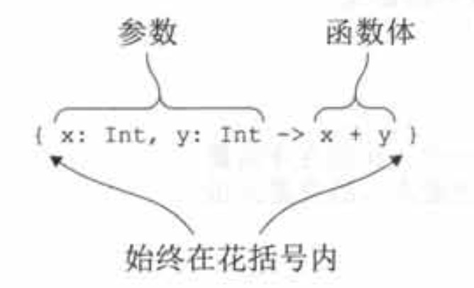

# 介绍

Lambda表达式，或简称lambda，本质上就是可以传递给其他函数的一小段代码。

Kotlin的lambda语句可以修改外部可变变量，其原理是外部包了一层包装类，包装类实例的引用不会被改变，但是可以改变其中的值。

不可变(final)变量和Java一样，进行值的拷贝。

# 内联函数

lambda表达式会被编译成匿名类。每调用一次lambda表达式，一个额外的类就会被创建。并且如果lambda捕捉了某个变量，那么每次调用的时候都会创建一个新的对象。这会带来运行时的额外开销，导致使用lambda比使用一个直接执行相同代码的函数效率更低。

一个高效的做法是内联函数。

使用inline修饰符标记一个函数，在函数被使用的时候编译器并不会生成函数调用的代码，而是使用函数实现的真实代码替换每一次的函数调用。

当一个函数被声明为inline时，它的函数体是内联的。换句话说， 函数体会被直接替换到函数被调用的地方，而不是被正常调用。

>   类似于C++的内联函数

# 在lambda中返回

## 非局部返回

```kotlin
fun lookForAlice(people: List<Person>) {
    for (person in people) {
        if (person.name == "Alice") {
            println("Found!")
            return
        }
    }
    println("Alice is not found")
}
```

在lambda中使用return关键字，它会从调用lambda的函数中返回，并不只是从lambda中返回。这样的return语句叫作非局部返回。

局部返回只适用于内联函数。

## 局部返回

局部返回需要用到标签。

```kotlin
fun lookForAlice(people: List<Person>) {
    people.forEach label@{
        if (it.name == "Alice") return@label
    }
    println("Alice might be somewhere")
}
```

在lambda的花括号之前放一个标签名(可以是任何标识符)，接着放一个@符号。要从一个lambda返回，在return关键字后放一个@符号，接着放标签名。

也使用lambda作为参数的函数的函数名可以作为标签。

```kotlin
fun lookForAlice(people: List<Person>) {
    people.forEach {
        if (it.name == "Alice") return@forEach
    }
    println("Alice might be somewhere")
}
```

# Lambda表达式和成员引用

## Lambda 表达式的语法



**Kotlin的lambda表达式始终用花括号包围。**

可以把lambda表达式存储在一个变量中， 把这个变量当作普通函数对待(即通过相应实参调用它)：

```kotlin
fun main() {
    val sum = { x: Int, y: Int -> x + y }
    println(sum(1,2))
}

3
```

还可以直接调用lambda表达式

```kotlin
fun main() {
    { println("aa")}()
}

aa
```

**精简表达式**

```kotlin
people.maxBy{{ P: Person -> p.age })
```

可以精简为：

```kotlin
println(people.maxBy { it.age })
```

## 在作用域中访问变量

和Java不一样，Kotlin 允许在lambda内部访问非final 变量甚至修改它们。

注意，默认情况下，局部变量的生命期被限制在声明这个变量的函数中。但是如果它被lambda捕捉了，使用这个变量的代码可以被存储并销后再执行。

**原理**

当捕捉final变量时，它的值和使用这个值的lambda代码一起存储。而对非final变量来说，它的值被封装在一个特殊的包装器中，这样就可以改变这个值，而对这个包装器的引用会和lambda代码起存储。

这里有一个重要的注意事项，如果lambda被用作事件处理器或者用在其他异步执行的情况，对局部变量的修改只会在lambda执行的时候发生。

## 成员引用

Kolin和Java8一样，如果把函数转换成一个值，就可以传递它。使用::运算符来转换：

```kotlin
val getAge = Person::age
```

这种表达式称为成员引用，它提供了简明语法，来创建一个调用单个方法或者访问单个属性的函数值。

注意，不管引用的是函数还是属性，都不要在成员引用的名称后面加括号。成员引用和调用该函数的lambda 具有一样的类型， 所以可以互换使用：

```kotlin
people.maxBy (Person::age)
```

还可以引用顶层函数(不是类的成员)：

```kotlin
fun salute() = println("Salute")

fun main() {
    run(::salute)
}

Salute
```

省略了类名称，直接以::开头。

# 序列

map和filter这些函数会及早地创建中间集合，也就是说每一步的中间结果都被存储在一个临时列表。序列可以避免创建这些临时中间对象。

```kotlin
people.asSequence().// 把初始集合转换成序列
        map(Person::name)//序列支持和集合一样的API
        .filter { it.startsWith("A") }//把结果序列转换回列表
				.toList()
```

这个例子没有创建任何用于存储元素的中间集合，所以元素数量巨大的情况下性能将显著提升。

Kotlin惰性集合操作的入口就是Sequence接口。这个接口表示的就是个可以逐个列举元素的元素序列。Sequence 只提供了一个方法，iterator，用来从序列中获取值。

Sequence接口的强大之处在于其操作的实现方式。序列中的元素求值是惰性的。因此，可以使用序列更高效地对集合元素执行链式操作，而不需要创建额外的集合来保存过程中产生的中间结果。

可以调用扩展函数asSequence把任意集合转换成序列，调用toList来做反向的转换。

>   为什么需要把序列转换回集合？用序列代替集合不是更方便吗？
>
>   有的时候是这样。如果你只需要迭代序列中的元素，可以直接使用序列。如果你要用其他的API方法，比如用下标访问元素，那么你需要把序列转换成列表。

**注意通常，需要对一个大型集合执行链式操作时要使用序列。**

## 执行序列操作

序列操作分为两类：中间的和未端的。一次中间操作返回的是另一个序列，这个新序列知道如何变换原始序列中的无素。而一次末端操作返回的是个结果， 这个结果可能是集合、元素、数字，或者其他从初始集合的变换序列中获取的任意对象。

**中间操作始终都是情性的。**

先看看下面这个缺少了末端操作的例子

```kotlin
fun main() {
    listOf(1, 2, 3, 4)
            .asSequence()
            .map {
                print("map($it) ")
                it * it
            }
            .filter {
                print("filter($it) ")
                it % 2 == 0
            }
}
```

执行这段代码并不会在控制台上输出任何内容。**这意味着map和filter变换被延期了，它们只有在获取结果的时候才会被应用(即末端操作被调用的时候)**

```kotlin
fun main() {
    listOf(1, 2, 3, 4)
            .asSequence()
            .map {
                print("map($it) ")
                it * it
            }
            .filter {
                print("filter($it) ")
                it % 2 == 0
            }
            .toList()
}

map(1) filter(1) map(2) filter(4) map(3) filter(9) map(4) filter(16) 
```

**末端操作触发执行了所有的延期计算。**

这个例子中另外一件值得注意的重要事情是计算执行的顺序。**对序列来说，所有操作是按顺序应用在每一个元素上：处理完第一个元素(先映射再过滤)，然后完成第二个元素的处理，以此类推。**

## 创建序列

前面的例子都是使用同一个方法创建序列：在集合上调用asSequence()。另一种可能性是使用generateSequence函数。给定序列中的前一个元素，这个函数会计算出下一个元素。下面这个例子就是如何使用generateSequence计算100以内所有自然数之和。

```kotlin
fun main() {
    val naturalNumbers = generateSequence(0) { it + 1 }
    val numbersTo100 = naturalNumbers.takeWhile { it <= 100 }
    println(numbersTo100.sum())//当获取结果“sum”时，所有被推迟的操作都被执行
}

5050
```

# 使用Java函数式接口

```java
/**Java**/
static class Button {
    OnClickListener mListener;

    void setOnClickListener(OnClickListener l) {
        mListener = l;
    }
}

interface OnClickListener {
    void onClick(View view);
}
```

```java
public static void main(String[] args) {
    Button button = new Button();
    button.setOnClickListener(new OnClickListener() {
        @Override
        public void onClick(View view) {
            
        }
    });
}
```

在Kotlin中，可以传递一个lambda，代替这个实例

```kotlin
fun main() {
    val button = Chapter5.Button()
    button.setOnClickListener { view ->
        //todo
    }
}
```

这种方式可以工作的原因是OnClickListener接口只有一个抽象方法。**这种接口被称为函数式接口，或者SAM接口**，SAM代表单抽象方法。Java API中随处可见像Runnable和Callable这样的函数式接口，以及支持它们的方法。Kotlin允许你在调用接收函数式接口作为参数的方法时使用lambda，来保证你的Kotin代码既整洁又符合习惯。

> 注意和Java不同，Kotlin 拥有完全的函数类型。正因为这样，需要接收lambda作为参数的Kotlin函数应该使用函数类型而不是函数式接口类型，作为这些参数的类型。Kotlin 不支持把lambda自动转换成实现Kotlin接口的对象。

## 把 lambda当作参数传递给Java方法

可以把lambda传给任何期望函数式接口的方法。例如，下面这个方法， 它有一个Runnable类型的参数

```java
/* Java */
static void postponeComputation(int delay, Runnable runnable) {
    //TODO
}
```

在Kotin中，可以调用它并把一个lambda作为实参传给它。编译器会自动把它转换成一个Runnable的实例

```kotlin
fun main() {
    Chapter5.postponeComputation(1000, {
        //TODO
    })
}
```

通过显式地创建一个实现了Runnable的匿名对象也能达到同样的效果:

```kotlin
fun main() {
    Chapter5.postponeComputation(1000,object :Runnable{//把对象表达式作为函数式接口的实现传递
        override fun run() {
            //TODO
        }
    })
}
```

但是这里有一点不一样。当你显式地声明对象时，每次调用都会创建一个新的实例。使用lambda的情况不同：**如果lambda没有访问任何来自定义它的函数的变量，相应的匿名类实例可以在多次调用之间重用。**

因此，完全等价的实现应该是下面这段代码中的显式object声明，它把Runnable实例存储在一个变量中，并且每次调用的时候都使用这个变量

```kotlin
fun main() {
    val runnable = Runnable {
        //TODO
    }
    Chapter5.postponeComputation(1000, runnable)
}
```

**如果lambda从包围它的作用域中捕捉了变量，每次调用就不再可能重用同一个实例了。这种情况下，每次调用时编译器都要创建一个新对象，其中存储着被捕捉的变量的值。**

> **Lambda的实现细节**
>
> 自Kolin 1.0起，每个lambda表达式都会被编译成一个匿名类，除非它是一个内联lambda。后续版本计划支持生成Java8字节码。一旦实现，编译器就可以避免为每一个lambda表达式都生成一个独立的.class文件。如果lambda捕捉了变量，每个被捕捉的变量会在匿名类中有对应的字段，而且每次(对lambda的)调用都会创建一个这个匿名类的新实例。否则，一个单例就会被创建。类的名称由lambda声明所在的函数名字称加上后缀衍生出来。
>
> 编译器给每个被捕捉的变量生成了一个字段和一个构造方法参数。

请注意这里讨论的为lambda创建一个匿名类，以及该类的实例的方式只对期望函数式接口的Java方法有效，但是对集合使用Kotlin扩展方法的方式并不适用。如果你把lambda传给了标记成inline的Kotlin函数，是不会创建任何匿名类的。而大多数的库函数都标记成了inline

## SAM构造方法：显式地把lambda转换成函数式接口

SAM构造方法是编译器生成的函数，让你执行从lambda到函数式接口实例的显式转换。可以在编译器不会自动应用转换的上下文中使用它。例如，如果有一个方法返回的是一个函数式接口的实例，不能直接返回一个 lambda，要用 SAM构造方法把它包装起来。

这里有一个简单的例子。

```kotlin
fun main() {
    createAllDoneRunnable().run()
}

fun createAllDoneRunnable(): Runnable {
    return Runnable { println("All done!") }
}

All done!
```

SAM构造方法的名称和底层函数式接口的名称一样。SAM构造方法只接收一个参数——一个被用作函数式接口单抽象方法体的lambda并返回实现了这个接口的类的一个实例。

除了返回值外，SAM构造方法还可以用在需要把从lambda生成的函数式接口实例存储在一个变量中的情况。

> **Lambda和添加/移除监听器**
>
> 注意lambda内部没有匿名对象那样的this；没有办法引用到lambda转换成的匿名类实例。从编译器的角度来看，lambda是一个代码块，不是一个对象，而且也不能把它当成对象引用。Lambda中的this引用指向的是包围它的类。
>
> 如果你的事件监听器在处理事件时还需要取消它自己，不能使用lambda这样做。这种情况使用实现了接口的匿名对象。在匿名对象内，this 关键字指向该对象实例，可以把它传给移除监听器的API。

还有尽管方法调用中的SAM转换一般都自动发生，但是当把lambda作为参数传给一个重载方法时，也有编译器不能选择正确的重载的情况。这时，使用显式的SAM构造方法是解决编译器错误的好方法。

# 高阶函数

按照定义，高阶函数就是以另一个函数作为参数或者返回值的函数。任何以lambda或者函数引用作为参数的函数，或者返回值为lambda或函数引用的函数，或者两者都满足的函数都是高阶函数。

## 函数类型

```kotlin
fun test1() {
    val sum: (Int, Int) -> Int = { x, y -> x + y }
    val action: () -> Unit = { println("aaa") }
}
```

在声明一个普通的函数时，Unit类型的返回值是可以省略的，但是一个函数类型声明总是需要一个显式的返回类型，这种场景下Unit是不能省略的。

>   函数类型也可以是空（null）的，用括号括起并添加？号

函数类型也可以作为函数参数。

Java调用Kotlin的函数参数：

```kotlin
fun testFunParam(funPamam: (Int, String) -> Char) {
    println(funPamam(1, "2"))
}
```

```java
private static void test6() {
    MainKt.testFunParam(new Function2 < Integer, String, Character > () {
        @Override
        public Character invoke(Integer integer, String s) {
            return 'a';
        }
    });
}
```

Kotlin的函数参数在Java会生成一个类FunctionN。如：有2个参数，那么就是Function2，类型参数有3个，前两个是函数参数的方法参数类型，最后一个是函数参数的返回类型。见上例子。

## 内联函数

每调用一次lambda表达式，一个额外的类就会被创建。并且如果lambda捕捉了某个变量，那么每次调用的时候都会创建一个新的对象。这会带来运行时的额外开销，导致使用lambda比使用一个直接执行相同代码的函数效率更低。

使用内联函数可以消除lambda带来的运行时开销。

### 内联函数的运作方式

当一个函数被声明为inline时，函数并不是被调用，而是将函数体替换到被调用的地方。

```kotlin
fun testInlineFun() {
    println("aaaa")
    val l = ReentrantLock()
    synchronized(l) {
        println("bbbb")
    }
    println("cccc")
}

/**
 * 内联函数
 */
inline fun synchronized(lock: Lock, action: () -> Unit) {
    lock.lock()
    try {
        action()
    } finally {
        lock.unlock()
    }
}
```

其字节码相当于：

```kotlin
fun testInlineFun() {
    println("aaaa")
    val lock.lock = ReentrantLock()
   lock.lock()
    try {
        println("bbbb")
    } finally {
        lock.unlock()
    }
    println("cccc")
}
```

注意lambda表达式和synchronized函数的实现都被内联了。由lambda生成的字节码成为了函数调用者定义的一部分，而不是被包含在一个实现了函数接口的匿名类中。

```kotlin
fun testInlineFun2(action: () -> Unit) {
    val lock = ReentrantLock()
    synchronized(lock, action)
}
```

如果是这样的，那么对应的字节码相当于：

```kotlin
fun testInlineFun2(action: () -> Unit) {
    val lock = ReentrantLock()
    lock.lock()
    try {
        action()
    } finally {
        lock.unlock()
    }
}
```

synchronized函数体实现了内联，但是lambda没有实现内联。

如果在两个不同的位置使用同一个内联函数，但是用的是不同的lambda，那么内联函数会在每一个被调用的位置被分别内联。内联函数的代码会被拷贝到使用它的两个不同位置，并把不同的lambda替换到其中。

### 内联函数的限制

lambda参数如果被直接调用或者作为参数传递给另外一个inline函数，它是可以被内联的。但如果lambda参数在某个地方被保存起来，以便后面可以继续使用，lambda表达式的代码将不能被内联，因为必须要有一个包含这些代码的对象存在。

如果一个函数期望两个或更多lambda参数，可以选择只内联其中一些参数。这是有道理的，因为一个lambda可能会包含很多代码或者以不允许内联的方式使用。接收这样的非内联lambda的参数，可以用noinline修饰符来标记它：

```kotlin
inline fun foo(inlined: () -> Unit, noinline notInlined: () -> Unit) { }
```

