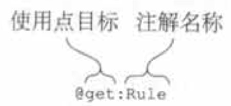

# 注解

## 基本使用

使用方式和Java一样。

注解只能拥有如下类型的参数：基本数据类型、字符串、枚举、类引用、其他的注解类，以及前面这些类型的数组。

指定注解实参的语法与Java有些微小的差别：

-   要把一个类指定为注解实参，在类名后加上::class：@MyAnnotation(MyClass::class)。
-   要把另一个注解指定为一个实参，去掉注解名称前面的@例如Replacewith是一个注解，但是把它指定为Deprecated注解的实参时没有用@。
-   要把一个数组指定为一个实参，使用arrayOf函数；@RequestMapping(path = arrayOf("/foo", "/bar"))。 如果注解类是在Java中声明的，命名为value的形参按需自动地被转换成可变长度的形参，所以不用arrayOf函数就可以提供多个实参。

注解实参需要在编译期就是已知的，所以不能引用任意的属性作为实参。要把属性当作注解实参使用，需要用const修饰符标记它，来告知编译器这个属性是编译期常量。

## 注解目标

Kotin源代码中的一些单个声明会对应成多个Java声明，而且它们每个都能携带注解。例如，一个 Kotlin属性就对应了一个Java字段、一个getter，以及一个潜在的setter和它的参数。所以需要说明这些元素中哪些需要注解。

使用点目标声明被用来说明要注解的元素。使用点目标被放在@符号和注解名称之间，并用冒号和注解名称隔开。图中的单词get导致注解@Rule被应用到了属性的getter上。



Kotlin支持的使用点目标的元整列表如下:

●property：Java的注解不能应用这种使用点目标。

●field：为属性生成的字段。

●get：属性的getter.

●set：属性的setter。

●receiver：扩展函数或者扩展属性的接收者参数。

●param：构造方法的参数。

●setparam：属性setter的参数。

●delegate：为委托属性存储委托实例的字段。

●file：包含在文件中声明的顶层函数和属性的类。

注意，和Java不一样的是，Kotin 允许对任意的表达式应用注解，而不仅仅是类和函数的声明及类型。

## 用注解控制Java API

Kotlin提供了各种注解来控制Kotlin编写的声明如何编译成字节码并暴露给Java调用者。其中一些注解代替了Java语言中对应的关键字：比如，注解@Volatile和@Strictfp直接充当了Java的关键字volatile和strictfp的替身。

其他的注解则是被用来改变Kotlin 声明对Java调用者的可见性：

●@JvmName将改变由Kotlin 生成的Java方法或字段的名称。

●@JvmStatic能被用在对象声明或者伴生对象的方法上，把它们暴露成Java的静态方法。

●@JvmOverloads,曾在3.2.2节中出现过，指导Kotlin编译器为带默认参数值的函数生成多个重载(函数)。

●@JvmField可以应用于一个属性，把这个属性暴露成一个没有访问器的公有Java字段。

## 声明注解

Kotlin的注解声明和Java的不一样：

```kotlin
annotation class JsonExclude(val name : String)//如果有参数的话
```

# 反射

Kotlin的反射有2种API，一种是Java的API，定义在包java.lang.reflect中，所以使用了反射API的Java库完全兼容Kotlin代码。另一种是Kotlin的API，定义在kotlin.reflect。

Koltin的反射库单独打成了包，这是为了减小Android包的大小，如果要使用，需要引入依赖：org.jetbrains.kotlin:kotlin-reflect。

Java反射的入口是Class对象，而Kotlin反射的入口是KClass对象。

