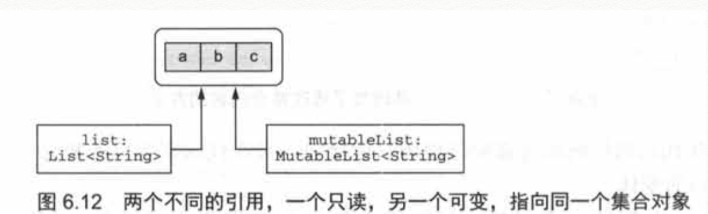

# 可控类型的扩展

在Kotlin中，可以对一些null值调用一些扩展函数：

```kotlin
fun String?.isNullOrBlank() : Boolean =
this == null || this. isBlank()
```

# 类型参数的可空性

```kotlin
fun <T> printHashCode(t: T) {
    println(t?.hashCode())
}
```

类型参数T是可空的，会被推导成Any?，如果要使不为空，需要提供一个不可空的上界：

```kotlin
fun <T : Any> printHashCode(t: T) {
    println(t?.hashCode())
}
```

一个可空类型的值， 能对它进行的操作也会受到限制。例如：

-   不能再调用它的方法
-   不能把它赋值给非空类型的变量
-   不能把可空类型的值传给拥有非空类型参数的函数

# 平台类型

平台类型本质上就是Kotlin不知道可空性信息的类型。既可以把它当作可空类型处理，也可以当作非空类型处理(如图所示)。这意味着，你要像在Java中一样，对你在这个类型上做的操作负有全部责任。编译器将会允许所有的操作，它不会把对这些值的空安全操作高亮成多余的，但它平时却是这样对待非空类型值上的空安全操作的。如果你认为这个值为null，在使用它之前可以用它和null比较。如果你认为它不为null，就直接使用它。就像在Java中一样，如果你错误地理解了这个值，使用的时候就会遇到NullPointerException。

**为什么需要平台类型？**

对Kotlin来说，把来自Java的所有值都当成可空的是不是更安全？这种设计也许可行，但是这需要对永远不为空的值做大量冗余的null检查，因为Kotlin编译器无法了解到这些信息。

涉及泛型的话这种情况就更糟糕了。例如，在Kotlin中，每个来自Java的`ArrayList<String>`都被当作`ArrayList<String?>?`，每次访问或者转换类型都需要检查这些值是否为null，这将抵消掉安全性带来的好处。编写这样的检查非常令人厌烦，所以Kotlin的设计者做出了更实用的选择，让开发者负责正确处理来自Java 的值。

# 继承

当在Kotlin中重写Java的方法时，可以选择把参数和返回类型定义成可空的，也可以选择把它们定义成非空的。例如，我们来看一个Java中的StringProcessor接口。

# 基本数据类型

Kotlin并不区分基本数据类型和包装类型，使用的永远是同一个类型(比如Int)

在运行时，大多数情况下对于变量、属性、参数和返回类型——Kotlin的Int类型会被编译成Java基本数据类型int。唯一不可行的例外是泛型类，比如集合。 用作泛型类型参数的基本数据类型会被编译成对应的Java包装类型。例如，Int类型被用作集合类的类型参数时，集合类将会保存对应包装类型java.lang.Integer的实例。

## 可空的基本数据类型

Kotlin中的可空类型不能用Java的基本数据类型表示，因为null只能被存储在Java的引用类型的变量中。这意味着任何时候只要使用了基本数据类型的可空版本，它就会编译成对应的包装类型。

注意，普通的可空性规则如何在这里应用。你不能就这样比较Int?类型的两个值，因为它们之中任何一个都可能为null。相反，你必须检查两个值都不为null。然后，编译器才允许你正常地比较它们。

## 数字转换

Kotlin和Java之间一条重要的区别就是处理数字转换的方式。Kotlin不会自动地把数字从一种类型转换成另外一种，即便是转换成范围更大的类型。例如，Kotlin中下面这段代码不会编译

```kotlin
val i = 1
val l: Long = i//错误：类型不匹配
```

相反，必须显式地进行转换：

```kotlin
val i = 1
val l: Long = i.toLong()
```

每一种基本数据类型(Boolean除外)都定义有转换函数：toByte()、toShort()、toChar() 等。这些函数支持双向转换：既可以把小范围的类型括展到大范围，比如Int.toLong()，也可以把大范围的类型截取到小范围，比如Long. toInt()。

为了避免意外情况，Kotlin要求转换必须是显式的，尤其是在比较装箱值的时候。比较两个装箱值的equals方法不仅会检查它们存储的值，还要比较装箱类型。所以，在Java中new Integer(42).equals(new Long(42)) 会返回false。

```kotlin
fun main() {
    val x = 1
    val list = listOf(1L, 2L, 3L)
    println(x in list)//编译不通过
}
```

# “Any”和“Any?”：根类型

Any类型是Kotlin所有非空类型的超类型(非空类型的根)。

和Java一样，把基本数据类型的值赋给Any类型的变量时会自动装箱：

```kotlin
val answer: Any = 42//Any是引用类型，所以值42 会被装箱
```

注意Any是非空类型，所以Any类型的变量不可以持有null值。在Kotlin中如果你需要可以持有任何可能值的变量，包括null在内，必须使用Any?类型。

在底层，Any 类型对应java.lang.Object。Kotlin把Java方法参数和返回类型中用到的Object类型看作Any (更确切地是当作平台类型，因为其可空性是未知的)。当Kotlin函数使用Any时，它会被编译成Java字节码中的Object。

所有Kotlin类都包含下面三个方法：toString、equals和hashCode。这些方法都继承自Any。Any并不能使用其他java.lang.Object的方法(比如wait和notify)，但是可以通过手动把值转换成java.lang.Object来调用这些方法。

# Unit类型：Kotlin的"void”

类似Java的Void，如果Kotlin方法的返回值时Unit，那么可以省略返回的类型说明，也可以省略最后的return。

如果你的Kotlin函数使用Unit作为返回类型并且没有重写泛型函数，在底层它会被编译成旧的void函数。如果你要在Java代码中重写这个函数，新的Java函数需要返回void。

```kotlin
//kotlin
interface KotlinInterfaceA<T> {
    fun function(): T
}

open class KotlinDemoE : KotlinInterfaceA<Unit> {
    override fun function() {
    }
} 
```

```java
//java
private static class DemoC extends KotlinDemoE {
    @Override
    public void function() {
        super.function();
    }
}
```

和void的区别：

-   Unit可以作为类型参数，void不能。
-   Unit作为返回类型说明时可以省略，void不能。
-   Unit本身是一个值，在函数中会被隐式地返回，编译器会隐式地加上return Unit。

和Void的区别：

-   Unit作为返回类型说明时可以省略，void不能。
-   Unit本身是一个值，在函数中会被隐式地返回，编译器会隐式地加上return Unit。而Void需要显式的写return null

和Java对比一下，Java中为了解决使用“没有值”作为类型参数的任何一种可能解法，都没有Kotlin的解决方案这样漂亮。一种选择是使用分开的接口定义来分别表示需要和不需要返回值的接口(如Callable和Runnable)。

另一种是用特殊的java.lang.Void类型作为类型参数。即便你选择了后面这种方式，你还是需要加入一个return null;语句来返回唯一能匹配这个类型的值，因为只要返回类型不是void，你就必须始终有显式的return语句。

你也许会奇怪为什么我们选择使用 一个不一样的名字Unit而不是把它叫作Void。在函数式编程语言中，Unit 这个名字习惯上被用来表示“只有易个实例”，这正是Kotlin的Unit和Java的void的区别。

# Nothing类型：“这个函数永不返回”

对某些Kotlin函数来说，“返回类型”的概念没有任何意义，因为它们从来不会成功地结束。例如，许多测试库都有一个叫作fail的函数，它通过抛出带有特定消息的异常来让当前测试失败。一个包含无限循环的函数也永远不会成功地结束。

当分析调用这样函数的代码时，知道函数永远不会正常终止是很有帮助的。Kotlin使用一种特殊的返回类型Nothing来表示：

```kotlin
fun main() {
    fail("Error occurred")
}

fun fail(message: String): Nothing {
    throw IllegalStateException(message)
}

Exception in thread "main" java.lang.IllegalStateException: Error occurred....
```

Nothing类型没有任何值，只有被当作函数返回值使用，或者被当作泛型函数返回值的类型参数使用才会有意义。在其他所有情况下，声明一个不能存储任何值的变量没有任何意义。

注意，返回Nothing的函数可以放在Elvis运算符的右边来做先决条件检查：

```kotlin
val address = company.address ?: fail("No address")
println(address.city)
```

上面这个例子展示了在类型系统中拥有Nothing为什么极其有用。编译器知道这种返回类型的函数从不正常终止，然后在分析调用这个函数的代码时利用这个信息。在上面这个例子中，编译器会把address的类型推断成非空，因为它为null时的分支处理会始终抛出异常。

# 集合与数组

## 可空性和集合

创建一个包含可空值的集合

`List<Int?>`是能持有Int?类型值的列表：换句话说，可以持有Int或者null。

`List<Int?>?`，有两个问号。使用变量自己的值的时候，以及使用列表中每个元素的值的时候，都需要使用null检查。

# 只读集合与可变集合

kotlin.collections.Collection。使用这个接口，可以遍历集合中的元素、获取集合大小、判断集合中是否包含某个元素，以及执行其他从该集合中读取数据的操作。但这个接口没有任何添加或移除元素的方法。

kotlin.collections.MutableCollection接口可以修改集合中的数据。它继承了普通的kotlin.collections.Collection接口，还提供了方法来添加和移除元素、清空集合等。

一般的规则是在代码的任何地方都应该使用只读接口，只在代码需要修改集合的地方使用可变接口的变体。

只读集合里并不一定是不可变的，如图：



如果你调用了这样的代码，它持有其他指向你集合的引用，或者并行地运行了这样的代码。你依然会遇到这样的状况，你正在使用集合的时候它被其他代码修改了,这会导致concurrentModificationException错误和其他一些问题。因此，必须了解只读集合并不总是线程安全的。如果你在多线程环境下处理数据，你需要保证代码正确地同步了对数据的访问，或者使用支持并发访问的数据结构。

# Kotlin集合和Java

Kotlin中只读接口和可变接口的基本结构与java.util中的Java集合接口的结构是平行的。可变接口直接对应java.util包中的接口，而它们的只读版本缺少了所有产生改变的方法。

除了集合之外，Kotlin 中Map类(它并没有继承Collection或是Iterable)也被表示成了两种不同的版本：Map和MutableMap。

注意，setOf()和mapOf()返回的是Java标准类库中类的实例(至少在Kotlin 1.0中是这样)，在底层它们都是可变的。但你不能完全信赖这一点：Kotlin的未来版本可能会使用真正不可变的实现类作为setOf和mapOf的返回值。

当你需要调用一个Java方法并把集合作为实参传给它时，可以直接这样做，不需要任何额外的步骤。例如，你有一个使用java.util.Collection做形参的Java方法，可以把任意Collection或MutableCollection的值作为实参传递给这个形参。

这对集合的可变性有重要影响。因为Java并不会区分只读集合与可变集合，即使Kotlin中把集合声明成只读的，Java 代码也能够修改这个集合。Kotlin编译器不能完全地分析Java代码到底对集合做了什么，因此Kotlin无法拒绝向可以修改集合的Java代码传递只读Collection。如果你写了一个Kotlin函数，使用了集合并传递给了Java，你有责任使用正确的参数类型，这取决于你调用的Java代码是否会修改集合。

留意此注意事项也适用于包含非空类型元素的集合类。如果你向Java方法转递了这样的集合，该方法就可能在其中写入null值；Kotlin没有办法在不影响性能的情况下，禁止它的发生，或者察觉到已经发生的改变。因此，当你向可以修改集合的Java代码传递集合的时候，你需要采取特别的预防措施，来确保Kotlin类型正确地反映出集合上所有可能的修改。

# 对象和基本数据类型的数组

要在Kotlin中创建数组，有下面这些方法供你选择：

arrayOf函数创建一个数组，它包含的元素是指定为该函数的实参

arrayOfNulls创建一个给定大小的数组，包含的是null元素。当然，它只能用来创建包含元素类型可空的数组。

Array构造方法接收数组的大小和一个lambda表达式，调用lambda表达式来创建每一个数组元素。这就是使用非空元素类型来初始化数组，但不用显式地传递每个元素的方式。

这里有一个简单的例子，展示了如何使用Array函数来创建从"a"到"z"的字符串数组。

```kotlin
fun main() {
    val letters = Array<String>(26) { i -> ('a' + i).toString() }
    println(letters.joinToString(" "))
}
a b c d e f g h i j k l m n o p q r s t u v w x y z
```

和其他类型一样，数组类型的类型参数始终会变成对象类型。因此，如果你声明了一个Array<Int>，它将会是一个包含装箱整型的数组(它的Java类型将是java.lang. Integer[])。如果你需要创建没有装箱的基本数据类型的数组，必须使用一个基本数据类型数组的特殊类。

为了表示基本数据类型的数组，Kotlin 提供了若干独立的类，每一种基本数据类型都对应一个。例如，Int类型值的数组叫作IntArray。Kotlin还提供了ByteArray、CharArray、 BooleanArray等给其他类型。所有这些类型都被编译成普通的Java基本数据类型数组，比如int[]、 byte[]、char[]等。因此这些数组中的值存储时并没有装箱，而是使用了可能的最高效的方式。

要创建一个基本数据类型的数组，你有如下选择：

该类型的构造方法接收size参数并返回一个使用对应基本数据类型默认值(通常是0)初始化好的数组。

工厂函数(IntArray的intArrayof，以及其他数组类型的函数)接收变长参数的值并创建存储这些值的数组。

另一种构造方法，接收一个大小和一个用来初始化每个元素的lambda。

下面是创建存储了5个0的整型数组的两种选择：

```kotlin
val fiveZeros = IntArray(5)
val fiveZeros2 = intArrayOf(0, 0, 0, 0, 0)
```

或者，假如你有一个持有基本数据类型装箱后的值的数组或者集合，可以用对应的转换函数把它们转换成基本数据类型的数组，比如toIntArray。