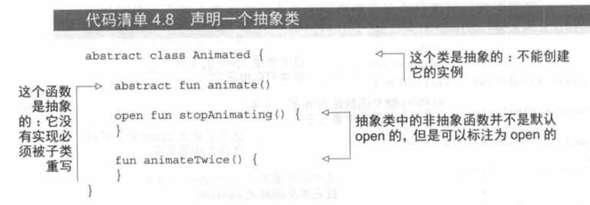

Kotlin的类和接口与Java的类和接口还是有一.点区别的。例如，接口可以包含:
属性声明。与Java不同，Kotlin 的声明默认是final和public的。此外，嵌套的
类默认并不是内部类:它们并没有包含对其外部类的隐式引用。

# 重写Override

与Java中的@Override注解类似，override修饰符用来标注被重写的父类或者接口的方法和属性。

与Java不同的是，在Kotin中使用override修饰符是强制要求的，会导致无法编译。这样可以避免先写出实现方法再添加抽象方法造成的意外重写。

# 接口

Kotlin的接口和Java8的类似。

接口方法可以有默认实现。Java8需要标注default关键字，Kotlin不需要。

## 调用默认方法

一个类实现了2个接口，2个接口有同名的方法，可以这样调用：

```kotlin
super<Clickable>.showOff()
super<Focusable>.showOff()
```

Java是这样做的：

```java
Clickable.super.showOff()
Focusable.super.showOff()
```

## 默认方法和Java的交互

Kotlin1.0是以Java6为目标设计的，其并不支持接口中的默认方法。因此它会把每个带默认方法的接口编译成一个普通接口和一个将方法体作为静态函数的类的结合体。接口中只包含声明，类中包含了以静态方法存在的所有实现。因此，如果需要在Java类中实现这样一个接口，必须为所有的方法，包括在Kotlin中有方法体的方法定义你自己的实现。

# open、final和abstract

Kotlin的类默认是public和final的。如果想要创建其子类，需要用open修饰符修饰，此外还要给需要重写的方法添加open修饰符。

注意，如果重写了一个基类或者接口的成员，重写了的成员同样默认是open的。为了阻止之后的子类重写实现，可以显式地将重写的成员标注为final。

abstract修饰符作用见下图。



**类中修饰符的意义**


# 可见性修饰符

| 修饰符        | 类成员       | 顶层声明     |
| ------------- | ------------ | ------------ |
| public (默认) | 所有地方可见 | 所有地方可见 |
| internal      | 模块中可见   | 模块中可见   |
| protected     | 子类中可见   | --           |
| private       | 类中可见     | 文件中可见   |

类的扩展函数是不能访问它的private和protected成员。

另一个Kotlin与Java之间可见性规则的区别就是在Kolin中一个外部类不能看到其内部(或者嵌套)类中的private成员。

## Kotlin的可见性修饰符和Java

Kotin中的public、protected 和private修饰符在编译成Java字节码时会被保留。从Java代码使用这些Kotlin声明时就如同他们在Java中声明了同样的可见性。

唯一的例外是private类：在这种情况下它会被编译成包私有声明(在Java中不能把类声明为private)。

那么internal修饰符将会发生什么？Java 中并没有直接与之类似的东西。包私有可见性是一个完全不同的东西：一个模块通常会由多个包组成，并且不同模块可能会包含来自同一个包的声明。因此internal修饰符在字节码中会变成public。

这些Kotlin声明和它们Java翻版(或者说它们的字节码呈现)的对应关系解释了为什么有时你能从Java代码中访问一些你不能从Kotlin中访问的东西。例如，可以从另一个模块的Java代码中访问internal类或顶层声明，抑或从同一个包的Java代码中访问一个protected的成员(和在Java中做的相似)。

但是注意类的internal成员的名字会被破坏。从技术上讲，internal成员也是可以在Java中使用的，但是它们在Java代码中看起来很难看。当你从另一个模块继承类时，可以帮助避免在重写时出现出乎意料的冲突，并且避免意外使用internal类。

# 默认为嵌套类

Kotlin的内部类默认是static的，要使用普通内部类，需要加inner修饰符。

| 类A在另一个类B中声明         | 在Java中       | 在Kotlin中    |
| ---------------------------- | -------------- | ------------- |
| 嵌套类（不存储外部类的引用） | static class A | class A       |
| 内部类（存储外部类的引用）   | class A        | inner class A |


## 密封类sealed

```kotlin
interface Expr
class Num(val value: Int) : Expr
class Sum(val left: Expr, val right: Expr) : Expr

fun eval(e: Expr): Int =
        when (e) {
            is Num ->
                e.value
            is Sum ->
                eval(e.right) + eval(e.left)
            else ->
                throw IllegalArgumentException("未知表达式")
        }
```

当使用when结构来执行表达式的时候，Kotlin 编译器会强制检查默认选项。另外，如果添加了一个新的子类并且忘记了添加一个新分支，就会选择默认的选项，这有可能是致潜在的bug。

解决方案：sealed类。为父类添加一个sealed修饰符，对可能创建的子类做出严格的限制。所有的直接子类必须嵌套在父类中。

```kotlin
sealed class Expr {
    class Num(val value: Int) : Expr()
    class Sum(val left: Expr, val right: Expr) : Expr()
}

fun eval(e: Expr): Int =
        when (e) {
            is Expr.Num ->
                e.value
            is Expr.Sum ->
                eval(e.right) + eval(e.left)
        }
```

如果在when表达式中处理所有sealed类的子类，就不再需要提供默认分支。注意，sealed修饰符隐含的这个类是个open类，不再需要显式地添加open修饰符。

Expr类有一个只能在类内部调用的private构造方法。

不能声明一个sealed接口。如果能这样做，Kotlin编译器不能保证任何人都不能在Java代码中实现这个接口。

# 声明一个类

Kotlin的构造方法区分了主构造方法(通常是主要而简洁的初始化类的方法，并且在类体外部声明)和从构造方法(在类体内部声明)。同样也允许在初始化语句块中添加额外的初始化逻辑。

## 初始化类

一个简单类。

```kotlin
class User(val nickName: String)
```

这段被括号围起来的语句块就叫作**主构造方法**。主要有两个目的：表明构造方法的参数，以及定义使用这些参数初始化的属性。

```kotlin
class User constructor(_nickName: String) {
    val nickName: String

    init {
        nickName = "zzsy"
    }
}
```

在这个例子中，可以看到两个新的Kotin关键字：constructor和init。constructor关键字用来开始一个主构造方法或从构造方法的声明。init关键字用来引入一个初始化语句块。这种语句块包含了在类被创建时执行的代码，并会与主构造方法一起使用。 因为主构造方法有语法限制， 不能包含初始化代码，这就是为什么要使用初始化语句块的原因。可以在一个类中声明多个初始化语句块。

在这个例子中，不需要把初始化代码放在初始化语句块中，因为它可以与nickName属性的声明结合。如果主构造方法没有注解或可见性修饰符，同样可以去掉constructor关键字。

```kotlin
class User(_nickName: String) {
    val nickName = _nickName//用参数来初始化属性
}
```

前两个例子在类体中使用val关键字声明了属性，如果属性用相应的构造方法参数来初始化，代码可以通过把val关键字加在参数前的方式来进行简化。这样可以替换类中的属性定义

```kotlin
class User(val nickName: String)//"val”意味着相应的属性会用构造方法
```

可以像函数参数一样为构造方法参数声明一个默认值：

```kotlin
class User(val nickName: String = "zzsy")//为构造方法参数提供一个默认值
```

要创建一个类的实例，只需要直接调用构造方法，不需要new关键字:

```kotlin
fun main() {
    val zzsy = User()
    val mezzsy=User("mezzsy")
    println(zzsy.nickName)
    println(mezzsy.nickName)
}

zzsy
mezzsy
```

**注意**：如果所有的构造方法参数都有默认值，编译器会生成一个额外的不带参数的构造方法来使用所有的默认值。这可以让Kotlin使用库时变得更简单，因为可以通过无参构造方法来实例化类。

### 继承父类

```kotlin
class NewUser(nickName: String) : User(nickName)

open class User(val nickName: String = "zzsy")
```

如果没有给一个类声明任何的构造方法，将会生成个不做任何事情的默认构造方法

```kotlin
open class Button
```

如果继承了Button类并且没有提供任何的构造方法，必须显式地调用父类的构造方法，即使它没有任何的参数

```kotlin
class RadioButton: Button ()
```

注意与接口的区别：接口没有构造方法，所以在你实现个接口的时候， 不需要在父类型列表中它的名称后面再加上括号。

如果你想要确保你的类不被其他代码实例化，必须把构造方法标记为private。

```kotlin
class Secretive private constructor() {}
```

> **private构造方法的替代方案**
>
> 在Java中，使用private构造方法禁止实例化这个类来表示一个意思：这个类是一个静态实用工具成员的容器或者是单例的。Kotlin针对这种目的具有内建的语言级别的功能。可以使用顶层函数作为静态实用工具。要想表示单例，可以使用对象声明。

## 构造方法

从构造方法

```kotlin
open class View {
    //从构造方法
    constructor(ctx: Context) {
    }
	//从构造方法
    constructor(ctx: Context, attr: AttributeSet) {
    }
}
```

扩展这个类，可以声明同样的构造方法:

```kotlin
class MyButton:View{
    constructor(ctx: Context) : super(ctx){}
    constructor(ctx: Context, attr: AttributeSet) : super(ctx, attr){}
}
```

## 在接口中的属性

在Kotlin中，接口可以包含抽象属性声明。

```kotlin
interface User {
    val nickname: String
}
```

实现User接口的类需要提供一个取得nickname值的方式。接口并没有说明这个值应该存储到一个支持字段还是通过getter来获取。接口本身并不包含任何状态，因此只有实现这个接口的类在需要的情况下会存储这个值。

```kotlin
class PrivateUser(override val nickname: String) : User

class SuberibingUser(val email: String) : User {
    override val nickname: String
        get() = email.substringBefore("@")
}

class FacebookUser(val accountId: Int) : User {
    override val nickname = "$accountId"
}
```

对于PrivateUser来说，你使用了简洁的语法直接在主构造方法中声明了一个属性。这个属性实现了来自于User的抽象属性，所以你将其标记为override。

对于SuberibingUser来说，nickname 属性通过一个自定义getter实现。这个属性没有一个支持字段来存储它的值，它只有一个getter在每次调用时从email中得到昵称。

对于FacebookUser来说，在初始化时将nickname属性与值关联。

除了抽象属性声明外，接口还可以包含具有getter和setter的属性，只要它们没有引用一个支持字段(支持字段需要在接口中存储状态，而这是不允许的)。

```kotlin
interface User {
    val email: String
    val nickname: String
        get() = email.substringBefore("@")
}
```

这个接口包含抽象属性email，同时nickname属性有一个自定义的get。第一个属性必须在子类中重写，而第二个是可以被继承的。

## getter和setter

```kotlin
class User(val name: String) {
    var address: String = "unspecified"
        set(value) {
            println("""
            Address was changed for $name:
            "$field" -> "$value".
        """.trimIndent())//读取支持的字段
            field = value//更新支持的字段
        }
}

fun main() {
    val user = User("zzsy")
    user.address = "sz"
}

/**
Address was changed for zzsy:
"unspecified" -> "sz".
**/
```

可以通过使用 user.address ="new value" 来修改一个属性的值，这其实在底层调用了setter。

在setter的函数体中，使用了特殊的标识符field来访问支持字段的值。在getter中，只能读取值；而在setter中，既能读取它也能修改它。

## 修改访问器的可见性

访问器的可见性默认与属性的可见性相同。

```kotlin
class LengthCounter {
    var counter: Int = 0
        private set

    fun addWord(word: String) {
        counter += word.length
    }
}
```

# 数据类和委托类

## 通用对象方法

自动生成的toString、equals和hashCode方法

```kotlin
class Client(val name: String, val code: Int){
    override fun toString(): String {
        return "Client(name='$name', code=$code)"
    }

    override fun equals(other: Any?): Boolean {
        if (this === other) return true
        if (javaClass != other?.javaClass) return false

        other as Client

        if (name != other.name) return false
        if (code != other.code) return false

        return true
    }

    override fun hashCode(): Int {
        var result = name.hashCode()
        result = 31 * result + code
        return result
    }
    
}
```

## 数据类

为数据类添加data修饰符，必要的方法会自动生成。

```kotlin
data class Client(val name: String, val code: Int)
```

**没有在主构造方法中声明的属性将不会加入到相等性检查和哈希值计算中去。**

### copy方法

```kotlin
fun main() {
    val zzsy = Client("zzsy", 1)
    println(zzsy.copy(name = "mezzsy"))
}

Client(name=mezzsy, code=1)
```

## 类委托

装饰模式需要装饰类继承某个接口，但是会生成很多样板代码，可以使用by关键字将接口的实现委托到另一个对象。

```kotlin
class DelegatingCollection<T> (
	innerList: Collection<T> = ArrayList<T>()
) : Collection<T> by innerList {}
```

类中所有的方法实现都消失了，编译器会生成它们。当你需要修改某些方法的行为时，你可以重写它们，这样你的方法就会被调用而不是使用生成的方法。

例子：

```kotlin
class CountingSet<T>(
        val innerSet: MutableCollection<T> = HashSet<T>()
) : MutableCollection<T> by innerSet {

    var objectsAdded = 0

    override fun add(element: T): Boolean {
        objectsAdded++
        return innerSet.add(element)
    }

    override fun addAll(c: Collection<T>): Boolean {
        objectsAdded += c.size
        return innerSet.addAll(c)
    }
}
```

# object关键字

这个关键字定义一个类并同时创建一个实例(换句话说就是一个对象)。

使用场景：

- **对象声明**是定义单例的一种方式。
- **伴生对象**可以持有工厂方法和其他与这个类相关，但在调用时并不依赖类实例的方法。它们的成员可以通过类名来访问。
- **对象表达式**用来替代Java的匿名内部类。

## 对象声明（创建单例）

Kotlin通过使用对象声明功能为这一切提供了最高级的语言支持。对象声明将**类声明**与该类的**单一实例**声明结合到了一起。

例如，可以使用一个对象声明来表示个组织的工资单。 

```kotlin
object Payroll{
    val allEmployees= arrayListOf<String>()

    fun calculateSalary(){
        for (s in allEmployees){
            //...
        }
    }
}
```

对象声明通过object关键字引入。一个对象声明可以非常高效地以一句话来定义一个类和一个该类的变量。

与类一样， 一个对象声明也可以包含属性、 方法、初始化语句块等的声明。 唯一不允许的就是构造方法(包括主构造方法和从构造方法)。 与普通类的实例不同，对象声明在定义的时候就立即创建了，不需要在代码的其他地方调用构造方法。因此，为对象声明定义一个构造方法是没有意义的。
与变量一样，对象声明允许你使用对象名加.字符的方式来调用方法和访问属性:

```kotlin
Payroll.allEmployees.add("a")
Payroll.calculateSalary()
```

> 单例和依赖注入
>
> 就像单例模式一样，在大型软件系统中使用对象声明也并不总是理想的。它们在少部分只有少量依赖或没有依赖的代码中非常好用，但在与系统中其他部分有着非常多的交互的大型组件中却不然。主要的原因就是你对对象实例化没有任何控制，并且不能通过构造方法指定特定的参数。
>
> 这意味着你不能在单元测试或软件系统的不同配置中替换掉对象自身的实现，或对象依赖的其他类。如果你需要那样的能力，你需要将依赖注入框架(譬如Guice, http/gitub com/google/guice)与普通的Kotin类一起使用，就像在Java中那样。

### 在Java中使用Kotin单例对象

要从Java代码使用Kotlin 对象，可以通过访问静态的INSTANCE字段

```java
CaseInsensitiveFileComparator.INSTANCE.compare(file1, file2);
```

## 伴生对象

Kotlin中的类不能拥有静态成员。 作为替代，Kotin依赖包级别函数(在大多数情形下能够替代Java的静态方法)和对象声明(在其他情况下替代Java的静态方法，同时还包括静态字段)。在大多数情况下，还是推荐使用顶层函数。但是顶层函数不能访问类的private成员。因此如果你需要写一个可以在没有类实例的情况下调用但是需要访问类内部的函数，可以将其写成那个类中的对象声明的成员。这种函数的一个例子就是工厂方法。

在类中定义的对象之一可以使用一个特殊的关键字来标记：companion。如果这样做，就获得了直接通过容器类名称来访问这个对象的方法和属性的能力，不再需要显式地指明对象的名称。最终的语法看起来非常像Java中的静态方法调用。

```kotlin
fun main() {
    A.bar()
}

class A {
    companion object {
        fun bar() {
            println("Companion object called")
        }
    }
}

Companion object called
```

伴生对象可以访问类中的所有private成员，包括private构造方法，它是实现工厂模式的理想选择。

例：

```kotlin
fun main() {
    val suberibingUser = User.newSuberibingUser("mezzsy@qq.com")
    val facebookUser = User.newFacebookUser(1)

    println(suberibingUser.nickname)
    println(facebookUser.nickname)
}

open class User private constructor(val nickname: String) {
    companion object {
        fun newSuberibingUser(email: String) = User(email.substringBefore("@"))

        fun newFacebookUser(id: Int) =
                User("F$id")
    }
}

class SuberibingUser(val email: String)

class FacebookUser(val accountId: Int)

mezzsy
F1
```

## 匿名内部类

```kotlin
fun main() {
    val btn = Button()
    //匿名内部类写法
    btn.setOnClickListener(object : ClickListener {
        override fun onClick() {
            println("i am clicked")
        }

    })
    btn.click()
    //声明变量写法
    val listener = object : ClickListener {
        override fun onClick() {
            println("i am clicked again")
        }
    }
    btn.setOnClickListener(listener)
    btn.click()
}

class Button {
    private lateinit var listener: ClickListener

    fun setOnClickListener(listener: ClickListener) {
        this.listener = listener
    }

    fun click() = listener.onClick()
}

interface ClickListener {
    fun onClick()
}

i am clicked
i am clicked again
```

