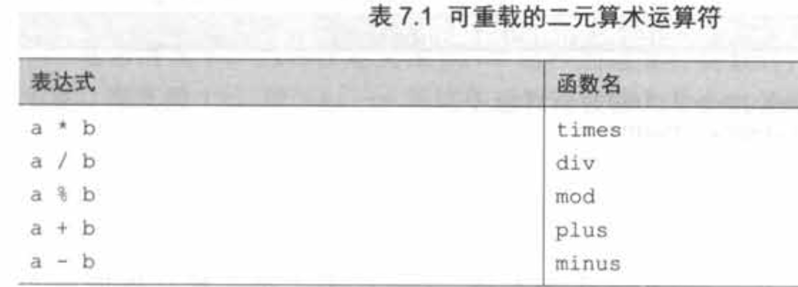

Kotlin运算符重载的技术叫约定，如：命名了一个plus的特殊方法，就可以在其实例上使用+。

使用`operator`关键字来声明重载方法。

# 重载算术运算符

## 二元算术运算符

例子：

```kotlin
data class Point(val x: Int, val y: Int) {
    operator fun plus(other: Point): Point 
            = Point(x + other.x, y + other.y)
}

fun main() {
    val p1 = Point(10, 20)
    val p2 = Point(30, 40)
    println(p1 + p2)
}

Point(x=40, y=60)
```

**可重载的二元算术运算符**



**Koltin和Java的互调**

从Java调用Kotlin：因为每个重载的运算符都被定义为一个函数，可以像普通函数那样调用它们。

从Kotlin调用Java：由于Java没有定义任何用于标记运算符函数的语法，所以使用operator修饰符的要求对它不适用，唯一的约束是，参数需要匹配名称和数量。如果Java类定义了一个满足需求的函数，但是起了一个不同的名称，可以通过定义一个扩展函数来修正这个函数名，用来代替现有的Java方法。

**没有用于位运算的特殊运算符**

Kotlin没有为标准数字类型定义任何位运算符，因此，也不允许你为自定义类型定义它们。相反，它使用支持中缀调用语法的常规函数，可以为自定义类型定义相似的函数。

以下是Kotlin提供的，用于执行位运算的完整函数列表

| 函数名 | 作用       |
| ------ | ---------- |
| shl    | 带符号左移 |
| shr    | 带符号右移 |
| ushr   | 无符号右移 |
| and    | 按位与     |
| or     | 按位或     |
| xor    | 按位异或   |
| inv    | 按位取反   |

## 重载复合赋值运算符

像+=、-=等这些运算符被称为复合赋值运算符。

```kotlin
point = point + Point (3, 4)//1
point += Point (3, 4)//2
```

1和2效果相同，但是1是返回新的对象，2是在原对象上修改（只对于可变变量有效）。

如果定义了一个返回值为Unit，名为plusAssign的函数，Kotlin将会在用到+=运算符的地方调用它。其他二元算术运算符也有命名相似的对应函数：如minusAssign、timesAssign等。

当代码中用到+=的时候，理论上plus和plusAssign都可能被调用。如果在这种情况下，两个函数都有定义且适用，编译器会报错，解决办法：

1.  替换运算符的使用为普通函数调用。
2.  另一个办法是，用val替换var，这样plusAssign运算就不再适用。

但一般来说，最好在设计新类时保持(可变性)一致：尽量不要同时给一个类添加plus和plusAssign运算。如果像前面的一个示例中的Point，这个类是不可变的，那么就应该只提供返回一个新值(如plus)的运算。如果一个类是可变的，比如构建器，那么只需要提供plusAssign和类似的运算就够了。

Kotlin标准库支持集合的这两种方法。**+和-运算符总是返回一个新的集合。+=和-=运算符用于可变集合时，始终就地修改它们；而它们用于只读集合时，会返回一个修改过的副本(这意味着只有当引用只读集合的变量被声明为var的时候，才能使用+=和-=)**。

## 重载一元运算符

和二元算术运算符类似。

| 表达式  | 函数名     |
| ------- | ---------- |
| +a      | unaryPlus  |
| -a      | unaryMinus |
| !a      | not        |
| ++a,a++ | inc        |
| --a,a-- | dec        |

# 重载比较运算符

与算术运算符样，在Kotlin中，可以对任何对象使用比较运算符(==、!=、>、<等)，而不仅仅限于基本数据类型。不用像Java那样调用equals或compareTo函数，可以直接使用比较运算符。在这一节中，我们将介绍用于支持这些运算符的约定。

## 等号运算符"equals”

如果在Kotlin中使用==运算符，它将被转换成equals方法的调用。

注意，和所有其他运算符不同的是，==和!=可以用于可空运算数，因为这些运算符事实上会检查运算数是否为null。比较a == b会检查a是否为非空，如果不是，就调用a.equals(b)；否则，只有两个参数都是空引用，结果才是true。

手动实现equals：

```kotlin
override fun equals(other: Any?): Boolean {
    if (other === this)
        return true
    if (other !is Point)
        return false
    return other.x == x && other.y == y;
}
```

使用恒等运算符(===)来检查引用是否相同。

equals函数没有operator修饰符，这是因为这个方法的实现是在Any类中定义的。函数的operator修饰符适用于所有实现或重写它的方法。

注意，equals不能实现为扩展函数，因为继承自Any类的实现始终优先于扩展函数。

## 排序运算符compareTo

略

# 集合和区间

## in

in运算符用于检查某个对象是否属于集合，相应的函数叫作contains。

## ..

`..` 运算符对应rangeTo函数。

# 解构声明

解构声明主要使用场景之一，是从一个函数返回多个值。

```
val p = Point(10, 20)
va1 (x, y) = p
>>> print1n (x)
10
>>> println (y)
20
```

```kotlin
class Point (val X: Int , val y: Int) {
	operator fun component1 () = X
	operator fun component2 () = y
}
```

不能定义无限数量的componentN函数，标准库只允许使用此语法来访问一个对象的前五个元素。

还有一个使用场景时map的遍历。

```kotlin
fun printEntries(map: Map<String, String>) {
    for ((key, value) in map) {
        println("$key -> $value")
    }
}
```

# 委托属性

## 基本语法

委托属性用于处理起来比把值存储在支持字段中更复杂，却不用在每个访问器中都重复这样的逻辑。例如，这些属性可以把它们的值存储在数据库表中，在浏览器会话中，在一个map中等。

委托属性的背后是委托模式，操作的对象不用自己执行，而是把工作委托给另一个辅助的对象。

委托属性的基本语法是这样的：

```kotlin
class Foo {
	var p: Type by Delegate ()
}
```

Delegate类必须具有getValue和setValue方法(后者仅适用于可变属性)。

```kotlin
class Delegate {
    operator fun getValue(...) {...}
	operator fun setValue(..., value: Type) {...}
}
```

相当于这样写：

```kotlin
class Foo {
    private val delegate = Delegate ()
    var p: Type
		set(value: Type) = delegate.setValuel(..., value)
		get() = delegate.getValue(...)
}
```

## 惰性加载

一般的惰性加载代码：

```kotlin
class Person(val name: String) {
    private var _emails: List<Email>? = null

    val emails: List<Email>
       get() {
           if (_emails == null) {
               _emails = loadEmails(this)
           }
           return _emails!!
       }
}
```

如果有多个惰性属性，代码会很长。而且，它不是线程安全的。

Kotlin可以使用标准库函数lazy返回的委托。

>   //TODO 这里为什么Kotlin是线程安全的

```kotlin
class Person(val name: String) {
    val emails by lazy { loadEmails(this) }
}
```

Iazy函数返回一个对象，该对象具有一个名为getValue且签名正确的方法，因此可以把它与by关键字一起使用来创建一个委托属性。lazy的参数是一个lambda，可以调用它来初始化这个值。默认情况下，lazy函数是线程安全的，如果需要，可以设置其他选项来告诉它要使用哪个锁，或者完全避开同步，如果该类永远不会在多线程环境中使用。

## 原理

