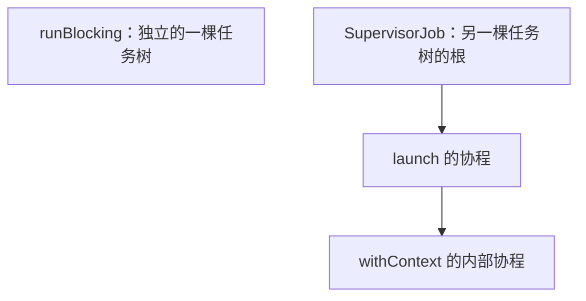

> 源码版本：协程库固定为 **kotlinx.coroutines 1.10.2**，编译器与标准库固定为 **Kotlin/JVM 2.1.20**。

# 协程基础

> **原理小结**：协程用续体保存执行进度，挂起时让出线程，恢复时按调度器继续执行。

协程是可以挂起和恢复的计算过程。可以把它类比为“轻量级线程”，但它仍需要线程执行代码。

协程的主要价值是用顺序代码表达异步流程，并用父子关系管理任务的完成与取消。创建协程通常比创建线程便宜，但大量协程及其持有的数据仍然会消耗内存。

# 基础使用和原理

## 基础使用：启动并等待一个协程

```kotlin
fun main() = runBlocking {
    val job = launch {
        delay(30)
        println("子任务完成")
    }
    println("任务已提交")
    job.join()
    println("继续执行")
}
```

预期输出：

```text
任务已提交
子任务完成
继续执行
```

这里默认的 `runBlocking` 在当前线程上运行事件循环。父协程先提交 `launch`，执行到 `join()` 才让出执行机会；子协程完成后，`join()` 返回。

## 源码原理：一个协程由哪些对象协作完成

从 [Builders.common.kt](https://github.com/Kotlin/kotlinx.coroutines/blob/1.10.2/kotlinx-coroutines-core/common/src/Builders.common.kt) 的 `launch()` 开始，默认启动路径可以归纳为：

```text
CoroutineScope.launch
  → newCoroutineContext：合并作用域与本次启动的上下文
  → StandaloneCoroutine：创建协程对象
  → AbstractCoroutine.start：按启动策略启动协程体
  → 执行协程体，遇到真正的挂起时返回挂起标记
  → 条件满足后恢复续体，继续执行
```

几个对象分别解决不同问题：

| 对象                  | 负责什么                               |
| --------------------- | -------------------------------------- |
| `CoroutineScope`      | 提供启动协程所用的上下文               |
| `CoroutineContext`    | 按 Key 保存 `Job`、调度器、名称等元素  |
| `Job`                 | 管理完成、取消和父子关系               |
| `Continuation`        | 表示后续计算，并接收成功结果或异常     |
| `CoroutineDispatcher` | 决定是否需要调度，以及交给哪个执行环境 |

在 [AbstractCoroutine.kt](https://github.com/Kotlin/kotlinx.coroutines/blob/1.10.2/kotlinx-coroutines-core/common/src/AbstractCoroutine.kt) 中，`AbstractCoroutine` 同时实现 `Job`、`Continuation` 和 `CoroutineScope`。因此 `launch()` 返回的 `Job` 就是该协程对象，而不是额外创建的线程句柄。

编译器生成的函数状态机与这个协程对象也需要区分：前者保存函数恢复位置，后者管理整个协程的生命周期，二者通过续体调用链连接。

JVM 入口见 [Builders.kt](https://github.com/Kotlin/kotlinx.coroutines/blob/1.10.2/kotlinx-coroutines-core/jvm/src/Builders.kt)：`runBlocking()` 创建 `BlockingCoroutine`，最后进入 `joinBlocking()`。这个循环处理事件，在没有可运行事件时停放调用线程，直到协程完成。因此“`delay` 不阻塞线程”和“外层 `runBlocking` 阻塞调用者”并不矛盾。

# CoroutineScope 与 CoroutineContext

`CoroutineScope` 提供上下文，生命周期管理主要由上下文中的 `Job` 实现。仅仅创建作用域并不能自动防止泄漏，还必须把作用域的取消与业务对象的生命周期连接起来。

## 小结

Scope 提供 Context，Context 携带 Job；启动时连接父子 Job，完成与取消通过这棵任务树协调。

## 基础使用

### 基础使用：统一取消子任务

```kotlin
fun main() = runBlocking {
    val scope = CoroutineScope(SupervisorJob() + Dispatchers.Default)
    val child = scope.launch(start = CoroutineStart.UNDISPATCHED) {
        try {
            println("子任务开始")
            awaitCancellation()
        } finally {
            println("子任务清理")
        }
    }
    scope.cancel()
    child.join()
    println("作用域活跃：${scope.isActive}")
}
```

预期输出：

```text
子任务开始
子任务清理
作用域活跃：false
```

`UNDISPATCHED` 让协程立即在调用线程执行到首次实际挂起，因此取消前一定已经进入 `try`。它只影响初次启动，挂起后的恢复仍遵循上下文中的调度器。`child.join()` 确保清理结束后再打印最后一行。

这个 `scope` 有自己的根 Job，不会仅仅因为写在 `runBlocking` 内部，就成为它的子作用域。示例明确取消并等待任务；业务中通常由持有者在销毁时取消这种长期作用域。

### 基础使用：用 coroutineScope 等待一组任务

```kotlin
fun test2() = runBlocking {
        val v = coroutineScope {
            launch {
                delay(30)
                println("子任务完成")
            }
            println("作用域代码块结束")
            1
        }
        println("coroutineScope 返回 $v")
    }
```

预期输出：

```text
作用域代码块结束
子任务完成
coroutineScope 返回 1
```

`CoroutineScope(context)` 是创建对象的工厂函数；`coroutineScope {}` 是挂起函数，会等代码块及其所有子协程完成。函数内部拆分并发任务时，优先考虑后者。

### 两种写法的区别

**`coroutineScope {}` 是等待一组任务完成的挂起函数；`CoroutineScope(context)` 是创建作用域对象的工厂函数。** 名字相近，但用途不同。

| 对比         | `coroutineScope {}`          | `CoroutineScope(context)`            |
| ------------ | ---------------------------- | ------------------------------------ |
| 调用位置     | **协程体或挂起函数中**       | 普通函数中也可以                     |
| 返回内容     | 代码块的结果                 | 一个 `CoroutineScope` 对象           |
| 是否等待任务 | 等待代码块及所有子协程完成   | 创建对象后立即返回                   |
| Job 关系     | 创建新的子 Job，关联当前 Job | 使用传入的 Job；没有则补一个 `Job()` |
| 生命周期     | 覆盖本次代码块及其子任务     | 由传入的 Job 和持有者管理            |
| 常见用途     | 在一个挂起函数中拆分并发任务 | 为页面、组件、服务持有长期作用域     |

**`coroutineScope {}`：这组任务全部结束，函数才继续。**

```
fun main() = runBlocking {
    coroutineScope {
        launch {
            delay(100)
            println("子任务完成")
        }
        println("代码块执行完毕")
    }
    println("coroutineScope 返回")
}
```

预期输出：

```
代码块执行完毕
子任务完成
coroutineScope 返回
```

虽然代码块最后一行已经执行，但子协程还没结束，所以 `coroutineScope` 仍然等待。等待时挂起当前协程，不会像 `runBlocking` 那样阻塞调用线程。

**`CoroutineScope(context)`：先拿到作用域，以后可以多次向它提交任务。**

```
class Worker {
    private val scope =
        CoroutineScope(SupervisorJob() + Dispatchers.Default)

    fun start() {
        scope.launch {
            delay(100)
            println("任务完成")
        }
        // start() 不等待任务完成
    }

    fun close() {
        scope.cancel()
    }
}
```

这个作用域不会因为 `start()` 返回就结束；需要在 `Worker` 不再使用时调用 `close()`。这里的 `SupervisorJob` 用于隔离直接子任务的失败，并不是 `CoroutineScope()` 自动提供的。

从源码看，两者的区别很直接：

- **`coroutineScope {}`** 创建 `ScopeCoroutine`，关联调用者的 Job；完成流程等待所有子协程结束，再恢复调用者。
- **`CoroutineScope(context)`** 检查上下文是否包含 Job，没有就补上，然后用 `ContextScope` 包装上下文；创建对象本身不会启动协程，也不会等待任务。[源码入口](https://github.com/Kotlin/kotlinx.coroutines/blob/1.10.2/kotlinx-coroutines-core/common/src/CoroutineScope.kt)

一个容易混淆的细节：**`CoroutineScope(coroutineContext)` 会沿用当前 Job，不会自动创建新的子 Job，也不一定是独立作用域。**

选择时可以记住：**函数内部拆分并等待并发任务，用 `coroutineScope {}`；需要由对象持有、跨多次调用提交任务，用 `CoroutineScope(context)`。**

## 源码原理：上下文如何变成父子关系

### 创建作用域时补齐 Job

```kotlin
public fun CoroutineScope(context: CoroutineContext): CoroutineScope =
    ContextScope(if (context[Job] != null) context else context + Job())
```

`CoroutineScope(context)` 检查 `context[Job]`：已有 Job 就保留，没有就补一个普通 `Job()`，再用 `ContextScope` 包装上下文。`scope.cancel()` 则取出上下文中的 Job 并调用其 `cancel()`。

真正的子任务关联记录在 Job 的内部结构中。

### 启动子协程时建立关联

关键调用链是：**`launch()` → 创建协程对象 → `AbstractCoroutine` 初始化 → `initParentJob()` → 父 Job 的 `attachChild(this)`**。

#### launch：把作用域上下文传给子协程

源码：[Builders.common.kt](https://github.com/Kotlin/kotlinx.coroutines/blob/1.10.2/kotlinx-coroutines-core/common/src/Builders.common.kt)。

```kotlin
public fun CoroutineScope.launch(
    context: CoroutineContext = EmptyCoroutineContext,
    start: CoroutineStart = CoroutineStart.DEFAULT,
    block: suspend CoroutineScope.() -> Unit
): Job {
    val newContext = newCoroutineContext(context)
    val coroutine = if (start.isLazy)
        LazyStandaloneCoroutine(newContext, block) else
        StandaloneCoroutine(newContext, active = true)
    coroutine.start(start, coroutine, block)
    return coroutine
}
```

`newCoroutineContext(context)` 合并作用域上下文与本次传入的上下文。没有显式覆盖 Job 时，`newContext[Job]` 就是作用域中的 Job，将作为新协程的父 Job。

`StandaloneCoroutine` 继承 `AbstractCoroutine<Unit>`，向其构造函数传入 `initParentJob = true`。懒启动的 `LazyStandaloneCoroutine` 也继承 `StandaloneCoroutine`，所以**即使协程体尚未执行，创建对象时也会建立父子关联**。`async()` 创建的 `DeferredCoroutine` 同样沿这条初始化路径建立关联。

#### AbstractCoroutine：取出父 Job，再设置自己的 Job

源码：[AbstractCoroutine.kt](https://github.com/Kotlin/kotlinx.coroutines/blob/1.10.2/kotlinx-coroutines-core/common/src/AbstractCoroutine.kt)。

```kotlin
public abstract class AbstractCoroutine<in T>(
    parentContext: CoroutineContext,
    initParentJob: Boolean,
    active: Boolean
) : JobSupport(active), Job, Continuation<T>, CoroutineScope {

    init {
        // 从传入的上下文中取出父 Job，建立关联
        if (initParentJob) initParentJob(parentContext[Job])
    }

    // 当前协程本身也是 Job，将自己放入自己的上下文
    public final override val context: CoroutineContext = parentContext + this

    public override val coroutineContext: CoroutineContext get() = context

    // 其余成员省略
}
```

随后，子协程自己的上下文由 `parentContext + this` 形成。这里的 `this` 也是 Job；由于相同 Key 的元素会被右侧替换，子协程体中的 `coroutineContext[Job]` 指向子协程自己。父 Job 则通过已经建立的关联保存下来。

#### initParentJob：让父 Job 登记当前子协程

源码：[JobSupport.kt](https://github.com/Kotlin/kotlinx.coroutines/blob/1.10.2/kotlinx-coroutines-core/common/src/JobSupport.kt)。

```kotlin
protected fun initParentJob(parent: Job?) {
    assert { parentHandle == null }
    if (parent == null) {
        parentHandle = NonDisposableHandle
        return
    }
    parent.start()
    val handle = parent.attachChild(this) // this 是当前子协程
    parentHandle = handle
    if (isCompleted) {
        handle.dispose()
        parentHandle = NonDisposableHandle
    }
}
```

真正建立关联的是 `parent.attachChild(this)`：父 Job 登记子协程，子协程通过 `parentHandle` 保存关联句柄。没有父 Job 时不建立关联；注册后若发现子协程已经完成，就释放句柄，处理完成与注册之间的竞争。

`parent.start()` 只是确保已有的父 Job 处于已启动状态，并不是创建父 Job。

#### attachChild：用节点连接父子双方

同一个 `JobSupport.kt` 中，`attachChild()` 先创建下面的节点，再通过 `tryPutNodeIntoList()` 将其登记到父 Job 的内部状态结构中，并处理父 Job 正在取消或已经完成的情况：

```kotlin
// attachChild() 中的节点创建语句；此处 this 是父 Job
val node = ChildHandleNode(child).also { it.job = this }
```

这个节点同时持有子 Job，并通过继承的 `job` 属性指向父 Job：

```kotlin
private class ChildHandleNode(
    @JvmField val childJob: ChildJob
) : JobNode(), ChildHandle {
    override val parent: Job get() = job
    override val onCancelling: Boolean get() = true
    override fun invoke(cause: Throwable?) = childJob.parentCancelled(job)
    override fun childCancelled(cause: Throwable): Boolean = job.childCancelled(cause)
}
```

- **父取消通知子**：父 Job 取消时触发节点的 `invoke()`，调用子 Job 的 `parentCancelled(job)`。
- **子失败报告父**：子 Job 通过关联句柄调用 `childCancelled(cause)`，转交父 Job 决定是否传播失败；普通 Job 与 SupervisorJob 在这里采取不同策略。
- **父等待子完成**：父 Job 的完成流程识别这些子节点，等待仍未完成的子任务；子任务完成后释放关联。

```text
scope.coroutineContext[Job]：父 Job
  ├─ launch A：自己的 Job，关联到父 Job
  └─ launch B：自己的 Job，关联到父 Job

scope.cancel()
  → 父 Job 取消
  → 通知 A、B 取消
```

这也解释了为什么随意给 `launch(Job())` 传入新 Job 会改变父子关系：它覆盖了原本应该继承的父 Job。

### coroutineScope 如何等待子协程

`coroutineScope()` 创建 `ScopeCoroutine`，并通过 `startUndispatchedOrReturn()` 执行代码块。代码块返回后，`JobSupport` 的完成流程仍会等待未完成的子协程，全部结束后才恢复外层调用者。

### SupervisorJob 改变的是异常传播

普通 Job 下，子协程的非取消异常通常会让父 Job 失败，继而取消兄弟协程。[Supervisor.kt](https://github.com/Kotlin/kotlinx.coroutines/blob/1.10.2/kotlinx-coroutines-core/common/src/Supervisor.kt) 中的 `SupervisorJobImpl` 重写了 `childCancelled()`，不把单个子协程的失败升级为自身失败。

监督只作用于直接子协程之间；监督 Job 自己被取消时，仍会取消所有子协程。它也不会替代异常处理，具体用法见最后一章。

# Dispatcher：协程在哪里执行

调度器决定协程下一段代码如何获得执行机会。**切换调度器不等于一定更换物理线程**，恢复到原调度器也不等于恢复到原工作线程；是否固定线程取决于调度器的约束。

## 小结

调度器包装续体，在恢复时决定直接执行还是提交调度；`withContext` 完成后恢复调用者上下文。


## 常用调度器

| 调度器                   | 主要用途                     | 需要注意                                          |
| ------------------------ | ---------------------------- | ------------------------------------------------- |
| `Dispatchers.Default`    | CPU 密集计算、排序、解析     | JVM 上使用共享调度器和工作线程                    |
| `Dispatchers.IO`         | 阻塞式文件、数据库、网络调用 | 与 Default 共享底层线程资源，并针对阻塞任务调度   |
| `Dispatchers.Main`       | UI 更新                      | 依赖平台提供实现，普通 JVM 控制台默认没有 UI Main |
| `Dispatchers.Unconfined` | 特殊框架或底层场景           | 初始在调用线程执行，恢复线程由实际挂起操作决定    |

## 基础使用：切换上下文并取得结果

```kotlin
fun main() = runBlocking {
    val caller = Thread.currentThread()
    val result = withContext(Dispatchers.Default) {
        println("在工作线程：${Thread.currentThread() !== caller}")
        (1..3).sum()
    }
    println("结果：$result")
    println("回到调用线程：${Thread.currentThread() === caller}")
}
```

预期输出：

```text
在工作线程：true
结果：6
回到调用线程：true
```

本例能回到同一个调用线程，是因为外层使用默认 `runBlocking` 的线程事件循环。如果外层也是多线程调度器，只能保证恢复到相应上下文，不能保证线程身份不变。

## 源码原理：续体拦截与调度

`CoroutineDispatcher` 是一种 `ContinuationInterceptor`。它通过 `interceptContinuation()` 把原续体包装为 `DispatchedContinuation`，让恢复操作有机会先经过调度逻辑。

```text
挂起操作完成
  → 恢复包装后的续体
  → 判断 isDispatchNeeded(context)
      ├─ 需要调度：保存结果，经 dispatch 提交任务
      └─ 不需要调度：走当前线程上的执行路径
  → 恢复原续体，继续执行状态机
```

实际实现还处理线程上下文、取消检查和无约束事件循环。这里关注的是：**结果到达不等于用户代码立即执行，恢复还可能需要等待调度。**

## 源码原理：withContext 的三条路径

[Builders.common.kt](https://github.com/Kotlin/kotlinx.coroutines/blob/1.10.2/kotlinx-coroutines-core/common/src/Builders.common.kt) 中的 `withContext()` 先合并上下文，并对新上下文执行 `ensureActive()`，随后分支处理：

| 条件                     | 内部对象与行为                                               |
| ------------------------ | ------------------------------------------------------------ |
| 新旧上下文完全相同       | 用 `ScopeCoroutine` 直接进入代码块                           |
| 上下文变化，但调度器相同 | 用 `UndispatchedCoroutine`，更新线程上下文后直接执行         |
| 调度器不同               | 用 `DispatchedCoroutine`，按新上下文启动，完成后恢复原调用者 |

因此 `withContext` 既不保证发生线程切换，也不保证实际挂起。代码块如果立即完成，内部可以直接返回结果；需要等待时，才返回 `COROUTINE_SUSPENDED`。

切换调度器的返回路径使用可取消的恢复方式。如果结果已经计算好，但原调用者在得到执行机会前被取消，结果仍可能被丢弃并抛出 `CancellationException`。

## 源码原理：Default 与 IO 为什么可能共用线程

JVM 实现见 [scheduling/Dispatcher.kt](https://github.com/Kotlin/kotlinx.coroutines/blob/1.10.2/kotlinx-coroutines-core/jvm/src/scheduling/Dispatcher.kt)。`DefaultScheduler` 承接默认计算任务；`DefaultIoScheduler` 最终通过 `UnlimitedIoScheduler`，把带有阻塞任务标记的任务交给同一个调度基础设施。

因此从 Default 切到 IO，调度语义变化了，但底层可能继续使用同一条工作线程。选择 IO 的目的，是正确标记和限制阻塞工作，不能依靠线程名称来判断调度器是否切换成功。


# Job、取消与 async

`Job` 表示任务的生命周期；`Deferred<T>` 继承 `Job`，额外提供结果读取能力。`launch` 返回 Job，`async` 返回 Deferred。

## 小结

Job 用状态机管理完成与取消，取消靠代码协作响应；`async` 还会保存结果，供 `await` 读取或挂起等待。

## 基础使用：启动状态与 join

```kotlin
fun main() = runBlocking {
    val job = launch(start = CoroutineStart.LAZY) {
        println("任务执行")
    }
    println("启动前活跃：${job.isActive}")
    job.join()
    println("任务已完成：${job.isCompleted}")
}
```

预期输出：

```text
启动前活跃：false
任务执行
任务已完成：true
```

懒启动的 Job 初始为 New，`join()` 会触发启动并等待完成。常用启动策略还包括：`DEFAULT` 按调度器提交；`UNDISPATCHED` 立即执行到首次实际挂起。`join()` 本身不读取业务结果，也不直接重新抛出被等待任务的失败原因；但等待者如果因父子异常传播而被取消，`join()` 仍会抛取消异常。

## 源码原理：Job 状态与完成通知

源码入口：[JobSupport.kt](https://github.com/Kotlin/kotlinx.coroutines/blob/1.10.2/kotlinx-coroutines-core/common/src/JobSupport.kt)。

join()` 先检查任务是否已完成：完成就检查等待者自身是否活跃并返回；尚未完成则进入 `joinSuspend()`，注册 `ResumeOnCompletion`。被等待任务完成时，完成通知会恢复等待者。这里保存的是等待协程的续体，不是让线程一直轮询。

## 基础使用：取消并等待清理

```kotlin
fun main() = runBlocking {
    val job = launch(start = CoroutineStart.UNDISPATCHED) {
        try {
            println("任务开始")
            awaitCancellation()
        } finally {
            println("释放普通资源")
            withContext(NonCancellable) {
                delay(30)
                println("异步清理完成")
            }
        }
    }
    job.cancelAndJoin()
    println("取消并等待完成")
}
```

预期输出：

```text
任务开始
释放普通资源
异步清理完成
取消并等待完成
```

`cancel()` 发出取消请求，不代表任务已退出；`cancelAndJoin()` 还会等待退出。普通资源释放直接放进 `finally`。如果取消后仍需调用可取消的挂起函数完成必要清理，可以在很小的范围内使用 `withContext(NonCancellable)`。

不要用 `NonCancellable` 包住整个业务流程；其中的清理如果一直不结束，外层等待也不会结束。协程若在进入 `try` 之前就被取消，也不能期待这个 `finally` 执行。

## 基础使用：主动检查取消

下面主动取消当前子协程，展示取消标记与检查点的区别：

```kotlin
fun main() = runBlocking {
    val job = launch {
        cancel()
        println("取消后仍执行到这里")
        try {
            ensureActive()
            println("不会执行")
        } catch (e: CancellationException) {
            println("检查点发现取消")
            throw e
        }
    }
    job.join()
}
```

预期输出：

```text
取消后仍执行到这里
检查点发现取消
```

| 检查方式                            | 行为                                           | 适合场景                 |
| ----------------------------------- | ---------------------------------------------- | ------------------------ |
| `isActive`                          | 返回布尔值，由业务决定如何退出                 | 可自行结束的计算循环     |
| `ensureActive()`                    | 已取消就抛 `CancellationException`，本身不挂起 | 计算任务中的检查点       |
| `yield()`                           | 检查取消，并在适用时让出执行机会               | 长循环兼顾取消和公平调度 |
| `delay()`、`awaitCancellation()` 等 | 挂起等待期间响应取消                           | 异步等待                 |

挂起函数的签名不保证取消能力；例如底层 `suspendCoroutine` 不会自动接入 Job 取消。阻塞式 I/O 也不会仅仅因为外层 Job 被取消就自动终止。对支持线程中断的阻塞调用，可以了解 `runInterruptible`；其他调用需要底层 API 提供取消机制。

## 源码原理：取消为什么需要协作

`JobSupport.cancelImpl()` 推进 Job 的取消状态，通知取消监听器及子任务。但它不会强行在任意一条 CPU 指令处插入异常，所以普通计算代码可以继续执行到下一次检查点。

对于挂起等待，[CancellableContinuationImpl.kt](https://github.com/Kotlin/kotlinx.coroutines/blob/1.10.2/kotlinx-coroutines-core/common/src/CancellableContinuationImpl.kt) 会向当前 Job 注册取消关联。Job 取消时，等待中的续体被取消，并通过恢复路径让挂起调用抛出 `CancellationException`。

对于主动检查，[Job.kt](https://github.com/Kotlin/kotlinx.coroutines/blob/1.10.2/kotlinx-coroutines-core/common/src/Job.kt) 的 `ensureActive()` 读取 Job 状态，在不活跃时抛出其取消异常。它不执行线程切换。

[NonCancellable.kt](https://github.com/Kotlin/kotlinx.coroutines/blob/1.10.2/kotlinx-coroutines-core/common/src/NonCancellable.kt) 提供一个始终活跃的特殊 Job。`withContext(NonCancellable)` 暂时替换代码块上下文中的 Job，使清理代码里的取消检查不会读取原来已取消的 Job；它并没有让原任务恢复成活跃状态。

## async 与 await

### 基础使用：并发获取两个结果

```kotlin
fun main() = runBlocking {
    val first = async { delay(30); 10 }
    val second = async { delay(30); 20 }
    println("结果：${first.await() + second.await()}")

    val lazyResult = async(start = CoroutineStart.LAZY) { 40 }
    println("懒任务活跃：${lazyResult.isActive}")
    println("懒任务结果：${lazyResult.await()}")
}
```

预期输出：

```text
结果：30
懒任务活跃：false
懒任务结果：40
```

前两个任务在等待期间重叠，属于并发；本例并没有创建多线程并行计算。`await()` 会启动懒任务；`start()`、`join()` 也能启动它。如果多个懒任务需要并发执行，应先全部 `start()`，再依次 `await()`。

如果要统计一组任务的耗时，应让计时范围包含 `await()`、`joinAll()` 或完整的 `coroutineScope {}`。仅测量两次 `launch()` 调用，得到的是提交任务的耗时。

### 源码原理：Deferred 如何保存结果

[Builders.common.kt](https://github.com/Kotlin/kotlinx.coroutines/blob/1.10.2/kotlinx-coroutines-core/common/src/Builders.common.kt) 的 `async()` 创建 `DeferredCoroutine`，它继承 `AbstractCoroutine` 并实现 `Deferred`，将 `await()` 委托给 `awaitInternal()`。

在 [JobSupport.kt](https://github.com/Kotlin/kotlinx.coroutines/blob/1.10.2/kotlinx-coroutines-core/common/src/JobSupport.kt) 中，`awaitInternal()` 有两种路径：任务已完成时，读取终态保存的结果，或抛出保存的失败原因；尚未完成时，启动懒任务（如果需要），通过 `AwaitContinuation` 和 `ResumeAwaitOnCompletion` 等待通知。

所以 `await()` 并不一定挂起，也不是循环查询结果。`async` 的异常也不是等到 `await` 才影响父任务：普通父 Job 下，失败发生时就可能触发向上传播；监督作用域的差异见最后一章。

# 草稿


# suspend：从顺序代码到状态机

> **原理小结**：编译器用续体参数和必要的状态机实现挂起函数；真正挂起时保存恢复位置与所需变量，恢复后接着执行。

`suspend` 表示函数允许挂起，并约束调用位置。它不会自动创建协程、开启线程，也不会把内部的阻塞调用改造成非阻塞调用。

## 基础使用：挂起后继续使用局部变量

```kotlin
suspend fun score(base: Int): Int {
    val doubled = base * 2
    println("挂起前：$doubled")
    delay(30)
    return doubled + 1
}

fun main() = runBlocking {
    println("结果：${score(10)}")
}
```

预期输出：

```text
挂起前：20
结果：21
```

调用者仍然按顺序读取返回值；等待过程中让出线程的是协程执行流程。`doubled` 在挂起之后仍然可用，因为编译器会保存后续执行需要的状态。

## 源码原理：隐藏参数与挂起标记

按照 [Kotlin 协程规范](https://kotlinlang.org/spec/asynchronous-programming-with-coroutines.html)，JVM 上的挂起函数采用续体传递方式。上面的函数编译后，可以用以下签名理解；这是签名示意，不是让业务代码手工调用的 API：

```text
score(base: Int, completion: Continuation<Int>): Any?
```

隐藏的 `completion` 表示函数完成之后的后续计算。返回 `Any?` 是因为一次调用可能：

- 直接返回结果，调用者继续执行。
- 返回特殊标记 `COROUTINE_SUSPENDED`，调用者也沿调用链返回，让出控制权；最终结果以后通过续体送回。

因此，调用一个 `suspend` 函数只是可能发生挂起。无需等待时可以直接走完。

## 源码原理：编译器保存什么

以这个 `score()` 为例，编译器生成的续体实现会保存恢复位置与跨挂起点使用的变量。用 Kotlin/JVM 2.1.20 编译并通过 `javap -p -c` 查看，可以看到 `label`、`result`、保存 `doubled` 的整数字段 `I$0`，以及 `invokeSuspend()`。字段名称和具体布局是编译器实现细节。

```text
初次进入 score
  → 根据 label 进入初始分支
  → 计算 doubled，并保存到续体字段
  → 把 label 改为“delay 之后”
  → 调用 delay(30, 当前续体)
      ├─ 返回挂起标记：score 也返回该标记
      └─ 直接完成：继续执行后半段

delay 完成后恢复
  → invokeSuspend 重新进入 score 的状态机
  → 根据 label 跳到恢复分支
  → 检查恢复结果是否为异常
  → 取回 doubled，返回 doubled + 1
```

不需要跨挂起点保存的局部变量，可以留在普通局部变量槽中，或者被优化掉。并非每个挂起函数都一定生成完整状态机，例如没有挂起调用或可进行尾调用优化的函数可能更简单。

`Continuation` 接口本身只约定 `context` 和 `resumeWith(result)`。`label`、局部变量等字段属于编译器生成的具体实现，不能把它们说成接口本身的成员。

## 源码原理：谁驱动状态机继续执行

Kotlin 标准库的 `BaseContinuationImpl.resumeWith()` 调用子类的 `invokeSuspend()`：返回挂起标记就结束本次恢复；返回普通结果或抛出异常，就将成功或失败传给上一级 completion。上一级仍是 `BaseContinuationImpl` 时，它使用循环继续传播，减少递归层数。

`ContinuationImpl.intercepted()` 则读取上下文里的 `ContinuationInterceptor`，取得并缓存包装后的续体。这是编译器生成的状态机与前文 Dispatcher 调度逻辑连接的位置。

源码可在 [Kotlin 2.1.20 标准库源码包](https://repo.maven.apache.org/maven2/org/jetbrains/kotlin/kotlin-stdlib/2.1.20/kotlin-stdlib-2.1.20-sources.jar) 中查看：`jvmMain/kotlin/coroutines/jvm/internal/ContinuationImpl.kt`；接口位于 `commonMain/kotlin/coroutines/Continuation.kt`。

## 源码原理：delay 为什么不占住线程等待

[Delay.kt](https://github.com/Kotlin/kotlinx.coroutines/blob/1.10.2/kotlinx-coroutines-core/common/src/Delay.kt) 中，正数且非无限时长的 `delay()` 使用 `suspendCancellableCoroutine` 创建可取消的等待，并调用当前延迟设施的 `scheduleResumeAfterDelay()` 注册定时恢复。

它保存的是待恢复的续体与定时任务，不是为每个 delay 启动一个线程去睡眠。定时器到期后恢复续体，后续执行仍由相应调度器安排。具体定时队列和线程由平台及调度器实现决定。

[CancellableContinuationImpl.kt](https://github.com/Kotlin/kotlinx.coroutines/blob/1.10.2/kotlinx-coroutines-core/common/src/CancellableContinuationImpl.kt) 还要解决“先完成还是先挂起”的竞争：`getResult()` 与恢复操作通过决策状态协调；结果若在真正挂起前就到达，可直接返回，否则走后续恢复路径。

## 基础使用：立即恢复的回调不一定真正挂起

```kotlin
suspend fun immediateValue(): Int = suspendCoroutine { continuation ->
    println("回调立即返回")
    continuation.resume(7)
}

fun main() = runBlocking {
    println("调用前")
    println("结果：${immediateValue()}")
}
```

预期输出：

```text
调用前
回调立即返回
结果：7
```

### 源码原理：SafeContinuation 协调同步与异步完成

标准库 `suspendCoroutine` 用 `SafeContinuation` 包装续体。当回调在代码块返回前调用 `resume()`，结果先被保存，随后 `getOrThrow()` 直接取回，因此本例不需要真正挂起。回调晚于挂起时才会恢复下游续体。源码位于上述标准库源码包的 `jvmMain/kotlin/coroutines/SafeContinuationJvm.kt`。

封装支持取消的异步 API 时，一般应考虑 `suspendCancellableCoroutine`，并用 `invokeOnCancellation` 注销回调或取消底层请求。仅仅改成挂起函数，不会自动释放底层资源；普通成功回调也必须遵守只完成一次的约定。

# Flow：异步数据流

> **原理小结**：冷流在收集时执行生产代码，`emit` 逐级调用下游；热流通过共享容器分发状态或事件。

`Flow<T>` 表示一串可异步产生的值。普通挂起函数主要返回一个结果，Flow 可以在一次收集中发出多个值。

`Flow` 接口本身不区分冷热：`flow {}` 通常创建冷流，每次收集重新运行生产逻辑；`SharedFlow`、`StateFlow` 是热流，实例和状态可以独立于某一次收集存在。

## 基础使用：创建、转换与收集冷流

```kotlin
fun main() = runBlocking {
    val values = flow {
        println("开始生产")
        emit(1)
        println("继续生产")
        emit(2)
    }
    println("创建完成")
    repeat(2) { round ->
        values.map { it * 10 }.collect {
            println("第 ${round + 1} 次收集：$it")
        }
    }
}
```

预期输出：

```text
创建完成
开始生产
第 1 次收集：10
继续生产
第 1 次收集：20
开始生产
第 2 次收集：10
继续生产
第 2 次收集：20
```

创建 Flow 时没有执行生产代码；两次收集分别重新生产。默认情况下，`emit → map → collect` 在同一协程内顺序调用，消费者处理完第一项后，生产者才执行“继续生产”。

`collect()` 是挂起函数，可以在协程体或其他挂起函数里调用，并不要求调用处一定存在一个名为 `CoroutineScope` 的接收者。

## 源码原理：冷流如何做到按需执行

源码入口：[flow/Builders.kt](https://github.com/Kotlin/kotlinx.coroutines/blob/1.10.2/kotlinx-coroutines-core/common/src/flow/Builders.kt)、[flow/Flow.kt](https://github.com/Kotlin/kotlinx.coroutines/blob/1.10.2/kotlinx-coroutines-core/common/src/flow/Flow.kt)、[Transform.kt](https://github.com/Kotlin/kotlinx.coroutines/blob/1.10.2/kotlinx-coroutines-core/common/src/flow/operators/Transform.kt)。

`flow {}` 创建 `SafeFlow`，只把代码块保存下来。调用 `collect()` 后，`AbstractFlow.collect()` 创建 `SafeCollector`，再调用 `collectSafely()`，最终执行之前保存的代码块。

```text
flow { ... }
  → SafeFlow 保存 block，暂不执行

collect
  → AbstractFlow.collect
  → 创建 SafeCollector
  → SafeFlow.collectSafely
  → 执行 block
  → emit 把值交给下游
```

`map` 等普通中间操作符主要包装下游处理逻辑，不会自动为每一步创建线程或协程。因此默认的“背压”首先来自顺序调用：下游没返回，上游的 `emit` 也没完成。中间操作符的业务代码在收集时才运行。

## 源码原理：上下文约束与取消检查

JVM 的 [SafeCollector.kt](https://github.com/Kotlin/kotlinx.coroutines/blob/1.10.2/kotlinx-coroutines-core/jvm/src/flow/internal/SafeCollector.kt) 在发送时检查当前上下文是否活跃，并校验上下文是否符合 Flow 的约束。

这解释了两个行为：

- 普通 `flow {}` 的 `emit` 会检查取消，但 `emit` 之前的一大段阻塞或不检查取消的计算仍可能继续执行。
- 不应在普通 `flow {}` 内切换到其他调度器后直接 `emit`，也不能随意从另一个子协程并发发送；需要改变上游执行环境时用 `flowOn`，需要多个协程发送时用 `channelFlow`。

回调式传感器、监听器等数据源一般适合 `callbackFlow`。它通过 Channel 接收回调产生的数据，并通过 `awaitClose` 注册取消或关闭后的清理；能否注销底层监听，取决于封装代码是否正确实现清理。构建器源码同样位于 `flow/Builders.kt`。

## 基础使用：flowOn 只改变上游上下文

```kotlin
fun main() = runBlocking {
    val caller = Thread.currentThread()
    flow {
        emit(Thread.currentThread() !== caller)
    }.flowOn(Dispatchers.Default)
        .collect { upstreamOnWorker ->
            println("上游在工作线程：$upstreamOnWorker")
            println("下游在调用线程：${Thread.currentThread() === caller}")
        }
}
```

预期输出：

```text
上游在工作线程：true
下游在调用线程：true
```

`flowOn` 影响其前面的上游操作，后面的处理和最终收集仍遵循调用者上下文。它不会把整条链之后的 UI 更新都切换到后台。

## 源码原理：buffer、flowOn 与背压策略

源码入口：[Context.kt](https://github.com/Kotlin/kotlinx.coroutines/blob/1.10.2/kotlinx-coroutines-core/common/src/flow/operators/Context.kt)、[ChannelFlow.kt](https://github.com/Kotlin/kotlinx.coroutines/blob/1.10.2/kotlinx-coroutines-core/common/src/flow/internal/ChannelFlow.kt)。

`buffer()` 和 `flowOn()` 可以创建或融合 `ChannelFlowOperatorImpl`。需要通过 Channel 连接上下游的路径会启动生产协程，让下游消费通道中的值。`flowOn` 的上下文没有实际改变调度器时，内部还有避免额外通道的优化路径。

```text
默认：上游 emit → 下游处理 → 返回上游

引入缓冲后：
生产协程 → Channel 缓冲区 → 消费协程
              满时按溢出策略处理
```

| 操作 | 行为 | 适用情形 |
| --- | --- | --- |
| 默认顺序收集 | 下游处理完成后，上游继续 | 每项数据都要处理 |
| `buffer(n)` | 上下游可并发推进；默认满时挂起生产者 | 容忍短期速度差 |
| `conflate()` | 丢弃积压旧值，尽量保留最新值 | 进度、当前位置等状态 |
| `collectLatest` | 新值到达时取消前一项正在执行的收集动作 | 可取消的搜索结果处理 |
| `debounce` | 一段时间没有新值后再发出最后一项 | 输入防抖；1.10.2 中需 `FlowPreview` opt-in |
| `distinctUntilChanged()` | 按相等性过滤连续重复值 | 避免重复处理相同内容 |

`buffer(60)` 是缓冲 60 项，不代表每秒处理 60 项；`debounce(300)` 也不是通用的“每 300ms 一次”限速器。时间筛选、积压处理、取消旧工作解决的是不同问题。

## StateFlow：持有当前状态

### 基础使用：读取、更新与去重

```kotlin
fun main() = runBlocking {
    val mutable = MutableStateFlow(0)
    val state = mutable.asStateFlow()
    val collector = launch(start = CoroutineStart.UNDISPATCHED) {
        state.take(2).collect { println("状态：$it") }
    }
    mutable.value = 0
    mutable.update { it + 1 }
    collector.join()
    println("当前值：${state.value}")
}
```

预期输出：

```text
状态：0
状态：1
当前值：1
```

收集者先拿到当前值 0；重复设置 0 不产生新通知。这里用 `take(2)` 让示例结束，因为 StateFlow 本身不会正常结束收集。

StateFlow 适合表达“当前是什么状态”，不保证慢收集者收到每次中间更新。状态对象宜采用不可变数据，更新时创建新值；直接修改同一个可变对象，可能无法触发预期通知。

### 源码原理：一个当前值与每个收集者的等待状态

源码入口：[StateFlow.kt](https://github.com/Kotlin/kotlinx.coroutines/blob/1.10.2/kotlinx-coroutines-core/common/src/flow/StateFlow.kt)。

`MutableStateFlow()` 创建 `StateFlowImpl`。它用 `_state` 保存当前值，`value` 的 setter 进入 `updateState()`，比较新旧值的 `equals`；相等就无需发送更新，否则替换当前状态并通知收集者。

更新协调中使用同步保护和序列号，唤醒通知在锁外执行。每个收集者有自己的 `StateFlowSlot`，负责记录待处理更新或保存等待续体。收集循环每次读取最新值、检查取消、比较已发送的旧值，必要时发送；没有新变化时调用 `awaitPending()` 等待。

它不是给每个收集者维护一份完整历史队列，所以连续更新可能合并。慢收集者恢复后读取的是最新状态，中间值可能已经被覆盖。

`update {}` 使用比较并更新的重试逻辑，适合原子地根据旧值计算新值。它的 lambda 在竞争下可能执行多次，因此不要在其中发送请求、写日志计费等副作用；`value = value + 1` 这样的读改写整体并不具备相同的原子性。

## SharedFlow：向多个收集者广播

### 基础使用：回放最近的事件

```kotlin
fun main() = runBlocking {
    val mutable = MutableSharedFlow<Int>(replay = 1)
    val events = mutable.asSharedFlow()
    mutable.emit(7)
    val collector = launch(start = CoroutineStart.UNDISPATCHED) {
        events.take(2).collect { println("事件：$it") }
    }
    mutable.emit(8)
    collector.join()
}
```

预期输出：

```text
事件：7
事件：8
```

7 在收集之前发送，但因为 `replay = 1`，新收集者仍能收到它。多个活跃收集者可以各自收到广播的数据；具体是否丢失旧值，取决于缓冲区与溢出策略。SharedFlow 同样不会正常结束，也没有 `close()`；示例通过 `take(2)` 结束这次收集。

### 基础使用：没有订阅者时，额外缓冲不会保存事件

```kotlin
fun main() = runBlocking {
    val events = MutableSharedFlow<Int>(replay = 0, extraBufferCapacity = 16)
    println("发送成功：${events.tryEmit(7)}")
    println("回放缓存：${events.replayCache}")
}
```

预期输出：

```text
发送成功：true
回放缓存：[]
```

这里成功只表示发送操作无需挂起，并不证明有人接收。没有订阅者且 `replay = 0` 时，7 被直接丢弃，之后的新收集者拿不到它。

### 源码原理：回放与缓冲是不同维度

源码入口：[SharedFlow.kt](https://github.com/Kotlin/kotlinx.coroutines/blob/1.10.2/kotlinx-coroutines-core/common/src/flow/SharedFlow.kt)。

| 参数 | 含义 |
| --- | --- |
| `replay` | 新订阅者可以取得多少个最近值 |
| `extraBufferCapacity` | 额外容纳活跃慢订阅者落后的数据 |
| `onBufferOverflow` | 缓冲满时挂起发送者、丢最旧值或丢最新值 |

`SharedFlowImpl.emit()` 先尝试 `tryEmit()`，不能直接发送时进入 `emitSuspend()`。内部通过共享缓冲区、回放起点与各订阅者的读取位置，确定哪些值还需要保留。

`tryEmitLocked()` 首先检查订阅者数量。数量为零时走 `tryEmitNoCollectorsLocked()`：只按 `replay` 保存历史值，`replay` 为零就直接返回成功而不保存数据。这就是上一个示例的原因。

有活跃慢订阅者时，容量和溢出策略才决定是否让发送者挂起。状态修改受同步保护，需要恢复的续体在锁外恢复。线程安全保障的是 SharedFlow 自己的状态，并不自动保护事件对象中的可变字段。

### 一次性事件的使用边界

Toast、导航等可以通过 SharedFlow 广播，但必须先决定页面暂时没有订阅者时，事件是否允许丢失。`replay = 0` 可能丢事件，设置回放又可能在新订阅时重复处理；需要可靠交付的业务应明确设计状态与确认机制，不能只靠调一个缓存参数。

## stateIn 与 shareIn：把上游共享给多个收集者

### 基础使用：共享一个当前状态

```kotlin
fun main() = runBlocking {
    val source = flow {
        println("上游启动")
        emit(1)
    }
    val state = source.stateIn(this, SharingStarted.Lazily, 0)
    println("初始值：${state.value}")
    println("首次结果：${state.first { it == 1 }}")
    println("再次读取：${state.value}")
}
```

预期输出：

```text
初始值：0
上游启动
首次结果：1
再次读取：1
```

`stateIn` 持有最新状态，`shareIn` 广播上游的值。两者都需要明确的作用域，作用域决定共享工作的生命周期。

### 源码原理：额外启动一个共享协程

源码入口：[Share.kt](https://github.com/Kotlin/kotlinx.coroutines/blob/1.10.2/kotlinx-coroutines-core/common/src/flow/operators/Share.kt)、[SharingStarted.kt](https://github.com/Kotlin/kotlinx.coroutines/blob/1.10.2/kotlinx-coroutines-core/common/src/flow/SharingStarted.kt)。

它们创建内部 `MutableStateFlow` 或 `MutableSharedFlow`，通过 `launchSharing()` 启动收集上游的协程，再把上游值写入这个共享容器。多个下游收集者订阅同一个容器，因此不必各自重复执行原始上游。

| 策略 | 共享协程如何控制上游 |
| --- | --- |
| `Eagerly` | 创建后即启动，不等待订阅者 |
| `Lazily` | 第一次订阅时启动；之后不因订阅者归零而自动停止 |
| `WhileSubscribed` | 根据订阅者数量启动和停止，可配置停止延迟与回放过期时间 |

因此“热流”不等于“上游永远在运行”。特别是 `WhileSubscribed`，没有订阅者后可以停止上游，未来再次订阅时重启；上游能否停止，还要求自身正确响应取消。

# Channel：协程间传递任务

> **原理小结**：Channel 通过槽位和原子状态配对发送与接收，无法立即完成时保存续体并挂起；每项数据交给一个接收者。

Channel 是支持挂起等待的通信通道。它可以类比队列，但等待时挂起的是协程，不是像 Java `BlockingQueue` 那样占住调用线程等待。

多个消费者接收同一个 Channel 时，每个元素只交给其中一个接收者，适合分配任务。需要向多个订阅者广播同一事件时，应考虑 SharedFlow。

## 基础使用：生产、消费与关闭

```kotlin
fun main() = runBlocking {
    val channel = Channel<Int>()
    launch {
        for (value in 1..3) channel.send(value)
        channel.close()
    }
    for (value in channel) {
        println("接收：$value")
    }
    println("接收结束")
}
```

预期输出：

```text
接收：1
接收：2
接收：3
接收结束
```

默认没有缓冲，发送与接收需要配对。`send()` 遇到接收者尚未就绪时可以挂起。生产者正常关闭通道后，消费者读完剩余数据，`for` 循环自然结束。

只打印接收端日志，是为了突出数据顺序；如果发送端也打印，发送返回与接收端日志的先后可能受调度影响，不能把某一次输出当成固定交错规则。

## 缓冲与通信方式

| 配置 | 行为 |
| --- | --- |
| `Channel()` / `RENDEZVOUS` | 无缓冲，发送与接收配对 |
| `Channel(n)` | 有界缓冲，默认满时挂起发送者 |
| `Channel.UNLIMITED` | 不因容量不足挂起发送者，积压可能耗尽内存 |
| `Channel.CONFLATED` | 保留最新一项，以新值替换积压旧值 |

这些策略都不意味着“发送永远成功”：通道仍可能关闭或取消。无界缓冲也不会自动限制生产速度。

容量限制的是**排队数量**，不等于正在执行的网络请求数。要控制同时处理的任务数量，可使用固定数量的消费者，或明确使用 `Semaphore` 等并发限制手段。

## 基础使用：区分缓冲已满与已经关闭

```kotlin
fun main() = runBlocking {
    val channel = Channel<Int>(1)
    println("首次发送成功：${channel.trySend(1).isSuccess}")
    val full = channel.trySend(2)
    println("缓冲已满但未关闭：${full.isFailure && !full.isClosed}")
    channel.close()
    println("读出剩余数据：${channel.receive()}")
    println("接收端结束：${channel.receiveCatching().isClosed}")
    println("关闭后发送失败：${channel.trySend(3).isClosed}")
}
```

预期输出：

```text
首次发送成功：true
缓冲已满但未关闭：true
读出剩余数据：1
接收端结束：true
关闭后发送失败：true
```

`trySend()` 不挂起，返回 `ChannelResult<Unit>`；`receiveCatching()` 可以挂起，返回 `ChannelResult<T>`，不是 Kotlin 的通用 `Result<T>`。

不要用“先检查 `isClosedForSend`，再调用 `send`”来保证安全：两步之间通道仍可能被其他协程关闭。应处理发送操作本身的结果或异常；若改用 `trySend()`，也必须处理未关闭但容量不足的情况。

## 源码原理：元素与等待续体放在哪里

源码入口：[Channel.kt](https://github.com/Kotlin/kotlinx.coroutines/blob/1.10.2/kotlinx-coroutines-core/common/src/channels/Channel.kt)、[BufferedChannel.kt](https://github.com/Kotlin/kotlinx.coroutines/blob/1.10.2/kotlinx-coroutines-core/common/src/channels/BufferedChannel.kt)。

在 1.10.2 中，默认无缓冲、有界和无界通道主要使用 `BufferedChannel`；丢弃策略使用 `ConflatedBufferedChannel`。不要直接用旧版本的 `ArrayChannel`、`LinkedListChannel` 类名解释这个版本。

`BufferedChannel` 使用分段存储，逻辑上像一个可以延伸的数组。发送计数、接收计数和缓冲边界决定每次操作对应的槽位，槽位可以保存数据、等待者或操作状态。

```text
send
  → 取得发送位置，定位槽位
  → updateCellSend
      ├─ 已有等待接收者：交付数据并恢复接收者
      ├─ 允许缓冲：保存数据并返回
      └─ 需要等待：保存发送者续体并挂起

receive
  → 取得接收位置，定位槽位
  → updateCellReceive
      ├─ 已有元素或等待发送者：取出元素，推进配对
      └─ 没有可接收元素：保存接收者续体并挂起
```

每个槽位的配对通过原子状态变化协调，不会把同一个元素广播给所有接收者。线程安全来自这些内部协议，而不是靠“协程默认都在一个线程”这个假设。

取消和关闭还会影响槽位及等待者状态，实际实现需要处理重试、取消清理与恢复竞争；上面的链路只描述正常发送和接收的主路径。

## 源码原理：关闭与取消的区别

`close()` 表示结束发送：关闭后新发起的发送会失败，但已经缓冲的元素仍允许被取走。`cancel()` 表示终止通道，会丢弃剩余缓冲并让等待中的相关操作结束或失败。相应处理仍在 `BufferedChannel` 的关闭、取消和清理路径中。

成功恢复接收者与接收者实际开始执行之间，可能发生协程取消。若传递的是需要释放的资源，应了解 `onUndeliveredElement`，为未能交付到业务处理的元素提供清理；通道传递并不等于业务处理完成。

Channel 自身线程安全，也不意味着下面两类业务自动安全：跨多步操作的检查再执行，以及多个协程同时修改消息对象的内部字段。需要根据共享数据的所有权单独设计同步。

## 基础使用：select 等待多个候选通道

```kotlin
fun main() = runBlocking {
    val first = Channel<Int>(1)
    val second = Channel<Int>(1)
    second.send(2)
    val result = select<String> {
        first.onReceive { "first:$it" }
        second.onReceive { "second:$it" }
    }
    first.close()
    second.close()
    println("选中：$result")
}
```

预期输出：

```text
选中：second:2
```

本例只有 second 就绪，所以结果明确。多个分支同时就绪时，普通 `select` 有声明顺序上的偏向；不要把它理解成公平随机选择。需要同时处理关闭时，可使用 `onReceiveCatching`。

### 源码原理：只允许一个分支胜出

源码入口：[Select.kt](https://github.com/Kotlin/kotlinx.coroutines/blob/1.10.2/kotlinx-coroutines-core/common/src/selects/Select.kt)。

`SelectImplementation` 记录已注册的候选操作，并用选择状态协调竞争。Channel 的配对逻辑会尝试选中自己对应的分支；一个分支成功后，其他候选不能再让同一次 select 成功，并会清理不再需要的注册。这与“把所有通道都读一遍再挑一个”不同，不会故意消费未选中分支的数据。

# 关键误区与最佳实践

> **原理小结**：普通 Job 传播失败，监督 Job 隔离直接子任务的失败；取消与超时靠协作响应，资源清理放在 `finally` 中。

这一章把作用域、Job、Flow 的规则组合起来，重点看失败如何传播，以及清理为什么必须等待。

## 基础使用：普通作用域中的失败会取消兄弟任务

```kotlin
fun main() = runBlocking<Unit> {
    try {
        coroutineScope {
            launch(start = CoroutineStart.UNDISPATCHED) {
                try {
                    awaitCancellation()
                } finally {
                    println("兄弟任务清理")
                }
            }
            launch { error("加载失败") }
        }
    } catch (e: IllegalStateException) {
        println("外层捕获：${e.message}")
    }
}
```

预期输出：

```text
兄弟任务清理
外层捕获：加载失败
```

第二个任务失败，使 `coroutineScope` 失败并取消第一个任务。作用域等待子任务清理结束后，才把异常重新抛给外层调用者。

## 基础使用：监督作用域中分别处理失败

```kotlin
fun main() = runBlocking {
    supervisorScope {
        val failed = async<Int> { error("加载失败") }
        val success = async { delay(30); 42 }
        try {
            failed.await()
        } catch (e: IllegalStateException) {
            println("处理失败：${e.message}")
        }
        println("另一任务结果：${success.await()}")
    }
    println("作用域正常结束")
}
```

预期输出：

```text
处理失败：加载失败
另一任务结果：42
作用域正常结束
```

监督隔离的是直接子任务的失败。本例捕获 `await()` 抛出的异常，所以监督代码块可以正常结束。如果让这个异常从监督代码块本身抛出，监督作用域仍会失败并取消剩余子任务。

## 源码原理：失败沿哪条路径传播

源码入口：[JobSupport.kt](https://github.com/Kotlin/kotlinx.coroutines/blob/1.10.2/kotlinx-coroutines-core/common/src/JobSupport.kt)、[Supervisor.kt](https://github.com/Kotlin/kotlinx.coroutines/blob/1.10.2/kotlinx-coroutines-core/common/src/Supervisor.kt)、[CoroutineExceptionHandler.kt](https://github.com/Kotlin/kotlinx.coroutines/blob/1.10.2/kotlinx-coroutines-core/common/src/CoroutineExceptionHandler.kt)。

普通子 Job 的失败会经父子关联调用父 Job 的 `childCancelled()`。对于非 `CancellationException`，普通父 Job 会进入取消流程，通知其他子任务。`SupervisorJobImpl` 和 `SupervisorCoroutine` 重写该方法，使直接子任务的失败不触发自身取消。

`coroutineScope` 这种作用域协程还会把失败交回挂起调用者，因此外层 `try/catch` 能接住。单纯把 `try/catch` 包在 `launch {}` 调用外面，通常只能包住“启动”动作，不能接住稍后在协程体中发生的失败。

`CoroutineExceptionHandler` 用于处理已经无法继续向普通父协程传播的未捕获异常，例如根 `launch` 或监督关系下的 `launch`。它不是恢复执行的机制，也不是给普通父子关系中的每个子协程加一个就能隔离失败。`async` 把结果或异常保存在 Deferred 中，业务应通过 `await()` 等方式观察。

捕获取消异常后通常应重新抛出，避免把取消误认为业务成功。特别注意 `catch (Exception)` 和 `runCatching` 会捕获 `CancellationException`，需要保留取消语义。

## 基础使用：超时返回可判断的结果

```kotlin
fun main() = runBlocking {
    val value = withTimeoutOrNull(30) {
        delay(300)
        "完成"
    }
    println("等待结果：$value")
}
```

预期输出：

```text
等待结果：null
```

### 源码原理：超时也是取消

[Timeout.kt](https://github.com/Kotlin/kotlinx.coroutines/blob/1.10.2/kotlinx-coroutines-core/common/src/Timeout.kt) 创建 `TimeoutCoroutine` 并注册定时任务，超时后取消该协程。`withTimeout` 抛出 `TimeoutCancellationException`；`withTimeoutOrNull` 识别属于自己这次超时的异常并返回 null，其他异常仍会传播。

因此超时不会强制中断不配合取消的阻塞调用或死循环。资源释放仍要靠 `try/finally`、`use` 或底层 API 的取消机制；示例中的 `delay` 能响应取消，所以能够及时结束。

## 基础使用：Flow 的 catch 处理上游失败

```kotlin
fun main() = runBlocking {
    flow {
        emit(1)
        error("上游失败")
    }.catch { error ->
        println("捕获：${error.message}")
        emit(-1)
    }.collect { value ->
        println("值：$value")
    }
}
```

预期输出：

```text
值：1
捕获：上游失败
值：-1
```

### 源码原理：异常透明性决定 catch 的边界

[Errors.kt](https://github.com/Kotlin/kotlinx.coroutines/blob/1.10.2/kotlinx-coroutines-core/common/src/flow/operators/Errors.kt) 的 `catchImpl()` 会记录下游发送过程中抛出的异常，把下游异常与上游失败区分开。下游异常和用于取消当前协程的异常会继续抛出，符合条件的上游异常才交给 `catch` 的代码块。

因此这个 `catch` 可以处理它上方的生产与转换失败，却不能兜住后面的 `collect` 业务异常。普通 `flow {}` 内也不应在 `emit` 已失败后捕获异常并强行继续发送；`SafeCollector` 会检查这种违反异常透明性的行为。

## Android 与跨平台使用时的边界

- `viewModelScope` 适合随 ViewModel 结束的任务；UI 收集还需要考虑页面可见状态，不能把“对象还没销毁”等同于“应该继续更新界面”。
- Fragment 操作 View 时，通常使用 `viewLifecycleOwner.lifecycleScope`，并通过 `repeatOnLifecycle(STARTED)` 在可见阶段收集；Compose 可使用 `collectAsStateWithLifecycle()`。这是 Android 生命周期库提供的行为，不是 `Flow` 自己感知页面。参见 [Android 生命周期协程文档](https://developer.android.com/topic/libraries/architecture/coroutines)。
- `Dispatchers.Main` 的实现来自平台，Android 常通过 `kotlinx-coroutines-android` 提供；JVM 桌面依赖相应 UI 适配。KMP 的其他平台不能照搬 JVM 的线程池内部类与实现细节。

## 用源码验证理解的顺序

每次阅读先对照一个能运行的短示例，再沿相关调用链查找这些问题：

| 想解释的行为 | 优先看的源码位置 |
| --- | --- |
| 协程何时创建、使用哪个上下文 | `launch/async`、`newCoroutineContext` |
| 父子关系何时建立 | `AbstractCoroutine`、`initParentJob`、`attachChild` |
| 为什么挂起却没有阻塞等待线程 | 挂起标记、`getResult`、续体恢复入口 |
| 取消为什么还要等清理 | `cancelImpl`、完成通知、`join` |
| 恢复为什么可能换线程 | `interceptContinuation`、`DispatchedContinuation` |
| Flow 为什么不收集就不执行 | `SafeFlow`、`collectSafely` |
| StateFlow 为什么跳过中间值 | `updateState`、收集循环、`StateFlowSlot` |
| SharedFlow 为什么丢了无人订阅的事件 | `tryEmitNoCollectorsLocked` |
| Channel 为什么只交给一个消费者 | 槽位状态、`updateCellSend`、`updateCellReceive` |

先掌握入口、关键状态和恢复条件，再深入锁、CAS 与竞争重试；这样每一段源码都能对应到已经观察到的行为。

# 从一段代码串起协程的执行过程

## 小结

`withContext` 创建目标上下文，`intercepted()` 用目标调度器包装续体，`dispatch()` 将任务入队，Worker 调用 `run()` 恢复状态机；内部完成后，再用保存的调用者续体调度回 IO。外层的两秒等待与这条完成链无关。

本章按原代码的执行顺序追踪 **kotlinx.coroutines 1.10.2 / Kotlin/JVM 2.1.20**。源码片段省略注解、文档或明确标注的分支，中文注释用于说明当前示例；除完整示例外，片段不能单独运行。

## 先看代码与可能的输出

下面保留原代码的执行逻辑和日志文字，只修正调度器注释，并补上控制台入口：

```kotlin
import kotlinx.coroutines.*

fun main() = runBlocking {
    val myScope = CoroutineScope(
        context = Dispatchers.IO + CoroutineName("MyScope") + SupervisorJob()
    )
    myScope.launch {
        println("start launch")
        // 切换到 Default；这里只用 delay 模拟等待，没有真实网络请求
        withContext(Dispatchers.Default) {
            delay(1000)
            println("IO")
        }
        println("Main")
    }
    println("End")
    delay(2000)
}
```

一种常见输出是：

```text
End
start launch
IO
Main
```

**这不是唯一可能的输出顺序。** `End` 与后台任务之间没有建立先后约束，位置受线程调度影响。假设任务正常执行完，任务内部**一定保持** `start launch → IO → Main` 的顺序。

还要先纠正一个直觉：`"IO"` 和 `"Main"` 只是字符串。打印 `"IO"` 时处于 **Default 上下文**，打印 `"Main"` 时处于 **IO 上下文**；本例没有使用 `Dispatchers.Main`。

## 进入外层代码，调用线程开始运行协程

执行 `runBlocking {}` 时，先进入 JVM 的 [Builders.kt](https://github.com/Kotlin/kotlinx.coroutines/blob/1.10.2/kotlinx-coroutines-core/jvm/src/Builders.kt)。本例没有传入调度器，入口使用当前线程的事件循环，随后执行：

```kotlin
// runBlocking() 中，newContext 已包含当前线程的事件循环
val coroutine = BlockingCoroutine<T>(newContext, currentThread, eventLoop)
coroutine.start(CoroutineStart.DEFAULT, coroutine, block)
return coroutine.joinBlocking()
```

`joinBlocking()` 的等待循环是：

```kotlin
while (true) {
    val parkNanos = eventLoop?.processNextEvent() ?: Long.MAX_VALUE
    if (isCompleted) break
    parkNanos(this, parkNanos)
    if (Thread.interrupted()) cancelCoroutine(InterruptedException())
}
```

`processNextEvent()` 驱动当前线程上的事件；没有立即可执行的工作时，`parkNanos()` 停放线程。只有这个 `BlockingCoroutine` 完成，循环才结束，`runBlocking()` 才返回。稍后外层执行 `delay(2000)`，也是把后续代码交给事件循环恢复。

## 创建作用域，此时还没有后台任务

接着执行 `val myScope = CoroutineScope(...)`。传入的上下文包含三个元素：执行环境是 IO，名称是 MyScope，生命周期节点是新建的 `SupervisorJob()`。

这里首先只是构造并保存上下文，**还没有执行 `launch` 里的代码，也不是在创建一条 IO 线程**。

`SupervisorJob()` 没有指定父 Job，因此它是独立的根节点。虽然这行代码写在 `runBlocking` 花括号里面，它也不会自动成为外层协程的子节点。协程的父子关系来自传入的上下文和 Job 关联，而不是代码的缩进与花括号位置。

[CoroutineScope.kt](https://github.com/Kotlin/kotlinx.coroutines/blob/1.10.2/kotlinx-coroutines-core/common/src/CoroutineScope.kt) 的工厂函数如下：

```kotlin
public fun CoroutineScope(context: CoroutineContext): CoroutineScope =
    ContextScope(if (context[Job] != null) context else context + Job())
```

本例 `context[Job]` 已经是那个 SupervisorJob，因此直接保留。这个函数没有读取外层 `runBlocking` 的 Job，也没有调用协程启动函数。

## 提交任务，外层与后台开始分别推进

执行到 `myScope.launch {}`，进入 [Builders.common.kt](https://github.com/Kotlin/kotlinx.coroutines/blob/1.10.2/kotlinx-coroutines-core/common/src/Builders.common.kt)。下面是 `launch()` 的函数体：

```kotlin
val newContext = newCoroutineContext(context)
val coroutine = if (start.isLazy)
    LazyStandaloneCoroutine(newContext, block) else
    StandaloneCoroutine(newContext, active = true)
coroutine.start(start, coroutine, block)
return coroutine
```

本例使用默认启动策略，因此创建 `StandaloneCoroutine`。`newContext` 从 myScope 取得 IO 调度器、MyScope 名称及 SupervisorJob。

构造这个对象时，[AbstractCoroutine.kt](https://github.com/Kotlin/kotlinx.coroutines/blob/1.10.2/kotlinx-coroutines-core/common/src/AbstractCoroutine.kt) 会从传入的上下文取出父 Job，也就是刚才的 SupervisorJob，并调用 `initParentJob()` 建立关联。随后新协程把自己作为 Job 放进自己的上下文，同时继承 IO 调度器和 MyScope 名称。

现在任务被提交给 IO 调度器，但调用 `launch()` 的外层不会等待任务结束，于是出现两条并发推进的路径：

| 外层路径 | 后台任务路径 |
| --- | --- |
| `launch()` 返回 Job 后，继续打印 `End` | 获得执行机会后，打印 `start launch` |
| 调用 `delay(2000)`，等待外层定时恢复 | 调用 `withContext(Default)`，进入下一段流程 |

这就是 `End` 与 `start launch` 没有固定先后顺序的原因：两者由不同的执行路径产生，提交任务不等于等待任务开始或结束。

`AbstractCoroutine.start()` 委托给 `CoroutineStart`，本例的 `DEFAULT` 分支调用 `block.startCoroutineCancellable(receiver, completion)`。这次使用 IO 上下文；后面进入 Default 时会再次经过同一套启动与拦截代码。具体实现在下面继续展开。

## 进入内部代码块，后台任务等待它完成

后台打印 `start launch` 后，执行 `withContext(Dispatchers.Default)`。它以当前上下文为基础，把调度器从 IO 替换为 Default，保留名称等其他元素。

本例新旧调度器不同，所以 [Builders.common.kt](https://github.com/Kotlin/kotlinx.coroutines/blob/1.10.2/kotlinx-coroutines-core/common/src/Builders.common.kt) 的 `withContext()` 走下面这条路径：

```kotlin
return suspendCoroutineUninterceptedOrReturn sc@ { uCont ->
    val oldContext = uCont.context
    val newContext = oldContext.newCoroutineContext(context)
    newContext.ensureActive()

    // 省略两个快速分支：上下文完全相同，或调度器相同
    // 本例 IO → Default，均不满足

    val coroutine = DispatchedCoroutine(newContext, uCont)
    block.startCoroutineCancellable(coroutine, coroutine)
    coroutine.getResult()
}
```

此时变量与原代码的对应关系是：

| 源码变量 | 本例中的值或含义 |
| --- | --- |
| `oldContext[ContinuationInterceptor]` | IO 调度器 |
| `newContext[ContinuationInterceptor]` | Default 调度器 |
| `uCont` | 外层 launch 在 `withContext` 调用处的续体，携带 IO 上下文 |
| `block` | 包含 `delay(1000)` 和 `println("IO")` 的代码块 |
| `coroutine` | 持有新上下文与 `uCont` 的 `DispatchedCoroutine` |

`getResult()` 与完成回调通过 `_decision` 协调：如果决定挂起，返回 `COROUTINE_SUSPENDED`；如果内部已经完成，直接读取结果。前一种情况下，外层 launch 的状态机先返回挂起标记，稍后恢复后才能继续打印 `Main`。

所以 `withContext` 的含义是“在指定上下文执行，并等待结果”，不是提交后就直接往下执行。它内部创建的协程也会关联到当前 `launch` 的 Job，执行到这里的任务关系是：



## 内部代码块的续体被 Default 调度器包装

继续进入上一步的 `block.startCoroutineCancellable(coroutine, coroutine)`。[Cancellable.kt](https://github.com/Kotlin/kotlinx.coroutines/blob/1.10.2/kotlinx-coroutines-core/common/src/intrinsics/Cancellable.kt) 中实际执行：

```kotlin
internal fun <R, T> (suspend (R) -> T).startCoroutineCancellable(
    receiver: R, completion: Continuation<T>,
) = runSafely(completion) {
    createCoroutineUnintercepted(receiver, completion)
        .intercepted()
        .resumeCancellableWith(Result.success(Unit))
}
```

这里先为内部代码块创建续体，其 `completion` 指向 `DispatchedCoroutine`。随后 `intercepted()` 在 JVM 上进入 `ContinuationImpl.intercepted()`：

```kotlin
public fun intercepted(): Continuation<Any?> =
    intercepted
        ?: (context[ContinuationInterceptor]?.interceptContinuation(this) ?: this)
            .also { intercepted = it }
```

它读取的是**内部代码块续体的上下文**，其中的 `ContinuationInterceptor` 已经是 Default 调度器，于是调用 [CoroutineDispatcher.kt](https://github.com/Kotlin/kotlinx.coroutines/blob/1.10.2/kotlinx-coroutines-core/common/src/CoroutineDispatcher.kt) 中的方法：

```kotlin
public final override fun <T> interceptContinuation(
    continuation: Continuation<T>
): Continuation<T> = DispatchedContinuation(this, continuation)
```

创建出来的 `DispatchedContinuation` 持有：

```text
dispatcher   = Dispatchers.Default
continuation = 内部代码块的原始续体
```

不要混淆两个类：`DispatchedCoroutine` 管理这次 `withContext` 的完成并保存外层 `uCont`；`DispatchedContinuation` 包装待执行的续体，负责把恢复操作交给调度器。

标准库代码见 [Kotlin 2.1.20 源码包](https://repo.maven.apache.org/maven2/org/jetbrains/kotlin/kotlin-stdlib/2.1.20/kotlin-stdlib-2.1.20-sources.jar) 中的 `jvmMain/kotlin/coroutines/jvm/internal/ContinuationImpl.kt`。

## 包装后的续体被作为任务提交到队列

启动代码最后调用 `resumeCancellableWith(Result.success(Unit))`，进入 [DispatchedContinuation.kt](https://github.com/Kotlin/kotlinx.coroutines/blob/1.10.2/kotlinx-coroutines-core/common/src/internal/DispatchedContinuation.kt)：

```kotlin
internal inline fun resumeCancellableWith(result: Result<T>) {
    val state = result.toState()
    if (dispatcher.safeIsDispatchNeeded(context)) {
        _state = state
        resumeMode = MODE_CANCELLABLE
        dispatcher.safeDispatch(context, this)
    } else {
        executeUnconfined(state, MODE_CANCELLABLE) {
            if (!resumeCancelled(state)) {
                resumeUndispatchedWith(result)
            }
        }
    }
}
```

本例 Default 走需要调度的分支：先保存本次恢复结果，再执行 `dispatcher.safeDispatch(context, this)`。**这里提交的 `this` 就是 DispatchedContinuation 自己。** 它继承 `DispatchedTask`；后者在 JVM 上经 `SchedulerTask` 对应到 `Task`，本身就是一个可执行的 `Runnable`。

`safeDispatch()` 在异常保护内调用 `dispatch(context, runnable)`。Default 对应的 `SchedulerCoroutineDispatcher.dispatch()` 如下，见 [scheduling/Dispatcher.kt](https://github.com/Kotlin/kotlinx.coroutines/blob/1.10.2/kotlinx-coroutines-core/jvm/src/scheduling/Dispatcher.kt)：

```kotlin
override fun dispatch(context: CoroutineContext, block: Runnable): Unit =
    coroutineScheduler.dispatch(block)
```

接着进入 [CoroutineScheduler.kt](https://github.com/Kotlin/kotlinx.coroutines/blob/1.10.2/kotlinx-coroutines-core/jvm/src/scheduling/CoroutineScheduler.kt) 的 `dispatch()`，其中的入队逻辑为：

```kotlin
val task = createTask(block, taskContext)
// 省略阻塞任务计数等处理
val currentWorker = currentWorker()
val notAdded = currentWorker.submitToLocalQueue(task, fair)
if (notAdded != null) {
    if (!addToGlobalQueue(notAdded)) {
        throw RejectedExecutionException("$schedulerName was terminated")
    }
}
// 后续根据任务类型通知 CPU 或阻塞任务的工作线程
```

任务先尝试进入当前 Worker 的本地队列；未放入的任务进入全局队列。此处 `DispatchedContinuation` 已经是 `Task`，`createTask()` 可以更新其调度信息后直接复用，而不是再创建一个用户线程。

## Worker 取出任务，调用 run 恢复状态机

同一个 `CoroutineScheduler.kt` 中，`Worker` 继承 `Thread`。它的 `runWorker()` 循环查找并执行任务，下面省略无任务时的停放逻辑：

```kotlin
while (!isTerminated && state != WorkerState.TERMINATED) {
    val task = findTask(mayHaveLocalTasks)
    if (task != null) {
        rescanned = false
        minDelayUntilStealableTaskNs = 0L
        executeTask(task)
        continue
    }
    // 省略重试、停放和终止处理
}
```

`executeTask()` 调用 `runSafely(task)`，后者在异常保护内调用 `task.run()`，最终进入 [DispatchedTask.kt](https://github.com/Kotlin/kotlinx.coroutines/blob/1.10.2/kotlinx-coroutines-core/common/src/internal/DispatchedTask.kt)。只保留成功且未取消的路径如下：

```kotlin
final override fun run() {
    // 省略外层异常处理
    val delegate = delegate as DispatchedContinuation<T>
    val continuation = delegate.continuation
    withContinuationContext(continuation, delegate.countOrElement) {
        val state = takeState()
        // 省略取消检查与异常结果分支
        continuation.resume(getSuccessfulResult(state))
    }
}
```

现在执行这段代码的已经是工作线程。`delegate.continuation` 取回内部代码块的原始续体，`takeState()` 取回之前保存的恢复结果，最后的 `resume()` 调用原始续体的 `resumeWith()`。

JVM 标准库的 `BaseContinuationImpl.resumeWith()` 进一步调用编译器生成的 `invokeSuspend()`。下面是该方法中处理一次状态机执行结果的节选：

```kotlin
val outcome = invokeSuspend(param)
if (outcome === COROUTINE_SUSPENDED) return
Result.success(outcome)
```

因此，Default 开始执行用户代码的实际调用链是：

```text
DispatchedContinuation.resumeCancellableWith
  → Default.dispatch
  → CoroutineScheduler.dispatch：任务入队
  → Worker.runWorker：取出任务
  → executeTask → runSafely → task.run
  → DispatchedTask.run
  → 原始续体.resumeWith
  → BaseContinuationImpl.resumeWith → invokeSuspend
  → 执行 delay(1000)
```

## 遇到一秒等待，保存后续执行位置

此时状态机开始执行内部代码块，首先调用 [Delay.kt](https://github.com/Kotlin/kotlinx.coroutines/blob/1.10.2/kotlinx-coroutines-core/common/src/Delay.kt) 中的 `delay(1000)`：

```kotlin
public suspend fun delay(timeMillis: Long) {
    if (timeMillis <= 0) return
    return suspendCancellableCoroutine sc@ { cont: CancellableContinuation<Unit> ->
        if (timeMillis < Long.MAX_VALUE) {
            cont.context.delay.scheduleResumeAfterDelay(timeMillis, cont)
        }
    }
}
```

`suspendCancellableCoroutine` 创建可取消续体，将其交给 `scheduleResumeAfterDelay()` 注册定时恢复，最后读取等待结果。在 [CancellableContinuationImpl.kt](https://github.com/Kotlin/kotlinx.coroutines/blob/1.10.2/kotlinx-coroutines-core/common/src/CancellableContinuationImpl.kt) 的 `getResult()` 中，如果决定挂起，就返回 `COROUTINE_SUSPENDED`。

编译器生成的 `invokeSuspend()` 在调用 `delay` 前记录下一段代码对应的 `label`。收到挂起标记后，它也返回该标记；上一步的 `BaseContinuationImpl.resumeWith()` 检查到该标记便返回，当前 `DispatchedTask.run()` 随之结束，Worker 回到取任务的循环。

所以这次挂起的源码路径是：

```text
delay
  → suspendCancellableCoroutine：注册定时恢复
  → CancellableContinuationImpl.getResult：返回 COROUTINE_SUSPENDED
  → 用户代码的 invokeSuspend：返回 COROUTINE_SUSPENDED
  → BaseContinuationImpl.resumeWith：直接返回
  → 本次任务执行结束，Worker 可以取其他任务
```

这里的 `CancellableContinuationImpl.getResult()` 管理 delay 自己的等待；前面的 `DispatchedCoroutine.getResult()` 管理外层 launch 等待整个 `withContext` 完成。它们不是同一个对象，也不是同一次挂起状态判断。

如果此时外层也已经执行到 `delay(2000)`，可以把整段代码中的等待关系看成：

| 哪段代码在等待 | 恢复后接着做什么 | 恢复的条件 |
| --- | --- | --- |
| 外层 `runBlocking` 的代码块 | 执行到代码块末尾 | 外层两秒定时等待结束 |
| `launch` 中的 `withContext` 调用 | 打印 `Main` | 内部代码块完成并恢复调用者 |
| 内部代码块中的 `delay(1000)` | 打印 `IO` | 内层一秒定时等待结束 |

这三处等待对应不同的后续执行位置。特别是外层两秒等待与内层一秒等待，分别从各自执行到 `delay` 时开始计时，它们不是父任务与子任务之间的完成通知。

## 定时等待结束，沿调用关系逐层恢复

内层定时等待结束后，可取消续体恢复，并按 Default 上下文安排后续执行。状态机再次进入 `invokeSuspend()`，根据保存的 `label` 跳到 `delay` 后面，打印 `IO`。

这次内部代码块返回 `Unit`，不再返回挂起标记。`BaseContinuationImpl.resumeWith()` 将结果传给代码块的 `completion`，也就是先前创建的 `DispatchedCoroutine`。

它继承的 [AbstractCoroutine.resumeWith()](https://github.com/Kotlin/kotlinx.coroutines/blob/1.10.2/kotlinx-coroutines-core/common/src/AbstractCoroutine.kt) 执行：

```kotlin
public final override fun resumeWith(result: Result<T>) {
    val state = makeCompletingOnce(result.toState())
    if (state === COMPLETING_WAITING_CHILDREN) return
    afterResume(state)
}
```

`makeCompletingOnce()` 推进当前内部协程的完成状态。本例代码块没有额外启动子任务，正常完成后进入 [DispatchedCoroutine.afterResume()](https://github.com/Kotlin/kotlinx.coroutines/blob/1.10.2/kotlinx-coroutines-core/common/src/Builders.common.kt)：

```kotlin
override fun afterResume(state: Any?) {
    if (tryResume()) return
    uCont.intercepted().resumeCancellableWith(recoverResult(state, uCont))
}

internal fun getResult(): Any? {
    if (trySuspend()) return COROUTINE_SUSPENDED
    val state = this.state.unboxState()
    if (state is CompletedExceptionally) throw state.cause
    @Suppress("UNCHECKED_CAST")
    return state as T
}
```

两个方法通过原子变量 `_decision` 协调先后顺序：

| 先发生什么 | 源码中的状态变化 | 后续动作 |
| --- | --- | --- |
| 调用者先决定挂起 | `trySuspend()` 将 `UNDECIDED` 改为 `SUSPENDED` | 完成时 `tryResume()` 返回 false，恢复 `uCont` |
| 内部代码块先完成 | `tryResume()` 将 `UNDECIDED` 改为 `RESUMED` | 完成回调直接返回，随后 `getResult()` 直接读取结果 |

本例通常先挂起，因此执行 `uCont.intercepted().resumeCancellableWith(...)`。**这次被拦截的是外层 launch 的 `uCont`，它携带的是 IO 上下文。** 前面启动内部代码块时拦截的是 Default 上下文中的另一个续体。

恢复链于是再次进入 `DispatchedContinuation.resumeCancellableWith()`，但这次其中的 `dispatcher` 是 IO。

## 恢复经过 IO 调度器，执行 withContext 后面的代码

[scheduling/Dispatcher.kt](https://github.com/Kotlin/kotlinx.coroutines/blob/1.10.2/kotlinx-coroutines-core/jvm/src/scheduling/Dispatcher.kt) 中，`DefaultIoScheduler.dispatch()` 委托给 `default.dispatch()`；`default` 是 `UnlimitedIoScheduler.limitedParallelism(...)` 返回的调度器，负责相应的并行度限制。

其底层 `UnlimitedIoScheduler.dispatch()` 最终执行：

```kotlin
override fun dispatch(context: CoroutineContext, block: Runnable) {
    DefaultScheduler.dispatchWithContext(block, BlockingContext, false)
}
```

`DefaultScheduler.dispatchWithContext()` 再调用共享的 `CoroutineScheduler.dispatch()`。这就是 IO 和 Default 共享底层工作线程资源的源码依据：两者最后进入同一个调度基础设施，但任务标记和并行度控制不同。

IO 调度路径取得执行机会后，外层续体被恢复，外层 launch 的状态机继续执行 `withContext` 后面的 `println("Main")`。因此这行日志属于 IO 上下文；调度回 IO 不保证恢复到先前执行 `start launch` 的同一条物理线程。

将两次调度和一次定时恢复串起来：

```text
IO 上下文：打印 start launch
  → withContext：保存外层 uCont，创建 DispatchedCoroutine
  → 内部 block 的续体被 Default 包装
  → Default.dispatch → 队列 → Worker → DispatchedTask.run
  → 内部 invokeSuspend 执行 delay，返回挂起标记
  → 定时恢复后，在 Default 上下文继续打印 IO
  → 内部代码块完成，结果交给 DispatchedCoroutine
  → afterResume：恢复保存的外层 uCont
  → IO 调度路径 → 工作线程恢复外层 invokeSuspend
  → 打印 Main，launch 完成
```

`launch` 完成后会结束自身的 Job，并解除与父节点的关联；它的完成不会自动让长期存在的 SupervisorJob 也完成。源码完成流程见 [JobSupport.kt](https://github.com/Kotlin/kotlinx.coroutines/blob/1.10.2/kotlinx-coroutines-core/common/src/JobSupport.kt)。

## 外层等待结束，它并没有等待后台任务完成

外层自己的 `delay(2000)` 结束后，外层代码块走到末尾。`runBlocking` 会等待属于自己的子协程，但这里的 `myScope.launch` 挂在独立的 SupervisorJob 下，不在它的任务树中，因此不会被纳入等待。

通常后台的一秒等待先结束，所以看起来两秒“足够了”。但这只是时间上的巧合：后台可能因调度延迟或后续增加的工作而尚未完成，外层就已经返回；如果控制台程序随后退出，剩余后台任务也可能来不及执行。

取消关系也遵循同一棵任务树：取消外层 `runBlocking` 不会自动取消这个独立的 myScope；取消 `myScope` 才会向下取消 `launch` 和正在执行的 `withContext`，其中的可取消等待会响应取消。

如果真正想表达“后台任务完成后再结束”，应保存 `launch()` 返回的 `job`，用 **`job.join()` 替代外层的 `delay(2000)`**，并在 `finally` 中取消这个由自己创建、持有的 `myScope`。前者建立明确的完成等待，后者负责作用域的生命周期。
