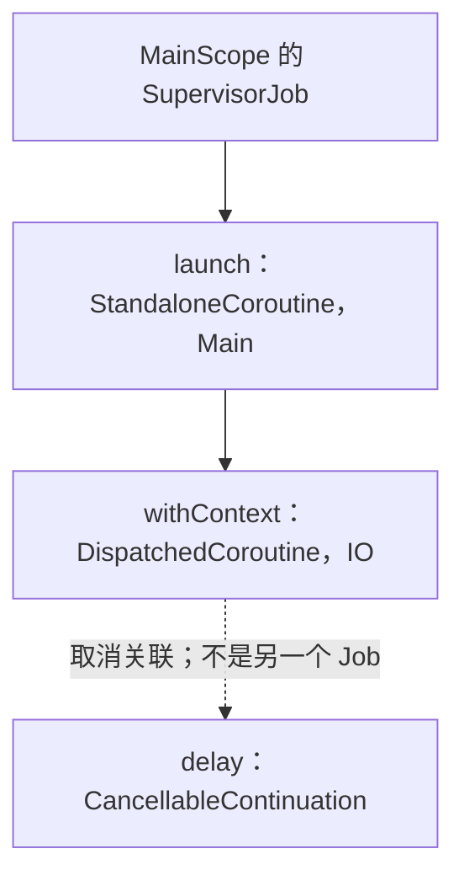

> 阅读主线：先沿项目中的 Android Demo 走完一次协程，再拆解各模块。协程库源码固定为 **kotlinx.coroutines 1.10.2**，Kotlin/JVM 标准库固定为 **2.1.20**，与 Demo 的构建声明一致。
>
> AndroidX 生命周期扩展另以 **Lifecycle 2.8.7** 源码说明，不代表当前 Demo 已依赖该版本。除首个完整 Demo 外，业务示例省略常规 import；涉及 ViewModel、Fragment 的片段需具备相应 AndroidX 依赖。
>
> 标为“源码节选”的代码来自对应版本，省略处会明确标注；标为“原理伪代码”的内容只解释控制流程，不能直接编译，也不是实际反编译产物。

# 整体介绍

在 Android 中，协程让一次异步任务可以按“发起工作、等待结果、更新 UI”的顺序书写。它仍需要线程执行代码，但等待时可以保存进度并让出线程，不必为每次等待占住一条线程。

# 总结

对于这种方式：

```
private val scope = MainScope()
scope.launch {}
```

1. 先创建 CoroutineScope，传入指定的调度器和任务树的根。
   - 对于 CoroutineScope 的工厂方法，没有Job就会内部自己创建一个。

2. 调用 `launch` 时，创建关联到根 Job 的子协程对象，并按启动策略启动协程体。
3. 默认启动会创建续体，由 Context 中的调度器包装续体，再发起首次恢复。
4. 普通 Main 将恢复任务通过 `Handler.post()` 提交到主线程，主线程取得执行机会后运行协程体。

# 一些概念

## 协程

继承关系。`AbstractCoroutine` 是这类协程对象的抽象基类。

```
StandaloneCoroutine
  └─ AbstractCoroutine<Unit>
       ├─ JobSupport：实现任务状态管理
       ├─ Job：提供取消、等待、状态查询
       ├─ CoroutineScope：为内部子协程提供上下文
       └─ Continuation<Unit>：续体，用于接收协程体的完成结果
```

## 协程体

```
scope.launch {}
```

launch中的lambda

# 从 Android Demo 走完一次协程

## Demo

具体见：`AndroidDemo/app/src/main/java/com/mezzsy/myapplication/coroutine/CoroutineContent.kt`

```kotlin
private val scope = MainScope()		
private fun test1() {
        // MainScope 默认在主线程启动协程。
        scope.launch {
            Log.d(TAG, "开始协程，线程：${Thread.currentThread().name}")

            // 切换到 IO 调度器模拟读取数据；delay 只挂起协程，不阻塞线程。
            val result = withContext(Dispatchers.IO) {
                Log.d(TAG, "模拟读取数据，线程：${Thread.currentThread().name}")
                delay(1_000)
                "协程读取完成"
            }

            // withContext 返回后恢复到主线程，可以安全更新 UI。
            Log.d(TAG, "$result，线程：${Thread.currentThread().name}")
            Toast.makeText(context, result, Toast.LENGTH_SHORT).show()
        }
    }
```


```text
开始协程，线程：main
模拟读取数据，线程：DefaultDispatcher-worker-1
协程读取完成，线程：main
```

## 创建 MainScope：此时没有启动协程

```kotlin
public fun MainScope(): CoroutineScope =
    ContextScope(SupervisorJob() + Dispatchers.Main)
```

两个元素各管一件事：

| 元素 | 本例中的职责 |
| --- | --- |
| `SupervisorJob()` | 作为任务树的根，统一取消子任务，隔离直接子任务的失败 |
| `Dispatchers.Main` | 让协程的默认执行和恢复进入 Android 主线程 |

`scope` 只保存这份上下文。它没有创建一个与自身绑定的专用线程，也没有自动开始加载数据。

## 调用 launch：创建 Job，并提交到主线程

> **小结**：`launch` 创建协程对象，关联父 Job，再把协程体交给调度器。

```kotlin
public fun CoroutineScope.launch(
    context: CoroutineContext = EmptyCoroutineContext,
    start: CoroutineStart = CoroutineStart.DEFAULT,
    block: suspend CoroutineScope.() -> Unit
): Job {
    val newContext = newCoroutineContext(context)
    val coroutine = if (start.isLazy)
        LazyStandaloneCoroutine(newContext, block) else
        StandaloneCoroutine(newContext, active = true)
    coroutine.start(start, coroutine, block)
    return coroutine
}
```

本例没有额外传入上下文，因此继承 `scope` 的 Main 调度器和父 Job；创建出的 `StandaloneCoroutine` 是本次任务自己的 Job。`launch()` 返回它，**返回并不表示任务已经完成**。


```
scope.launch
  → AbstractCoroutine.start
  → CoroutineStart.DEFAULT.invoke
  → block.startCoroutineCancellable
  → 创建续体、拦截续体、发起首次恢复
```

默认启动经 `startCoroutineCancellable()` 创建协程体的续体（Continuation），并对续体进行拦截。

```kotlin
internal fun <R, T> (suspend (R) -> T).startCoroutineCancellable(
    receiver: R, completion: Continuation<T>,
) = runSafely(completion) {
    createCoroutineUnintercepted(receiver, completion)
        .intercepted()
        .resumeCancellableWith(Result.success(Unit))
}
```

`completion` 连接整个协程的完成通知；`intercepted()` 为协程体续体接入调度器，第一次以 `Unit` 恢复就是开始执行。`CoroutineDispatcher` 的关键实现是：

```kotlin
// intercepted里调用
public final override fun <T> interceptContinuation(
    continuation: Continuation<T>
): Continuation<T> = DispatchedContinuation(this, continuation)
```

`DispatchedContinuation` 在恢复续体前决定是否调度，Android Main 最终进入 [HandlerDispatcher.kt](https://github.com/Kotlin/kotlinx.coroutines/blob/1.10.2/ui/kotlinx-coroutines-android/src/HandlerDispatcher.kt)：

```kotlin
// HandlerContext 的源码节选。
override fun isDispatchNeeded(context: CoroutineContext): Boolean {
    return !invokeImmediately || Looper.myLooper() != handler.looper
}

override fun dispatch(context: CoroutineContext, block: Runnable) {
    if (!handler.post(block)) {
        cancelOnRejection(context, block)
    }
}
```

`MainScope` 使用普通 Main，`invokeImmediately = false`，即使从主线程调用也会提交消息。因此本次点击回调可先返回，主线程 Looper 取到协程任务后才执行第一条日志。这里不是 `Main.immediate` 的立即执行路径。

## 进入 withContext：主线程交出执行机会

> **小结**：`withContext(IO)` 保存 Main 调用者的续体，在 IO 执行代码块，并等待它返回结果。

[Builders.common.kt 中切换调度器的路径，源码节选](https://github.com/Kotlin/kotlinx.coroutines/blob/1.10.2/kotlinx-coroutines-core/common/src/Builders.common.kt)：

```kotlin
return suspendCoroutineUninterceptedOrReturn sc@ { uCont ->
    val oldContext = uCont.context
    val newContext = oldContext.newCoroutineContext(context)
    newContext.ensureActive()
    // 省略上下文相同、调度器相同的两个快速分支。
    val coroutine = DispatchedCoroutine(newContext, uCont)
    block.startCoroutineCancellable(coroutine, coroutine)
    coroutine.getResult()
}
```

对应到 Demo：

| 源码对象 | Demo 中的含义 |
| --- | --- |
| `uCont` | 外层 `launch` 在 `withContext` 调用处的续体，后续要拿到 `result` 并展示 Toast |
| `oldContext` | 包含 Main 和外层 launch 的 Job |
| `newContext` | 调度器替换为 IO，其余未覆盖元素保留 |
| `DispatchedCoroutine` | 管理本次 `withContext` 的完成，保存调用者 `uCont` |
| `block` | 打印读取日志、等待一秒、返回字符串的代码块 |

内部代码块提交给 IO 后，`getResult()` 通常返回 `COROUTINE_SUSPENDED`；外层状态机也返回这个标记，本次主线程任务结束，Looper 可以继续处理输入、绘制等消息。**主线程不会阻塞在这里等 IO 结果。**

如果内部代码块在调用者决定挂起前就完成，`getResult()` 也可以直接取结果；源码必须处理这种竞争，不能把每次挂起函数调用都画成必然挂起。

## IO 工作线程执行代码块

> **小结**：IO 把可执行任务交给共享调度器，Worker 恢复续体后执行用户代码。

IO 调度链中的关键委托位于 [scheduling/Dispatcher.kt](https://github.com/Kotlin/kotlinx.coroutines/blob/1.10.2/kotlinx-coroutines-core/jvm/src/scheduling/Dispatcher.kt)：

```kotlin
// DefaultIoScheduler：经过 IO 的并行度控制。
override fun dispatch(context: CoroutineContext, block: Runnable) {
    default.dispatch(context, block)
}

// UnlimitedIoScheduler：给共享调度器提交阻塞类型的任务。
override fun dispatch(context: CoroutineContext, block: Runnable) {
    DefaultScheduler.dispatchWithContext(block, BlockingContext, false)
}
```

随后经过 `CoroutineScheduler` 的任务队列。Worker 是工作线程，它循环取任务并执行：[CoroutineScheduler.kt 源码节选](https://github.com/Kotlin/kotlinx.coroutines/blob/1.10.2/kotlinx-coroutines-core/jvm/src/scheduling/CoroutineScheduler.kt)。

```kotlin
while (!isTerminated && state != WorkerState.TERMINATED) {
    val task = findTask(mayHaveLocalTasks)
    if (task != null) {
        rescanned = false
        minDelayUntilStealableTaskNs = 0L
        executeTask(task)
        continue
    }
    // 省略无任务时的重试、停放与终止处理。
}
```

`executeTask → runSafely → task.run` 开始执行提交的任务。IO 的并行度控制通常还经过 `LimitedDispatcher.Worker` 包装，它是 Runnable，不是另一条线程；其内部用 `currentTask.run()` 执行续体任务，见 [LimitedDispatcher.kt](https://github.com/Kotlin/kotlinx.coroutines/blob/1.10.2/kotlinx-coroutines-core/common/src/internal/LimitedDispatcher.kt)。最终进入 `DispatchedTask.run()`。

只保留正常恢复分支时，[DispatchedTask.run()](https://github.com/Kotlin/kotlinx.coroutines/blob/1.10.2/kotlinx-coroutines-core/common/src/internal/DispatchedTask.kt) 中的关键语句是：

```kotlin
// 源码节选；外层线程上下文处理、异常和取消分支省略。
val delegate = delegate as DispatchedContinuation<T>
val continuation = delegate.continuation
// 在 withContinuationContext 中取出结果：
val state = takeState()
// 正常、未取消的分支：
continuation.resume(getSuccessfulResult(state))
```

恢复原始续体后，编译器生成的状态机开始执行 IO 代码块，于是出现第二条日志。线程名里出现 `DefaultDispatcher-worker` 并不意味着 IO 切换失效：IO 与 Default 共享底层工作线程资源。

## delay：登记定时恢复，然后退出当前执行片段

> **小结**：`delay` 保存待恢复的续体，等待期间不占用工作线程。

[Delay.kt 源码节选](https://github.com/Kotlin/kotlinx.coroutines/blob/1.10.2/kotlinx-coroutines-core/common/src/Delay.kt)：

```kotlin
public suspend fun delay(timeMillis: Long) {
    if (timeMillis <= 0) return
    return suspendCancellableCoroutine sc@ { cont: CancellableContinuation<Unit> ->
        if (timeMillis < Long.MAX_VALUE) {
            cont.context.delay.scheduleResumeAfterDelay(timeMillis, cont)
        }
    }
}
```

这里登记的是“到期后恢复 `cont`”，不是让 IO Worker 调用 `Thread.sleep(1000)`。

标准库 [ContinuationImpl.kt](https://repo.maven.apache.org/maven2/org/jetbrains/kotlin/kotlin-stdlib/2.1.20/kotlin-stdlib-2.1.20-sources.jar) 中，`BaseContinuationImpl.resumeWith()` 驱动状态机的关键语句为：

```kotlin
val outcome = invokeSuspend(param)
if (outcome === COROUTINE_SUSPENDED) return
Result.success(outcome)
```

`delay` 返回挂起标记，IO 代码块的 `invokeSuspend()` 也返回挂起标记，上面的恢复方法结束，Worker 可以执行其他任务。

此时有两层等待，不能混为一谈：

| 正在等待的部分 | 等待什么 | 恢复后做什么 |
| --- | --- | --- |
| 外层 launch | 整个 `withContext` 完成 | 得到字符串并展示 Toast |
| IO 代码块 | `delay` 的计时结束 | 执行字符串表达式并完成代码块 |

两层等待保存不同的续体；它们都不需要占住一个线程等结果。

## 等待结束：先恢复 IO，再把结果送回 Main

> **小结**：定时器恢复 IO 续体，IO 完成后再恢复外层 Main 续体。

到期后，`delay` 的续体按 IO 上下文获得执行机会，从挂起点之后继续，返回 `"协程读取完成"`。定时器线程不等于后续业务代码的执行线程。

内部代码块完成后，结果传给 `DispatchedCoroutine`。其父类 [AbstractCoroutine.kt](https://github.com/Kotlin/kotlinx.coroutines/blob/1.10.2/kotlinx-coroutines-core/common/src/AbstractCoroutine.kt) 先推进 Job 的完成状态：

```kotlin
public final override fun resumeWith(result: Result<T>) {
    val state = makeCompletingOnce(result.toState())
    if (state === COMPLETING_WAITING_CHILDREN) return
    afterResume(state)
}
```

本例没有额外子任务需要等待，然后进入 [DispatchedCoroutine.afterResume()](https://github.com/Kotlin/kotlinx.coroutines/blob/1.10.2/kotlinx-coroutines-core/common/src/Builders.common.kt)：

```kotlin
override fun afterResume(state: Any?) {
    if (tryResume()) return
    uCont.intercepted().resumeCancellableWith(recoverResult(state, uCont))
}
```

如果调用者已经挂起，执行最后一行。这里的 `uCont` 是先前保存的 **Main 续体**，所以恢复重新经过 Main 的 `Handler.post()`。主线程执行恢复任务后，外层状态机取到 `result`，打印最后一条日志，显示 Toast。

`tryResume()` 用来处理“内部先完成、外层还未挂起”的情况，防止既直接返回结果，又重复恢复调用者。正常返回还受取消检查约束：页面已经取消任务时，即使 IO 算出了结果，也可能在切回 Main 时丢弃结果。

## 页面销毁：取消沿 Job 树传递

> **小结**：取消从根 Job 传到 launch、withContext 和可取消等待，后续 UI 更新随之停止。

Demo 在销毁时调用 `scope.cancel()`。[CoroutineScope.kt 源码节选](https://github.com/Kotlin/kotlinx.coroutines/blob/1.10.2/kotlinx-coroutines-core/common/src/CoroutineScope.kt)：

```kotlin
public fun CoroutineScope.cancel(cause: CancellationException? = null) {
    val job = coroutineContext[Job]
        ?: error("Scope cannot be cancelled because it does not have a job: $this")
    job.cancel(cause)
}
```

本次任务的关系如下：



在 `delay` 期间销毁页面时，可取消续体收到取消，等待以 `CancellationException` 结束；外层协程也处于取消状态，因此不会走正常的 Toast 分支。若协程体尚未开始执行，默认启动也会检查取消，可能连第一条日志都不出现。

`cancel()` 不会撤销已经执行的 Toast，也不会强行杀死正在运行的任意代码。它发起协作式取消；如果把 `delay` 换成不支持取消的阻塞调用，还必须为底层操作设计取消机制。

## 把整条链压缩到一张图

> **小结**：Job 管结束，Continuation 管接着做什么，Dispatcher 管在哪里继续。

```text
点击回调（main）
  → launch 创建子 Job，提交给 Main 的 Handler
  → 点击回调返回

Main 取得执行机会
  → 打印“开始协程”
  → withContext(IO) 保存 Main 续体，提交 IO 任务
  → 外层挂起，本次主线程任务返回

IO Worker 取得执行机会
  → 打印“模拟读取数据”
  → delay 登记定时恢复
  → 内层挂起，Worker 执行其他任务

计时到期
  → 按 IO 上下文恢复内层续体
  → 得到字符串，完成 withContext
  → 恢复保存的 Main 续体，提交给主线程 Handler

Main 再次取得执行机会
  → 得到 result，打印日志，显示 Toast
  → launch 完成；MainScope 的根 Job 仍可接收后续任务
```

一次点击对应一个子任务。连续点击会启动多个任务，结果可能相互交错；`SupervisorJob` 不提供点击防抖、结果去重或“只保留最新请求”。

# CoroutineScope 与 CoroutineContext：组织任务

> **小结**：Scope 提供上下文，Context 按 Key 保存元素，父子 Job 关系决定等待与取消边界。

## Context 合并：同一个 Key 由右侧替换

> **小结**：切换调度器通常保留父 Job；手动传入新 Job 会改变任务归属。

Context 是一组元素，不是一条线程。常见 Key 包括 `Job`、`ContinuationInterceptor`、`CoroutineName`、`CoroutineExceptionHandler`。

```kotlin
// 放在 CoroutineContent 中；scope 是前文的 MainScope。
private fun inspectContext() {
    scope.launch(CoroutineName("load-detail")) {
        Log.d(TAG, "名称：${coroutineContext[CoroutineName]}")
        Log.d(TAG, "任务：${coroutineContext[Job]}")
        withContext(Dispatchers.IO) {
            // 名称仍保留，调度器换成 IO；withContext 拥有自己的内部 Job。
            Log.d(TAG, "IO 名称：${coroutineContext[CoroutineName]}")
        }
    }
}
```

[JVM CoroutineContext.kt 源码节选](https://github.com/Kotlin/kotlinx.coroutines/blob/1.10.2/kotlinx-coroutines-core/jvm/src/CoroutineContext.kt)：

```kotlin
public actual fun CoroutineScope.newCoroutineContext(context: CoroutineContext): CoroutineContext {
    val combined = foldCopies(coroutineContext, context, true)
    val debug = if (DEBUG) combined + CoroutineId(COROUTINE_ID.incrementAndGet()) else combined
    return if (combined !== Dispatchers.Default && combined[ContinuationInterceptor] == null)
        debug + Dispatchers.Default else debug
}
```

`foldCopies` 还处理可复制线程上下文元素；对 Demo 中这些普通元素，可以按 `scope.coroutineContext + context` 理解。没有调度器时才补 Default，MainScope 已有 Main，因此不会被改成 Default。

不要随手写 `scope.launch(Job())` 或 `scope.launch(SupervisorJob())`：新 Job 覆盖继承来的父 Job，页面取消可能管不到这个任务。需要隔离局部子任务失败时，优先在当前协程中使用 `supervisorScope {}`。

## 父子 Job 如何真正连接

> **小结**：协程创建时向父 Job 登记自己，再把自身 Job 放入自己的 Context。

[AbstractCoroutine.kt 源码节选](https://github.com/Kotlin/kotlinx.coroutines/blob/1.10.2/kotlinx-coroutines-core/common/src/AbstractCoroutine.kt)：

```kotlin
public abstract class AbstractCoroutine<in T>(
    parentContext: CoroutineContext,
    initParentJob: Boolean,
    active: Boolean
) : JobSupport(active), Job, Continuation<T>, CoroutineScope {
    init {
        if (initParentJob) initParentJob(parentContext[Job])
    }

    public final override val context: CoroutineContext = parentContext + this
    public override val coroutineContext: CoroutineContext get() = context
    // 其余成员省略。
}
```

这里的 `this` 本身就是 Job，所以 `parentContext + this` 把 Context 中的父 Job 替换成当前协程自己的 Job。父子关系已经在 `initParentJob()` 中建立，不会因为 Context 元素被替换而丢失。

[JobSupport.kt 中建立关联的源码节选](https://github.com/Kotlin/kotlinx.coroutines/blob/1.10.2/kotlinx-coroutines-core/common/src/JobSupport.kt)：

```kotlin
protected fun initParentJob(parent: Job?) {
    assert { parentHandle == null }
    if (parent == null) {
        parentHandle = NonDisposableHandle
        return
    }
    parent.start()
    val handle = parent.attachChild(this)
    parentHandle = handle
    if (isCompleted) {
        handle.dispose()
        parentHandle = NonDisposableHandle
    }
}
```

`attachChild` 在父 Job 内登记子节点；子 Job 保存关联句柄。父取消时通知子，子失败时向父报告，父协程正常完成时还要等子任务。懒启动也会在创建对象时建立关联，不是执行协程体后才登记。

同一文件中父子节点的两个方向非常直观：

```kotlin
// ChildHandleNode 中的源码节选。
override fun invoke(cause: Throwable?) = childJob.parentCancelled(job)
override fun childCancelled(cause: Throwable): Boolean = job.childCancelled(cause)
```

第一行负责父取消通知子，第二行负责子失败通知父。

## CoroutineScope 与 coroutineScope 的区别

> **小结**：大写工厂创建持有者，小写挂起函数等待本次任务及其子任务完成。

| 写法 | 创建什么 | 是否等待 | 生命周期由谁管理 |
| --- | --- | --- | --- |
| `CoroutineScope(context)` | 包装 Context 的对象 | 不等待，也不启动任务 | 对象持有者 |
| `MainScope()` | SupervisorJob + Main 的 Scope | 不等待，也不启动任务 | 对象持有者 |
| `coroutineScope {}` | 关联当前 Job 的作用域协程 | 等代码块及所有子任务 | 当前调用链 |
| `supervisorScope {}` | 隔离直接子任务失败的作用域协程 | 同样等待子任务 | 当前调用链 |

[CoroutineScope.kt 源码节选](https://github.com/Kotlin/kotlinx.coroutines/blob/1.10.2/kotlinx-coroutines-core/common/src/CoroutineScope.kt)：

```kotlin
public fun CoroutineScope(context: CoroutineContext): CoroutineScope =
    ContextScope(if (context[Job] != null) context else context + Job())

public suspend fun <R> coroutineScope(block: suspend CoroutineScope.() -> R): R {
    contract { callsInPlace(block, InvocationKind.EXACTLY_ONCE) }
    return suspendCoroutineUninterceptedOrReturn { uCont ->
        val coroutine = ScopeCoroutine(uCont.context, uCont)
        coroutine.startUndispatchedOrReturn(coroutine, block)
    }
}
```

`CoroutineScope(coroutineContext)` 会沿用其中已有的 Job，不会自动创建新的子 Job。另一方面，函数内部另造 `CoroutineScope(SupervisorJob() + IO)`，会产生不属于调用者的任务树；即使它写在某个挂起函数内，也不会自动随调用者取消。

Android 的一次加载通常需要后者的结构化等待：

```kotlin
suspend fun loadDemoSummary(): String = coroutineScope {
    launch {
        delay(100)
        Log.d("CoroutineDemo", "附加任务结束")
    }
    "摘要"
}

// 在 scope.launch 中调用：
// val summary = loadDemoSummary()
// 返回时，上面的附加任务也已经结束。
```

等待由 Job 完成流程实现。[JobSupport.tryWaitForChild() 源码节选](https://github.com/Kotlin/kotlinx.coroutines/blob/1.10.2/kotlinx-coroutines-core/common/src/JobSupport.kt)：

```kotlin
val handle = child.childJob.invokeOnCompletion(
    invokeImmediately = false,
    handler = ChildCompletion(this, state, child, proposedUpdate)
)
if (handle !== NonDisposableHandle) return true
```

它在尚未完成的子任务上登记完成回调，之后继续推进父协程完成；不是让主线程一直轮询子任务状态。

# suspend 与 Continuation：保存和恢复执行位置

> **小结**：`suspend` 允许函数暂停，状态机保存进度，续体接收结果后继续执行；它不自动开启后台线程。

## suspend 函数的真实边界

> **小结**：可挂起不等于必定挂起，也不等于非阻塞或可取消。

```kotlin
suspend fun demoLabel(id: Int): String {
    val prefix = "条目-$id"
    delay(1_000)
    return "$prefix：加载完成"
}
```

在 Main 中调用时，`prefix` 的计算和最后的字符串拼接仍在 Main 执行，中间的 `delay` 才会让出执行机会。如果把函数体换成 `Thread.sleep(1_000)`，即使带有 `suspend`，仍会阻塞调用线程。

Kotlin/JVM 使用续体传递方式，可把编译后的函数签名理解为：

```text
// JVM 签名示意，并非 Kotlin 可直接调用的重载。
demoLabel(id: Int, completion: Continuation<String>): Any?
```

返回值存在两种情况：直接返回字符串，或先返回 `COROUTINE_SUSPENDED`，之后通过续体传递最终结果。`delay(0)`、命中内存缓存的挂起函数都可能同步完成。语言层规则见 [Kotlin 协程规范](https://kotlinlang.org/spec/asynchronous-programming-with-coroutines.html)。

标准库 `Continuation.kt` 的接口非常小：

```kotlin
public interface Continuation<in T> {
    public val context: CoroutineContext
    public fun resumeWith(result: Result<T>)
}
```

源码位于 [Kotlin 2.1.20 标准库源码包](https://repo.maven.apache.org/maven2/org/jetbrains/kotlin/kotlin-stdlib/2.1.20/kotlin-stdlib-2.1.20-sources.jar) 的 `commonMain/kotlin/coroutines/Continuation.kt`。接口并没有 `label` 字段；恢复位置由编译器生成的具体实现保存。

## 状态机怎样跨过挂起点

> **小结**：调用前保存下一步位置与必要变量，恢复后按位置跳转。

下面是 `demoLabel()` 的**原理伪代码**，省略 JVM 入口重入、调试探针和类型转换：

```text
字段：label = 0，savedPrefix，completion

invokeSuspend(result):
    if label == 0:
        检查 result 是否携带异常
        savedPrefix = "条目-" + id
        label = 1
        outcome = delay(1000, 当前续体)
        if outcome == COROUTINE_SUSPENDED:
            return COROUTINE_SUSPENDED
        // 同步完成时直接进入后半段

    if label == 1:
        检查 result 是否携带异常
        return savedPrefix + "：加载完成"
```

需要保存的是后续会用到的 `prefix`，不是把整个线程栈永久保留在原线程上。真正挂起时，普通调用栈退出，堆上的续体对象保留进度；恢复时可以由另一条线程驱动同一个状态机。

标准库 `BaseContinuationImpl.resumeWith()` 的完成传播分支如下，位于同一个源码包的 `jvmMain/kotlin/coroutines/jvm/internal/ContinuationImpl.kt`：

```kotlin
// 源码节选；outcome 已是 invokeSuspend 的成功或失败结果。
releaseIntercepted()
if (completion is BaseContinuationImpl) {
    current = completion
    param = outcome
} else {
    completion.resumeWith(outcome)
    return
}
```

上一级也是状态机时，内部循环继续推进；否则把结果交给上级 completion。Demo 中，IO 代码块的 completion 最终连接到 `DispatchedCoroutine`，外层 launch 的 completion 连接到 `StandaloneCoroutine`。

不是每个 `suspend` 函数都生成完整状态机：没有挂起调用、可以尾调用转发的函数可能更简单。具体字段名和布局也属于编译器实现细节。

## 可取消续体如何接入 Job

> **小结**：`suspendCancellableCoroutine` 把等待与当前 Job 连接，解决取消和恢复竞争。

[CancellableContinuation.kt 源码节选，移除注释](https://github.com/Kotlin/kotlinx.coroutines/blob/1.10.2/kotlinx-coroutines-core/common/src/CancellableContinuation.kt)：

```kotlin
public suspend inline fun <T> suspendCancellableCoroutine(
    crossinline block: (CancellableContinuation<T>) -> Unit
): T = suspendCoroutineUninterceptedOrReturn { uCont ->
    val cancellable = CancellableContinuationImpl(
        uCont.intercepted(), resumeMode = MODE_CANCELLABLE
    )
    cancellable.initCancellability()
    block(cancellable)
    cancellable.getResult()
}
```

三个步骤分别对应：

1. `uCont.intercepted()`：保留调用者的调度策略，回调从任意线程到达也不能随意在该线程继续 UI 代码。
2. `initCancellability()`：向当前 Job 登记取消关联，父任务取消时通知等待者。
3. `getResult()`：结果已到达则直接返回，否则返回挂起标记，等待后续恢复。

普通 `suspendCoroutine` 也能桥接单次回调，并通过 `SafeContinuation` 协调同步与异步返回，但不会自动接入 Job 取消。因此 Android 中封装可取消请求，通常使用可取消版本。

下面定义一个最小的单次请求契约，再封装为挂起函数：

```kotlin
interface TextRequest {
    // 契约：至多回调一次；cancel 线程安全、幂等，且支持先 cancel 后 enqueue。
    fun enqueue(callback: (Result<String>) -> Unit)
    fun cancel()
}

suspend fun TextRequest.awaitText(): String =
    suspendCancellableCoroutine { continuation ->
        continuation.invokeOnCancellation { cancel() }
        enqueue { result ->
            continuation.resumeWith(result)
        }
    }
```

`invokeOnCancellation` 负责终止底层请求；把回调改成挂起函数本身不会自动关闭 Socket、注销监听器。多次事件回调应考虑 `callbackFlow`，不能对同一个续体反复调用 `resumeWith()`。

成功回调与取消可以并发发生。可取消续体保证挂起期间发生取消时，不会仅因为成功结果已经准备好就强行继续正常路径。这里返回 String 无需释放；若返回文件句柄等资源，还需处理“成功恢复但调用者取消、资源未交付”的清理问题。

## delay 的计时器与执行线程是两件事

> **小结**：谁负责计时由 `Delay` 决定，谁执行后续业务由 Dispatcher 决定。

[Delay.kt 选择计时设施的源码](https://github.com/Kotlin/kotlinx.coroutines/blob/1.10.2/kotlinx-coroutines-core/common/src/Delay.kt)：

```kotlin
internal val CoroutineContext.delay: Delay
    get() = get(ContinuationInterceptor) as? Delay ?: DefaultDelay
```

Android Main 的 `HandlerContext` 实现了 `Delay`，会利用主线程消息队列计时。[HandlerDispatcher.kt 源码节选](https://github.com/Kotlin/kotlinx.coroutines/blob/1.10.2/ui/kotlinx-coroutines-android/src/HandlerDispatcher.kt)：

```kotlin
override fun scheduleResumeAfterDelay(
    timeMillis: Long,
    continuation: CancellableContinuation<Unit>
) {
    val block = Runnable {
        with(continuation) { resumeUndispatched(Unit) }
    }
    if (handler.postDelayed(block, timeMillis.coerceAtMost(MAX_DELAY))) {
        continuation.invokeOnCancellation { handler.removeCallbacks(block) }
    } else {
        cancelOnRejection(continuation.context, block)
    }
}
```

这里是在对应 Handler 线程执行的定时回调，所以可以直接恢复相关续体，并在取消时移除消息。

**但 Demo 的 `delay` 位于 IO 中，不走这条 Main 的 `postDelayed` 路径。** IO 没有实现 `Delay`，会使用 `DefaultDelay`。在 1.10.2、未启用 `kotlinx.coroutines.main.delay` 系统属性的默认情况下，它是 `DefaultExecutor`；到期后再按 IO 上下文恢复业务。对应判断见 [DefaultExecutor.kt](https://github.com/Kotlin/kotlinx.coroutines/blob/1.10.2/kotlinx-coroutines-core/jvm/src/DefaultExecutor.kt)：

```kotlin
private val defaultMainDelayOptIn = systemProp("kotlinx.coroutines.main.delay", false)
// initializeDefaultDelay() 中的默认分支：
if (!defaultMainDelayOptIn) return DefaultExecutor
```

无论哪种计时方式，等待都不是给每个协程配一条睡眠线程。

# Dispatcher 与 withContext：安排执行位置

> **小结**：Dispatcher 决定执行环境，`withContext` 在目标环境完成工作后恢复调用者。

## Android 中怎样选择调度器

> **小结**：UI 用 Main，阻塞 I/O 用 IO，大量计算用 Default；异步等待本身不需要 IO。

| 调度器 | Android 场景 | 边界 |
| --- | --- | --- |
| `Main` | 更新 View、处理轻量 UI 状态 | 主线程同样会被长计算、阻塞调用卡住 |
| `Main.immediate` | 已在主线程时避免重复入队 | 可能在调用返回前执行到首个挂起点，注意执行顺序 |
| `IO` | 同步文件读写、阻塞式网络调用 | 取消 Job 不一定能中断底层阻塞调用 |
| `Default` | 大列表转换、复杂排序、CPU 密集解析 | 需要为长循环设置取消检查 |
| `Unconfined` | 特定底层实现、特殊测试场景 | 初次在调用线程执行，恢复线程由挂起操作决定，不适合保证 UI 线程 |

Android 提供 Main 的入口位于 [AndroidDispatcherFactory](https://github.com/Kotlin/kotlinx.coroutines/blob/1.10.2/ui/kotlinx-coroutines-android/src/HandlerDispatcher.kt)：

```kotlin
override fun createDispatcher(allFactories: List<MainDispatcherFactory>): MainCoroutineDispatcher {
    val mainLooper = Looper.getMainLooper()
        ?: throw IllegalStateException("The main looper is not available")
    return HandlerContext(mainLooper.asHandler(async = true))
}
```

这里绑定的是现有主线程 Looper，没有创建第二条“UI 线程”。普通 Main 总要调度；Main.immediate 只有在当前 Looper 匹配时才可直接执行，从 IO 切回它仍然需要提交主线程任务。

IO 与 Default 共享调度基础设施，因此二者切换不保证物理线程改变；从 Main 到 IO、再恢复到 Main，则需要满足不同执行环境的约束。**选择调度器依据工作性质，不依据日志中的线程名字。**

## 续体拦截怎样变成调度

> **小结**：调度器包装续体，在恢复时决定提交任务还是直接执行。

[DispatchedContinuation.kt 源码节选](https://github.com/Kotlin/kotlinx.coroutines/blob/1.10.2/kotlinx-coroutines-core/common/src/internal/DispatchedContinuation.kt)：

```kotlin
internal inline fun resumeCancellableWith(result: Result<T>) {
    val state = result.toState()
    if (dispatcher.safeIsDispatchNeeded(context)) {
        _state = state
        resumeMode = MODE_CANCELLABLE
        dispatcher.safeDispatch(context, this)
    } else {
        executeUnconfined(state, MODE_CANCELLABLE) {
            if (!resumeCancelled(state)) {
                resumeUndispatchedWith(result)
            }
        }
    }
}
```

需要调度时，保存结果并提交 `this`，也就是可执行的 `DispatchedContinuation`；不需要调度时，走带取消检查和事件循环保护的直接执行路径。源码中的 `executeUnconfined` 是内部执行机制，不代表业务上下文被改成了 `Dispatchers.Unconfined`。

因此“请求回调已到达”与“UI 已经执行”不是同一时刻，中间可能还要在主线程队列中等待。

## withContext 的快速路径与结果返回

> **小结**：Context 相同可直接执行，Dispatcher 变化才需要跨执行环境调度。

[Builders.common.kt 源码节选](https://github.com/Kotlin/kotlinx.coroutines/blob/1.10.2/kotlinx-coroutines-core/common/src/Builders.common.kt)：

```kotlin
if (newContext === oldContext) {
    val coroutine = ScopeCoroutine(newContext, uCont)
    return@sc coroutine.startUndispatchedOrReturn(coroutine, block)
}
if (newContext[ContinuationInterceptor] == oldContext[ContinuationInterceptor]) {
    val coroutine = UndispatchedCoroutine(newContext, uCont)
    withCoroutineContext(coroutine.context, null) {
        return@sc coroutine.startUndispatchedOrReturn(coroutine, block)
    }
}
// 两条快速路径均不满足：
val coroutine = DispatchedCoroutine(newContext, uCont)
block.startCoroutineCancellable(coroutine, coroutine)
coroutine.getResult()
```

例如，只加 `CoroutineName` 通常不会切换线程；Main 中 `withContext(IO)` 则进入最后一条路径。`withContext` 也会等待其内部启动的子任务，不能靠“代码块最后一行返回了”判断它已完成。

同文件的 `DispatchedCoroutine.getResult()` 如下：

```kotlin
internal fun getResult(): Any? {
    if (trySuspend()) return COROUTINE_SUSPENDED
    val state = this.state.unboxState()
    if (state is CompletedExceptionally) throw state.cause
    @Suppress("UNCHECKED_CAST")
    return state as T
}
```

它与 `afterResume()` 共享决策状态：

| 先发生的事件 | 决策变化 | 结果如何到达调用者 |
| --- | --- | --- |
| 调用者先等待 | `UNDECIDED → SUSPENDED` | 完成后恢复保存的续体 |
| 内部先完成 | `UNDECIDED → RESUMED` | `getResult()` 直接读取结果 |

这份状态负责“是否需要挂起调用者”；Job 的状态负责“任务是否已完成”；编译器的 `label` 负责“代码执行到哪里”。三者不是同一个状态机。

切换调度器后，返回路径有及时取消保证：结果就绪但调用者在重新执行前被取消，正常结果会被丢弃。不能靠“IO 已完成”判断 UI 分支一定执行。

## 把线程切换放在真正执行耗时工作的层

> **小结**：Repository 对外提供可从主线程安全调用的挂起函数，内部负责调度。

```kotlin
class TextRepository(
    private val ioDispatcher: CoroutineDispatcher = Dispatchers.IO
) {
    suspend fun read(file: java.io.File): String = withContext(ioDispatcher) {
        file.readText()
    }
}

// 在 CoroutineContent 内调用，file 为调用方提供的可读文件：
// scope.launch {
//     val text = repository.read(file)
//     Toast.makeText(context, text, Toast.LENGTH_SHORT).show()
// }
```

这样调用方只关心数据顺序，Repository 负责把阻塞式读取移离主线程；调度器通过构造参数传入，也便于替换测试执行环境。这个设计与 [Android 协程实践](https://developer.android.com/kotlin/coroutines/coroutines-best-practices) 一致。

已经在内部完成异步调度的网络、数据库挂起 API，应依据其自身契约使用；不能因为“返回网络数据”就断定调用处必须再包一层 IO。CPU 密集工作仍应单独交给 Default。

# launch、async 与 Job：启动、等待和结果

> **小结**：`launch` 返回任务句柄，`async` 额外保存结果；等待挂起当前协程，取消依靠协作。

## 启动策略影响第一段代码何时执行

> **小结**：默认按调度器启动，LAZY 等触发，UNDISPATCHED 先在调用线程执行。

[CoroutineStart.kt 的核心分支](https://github.com/Kotlin/kotlinx.coroutines/blob/1.10.2/kotlinx-coroutines-core/common/src/CoroutineStart.kt)：

```kotlin
// invoke() 的源码节选。
when (this) {
    DEFAULT -> block.startCoroutineCancellable(receiver, completion)
    ATOMIC -> block.startCoroutine(receiver, completion)
    UNDISPATCHED -> block.startCoroutineUndispatched(receiver, completion)
    LAZY -> Unit
}
```

| 策略 | 首次启动行为 | Android 中要注意的事 |
| --- | --- | --- |
| `DEFAULT` | 根据调度器执行，并在启动时检查取消 | 不能假设 `launch` 总是先返回；Main.immediate 可能直接开始 |
| `LAZY` | `start`、`join`、`await` 等触发启动 | 创建后已关联父 Job；不启动也不取消，可能让父任务一直等 |
| `UNDISPATCHED` | 当前调用线程执行到首个实际挂起点 | 即使传 IO，挂起前的阻塞代码仍可能卡主线程 |
| `ATOMIC` | 启动阶段不会因先前取消而被跳过 | 挂起后仍受取消影响；1.10.2 中需 `DelicateCoroutinesApi` opt-in |

```kotlin
// 在 CoroutineContent 中演示懒启动。
private fun lazyDemo() {
    val task = scope.launch(start = CoroutineStart.LAZY) {
        delay(100)
        Log.d(TAG, "懒任务完成")
    }
    scope.launch {
        task.join() // 触发启动，并挂起等待完成。
        Log.d(TAG, "已等到任务结束")
    }
}
```

`UNDISPATCHED` 只影响首次执行，后续恢复仍遵循上下文中的调度器；不要把它当作永久忽略调度器的方式。

## Job 的状态与 join

> **小结**：任务体结束后还要等子任务，`join` 只等完成，不读取业务结果。

| 状态 | `isActive` | `isCompleted` | `isCancelled` |
| --- | --- | --- | --- |
| New，懒任务未启动 | false | false | false |
| Active | true | false | false |
| Completing，正常等待子任务 | true | false | false |
| Cancelling，取消与清理中 | false | false | true |
| Completed，正常结束 | false | true | false |
| Cancelled，取消或失败后的终态 | false | true | true |

这些是公开语义上的状态，不要求内部有一一对应的枚举。`isActive == false` 不代表清理已经结束。

[JobSupport.join() 源码节选](https://github.com/Kotlin/kotlinx.coroutines/blob/1.10.2/kotlinx-coroutines-core/common/src/JobSupport.kt)：

```kotlin
public final override suspend fun join() {
    if (!joinInternal()) {
        coroutineContext.ensureActive()
        return
    }
    return joinSuspend()
}

private suspend fun joinSuspend() = suspendCancellableCoroutine<Unit> { cont ->
    cont.disposeOnCancellation(invokeOnCompletion(handler = ResumeOnCompletion(cont)))
}
```

任务未完成时，`join` 登记完成回调并挂起等待者；等待者取消时注销关联。它不会把被等待任务的业务异常直接作为结果重新抛出，但父子异常传播可能取消等待者，从而使 `join` 抛取消异常。

因此，等待任务请保存 Job 并 `join()`，不要用 `delay(2000)` 猜测另一个一秒任务“应该结束了”。

## async 与 await：一次加载中并发获得两个结果

> **小结**：先创建两个 Deferred，再等待结果，两个异步等待才能重叠。

```kotlin
suspend fun loadDemoHeader(): String = coroutineScope {
    val name = async {
        delay(300)
        "Kotlin"
    }
    val count = async {
        delay(200)
        8
    }
    "${name.await()}：${count.await()} 篇"
}

// 在 scope.launch 中：
// val title = loadDemoHeader()
// Toast.makeText(context, title, Toast.LENGTH_SHORT).show()
```

两个任务继承调用者调度器；本例若从 Main 调用，两个 `delay` 可并发等待，但没有让字符串运算变成多线程并行。真正阻塞工作仍需 IO，大量计算仍需 Default。

`async { first() }.await()` 完成后才写第二个 `async`，仍是串行。多个 LAZY 任务也应先全部 `start()`，再依次 `await()`，才能明确表达并发启动。

[Builders.common.kt 的结果实现，源码节选](https://github.com/Kotlin/kotlinx.coroutines/blob/1.10.2/kotlinx-coroutines-core/common/src/Builders.common.kt)：

```kotlin
private open class DeferredCoroutine<T>(
    parentContext: CoroutineContext,
    active: Boolean
) : AbstractCoroutine<T>(parentContext, true, active = active), Deferred<T> {
    override fun getCompleted(): T = getCompletedInternal() as T
    override suspend fun await(): T = awaitInternal() as T
    override val onAwait: SelectClause1<T> get() = onAwaitInternal as SelectClause1<T>
}
```

`awaitInternal()` 在已完成时读结果或抛失败原因；未完成时保存等待者续体，等完成通知恢复。`Deferred<T>` 同时是 Job，所以它仍参与父子取消和异常传播。

**普通父 Job 下的 async 失败会立即影响父任务，不会等到 await 才开始传播。** `await()` 决定如何观察结果，不改变结构化并发的失败规则。

# 取消、异常与超时：处理任务结束

> **小结**：取消向下传递，普通失败还可能向上传播；清理放在 finally，业务异常在能处理它的边界捕获。

## 取消是协作，不是杀线程

> **小结**：可取消挂起点和主动检查点让任务退出，普通计算不会被强行打断。

[Job.kt 源码](https://github.com/Kotlin/kotlinx.coroutines/blob/1.10.2/kotlinx-coroutines-core/common/src/Job.kt)：

```kotlin
public fun Job.ensureActive(): Unit {
    if (!isActive) throw getCancellationException()
}
```

Android 中批量计算时，可以按批检查：

```kotlin
suspend fun checksum(values: IntArray): Long = withContext(Dispatchers.Default) {
    var sum = 0L
    for (index in values.indices) {
        if (index % 1024 == 0) ensureActive()
        sum += values[index]
    }
    sum
}
```

`ensureActive()` 不挂起；`yield()` 还会在适用时让出执行机会；`isActive` 只返回布尔值，需要业务自己退出。`delay`、`await` 等库提供的可取消等待会检查取消，但不能推导出所有 `suspend` 函数都支持取消。

把阻塞调用放入 IO 只避免卡住主线程，不会自动让它可取消。底层请求应接入 `cancel()`；支持线程中断的阻塞 API 可考虑 `runInterruptible`，不支持中断的操作不能靠协程强行终止。

## cancel 与 cancelAndJoin：请求取消和等到退出

> **小结**：`cancel` 发请求，`cancelAndJoin` 还等待 finally 和子任务结束。

[Job.kt 源码](https://github.com/Kotlin/kotlinx.coroutines/blob/1.10.2/kotlinx-coroutines-core/common/src/Job.kt)：

```kotlin
public suspend fun Job.cancelAndJoin() {
    cancel()
    return join()
}
```

在 Demo 中可这样观察清理顺序：

```kotlin
private fun cancellationDemo() {
    scope.launch {
        val task = launch(start = CoroutineStart.UNDISPATCHED) {
            try {
                awaitCancellation()
            } finally {
                Log.d(TAG, "开始清理")
                withContext(NonCancellable) {
                    delay(50) // 仅模拟必须完成的、短暂的挂起清理。
                }
                Log.d(TAG, "清理完成")
            }
        }
        task.cancelAndJoin()
        Log.d(TAG, "任务已退出")
    }
}
```

本例 `UNDISPATCHED` 保证子任务先进入 `try` 再等待，因此取消时会执行 finally。若任务在协程体开始前就被取消，则不能期待尚未进入的 finally 执行。

非挂起的资源释放直接放在 `finally` 或 `use` 中。需要挂起的必要清理才使用很小范围的 `withContext(NonCancellable)`；它临时替换 Job，不是让已取消的原 Job 重新活跃。该示例未切换调度器，因此没有跨调度器返回路径的那次取消检查。

`onDestroy()` 不是挂起函数，Demo 在这里发出 `cancel()` 即可，不要用 `runBlocking` 卡住主线程等待清理。资源拥有者应在自己的协程 finally 中完成释放。

## 普通 Job 与 SupervisorJob 如何传播异常

> **小结**：普通父 Job 会因子任务失败而取消兄弟任务，Supervisor 只隔离直接子任务的失败。

[JobSupport.kt 源码](https://github.com/Kotlin/kotlinx.coroutines/blob/1.10.2/kotlinx-coroutines-core/common/src/JobSupport.kt)：

```kotlin
public open fun childCancelled(cause: Throwable): Boolean {
    if (cause is CancellationException) return true
    return cancelImpl(cause) && handlesException
}
```

[Supervisor.kt 中的关键覆盖](https://github.com/Kotlin/kotlinx.coroutines/blob/1.10.2/kotlinx-coroutines-core/common/src/Supervisor.kt)：

```kotlin
// SupervisorJobImpl 和 SupervisorCoroutine 都使用这条策略。
override fun childCancelled(cause: Throwable): Boolean = false
```

返回 false 表示不因该子任务失败取消自身，也没有替子任务消化异常。监督关系中的 `launch` 仍需处理未捕获异常，否则可能进入 Android 的未捕获异常处理流程并导致崩溃。

Demo 的任务树可进一步理解为：

```text
MainScope 的 SupervisorJob
├─ 第一次点击的 launch A
│  ├─ A 内部 async X
│  └─ A 内部 async Y
└─ 第二次点击的 launch B
```

X 失败会取消普通父协程 A，并影响 Y；根 SupervisorJob 使 A 的失败不继续取消 B。**监督没有自动覆盖所有后代层级。** 根被主动取消时，A、B 仍都会取消。

需要允许某个并发结果失败时，用 `supervisorScope` 并在其内部处理：

```kotlin
suspend fun loadWithOptionalBadge(): String = supervisorScope {
    val title = async { delay(100); "Kotlin" }
    val badge = async<String> {
        delay(50)
        throw java.io.IOException("徽标不可用")
    }
    val badgeText = try {
        badge.await()
    } catch (e: CancellationException) {
        throw e
    } catch (e: java.io.IOException) {
        "暂无徽标"
    }
    "${title.await()} / $badgeText"
}
```

如果异常从 `supervisorScope` 的代码块本身逃逸，它仍会失败并取消剩余子任务。Supervisor 不等于忽略所有错误。

## try/catch 与 CoroutineExceptionHandler 的位置

> **小结**：可恢复的业务失败在协程体内处理，Handler 处理已经未捕获的异常。

下面的异常边界包住实际挂起调用：

```kotlin
// 放在 CoroutineContent 中；repository、file 由调用方提供。
private fun loadText(repository: TextRepository, file: java.io.File) {
    scope.launch {
        try {
            val result = repository.read(file)
            Toast.makeText(context, result, Toast.LENGTH_SHORT).show()
        } catch (e: CancellationException) {
            throw e
        } catch (e: java.io.IOException) {
            Toast.makeText(context, "读取失败，请重试", Toast.LENGTH_SHORT).show()
        }
    }
}
```

把 `try/catch` 放在 `scope.launch { ... }` 外面，通常只包住提交动作，接不到稍后发生的协程体异常。`catch (Exception)` 和 `runCatching` 都可能吞掉 `CancellationException`，需要保留取消语义。

`launch` 对未处理异常的最终处理入口见 [StandaloneCoroutine 源码](https://github.com/Kotlin/kotlinx.coroutines/blob/1.10.2/kotlinx-coroutines-core/common/src/Builders.common.kt)：

```kotlin
override fun handleJobException(exception: Throwable): Boolean {
    handleCoroutineException(context, exception)
    return true
}
```

例如，给 MainScope 的直接子 launch 配置日志 Handler：

```kotlin
val handler = CoroutineExceptionHandler { _, error ->
    Log.e("CoroutineDemo", "任务未捕获异常", error)
}
// scope.launch(handler) { ... }
```

Handler 不能让失败协程从抛错处继续执行，也不能替代业务错误状态。普通子协程会向父任务委托异常处理；`async` 则把异常存入 Deferred，同时仍遵守父子失败规则，所以不能指望给 async 配 Handler 来读取结果错误。

## 超时也是一种取消

> **小结**：超时取消本次操作，不能强制终止不配合取消的工作。

```kotlin
suspend fun loadWithDeadline(): String? = withTimeoutOrNull(500) {
    delay(1_000)
    "完成"
}
```

本例返回 `null`。[Timeout.kt 中触发超时的源码节选](https://github.com/Kotlin/kotlinx.coroutines/blob/1.10.2/kotlinx-coroutines-core/common/src/Timeout.kt)：

```kotlin
// TimeoutCoroutine.run()
override fun run() {
    cancelCoroutine(TimeoutCancellationException(time, context.delay, this))
}
```

`withTimeout` 会抛 `TimeoutCancellationException`；`withTimeoutOrNull` 只把属于自身这次超时的异常转换为 null，外部取消和其他错误仍应传播。代码块本身也可返回 null 时，业务需要额外区分“合法空结果”和“超时”。

超时具有异步性。资源的取得与释放应在同一受保护范围内，例如 `use`、`try/finally`；不能假定资源在块内创建成功，就一定能穿过超时返回边界交付给调用者。

# Android 生命周期：决定任务活多久

> **小结**：业务任务跟 ViewModel，View 收集跟 View 生命周期；页面不可见时是否继续执行，需要另外定义。

## MainScope、viewModelScope 与 lifecycleScope

> **小结**：三者都能提供作用域，但取消时机和默认 Main 行为不同。

| 作用域 | 默认上下文，正常 Android 环境 | 取消时机 | 适用场景 |
| --- | --- | --- | --- |
| `MainScope()` | SupervisorJob + Main | 持有者手动取消 | Demo 中自定义 Content 的任务 |
| `viewModelScope` | SupervisorJob + Main.immediate | ViewModel 被清理 | 页面业务状态和加载任务 |
| Activity 的 `lifecycleScope` | SupervisorJob + Main.immediate | Activity Lifecycle 销毁 | 跟该 Activity 实例绑定的 UI 工作 |
| `viewLifecycleOwner.lifecycleScope` | SupervisorJob + Main.immediate | Fragment 的 View 销毁 | 访问 View、binding 的任务 |

这里的 AndroidX 默认值按 **Lifecycle 2.8.7** 核对；可自定义 Scope 的构造方式不在此表范围内。`viewModelScope` 一般可跨配置变化保留任务，但不是跨进程重启的持久化机制。

`createViewModelScope()` 在 Android 上取得 `Dispatchers.Main.immediate`，最后创建作用域；`close()` 取消 Context。源码节选来自 [lifecycle-viewmodel 2.8.7 源码包](https://dl.google.com/dl/android/maven2/androidx/lifecycle/lifecycle-viewmodel/2.8.7/lifecycle-viewmodel-2.8.7-sources.jar) 中的 `CloseableCoroutineScope.kt`：

```kotlin
// createViewModelScope()：dispatcher 的获取省略了非 Android 平台的回退分支。
return CloseableCoroutineScope(coroutineContext = dispatcher + SupervisorJob())

// CloseableCoroutineScope.close()
override fun close() = coroutineContext.cancel()
```

`viewModelScope` 通过 ViewModel 的可关闭资源机制随清理关闭；生命周期作用域则注册观察者。[lifecycle-common 2.8.7 源码包](https://dl.google.com/dl/android/maven2/androidx/lifecycle/lifecycle-common/2.8.7/lifecycle-common-2.8.7-sources.jar) 的 `Lifecycle.kt` 节选：

```kotlin
// Lifecycle.coroutineScope getter 中：
val newScope = LifecycleCoroutineScopeImpl(
    this,
    SupervisorJob() + Dispatchers.Main.immediate
)

// LifecycleCoroutineScopeImpl 中：
override fun onStateChanged(source: LifecycleOwner, event: Lifecycle.Event) {
    if (lifecycle.currentState <= Lifecycle.State.DESTROYED) {
        lifecycle.removeObserver(this)
        coroutineContext.cancel()
    }
}
```

所以 `lifecycleScope.launch { flow.collect { ... } }` 默认不会仅因 `ON_STOP` 就停止。任务归属和可见性控制是两层机制。

## repeatOnLifecycle：停止后取消，再次可见时重启

> **小结**：达到 STARTED 就启动子任务，低于 STARTED 就取消，下次再启动一轮。

下面是 Fragment 内的使用片段。参数用 Flow 和 TextView 表达最小依赖，应在 `onViewCreated` 中调用一次：

```kotlin
fun Fragment.bindTitle(
    titles: Flow<String>,
    titleView: android.widget.TextView
) {
    viewLifecycleOwner.lifecycleScope.launch {
        viewLifecycleOwner.repeatOnLifecycle(Lifecycle.State.STARTED) {
            titles.collect { title ->
                titleView.text = title
            }
        }
    }
}
```

View 销毁会取消整个外层作用域；`ON_STOP` 只取消当前这一轮内部收集。再次 `ON_START`，从代码块开头重新执行，不是停在旧 `collect` 位置继续。

[lifecycle-runtime 2.8.7 源码包](https://dl.google.com/dl/android/maven2/androidx/lifecycle/lifecycle-runtime/2.8.7/lifecycle-runtime-2.8.7-sources.jar) 的 `RepeatOnLifecycle.kt` 节选，省略观察者注册、外层挂起等待和销毁清理：

```kotlin
if (event == startWorkEvent) {
    launchedJob = this@coroutineScope.launch {
        mutex.withLock {
            coroutineScope {
                block()
            }
        }
    }
    return@LifecycleEventObserver
}
if (event == cancelWorkEvent) {
    launchedJob?.cancel()
    launchedJob = null
}
```

`Mutex` 保证多轮 block 串行，`coroutineScope` 等内部子任务结束，因此上一轮取消清理还没完成时，下一轮不会重叠执行 block。

收集多个长期 Flow 时，需要各自启动子协程：

```kotlin
// repeatOnLifecycle 块内；两个 Flow 和两个 TextView 由页面提供。
launch { titles.collect { titleView.text = it } }
launch { subtitles.collect { subtitleView.text = it } }
```

顺序写两次 `collect`，第一个长期不结束，第二个就无法执行。Views 的生命周期用法参见 [Android 官方文档](https://developer.android.com/topic/libraries/architecture/views/coroutines-views)。Compose 展示状态可使用 `collectAsStateWithLifecycle()`，其默认收集门槛同样是 STARTED，见 [Compose 生命周期收集说明](https://developer.android.com/topic/libraries/architecture/coroutines)。

## 重复请求和 Scope 复用的边界

> **小结**：取消后的 Scope 不能复活，重复点击也不会自动合并。

Demo 的 `scope` 在 Content 销毁后已经取消，如果同一个对象要重新使用，就需要重新设计作用域的创建时机。正常新建 Content 会得到新 Scope。

若要求“只展示最后一次点击的结果”，可保存当前 Job 并替换任务：

```kotlin
// 放在 CoroutineContent 中；reload() 从主线程调用。
private var loadJob: Job? = null

private fun reload() {
    loadJob?.cancel()
    loadJob = scope.launch {
        val result = withContext(Dispatchers.IO) {
            delay(1_000)
            "最新结果"
        }
        Toast.makeText(context, result, Toast.LENGTH_SHORT).show()
    }
}
```

该示例依赖 `delay` 和 `withContext` 的取消语义抑制旧结果；旧请求已造成的服务端副作用不会被撤销。若要求旧任务彻底清理后才能启动新任务，需要串行化请求管理并使用 `cancelAndJoin()`；不能把 `cancel()` 当作清理结束通知。

应用级工作需要更长寿命、明确持有者的作用域。要求进程死亡后仍可安排执行的工作，则属于持久化后台任务调度范畴，不能仅靠把 MainScope 改成 GlobalScope 解决。

# Flow：连续的异步数据

> **小结**：冷流在 collect 时执行，默认上下游顺序调用；调度、缓冲、取消旧处理是不同机制。

## 冷流如何执行 emit、map 和 collect

> **小结**：创建 Flow 只是保存逻辑，每次收集才从头运行。

```kotlin
fun progressFlow(): Flow<Int> = flow {
    Log.d("CoroutineDemo", "开始生产")
    emit(0)
    delay(100)
    emit(100)
}

// 在 scope.launch 中顺序收集两次，观察到“开始生产”打印两次。
suspend fun collectProgressTwice() {
    val progress = progressFlow()
    repeat(2) {
        progress.map { "$it%" }.collect { text ->
            Log.d("CoroutineDemo", text)
        }
    }
}
```

一次收集的顺序为“开始生产 → 0% → 等待 → 100%”。不加额外并发操作符时，`emit → map → collect` 是同一协程内的调用链，下游处理返回后，上游才能继续。

[flow/Builders.kt 源码节选](https://github.com/Kotlin/kotlinx.coroutines/blob/1.10.2/kotlinx-coroutines-core/common/src/flow/Builders.kt)：

```kotlin
public fun <T> flow(
    @BuilderInference block: suspend FlowCollector<T>.() -> Unit
): Flow<T> = SafeFlow(block)

private class SafeFlow<T>(
    private val block: suspend FlowCollector<T>.() -> Unit
) : AbstractFlow<T>() {
    override suspend fun collectSafely(collector: FlowCollector<T>) {
        collector.block()
    }
}
```

构造时只存 `block`；收集时才调用 `collector.block()`。[Flow.kt 的外层保护](https://github.com/Kotlin/kotlinx.coroutines/blob/1.10.2/kotlinx-coroutines-core/common/src/flow/Flow.kt)：

```kotlin
public final override suspend fun collect(collector: FlowCollector<T>) {
    val safeCollector = SafeCollector(collector, coroutineContext)
    try {
        collectSafely(safeCollector)
    } finally {
        safeCollector.releaseIntercepted()
    }
}
```

`SafeCollector` 校验发射上下文、检查取消和异常透明性。普通 `flow {}` 中不能随意 `withContext(IO) { emit(value) }`，也不能从其他子协程并发 emit；要切换上游调度器用 `flowOn`，多协程生产用 `channelFlow`。

## flowOn 与 buffer：移动上游和解耦速度

> **小结**：`flowOn` 改前面的上游环境，`buffer` 让生产和消费可并发推进。

```kotlin
fun fileLines(file: java.io.File): Flow<String> = flow {
    file.useLines { lines ->
        for (line in lines) emit(line)
    }
}.flowOn(Dispatchers.IO)

// 页面在 Main 作用域收集；这里以日志代替 View 更新。
suspend fun displayLines(file: java.io.File) {
    fileLines(file).collect { line ->
        Log.d("CoroutineDemo", line)
    }
}
```

若从 Main 调用 `displayLines`，上游读取在 IO，`collect` 仍在 Main。`flowOn` 不会把之后的 UI 操作一起移到 IO。

[Context.kt 源码节选](https://github.com/Kotlin/kotlinx.coroutines/blob/1.10.2/kotlinx-coroutines-core/common/src/flow/operators/Context.kt)：

```kotlin
public fun <T> Flow<T>.flowOn(context: CoroutineContext): Flow<T> {
    checkFlowContext(context)
    return when {
        context == EmptyCoroutineContext -> this
        this is FusibleFlow -> fuse(context = context)
        else -> ChannelFlowOperatorImpl(this, context = context)
    }
}
```

需要跨调度器时，通过 Channel 连接上下游。其基础实现见 [ChannelFlow.kt](https://github.com/Kotlin/kotlinx.coroutines/blob/1.10.2/kotlinx-coroutines-core/common/src/flow/internal/ChannelFlow.kt)：

```kotlin
public open fun produceImpl(scope: CoroutineScope): ReceiveChannel<T> =
    scope.produce(context, produceCapacity, onBufferOverflow,
        start = CoroutineStart.ATOMIC, block = collectToFun)

override suspend fun collect(collector: FlowCollector<T>): Unit =
    coroutineScope {
        collector.emitAll(produceImpl(this))
    }
```

`flowOn` 调度器未改变时还有省掉 Channel 的优化；相邻的 `buffer`、`flowOn` 等可融合，不能理解成“每写一个操作符就增加一条线程和一个通道”。

| 机制 | 解决什么 | 不保证什么 |
| --- | --- | --- |
| 默认顺序收集 | 下游没处理完，上游就等 | 自动提高吞吐量 |
| `buffer(n)` | 容纳短时积压，默认满时挂起生产者 | 每秒处理 n 项，或同时运行 n 个请求 |
| `conflate()` | 跳过积压旧值，保留最新值 | 每次中间变化都被观察 |
| `collectLatest` | 新值来时取消上一项处理动作 | 中断不支持取消的计算或阻塞操作 |
| `debounce(300)` | 连续输入停顿后再发最后一项 | 严格每 300ms 发一次；1.10.2 需 FlowPreview opt-in |
| `distinctUntilChanged()` | 过滤相邻相等值 | 全局历史去重 |

`collectLatest` 可用于只需要最新值的可取消处理：

```kotlin
suspend fun renderLatestProgress(progress: Flow<Int>) {
    progress.collectLatest { value ->
        delay(100) // 模拟可取消的展示准备过程。
        Log.d("CoroutineDemo", "展示进度：$value")
    }
}
```

如果每项代表必须处理的交易或写入，就不应通过丢弃、取消旧项来追求界面流畅。

## catch 只处理它上游的失败

> **小结**：Flow 的 catch 有位置边界，不会兜住后面的 collect 异常。

```kotlin
fun safeProgress(): Flow<Int> = flow {
    emit(0)
    throw java.io.IOException("读取失败")
}.catch { error ->
    if (error is java.io.IOException) emit(-1) else throw error
}
```

收集者依次收到 0、-1。若后续 `collect` 的渲染代码抛异常，这个 catch 接不到。

[Errors.kt 源码节选](https://github.com/Kotlin/kotlinx.coroutines/blob/1.10.2/kotlinx-coroutines-core/common/src/flow/operators/Errors.kt)：

```kotlin
public fun <T> Flow<T>.catch(
    action: suspend FlowCollector<T>.(cause: Throwable) -> Unit
): Flow<T> = flow {
    val exception = catchImpl(this)
    if (exception != null) action(exception)
}
```

`catchImpl()` 区分上游异常、下游异常和当前取消原因；后两类继续抛出，符合条件的上游错误才交给 action。`catch` 因而不会把正常的协程取消自动变成错误占位状态。

异常透明性还意味着：下游 `emit` 已失败后，不能在普通 `flow {}` 内 catch 一切并继续 emit。应在合适的操作符边界处理上游错误。

## callbackFlow：把 Android 监听器变成流

> **小结**：回调用 trySend 提交值，收集结束时用 awaitClose 注销监听器。

以 EditText 文本变化为例；以下扩展独立使用，导入 `android.text.*`、`android.widget.EditText`、`kotlinx.coroutines.channels.awaitClose` 和 Flow 相关 API：

```kotlin
fun EditText.textChanges(): Flow<String> = callbackFlow {
    val watcher = object : android.text.TextWatcher {
        override fun beforeTextChanged(s: CharSequence?, start: Int, count: Int, after: Int) = Unit
        override fun onTextChanged(s: CharSequence?, start: Int, before: Int, count: Int) {
            trySend(s?.toString().orEmpty())
        }
        override fun afterTextChanged(s: android.text.Editable?) = Unit
    }
    addTextChangedListener(watcher)
    trySend(text.toString())
    awaitClose { removeTextChangedListener(watcher) }
}.buffer(Channel.CONFLATED)
    .flowOn(Dispatchers.Main.immediate)
```

注册和注销 View 监听器需要 Main，所以这里显式约束生产端的上下文。`CONFLATED` 表示只关心最新文本，活跃时不会因缓冲已满而让 `trySend` 失败；取消关闭后迟到的发送可以忽略。如果业务要求保留每个事件，就需要不同的缓冲和失败处理策略。

每次收集都会注册一份监听器，多次收集应明确是否需要共享。不要在 `callbackFlow` 中注册完就直接返回，保持监听必须等到关闭或取消后再清理。

[Produce.kt 的 awaitClose 源码节选](https://github.com/Kotlin/kotlinx.coroutines/blob/1.10.2/kotlinx-coroutines-core/common/src/channels/Produce.kt)：

```kotlin
try {
    suspendCancellableCoroutine<Unit> { cont ->
        invokeOnClose {
            cont.resume(Unit)
        }
    }
} finally {
    block()
}
```

清理函数放在 finally，收集者取消时也会执行。因此 `viewLifecycleOwner + repeatOnLifecycle + awaitClose` 可以形成“页面停止收集 → 取消生产 → 注销监听器”的完整释放链。

# StateFlow、SharedFlow 与共享策略

> **小结**：StateFlow 表示当前状态，SharedFlow 广播变化，stateIn/shareIn 让多个收集者共享同一份上游工作。

## StateFlow：用当前状态驱动 Android 页面

> **小结**：持有一个最新值，相等值不重复通知，慢收集者可能跳过中间状态。

```kotlin
sealed interface TextUiState {
    data object Idle : TextUiState
    data object Loading : TextUiState
    data class Content(val text: String) : TextUiState
    data class Error(val message: String) : TextUiState
}

class TextViewModel(
    private val repository: TextRepository
) : ViewModel() {
    private val _state = MutableStateFlow<TextUiState>(TextUiState.Idle)
    val state: StateFlow<TextUiState> = _state.asStateFlow()
    private var loadJob: Job? = null

    // 由页面在主线程调用。
    fun load(file: java.io.File) {
        loadJob?.cancel()
        loadJob = viewModelScope.launch {
            _state.value = TextUiState.Loading
            try {
                _state.value = TextUiState.Content(repository.read(file))
            } catch (e: CancellationException) {
                throw e
            } catch (e: java.io.IOException) {
                _state.value = TextUiState.Error("文件读取失败")
            }
        }
    }
}
```

这里复用前面的 `TextRepository`。页面按生命周期收集 `state` 并渲染；ViewModel 不持有 View 或 Activity。初次收集会得到当前状态，重新收集也会直接得到当时的最新状态，而不是重放全部加载历史。

[StateFlow.kt 的 updateState() 源码节选](https://github.com/Kotlin/kotlinx.coroutines/blob/1.10.2/kotlinx-coroutines-core/common/src/flow/StateFlow.kt)：

```kotlin
// synchronized(this) 块内，后续通知和序列号处理省略。
val oldState = _state.value
if (expectedState != null && oldState != expectedState) return false
if (oldState == newState) return true
_state.value = newState
```

`==` 是基于相等性的合并，因此应使用不可变状态对象。原地修改同一个 MutableList，再把同一实例赋回去，可能无法触发期望的更新。

同文件的收集循环，源码节选：

```kotlin
val newState = _state.value
collectorJob?.ensureActive()
if (oldState == null || oldState != newState) {
    collector.emit(NULL.unbox(newState))
    oldState = newState
}
if (!slot.takePending()) {
    slot.awaitPending()
}
```

每次恢复读取的是 `_state` 的最新值，slot 记录“有待处理更新”或等待续体，不是保存每个历史状态的队列。因此 Loading 很快变成 Content 时，慢 UI 收集者可能只观察到 Content。

根据旧值更新时可用原子 `update`：

```kotlin
val counter = MutableStateFlow(0)
counter.update { it + 1 }
```

[同文件的 update() 源码](https://github.com/Kotlin/kotlinx.coroutines/blob/1.10.2/kotlinx-coroutines-core/common/src/flow/StateFlow.kt)：

```kotlin
public inline fun <T> MutableStateFlow<T>.update(function: (T) -> T) {
    while (true) {
        val prevValue = value
        val nextValue = function(prevValue)
        if (compareAndSet(prevValue, nextValue)) {
            return
        }
    }
}
```

竞争时 lambda 可能执行多次，所以不要在其中发送请求或执行必须只发生一次的副作用。`value = value + 1` 的读取与写入整体不具备这种原子性。

## SharedFlow：广播与回放的边界

> **小结**：回放给新订阅者，额外缓冲照顾已有慢订阅者；没有订阅者时只保留 replay。

```kotlin
class NoticeViewModel : ViewModel() {
    private val _notices = MutableSharedFlow<String>(
        replay = 0,
        extraBufferCapacity = 1,
        onBufferOverflow = BufferOverflow.DROP_OLDEST
    )
    val notices = _notices.asSharedFlow()

    fun showHint() {
        _notices.tryEmit("内容已刷新")
    }
}
```

这个设计允许丢失短暂提示：没有活跃订阅者就不保留，慢订阅者可能跳过旧提示。它适合允许这种语义的提示，不应被直接用于要求可靠交付的支付结果等状态。

| 参数 | 含义 |
| --- | --- |
| `replay` | 新订阅者可以得到最近多少项 |
| `extraBufferCapacity` | 已有慢订阅者可落后的额外缓冲空间 |
| `onBufferOverflow` | 缓冲满时挂起发送者、丢最旧值或丢新值 |

[SharedFlow.kt 中无订阅者时的源码](https://github.com/Kotlin/kotlinx.coroutines/blob/1.10.2/kotlinx-coroutines-core/common/src/flow/SharedFlow.kt)：

```kotlin
private fun tryEmitNoCollectorsLocked(value: T): Boolean {
    assert { nCollectors == 0 }
    if (replay == 0) return true
    enqueueLocked(value)
    bufferSize++
    if (bufferSize > replay) dropOldestLocked()
    minCollectorIndex = head + bufferSize
    return true
}
```

这段代码直接解释了“`tryEmit()` 成功但页面什么也没收到”：没有订阅者且 `replay = 0` 时，返回 true，但没有保存值。`extraBufferCapacity = 1` 不会替未来的订阅者留下事件。

有订阅者时，SharedFlow 用共享缓冲和每个订阅者的位置来广播；满且策略为 SUSPEND 时，`emit` 可以挂起，`tryEmit` 则返回 false。DROP 策略下成功也不等于每个订阅者都处理过每一项。

Android 页面使用 `repeatOnLifecycle` 会暂时没有订阅者，所以事件交付策略必须显式设计。`replay = 0` 可能丢，`replay = 1` 又可能在重建收集时重复提示；需要确认交付的内容应建模为状态及消费确认，而不是只调缓冲参数。

StateFlow 与 SharedFlow 都不会正常结束收集，没有 `close()`；示例要结束可使用 `take(n)` 或取消收集 Job。

## stateIn 与 shareIn：共享一次上游收集

> **小结**：在指定 Scope 启动共享任务，再把上游写入一个热流容器。

```kotlin
class ProgressViewModel : ViewModel() {
    val progress: StateFlow<Int> = progressFlow().stateIn(
        scope = viewModelScope,
        started = SharingStarted.WhileSubscribed(stopTimeoutMillis = 5_000),
        initialValue = 0
    )
}
```

这里复用前文的有限 `progressFlow()`。有订阅者时开始生产；最后一个订阅者离开后等待五秒再停止上游，短时间重建页面可避免立即停启。默认回放过期时间不清除已有 StateFlow 值；因此停止生产不等于把状态重置为 0。

[Share.kt 的 stateIn() 源码](https://github.com/Kotlin/kotlinx.coroutines/blob/1.10.2/kotlinx-coroutines-core/common/src/flow/operators/Share.kt)：

```kotlin
public fun <T> Flow<T>.stateIn(
    scope: CoroutineScope,
    started: SharingStarted,
    initialValue: T
): StateFlow<T> {
    val config = configureSharing(1)
    val state = MutableStateFlow(initialValue)
    val job = scope.launchSharing(config.context, config.upstream, state, started, initialValue)
    return ReadonlyStateFlow(state, job)
}
```

`shareIn()` 同样调用 `launchSharing()`，但内部容器换成可配置 replay 的 `MutableSharedFlow`。共同机制是：**一个共享协程收集上游，多个页面收集者订阅同一个容器。**

| 启动策略 | 开始条件 | 订阅者归零后 |
| --- | --- | --- |
| `Eagerly` | 创建共享任务后开始 | 持续收集直到上游结束或 Scope 取消 |
| `Lazily` | 首次订阅 | 不自动停止上游 |
| `WhileSubscribed` | 有订阅者 | 按 stopTimeout 停止，可再按 replayExpiration 重置回放 |

策略实现见 [SharingStarted.kt](https://github.com/Kotlin/kotlinx.coroutines/blob/1.10.2/kotlinx-coroutines-core/common/src/flow/SharingStarted.kt)。热流对象可以一直存在，上游却按订阅数量停启，二者不要混淆。

上游正常结束不会让 StateFlow/SharedFlow 的收集者结束；上游抛异常会结束共享协程，异常也不会自动作为值传给订阅者。需要页面展示错误时，在 `stateIn/shareIn` 之前把预期失败转换成 UI 状态。

# Channel 与 select：传递任务和等待候选结果

> **小结**：Channel 把每项交给一个接收者，select 只选择一个就绪分支；它们都不自动保证业务处理完成。

## 用 Channel 分配一批任务

> **小结**：生产者发送，消费者竞争接收，正常 close 后可以读完剩余元素。

```kotlin
suspend fun processDemoTasks(): Unit = coroutineScope {
    val tasks = Channel<Int>(capacity = 2)

    launch {
        try {
            for (id in 1..4) tasks.send(id)
        } finally {
            tasks.close()
        }
    }
    repeat(2) { worker ->
        launch {
            for (id in tasks) {
                delay(100) // 模拟可取消的处理。
                Log.d("CoroutineDemo", "消费者 $worker 完成任务 $id")
            }
        }
    }
}
```

在 `scope.launch { processDemoTasks() }` 中调用，外层会等生产者和两个消费者都完成。每个 id 只交给其中一个消费者；哪个消费者拿到哪个任务、日志顺序如何交错，不应写死。

| Channel 配置 | 缓冲行为 |
| --- | --- |
| 默认 `Channel()` | 无缓冲，发送与接收配对 |
| `Channel(n)` | 最多暂存 n 项，默认满时挂起发送者 |
| `Channel.UNLIMITED` | 不因容量挂起，积压仍会消耗内存 |
| `Channel.CONFLATED` | 保留最新一项，替换积压旧值 |

容量控制排队数量，消费者数量才约束此示例同时进行的处理数。若消费者只是另启一个不等待的请求，就不能再靠消费者数量限制在途请求。

## BufferedChannel 如何保存元素和等待者

> **小结**：发送、接收各自领取槽位，在槽位中完成配对或登记续体。

在 1.10.2 中，默认无缓冲、有界和无界通道都主要由 `BufferedChannel` 承担；丢弃策略使用 `ConflatedBufferedChannel`，不应再用旧版本的 ArrayChannel 等类名解释。

[Channel.kt 工厂的源码节选](https://github.com/Kotlin/kotlinx.coroutines/blob/1.10.2/kotlinx-coroutines-core/common/src/channels/Channel.kt)：

```kotlin
// RENDEZVOUS 分支：
if (onBufferOverflow == BufferOverflow.SUSPEND)
    BufferedChannel(RENDEZVOUS, onUndeliveredElement)
else
    ConflatedBufferedChannel(1, onBufferOverflow, onUndeliveredElement)

// 普通容量分支：
if (onBufferOverflow === BufferOverflow.SUSPEND)
    BufferedChannel(capacity, onUndeliveredElement)
else
    ConflatedBufferedChannel(capacity, onBufferOverflow, onUndeliveredElement)
```

[BufferedChannel.kt 中 sendImpl() 的索引分配，源码节选](https://github.com/Kotlin/kotlinx.coroutines/blob/1.10.2/kotlinx-coroutines-core/common/src/channels/BufferedChannel.kt)：

```kotlin
val sendersAndCloseStatusCur = sendersAndCloseStatus.getAndIncrement()
val s = sendersAndCloseStatusCur.sendersCounter
val closed = sendersAndCloseStatusCur.isClosedForSend0
val id = s / SEGMENT_SIZE
val i = (s % SEGMENT_SIZE).toInt()
```

计数器分配逻辑位置，再定位分段中的槽位。`updateCellSend`、`updateCellReceive` 根据槽位状态决定交付、缓冲、挂起还是重试。

```text
send
  → 有等待接收者：配对，交付元素，恢复接收者
  → 能缓冲：保存元素并返回
  → 暂不能发送：登记等待者，挂起发送协程

receive
  → 有已缓冲元素或等待发送者：取得元素并推进配对
  → 暂无元素：登记等待者，挂起接收协程
```

这些是源码主路径的流程概括，真实实现还包含取消、关闭、槽位竞争和重试。同步机制确保同一元素不会被广播给所有接收者，但并不保护元素对象内部的可变字段。

## close、cancel 与发送失败

> **小结**：close 结束新发送并允许排空，cancel 终止通道；trySend 失败还要区分满和关闭。

```kotlin
suspend fun channelBoundaryDemo() {
    val channel = Channel<Int>(1)
    check(channel.trySend(1).isSuccess)

    val full = channel.trySend(2)
    check(full.isFailure && !full.isClosed)

    channel.close()
    check(channel.receive() == 1)
    check(channel.receiveCatching().isClosed)
    check(channel.trySend(3).isClosed)
}
```

`trySend()` 不挂起，返回 `ChannelResult`；`receiveCatching()` 仍可能挂起，只是把关闭包装在结果中。先检查 `isClosedForSend` 再发送存在竞争，应直接处理发送操作自身的结果。

`close()` 后新发起的发送失败，已缓冲元素仍可接收；此前已经挂起的发送还涉及既有发送的完成语义，不能把 close 当作清空所有等待者。`cancel()` 则丢弃剩余缓冲并终止相关等待，资源型元素可用 `onUndeliveredElement` 清理未交付值，具体路径见 [BufferedChannel.kt](https://github.com/Kotlin/kotlinx.coroutines/blob/1.10.2/kotlinx-coroutines-core/common/src/channels/BufferedChannel.kt)。

元素被接收不等于业务已经处理成功，接收后页面也可能取消。Channel 本身不是持久化队列，也不提供 UI 事件的“恰好处理一次”承诺。

## select：只让一个候选分支胜出

> **小结**：注册多个等待条件，选择一个就绪结果；不会自动取消未选中的独立任务。

```kotlin
suspend fun selectDemo(): String {
    val first = Channel<String>(1)
    val second = Channel<String>(1)
    second.send("备用结果")
    return try {
        select {
            first.onReceive { "first: $it" }
            second.onReceive { "second: $it" }
        }
    } finally {
        first.cancel()
        second.cancel()
    }
}
```

本例只第二个通道就绪，得到 `second: 备用结果`。普通 select 在多个分支同时就绪时有声明顺序偏向，不应当作随机公平选择。需要处理关闭时使用 `onReceiveCatching` 等适当分支。

[Select.kt 源码节选，省略 contract 和注释](https://github.com/Kotlin/kotlinx.coroutines/blob/1.10.2/kotlinx-coroutines-core/common/src/selects/Select.kt)：

```kotlin
public suspend inline fun <R> select(crossinline builder: SelectBuilder<R>.() -> Unit): R {
    return SelectImplementation<R>(coroutineContext).run {
        builder(this)
        doSelect()
    }
}
```

构建器注册候选条件，`SelectImplementation` 协调选择状态。一个分支胜出后，其他分支不再为同一次 select 交付结果，并清理等待注册。这不等于把所有候选通道的数据都取走后再挑一个。

若用 `Deferred.onAwait` 竞速两个请求，未选中的请求不会仅因 select 返回就自动停止。需要按业务取消并等待它；结构化作用域本身仍会等待尚未结束的子任务。

# Android 实践检查与源码阅读入口

> **小结**：先确认任务归属、执行线程和结束条件，再判断数据是结果、状态、广播还是工作队列。

## 根据问题选择工具

> **小结**：一次结果用 suspend，多次状态用 Flow，后台存活能力由明确的生命周期和调度机制提供。

| Android 需求 | 常用选择 | 关键检查 |
| --- | --- | --- |
| 点击后执行一次 UI 相关工作 | 生命周期作用域内 launch | 页面销毁后是否取消 |
| 返回一次加载结果 | suspend + 必要的 withContext | 是否能安全从 Main 调用 |
| 同一次加载并发请求 | coroutineScope + async/await | 是否允许某个子请求单独失败 |
| 展示当前页面状态 | StateFlow | 状态不可变、错误显式建模 |
| 广播临时提示 | SharedFlow | 无订阅者时允许丢失吗 |
| Fragment 中收集页面数据 | viewLifecycleOwner + repeatOnLifecycle | View 销毁和 ON_STOP 是否正确处理 |
| 多个消费者分配任务 | Channel | 关闭、取消、处理确认如何定义 |
| 保护共享业务状态 | Mutex、原子更新或明确串行化 | 多步读改写是否会交错 |

即使都在 Main，两个协程也可能在挂起点交错执行。需要保护跨步骤的一致性时，可以使用 Mutex；它等待锁时挂起协程，而不是阻塞线程。

[Mutex.kt 的 withLock() 源码节选](https://github.com/Kotlin/kotlinx.coroutines/blob/1.10.2/kotlinx-coroutines-core/common/src/sync/Mutex.kt)：

```kotlin
lock(owner)
return try {
    action()
} finally {
    unlock(owner)
}
```

互斥保护的是业务临界区，不会把其中的耗时计算自动移出主线程。`Mutex` 也不是可重入锁，不要在同一持锁调用链里再次等待同一把锁。

## 避免把 runBlocking 带入页面代码

> **小结**：`runBlocking` 阻塞调用线程，不能用来把主线程异步请求强行变成同步结果。

```kotlin
// 错误示例：不要在点击回调、onCreate、onDestroy 中这样等待。
fun blockingUiExample() {
    runBlocking {
        delay(1_000)
    }
}
```

内部的 delay 没有占住线程睡眠，但外层 runBlocking 仍阻塞调用者，Android 主线程无法正常处理界面任务。若阻塞主线程同时等待必须在 Main 执行的工作，还可能死锁。

[JVM Builders.kt 的入口，源码节选](https://github.com/Kotlin/kotlinx.coroutines/blob/1.10.2/kotlinx-coroutines-core/jvm/src/Builders.kt)：

```kotlin
val coroutine = BlockingCoroutine<T>(newContext, currentThread, eventLoop)
coroutine.start(CoroutineStart.DEFAULT, coroutine, block)
return coroutine.joinBlocking()
```

`joinBlocking()` 驱动其事件循环并等待完成，它不是 Android 的主 Looper 消息循环。Demo 使用 MainScope 与回调入口，无需 runBlocking。

## 从现象定位源码

> **小结**：按入口、上下文、挂起、恢复、完成这五个步骤追踪，避免先陷进所有 CAS 细节。

| 想解释的现象 | 先读哪个源码入口 |
| --- | --- |
| MainScope 为什么默认回 Main | `CoroutineScope.kt → MainScope` |
| Main 为什么进主线程消息队列 | `HandlerDispatcher.kt → AndroidDispatcherFactory/HandlerContext` |
| launch 返回的 Job 是什么 | `Builders.common.kt → launch → AbstractCoroutine` |
| 父子取消关系在哪里建立 | `JobSupport.kt → initParentJob/attachChild` |
| 挂起函数怎样保存进度 | 标准库 `ContinuationImpl.kt`，以及对应编译器状态机 |
| 恢复为什么先排队 | `DispatchedContinuation.kt → resumeCancellableWith` |
| withContext 为什么能回到调用者 | `Builders.common.kt → DispatchedCoroutine` |
| delay 为什么不让 Worker 睡眠 | `Delay.kt → CancellableContinuationImpl → Delay 实现` |
| 父任务为什么等子任务 | `JobSupport.kt → tryWaitForChild/continueCompleting` |
| 页面停止为什么取消收集 | AndroidX `RepeatOnLifecycle.kt` |
| Flow 不收集为什么不运行 | `flow/Builders.kt → SafeFlow` |
| StateFlow 为什么跳过中间状态 | `flow/StateFlow.kt → updateState/collect` |
| SharedFlow 为什么丢掉无人接收的值 | `flow/SharedFlow.kt → tryEmitNoCollectorsLocked` |
| Channel 为什么只交给一个消费者 | `channels/BufferedChannel.kt → updateCellSend/updateCellReceive` |

回看最初的 Demo，可以逐一回答：谁持有根 Job、谁保存 Main 的恢复位置、IO Worker 何时退出当前任务、谁计时、谁投递主线程消息，以及销毁页面后哪一个取消检查阻止 UI 更新。把这些对象和源码入口对应起来，就能沿同样的方法分析真实 Android 加载流程。
