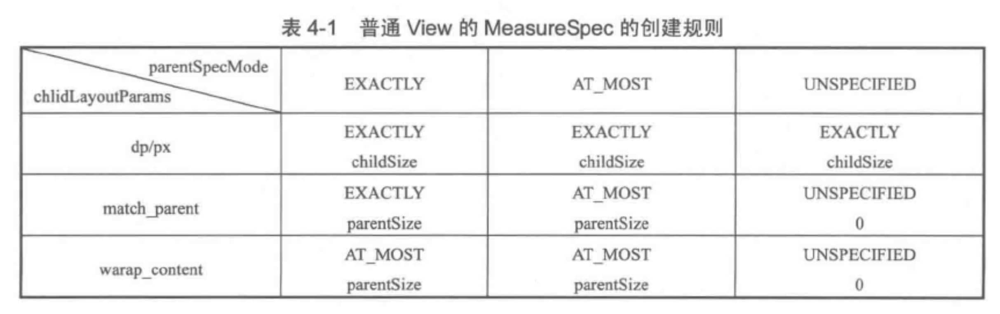

>   基于android-29

# 构造方法

LinearLayout的构造方法主要是读取xml设置的参数

# onMeasure

```java
@Override
protected void onMeasure(int widthMeasureSpec, int heightMeasureSpec) {
    if (mOrientation == VERTICAL) {
        measureVertical(widthMeasureSpec, heightMeasureSpec);
    } else {
        measureHorizontal(widthMeasureSpec, heightMeasureSpec);
    }
}
```

## measureVerticaly

LinearLayout有个选项：`android:measureWithLargestChild`，该属性为true的时候，所有带权重的子元素都会具有最大子元素的最小尺寸。一般为false，下面的分析只讨论false的情况。

```java
void measureVertical(int widthMeasureSpec, int heightMeasureSpec) {
    // 所有 childView 的高度和 + 本身的 padding，注意：它和 LinearLayout 本身的高度是不同的
    mTotalLength = 0;
    int maxWidth = 0;// 所有 childView 中宽度的最大值
    int childState = 0;
    int alternativeMaxWidth = 0;// 所有 layout_weight <= 0 的 childView 中宽度的最大值
    int weightedMaxWidth = 0;// 所有 layout_weight >0 的 childView 中宽度的最大值
    boolean allFillParent = true;
    float totalWeight = 0;// 所有 childView 的 weight 之和

    final int count = getVirtualChildCount();

    final int widthMode = MeasureSpec.getMode(widthMeasureSpec);
    final int heightMode = MeasureSpec.getMode(heightMeasureSpec);

    boolean matchWidth = false;
    boolean skippedMeasure = false;

    final int baselineChildIndex = mBaselineAlignedChildIndex;
    final boolean useLargestChild = mUseLargestChild;

    int largestChildHeight = Integer.MIN_VALUE;
    int consumedExcessSpace = 0;

    int nonSkippedChildCount = 0;

    // 计算每一个子View的高宽度
    for (int i = 0; i < count; ++i) {
        final View child = getVirtualChildAt(i);
        // ...
        final LayoutParams lp = (LayoutParams) child.getLayoutParams();

        totalWeight += lp.weight;

        final boolean useExcessSpace = lp.height == 0 && lp.weight > 0;
        if (heightMode == MeasureSpec.EXACTLY && useExcessSpace) {
            // Optimization: don't bother measuring children who are only
            // laid out using excess space. These views will get measured
            // later if we have space to distribute.
            final int totalLength = mTotalLength;
            mTotalLength = Math.max(totalLength, totalLength + lp.topMargin + lp.bottomMargin);
            skippedMeasure = true;
        } else {
            if (useExcessSpace) {
                // The heightMode is either UNSPECIFIED or AT_MOST, and
                // this child is only laid out using excess space. Measure
                // using WRAP_CONTENT so that we can find out the view's
                // optimal height. We'll restore the original height of 0
                // after measurement.
                lp.height = LayoutParams.WRAP_CONTENT;
            }

            // 如果之前或者当前的子View没有设置weight，就measure子View。
            final int usedHeight = totalWeight == 0 ? mTotalLength : 0;
            // measureChildBeforeLayout内部会调用子View的measure方法，开启子View的测试过程。
            measureChildBeforeLayout(child, i, widthMeasureSpec, 0,
                    heightMeasureSpec, usedHeight);

            final int childHeight = child.getMeasuredHeight();
            if (useExcessSpace) {
                // Restore the original height and record how much space
                // we've allocated to excess-only children so that we can
                // match the behavior of EXACTLY measurement.
                lp.height = 0;
                consumedExcessSpace += childHeight;
            }

            final int totalLength = mTotalLength;
            // 该子View的高度测量完成，将其加到mTotalLength
            mTotalLength = Math.max(totalLength, totalLength + childHeight + lp.topMargin +
                   lp.bottomMargin + getNextLocationOffset(child));

            // 。。。
        }

        // 。。。
		
        // 测量宽度部分
        boolean matchWidthLocally = false;
        // 子View需要match parent，而父View是wrap content的情况
        if (widthMode != MeasureSpec.EXACTLY && lp.width == LayoutParams.MATCH_PARENT) {
            matchWidth = true;
            matchWidthLocally = true;
        }

        final int margin = lp.leftMargin + lp.rightMargin;
        final int measuredWidth = child.getMeasuredWidth() + margin;
        maxWidth = Math.max(maxWidth, measuredWidth);
        childState = combineMeasuredStates(childState, child.getMeasuredState());

        allFillParent = allFillParent && lp.width == LayoutParams.MATCH_PARENT;
        if (lp.weight > 0) {
            /*
             * Widths of weighted Views are bogus if we end up
             * remeasuring, so keep them separate.
             */
            weightedMaxWidth = Math.max(weightedMaxWidth,
                    matchWidthLocally ? margin : measuredWidth);
        } else {
            alternativeMaxWidth = Math.max(alternativeMaxWidth,
                    matchWidthLocally ? margin : measuredWidth);
        }

        i += getChildrenSkipCount(child, i);
    }

    // 加上分割线的高度
    if (nonSkippedChildCount > 0 && hasDividerBeforeChildAt(count)) {
        mTotalLength += mDividerHeight;
    }

    // ...

    // 加上父View的padding
    mTotalLength += mPaddingTop + mPaddingBottom;

    int heightSize = mTotalLength;

    // Check against our minimum height
    heightSize = Math.max(heightSize, getSuggestedMinimumHeight());

    // 将计算的高度和heightMeasureSpec相协调，heightMeasureSpec的值受LinearLayout父View影响，比如不会超过父View的高度。
    int heightSizeAndState = resolveSizeAndState(heightSize, heightMeasureSpec, 0);
    heightSize = heightSizeAndState & MEASURED_SIZE_MASK;
    // remainingExcess可以认为是LinearLayout的高度减去以及测量过的高度的值，即未测量的剩余大小。
    int remainingExcess = heightSize - mTotalLength
            + (mAllowInconsistentMeasurement ? 0 : consumedExcessSpace);
    if (skippedMeasure
            || ((sRemeasureWeightedChildren || remainingExcess != 0) && totalWeight > 0.0f)) {
        float remainingWeightSum = mWeightSum > 0.0f ? mWeightSum : totalWeight;

        mTotalLength = 0;

        // 根据剩余空间计算子View的大小
        for (int i = 0; i < count; ++i) {
            final View child = getVirtualChildAt(i);
            if (child == null || child.getVisibility() == View.GONE) {
                continue;
            }

            final LayoutParams lp = (LayoutParams) child.getLayoutParams();
            final float childWeight = lp.weight;
            if (childWeight > 0) {
                // share为在剩余大小下，根据weight计算的大小
                final int share = (int) (childWeight * remainingExcess / remainingWeightSum);
                remainingExcess -= share;
                remainingWeightSum -= childWeight;

                final int childHeight;
                // 不考虑mUseLargestChild的情况
                if (mUseLargestChild && heightMode != MeasureSpec.EXACTLY) {
                    childHeight = largestChildHeight;
                } else if (lp.height == 0 && (!mAllowInconsistentMeasurement
                        || heightMode == MeasureSpec.EXACTLY)) {
                    // 如果子View高度为0，且LinearLayout的高度是精确值，那么子View就使用share的值。
                    childHeight = share;
                } else {
                    // 如果子View的高度有值，那么就加上share值。
                    childHeight = child.getMeasuredHeight() + share;
                }

                final int childHeightMeasureSpec = MeasureSpec.makeMeasureSpec(
                        Math.max(0, childHeight), MeasureSpec.EXACTLY);
                final int childWidthMeasureSpec = getChildMeasureSpec(widthMeasureSpec,
                        mPaddingLeft + mPaddingRight + lp.leftMargin + lp.rightMargin,
                        lp.width);
                child.measure(childWidthMeasureSpec, childHeightMeasureSpec);
                childState = combineMeasuredStates(childState, child.getMeasuredState()
                        & (MEASURED_STATE_MASK>>MEASURED_HEIGHT_STATE_SHIFT));
            }

            final int margin =  lp.leftMargin + lp.rightMargin;
            final int measuredWidth = child.getMeasuredWidth() + margin;
            maxWidth = Math.max(maxWidth, measuredWidth);

            boolean matchWidthLocally = widthMode != MeasureSpec.EXACTLY &&
                    lp.width == LayoutParams.MATCH_PARENT;

            alternativeMaxWidth = Math.max(alternativeMaxWidth,
                    matchWidthLocally ? margin : measuredWidth);

            allFillParent = allFillParent && lp.width == LayoutParams.MATCH_PARENT;

            final int totalLength = mTotalLength;
            mTotalLength = Math.max(totalLength, totalLength + child.getMeasuredHeight() +
                    lp.topMargin + lp.bottomMargin + getNextLocationOffset(child));
        }

        // Add in our padding
        mTotalLength += mPaddingTop + mPaddingBottom;
    } else {
        alternativeMaxWidth = Math.max(alternativeMaxWidth,
                                       weightedMaxWidth);
        // ...
    }

    if (!allFillParent && widthMode != MeasureSpec.EXACTLY) {
        maxWidth = alternativeMaxWidth;
    }

    maxWidth += mPaddingLeft + mPaddingRight;

    // maxWidth为加上padding、子View的margin以及最大子View宽度
    maxWidth = Math.max(maxWidth, getSuggestedMinimumWidth());

    // 这一步设置之后，LinearLayout可以getMeasureXXX了。
    setMeasuredDimension(resolveSizeAndState(maxWidth, widthMeasureSpec, childState),
            heightSizeAndState);

    if (matchWidth) {
        forceUniformWidth(count, heightMeasureSpec);
    }
}
```

### measureChildBeforeLayout

```java
void measureChildBeforeLayout(View child, int childIndex,
        int widthMeasureSpec, int totalWidth, int heightMeasureSpec,
        int totalHeight) {
    measureChildWithMargins(child, widthMeasureSpec, totalWidth,
            heightMeasureSpec, totalHeight);
}
```

### ViewGroup#measureChildWithMargins

```java
protected void measureChildWithMargins(View child,
        int parentWidthMeasureSpec, int widthUsed,
        int parentHeightMeasureSpec, int heightUsed) {
    final MarginLayoutParams lp = (MarginLayoutParams) child.getLayoutParams();

    // 测量子View过程中，会加上父View设定的padding和子View设定的margin。
    final int childWidthMeasureSpec = getChildMeasureSpec(parentWidthMeasureSpec,
            mPaddingLeft + mPaddingRight + lp.leftMargin + lp.rightMargin
                    + widthUsed, lp.width);
    final int childHeightMeasureSpec = getChildMeasureSpec(parentHeightMeasureSpec,
            mPaddingTop + mPaddingBottom + lp.topMargin + lp.bottomMargin
                    + heightUsed, lp.height);

    child.measure(childWidthMeasureSpec, childHeightMeasureSpec);
}
```

### ViewGroup#getChildMeasureSpec

```java
// spec是父View的spec
public static int getChildMeasureSpec(int spec, int padding, int childDimension) {
    int specMode = MeasureSpec.getMode(spec);
    int specSize = MeasureSpec.getSize(spec);

    // 父View还剩下的空间
    int size = Math.max(0, specSize - padding);

    int resultSize = 0;
    int resultMode = 0;

    switch (specMode) {
    case MeasureSpec.EXACTLY:
        if (childDimension >= 0) {
            resultSize = childDimension;
            resultMode = MeasureSpec.EXACTLY;
        } else if (childDimension == LayoutParams.MATCH_PARENT) {
            resultSize = size;
            resultMode = MeasureSpec.EXACTLY;
        } else if (childDimension == LayoutParams.WRAP_CONTENT) {
            resultSize = size;
            resultMode = MeasureSpec.AT_MOST;
        }
        break;

    case MeasureSpec.AT_MOST:
        if (childDimension >= 0) {
            resultSize = childDimension;
            resultMode = MeasureSpec.EXACTLY;
        } else if (childDimension == LayoutParams.MATCH_PARENT) {
            resultSize = size;
            resultMode = MeasureSpec.AT_MOST;
        } else if (childDimension == LayoutParams.WRAP_CONTENT) {
            resultSize = size;
            resultMode = MeasureSpec.AT_MOST;
        }
        break;

    // Parent asked to see how big we want to be
    case MeasureSpec.UNSPECIFIED:
        if (childDimension >= 0) {
            // Child wants a specific size... let him have it
            resultSize = childDimension;
            resultMode = MeasureSpec.EXACTLY;
        } else if (childDimension == LayoutParams.MATCH_PARENT) {
            // Child wants to be our size... find out how big it should
            // be
            resultSize = View.sUseZeroUnspecifiedMeasureSpec ? 0 : size;
            resultMode = MeasureSpec.UNSPECIFIED;
        } else if (childDimension == LayoutParams.WRAP_CONTENT) {
            // Child wants to determine its own size.... find out how
            // big it should be
            resultSize = View.sUseZeroUnspecifiedMeasureSpec ? 0 : size;
            resultMode = MeasureSpec.UNSPECIFIED;
        }
        break;
    }
    //noinspection ResourceType
    return MeasureSpec.makeMeasureSpec(resultSize, resultMode);
}
```



### View#resolveSizeAndState

```java
public static int resolveSizeAndState(int size, int measureSpec, int childMeasuredState) {
    final int specMode = MeasureSpec.getMode(measureSpec);
    final int specSize = MeasureSpec.getSize(measureSpec);
    final int result;
    switch (specMode) {
        case MeasureSpec.AT_MOST:
            if (specSize < size) {
                result = specSize | MEASURED_STATE_TOO_SMALL;
            } else {
                result = size;
            }
            break;
        case MeasureSpec.EXACTLY:
            result = specSize;
            break;
        case MeasureSpec.UNSPECIFIED:
        default:
            result = size;
    }
    return result | (childMeasuredState & MEASURED_STATE_MASK);
}
```

resolveSizeAndState方法的作用是将size（测量的中间值）和measureSpec相协调。measureSpec和父View有关。

-   如果View设置的是wrap content，那么View的大小不会超过specSize。
-   如果View的大小是精确值，那么就使用该值。

### 小结

垂直方向的几种情况：

测量的结果会加上LinearLayout的padding以及子View的margin。如果没有特殊说明，下面总结说的值都是加上这部分值的。

1.  子View不使用weight的情况
    依次调用子View的measure方法，测量子View。
    如果LinearLayout的宽度有确切的值（指定值或者match parent），那么measure的结果就是该值。
    如果LinearLayout的宽度没有确切的值（wrap content），measure的结果是子View最大宽度，且不超过LinearLayout父View的宽度（见View#resolveSizeAndState）。
    LinearLayout的高度同理，有一点不同，如果LinearLayout的高度是wrap content，那么measure的结果是子View高度的总和，且不超过LinearLayout父View的高度。
2.  子View存在使用weight的情况
    在依次measure子View的过程中，如果发现有一个子View设置了weight，那么
    如果LinearLayout的高度是精确值，
3.  没有子View的情况
    和View的情况差不多，要么使用设定的初始值（指定的宽高或者背景宽高），要么是0。

