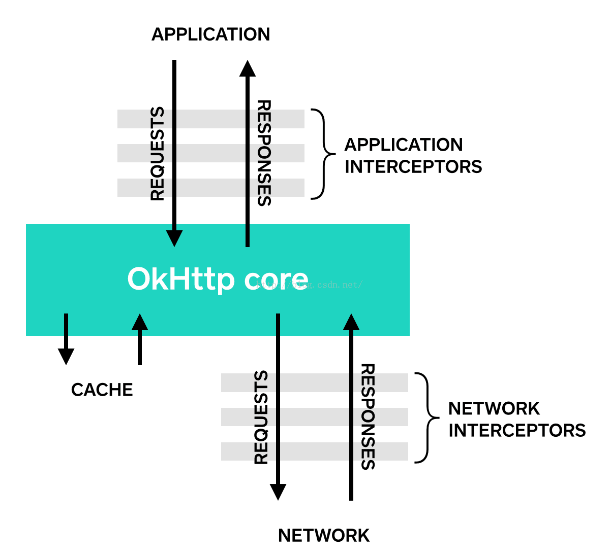
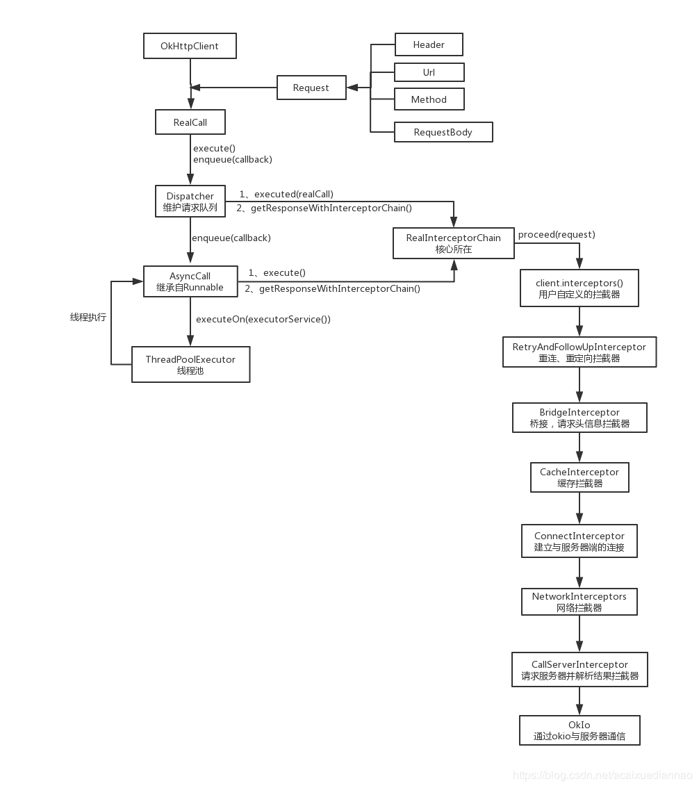

# 基本使用

[OkHttp3](../Android/OkHttp3.md)

# OkHttpClient

OkHttpClient本质是一个构建Call的工厂，一般在应用中以单例的形式存在。

## 构造方法

可以用这种方式

```
OkHttpClient client = new OkHttpClient();
```

也可以以build方式构造

```java
OkHttpClient client = new OkHttpClient.Builder()
        .build();
```

以build方式构造的话，可以自定义一些配置，否则就用默认的。

主要是将http请求的一些配置封装到client对象中。

## newBuilder

```java
public Builder newBuilder() {
  return new Builder(this);
}
```

newBuilder是将浅拷贝当前的Client，并且可以在当前Client配置的基础上继续配置。

## newCall

```java
public Call newCall(Request request) {
    return RealCall.newRealCall(this, request, false /* for web socket */);
}
```

构建Call对象，Call是网络请求的主要对象。

## newWebSocket

TODO

# Request

Request主要是对网络请求的参数进行封装，内部的核心成员变量都是final的，意味着创建完Request之后就不会再改变其内容。

```java
Request request = new Request.Builder()
  .url("url")
  .build();
```

用Builder模式创建Request对象。

主要是把请求的url、method、header全部封装到Request对象中；

另外，看Builder的构造方法

```java
public Builder() {
  this.method = "GET";
  this.headers = new Headers.Builder();
}
```

可以发现默认是GET请求方式。

最后调用build方法构造出Request对象。

# call

OkHttp使用Call抽象出一个满足请求的模型，尽管中间可能会有多个请求或响应。执行Call有两种方式，同步或异步。

创建完Client对象和Request对象后，调用Client的newCall方法创建Call对象：

```java
Call call = client.newCall(request);
```

Call的newCall方法：

```java
@Override public Call newCall(Request request) {
  return RealCall.newRealCall(this, request, false /* for web socket */);
}
```

```java
static RealCall newRealCall(OkHttpClient client, Request originalRequest, boolean forWebSocket) {
  // Safely publish the Call instance to the EventListener.
  RealCall call = new RealCall(client, originalRequest, forWebSocket);
  call.eventListener = client.eventListenerFactory().create(call);
  return call;
}
```

Call是一个接口，其具体实现是RealCall。

newCall主要是创建了Call对象。

真正的网络请求逻辑是在enqueue或execute方法中。

## 异步请求enqueue

上面说Call的具体实现是RealCall，所以这里调用的是RealCall的enqueue方法

```java
@Override public void enqueue(Callback responseCallback) {
  synchronized (this) {
    if (executed) throw new IllegalStateException("Already Executed");
    executed = true;
  }
  captureCallStackTrace();
  eventListener.callStart(this);
  client.dispatcher().enqueue(new AsyncCall(responseCallback));
}
```

主要看最后一行。

先是将Callback进行封装为一个异步请求AsyncCall。

然后调用了Client中的Dispatcher的enqueue方法进行请求

```java
void enqueue(AsyncCall call) {
  synchronized (this) {
    readyAsyncCalls.add(call);
  }
  promoteAndExecute();
}
```

readyAsyncCalls是一个准备队列，这里将任务放入队列准备运行。

```java
private final Deque<AsyncCall> readyAsyncCalls = new ArrayDeque<>();
```

promoteAndExecute是将这些任务放入运行队列，并

```java
private boolean promoteAndExecute() {
  assert (!Thread.holdsLock(this));

  List<AsyncCall> executableCalls = new ArrayList<>();
  boolean isRunning;
  //从readyAsyncCalls取出，放入runningAsyncCalls，runningAsyncCalls和readyAsyncCalls一样，也是一个ArrayDeque队列。
  synchronized (this) {
    for (Iterator<AsyncCall> i = readyAsyncCalls.iterator(); i.hasNext(); ) {
      AsyncCall asyncCall = i.next();

      if (runningAsyncCalls.size() >= maxRequests) break;
      if (runningCallsForHost(asyncCall) >= maxRequestsPerHost) continue;

      i.remove();
      executableCalls.add(asyncCall);
      runningAsyncCalls.add(asyncCall);
    }
    isRunning = runningCallsCount() > 0;
  }

  for (int i = 0, size = executableCalls.size(); i < size; i++) {
    AsyncCall asyncCall = executableCalls.get(i);
    asyncCall.executeOn(executorService());//executorService()方法返回一个线程池，然后调用AsyncCall的executeOn方法执行任务。
  }

  return isRunning;
}
```

AsyncCall的executeOn方法

```java
void executeOn(ExecutorService executorService) {
  assert (!Thread.holdsLock(client.dispatcher()));
  boolean success = false;
  try {
    executorService.execute(this);
    success = true;
  } catch (RejectedExecutionException e) {
    InterruptedIOException ioException = new InterruptedIOException("executor rejected");
    ioException.initCause(e);
    eventListener.callFailed(RealCall.this, ioException);
    responseCallback.onFailure(RealCall.this, ioException);//出错就回调Callback的onFailure方法
  } finally {
    if (!success) {
      client.dispatcher().finished(this); 
    }
  }
}
```

回顾一下线程池的运行流程：

1. 创建一个线程池
2. 创建一个Runnable对象，重写其run方法
3. 将Runnable对象传入线程池的execute方法
4. 线程池内部会调用Runnable对象的run方法

这里的AsyncCall继承了NamedRunnable，NamedRunnable实现了Runnable接口，在run方法中，会调用execute方法。所以任务的逻辑在AsyncCall的execute方法中。

```java
@Override protected void execute() {
  boolean signalledCallback = false;
  timeout.enter();
  try {
    Response response = getResponseWithInterceptorChain();
    if (retryAndFollowUpInterceptor.isCanceled()) {
      signalledCallback = true;
      responseCallback.onFailure(RealCall.this, new IOException("Canceled"));
    } else {
      signalledCallback = true;
      responseCallback.onResponse(RealCall.this, response);
    }
  } catch (IOException e) {
    e = timeoutExit(e);
    if (signalledCallback) {
      // Do not signal the callback twice!
      Platform.get().log(INFO, "Callback failure for " + toLoggableString(), e);
    } else {
      eventListener.callFailed(RealCall.this, e);
      responseCallback.onFailure(RealCall.this, e);
    }
  } finally {
    client.dispatcher().finished(this);
  }
}
```

通过getResponseWithInterceptorChain来获取响应体。

```java
Response getResponseWithInterceptorChain() throws IOException {
  // Build a full stack of interceptors.
  List<Interceptor> interceptors = new ArrayList<>();
  interceptors.addAll(client.interceptors());
  interceptors.add(retryAndFollowUpInterceptor);
  interceptors.add(new BridgeInterceptor(client.cookieJar()));
  interceptors.add(new CacheInterceptor(client.internalCache()));
  interceptors.add(new ConnectInterceptor(client));
  if (!forWebSocket) {
    interceptors.addAll(client.networkInterceptors());
  }
  interceptors.add(new CallServerInterceptor(forWebSocket));

  Interceptor.Chain chain = new RealInterceptorChain(interceptors, null, null, null, 0,
      originalRequest, this, eventListener, client.connectTimeoutMillis(),
      client.readTimeoutMillis(), client.writeTimeoutMillis());

  return chain.proceed(originalRequest);
}
```

这里先添加用户创建的应用拦截器，然后添加几个默认的应用拦截器，这里最后添加的应用拦截器ConnectInterceptor要注意，再添加用户创建的网络拦截器，最后添加一个网络拦截器CallServerInterceptor，这个也要注意。OkHttp的网络请求是链式调用的，如图所示：



拦截器运用了典型的责任链模式。这里主要看最后的应用拦截器和最后的网络拦截器。

## 同步请求execute

```java
@Override public Response execute() throws IOException {
  synchronized (this) {
    if (executed) throw new IllegalStateException("Already Executed");
    executed = true;
  }
  captureCallStackTrace();
  timeout.enter();
  eventListener.callStart(this);
  try {
    client.dispatcher().executed(this);//将任务放入runningSyncCalls
    Response result = getResponseWithInterceptorChain();
    if (result == null) throw new IOException("Canceled");
    return result;
  } catch (IOException e) {
    e = timeoutExit(e);
    eventListener.callFailed(this, e);
    throw e;
  } finally {
    client.dispatcher().finished(this);
  }
}
```

这里添加synchronized来保证同步执行，与异步不同的是，异步会将任务放入准备队列readyAsyncCalls来排队，然后放入runningSyncCalls来执行，而这里直接将任务放入runningSyncCalls。

最后调用getResponseWithInterceptorChain获取Response，这里和异步就一样了。

# ConnectInterceptor

弄一个RealConnection对象，然后打开Socket链接

# CallServerInterceptor

向服务器以流的方式写入请求，然后获取响应，将响应封装成Response返回上一个拦截器。

这里的流操作是通过Okio来进行流操作。

# 总结

## 原理

OkHttp的底层是通过Socket发送HTTP请求与接受响应的。

## 思路



# 参考

OkHttp之ConnectInterceptor简单分析https://blog.csdn.net/chunqiuwei/article/details/73350657

Okhttp之CallServerInterceptor简单分析https://blog.csdn.net/chunqiuwei/article/details/76767500

OkHttp3源码分析https://blog.csdn.net/acaixuediannao/article/details/87698195